<div align="center">

# 🏗️ **AI Career Mentor — System Architecture**

**Complete Technical Architecture Documentation with Mermaid Diagrams**


</div>

---

## 📑 **Table of Contents**

| # | Section | 🔗 |
|---|---------|-----|
| 1 | [🌐 High-Level System Architecture](#1-high-level-system-architecture) |
| 2 | [🧠 LangGraph DAG Orchestration](#2-langgraph-dag-orchestration) |
| 3 | [🎤 Mock Interview FSM State Machine](#3-mock-interview-fsm-state-machine) |
| 4 | [🎙️ Voice Assistant Pipeline (Anya)](#4-voice-assistant-pipeline-anya) |
| 5 | [🛡️ Agent Registry & Circuit Breaker](#5-agent-registry--circuit-breaker) |
| 6 | [⚡ API Gateway & Middleware Stack](#6-api-gateway--middleware-stack) |
| 7 | [🗃️ Database Entity Relationship Diagram](#7-database-entity-relationship-diagram) |
| 8 | [💻 Frontend Component Architecture](#8-frontend-component-architecture) |
| 9 | [☁️ Deployment Topology](#9-deployment-topology) |
| 10 | [🔄 Data Flow: Full Career Analysis](#10-data-flow-full-career-analysis) |
| 11 | [📄 Data Flow: Resume Upload & Analysis](#11-data-flow-resume-upload--analysis) |
| 12 | [📈 Data Flow: Market Intelligence](#12-data-flow-market-intelligence) |
| 13 | [🚦 Rate Limiting Architecture](#13-rate-limiting-architecture) |
| 14 | [🧬 RAG & Resource Enrichment Pipeline](#14-rag--resource-enrichment-pipeline) |
| 15 | [🔒 Authentication Flow](#15-authentication-flow) |
| 16 | [🚇 WebSocket Communication Protocol](#16-websocket-communication-protocol) |
| 17 | [🧪 Test Architecture & Coverage](#17-test-architecture--coverage) |
| 18 | [⚙️ CI/CD Pipeline Architecture](#18-cicd-pipeline-architecture) |

---

## 1. 🌐 **High-Level System Architecture**

### 🧭 **System Overview (30,000 ft View)**

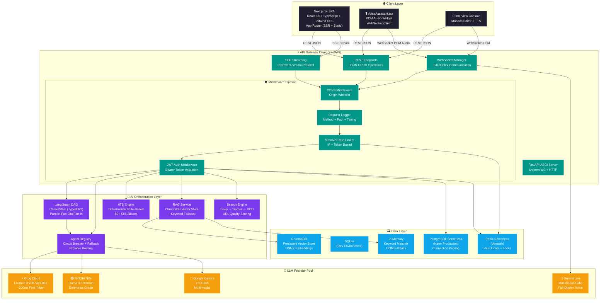

### 📡 **Communication Protocol Matrix**

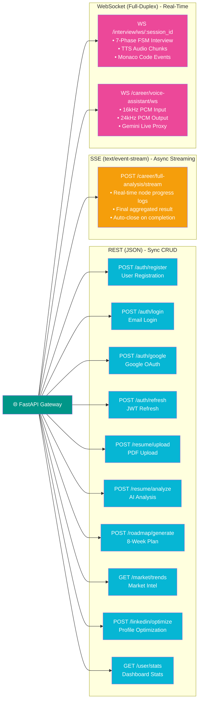

### 🔄 **Complete Request Lifecycle**

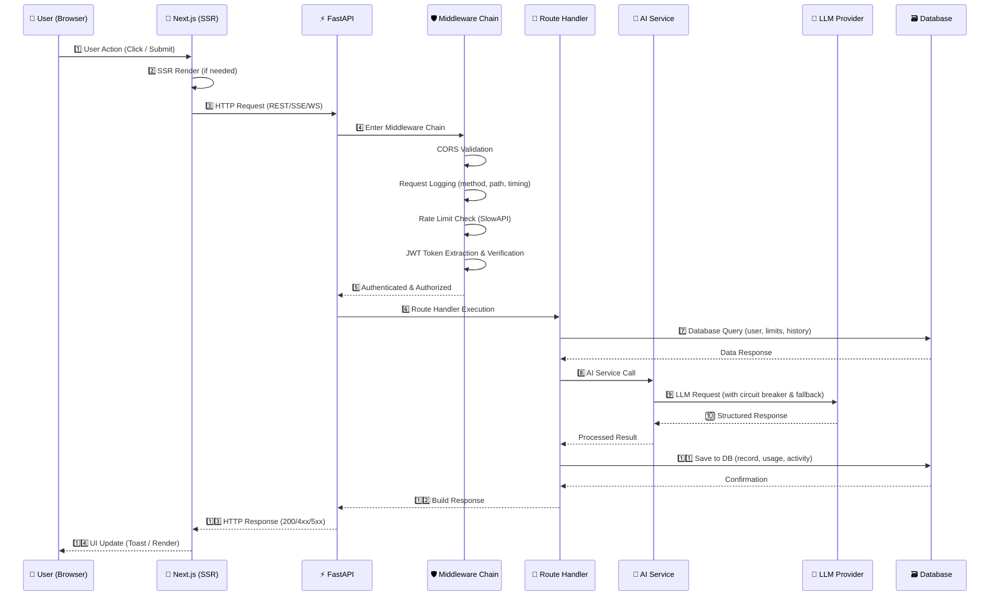

---

## 2. 🧠 **LangGraph DAG Orchestration**

### 🧭 **Career AI Operating System**

The Career AI OS uses a **static DAG (Directed Acyclic Graph)** with **parallel fan-out/fan-in execution**. Total pipeline latency = `max(resume, market) + max(linkedin, roadmap)`.

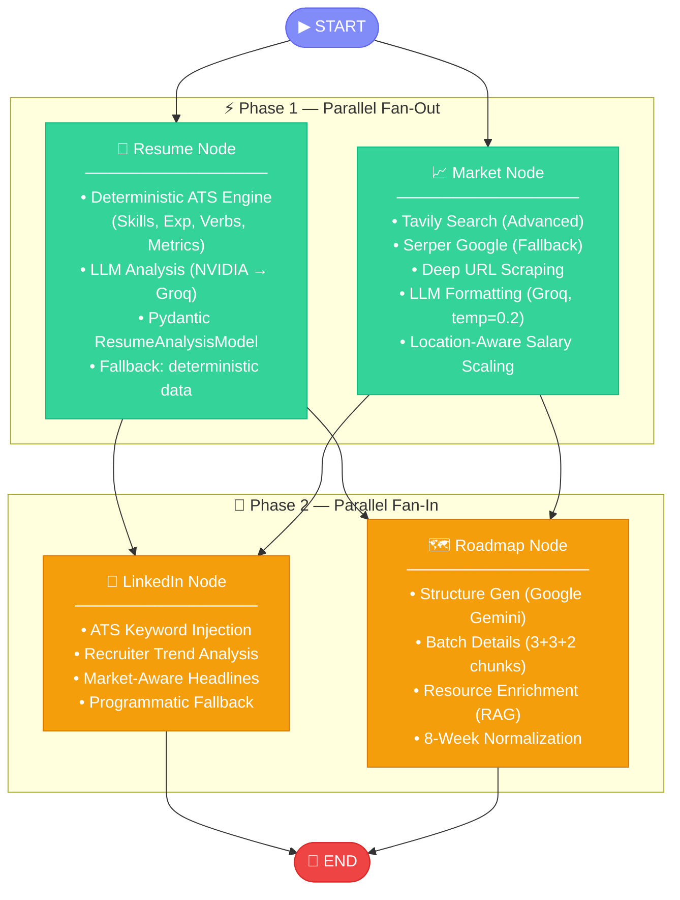

### 📊 **State Schema (TypedDict)**

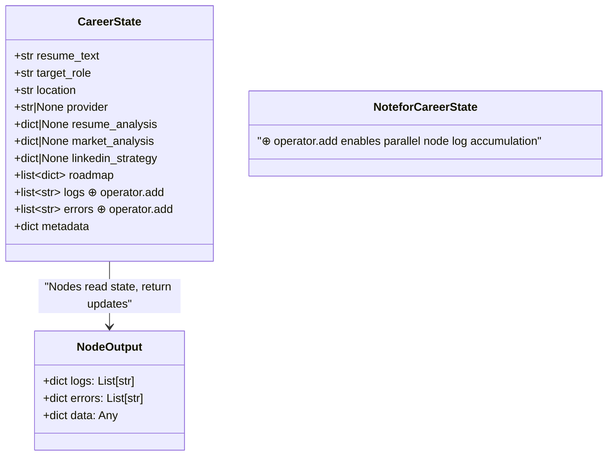

### 🔗 **Node Dependency Matrix**

| Node | Requires | Provides | Latency Factor | Fallback Strategy |
|------|----------|----------|:--------------:|-------------------|
| **📄 Resume** | `resume_text` | `resume_analysis` | High (LLM) | Deterministic ATS data |
| **📈 Market** | `target_role`, `location` | `market_analysis` | High (Search + LLM) | Unavailable response |
| **🔗 LinkedIn** | `resume_analysis`, `market_analysis` | `linkedin_strategy` | Medium (LLM) | Programmatic strategy |
| **🗺️ Roadmap** | `resume_analysis`, `market_analysis` | `roadmap[]` | Very High (LLM + RAG) | Fallback skeleton |

### 📐 **Pipeline Timing Breakdown**

```mermaid
gantt
    title Career Analysis Pipeline Timing (~60s total)
    dateFormat  X
    axisFormat %s
    
    section Phase 1 (Parallel)
    Resume Node (ATS + LLM)    : 0, 15
    Market Node (Search + LLM) : 0, 20
    
    section Phase 2 (Parallel)
    LinkedIn Node (LLM)        : 20, 10
    Roadmap Node (LLM + RAG)   : 20, 35
    
    section Finalize
    Save + Stream Result       : 55, 5
```

---

## 3. 🎤 **Mock Interview FSM (State Machine)**

### 🧭 **7-Phase Finite State Machine Overview**

The interview engine uses a **strict unidirectional state machine** with **7 phases + feedback**. Each phase has specific prompts, evaluation criteria, and transition rules.

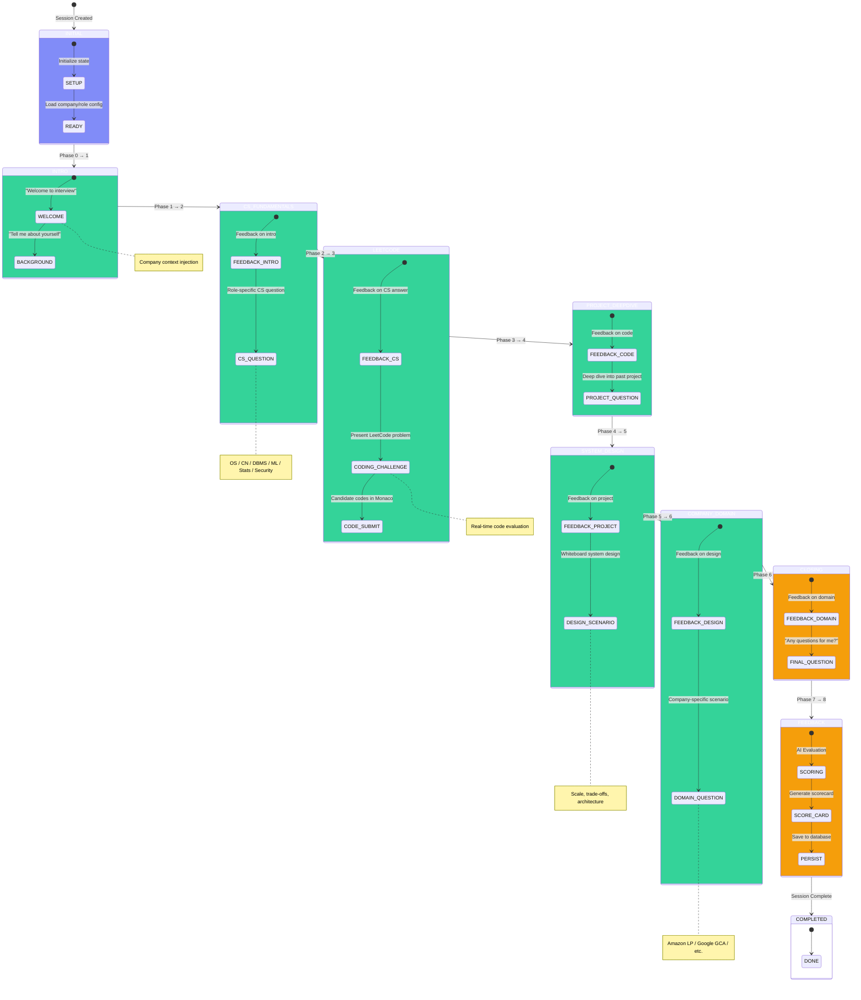

### 🎯 **Role Category Adaptation Matrix**

The FSM dynamically adjusts phase content based on the candidate's target role category:

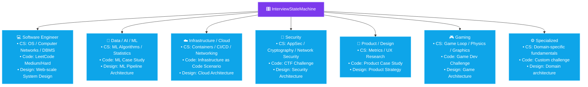

### 📋 **Phase Configuration Details**

| Phase | Name | Duration | Questions | Evaluation Criteria |
|:----:|------|:--------:|:---------:|-------------------|
| 0 | **INITIAL** | Instant | — | Session setup |
| 1 | **INTRO** | 2-3 min | 2-3 | Communication, background fit |
| 2 | **CS_FUNDAMENTALS** | 3-5 min | 1-2 | Technical depth, role-specific |
| 3 | **LEETCODE** | 10-15 min | 1 | Code quality, algorithms, optimization |
| 4 | **PROJECT_DEEPDIVE** | 3-5 min | 1-2 | Architecture decisions, impact |
| 5 | **SYSTEM_DESIGN** | 8-12 min | 1 | Scalability, trade-offs, communication |
| 6 | **COMPANY_DOMAIN** | 3-5 min | 1 | Company-specific knowledge |
| 7 | **CLOSING** | 2-3 min | 1-2 | Curiosity, engagement |
| 8 | **FEEDBACK** | Instant | — | Automated scoring |

### 📊 **Scoring Rubric**

| Category | Weight | Metrics |
|----------|:-----:|---------|
| **Technical Accuracy** | 30% | Correctness, depth, completeness |
| **Communication** | 20% | Clarity, structure, engagement |
| **Code Quality** | 20% | Efficiency, readability, edge cases |
| **System Design** | 15% | Scalability, trade-off analysis |
| **Cultural Fit** | 15% | Company alignment, enthusiasm |

---

## 4. 🎙️ **Voice Assistant Pipeline (Anya)**

### 🌐 **End-to-End Voice Architecture**

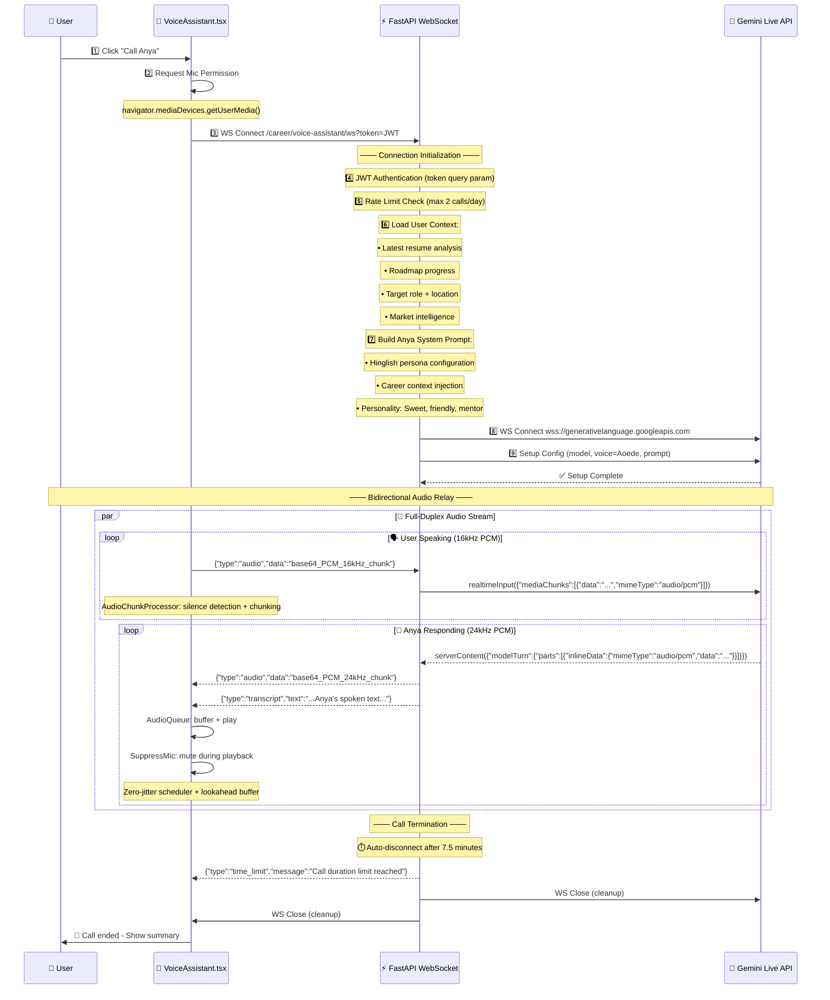

### 🧩 **Voice Assistant Component Architecture**

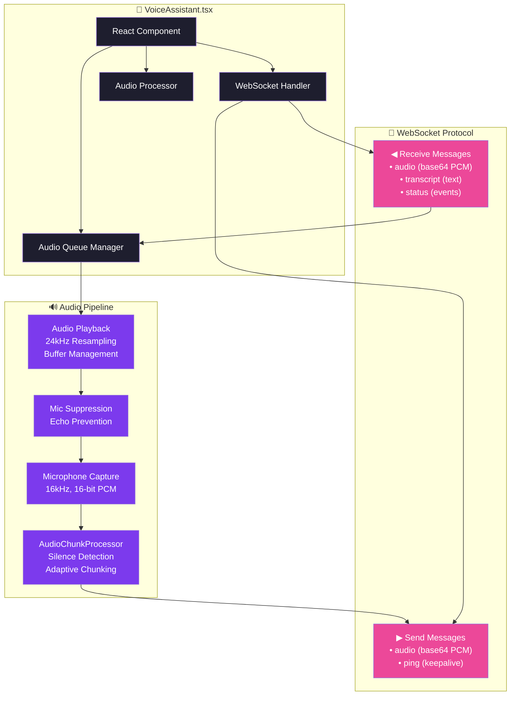

### 🧬 **Anya's Personality Configuration**

```json
{
  "name": "Anya 🎀",
  "language": "Hinglish (Hindi + English)",
  "tone": "Sweet, friendly, encouraging, mentor",
  "voice": "Google Aoede (Gemini Live Voice)",
  "personality_traits": [
    "🎯 Career-focused and practical",
    "💪 Motivational and uplifting",
    "🎓 Knowledgeable yet humble",
    "😂 Uses light humor and emojis",
    "🇮🇳 Mixes Hindi and English naturally"
  ],
  "context_awareness": [
    "📄 Knows your latest resume analysis",
    "🗺️ Tracks your roadmap progress",
    "🎯 Remembers your target role",
    "📍 Aware of your location/market"
  ],
  "safety_controls": {
    "max_call_duration": "7.5 minutes",
    "daily_call_limit": 2,
    "content_filter": "Always professional and constructive"
  }
}
```

---

## 5. 🛡️ **Agent Registry & Circuit Breaker**

### 🧭 **Unified LLM Caller Architecture**

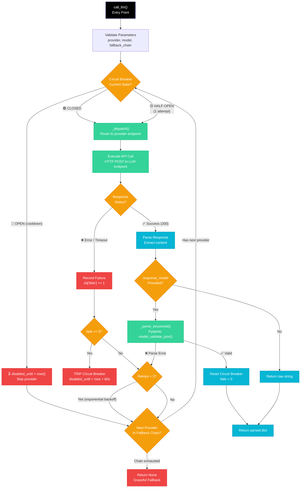

### 🛡️ **Circuit Breaker State Machine**

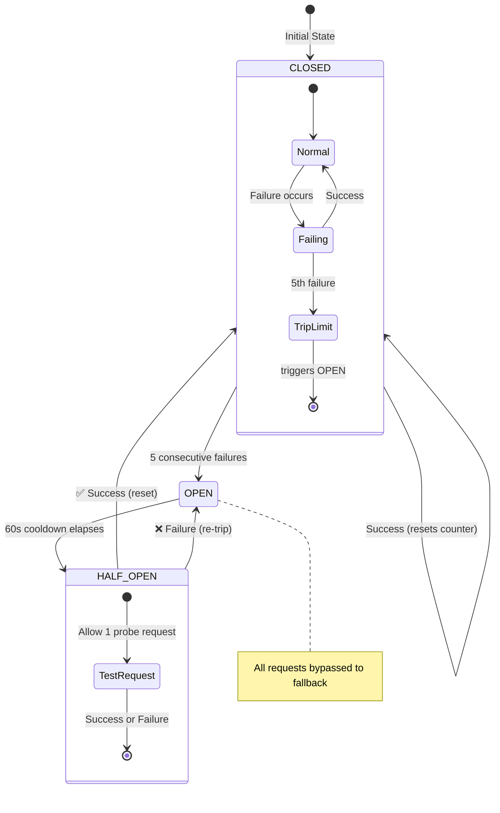

### 📋 **Provider Configuration & Fallback Chains**

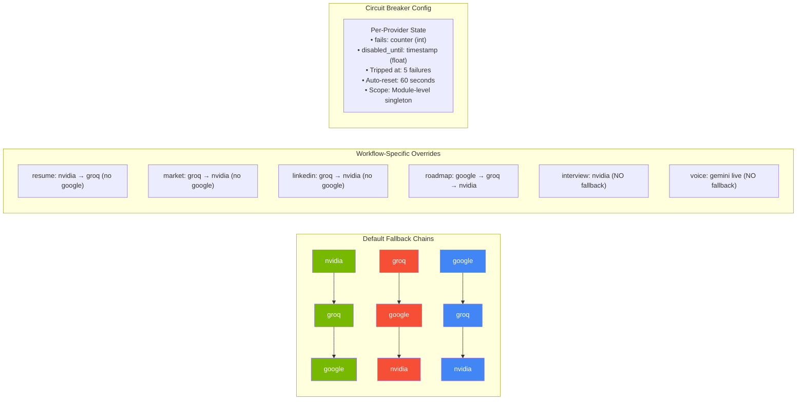

### 📊 **Provider Performance Comparison**

| Provider | Avg Latency | Cost/1K Tokens | Rate Limit | Best For |
|----------|:----------:|:--------------:|:----------:|----------|
| **⚡ Groq** | ~200ms | $0.00059 / $0.00079 | 30 req/min | Speed (Market, LinkedIn) |
| **🟢 NVIDIA** | ~500ms | $0.00070 / $0.00070 | 100 req/min | Stability (Resume, Interview) |
| **🔵 Gemini** | ~800ms | Free tier ($0) | 60 req/min | Quality (Roadmap structure) |

---

## 6. ⚡ **API Gateway & Middleware Stack**

### 🧭 **Middleware Pipeline Architecture**

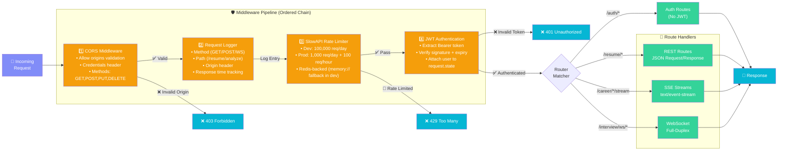

### 📋 **Complete Route Map**

```mermaid
graph TD
    classDef auth fill:#06b6d4,color:#fff,stroke:#0891b2
    classDef resume fill:#818cf8,color:#fff,stroke:#6366f1
    classDef roadmap fill:#f59e0b,color:#fff,stroke:#d97706
    classDef market fill:#34d399,color:#fff,stroke:#10b981
    classDef career fill:#ec4899,color:#fff,stroke:#db2777
    classDef linkedin fill:#a78bfa,color:#fff,stroke:#8b5cf6
    classDef user fill:#0ea5e9,color:#fff,stroke:#0284c7
    classDef interview fill:#f97316,color:#fff,stroke:#ea580c
    classDef voice fill:#14b8a6,color:#fff,stroke:#0d9488
    classDef health fill:#6b7280,color:#fff,stroke:#4b5563

    APP["FastAPI App<br/>version: 1.0.0"]
    
    APP -->|"🔓 Public"| H_AUTH["/auth"]
    APP -->|"🔒 Protected"| H_RESUME["/resume"]
    APP -->|"🔒 Protected"| H_ROADMAP["/roadmap"]
    APP -->|"🔒 Protected"| H_MARKET["/market"]
    APP -->|"🔒 Protected"| H_CAREER["/career"]
    APP -->|"🔒 Protected"| H_LINKEDIN["/linkedin"]
    APP -->|"🔒 Protected"| H_USER["/user"]
    APP -->|"🔓 Public"| H_INTERVIEW["/interview"]
    APP -->|"🔓 Public"| H_VOICE["/career/voice-assistant"]
    APP -->|"🔓 Public"| H_HEALTH["/health"]
    
    H_AUTH --> A1["POST /register"]
    H_AUTH --> A2["POST /login"]
    H_AUTH --> A3["POST /google"]
    H_AUTH --> A4["POST /refresh"]
    
    H_RESUME --> R1["POST /upload"]
    H_RESUME --> R2["POST /analyze"]
    
    H_ROADMAP --> RO1["POST /generate"]
    H_ROADMAP --> RO2["GET /history"]
    H_ROADMAP --> RO3["DELETE /{id}"]
    H_ROADMAP --> RO4["PUT /{id}/toggle-week/{n}"]
    H_ROADMAP --> RO5["GET /{id}/quiz/{n}"]
    
    H_MARKET --> M1["GET /config"]
    H_MARKET --> M2["GET /trends"]
    H_MARKET --> M3["GET /history"]
    H_MARKET --> M4["DELETE /{id}"]
    
    H_CAREER --> C1["POST /full-analysis/stream"]
    
    H_LINKEDIN --> L1["POST /optimize"]
    
    H_USER --> U1["GET /stats"]
    
    H_INTERVIEW --> I1["GET /history"]
    H_INTERVIEW --> I2["GET /{session_id}"]
    H_INTERVIEW --> I3["DELETE /{session_id}"]
    
    H_VOICE --> V1["WS /ws"]
    
    H_HEALTH --> H1["GET /health"]
    H_HEALTH --> H2["GET /ping"]
    H_HEALTH --> H3["GET /"]

    class H_AUTH,A1,A2,A3,A4 auth
    class H_RESUME,R1,R2 resume
    class H_ROADMAP,RO1,RO2,RO3,RO4,RO5 roadmap
    class H_MARKET,M1,M2,M3,M4 market
    class H_CAREER,C1 career
    class H_LINKEDIN,L1 linkedin
    class H_USER,U1 user
    class H_INTERVIEW,I1,I2,I3 interview
    class H_VOICE,V1 voice
    class H_HEALTH,H1,H2,H3 health
```

### ⚡ **SSE Streaming Protocol Details**

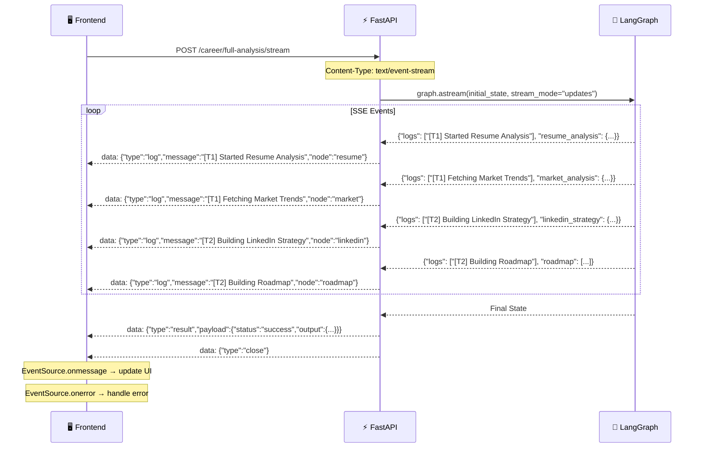

---

## 7. 🗃️ **Database Entity Relationship Diagram**

### 📐 **Complete ERD**

```mermaid
erDiagram
    classDef user fill:#818cf8,color:#fff
    classDef resume fill:#34d399,color:#fff
    classDef roadmap fill:#f59e0b,color:#fff
    classDef market fill:#06b6d4,color:#fff
    classDef interview fill:#ec4899,color:#fff
    classDef log fill:#a78bfa,color:#fff

    users ||--o{ resumes : "has many (cascade delete)"
    users ||--o{ career_roadmaps : "has many (cascade delete)"
    users ||--o{ market_analyses : "has many (cascade delete)"
    users ||--o{ interview_sessions : "has many (cascade delete)"
    users ||--o{ activity_logs : "has many (cascade delete)"

    users {
        string id PK "UUID (auto-generated via uuid4)"
        string email UK "Unique, indexed for fast lookup"
        string name "User's full display name"
        string hashed_pw "Nullable — NULL for OAuth users"
        datetime created_at "Auto-set to UTC timestamp"
    }

    resumes {
        string id PK "UUID"
        string user_id FK "References users.id"
        string filename "Original PDF filename"
        json parsed_content "Full AI analysis result object"
        text raw_text "Extracted plain text from PDF"
        datetime uploaded_at "Auto timestamp"
    }

    career_roadmaps {
        string id PK "UUID"
        string user_id FK "References users.id"
        string target_role "e.g., 'Data Scientist', 'ML Engineer'"
        json steps "8-week plan array of week objects"
        datetime created_at "Auto timestamp (UTC)"
    }

    market_analyses {
        string id PK "UUID"
        string user_id FK "References users.id"
        string target_role "e.g., 'Full Stack Developer'"
        string location "e.g., 'Bangalore, India'"
        json analysis "Full market intelligence report object"
        datetime created_at "Auto timestamp"
    }

    interview_sessions {
        string id PK "UUID"
        string user_id FK "References users.id"
        string target_role "Role being interviewed for"
        json chat_history "Array of {role, content, timestamp} objects"
        float score "Final score out of 100 (nullable until completed)"
        string status "in_progress | completed"
        datetime created_at "Session creation timestamp"
        datetime completed_at "Session completion timestamp (nullable)"
    }

    activity_logs {
        string id PK "UUID"
        string user_id FK "References users.id"
        string action "Human-readable action description"
        string feature "Feature category: resume | roadmap | market | interview | linkedin | full_analysis"
        datetime created_at "Auto timestamp"
    }

    class users user
    class resumes resume
    class career_roadmaps roadmap
    class market_analyses market
    class interview_sessions interview
    class activity_logs log
```

### 📋 **Column Detail Reference**

| Table | Column | Type | Constraints | Description |
|-------|--------|------|:-----------:|-------------|
| **users** | `id` | `String` | PK, default `uuid4` | Unique user identifier |
| | `email` | `String` | UK, NOT NULL, INDEX | Login email |
| | `name` | `String` | NOT NULL | Display name |
| | `hashed_pw` | `String` | NULLABLE | bcrypt hash (NULL for Google OAuth) |
| | `created_at` | `DateTime` | default `now()` | Account creation timestamp |
| **resumes** | `id` | `String` | PK | Resume record ID |
| | `user_id` | `String` | FK → `users.id` | Owner |
| | `filename` | `String` | NOT NULL | Original filename |
| | `parsed_content` | `JSON` | NULLABLE | Full AI analysis result |
| | `raw_text` | `Text` | NULLABLE | Extracted PDF text |
| | `uploaded_at` | `DateTime` | default `now()` | Upload timestamp |
| **career_roadmaps** | `id` | `String` | PK | Roadmap ID |
| | `user_id` | `String` | FK → `users.id` | Owner |
| | `target_role` | `String` | NOT NULL | Target job role |
| | `steps` | `JSON` | NULLABLE | 8-week plan array |
| | `created_at` | `DateTime` | default `now()` | Creation timestamp |
| **market_analyses** | `id` | `String` | PK | Analysis ID |
| | `user_id` | `String` | FK → `users.id` | Owner |
| | `target_role` | `String` | NOT NULL | Target role |
| | `location` | `String` | NOT NULL | Target location |
| | `analysis` | `JSON` | NULLABLE | Market intelligence report |
| | `created_at` | `DateTime` | default `now()` | Analysis timestamp |
| **interview_sessions** | `id` | `String` | PK | Session ID |
| | `user_id` | `String` | FK → `users.id` | Owner |
| | `target_role` | `String` | NOT NULL | Interview role |
| | `chat_history` | `JSON` | NULLABLE | Message history |
| | `score` | `Float` | NULLABLE | Score 0-100 |
| | `status` | `String` | default `in_progress` | Session status |
| | `created_at` | `DateTime` | default `now()` | Start time |
| | `completed_at` | `DateTime` | NULLABLE | End time |
| **activity_logs** | `id` | `String` | PK | Log ID |
| | `user_id` | `String` | FK → `users.id` | Owner |
| | `action` | `String` | NOT NULL | Action description |
| | `feature` | `String` | NOT NULL | Feature category |
| | `created_at` | `DateTime` | default `now()` | Log timestamp |

---

## 8. 💻 **Frontend Component Architecture**

### 🧩 **Complete Component Tree**

```mermaid
graph TD
    classDef layout fill:#1e1e2e,color:#fff,stroke:#6c7086
    classDef dash fill:#0ea5e9,color:#fff,stroke:#38bdf8
    classDef shared fill:#7c3aed,color:#fff,stroke:#a78bfa
    classDef landing fill:#f59e0b,color:#fff,stroke:#fbbf24
    classDef svc fill:#34d399,color:#fff,stroke:#10b981

    ROOT["Root Layout<br/>layout.tsx"]
    
    ROOT --> LANDING["page.tsx<br/>🏠 Landing Page"]
    ROOT --> LOGIN["login/page.tsx<br/>🔐 Login"]
    ROOT --> REGISTER["register/page.tsx<br/>📝 Register"]
    ROOT --> DASH_LAYOUT["dashboard/layout.tsx<br/>🖥️ Dashboard Layout<br/>Sidebar + Navbar"]
    
    subgraph "🖥️ Dashboard Pages"
        DASH_LAYOUT --> D_HOME["dashboard/page.tsx<br/>📊 Stats + Charts + Activity"]
        DASH_LAYOUT --> D_RESUME["resume/page.tsx<br/>📄 Resume Upload + Analysis"]
        DASH_LAYOUT --> D_ROADMAP["roadmap/page.tsx<br/>🗺️ Gamified Learning Tracker"]
        DASH_LAYOUT --> D_MARKET["market/page.tsx<br/>📈 Market Explorer"]
        DASH_LAYOUT --> D_INTERVIEW["interview/page.tsx<br/>🎤 Mock Interview Console"]
        DASH_LAYOUT --> D_LINKEDIN["linkedin/page.tsx<br/>🔗 LinkedIn Optimizer"]
        DASH_LAYOUT --> D_ANALYSIS["full-analysis/page.tsx<br/>🧠 Full Career Analysis (SSE)"]
        DASH_LAYOUT --> D_SETTINGS["settings/page.tsx<br/>⚙️ User Settings"]
    end
    
    subgraph "🧩 Shared Components"
        SIDEBAR["Sidebar.tsx<br/>Navigation Menu"]
        NAVBAR["Navbar.tsx<br/>Top Bar"]
        VOICE["VoiceAssistant.tsx<br/>🎙️ Anya Floating Widget"]
        RESUME_PANEL["ResumeAnalysisPanel.tsx<br/>Analysis Results Display"]
        UPLOAD["UploadResumeCard.tsx<br/>📁 PDF Drag-and-Drop"]
        PROGRESS["ProgressTracker.tsx<br/>📊 Gamification HUD"]
        SKELETON["Skeleton.tsx<br/>⏳ Loading State"]
    end
    
    subgraph "🏠 Landing Page Components"
        L_NAV["Navbar.tsx<br/>Landing Navigation"]
        L_HERO["Hero.tsx<br/>Main Hero Section"]
        L_FEATURES["Features.tsx<br/>Feature Cards"]
        L_SHOWCASE["Showcase.tsx<br/>Product Showcase"]
        L_STATS["Stats.tsx<br/>Platform Statistics"]
        L_PRICING["Pricing.tsx<br/>Pricing Plans"]
        L_PLACEMENT["PlacementStats.tsx<br/>Placement Data"]
        L_CTA["CTA.tsx<br/>Call to Action"]
        L_FOOTER["Footer.tsx<br/>Footer"]
    end
    
    subgraph "🌐 Service Layer (API Client)"
        API_CLIENT["client.ts<br/>Axios Instance + Interceptors<br/>• JWT auto-attach<br/>• 401 auto-refresh<br/>• Error toasts"]
        S_AUTH["auth.ts<br/>Auth API Calls"]
        S_RESUME["resume.ts<br/>Resume API Calls"]
        S_CAREER["career.ts<br/>Career Analysis SSE"]
        S_ROADMAP["roadmap.ts<br/>Roadmap API Calls"]
        S_MARKET["market.ts<br/>Market API Calls"]
        S_INTERVIEW["interview.ts<br/>Interview API Calls"]
        S_LINKEDIN["linkedin.ts<br/>LinkedIn API Calls"]
        S_USER["user.ts<br/>User Stats API"]
    end

    DASH_LAYOUT --> SIDEBAR & NAVBAR & VOICE
    LANDING --> L_NAV & L_HERO & L_FEATURES & L_SHOWCASE & L_STATS & L_PRICING & L_PLACEMENT & L_CTA & L_FOOTER

    class ROOT layout
    class LANDING,LOGIN,REGISTER layout
    class DASH_LAYOUT layout
    class D_HOME,D_RESUME,D_ROADMAP,D_MARKET,D_INTERVIEW,D_LINKEDIN,D_ANALYSIS,D_SETTINGS dash
    class SIDEBAR,NAVBAR,VOICE,RESUME_PANEL,UPLOAD,PROGRESS,SKELETON shared
    class L_NAV,L_HERO,L_FEATURES,L_SHOWCASE,L_STATS,L_PRICING,L_PLACEMENT,L_CTA,L_FOOTER landing
    class API_CLIENT,S_AUTH,S_RESUME,S_CAREER,S_ROADMAP,S_MARKET,S_INTERVIEW,S_LINKEDIN,S_USER svc
```

### 📊 **Client-Server Data Flow**

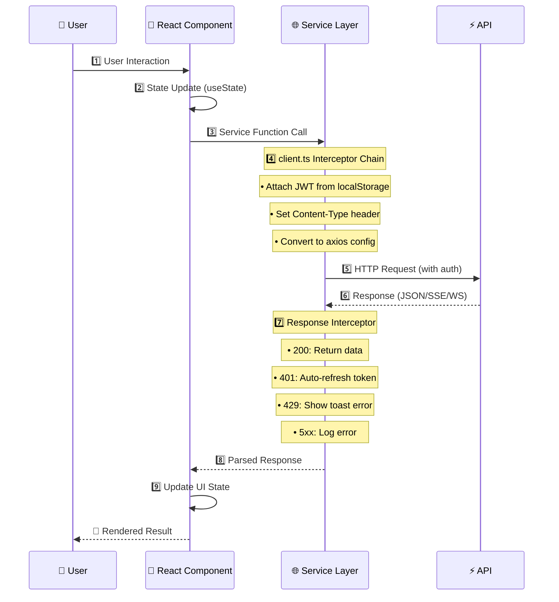

---

## 9. ☁️ **Deployment Topology**

### 🏗️ **Production Infrastructure**

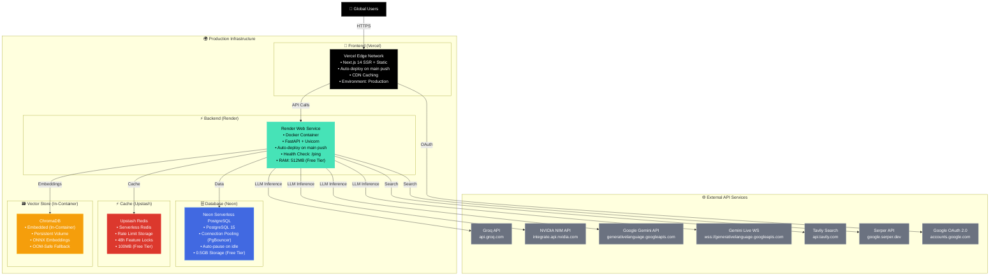

### 🔄 **Deployment Pipeline**

```mermaid
flowchart LR
    classDef dev fill:#1e1e2e,color:#fff
    classDef ci fill:#818cf8,color:#fff
    classDef deploy fill:#34d399,color:#fff

    DEV["💻 Local Development<br/>docker compose up"] --> CODE["📝 Code Commit<br/>git push origin main"]
    
    CODE --> GH["🐙 GitHub Repository"]
    
    GH --> CI["⚙️ GitHub Actions<br/>Parallel CI Pipeline"]
    
    subgraph CI [CI Pipeline]
        FJ["Frontend Job<br/>• Node.js 20<br/>• npm ci<br/>• ESLint<br/>• Next.js Build"]
        BJ["Backend Job<br/>• Python 3.11<br/>• pip install<br/>• pytest (102 tests)<br/>• pip-audit"]
    end
    
    CI -->|"✅ All Pass"| DEPLOY["🚀 Auto-Deploy"]
    
    DEPLOY --> VERCEL["Vercel<br/>Frontend Deploy"]
    DEPLOY --> RENDER["Render<br/>Backend Deploy"]
    
    VERCEL --> LIVE["🌍 Live Production"]
    RENDER --> LIVE

    class DEV dev
    class CODE,GH ci
    class CI,FJ,BJ ci
    class DEPLOY,VERCEL,RENDER deploy
    class LIVE deploy
```

### 🐳 **Docker Architecture**

```mermaid
graph TB
    classDef svc fill:#0ea5e9,color:#fff
    classDef vol fill:#f59e0b,color:#fff
    classDef net fill:#34d399,color:#fff

    subgraph "Docker Compose Stack"
        NET["Network: app-network"]
        
        subgraph "Services"
            FE["Frontend Service<br/>• Build: frontend/Dockerfile<br/>• Port: 3000<br/>• Env: frontend.env"]
            BE["Backend Service<br/>• Build: backend/Dockerfile<br/>• Port: 8000<br/>• Env: backend.env"]
            RD["Redis Service<br/>• Image: redis:alpine<br/>• Port: 6379<br/>• Healthcheck: ping"]
        end
        
        subgraph "Volumes"
            CHROMA_VOL["chroma_data<br/>ChromaDB persistence"]
            PG_VOL["pg_data<br/>PostgreSQL data (dev)"]
        end
    end

    FE --> NET
    BE --> NET
    RD --> NET
    
    BE --> CHROMA_VOL
    FE -.->|"depends_on"| BE
    BE -.->|"depends_on"| RD

    class FE,BE,RD svc
    class CHROMA_VOL,PG_VOL vol
    class NET net
```

---

## 10. 🔄 **Data Flow: Full Career Analysis**

### 🧠 **Complete Pipeline Execution**

```mermaid
sequenceDiagram
    participant Client as 🖥️ Frontend
    participant API as ⚡ FastAPI
    participant RL as 🚦 Rate Limiter
    participant Graph as 🧠 LangGraph DAG
    participant ATS as 🔢 ATS Engine
    participant Search as 🔍 Search API
    participant LLM as 🤖 LLM Provider
    participant RAG as 📚 RAG Service
    participant DB as 🗃️ Database

    Client->>API: POST /career/full-analysis/stream
    
    API->>RL: 1️⃣ check_daily_limit(user_id, "full_analysis")
    RL-->>API: ✅ Allowed (under daily cap, no 48h lock)
    
    API->>Graph: 2️⃣ Initialize CareerState(resume_text, target_role, location)
    Note over Graph: SSE Connection — Stream Node Logs
    
    par Phase 1: Parallel Fan-Out
        Graph->>ATS: 3️⃣ analyze_resume_deterministically(resume_text)
        ATS-->>Graph: 4️⃣ {skills, experience, ats_score, strengths, gaps}
        
        Graph->>LLM: 5️⃣ run_resume_agent(text, deterministic_data, provider="nvidia")
        Note over LLM: Circuit breaker check → nvidia → groq fallback
        LLM-->>Graph: 6️⃣ ResumeAnalysis (structured JSON)
        
        Graph->>Search: 7️⃣ get_market_intelligence(role, location)
        Search-->Search: Tavily → Serper fallback → Deep Scrape
        Search-->>Graph: 8️⃣ Raw market context
        
        Graph->>LLM: 9️⃣ run_market_agent(role, location, context, provider="groq")
        LLM-->>Graph: 🔟 MarketTrends (structured JSON)
    end
    
    Note over Graph: 📡 SSE: Stream Progress Logs to Client
    
    par Phase 2: Parallel Fan-In
        Graph->>LLM: 1️⃣1️⃣ run_linkedin_agent(role, resume_analysis, market_analysis)
        LLM-->>Graph: 1️⃣2️⃣ LinkedInStrategy (headlines, about, skills)
        
        Graph->>LLM: 1️⃣3️⃣ run_roadmap_structure(role, gaps, market_trend, provider="google")
        LLM-->>Graph: 1️⃣4️⃣ 8-Week Skeleton
        Graph->>LLM: 1️⃣5️⃣ run_roadmap_details_batch(chunks=[3,3,2], provider="google")
        LLM-->>Graph: 1️⃣6️⃣ Detailed Weeks
        Graph->>RAG: 1️⃣7️⃣ enrich_weeks_with_resources(weeks)
        RAG-->RAG: DDG Search → Heuristic Score → GitHub Audit → Dedup
        RAG-->>Graph: 1️⃣8️⃣ Enriched Roadmap Weeks
    end
    
    Graph-->>API: 1️⃣9️⃣ Final Aggregated State
    
    API->>DB: 2️⃣0️⃣ Save Market Analysis
    API->>DB: 2️⃣1️⃣ Save Career Roadmap
    API->>RL: 2️⃣2️⃣ increment_usage(user_id, "full_analysis")
    API->>DB: 2️⃣3️⃣ log_activity(user_id, "Executed Career Analysis", "full_analysis")
    
    API-->>Client: 2️⃣4️⃣ SSE: {"type":"result","payload":{"status":"success","output":{...}}}
    Note over Client: Close SSE Connection
```

### 📦 **Response Envelope**

```json
{
  "status": "success",
  "output": {
    "resume_analysis": {
      "technical_skills": ["Python", "React", "Docker"],
      "soft_skills": ["Problem Solving", "Communication"],
      "years_of_experience": 3.5,
      "top_strengths": ["Strong technical breadth"],
      "skill_gaps": ["Cloud/DevOps", "System Design"],
      "ats_score": 85,
      "ats_score_breakdown": {
        "keywords": 30,
        "achievements": 25,
        "action_verbs": 18,
        "formatting_and_length": 12
      }
    },
    "market_trends": {
      "role": "Full Stack Developer",
      "location": "Bangalore, India",
      "salary_range": {
        "min": 1200000,
        "max": 2500000,
        "currency": "INR",
        "formatted": "₹12L – ₹25L per annum"
      },
      "market_trend": "High demand",
      "hiring_companies": [
        {"name": "Microsoft", "hiring_volume": "Active"},
        {"name": "Flipkart", "hiring_volume": "Growing"}
      ]
    },
    "roadmap": {
      "id": "uuid-here",
      "weeks": [{"week": 1, "topic": "System Design Fundamentals", ...}],
      "target_role": "Full Stack Developer"
    },
    "linkedin_strategy": {
      "headlines": ["Headline 1 💻", "Headline 2 🚀"],
      "about_section": "Passionate engineer...",
      "demanding_skills": ["React", "System Design"]
    }
  },
  "logs": [
    "[T1] Started Resume Analysis",
    "[T1] Fetching Market Trends",
    "[T2] Building LinkedIn Strategy",
    "[T2] Building Roadmap"
  ],
  "errors": [],
  "metadata": {
    "execution_time": "Completed",
    "agents_involved": 4,
    "roadmap_weeks": 8
  }
}
```

---

## 11. 📄 **Data Flow: Resume Upload & Analysis**

### 📐 **Detailed Pipeline**

```mermaid
flowchart TD
    classDef input fill:#818cf8,color:#fff,stroke:#6366f1
    classDef validate fill:#f59e0b,color:#fff,stroke:#d97706
    classDef process fill:#34d399,color:#fff,stroke:#10b981
    classDef ai fill:#7c3aed,color:#fff,stroke:#a78bfa
    classDef db fill:#0ea5e9,color:#fff,stroke:#38bdf8

    UPLOAD["📁 PDF Upload Request<br/>POST /resume/analyze"]
    
    subgraph "🔍 Validation Layer"
        V1["✅ Extension Check<br/>file.endswith('.pdf')"]
        V2["✅ MIME Type Check<br/>application/pdf"]
        V3["✅ Magic Bytes Check<br/>starts with b'%PDF-'"]
        V4["✅ Size Limit Check<br/>< 5MB (5,242,880 bytes)"]
    end
    
    subgraph "📝 Text Extraction"
        E1["💾 Save to Temp File<br/>/tmp/resume_{uuid}.pdf"]
        E2["📖 Extract with pdfplumber<br/>page.extract_text()"]
        E3["🧹 Clean & Merge<br/>Join pages with newlines"]
        E4["🗑️ Remove Temp File<br/>finally block"]
    end
    
    subgraph "🧹 Sanitization"
        S1["Strip '{' and '}'<br/>Prevent injection"]
        S2["Strip backticks<br/>'```' removal"]
        S3["Normalize whitespace<br/>Collapse multiple spaces"]
        S4["Hard truncate<br/>Max 6000 chars"]
    end
    
    subgraph "💾 Cache Check"
        CACHE{"Cache Hit?<br/>Key: resume_v3 + text[:2000]"}
    end
    
    subgraph "🔢 Deterministic ATS Engine"
        D1["🚀 Skill Extraction<br/>80+ aliases (reactjs→React)"]
        D2["📅 Experience Estimation<br/>Date parsing + interval merging"]
        D3["📊 ATS Score Calculation<br/>Keywords + Achievements + Verbs + Formatting"]
        D4["💪 Strength Detection<br/>Breadth, experience, quantification"]
        D5["🔍 Gap Detection<br/>Cloud, CI/CD, Database, System Design"]
    end
    
    subgraph "🤖 LLM Analysis"
        L1["Provider: NVIDIA NIM<br/>Fallback: Groq<br/>Timeout: 120s"]
        L2["System Prompt<br/>Senior ATS Recruiter"]
        L3["User Content<br/>ATS Data + Sanitized Text"]
        L4["Response Model<br/>ResumeAnalysisModel"]
    end
    
    subgraph "✅ Pydantic Validation"
        P1["ATS Score Capping<br/>min(score, 100)"]
        P2["Experience Normalization<br/>min(years, 25.0)"]
        P3["Required Fields Check"]
    end
    
    subgraph "💾 Database Save"
        DB1["Save Resume Record<br/>parsed_content = analysis"]
        DB2["Increment Usage<br/>resume: counter += 1"]
        DB3["Log Activity<br/>'Analyzed Resume'"]
        DB4["Update Cache<br/>Set 1-hour TTL"]
    end

    UPLOAD --> V1 --> V2 --> V3 --> V4
    V4 --> E1 --> E2 --> E3 --> E4
    E3 --> S1 --> S2 --> S3 --> S4
    S4 --> CACHE
    
    CACHE -->|"✅ Hit"| DB1
    CACHE -->|"❌ Miss"| D1 --> D2 --> D3 --> D4 --> D5
    D5 --> L1 --> L2 --> L3 --> L4
    
    L4 --> P1 --> P2 --> P3
    P3 --> DB1 --> DB2 --> DB3 --> DB4
    
    style UPLOAD input
    style V1,V2,V3,V4 validate
    style E1,E2,E3,E4 process
    style S1,S2,S3,S4 process
    style D1,D2,D3,D4,D5 ai
    style L1,L2,L3,L4 ai
    style P1,P2,P3 process
    style DB1,DB2,DB3,DB4 db
```

### 📊 **ATS Score Calculation Formula**

```
ATS Score (0-100) = Keywords + Achievements + Action Verbs + Formatting

Keywords (max 35)      = min(len(skills_found) × 2, 35)
Achievements (max 30)  = min(metric_count × 4, 30)
  • Metric patterns: /\b\d+(\.\d+)?%/, /\$\d+(,\d+)*(\.\d+)?/, /\b\d+[kKmMbB]\b/
Action Verbs (max 20)  = min(len(unique_verbs) × 2, 20)
  • 28 verbs: developed, engineered, built, designed, led, managed...
Formatting (max 15)    = { 1500-5000 chars: 15, >5000: 10, <1500: 5 }

Rules:
- Experience counts ONLY jobs/internships (excludes projects/hackathons)
- Overlapping date ranges are merged for true cumulative experience
- OCR garbage detection: >20% non-printable chars → score = 0
```

---

## 12. 📈 **Data Flow: Market Intelligence**

### 🔍 **Complete Market Intelligence Pipeline**

```mermaid
flowchart TD
    classDef input fill:#818cf8,color:#fff,stroke:#6366f1
    classDef search fill:#06b6d4,color:#fff,stroke:#0891b2
    classDef process fill:#f59e0b,color:#fff,stroke:#d97706
    classDef llm fill:#7c3aed,color:#fff,stroke:#a78bfa
    classDef output fill:#34d399,color:#fff,stroke:#10b981

    INPUT["🎯 Input Parameters<br/>Role + Location + Seniority"]
    
    INPUT --> CLASSIFY["🧠 Role Classification<br/>🔬 Domain Detection<br/>• data_ai: ML, NLP, LLM<br/>• cloud_infra: K8s, Terraform<br/>• web_fullstack: React, Node<br/>🎚️ Seniority Detection<br/>• intern, junior, mid, senior"]
    
    CLASSIFY --> REGION["🌍 Region Mapping<br/>🗺️ City → Country → Region<br/>• bangalore → india → INR ₹<br/>• london → uk → GBP £<br/>• san francisco → usa → USD $"]
    
    REGION --> SEARCH["🔍 Live Search Pipeline"]
    
    subgraph SEARCH [Live Search Pipeline]
        TAVILY["🔍 Tavily Search (Advanced)<br/>• 2 queries crafted<br/>• Include raw content<br/>• Max 5 results"]
        SERPER["🔍 Serper Google (Fallback)<br/>• 10 organic results<br/>• Include news snippets<br/>• Used if Tavily fails"]
        SCRAPE["🌐 Deep URL Scraping<br/>• Classify: job_portal / blog / other<br/>• Async HTTP with User-Agent<br/>• Clean HTML (strip scripts, nav, footer)"]
    end
    
    SEARCH --> EXTRACT["📊 Deterministic Extraction<br/>• Sources list (top 8 URLs)<br/>• Region currency profile<br/>• Default metrics scaffold"]
    
    EXTRACT --> LLM_CALL["🤖 LLM Structured Extraction<br/>• Provider: Groq (temp=0.2)<br/>• Fallback: NVIDIA NIM<br/>• Model: MarketIntelligenceModel<br/>• Pydantic validation"]
    
    LLM_CALL --> MERGE["🔄 Merge LLM + Deterministic<br/>• Prefer LLM values over defaults<br/>• Fall back to deterministic on parse errors<br/>• Validate company names (no hallucination)"]
    
    MERGE --> OUTPUT["📊 Final Market Report"]
    
    OUTPUT --> SAVE["💾 Save to Database<br/>• market_analyses table<br/>• Full JSON analysis"]
    OUTPUT --> LOG["📝 Log Activity<br/>• 'Researched Market for {role}'"]
    OUTPUT --> RESPONSE["📨 Response to Client"]

    style INPUT input
    style CLASSIFY,REGION process
    style TAVILY,SERPER,SCRAPE search
    style EXTRACT,LLM_CALL,MERGE llm
    style OUTPUT,SAVE,LOG,RESPONSE output
```

### 🌍 **Location Intelligence Database**

```mermaid
graph LR
    classDef city fill:#818cf8,color:#fff
    classDef country fill:#f59e0b,color:#fff
    classDef region fill:#34d399,color:#fff

    subgraph "City → Country Mapping"
        BLR["bangalore"] --> IN["india"]
        MUM["mumbai"] --> IN
        SF["san francisco"] --> US["usa"]
        NYC["new york"] --> US
        LON["london"] --> UK["uk"]
        BER["berlin"] --> DE["germany"]
        DXB["dubai"] --> UAE["uae"]
        SGP["singapore"] --> SG["singapore"]
    end

    subgraph "Country → Region Mapping"
        IN --> REG_IN["india<br/>Currency: INR ₹"]
        US --> REG_US["usa<br/>Currency: USD $"]
        UK --> REG_UK["uk<br/>Currency: GBP £"]
        DE --> REG_EU["europe<br/>Currency: EUR €"]
        UAE --> REG_ME["middle_east<br/>Currency: AED DH"]
        SG --> REG_SEA["southeast_asia<br/>Currency: SGD S$"]
    end

    subgraph "Seniority Multipliers"
        INTERN["intern: 0.45x"]
        JUNIOR["junior: 0.70x"]
        MID["mid: 1.00x"]
        SENIOR["senior: 1.45x"]
    end

    class BLR,MUM,SF,NYC,LON,BER,DXB,SGP city
    class IN,US,UK,DE,UAE,SG country
    class REG_IN,REG_US,REG_UK,REG_EU,REG_ME,REG_SEA region
```

---

## 13. 🚦 **Rate Limiting Architecture**

### 🧅 **Multi-Layer Rate Limiting**

```mermaid
flowchart TD
    classDef layer fill:#0ea5e9,color:#fff,stroke:#38bdf8
    classDef decision fill:#f59e0b,color:#fff,stroke:#d97706
    classDef block fill:#ef4444,color:#fff,stroke:#dc2626
    classDef allow fill:#34d399,color:#fff,stroke:#10b981

    REQ["📨 Incoming Request"]
    
    subgraph "🔴 Layer 1: Global Rate Limit (SlowAPI)"
        SLOW["SlowAPI Middleware<br/>• Backend: Redis (Upstash)<br/>• Key: IP Address<br/>• Development: 100,000 req/day<br/>• Production: 1,000 req/day + 100 req/hour<br/>• Dev fallback: memory://"]
    end
    
    subgraph "🟡 Layer 2: Per-Feature Daily Caps (Custom)"
        CHECK["check_daily_limit(user_id, feature)"]
        
        GAP{"⏰ 48h Gap<br/>Lock Check"}
        DAILY{"📊 Daily Cap<br/>Check"}
        
        subgraph "Backend: Redis (Upstash)"
            R_GET["⚡ Redis GET<br/>usage:{user_id}:{feature}:{date}"]
            R_INCR["⚡ Redis INCR<br/>+ Increment"]
            R_TTL["⚡ Redis TTL<br/>48h expiry"]
        end
        
        subgraph "Fallback: In-Memory"
            M_GET["📝 dict() lookup<br/>Per-user, per-feature"]
            M_INCR["📝 Counter increment"]
        end
    end
    
    REQ --> SLOW
    
    SLOW -->|"✅ Under Limit"| CHECK
    SLOW -->|"🚫 Exceeded"| BLOCK_G["❌ 429 Too Many Requests<br/>'Rate limit exceeded. Try again later.'"]
    
    CHECK --> GAP
    
    GAP -->|"🔒 Locked"| BLOCK_F["❌ 429 Too Many Requests<br/>'This feature is locked for 48 hours.'"]
    GAP -->|"✅ No Lock"| DAILY
    
    DAILY -->|"⚠️ Cap Reached"| BLOCK_D["❌ 429 Too Many Requests<br/>'Daily limit reached for this feature.'"]
    DAILY -->|"✅ Available"| R_GET
    
    R_GET -->|"⚡ Redis OK"| ALLOW["✅ Allow Request"]
    R_GET -->|"❌ Redis Down"| M_GET --> ALLOW["✅ Allow (memory fallback)"]
    
    ALLOW --> HANDLER["🎯 Route Handler"]
    HANDLER --> R_INCR & M_INCR

    style REQ layer
    style SLOW,CHECK layer
    style GAP,DAILY decision
    style R_GET,R_INCR,R_TTL layer
    style M_GET,M_INCR layer
    style BLOCK_G,BLOCK_F,BLOCK_D block
    style ALLOW,HANDLER allow
```

### 📊 **Feature Limits Matrix**

| Feature | 🚦 Daily Cap | ⏰ 48h Lock | 🔑 Redis Key Pattern | ❌ Error Message |
|---------|:----------:|:----------:|---------------------|-----------------|
| **📄 Resume Analysis** | 3 | ❌ | `usage:{uid}:resume:{date}` | "Daily limit reached for resume analysis" |
| **📈 Market Research** | 3 | ❌ | `usage:{uid}:market:{date}` | "Daily limit reached for market research" |
| **🔗 LinkedIn Optimization** | 4 | ❌ | `usage:{uid}:linkedin:{date}` | "Daily limit reached for LinkedIn optimization" |
| **🗺️ Roadmap Generation** | 1 | ✅ | `usage:{uid}:roadmap:{date}` + `lock:roadmap:{uid}` | "Roadmap generation is locked for 48 hours" |
| **🧠 Full Career Analysis** | 1 | ✅ | `usage:{uid}:full_analysis:{date}` + `lock:full_analysis:{uid}` | "Full analysis is locked for 48 hours" |
| **🎤 Mock Interview** | 1 | ✅ | `usage:{uid}:interview:{date}` + `lock:interview:{uid}` | "Mock interview is locked for 48 hours" |
| **🎙️ Voice Assistant** | 2 | — | `usage:{uid}:voice:{date}` | "Voice assistant daily limit reached (max 2 calls)" |

### 🔐 **Security Architecture**

```mermaid
graph TB
    classDef auth fill:#818cf8,color:#fff,stroke:#6366f1
    classDef input fill:#f59e0b,color:#fff,stroke:#d97706
    classDef guard fill:#ef4444,color:#fff,stroke:#dc2626
    classDef error fill:#34d399,color:#fff,stroke:#10b981

    subgraph "🔐 Authentication"
        JWT["JWT Token System<br/>• Access Token: 60 min expiry<br/>• Refresh Token: 30 days expiry<br/>• Algorithm: HS256<br/>• Payload: {sub: user_id, type: 'access'|'refresh'}"]
        
        OAUTH["Google OAuth 2.0<br/>• ID Token (JWT format)<br/>• Access Token (ya29. prefix)<br/>• UserInfo API fallback<br/>• Clock skew: 10 seconds"]
        
        PWD["Password Security<br/>• bcrypt hashing<br/>• Salt auto-generated<br/>• Min length: 8 chars"]
    end
    
    subgraph "🛡️ Authorization"
        AUTH_DEP["FastAPI Dependency<br/>get_current_user()<br/>• Extract Bearer token<br/>• Decode + verify JWT<br/>• Query user from DB"]
        
        WS_AUTH["WebSocket Auth<br/>• Token in query param: ?token=JWT<br/>• Bearer header support<br/>• Verify before establishing WS"]
    end
    
    subgraph "✅ Input Validation"
        PDF_VAL["PDF Validation (4 checks)<br/>• Extension: .pdf only<br/>• MIME: application/pdf<br/>• Magic bytes: starts with %PDF-<br/>• Size: Max 5MB"]
        
        SANITIZE["Prompt Injection Defense<br/>• Strip curly braces: { }<br/>• Strip backticks: ```<br/>• Collapse whitespace<br/>• Truncate: 6000 chars max"]
        
        PYDANTIC["Pydantic Schema Validation<br/>• Request body validation<br/>• Response model validation<br/>• Custom validators (ATS score capping)"]
    end
    
    subgraph "🚫 Production Guards"
        SQL_GUARD["SQLite Blocked<br/>• ValueError at startup<br/>• 'CRITICAL: SQLite cannot be used in production!'"]
        
        SECRET_GUARD["Default Secret Blocked<br/>• dev-secret-change-in-prod<br/>• ValueError at startup"]
    end
    
    subgraph "📝 Error Handling"
        SAFE_LOG["Safe Logging (loguru)<br/>• No KeyError crashes<br/>• Structured JSON format<br/>• Sensitive data redaction"]
        
        GRACEFUL["Graceful Degradation<br/>• All AI calls wrapped in try/except<br/>• Deterministic fallback on LLM failure<br/>• Circuit breaker auto-recovery"]
    end

    style JWT,OAUTH,PWD auth
    style AUTH_DEP,WS_AUTH auth
    style PDF_VAL,SANITIZE,PYDANTIC input
    style SQL_GUARD,SECRET_GUARD guard
    style SAFE_LOG,GRACEFUL error
```

---

## 14. 🧬 **RAG & Resource Enrichment Pipeline**

### 📚 **Complete Resource Quality Engine**

```mermaid
flowchart TD
    classDef input fill:#818cf8,color:#fff,stroke:#6366f1
    classDef search fill:#06b6d4,color:#fff,stroke:#0891b2
    classDef quality fill:#f59e0b,color:#fff,stroke:#d97706
    classDef fallback fill:#7c3aed,color:#fff,stroke:#a78bfa
    classDef output fill:#34d399,color:#fff,stroke:#10b981

    WEEKS["🗓️ 8-Week Roadmap Topics<br/>{week: 1, topic: 'System Design', ...}<br/>{week: 2, topic: 'Docker & K8s', ...}"]
    
    WEEKS --> GEN_QUERY["🔍 Generate Search Queries<br/>• Per week: 2-3 topic-specific queries<br/>• Include 'tutorial', 'guide', 'best practices'"]
    
    GEN_QUERY --> DDG["🦆 DuckDuckGo Search<br/>• 10 results per query<br/>• Title + URL + Snippet"]
    
    subgraph "🏆 Quality Scoring Engine"
        DOMAIN["📊 Domain Weight Scoring"]
        GITHUB["🐙 GitHub Repository Audit"]
        URL_CHECK["✅ URL Reachability Check"]
        DEDUP["📝 Title Deduplication"]
    end
    
    subgraph "Domain Scoring"
        HEURISTIC["Heuristic Rules<br/>• Official docs: +40pts<br/>  (docs.*.com, *.dev, *.org)<br/>• GitHub repos: +25pts<br/>  (+10 if stars > 100)<br/>• Educational: +10 to +20pts<br/>  (freecodecamp, geeksforgeeks)<br/>• Community: +5pts<br/>  (medium.com, dev.to)<br/>• Legacy penalty: -20pts<br/>  (angularjs, class-components)"]
    end
    
    subgraph "GitHub Audit"
        GH_AUDIT["GitHub API Checks<br/>• Star count (stars > 10 required)<br/>• Last push date (< 6 months)<br/>• Archive status (not archived)"]
    end
    
    subgraph "URL Validation"
        URL_VAL["Parallel HTTP Validation<br/>• 10 concurrent workers<br/>• HEAD request (1.5s timeout)<br/>• GET fallback if HEAD fails<br/>• Must return 200 OK"]
    end
    
    subgraph "Deduplication"
        DEDUP_LOGIC["Title Similarity Check<br/>• difflib.SequenceMatcher<br/>• Ratio threshold: >0.85<br/>• Keep highest scored version"]
    end

    subgraph "⬇️ Fallback Layer"
        CHROMA["🗃️ ChromaDB Vector Search<br/>• ONNX all-MiniLM-L6-v2<br/>• Cosine similarity search<br/>• Returns top-1 by topic"]
        KEYWORD["📝 In-Memory Keyword Matcher<br/>• Token scoring<br/>• OOM-safe fallback<br/>• Zero dependencies"]
    end

    DDG --> HEURISTIC
    HEURISTIC --> GH_AUDIT
    GH_AUDIT --> URL_VAL
    URL_VAL --> DEDUP_LOGIC
    
    DEDUP_LOGIC -->|"≥ 3 resources"| ENRICHED["✅ Enriched Roadmap Weeks<br/>• youtube_resources: [URLs]<br/>• article_resources: [URLs]<br/>• github_resources: [URLs]<br/>• official_docs: [URLs]"]
    
    DEDUP_LOGIC -->|"< 3 resources"| CHROMA
    CHROMA -->|"✅ Found"| ENRICHED
    CHROMA -->|"❌ OOM / Error"| KEYWORD --> ENRICHED
    
    style WEEKS input
    style GEN_QUERY,DDG search
    style DOMAIN,GITHUB,URL_CHECK,DEDUP quality
    style HEURISTIC,GH_AUDIT,URL_VAL,DEDUP_LOGIC quality
    style CHROMA,KEYWORD fallback
    style ENRICHED output
```

### 🏆 **Domain Scoring Matrix**

| Domain | Base Weight | Example URLs | Notes |
|--------|:----------:|-------------|-------|
| **📘 Official Documentation** | **+40 pts** | `docs.docker.com`, `react.dev`, `developer.mozilla.org` | Gold standard |
| **🐙 GitHub Repository** | **+25 pts** | `github.com/user/repo` | +10 if stars > 100 |
| **🎓 Educational Platform** | **+20 pts** | `freecodecamp.org`, `roadmap.sh` | High quality |
| **📚 Tutorial Sites** | **+10 pts** | `geeksforgeeks.org`, `tutorialspoint.com` | Useful but varied |
| **📝 Community Blogs** | **+5 pts** | `medium.com`, `dev.to`, `hashnode.dev` | Community-driven |
| **⚠️ Legacy / Deprecated** | **-20 pts** | `angularjs.org`, `class-components` | Actively penalized |

### 🛡️ **OOM Prevention Strategy**

```mermaid
flowchart LR
    classDef start fill:#818cf8,color:#fff
    classDef check fill:#f59e0b,color:#fff
    classDef chroma fill:#7c3aed,color:#fff
    classDef fallback fill:#34d399,color:#fff

    START["🚀 Service Startup"]
    
    CHECK_1{"RENDER env<br/>or DISABLE_CHROMA?"}
    CHECK_2{"chromadb<br/>imports?"}
    CHECK_3{"ONNX model<br/>load success?"}
    
    START --> CHECK_1
    
    CHECK_1 -->|"✅ Yes<br/>(512MB RAM)"| SKIP["⏭️ Skip ChromaDB<br/>Use In-Memory Only"]
    CHECK_1 -->|"❌ No"| CHECK_2
    
    CHECK_2 -->|"❌ Not installed"| FALLBACK["📝 In-Memory Keyword Matcher"]
    CHECK_2 -->|"✅ Installed"| CHECK_3
    
    CHECK_3 -->|"✅ Success"| ACTIVE["🗃️ ChromaDB Active<br/>Full Vector Search"]
    CHECK_3 -->|"❌ Memory Error"| FALLBACK
    
    SKIP --> FALLBACK

    class START start
    class CHECK_1,CHECK_2,CHECK_3 check
    class ACTIVE chroma
    class SKIP,FALLBACK fallback
```

---

## 15. 🔒 **Authentication Flow**

### 🧭 **Complete Auth Architecture**

```mermaid
sequenceDiagram
    participant U as 👤 User
    participant F as 🖥️ Frontend
    participant A as ⚡ FastAPI
    participant DB as 🗃️ Database
    participant G as 🌐 Google OAuth

    rect rgb(30, 30, 46)
        Note over U,DB: ─── Email/Password Registration ───
        U->>F: 1️⃣ Fill Register Form (name, email, password)
        F->>A: 2️⃣ POST /auth/register
        A->>DB: 3️⃣ Check if email exists
        DB-->>A: Email available
        A->>A: 4️⃣ Hash password (bcrypt)
        A->>DB: 5️⃣ INSERT new User
        DB-->>A: User created
        A->>A: 6️⃣ Generate JWT Pair (access + refresh)
        A-->>F: 7️⃣ {access_token, refresh_token, token_type}
        F->>F: 8️⃣ Store tokens in localStorage
        F-->>U: 🎉 Redirect to Dashboard
    end

    U->>F: 9️⃣ Click Login
    rect rgb(30, 30, 46)
        Note over U,DB: ─── Email/Password Login ───
        F->>A: 🔟 POST /auth/login
        A->>DB: 1️⃣1️⃣ Find user by email
        DB-->>A: User found
        A->>A: 1️⃣2️⃣ Verify password (bcrypt)
        alt Invalid Password
            A-->>F: 4️⃣0️⃣1️⃣ Unauthorized
        else Valid
            A->>A: 1️⃣3️⃣ Generate JWT Pair
            A-->>F: 1️⃣4️⃣ {access_token, refresh_token}
        end
    end

    rect rgb(30, 30, 46)
        Note over U,DB: ─── Google OAuth ───
        U->>F: 1️⃣5️⃣ Click "Sign in with Google"
        F->>G: 1️⃣6️⃣ Google OAuth Popup
        G-->>F: 1️⃣7️⃣ Google credential (ID Token / Access Token)
        F->>A: 1️⃣8️⃣ POST /auth/google {credential}
        
        alt Access Token (ya29.)
            A->>G: 1️⃣9️⃣ GET UserInfo API
            G-->>A: {email, name, picture}
        else ID Token (JWT)
            A->>G: 2️⃣0️⃣ verify_oauth2_token()
            G-->>A: {email, name, sub}
        end
        
        A->>DB: 2️⃣1️⃣ Find or Create user
        alt New User
            A->>DB: INSERT User (hashed_pw = NULL)
        end
        
        A->>A: 2️⃣2️⃣ Generate JWT Pair
        A-->>F: 2️⃣3️⃣ {access_token, refresh_token, name}
    end

    rect rgb(30, 30, 46)
        Note over U,DB: ─── Token Refresh ───
        F->>A: 2️⃣4️⃣ POST /auth/refresh {refresh_token}
        A->>A: 2️⃣5️⃣ Decode refresh token
        A->>A: 2️⃣6️⃣ Verify type: 'refresh'
        A->>DB: 2️⃣7️⃣ Find user by sub
        A->>A: 2️⃣8️⃣ Generate new JWT Pair
        A-->>F: 2️⃣9️⃣ {access_token, refresh_token}
    end
```

### 🔑 **JWT Token Structure**

```json
{
  "access_token": {
    "payload": {
      "sub": "user-uuid-here",
      "exp": 1717084800,
      "iat": 1717081200,
      "type": "access"
    },
    "header": {
      "alg": "HS256",
      "typ": "JWT"
    }
  },
  "refresh_token": {
    "payload": {
      "sub": "user-uuid-here",
      "exp": 1719673200,
      "iat": 1717081200,
      "type": "refresh"
    },
    "header": {
      "alg": "HS256",
      "typ": "JWT"
    }
  }
}
```

| Property | Access Token | Refresh Token |
|----------|:------------:|:-------------:|
| **Lifespan** | 60 minutes | 30 days |
| **Type** | `access` | `refresh` |
| **Storage** | `localStorage` | `localStorage` |
| **Sent in** | `Authorization: Bearer` header | Request body |
| **Rotation** | On expiry (auto-refresh) | On each refresh call |

---

## 16. 🚇 **WebSocket Communication Protocol**

### 🎤 **Interview WebSocket Protocol**

```mermaid
sequenceDiagram
    participant C as 🖥️ Client
    participant S as ⚡ Server
    participant I as 🧠 Interview State Machine

    C->>S: 1️⃣ WS Connect /interview/ws/{session_id}?role=SWE&company=Google&token=JWT
    S->>S: 2️⃣ Authenticate token
    S->>S: 3️⃣ Create/Resume InterviewSession
    S-->>C: 4️⃣ {"type":"connected","session_id":"...","phase":"intro"}
    
    Note over C: ─── Phase 1: Intro ───
    S-->>C: 5️⃣ {"type":"question","phase":"intro","text":"Welcome! Tell me about yourself.","audio":"base64_tts"}
    
    C->>S: 6️⃣ {"type":"response","text":"I'm a full-stack engineer with 5 years of experience..."}
    S->>I: 7️⃣ Process response, generate feedback + next
    S-->>C: 8️⃣ {"type":"feedback","text":"Great background! Let's move to CS fundamentals.","phase":"cs_fundamentals"}
    
    Note over C: ─── Phase 3: LeetCode ───
    S-->>C: 9️⃣ {"type":"question","phase":"leetcode","text":"Implement a function to...","code_stub":"function solve() { }"}
    
    C->>S: 🔟 {"type":"code_update","code":"function solve() { return 42; }"}
    Note over S: Real-time code evaluation
    C->>S: 1️⃣1️⃣ {"type":"response","text":"My solution uses O(n) time..."}
    
    Note over C: ─── Final Phase: Feedback ───
    S-->>C: 1️⃣2️⃣ {"type":"feedback","phase":"complete","score":85,"summary":"Strong problem-solving skills...","question_scores":{...}}
    C->>S: 1️⃣3️⃣ WS Close
    
    Note over S: Save session to DB
```

### 🎙️ **Voice Assistant WebSocket Protocol**

```mermaid
sequenceDiagram
    participant C as 🖥️ Client (VoiceAssistant.tsx)
    participant S as ⚡ Server (FastAPI WS Proxy)
    participant G as 🔵 Gemini Live API

    Note over C,G: ─── Connection Setup ───
    C->>S: WS Connect /career/voice-assistant/ws?token=JWT
    S->>S: 1. JWT Verify
    S->>S: 2. Rate Limit (2/day)
    S->>S: 3. Load User Context
    S->>G: WS Connect wss://generativelanguage.googleapis.com
    G-->>S: Setup Complete
    S-->>C: {"type":"setup_complete","call_id":"..."}
    
    Note over C,G: ─── Bidirectional Audio ───
    loop User Speaking
        C->>C: Capture 16kHz PCM → Chunk → Base64
        C->>S: {"type":"audio","data":"base64_pcm_16khz"}
        S->>G: realtimeInput(mediaChunks)
    end
    
    loop Anya Responding
        G-->>S: serverContent(modelTurn, audio parts)
        S-->>C: {"type":"audio","data":"base64_pcm_24khz"}
        S-->>C: {"type":"transcript","text":"Anya said this..."}
        C->>C: Buffer → Play → Suppress Mic
    end
    
    Note over C,G: ─── Session End ───
    S-->>C: {"type":"time_limit","message":"7.5 min reached"}
    S->>G: WS Close
    S->>C: WS Close
```

### 📋 **WebSocket Message Types**

| Direction | Type | Payload | Description |
|:---------:|------|---------|-------------|
| **▶ Server** | `connected` | `{session_id, phase}` | Connection established |
| | `question` | `{phase, text, audio?, code_stub?}` | AI question |
| | `feedback` | `{text, phase, score?}` | AI feedback |
| | `audio` | `{data: base64}` | PCM audio chunk |
| | `transcript` | `{text}` | Spoken text |
| | `time_limit` | `{message}` | Call time limit reached |
| | `error` | `{message}` | Error notification |
| **◀ Client** | `response` | `{text}` | Candidate answer |
| | `code_update` | `{code}` | Code editor change |
| | `audio` | `{data: base64}` | Mic audio chunk |
| | `ping` | `{}` | Keepalive |

---

## 17. 🧪 **Test Architecture & Coverage**

### 📐 **Test Pyramid**

```mermaid
graph TB
    classDef unit fill:#818cf8,color:#fff,stroke:#6366f1
    classDef integ fill:#34d399,color:#fff,stroke:#10b981
    classDef e2e fill:#f59e0b,color:#fff,stroke:#d97706

    E2E["🧪 End-to-End Tests<br/>• Full pipeline integration<br/>• Cross-service scenarios<br/>• Coverage: 0 (future)"]
    
    INTEG["🔗 Integration Tests<br/>• API endpoints (9 tests)<br/>• Features pipeline (8 tests)<br/>• Voice assistant WS (3 tests)<br/>• Total: 20 tests"]
    
    UNIT["🔬 Unit Tests<br/>• Agent registry (26 tests)<br/>• Roadmap agents (24 tests)<br/>• Validation schemas (14 tests)<br/>• ATS engine (5 tests)<br/>• Market service (5 tests)<br/>• Gamified roadmap (3 tests)<br/>• LinkedIn (2 tests)<br/>• Total: 79 tests"]

    E2E -.->|"102 Total Tests"| INTEG --> UNIT

    class UNIT unit
    class INTEG integ
    class E2E e2e
```

### 📊 **Test Coverage Matrix**

```mermaid
graph TD
    classDef title fill:#1e1e2e,color:#fff,stroke:#6c7086
    classDef test fill:#818cf8,color:#fff,stroke:#6366f1
    classDef area fill:#34d399,color:#fff,stroke:#10b981

    TESTS["🧪 Test Suite — 102 Tests"]
    
    TESTS --> AR["test_agents_registry.py<br/>26 tests"]
    TESTS --> RA["test_roadmap_agents.py<br/>24 tests"]
    TESTS --> PV["test_validation.py<br/>14 tests"]
    TESTS --> M["test_main.py<br/>9 tests"]
    TESTS --> F["test_features.py<br/>8 tests"]
    TESTS --> AE["test_ats_engine.py<br/>5 tests"]
    TESTS --> MS["test_market_service.py<br/>5 tests"]
    TESTS --> GR["test_gamified_roadmap.py<br/>3 tests"]
    TESTS --> VA["test_voice_assistant.py<br/>3 tests"]
    TESTS --> LI["test_linkedin.py<br/>2 tests"]

    subgraph "Coverage Areas"
        C1["🧠 Agent Registry<br/>• JSON extraction: parse_json()<br/>• Circuit breaker state machine<br/>• Fallback chain traversal<br/>• Escape functions: escape_json_string_control_chars()"]
        C2["🗺️ Roadmap Agents<br/>• Fallback structure generation<br/>• Detail batch processing<br/>• Week normalization<br/>• JSON parsing edge cases"]
        C3["✅ Pydantic Validation<br/>• ATS score capping (0-100)<br/>• Coercion validators<br/>• Required field constraints<br/>• Null handling"]
        C4["⚡ Main API<br/>• Authentication endpoints<br/>• Rate limiting logic<br/>• JWT token lifecycle<br/>• Health check responses"]
        C5["⚙️ Core Features<br/>• Market scrapers<br/>• TTS audio generation<br/>• Search algorithms<br/>• Cache layer"]
        C6["🔢 ATS Engine<br/>• Date range parsing<br/>• Overlap interval merging<br/>• Skill extraction<br/>• Garbage text detection"]
        C7["📈 Market Service<br/>• Salary conversion<br/>• Role classification<br/>• Location mapping"]
        C8["🎮 Gamified Roadmap<br/>• Week completion triggers<br/>• Quiz generation rules"]
        C9["🎙️ Voice Assistant<br/>• WebSocket auth flow<br/>• Gemini config models"]
        C10["🔗 LinkedIn<br/>• Fallback strategy<br/>• Model structures"]
    end

    AR --> C1
    RA --> C2
    PV --> C3
    M --> C4
    F --> C5
    AE --> C6
    MS --> C7
    GR --> C8
    VA --> C9
    LI --> C10

    class TESTS title
    class AR,RA,PV,M,F,AE,MS,GR,VA,LI test
    class C1,C2,C3,C4,C5,C6,C7,C8,C9,C10 area
```

### 🏃 **Running Tests**

```bash
# Run all tests (102 total)
cd backend
PYTHONPATH=. python -m pytest tests/ -v

# Run by category
pytest tests/test_agents_registry.py -v  # 26 tests
pytest tests/test_roadmap_agents.py -v   # 24 tests
pytest tests/test_validation.py -v       # 14 tests
pytest tests/test_main.py -v             # 9 tests

# Run with coverage
pip install pytest-cov
pytest tests/ --cov=app --cov-report=html
```

---

## 18. ⚙️ **CI/CD Pipeline Architecture**

### 🚀 **GitHub Actions Workflow**

```mermaid
flowchart LR
    classDef trigger fill:#818cf8,color:#fff,stroke:#6366f1
    classDef job fill:#f59e0b,color:#fff,stroke:#d97706
    classDef step fill:#34d399,color:#fff,stroke:#10b981
    classDef deploy fill:#0ea5e9,color:#fff,stroke:#38bdf8
    classDef fail fill:#ef4444,color:#fff,stroke:#dc2626

    TRIGGER["📦 Push to 'main' branch"]
    
    TRIGGER --> PARALLEL["⚡ Parallel CI Jobs<br/>GitHub Actions Runner: ubuntu-latest"]
    
    subgraph "📱 Frontend CI Job"
        F1["🟢 Setup Node 20"]
        F1 --> F2["📥 npm ci<br/>Clean install"]
        F2 --> F3["🔍 ESLint<br/>Code quality check"]
        F3 --> F4{"ESLint Pass?"}
        F4 -->|"❌ Fail"| FAIL_F["💥 Build Failed"]
        F4 -->|"✅ Pass"| F5["🏗️ Next.js Build<br/>Production build"]
        F5 --> F6{"Build Pass?"}
        F6 -->|"❌ Fail"| FAIL_F
        F6 -->|"✅ Pass"| FE_DONE["✅ Frontend Ready"]
    end
    
    subgraph "⚡ Backend CI Job"
        B1["🐍 Setup Python 3.11"]
        B1 --> B2["📥 pip install -r requirements.txt"]
        B2 --> B3["🧪 pytest (102 tests)<br/>All test files"]
        B3 --> B4{"All Tests Pass?"}
        B4 -->|"❌ Fail"| FAIL_B["💥 Tests Failed"]
        B4 -->|"✅ Pass"| B5["🔒 pip-audit<br/>Security vulnerability scan"]
        B5 --> B6{"Audit Pass?"}
        B6 -->|"❌ Fail"| FAIL_B
        B6 -->|"✅ Pass"| BE_DONE["✅ Backend Ready"]
    end
    
    FE_DONE --> DEPLOY_F["🚀 Deploy Frontend<br/>Vercel Auto-Deploy"]
    BE_DONE --> DEPLOY_B["🚀 Deploy Backend<br/>Render Auto-Deploy"]
    
    DEPLOY_F --> PROD["🌍 Production Live"]
    DEPLOY_B --> PROD

    class TRIGGER trigger
    class PARALLEL job
    class F1,F2,F3,F4,F5,F6 step
    class B1,B2,B3,B4,B5,B6 step
    class DEPLOY_F,DEPLOY_B deploy
    class PROD deploy
    class FAIL_F,FAIL_B fail
```

### 📋 **Pipeline Configuration**

```yaml
# .github/workflows/ci.yml
name: CI/CD Pipeline

on:
  push:
    branches: [main]

jobs:
  frontend:
    runs-on: ubuntu-latest
    steps:
      - uses: actions/checkout@v4
      - uses: actions/setup-node@v4
        with:
          node-version: 20
          cache: 'npm'
          cache-dependency-path: frontend/package-lock.json
      - run: npm ci
        working-directory: frontend
      - run: npx eslint . --ext .ts,.tsx
        working-directory: frontend
      - run: npm run build
        working-directory: frontend
        env:
          NEXT_PUBLIC_API_URL: ${{ secrets.NEXT_PUBLIC_API_URL }}

  backend:
    runs-on: ubuntu-latest
    steps:
      - uses: actions/checkout@v4
      - uses: actions/setup-python@v5
        with:
          python-version: '3.11'
          cache: 'pip'
      - run: pip install -r requirements.txt
        working-directory: backend
      - run: PYTHONPATH=. python -m pytest tests/ -v
        working-directory: backend
      - run: pip-audit
        working-directory: backend
```

### 🛡️ **Production Hardening Checklist**

| # | Hardening Measure | Implementation | Status |
|:-:|------------------|---------------|:------:|
| 1 | **🔄 Auto-Deploy** | Render + Vercel webhooks on `main` push | ✅ Active |
| 2 | **🛡️ OOM Prevention** | Auto-disables ONNX/ChromaDB on `RENDER` env | ✅ Active |
| 3 | **⏰ 48-Hour Locks** | Redis TTL keys for premium features | ✅ Active |
| 4 | **📝 Safe Logging** | `loguru` with KeyError-safe patterns | ✅ Active |
| 5 | **🚫 SQLite Guard** | Startup validation — blocks in `production` | ✅ Active |
| 6 | **🚫 Default Secret Guard** | Blocks `dev-secret-change-in-prod` | ✅ Active |
| 7 | **✅ Pipeline Integrity** | ESLint + 102 Tests + Security Audit = Merge Gate | ✅ Active |
| 8 | **🔒 CORS Whitelist** | Only known origins allowed | ✅ Active |
| 9 | **📦 Neon Connection Pool** | PgBouncer — max 3 connections | ✅ Active |
| 10 | **⏱️ 120s LLM Timeout** | `asyncio.wait_for` wrappers | ✅ Active |

---

<div align="center">

---

**Built with 🧠 by [Anil Pradhan](https://github.com/Anil-Pradhan-web)**

| 🏷️ Tag | 🏷️ Tag | 🏷️ Tag | 🏷️ Tag | 🏷️ Tag |
|---------|---------|---------|---------|---------|
| `#LangGraph` | `#NVIDIANIM` | `#GoogleOAuth` | `#RAG` | `#ChromaDB` |
| `#FastAPI` | `#NextJS` | `#Groq` | `#Gemini` | `#GeminiLive` |
| `#WebSocket` | `#VoiceAI` | `#Pytest` | `#Docker` | `#CI/CD` |

---

</div>