<div align="center">

# 🏗️ **AI Career Mentor — System Architecture**

**Complete Technical Architecture Documentation with Mermaid Diagrams**


</div>

---

## 📑 **Table of Contents**

| # | Section | 🔗 |
|---|---------|-----|
| 1 | [🌐 High-Level System Architecture](#1-high-level-system-architecture) |
| 2 | [🧠 LangGraph DAG Orchestration](#2-langgraph-dag-orchestration) |
| 3 | [🎤 Mock Interview FSM State Machine](#3-mock-interview-fsm-state-machine) |
| 4 | [🎙️ Voice Assistant Pipeline (Anya)](#4-voice-assistant-pipeline-anya) |
| 5 | [🛡️ Agent Registry & Circuit Breaker](#5-agent-registry--circuit-breaker) |
| 6 | [⚡ API Gateway & Middleware Stack](#6-api-gateway--middleware-stack) |
| 7 | [🗃️ Database Entity Relationship Diagram](#7-database-entity-relationship-diagram) |
| 8 | [💻 Frontend Component Architecture](#8-frontend-component-architecture) |
| 9 | [☁️ Deployment Topology](#9-deployment-topology) |
| 10 | [🔄 Data Flow: Full Career Analysis](#10-data-flow-full-career-analysis) |
| 11 | [📄 Data Flow: Resume Upload & Analysis](#11-data-flow-resume-upload--analysis) |
| 12 | [📈 Data Flow: Market Intelligence](#12-data-flow-market-intelligence) |
| 13 | [🚦 Rate Limiting Architecture](#13-rate-limiting-architecture) |
| 14 | [🧬 RAG & Resource Enrichment Pipeline](#14-rag--resource-enrichment-pipeline) |
| 15 | [🔒 Authentication Flow](#15-authentication-flow) |
| 16 | [🚇 WebSocket Communication Protocol](#16-websocket-communication-protocol) |
| 17 | [🧪 Test Architecture & Coverage](#17-test-architecture--coverage) |
| 18 | [⚙️ CI/CD Pipeline Architecture](#18-cicd-pipeline-architecture) |
| 19 | [🛡️ Admin Observability & Telemetry Console](#19-admin-observability--telemetry-console) |

---

## 1. 🌐 **High-Level System Architecture**

### 🧭 **System Overview (30,000 ft View)**

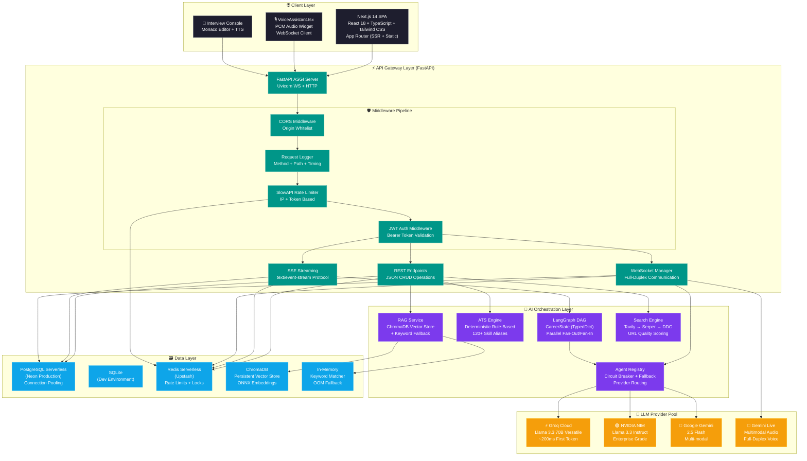

### 📡 **Communication Protocol Matrix**

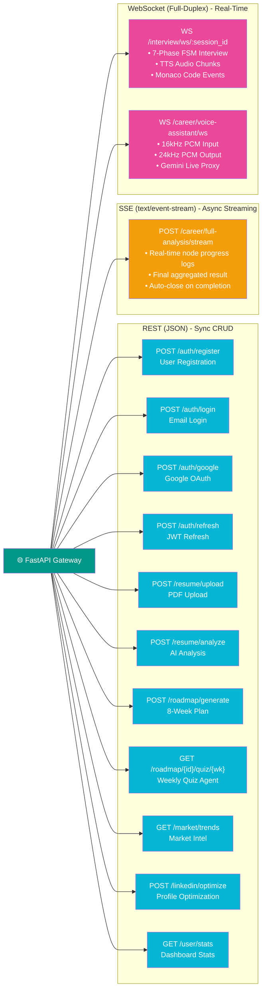

### 🔄 **Complete Request Lifecycle**

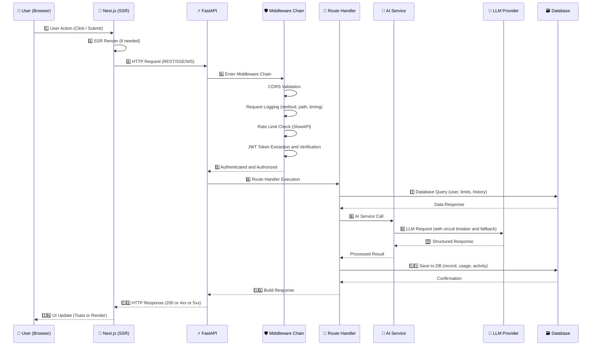

---

## 2. 🧠 **LangGraph DAG Orchestration**

### 🧭 **Career AI Operating System**

The Career AI OS uses a **static DAG (Directed Acyclic Graph)** with **parallel fan-out/fan-in execution**. Total pipeline latency = `max(resume, market) + max(linkedin, roadmap)`.

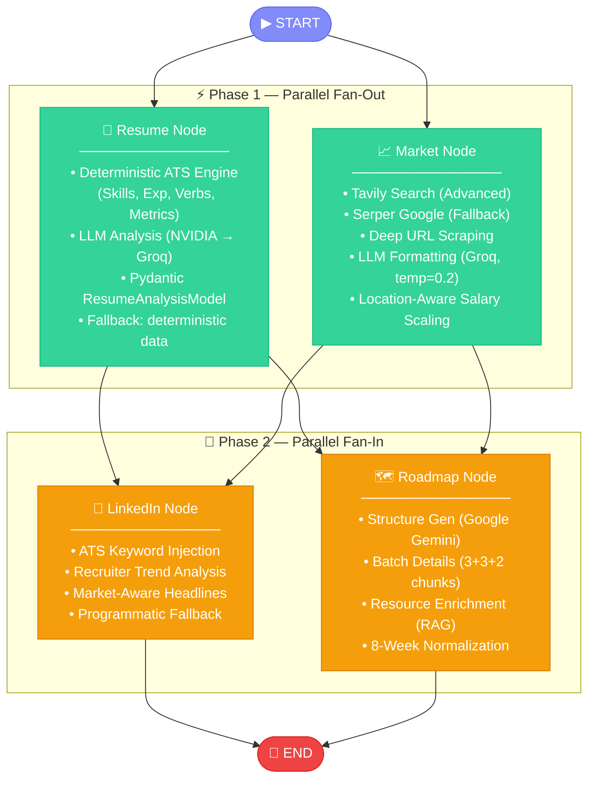

### 📊 **State Schema (TypedDict)**

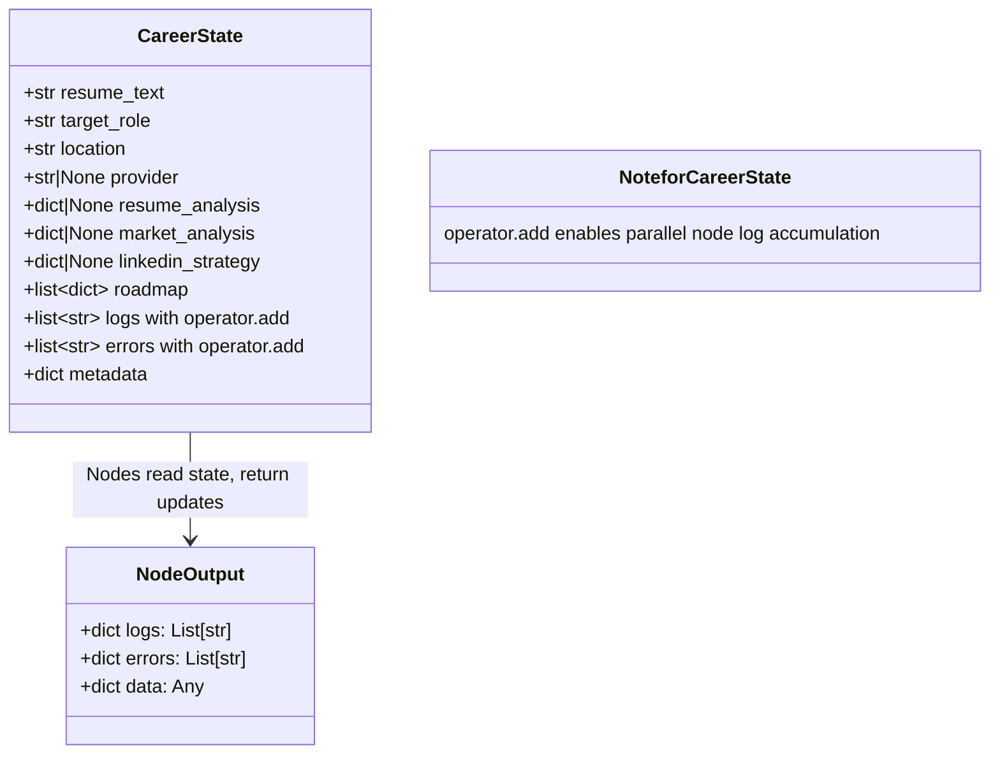

### 🔗 **Node Dependency Matrix**

| Node | Requires | Provides | Latency Factor | Fallback Strategy |
|------|----------|----------|:--------------:|-------------------|
| **📄 Resume** | `resume_text` | `resume_analysis` | High (LLM) | Deterministic ATS data |
| **📈 Market** | `target_role`, `location` | `market_analysis` | High (Search + LLM) | Unavailable response |
| **🔗 LinkedIn** | `resume_analysis`, `market_analysis` | `linkedin_strategy` | Medium (LLM) | Programmatic strategy |
| **🗺️ Roadmap** | `resume_analysis`, `market_analysis` | `roadmap[]` | Very High (LLM + RAG) | Fallback skeleton |

### 📐 **Pipeline Timing Breakdown**

```mermaid
gantt
    title Career Analysis Pipeline Timing (~60s total)
    dateFormat  X
    axisFormat %s
    
    section Phase 1 (Parallel)
    Resume Node (ATS + LLM)    : 0, 15
    Market Node (Search + LLM) : 0, 20
    
    section Phase 2 (Parallel)
    LinkedIn Node (LLM)        : 20, 10
    Roadmap Node (LLM + RAG)   : 20, 35
    
    section Finalize
    Save + Stream Result       : 55, 5
```

---

## 3. 🎤 **Mock Interview FSM (State Machine)**

### 🧭 **7-Phase Finite State Machine Overview**

The interview engine uses a **strict unidirectional state machine** with **7 phases + feedback**. Each phase has specific prompts, evaluation criteria, and transition rules.

```mermaid
stateDiagram-v2
    [*] --> INITIAL: Session Created
    
    state INITIAL {
        [*] --> SETUP: Initialize state
        SETUP --> READY: Load company/role config
    }
    
    INITIAL --> INTRO: Phase 0 to 1
    
    state INTRO {
        [*] --> WELCOME: Welcome to interview
        WELCOME --> BACKGROUND: Tell me about yourself
    }
    
    INTRO --> CS_FUNDAMENTALS: Phase 1 to 2
    
    state CS_FUNDAMENTALS {
        [*] --> FEEDBACK_INTRO: Feedback on intro
        FEEDBACK_INTRO --> CS_QUESTION: Role-specific CS question
    }
    
    CS_FUNDAMENTALS --> LEETCODE: Phase 2 to 3
    
    state LEETCODE {
        [*] --> FEEDBACK_CS: Feedback on CS answer
        FEEDBACK_CS --> CODING_CHALLENGE: Present LeetCode problem
        CODING_CHALLENGE --> CODE_SUBMIT: Candidate codes in Monaco
    }
    
    LEETCODE --> PROJECT_DEEPDIVE: Phase 3 to 4
    
    state PROJECT_DEEPDIVE {
        [*] --> FEEDBACK_CODE: Feedback on code
        FEEDBACK_CODE --> PROJECT_QUESTION: Deep dive into past project
    }
    
    PROJECT_DEEPDIVE --> SYSTEM_DESIGN: Phase 4 to 5
    
    state SYSTEM_DESIGN {
        [*] --> FEEDBACK_PROJECT: Feedback on project
        FEEDBACK_PROJECT --> DESIGN_SCENARIO: Whiteboard system design
    }
    
    SYSTEM_DESIGN --> COMPANY_DOMAIN: Phase 5 to 6
    
    state COMPANY_DOMAIN {
        [*] --> FEEDBACK_DESIGN: Feedback on design
        FEEDBACK_DESIGN --> DOMAIN_QUESTION: Company-specific scenario
    }
    
    COMPANY_DOMAIN --> CLOSING: Phase 6 to 7
    
    state CLOSING {
        [*] --> FEEDBACK_DOMAIN: Feedback on domain
        FEEDBACK_DOMAIN --> FINAL_QUESTION: Any questions for me
    }
    
    CLOSING --> FEEDBACK: Phase 7 to 8
    
    state FEEDBACK {
        [*] --> SCORING: AI Evaluation
        SCORING --> SCORE_CARD: Generate scorecard
        SCORE_CARD --> PERSIST: Save to database
    }
    
    FEEDBACK --> COMPLETED: Session Complete
    
    state COMPLETED {
        [*] --> DONE
    }
```

### 🎯 **Role Category Adaptation Matrix**

The FSM dynamically adjusts phase content based on the candidate's target role category:

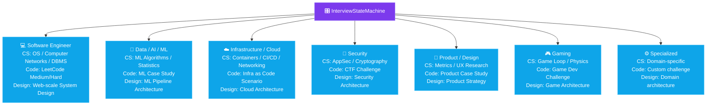

### 📋 **Phase Configuration Details**

| Phase | Name | Duration | Questions | Evaluation Criteria |
|:----:|------|:--------:|:---------:|-------------------|
| 0 | **INITIAL** | Instant | — | Session setup |
| 1 | **INTRO** | 2-3 min | 2-3 | Communication, background fit |
| 2 | **CS_FUNDAMENTALS** | 3-5 min | 1-2 | Technical depth, role-specific |
| 3 | **LEETCODE** | 10-15 min | 1 | Code quality, algorithms, optimization |
| 4 | **PROJECT_DEEPDIVE** | 3-5 min | 1-2 | Architecture decisions, impact |
| 5 | **SYSTEM_DESIGN** | 8-12 min | 1 | Scalability, trade-offs, communication |
| 6 | **COMPANY_DOMAIN** | 3-5 min | 1 | Company-specific knowledge |
| 7 | **CLOSING** | 2-3 min | 1-2 | Curiosity, engagement |
| 8 | **FEEDBACK** | Instant | — | Automated scoring |

### 📊 **Scoring Rubric**

| Category | Weight | Metrics |
|----------|:-----:|---------|
| **Technical Accuracy** | 30% | Correctness, depth, completeness |
| **Communication** | 20% | Clarity, structure, engagement |
| **Code Quality** | 20% | Efficiency, readability, edge cases |
| **System Design** | 15% | Scalability, trade-off analysis |
| **Cultural Fit** | 15% | Company alignment, enthusiasm |

### 🎙️ **Incremental Text-To-Speech (Edge-TTS) Pipeline**

To make the mock interviewer feel alive and conversational, the system implements a concurrent, incremental Text-to-Speech (TTS) pipeline that streams audio fragments as the LLM generates words, without waiting for the full response:

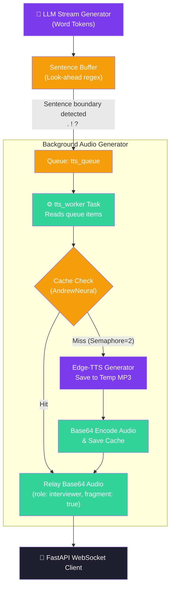

#### **Pipeline Configuration Details**
- **Voice Agent Profile**: Microsoft Edge-TTS `en-US-AndrewNeural` (Premium Professional US English Male Voice) set to `-5%` speech rate for natural pacing.
- **Noise Cleanup**: Strip markdown flags, raw URL strings, and code block formatting before feeding text to the engine.
- **Cache Management**: Up to 80 compiled base64 items or 50MB maximum cache memory.
- **Concurrency Safeguard**: `asyncio.Semaphore(2)` limits simultaneous Edge-TTS processes to prevent upstream API blocking and resource contention.

---

## 4. 🎙️ **Voice Assistant Pipeline (Anya)**

### 🌐 **End-to-End Voice Architecture**

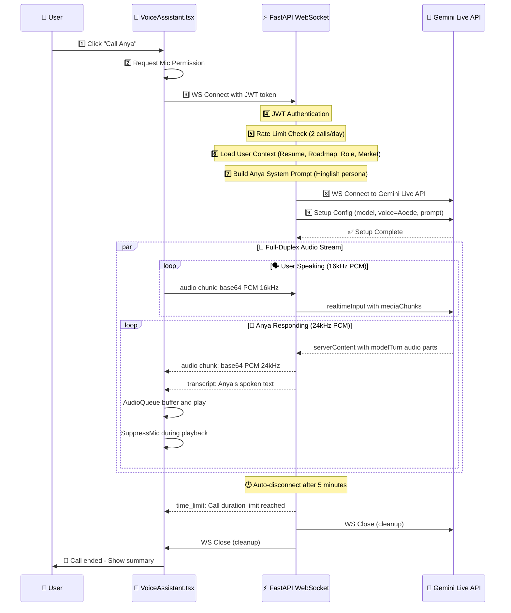

### 🧩 **Voice Assistant Component Architecture**

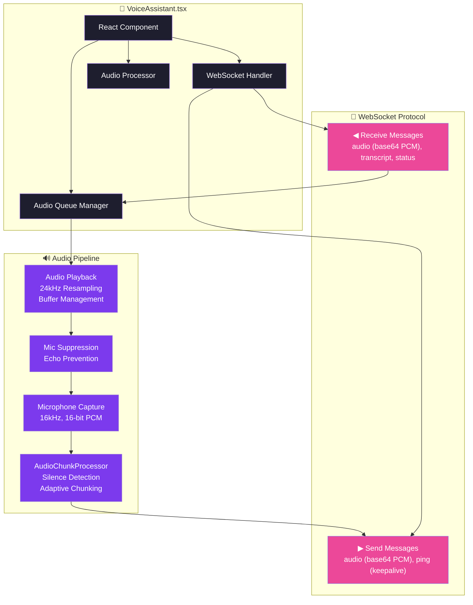

### 🧬 **Anya's Personality Configuration**

```
Name: Anya 🎀
Language: Hinglish (Hindi + English)
Tone: Sweet, friendly, encouraging, mentor
Voice: Google Aoede (Gemini Live Voice)

Personality Traits:
- 🎯 Career-focused and practical
- 💪 Motivational and uplifting
- 🎓 Knowledgeable yet humble
- 😂 Uses light humor and emojis
- 🇮🇳 Mixes Hindi and English naturally

Context Awareness:
- 📄 Knows latest resume analysis
- 🗺️ Tracks roadmap progress
- 🎯 Remembers target role
- 📍 Aware of location and market

Safety Controls:
- Max call duration: 5 minutes
- Daily call limit: 2
- Content filter: Always professional and constructive
```

---

## 5. 🛡️ **Agent Registry & Circuit Breaker**

### 🧭 **Unified LLM Caller Architecture**

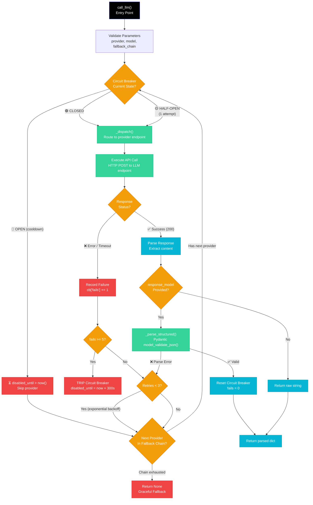

### 🛡️ **Circuit Breaker State Machine**

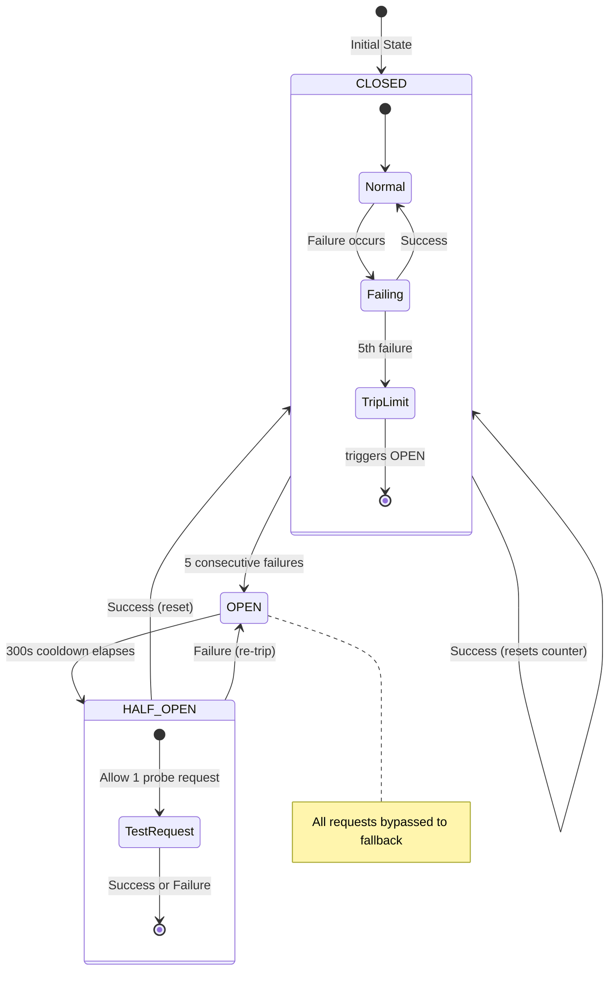

### 📋 **Provider Configuration & Fallback Chains**

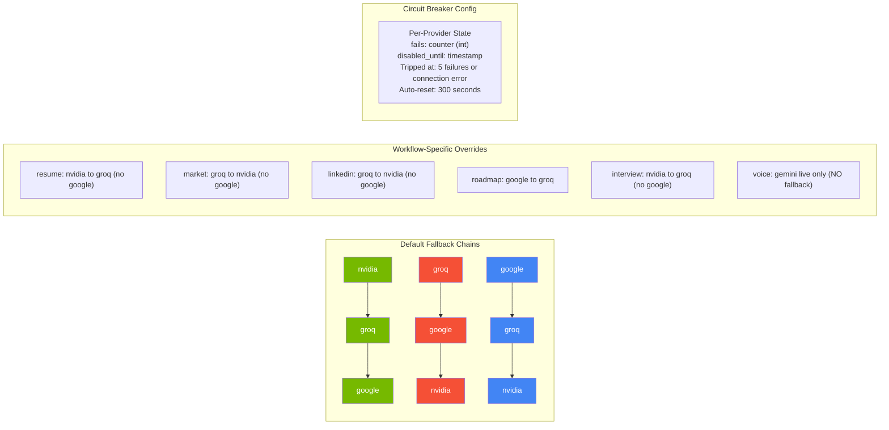

### 📊 **Provider Performance Comparison**

| Provider | Avg Latency | Cost/1K Tokens | Rate Limit | Best For |
|----------|:----------:|:--------------:|:----------:|----------|
| **⚡ Groq** | ~200ms | $0.00059 / $0.00079 | 30 req/min | Speed (Market, LinkedIn) |
| **🟢 NVIDIA** | ~500ms | $0.00070 / $0.00070 | 100 req/min | Stability (Resume, Interview) |
| **🔵 Gemini** | ~800ms | Free tier ($0) | 60 req/min | Quality (Roadmap structure) |

---

## 6. ⚡ **API Gateway & Middleware Stack**

### 🧭 **Middleware Pipeline Architecture**

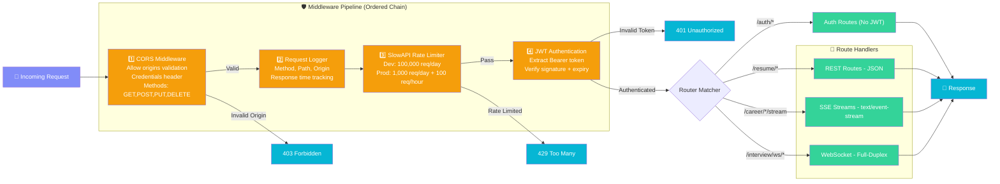

### 📋 **Complete Route Map**

> 📚 **Full endpoint documentation with request/response examples** → See [**API.md**](./API.md)

The API serves **25+ endpoints** across 9 route groups: Auth (public), Resume, Roadmap, Market, Career Analysis, LinkedIn, User (all protected), Interview (WebSocket), and Voice Assistant (WebSocket).

### ⚡ **SSE Streaming Protocol**

> 📚 **Full SSE event format and examples** → See [**API.md § Career Full Analysis**](./API.md#7-career-full-analysis-sse)


---

## 7. 🗃️ **Database Entity Relationship Diagram**

### 📐 **Complete ERD**

```mermaid
erDiagram
    classDef user fill:#818cf8,color:#fff
    classDef resume fill:#34d399,color:#fff
    classDef roadmap fill:#f59e0b,color:#fff
    classDef market fill:#06b6d4,color:#fff
    classDef interview fill:#ec4899,color:#fff
    classDef log fill:#a78bfa,color:#fff
    classDef analytics fill:#10b981,color:#fff

    users ||--o{ resumes : "has many (cascade delete)"
    users ||--o{ career_roadmaps : "has many (cascade delete)"
    users ||--o{ market_analyses : "has many (cascade delete)"
    users ||--o{ interview_sessions : "has many (cascade delete)"
    users ||--o{ activity_logs : "has many (cascade delete)"

    users {
        string id PK "UUID (auto-generated via uuid4)"
        string email UK "Unique, indexed for fast lookup"
        string name "User's full display name"
        string hashed_pw "Nullable - NULL for OAuth users"
        datetime created_at "Auto-set to UTC timestamp"
    }

    resumes {
        string id PK "UUID"
        string user_id FK "References users.id"
        string filename "Original PDF filename"
        json parsed_content "Full AI analysis result object"
        text raw_text "Extracted plain text from PDF"
        datetime uploaded_at "Auto timestamp"
    }

    career_roadmaps {
        string id PK "UUID"
        string user_id FK "References users.id"
        string target_role "e.g. Data Scientist or ML Engineer"
        json steps "8-week plan array of week objects"
        datetime created_at "Auto timestamp (UTC)"
    }

    market_analyses {
        string id PK "UUID"
        string user_id FK "References users.id"
        string target_role "e.g. Full Stack Developer"
        string location "e.g. Bangalore, India"
        json analysis "Full market intelligence report object"
        datetime created_at "Auto timestamp"
    }

    interview_sessions {
        string id PK "UUID"
        string user_id FK "References users.id"
        string target_role "Role being interviewed for"
        json chat_history "Array of role, content, timestamp objects"
        float score "Final score out of 100 (nullable until completed)"
        string status "in_progress or completed"
        datetime created_at "Session creation timestamp"
        datetime completed_at "Session completion timestamp (nullable)"
    }

    activity_logs {
        string id PK "UUID"
        string user_id FK "References users.id"
        string action "Human-readable action description"
        string feature "Feature category"
        datetime created_at "Auto timestamp"
    }

    daily_analytics {
        string id PK "UUID"
        date date UK "Unique date"
        int total_requests "Request accumulator"
        int total_tokens "Token accumulator"
        float estimated_cost "Estimated LLM cost in USD"
        int fallback_count "Fallback triggers count"
        int error_count "Errors/exceptions count"
        float groq_cost "Estimated Groq API cost in USD"
        float nvidia_cost "Estimated Nvidia API cost in USD"
        float google_cost "Estimated Google API cost in USD"
    }

    class users user
    class resumes resume
    class career_roadmaps roadmap
    class market_analyses market
    class interview_sessions interview
    class activity_logs log
    class daily_analytics analytics
```

### 📋 **Column Detail Reference**

| Table | Column | Type | Constraints | Description |
|-------|--------|------|:-----------:|-------------|
| **users** | `id` | `String` | PK, default uuid4 | Unique user identifier |
| | `email` | `String` | UK, NOT NULL, INDEX | Login email |
| | `name` | `String` | NOT NULL | Display name |
| | `hashed_pw` | `String` | NULLABLE | bcrypt hash (NULL for Google OAuth) |
| | `created_at` | `DateTime` | default now() | Account creation timestamp |
| **resumes** | `id` | `String` | PK | Resume record ID |
| | `user_id` | `String` | FK to users.id | Owner |
| | `filename` | `String` | NOT NULL | Original filename |
| | `parsed_content` | `JSON` | NULLABLE | Full AI analysis result |
| | `raw_text` | `Text` | NULLABLE | Extracted PDF text |
| | `uploaded_at` | `DateTime` | default now() | Upload timestamp |
| **career_roadmaps** | `id` | `String` | PK | Roadmap ID |
| | `user_id` | `String` | FK to users.id | Owner |
| | `target_role` | `String` | NOT NULL | Target job role |
| | `steps` | `JSON` | NULLABLE | 8-week plan array |
| | `created_at` | `DateTime` | default now() | Creation timestamp |
| **market_analyses** | `id` | `String` | PK | Analysis ID |
| | `user_id` | `String` | FK to users.id | Owner |
| | `target_role` | `String` | NOT NULL | Target role |
| | `location` | `String` | NOT NULL | Target location |
| | `analysis` | `JSON` | NULLABLE | Market intelligence report |
| | `created_at` | `DateTime` | default now() | Analysis timestamp |
| **interview_sessions** | `id` | `String` | PK | Session ID |
| | `user_id` | `String` | FK to users.id | Owner |
| | `target_role` | `String` | NOT NULL | Interview role |
| | `chat_history` | `JSON` | NULLABLE | Message history |
| | `score` | `Float` | NULLABLE | Score 0-100 |
| | `status` | `String` | default in_progress | Session status |
| | `created_at` | `DateTime` | default now() | Start time |
| | `completed_at` | `DateTime` | NULLABLE | End time |
| **activity_logs** | `id` | `String` | PK | Log ID |
| | `user_id` | `String` | FK to users.id | Owner |
| | `action` | `String` | NOT NULL | Action description |
| | `feature` | `String` | NOT NULL | Feature category |
| | `created_at` | `DateTime` | default now() | Log timestamp |
| **daily_analytics** | `id` | `String` | PK | Rollup record ID |
| | `date` | `Date` | UK, NOT NULL, INDEX | Rollup date |
| | `total_requests` | `Integer` | default 0 | Total API requests |
| | `total_tokens` | `Integer` | default 0 | Total API tokens used |
| | `estimated_cost` | `Float` | default 0.0 | Estimated LLM API cost in USD |
| | `fallback_count` | `Integer` | default 0 | Total fallback provider triggers |
| | `error_count` | `Integer` | default 0 | Total backend exceptions |
| | `groq_cost` | `Float` | default 0.0 | Estimated Groq API cost in USD |
| | `nvidia_cost` | `Float` | default 0.0 | Estimated Nvidia API cost in USD |
| | `google_cost` | `Float` | default 0.0 | Estimated Google API cost in USD |

---

## 8. 💻 **Frontend Component Architecture**

### 🧩 **Complete Component Tree**

```mermaid
graph TD
    classDef layout fill:#1e1e2e,color:#fff,stroke:#6c7086
    classDef dash fill:#0ea5e9,color:#fff,stroke:#38bdf8
    classDef shared fill:#7c3aed,color:#fff,stroke:#a78bfa
    classDef landing fill:#f59e0b,color:#fff,stroke:#fbbf24
    classDef svc fill:#34d399,color:#fff,stroke:#10b981

    ROOT["Root Layout - layout.tsx"]
    
    ROOT --> LANDING["page.tsx - Landing Page"]
    ROOT --> LOGIN["login/page.tsx - Login"]
    ROOT --> REGISTER["register/page.tsx - Register"]
    ROOT --> DASH_LAYOUT["dashboard/layout.tsx - Dashboard Layout<br/>Sidebar + Navbar"]
    
    subgraph "Dashboard Pages"
        DASH_LAYOUT --> D_HOME["dashboard/page.tsx<br/>Stats + Charts + Activity"]
        DASH_LAYOUT --> D_RESUME["resume/page.tsx<br/>Resume Upload + Analysis"]
        DASH_LAYOUT --> D_ROADMAP["roadmap/page.tsx<br/>Gamified Learning Tracker"]
        DASH_LAYOUT --> D_MARKET["market/page.tsx<br/>Market Explorer"]
        DASH_LAYOUT --> D_INTERVIEW["interview/page.tsx<br/>Mock Interview Console"]
        DASH_LAYOUT --> D_LINKEDIN["linkedin/page.tsx<br/>LinkedIn Optimizer"]
        DASH_LAYOUT --> D_ANALYSIS["full-analysis/page.tsx<br/>Full Career Analysis (SSE)"]
        DASH_LAYOUT --> D_SETTINGS["settings/page.tsx<br/>User Settings"]
        DASH_LAYOUT --> D_ADMIN["admin/observability/page.tsx<br/>Admin Observability Console"]
    end
    
    subgraph "Shared Components"
        SIDEBAR["Sidebar.tsx - Navigation Menu"]
        NAVBAR["Navbar.tsx - Top Bar"]
        VOICE["VoiceAssistant.tsx - Anya Floating Widget"]
        RESUME_PANEL["ResumeAnalysisPanel.tsx<br/>Analysis Results Display"]
        UPLOAD["UploadResumeCard.tsx<br/>PDF Drag-and-Drop"]
        PROGRESS["ProgressTracker.tsx<br/>Gamification HUD"]
        SKELETON["Skeleton.tsx - Loading State"]
    end
    
    subgraph "Landing Components"
        L_NAV["Navbar.tsx - Landing Navigation"]
        L_HERO["Hero.tsx - Main Hero Section"]
        L_FEATURES["Features.tsx - Feature Cards"]
        L_ANYA["AnyaSection.tsx - Anya Coaching Section"]
        L_SHOWCASE["Showcase.tsx - Product Showcase"]
        L_STATS["Stats.tsx - Platform Statistics"]
        L_PRICING["Pricing.tsx - Pricing Plans"]
        L_PLACEMENT["PlacementStats.tsx - Placement Data"]
        L_CTA["CTA.tsx - Call to Action"]
        L_FOOTER["Footer.tsx - Footer"]
    end
    
    subgraph "Service Layer (API Client)"
        API_CLIENT["client.ts<br/>Axios Instance + Interceptors"]
        S_API["api.ts - Common API Helper"]
        S_AUTH["auth.ts - Auth API Calls"]
        S_RESUME["resume.ts - Resume API Calls"]
        S_CAREER["career.ts - Career Analysis SSE"]
        S_ROADMAP["roadmap.ts - Roadmap API Calls"]
        S_MARKET["market.ts - Market API Calls"]
        S_INTERVIEW["interview.ts - Interview API Calls"]
        S_LINKEDIN["linkedin.ts - LinkedIn API Calls"]
        S_USER["user.ts - User Stats API"]
        S_ADMIN["admin.ts - Admin Observability API"]
    end

    DASH_LAYOUT --> SIDEBAR & NAVBAR & VOICE
    LANDING --> L_NAV & L_HERO & L_FEATURES & L_ANYA & L_SHOWCASE & L_STATS & L_PRICING & L_PLACEMENT & L_CTA & L_FOOTER

    class ROOT layout
    class LANDING,LOGIN,REGISTER layout
    class DASH_LAYOUT layout
    class D_HOME,D_RESUME,D_ROADMAP,D_MARKET,D_INTERVIEW,D_LINKEDIN,D_ANALYSIS,D_SETTINGS,D_ADMIN dash
    class SIDEBAR,NAVBAR,VOICE,RESUME_PANEL,UPLOAD,PROGRESS,SKELETON shared
    class L_NAV,L_HERO,L_FEATURES,L_ANYA,L_SHOWCASE,L_STATS,L_PRICING,L_PLACEMENT,L_CTA,L_FOOTER landing
    class API_CLIENT,S_API,S_AUTH,S_RESUME,S_CAREER,S_ROADMAP,S_MARKET,S_INTERVIEW,S_LINKEDIN,S_USER,S_ADMIN svc
```
```

### 📊 **Client-Server Data Flow**

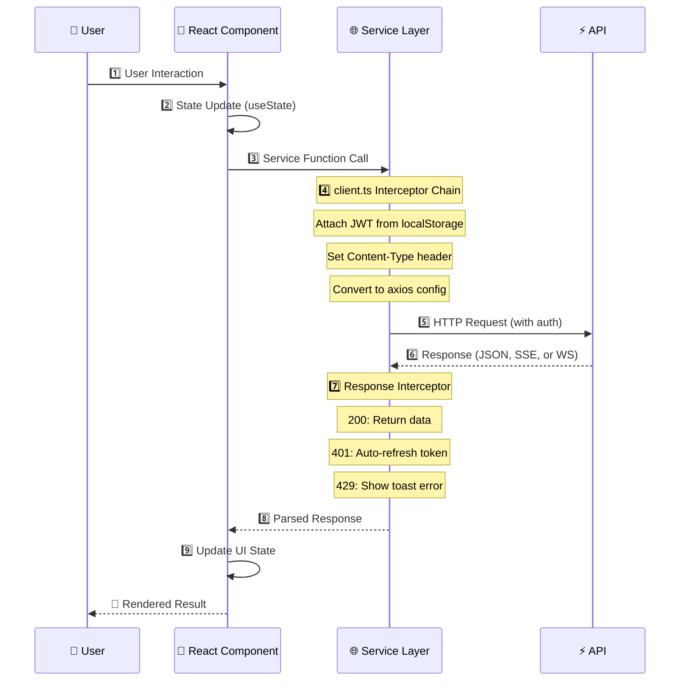

---

## 9. ☁️ **Deployment Topology**

### 🏗️ **Production Infrastructure**

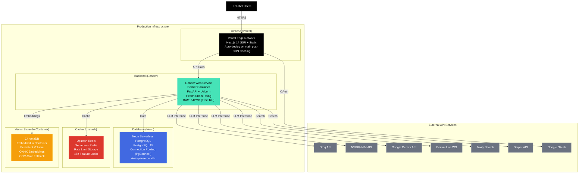

### 🔄 **Deployment Pipeline**

```mermaid
flowchart LR
    classDef dev fill:#1e1e2e,color:#fff
    classDef ci fill:#818cf8,color:#fff
    classDef deploy fill:#34d399,color:#fff

    DEV["💻 Local Development<br/>docker compose up"] --> CODE["📝 Code Commit<br/>git push origin main"]
    
    CODE --> GH["🐙 GitHub Repository"]
    
    GH --> CI["⚙️ GitHub Actions<br/>Parallel CI Pipeline"]
    
    subgraph CI [CI Pipeline]
        FJ["Frontend Job<br/>Node.js 20, npm ci, ESLint, Build"]
        BJ["Backend Job<br/>Python 3.11, pytest 106 tests, pip-audit"]
    end
    
    CI -->|"All Pass"| DEPLOY["🚀 Auto-Deploy"]
    
    DEPLOY --> VERCEL["Vercel Frontend Deploy"]
    DEPLOY --> RENDER["Render Backend Deploy"]
    
    VERCEL --> LIVE["🌍 Live Production"]
    RENDER --> LIVE

    class DEV dev
    class CODE,GH ci
    class CI,FJ,BJ ci
    class DEPLOY,VERCEL,RENDER deploy
    class LIVE deploy
```

### 🐳 **Docker Architecture**

```mermaid
graph TB
    classDef svc fill:#0ea5e9,color:#fff
    classDef vol fill:#f59e0b,color:#fff
    classDef net fill:#34d399,color:#fff

    subgraph "Docker Compose Stack"
        NET["Network: ai-career-network"]
        
        subgraph "Services"
            FE["Frontend Service<br/>Build: frontend/Dockerfile<br/>Port: 3000"]
            BE["Backend Service<br/>Build: backend/Dockerfile<br/>Port: 8000"]
            RD["Redis Service<br/>Image: redis:7-alpine<br/>Port: 6379"]
        end
        
        subgraph "Volumes"
            BE_VOL["backend-data<br/>SQLite & ChromaDB storage"]
            RD_VOL["redis-data<br/>Redis persistence"]
        end
    end

    FE --> NET
    BE --> NET
    RD --> NET
    
    BE --> BE_VOL
    RD --> RD_VOL
    FE -.->|depends_on| BE
    BE -.->|depends_on| RD

    class FE,BE,RD svc
    class BE_VOL,RD_VOL vol
    class NET net
```

---

## 10. 🔄 **Data Flow: Full Career Analysis**

### 🧠 **Complete Pipeline Execution**

```mermaid
sequenceDiagram
    participant Client as 🖥️ Frontend
    participant API as ⚡ FastAPI
    participant RL as 🚦 Rate Limiter
    participant Graph as 🧠 LangGraph DAG
    participant ATS as 🔢 ATS Engine
    participant Search as 🔍 Search API
    participant LLM as 🤖 LLM Provider
    participant RAG as 📚 RAG Service
    participant DB as 🗃️ Database

    Client->>API: POST /career/full-analysis/stream
    
    API->>RL: 1️⃣ check_daily_limit
    RL-->>API: ✅ Allowed
    
    API->>Graph: 2️⃣ Initialize CareerState
    Note over Graph: SSE Connection - Stream Node Logs
    
    par Phase 1: Parallel Fan-Out
        Graph->>ATS: 3️⃣ analyze_resume_deterministically
        ATS-->>Graph: 4️⃣ skills, experience, ats_score, strengths, gaps
        
        Graph->>LLM: 5️⃣ run_resume_agent with nvidia provider
        Note over LLM: Circuit breaker check with nvidia to groq fallback
        LLM-->>Graph: 6️⃣ ResumeAnalysis structured JSON
        
        Graph->>Search: 7️⃣ get_market_intelligence
        Search-->Search: Tavily to Serper fallback to Deep Scrape
        Search-->>Graph: 8️⃣ Raw market context
        
        Graph->>LLM: 9️⃣ run_market_agent with groq provider
        LLM-->>Graph: 🔟 MarketTrends structured JSON
    end
    
    Note over Graph: SSE: Stream Progress Logs to Client
    
    par Phase 2: Parallel Fan-In
        Graph->>LLM: 1️⃣1️⃣ run_linkedin_agent
        LLM-->>Graph: 1️⃣2️⃣ LinkedInStrategy (headlines, about, skills)
        
        Graph->>LLM: 1️⃣3️⃣ run_roadmap_structure with google provider
        LLM-->>Graph: 1️⃣4️⃣ 8-Week Skeleton
        Graph->>LLM: 1️⃣5️⃣ run_roadmap_details_batch
        LLM-->>Graph: 1️⃣6️⃣ Detailed Weeks
        Graph->>RAG: 1️⃣7️⃣ enrich_weeks_with_resources
        RAG-->RAG: DDG Search to Heuristic Score to GitHub Audit
        RAG-->>Graph: 1️⃣8️⃣ Enriched Roadmap Weeks
    end
    
    Graph-->>API: 1️⃣9️⃣ Final Aggregated State
    
    API->>DB: 2️⃣0️⃣ Save Market Analysis
    API->>DB: 2️⃣1️⃣ Save Career Roadmap
    API->>RL: 2️⃣2️⃣ increment_usage
    API->>DB: 2️⃣3️⃣ log_activity
    
    API-->>Client: 2️⃣4️⃣ SSE result with full payload
    Note over Client: Close SSE Connection
```

### 📦 **Response Envelope**

```
result: success
output:
  resume_analysis:
    technical_skills: [Python, React, Docker]
    years_of_experience: 3.5
    ats_score: 85
    ats_score_breakdown:
      keywords: 30, achievements: 25, action_verbs: 18, formatting: 12
  market_trends:
    role: Full Stack Developer
    location: Bangalore, India
    salary_range: INR 12L to 25L per annum
    market_trend: High demand
  roadmap:
    weeks: [8 enriched weeks with resources]
    target_role: Full Stack Developer
  linkedin_strategy:
    headlines: [...], about_section: ..., demanding_skills: [...]
logs: [Started Resume Analysis, Fetching Market Trends, ...]
errors: []
metadata:
  agents_involved: 4
  roadmap_weeks: 8
```

---

## 11. 📄 **Data Flow: Resume Upload & Analysis**

### 📐 **Detailed Pipeline**

```mermaid
flowchart TD
    classDef input fill:#818cf8,color:#fff,stroke:#6366f1
    classDef validate fill:#f59e0b,color:#fff,stroke:#d97706
    classDef process fill:#34d399,color:#fff,stroke:#10b981
    classDef ai fill:#7c3aed,color:#fff,stroke:#a78bfa
    classDef db fill:#0ea5e9,color:#fff,stroke:#38bdf8

    UPLOAD["📁 PDF Upload Request<br/>POST /resume/analyze"]
    
    subgraph "Validation Layer"
        V1["✅ Extension Check: .pdf"]
        V2["✅ MIME Type: application/pdf"]
        V3["✅ Magic Bytes: starts with %PDF-"]
        V4["✅ Size Limit: less than 5MB"]
    end
    
    subgraph "Text Extraction"
        E1["💾 Save to Temp File"]
        E2["📖 Extract with pdfplumber"]
        E3["🧹 Clean and Merge Pages"]
        E4["🗑️ Remove Temp File"]
    end
    
    subgraph "Sanitization"
        S1["Strip curly braces (injection protection)"]
        S2["Strip backticks"]
        S3["Normalize whitespace"]
        S4["Hard truncate to 6000 chars"]
    end
    
    subgraph "Cache Check"
        CACHE{"Cache Hit?"}
    end
    
    subgraph "Deterministic ATS Engine"
        D1["🚀 Skill Extraction (120+ aliases)"]
        D2["📅 Experience Estimation with interval merging (context-filtered)"]
        D3["📊 ATS Score: Keywords + Achievements + Verbs + Formatting"]
        D4["💪 Strength Detection"]
        D5["🔍 Gap Detection: Cloud, CI/CD, DB, System Design"]
    end
    
    subgraph "LLM Analysis"
        L1["Provider: NVIDIA NIM, Fallback: Groq"]
        L2["System Prompt: Senior ATS Recruiter"]
        L3["User Content: ATS Data + Sanitized Text"]
        L4["Response Model: ResumeAnalysisModel"]
    end
    
    subgraph "Pydantic Validation"
        P1["ATS Score Capping at 100"]
        P2["Experience Normalization at 25"]
        P3["Required Fields Check"]
    end
    
    subgraph "Database Save"
        DB1["Save Resume Record"]
        DB2["Increment Usage Counter"]
        DB3["Log Activity"]
        DB4["Update Cache with 1-hour TTL"]
    end

    UPLOAD --> V1 --> V2 --> V3 --> V4
    V4 --> E1 --> E2 --> E3 --> E4
    E3 --> S1 --> S2 --> S3 --> S4
    S4 --> CACHE
    
    CACHE -->|"Hit"| DB1
    CACHE -->|"Miss"| D1 --> D2 --> D3 --> D4 --> D5
    D5 --> L1 --> L2 --> L3 --> L4
    
    L4 --> P1 --> P2 --> P3
    P3 --> DB1 --> DB2 --> DB3 --> DB4
    
    style UPLOAD input
    style V1,V2,V3,V4 validate
    style E1,E2,E3,E4 process
    style S1,S2,S3,S4 process
    style D1,D2,D3,D4,D5 ai
    style L1,L2,L3,L4 ai
    style P1,P2,P3 process
    style DB1,DB2,DB3,DB4 db
```

### 📊 **ATS Score Calculation Formula**

```
ATS Score (0-100) = Keywords + Achievements + Action Verbs + Formatting

Keywords (max 35)      = min(len(skills_found) x 2, 35)
Achievements (max 30)  = min(metric_count x 4, 30)
  Metric patterns: percentages, dollar amounts, K/M/B suffixes
Action Verbs (max 20)  = min(len(unique_verbs) x 2, 20)
  28 verbs: developed, engineered, built, designed, led, managed...
Formatting (max 15)    = 1500-5000 chars: 15, >5000: 10, <1500: 5

Rules:
- Experience counts ONLY jobs/internships (excludes projects/hackathons and university graduation/coursework dates using look-back context analysis)
- Overlapping date ranges are merged for true cumulative experience
- OCR garbage detection: >20% non-printable chars results in score = 0
```

---

## 12. 📈 **Data Flow: Market Intelligence**

### 🔍 **Complete Market Intelligence Pipeline**

```mermaid
flowchart TD
    classDef input fill:#818cf8,color:#fff,stroke:#6366f1
    classDef search fill:#06b6d4,color:#fff,stroke:#0891b2
    classDef process fill:#f59e0b,color:#fff,stroke:#d97706
    classDef llm fill:#7c3aed,color:#fff,stroke:#a78bfa
    classDef output fill:#34d399,color:#fff,stroke:#10b981

    INPUT["🎯 Role + Location + Seniority"]
    
    INPUT --> CLASSIFY["🧠 Role Classification<br/>Domain: data_ai, cloud_infra, web_fullstack<br/>Seniority: intern, junior, mid, senior"]
    
    CLASSIFY --> REGION["🌍 Region Mapping<br/>City to Country to Region<br/>Currency formatting: INR, USD, GBP, EUR"]
    
    REGION --> SEARCH["🔍 Live Search Pipeline"]
    
    subgraph SEARCH [Live Search Pipeline]
        TAVILY["🔍 Tavily Search (Advanced)<br/>2 queries with raw content"]
        SERPER["🔍 Serper Google (Fallback)<br/>10 organic results with snippets"]
        SCRAPE["🌐 Deep URL Scraping<br/>Classify URLs, Clean HTML Content"]
    end
    
    SEARCH --> EXTRACT["📊 Deterministic Extraction<br/>Sources list, Region currency, Default scaffolds"]
    
    EXTRACT --> LLM_CALL["🤖 LLM Structured Extraction<br/>Provider: Groq (temp=0.2)<br/>Fallback: NVIDIA NIM<br/>Pydantic: MarketIntelligenceModel"]
    
    LLM_CALL --> MERGE["🔄 Merge LLM + Deterministic<br/>Prefer LLM values, fallback to deterministic"]
    
    MERGE --> OUTPUT["📊 Final Market Report"]
    
    OUTPUT --> SAVE["💾 Save to market_analyses table"]
    OUTPUT --> LOG["📝 Log Activity"]
    OUTPUT --> RESPONSE["📨 Response to Client"]

    style INPUT input
    style CLASSIFY,REGION process
    style TAVILY,SERPER,SCRAPE search
    style EXTRACT,LLM_CALL,MERGE llm
    style OUTPUT,SAVE,LOG,RESPONSE output
```

### 🌍 **Location Intelligence Database**

```
City to Country Mapping:
  Bangalore, Mumbai, Delhi, Pune -> India
  San Francisco, New York, Seattle -> USA
  London, Manchester, Edinburgh -> UK
  Berlin, Munich -> Germany
  Dubai, Abu Dhabi -> UAE
  Singapore -> Singapore

Country to Region Mapping:
  India -> INR, USA -> USD, UK -> GBP
  Germany -> EUR, UAE -> AED, Singapore -> SGD

Seniority Multipliers:
  intern: 0.45x, junior: 0.70x, mid: 1.00x, senior: 1.45x
```

---

## 13. 🚦 **Rate Limiting Architecture**

### 🧅 **Multi-Layer Rate Limiting**

```mermaid
flowchart TD
    classDef layer fill:#0ea5e9,color:#fff,stroke:#38bdf8
    classDef decision fill:#f59e0b,color:#fff,stroke:#d97706
    classDef block fill:#ef4444,color:#fff,stroke:#dc2626
    classDef allow fill:#34d399,color:#fff,stroke:#10b981

    REQ["📨 Incoming Request"]
    
    subgraph "Layer 1: Global Rate Limit (SlowAPI)"
        SLOW["SlowAPI Middleware<br/>Backend: Redis (Upstash)<br/>Key: IP Address<br/>Dev: 100,000 req/day<br/>Prod: 1,000 req/day + 100 req/hour"]
    end
    
    subgraph "Layer 2: Per-Feature Daily Caps (Custom)"
        CHECK["check_daily_limit(user_id, feature)"]
        
        GAP{"48h Gap Lock Check"}
        DAILY{"Daily Cap Check"}
    end
    
    subgraph "Backend: Redis (Upstash)"
        R_GET["Redis GET usage count"]
        R_INCR["Redis INCR increment"]
        R_TTL["Redis TTL 48h expiry"]
    end
    
    subgraph "Fallback: In-Memory"
        M_GET["dict() lookup per-user per-feature"]
        M_INCR["Counter increment"]
    end
    
    REQ --> SLOW
    
    SLOW -->|"Under Limit"| CHECK
    SLOW -->|"Exceeded"| BLOCK_G["429 Too Many Requests"]
    
    CHECK --> GAP
    
    GAP -->|"Locked"| BLOCK_F["429 Feature Locked for 48h"]
    GAP -->|"No Lock"| DAILY
    
    DAILY -->|"Cap Reached"| BLOCK_D["429 Daily Limit Reached"]
    DAILY -->|"Available"| R_GET
    
    R_GET -->|"Redis OK"| ALLOW["✅ Allow Request"]
    R_GET -->|"Redis Down"| M_GET --> ALLOW["✅ Allow (memory fallback)"]
    
    ALLOW --> HANDLER["🎯 Route Handler"]
    HANDLER --> R_INCR & M_INCR

    style REQ layer
    style SLOW,CHECK layer
    style GAP,DAILY decision
    style R_GET,R_INCR,R_TTL layer
    style M_GET,M_INCR layer
    style BLOCK_G,BLOCK_F,BLOCK_D block
    style ALLOW,HANDLER allow
```

### 📊 **Feature Limits Matrix**

> 📚 **Complete rate limit tables and error responses** → See [**API.md § Rate Limits**](./API.md#14-rate-limits)

### 🔐 **Security Architecture**

> 📚 **Code-level security implementation (auth, sanitization, PDF validation)** → See [**SYSTEM.md § Security**](./SYSTEM.md#13-security-architecture)

```mermaid
flowchart TD
    REQ["Incoming Request"]
    
    L1["🔴 Layer 1: Network<br/>• HTTPS (TLS 1.3)<br/>• CORS whitelist"]
    L2["🟠 Layer 2: Rate Limiting<br/>• SlowAPI (global)<br/>• Custom (per-feature)"]
    L3["🟡 Layer 3: Authentication<br/>• JWT (60min)<br/>• Refresh Token (30d)<br/>• Google OAuth 2.0"]
    L4["🟢 Layer 4: Authorization<br/>• get_current_user()<br/>• WebSocket token check"]
    L5["🔵 Layer 5: Input Validation<br/>• Pydantic schemas<br/>• PDF validation (4 checks)<br/>• Prompt injection defense"]
    L6["🟣 Layer 6: Production Guards<br/>• SQLite blocked<br/>• Default secret blocked<br/>• OOM prevention"]
    L7["⚪ Layer 7: Error Handling<br/>• Safe logging (loguru)<br/>• Graceful degradation"]
    
    REQ --> L1 --> L2 --> L3 --> L4 --> L5 --> L6 --> L7 --> HANDLER["Route Handler"]

    style REQ fill:#1e1e2e,color:#fff
    style HANDLER fill:#34d399,color:#fff
```

---

## 14. 🧬 **RAG & Resource Enrichment Pipeline**

### 📚 **Complete Resource Quality Engine**

```mermaid
flowchart TD
    classDef input fill:#818cf8,color:#fff,stroke:#6366f1
    classDef search fill:#06b6d4,color:#fff,stroke:#0891b2
    classDef quality fill:#f59e0b,color:#fff,stroke:#d97706
    classDef fallback fill:#7c3aed,color:#fff,stroke:#a78bfa
    classDef output fill:#34d399,color:#fff,stroke:#10b981

    WEEKS["🗓️ 8-Week Roadmap Topics"]
    
    WEEKS --> GEN_QUERY["🔍 Generate Search Queries<br/>2-3 topic-specific queries per week"]
    
    GEN_QUERY --> DDG["🦆 DuckDuckGo Search<br/>10 results per query"]
    
    subgraph "Quality Scoring Engine"
        DOMAIN["📊 Domain Weight Scoring"]
        GITHUB["🐙 GitHub Repository Audit"]
        URL_CHECK["✅ URL Reachability Check"]
        DEDUP["📝 Title Deduplication"]
    end
    
    subgraph "Domain Scoring"
        HEURISTIC["Official docs: +40pts<br/>GitHub repos: +25pts<br/>Educational: +10 to +20pts<br/>Community: +5pts<br/>Legacy penalty: -20pts"]
    end
    
    subgraph "GitHub Audit"
        GH_AUDIT["Star count check<br/>Last push date check<br/>Archive status check"]
    end
    
    subgraph "URL Validation"
        URL_VAL["Parallel HTTP Validation<br/>10 concurrent workers<br/>HEAD request with GET fallback<br/>Must return 200 OK"]
    end
    
    subgraph "Deduplication"
        DEDUP_LOGIC["Title Similarity Check<br/>difflib.SequenceMatcher<br/>Threshold: 0.85"]
    end

    subgraph "Fallback Layer"
        CHROMA["🗃️ ChromaDB Vector Search<br/>ONNX all-MiniLM-L6-v2<br/>Cosine similarity"]
        KEYWORD["📝 In-Memory Keyword Matcher<br/>OOM-safe fallback<br/>Zero dependencies"]
    end

    DDG --> HEURISTIC
    HEURISTIC --> GH_AUDIT
    GH_AUDIT --> URL_VAL
    URL_VAL --> DEDUP_LOGIC
    
    DEDUP_LOGIC -->|"3 or more resources"| ENRICHED["✅ Enriched Roadmap Weeks<br/>YouTube, Articles, GitHub, Docs"]
    
    DEDUP_LOGIC -->|"Less than 3 resources"| CHROMA
    CHROMA -->|"Found"| ENRICHED
    CHROMA -->|"OOM or Error"| KEYWORD --> ENRICHED
    
    style WEEKS input
    style GEN_QUERY,DDG search
    style DOMAIN,GITHUB,URL_CHECK,DEDUP quality
    style HEURISTIC,GH_AUDIT,URL_VAL,DEDUP_LOGIC quality
    style CHROMA,KEYWORD fallback
    style ENRICHED output
```

### 🏆 **Domain Scoring Matrix**

| Domain | Base Weight | Examples |
|--------|:----------:|----------|
| **Official Documentation** | +40 pts | docs.docker.com, react.dev, developer.mozilla.org |
| **GitHub Repository** | +25 pts | github.com/user/repo (+10 if stars > 100) |
| **Educational Platform** | +20 pts | freecodecamp.org, roadmap.sh |
| **Tutorial Sites** | +10 pts | geeksforgeeks.org, tutorialspoint.com |
| **Community Blogs** | +5 pts | medium.com, dev.to, hashnode.dev |
| **Legacy / Deprecated** | -20 pts | angularjs.org, class-components |

### 🛡️ **OOM Prevention Strategy**

```mermaid
flowchart LR
    classDef start fill:#818cf8,color:#fff
    classDef check fill:#f59e0b,color:#fff
    classDef chroma fill:#7c3aed,color:#fff
    classDef fallback fill:#34d399,color:#fff

    START["🚀 Service Startup"]
    
    CHECK_1{"RENDER env or DISABLE_CHROMA?"}
    CHECK_2{"chromadb imports?"}
    CHECK_3{"ONNX model load success?"}
    
    START --> CHECK_1
    
    CHECK_1 -->|"Yes (512MB RAM)"| SKIP["⏭️ Skip ChromaDB<br/>Use In-Memory Only"]
    CHECK_1 -->|"No"| CHECK_2
    
    CHECK_2 -->|"Not installed"| FALLBACK["📝 In-Memory Keyword Matcher"]
    CHECK_2 -->|"Installed"| CHECK_3
    
    CHECK_3 -->|"Success"| ACTIVE["🗃️ ChromaDB Active<br/>Full Vector Search"]
    CHECK_3 -->|"Memory Error"| FALLBACK
    
    SKIP --> FALLBACK

    class START start
    class CHECK_1,CHECK_2,CHECK_3 check
    class ACTIVE chroma
    class SKIP,FALLBACK fallback
```

---

## 15. 🔒 **Authentication Flow**

### 🧭 **Complete Auth Architecture**

```mermaid
sequenceDiagram
    participant U as 👤 User
    participant F as 🖥️ Frontend
    participant A as ⚡ FastAPI
    participant DB as 🗃️ Database
    participant G as 🌐 Google OAuth

    rect rgb(30, 30, 46)
        Note over U,DB: Email/Password Registration
        U->>F: Fill Register Form
        F->>A: POST /auth/register
        A->>DB: Check if email exists
        DB-->>A: Email available
        A->>A: Hash password (bcrypt)
        A->>DB: INSERT new User
        DB-->>A: User created
        A->>A: Generate JWT Pair (access + refresh)
        A-->>F: tokens with token_type
        F->>F: Store tokens in localStorage
        F-->>U: Redirect to Dashboard
    end

    U->>F: Click Login
    rect rgb(30, 30, 46)
        Note over U,DB: Email/Password Login
        F->>A: POST /auth/login
        A->>DB: Find user by email
        DB-->>A: User found
        A->>A: Verify password (bcrypt)
        alt Invalid Password
            A-->>F: 401 Unauthorized
        else Valid
            A->>A: Generate JWT Pair
            A-->>F: access_token and refresh_token
        end
    end

    rect rgb(30, 30, 46)
        Note over U,DB: Google OAuth
        U->>F: Click Sign in with Google
        F->>G: Google OAuth Popup
        G-->>F: Google credential
        F->>A: POST /auth/google with credential
        
        alt Access Token (starts with ya29.)
            A->>G: GET UserInfo API
            G-->>A: email, name, picture
        else ID Token (JWT format)
            A->>G: verify_oauth2_token()
            G-->>A: email, name, sub
        end
        
        A->>DB: Find or Create user
        alt New User
            A->>DB: INSERT User with NULL hashed_pw
        end
        
        A->>A: Generate JWT Pair
        A-->>F: tokens with name
    end

    rect rgb(30, 30, 46)
        Note over U,DB: Token Refresh
        F->>A: POST /auth/refresh
        A->>A: Decode refresh token, verify type
        A->>DB: Find user by sub
        A->>A: Generate new JWT Pair
        A-->>F: new access_token and refresh_token
    end
```

### 🔑 **JWT Token Structure**

```
Access Token:
  Payload: sub: user-uuid, exp: now+60min, iat: now, type: access
  Header: alg: HS256, typ: JWT
  Lifespan: 60 minutes
  Sent in: Authorization: Bearer header

Refresh Token:
  Payload: sub: user-uuid, exp: now+30days, iat: now, type: refresh
  Header: alg: HS256, typ: JWT
  Lifespan: 30 days
  Sent in: Request body
```

---

## 16. 🚇 **WebSocket Communication Protocol**

### 🎤 **Interview WebSocket Protocol**

```mermaid
sequenceDiagram
    participant C as 🖥️ Client
    participant S as ⚡ Server
    participant I as 🧠 Interview State Machine

    C->>S: 1️⃣ WS Connect with role, company, token
    S->>S: 2️⃣ Authenticate token
    S->>S: 3️⃣ Create/Resume InterviewSession
    S-->>C: 4️⃣ connected with session_id and phase intro
    
    Note over C: Phase 1: Intro
    S-->>C: 5️⃣ question: Welcome and tell me about yourself
    
    C->>S: 6️⃣ response: I'm a full-stack engineer with 5 years of experience
    S->>I: 7️⃣ Process response, generate feedback and next
    S-->>C: 8️⃣ feedback: Great background, moving to CS fundamentals
    
    Note over C: Phase 3: LeetCode
    S-->>C: 9️⃣ question with code_stub: Implement a function
    Note right of C: Monaco Editor displays code stub
    
    C->>S: 🔟 code_update: submission received
    Note over S: Real-time code evaluation
    
    C->>S: 1️⃣1️⃣ response: My solution uses O(n) time
    
    Note over C: Final Phase: Feedback
    S-->>C: 1️⃣2️⃣ feedback: complete with score 85 and summary
    C->>S: 1️⃣3️⃣ WS Close
    
    Note over S: Save session to DB
```

### 🎙️ **Voice Assistant WebSocket Protocol**

```mermaid
sequenceDiagram
    participant C as 🖥️ Client (VoiceAssistant.tsx)
    participant S as ⚡ Server (FastAPI WS Proxy)
    participant G as 🔵 Gemini Live API

    Note over C,G: Connection Setup
    C->>S: WS Connect with JWT token
    S->>S: 1. JWT Verify, 2. Rate Limit, 3. Load Context
    S->>G: WS Connect to Gemini Live API
    G-->>S: Setup Complete
    S-->>C: setup_complete with call_id
    
    Note over C,G: Bidirectional Audio
    loop User Speaking
        C->>C: Capture 16kHz PCM, Chunk, Base64
        C->>S: audio: base64 PCM 16kHz
        S->>G: realtimeInput with mediaChunks
    end
    
    loop Anya Responding
        G-->>S: serverContent with modelTurn audio
        S-->>C: audio: base64 PCM 24kHz
        S-->>C: transcript: Anya said this
        C->>C: Buffer, Play, Suppress Mic
    end
    
    Note over C,G: Session End
    S-->>C: time_limit: 5 min reached
    S->>G: WS Close
    S->>C: WS Close
```

### 📋 **WebSocket Message Types**

| Direction | Type | Description |
|:---------:|------|-------------|
| **Server** | `connected` | Connection established with session_id and phase |
| | `question` | AI question with phase, text, audio, code_stub |
| | `feedback` | AI feedback with text, phase, score |
| | `audio` | PCM audio chunk (base64 encoded) |
| | `transcript` | Spoken text transcript |
| | `time_limit` | Call time limit reached notification |
| | `error` | Error notification |
| **Client** | `response` | Candidate answer text |
| | `code_update` | Code editor content update |
| | `audio` | Mic audio chunk (base64 PCM) |
| | `ping` | Keepalive signal |

---

## 17. 🧪 **Test Architecture & Coverage**

### 📐 **Test Pyramid**

```mermaid
graph TB
    classDef unit fill:#818cf8,color:#fff,stroke:#6366f1
    classDef integ fill:#34d399,color:#fff,stroke:#10b981
    classDef e2e fill:#f59e0b,color:#fff,stroke:#d97706

    E2E["🧪 End-to-End Tests<br/>Full pipeline integration<br/>Coverage: 0 (future)"]
    
    INTEG["🔗 Integration Tests<br/>API endpoints: 9 tests<br/>Features pipeline: 10 tests<br/>Voice assistant WS: 3 tests<br/>Observability: 2 tests<br/>Admin metrics: 1 test<br/>Total: 25 tests"]
    
    UNIT["🔬 Unit Tests<br/>Agent registry: 26 tests<br/>Roadmap agents: 24 tests<br/>Validation schemas: 16 tests<br/>ATS engine: 5 tests<br/>Market service: 4 tests<br/>Gamified roadmap: 4 tests<br/>LinkedIn: 2 tests<br/>Total: 81 tests"]

    E2E -.->|"106 Total Tests"| INTEG --> UNIT

    class UNIT unit
    class INTEG integ
    class E2E e2e
```

### 📊 **Test Coverage Matrix**

```mermaid
graph TD
    classDef title fill:#1e1e2e,color:#fff,stroke:#6c7086
    classDef test fill:#818cf8,color:#fff,stroke:#6366f1
    classDef area fill:#34d399,color:#fff,stroke:#10b981

    TESTS["🧪 Test Suite - 106 Tests"]
    
    TESTS --> AR["test_agents_registry.py: 26 tests"]
    TESTS --> RA["test_roadmap_agents.py: 24 tests"]
    TESTS --> PV["test_validation.py: 16 tests"]
    TESTS --> M["test_main.py: 9 tests"]
    TESTS --> F["test_features.py: 10 tests"]
    TESTS --> AE["test_ats_engine.py: 5 tests"]
    TESTS --> MS["test_market_service.py: 4 tests"]
    TESTS --> GR["test_gamified_roadmap.py: 4 tests"]
    TESTS --> VA["test_voice_assistant.py: 3 tests"]
    TESTS --> LI["test_linkedin.py: 2 tests"]
    TESTS --> OB["test_observability.py: 2 tests"]
    TESTS --> AM["test_admin_metrics_fetch.py: 1 test"]

    subgraph "Coverage Areas"
        C1["🧠 Agent Registry<br/>JSON extraction, Circuit breaker, Fallback chains"]
        C2["🗺️ Roadmap Agents<br/>Fallback structures, Detail batching, Week normalization"]
        C3["✅ Pydantic Validation<br/>ATS score capping, Coercion validators, Constraints"]
        C4["⚡ Main API<br/>Auth endpoints, Rate limiting, JWT lifecycle"]
        C5["⚙️ Core Features<br/>Market scrapers, TTS audio, Search algorithms, Cache"]
        C6["🔢 ATS Engine<br/>Date parsing, Interval merging, Skill extraction"]
        C7["📈 Market Service<br/>Salary conversion, Role classification, Location mapping"]
        C8["🎮 Gamified Roadmap<br/>Week completion triggers, Quiz generation"]
        C9["🎙️ Voice Assistant<br/>WebSocket auth flow, Gemini config"]
        C10["🔗 LinkedIn<br/>Fallback strategy, Model structures"]
    end

    AR --> C1
    RA --> C2
    PV --> C3
    M --> C4
    F --> C5
    AE --> C6
    MS --> C7
    GR --> C8
    VA --> C9
    LI --> C10
    OB --> C4
    AM --> C4

    class TESTS title
    class AR,RA,PV,M,F,AE,MS,GR,VA,LI,OB,AM test
    class C1,C2,C3,C4,C5,C6,C7,C8,C9,C10 area
```

### 🏃 **Running Tests**

```bash
# Run all tests (106 total)
cd backend
PYTHONPATH=. python -m pytest tests/ -v

# Run by category
pytest tests/test_agents_registry.py -v  # 26 tests
pytest tests/test_roadmap_agents.py -v   # 24 tests
pytest tests/test_validation.py -v       # 16 tests
pytest tests/test_main.py -v             # 9 tests

# Run with coverage
pip install pytest-cov
pytest tests/ --cov=app --cov-report=html
```

---

## 18. ⚙️ **CI/CD Pipeline Architecture**

The application employs automated workflows powered by GitHub Actions to guarantee codebase stability, dependency security, integration correctness, and seamless deployment. The pipeline is split into three main workflows targeting CI verification, Docker image publishing, and deployment triggers.

### 🚀 **GitHub Actions Workflows Overview**

```mermaid
flowchart TD
    classDef trigger fill:#818cf8,color:#fff,stroke:#6366f1
    classDef job fill:#f59e0b,color:#fff,stroke:#d97706
    classDef step fill:#34d399,color:#fff,stroke:#10b981
    classDef deploy fill:#0ea5e9,color:#fff,stroke:#38bdf8
    classDef fail fill:#ef4444,color:#fff,stroke:#dc2626

    TRIGGER["📦 Push / PR to main branch"]

    %% Workflow 1: CI Pipeline
    TRIGGER --> CI_JOB["⚡ Continuous Integration (ci.yml)"]
    
    subgraph FE_SUB["Frontend Job"]
        F1["Node.js Setup (v20)"]
        F2["Install Deps (npm ci)"]
        F3["Lint Check (npm run lint)"]
        F4["Next.js Build (npm run build)"]
        F1 --> F2 --> F3 --> F4
    end
    
    subgraph BE_SUB["Backend Job"]
        B1["Python Setup (v3.11)"]
        B2["Install Deps (requirements.txt)"]
        B3["Pytest Suite (106 tests)"]
        B4["Dependency Audit (pip-audit)"]
        B5["Database Migration (Alembic)"]
        B6["FastAPI Background Server"]
        B7["Newman Integration Tests<br/>(Auth, User, Health & System)"]
        B1 --> B2 --> B3 --> B4 --> B5 --> B6 --> B7
    end
    
    CI_JOB --> F1
    CI_JOB --> B1

    %% Workflow 2: Docker Publish
    TRIGGER --> DOCKER_JOB["🐳 Docker Publish (docker-publish.yml)"]
    subgraph DOCKER_SUB["Docker Multi-Arch Build"]
        D1["Log in to GHCR"]
        D2["Build & Push Backend Image"]
        D3["Build & Push Frontend Image"]
        D1 --> D2 --> D3
    end
    DOCKER_JOB --> D1

    %% Workflow 3: Render Deploy
    TRIGGER --> DEPLOY_JOB["☁️ Render Deploy (backend-deploy.yml)"]
    DEPLOY_JOB -->|"Path: backend/**"| R1["Trigger Render Deploy Hook"]

    %% Deployments
    F4 -->|"Pass"| VERCEL["Vercel Auto-Deploy (Frontend)"]
    B7 -->|"Pass"| RENDER["Render Deploy Hook (Backend)"]
    
    VERCEL & RENDER --> PROD["🌍 Production Live"]

    class TRIGGER trigger
    class CI_JOB,DOCKER_JOB,DEPLOY_JOB job
    class F1,F2,F3,F4 step
    class B1,B2,B3,B4,B5,B6,B7 step
    class D1,D2,D3 step
    class R1 step
    class VERCEL,RENDER,PROD deploy
```

### 📋 **Active Pipeline Configurations**

The repository utilizes three dedicated GitHub Actions configurations:

#### 1️⃣ **Continuous Integration** (`.github/workflows/ci.yml`)
Runs linting, unit/integration tests, dependency vulnerability audits, and Newman-based API integration tests on every push and pull request to the `main` branch.

```yaml
name: CI

on:
  push:
    branches: [main]
  pull_request:
    branches: [main]
  workflow_dispatch:

jobs:
  frontend:
    name: Frontend (Lint + Build)
    runs-on: ubuntu-latest
    steps:
      - uses: actions/checkout@v4
      - name: Setup Node.js
        uses: actions/setup-node@v4
        with:
          node-version: '20'
          cache: 'npm'
          cache-dependency-path: package-lock.json
      - name: Install dependencies
        run: npm ci
      - name: Lint
        run: npm run lint -w frontend
      - name: Build
        run: npm run build -w frontend

  backend:
    name: Backend (Tests + Audit)
    runs-on: ubuntu-latest
    defaults:
      run:
        working-directory: backend
    steps:
      - uses: actions/checkout@v4
      - name: Setup Python
        uses: actions/setup-python@v5
        with:
          python-version: '3.11'
          cache: 'pip'
          cache-dependency-path: backend/requirements.txt
      - name: Install dependencies
        run: pip install -r requirements.txt
      - name: Run tests
        run: python -m pytest -p no:cacheprovider
        env:
          PYTHONPATH: .
          DATABASE_URL: sqlite:///./test.db
          SECRET_KEY: ci-test-secret-key-not-for-production
          LLM_PROVIDER: groq
          GROQ_API_KEY: ${{ secrets.GROQ_API_KEY }}
          GROQ_MODEL: llama-3.3-70b-versatile
      - name: Python dependency audit (pip-audit)
        run: |
          pip install pip-audit
          pip-audit -r requirements.txt --ignore-vuln PYSEC-2022-42974 || true
      - name: Install Newman (Postman CLI)
        run: npm install -g newman
      - name: Start FastAPI server in background
        run: |
          python -m alembic upgrade head
          python -m uvicorn app.main:app --port 8000 > uvicorn.log 2>&1 &
          echo "Waiting for FastAPI server to start..."
          SUCCESS=0
          for i in {1..30}; do
            if curl -s http://localhost:8000/ping > /dev/null; then
              echo "FastAPI is up and running!"
              SUCCESS=1
              break
            fi
            echo "Waiting for server to bind... ($i/30)"
            sleep 1
          done
          if [ $SUCCESS -eq 0 ]; then
            echo "=== Uvicorn logs ==="
            cat uvicorn.log
            exit 1
          fi
        env:
          PYTHONPATH: .
          DATABASE_URL: sqlite:///./ci_dev.db
          SECRET_KEY: ci-test-secret-key-not-for-production
          GROQ_API_KEY: mock-groq-key
          GOOGLE_API_KEY: mock-google-key
          NVIDIA_API_KEY: mock-nvidia-key
          APP_ENV: development
      - name: Run Postman Integration Tests (Newman)
        run: |
          newman run ../ai_career_mentor_postman_collection.json --folder Auth --folder User --folder "Health & System" --env-var base_url=http://localhost:8000 || (echo "=== Uvicorn Logs ===" && cat uvicorn.log && exit 1)
```

#### 2️⃣ **Docker Build & Publish** (`.github/workflows/docker-publish.yml`)
Builds and pushes multi-stage optimized production Docker containers to the GitHub Container Registry (`ghcr.io`) upon pushes to `main`.

```yaml
name: Docker Build & Publish

on:
  push:
    branches: [main]
  workflow_dispatch:

env:
  REGISTRY: ghcr.io
  IMAGE_NAME_PREFIX: ai-career-mentor

jobs:
  build-and-push:
    name: Build & Push Docker Images
    runs-on: ubuntu-latest
    permissions:
      contents: read
      packages: write
    steps:
      - name: Checkout repository
        uses: actions/checkout@v4
      - name: Log in to the Container registry
        uses: docker/login-action@v3
        with:
          registry: ${{ env.REGISTRY }}
          username: ${{ github.actor }}
          password: ${{ secrets.GITHUB_TOKEN }}
      - name: Set up QEMU
        uses: docker/setup-qemu-action@v3
      - name: Set up Docker Buildx
        uses: docker/setup-buildx-action@v3
      - name: Extract metadata (tags, labels) for Backend
        id: meta-backend
        uses: docker/metadata-action@v5
        with:
          images: ${{ env.REGISTRY }}/${{ github.repository_owner }}/${{ env.IMAGE_NAME_PREFIX }}-backend
      - name: Build and push Backend image
        uses: docker/build-push-action@v5
        with:
          context: ./backend
          push: true
          tags: ${{ steps.meta-backend.outputs.tags }}
          labels: ${{ steps.meta-backend.outputs.labels }}
          provenance: false
      - name: Extract metadata (tags, labels) for Frontend
        id: meta-frontend
        uses: docker/metadata-action@v5
        with:
          images: ${{ env.REGISTRY }}/${{ github.repository_owner }}/${{ env.IMAGE_NAME_PREFIX }}-frontend
      - name: Build and push Frontend image
        uses: docker/build-push-action@v5
        with:
          context: ./frontend
          push: true
          tags: ${{ steps.meta-frontend.outputs.tags }}
          labels: ${{ steps.meta-frontend.outputs.labels }}
          provenance: false
          build-args: |
            NEXT_PUBLIC_API_URL=https://ai-career-mentor-backend.onrender.com
            NEXT_PUBLIC_GOOGLE_CLIENT_ID=${{ secrets.NEXT_PUBLIC_GOOGLE_CLIENT_ID }}
```

#### 3️⃣ **Trigger Render Deployment** (`.github/workflows/backend-deploy.yml`)
Triggers Render host sync when any file changes under `backend/**` or when the deploy workflow itself is modified.

```yaml
name: Deploy Backend to Render

on:
  push:
    branches:
      - main
    paths:
      - 'backend/**'
      - '.github/workflows/backend-deploy.yml'

jobs:
  deploy:
    name: Trigger Render Deployment
    runs-on: ubuntu-latest
    steps:
      - name: POST Deploy Hook
        run: |
          if [ -z "${{ secrets.RENDER_DEPLOY_HOOK_URL }}" ]; then
            echo "Error: RENDER_DEPLOY_HOOK_URL secret is not set in GitHub repository settings!"
            exit 1
          fi
          echo "Triggering deployment to Render..."
          curl -X POST "${{ secrets.RENDER_DEPLOY_HOOK_URL }}"
          echo -e "\nDeployment successfully triggered!"
```

### 🛡️ **Production Hardening Checklist**

| # | Hardening Measure | Status |
|:-:|------------------|:------:|
| 1 | 🔄 Auto-Deploy (Render + Vercel on main push) | ✅ Active |
| 2 | 🛡️ OOM Prevention (auto-disable ChromaDB on Render) | ✅ Active |
| 3 | ⏰ 48-Hour Locks (Redis TTL keys for premium features) | ✅ Active |
| 4 | 📝 Safe Logging (loguru with KeyError-safe patterns) | ✅ Active |
| 5 | 🚫 SQLite Guard (blocks SQLite in production) | ✅ Active |
| 6 | 🚫 Default Secret Guard (blocks default SECRET_KEY) | ✅ Active |
| 7 | ✅ Pipeline Integrity (ESLint + 106 Tests + Security Audit) | ✅ Active |
| 8 | 🔒 CORS Whitelist (only known origins allowed) | ✅ Active |
| 9 | 📦 Neon Connection Pool (PgBouncer, max 3 connections) | ✅ Active |
| 10 | ⏱️ 120s LLM Timeout (asyncio.wait_for wrappers) | ✅ Active |

---

## 19. 🛡️ **Admin Observability & Telemetry Console**

The Admin Observability system provides real-time and historical monitoring of the application's runtime state. Telemetry streams from live client traffic to an in-memory Redis cache for ultra-low latency updates and rate limits, and is rolled up into PostgreSQL daily for persistent analytics.

### 📐 **Telemetry Flow Pipeline Architecture**

The telemetry collection, caching, aggregation, and display pipeline follows this sequence:

```mermaid
sequenceDiagram
    autonumber
    actor Admin as 🛡️ Admin Client
    actor User as 👤 Active User
    participant API as ⚡ FastAPI Gateway
    participant Redis as ⚡ Upstash Redis
    participant DB as 🗃️ PostgreSQL (Neon)

    Note over User, API: Real-Time Event Collection
    User->>API: HTTP Request / WebSocket Connection
    API->>Redis: 1. track_active_user (ZSET key with timestamp score)
    API->>Redis: 2. track_active_websocket ("connect"/"disconnect" INCR/DECR)
    API-->>User: Process Request (Agent workflows, LLM call)
    API->>Redis: 3. track_llm_call (LPUSH latencies, INCR tokens, INCR cost)
    API->>Redis: 4. increment_fallback (on LLM retry fallback triggers)
    API->>Redis: 5. track_error (LPUSH exceptions traceback logs)

    Note over API, DB: Background PostgreSQL Rollup
    loop Daily Cron Task (sync_redis_to_postgres)
        API->>Redis: Fetch raw metrics for current date
        API->>DB: Upsert accumulated counts into daily_analytics
        API->>Redis: Prune ZSET active users (older than 5 min)
    end

    Note over Admin, DB: Observability UI Presentation
    Admin->>API: GET /admin/metrics (verify_admin_user email check)
    API->>Redis: Read real-time active users & websockets & errors
    API->>DB: Query DailyAnalytics historical chart data
    API-->>Admin: Return aggregated metrics payload (rendered in Recharts)
```

### 📊 **Loguru Global Error Interceptor Sink**

To ensure comprehensive tracking of all runtime errors, a global Loguru error interceptor sink is configured in `app/core/observability.py`. Any system-wide log matching level `ERROR` or `CRITICAL` is captured automatically:

```
[System Logger / logger.error()]
             │
             ▼
┌──────────────────────────────────────────────┐
│       Loguru Observability Sink              │
│  - Filters out recursion loops               │
│  - Formats exception tracebacks              │
└──────────────────────┬───────────────────────┘
                       │
                       ▼
┌──────────────────────────────────────────────┐
│             _persist_error()                 │
│  - Updates Redis / PostgreSQL daily metrics  │
│  - Appends to rolling Exception Feed logs    │
└──────────────────────────────────────────────┘
```

This guarantees that any database downtime, external API timeouts, parsing errors, or background worker failures show up immediately on the administrator console telemetry charts and traceback lists without requiring manual instrumentation in every module.

### 📈 **Prometheus Instrumentation**

FastAPI exposes standard system metrics at the protected `/admin/prometheus-metrics` endpoint. The route utilizes the `prometheus-fastapi-instrumentator` package, exposing:
- HTTP request duration seconds (histogram)
- HTTP request total (counter by method/status)
- CPU/Memory utilization and platform details

Access is restricted exclusively to the whitelisted administrator email (`anilpradhan9644@gmail.com`).

---

<div align="center">

**Built with 🧠 by [Anil Pradhan](https://github.com/Anil-Pradhan-web)**

| Tags |
|------|
| `#LangGraph` `#NVIDIANIM` `#GoogleOAuth` `#RAG` `#ChromaDB` |
| `#FastAPI` `#NextJS` `#Groq` `#Gemini` `#GeminiLive` |
| `#WebSocket` `#VoiceAI` `#Pytest` `#Docker` `#CI/CD` |

</div>