

# 🏗️ AI Career Mentor — System Architecture

*Complete technical architecture documentation with Mermaid diagrams*

---

## Table of Contents
- [High-Level System Architecture](#1-high-level-system-architecture)
- [LangGraph DAG Orchestration](#2-langgraph-dag-orchestration)
- [Mock Interview FSM](#3-mock-interview-fsm-state-machine)
- [Voice Assistant Pipeline](#4-voice-assistant-pipeline-anya)
- [Agent Registry & Circuit Breaker](#5-agent-registry--circuit-breaker)
- [API Gateway & Middleware Stack](#6-api-gateway--middleware-stack)
- [Database Entity Relationship Diagram](#7-database-entity-relationship-diagram)
- [Frontend Component Architecture](#8-frontend-component-architecture)
- [Deployment Topology](#9-deployment-topology)
- [Data Flow: Full Career Analysis](#10-data-flow-full-career-analysis)
- [Data Flow: Resume Upload & Analysis](#11-data-flow-resume-upload--analysis)
- [Data Flow: Market Intelligence](#12-data-flow-market-intelligence)
- [Rate Limiting Architecture](#13-rate-limiting-architecture)
- [RAG & Resource Enrichment Pipeline](#14-rag--resource-enrichment-pipeline)

---

## 1. High-Level System Architecture

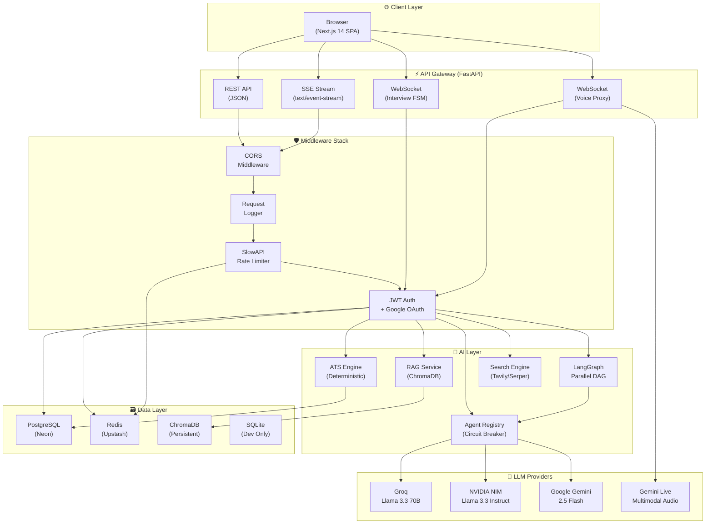

---

## 2. LangGraph DAG Orchestration

The Career AI OS uses a static DAG (Directed Acyclic Graph) with parallel fan-out/fan-in execution. Total pipeline latency = `max(resume, market) + max(linkedin, roadmap)`.

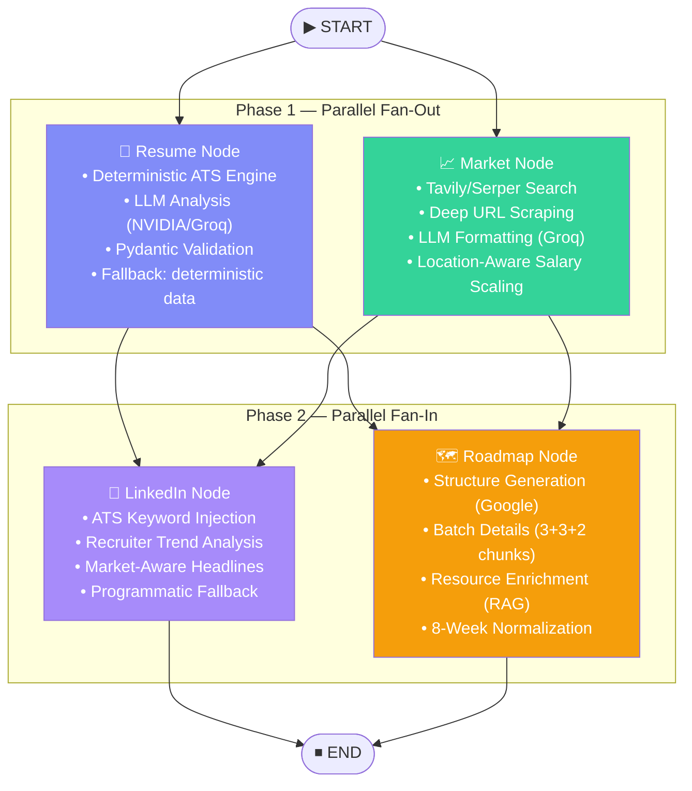

### State Schema (TypedDict)

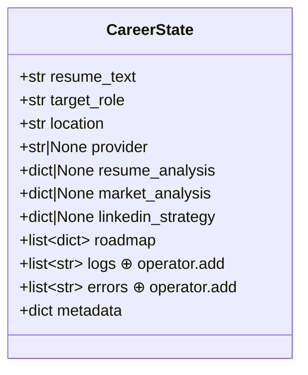

---

## 3. Mock Interview FSM (State Machine)

The interview engine uses a 7-phase (+ feedback) Finite State Machine with strict unidirectional transitions.

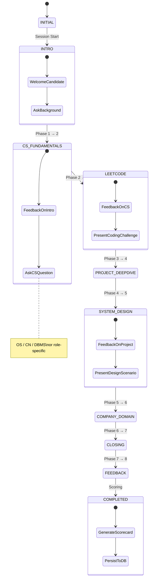

### Role Category Adaptation

The FSM adapts phase content based on role category:

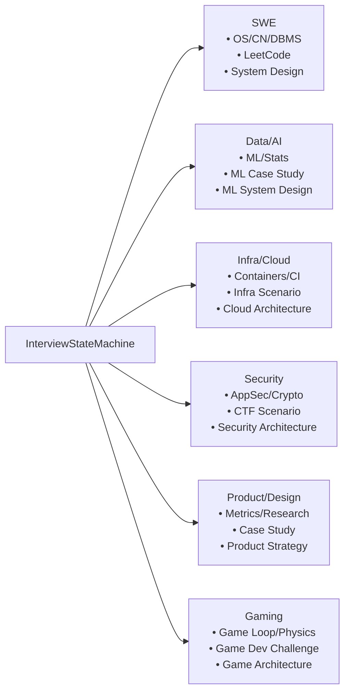

---

## 4. Voice Assistant Pipeline (Anya)

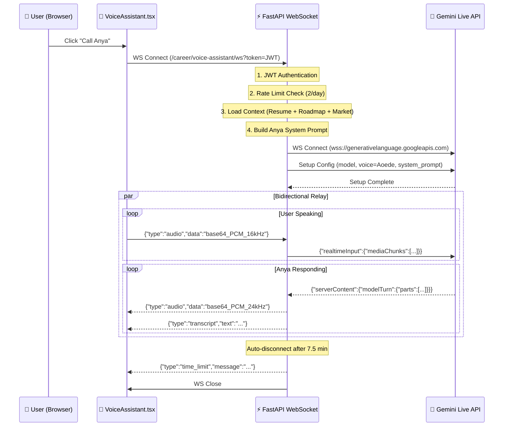

---

## 5. Agent Registry & Circuit Breaker

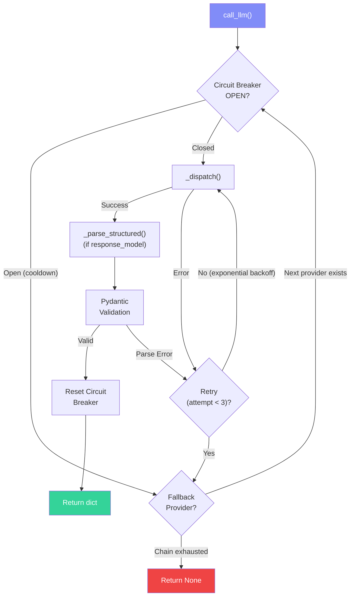

### Fallback Chain Configuration

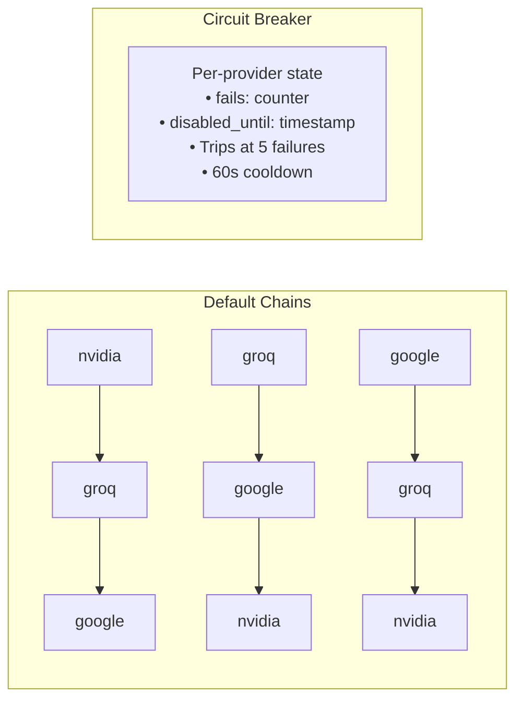

---

## 6. API Gateway & Middleware Stack

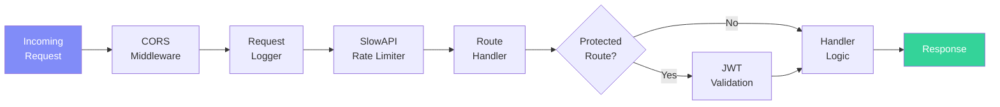

### Route Mounting

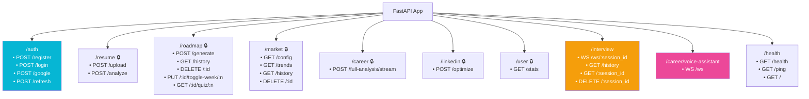

---

## 7. Database Entity Relationship Diagram

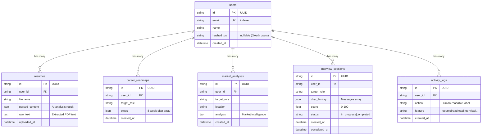

---

## 8. Frontend Component Architecture

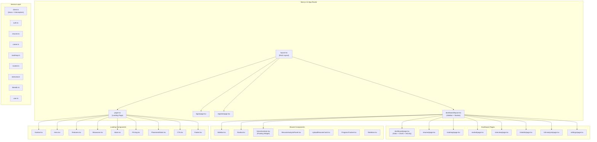

---

## 9. Deployment Topology

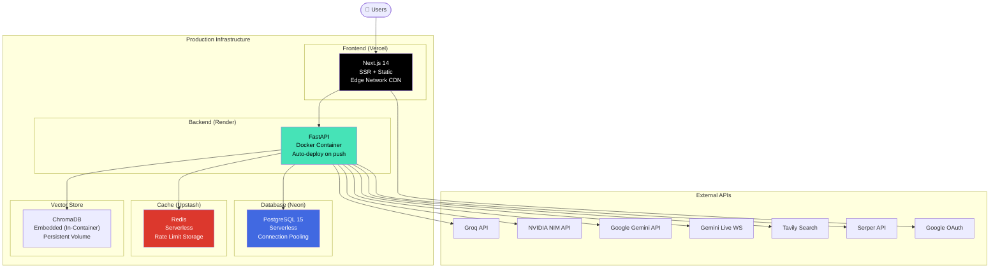

---

## 10. Data Flow: Full Career Analysis

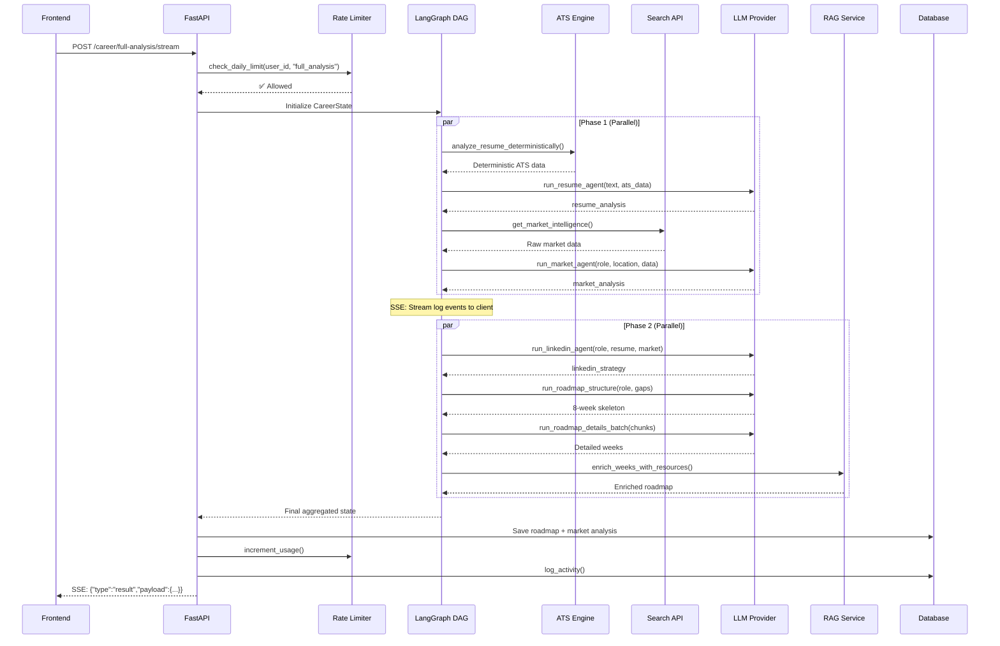

---

## 11. Data Flow: Resume Upload & Analysis

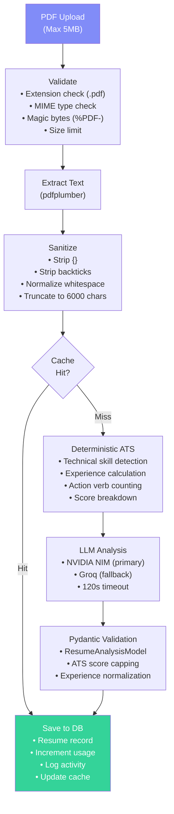

---

## 12. Data Flow: Market Intelligence

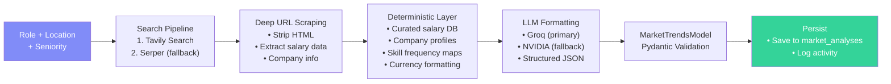

---

## 13. Rate Limiting Architecture

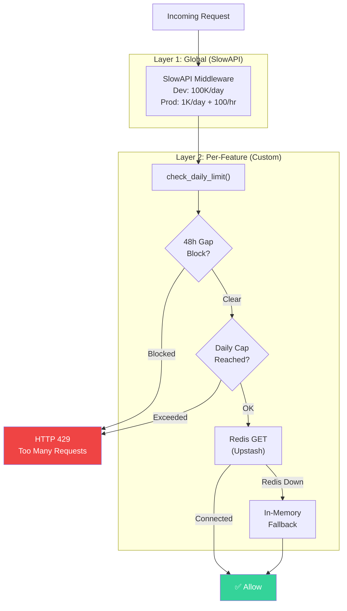

---

## 14. RAG & Resource Enrichment Pipeline

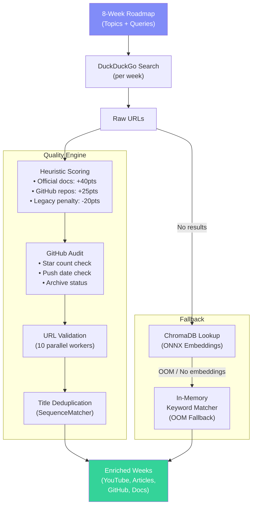

---

**Built with 🧠 by [Anil Pradhan](https://github.com/Anil-Pradhan-web)**

