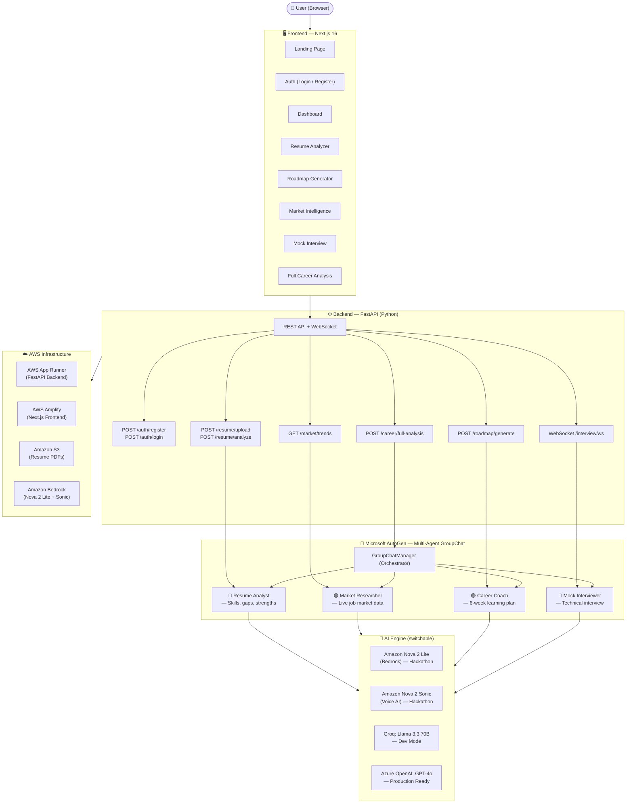

<div align="center">


# 🤖 AI Career Mentor

### *Your personal AI career coach — available 24/7, powered by multi-agent AI*

**Resume Analysis · Personalised Roadmaps · Live Market Intelligence · AI Mock Interviews**

---

[](https://devpost.com)
[](https://microsoft.com)
[](#)
[](LICENSE)

</div>

---

## 📌 What is AI Career Mentor?

**AI Career Mentor** is a full-stack, production-grade career coaching platform that uses a **4-agent AI system** to give developers and students a complete, personalised career acceleration plan — in under 60 seconds.

Most developers spend months trying to figure out what to learn, where to apply, and how to prepare for interviews. We solve all three — simultaneously — with AI agents that collaborate the same way a team of human experts would.

> **Hackathon submissions:**
> - 🏆 **Amazon Nova AI Hackathon** (Devpost · Deadline Mar 16, 2026) — Amazon Bedrock Nova 2 Lite + Nova 2 Sonic, fully deployed on AWS
> - 🏆 **Microsoft AI Dev Days Hackathon** (Deadline Mar 15, 2026 · $80,000+ prize pool) — Microsoft AutoGen agents + Azure OpenAI, deployed on Azure

---

## ✨ Core Features

| Feature | What it does | AI Agent Used |
|---------|-------------|--------------|
| 📄 **Resume Analyzer** | Uploads your PDF, scores all sections, flags skill gaps vs real job postings | Resume Analyst Agent |
| 🗺️ **Learning Roadmap** | Generates a week-by-week plan with free resources & mini-projects for your target role | Career Coach Agent |
| 📈 **Market Intelligence** | Real-time salary ranges, in-demand skills, and top hiring companies for your role + location | Market Researcher Agent |
| 🎤 **Mock Interview Coach** | Live AI interview via WebSocket — asks questions, listens, gives feedback | Mock Interviewer Agent |
| 🧠 **Full Career Analysis** | All 4 agents collaborate in one GroupChat — resume + market + roadmap in a single run | All Agents (GroupChat) |
| 🔐 **Auth System** | JWT-based register/login with bcrypt password hashing | — |
| ⚙️ **Settings** | User profile with persistent preferences | — |

---

## 🏗️ System Architecture


```mermaid
graph TD
    User(["👤 User (Browser)"])

    subgraph Frontend ["🖥️ Frontend — Next.js 16"]
        LP["Landing Page"]
        AUTH["Auth (Login / Register)"]
        DB["Dashboard"]
        RA["Resume Analyzer"]
        RM["Roadmap Generator"]
        MI["Market Intelligence"]
        IV["Mock Interview"]
        FA["Full Career Analysis"]
    end

    subgraph Backend ["⚙️ Backend — FastAPI (Python)"]
        API["REST API + WebSocket"]
        AUTH_API["POST /auth/register\nPOST /auth/login"]
        RESUME_API["POST /resume/upload\nPOST /resume/analyze"]
        ROAD_API["POST /roadmap/generate"]
        MKT_API["GET /market/trends"]
        IV_API["WebSocket /interview/ws"]
        FULL_API["POST /career/full-analysis"]
    end

    subgraph AgentLayer ["🧠 Microsoft AutoGen — Multi-Agent GroupChat"]
        ORCH["GroupChatManager (Orchestrator)"]
        A1["🔵 Resume Analyst\n— Skills, gaps, strengths"]
        A2["🟢 Market Researcher\n— Live job market data"]
        A3["🟣 Career Coach\n— 6-week learning plan"]
        A4["🔴 Mock Interviewer\n— Technical interview"]
    end

    subgraph LLM ["🤖 AI Engine (switchable)"]
        NOVA["Amazon Nova 2 Lite\n(Bedrock) — Hackathon"]
        SONIC["Amazon Nova 2 Sonic\n(Voice AI) — Hackathon"]
        GROQ["Groq: Llama 3.3 70B\n— Dev Mode"]
        AZURE["Azure OpenAI: GPT-4o\n— Production Ready"]
    end

    subgraph AWS ["☁️ AWS Infrastructure"]
        APPRUNNER["AWS App Runner\n(FastAPI Backend)"]
        AMPLIFY["AWS Amplify\n(Next.js Frontend)"]
        S3["Amazon S3\n(Resume PDFs)"]
        BEDROCK["Amazon Bedrock\n(Nova 2 Lite + Sonic)"]
    end

    User --> Frontend
    Frontend --> API
    API --> AUTH_API & RESUME_API & ROAD_API & MKT_API & IV_API & FULL_API
    RESUME_API --> A1
    ROAD_API --> A3
    MKT_API --> A2
    IV_API --> A4
    FULL_API --> ORCH
    ORCH --> A1 & A2 & A3 & A4
    A1 & A2 & A3 & A4 --> LLM
    Backend --> AWS
```

---

## 🛠️ Tech Stack

### Frontend
| Technology | Purpose |
|-----------|---------|
| **Next.js 16** (App Router) | Full-stack React framework |
| **TypeScript** | Type safety |
| **Vanilla CSS** | Custom design system — no Tailwind |
| **Lucide React** | Icon library |
| **react-hot-toast** | Notifications |

### Backend
| Technology | Purpose |
|-----------|---------|
| **FastAPI** (Python) | High-performance REST API + WebSocket |
| **Microsoft AutoGen** | Multi-agent GroupChat orchestration |
| **SQLAlchemy + SQLite** | Database ORM |
| **JWT + bcrypt** | Authentication & password hashing |
| **pdfplumber** | PDF resume text extraction |
| **DuckDuckGo Search** | Real-time market research tool for agents |
| **LiteLLM** | Bridge AutoGen → Amazon Bedrock (Nova) |

### AI Providers
| Provider | Model | Mode |
|---------|-------|------|
| **Amazon Bedrock** | Nova 2 Lite | 🏆 Hackathon (Agentic AI) |
| **Amazon Bedrock** | Nova 2 Sonic | 🏆 Hackathon (Voice AI) |
| **Groq** | Llama 3.3 70B | 💻 Local development |
| **Azure OpenAI** | GPT-4o | 🚀 Production ready |

### Cloud (Amazon Version)
| Service | Purpose |
|--------|---------|
| **AWS App Runner** | Backend container hosting |
| **AWS Amplify** | Frontend CDN + hosting |
| **Amazon S3** | Resume PDF storage |
| **Amazon Bedrock** | Nova 2 Lite + Nova 2 Sonic inference |
| **GitHub Actions** | CI/CD pipeline → ECR → App Runner |

---

## 🚀 Local Setup

### Prerequisites
- Python **3.11+**
- Node.js **18+**
- One of: Groq API key (free) · AWS credentials · Azure OpenAI key

### 1. Clone the repo
```bash
git clone https://github.com/Anil-Pradhan/ai-career-mentor.git
cd ai-career-mentor
```

### 2. Backend Setup
```bash
cd backend
python -m venv venv

# Activate virtual environment
venv\Scripts\activate        # Windows
source venv/bin/activate     # macOS / Linux

pip install -r requirements.txt
```

**Create `backend/.env`:**
```env
# ── Choose your AI provider ──────────────────────────────
LLM_PROVIDER=groq            # Options: groq | bedrock | azure

# ── Groq (free dev mode) ─────────────────────────────────
GROQ_API_KEY=your_groq_key_here
GROQ_MODEL=llama-3.3-70b-versatile

# ── Amazon Bedrock (Amazon hackathon version) ─────────────
AWS_ACCESS_KEY_ID=your_aws_key
AWS_SECRET_ACCESS_KEY=your_aws_secret
AWS_REGION=us-east-1
BEDROCK_MODEL_ID=amazon.nova-lite-v1:0

# ── Azure OpenAI (production) ─────────────────────────────
AZURE_OPENAI_API_KEY=your_azure_key
AZURE_OPENAI_ENDPOINT=https://your-resource.openai.azure.com/
AZURE_OPENAI_DEPLOYMENT=gpt-4o

# ── App ──────────────────────────────────────────────────
DATABASE_URL=sqlite:///./dev.db
SECRET_KEY=your_super_secret_jwt_key_here
ACCESS_TOKEN_EXPIRE_MINUTES=60
```

```bash
# Start backend
uvicorn app.main:app --reload
# ✅ API running at http://localhost:8000
# ✅ Swagger docs at http://localhost:8000/docs
```

### 3. Frontend Setup
```bash
cd frontend
npm install

# Create frontend/.env.local
echo NEXT_PUBLIC_API_URL=http://localhost:8000 > .env.local

npm run dev
# ✅ Frontend running at http://localhost:3000
```

---

## 📡 API Reference

| Method | Endpoint | Auth | Description |
|--------|----------|------|-------------|
| `GET` | `/health` | — | System health check |
| `POST` | `/auth/register` | — | Create new account |
| `POST` | `/auth/login` | — | Login → get JWT token |
| `POST` | `/resume/upload` | ✅ JWT | Upload PDF, extract text |
| `POST` | `/resume/analyze` | ✅ JWT | AI resume scoring & gap analysis |
| `POST` | `/roadmap/generate` | ✅ JWT | Generate 6-week learning roadmap |
| `GET` | `/market/trends` | ✅ JWT | Real-time job market data |
| `WS` | `/interview/ws/{session_id}` | ✅ JWT | Live mock interview (WebSocket) |
| `WS` | `/interview/voice/ws/{id}` | ✅ JWT | Voice interview — Nova 2 Sonic |
| `POST` | `/career/full-analysis` | ✅ JWT | Full multi-agent GroupChat analysis |

> 📖 Interactive API docs available at `http://localhost:8000/docs` (Swagger UI)

---

## 🧠 How the Multi-Agent System Works

When a user triggers **Full Career Analysis**, this is what happens behind the scenes:

```
User uploads resume + sets target role + location
         ↓
FastAPI receives request → starts AutoGen GroupChat
         ↓
GroupChatManager (Orchestrator) coordinates:
   ├── 🔵 Resume Analyst    → "I see 3 skill gaps: Docker, Kubernetes, System Design"
   ├── 🟢 Market Researcher → "For SDE-2 in Bangalore: ₹18-28 LPA, top skill is Go + K8s"
   ├── 🟣 Career Coach      → "Week 1: Docker fundamentals → resource → mini project"
   └── 🔴 Mock Interviewer  → "Here's a system design question based on your gaps..."
         ↓
All agent outputs consolidated → returned to user in < 60 seconds
```

Each agent has a **single responsibility**, talks to the LLM independently, and shares context through AutoGen's GroupChat protocol — exactly like a team of human experts would collaborate.

---

## 🏆 Hackathon Submissions

### 🟠 Amazon Nova AI Hackathon

| Detail | Info |
|--------|------|
| **Platform** | Devpost |
| **Deadline** | March 16, 2026 @ 8:00 PM EDT |
| **Prize Pool** | $40,000 cash + $55,000 AWS Credits |
| **Categories** | Agentic AI ($10K) · Voice AI ($10K) |
| **Required hashtag** | `#AmazonNova` in demo video |

**Why we win:**
- ✅ **Agentic AI** — 4 AutoGen agents powered by **Amazon Nova 2 Lite** via Bedrock
- ✅ **Voice AI** — Mock interview via **Amazon Nova 2 Sonic** (native speech-to-speech, no TTS pipeline)
- ✅ **Full AWS stack** — App Runner + Amplify + S3 + Bedrock
- ✅ Key differentiator: Nova 2 Sonic speech-to-speech — most teams won't implement real voice AI

---

### 🔵 Microsoft AI Dev Days Hackathon

| Detail | Info |
|--------|------|
| **Platform** | Microsoft Innovation Studio |
| **Dates** | Feb 10 – March 15, 2026 |
| **Prize Pool** | $80,000+ total |
| **Grand Prize** | $20,000 × 2 (Best Overall + Best Agentic DevOps) |
| **Category Prizes** | $10,000 × 2 (Microsoft Foundry · Best Enterprise) |
| **Bonus** | Ticket to Microsoft Build 2026 + mentoring session |

**Requirements met:**
- ✅ **Microsoft AutoGen** — multi-agent GroupChat (Agent Framework)
- ✅ **Azure OpenAI GPT-4o** — production LLM via Azure (Microsoft Foundry compatible)
- ✅ **Deployed on Azure** — backend on Azure-compatible infra with config switch
- ✅ **Public GitHub repo** — clean, well-documented codebase
- ✅ **VS Code + GitHub Copilot** — developed with Copilot assistance
- ✅ **Real-world impact** — democratises career coaching for millions of students

**Why we win:**
- ✅ End-to-end production system (auth, DB, full UI) — not a notebook demo
- ✅ 4 specialised agents collaborating in real GroupChat — genuine agentic behaviour
- ✅ Career coaching is a $4B+ market — clear real-world problem being solved
- ✅ Solo developer building what most teams can't — judges love the ambition

---

## 📁 Project Structure

```
ai-career-mentor/
├── backend/
│   ├── app/
│   │   ├── api/
│   │   │   ├── auth.py          # Register + login endpoints
│   │   │   ├── resume.py        # PDF upload + AI analysis
│   │   │   ├── roadmap.py       # Roadmap generation agent
│   │   │   ├── market.py        # Market trends agent
│   │   │   ├── interview.py     # WebSocket mock interview
│   │   │   ├── voice_interview.py # Nova 2 Sonic voice WS
│   │   │   └── career.py        # Full multi-agent analysis
│   │   ├── agents/
│   │   │   ├── resume_agent.py  # Resume Analyst
│   │   │   ├── market_agent.py  # Market Researcher
│   │   │   ├── roadmap_agent.py # Career Coach
│   │   │   └── interview_agent.py # Mock Interviewer
│   │   ├── core/
│   │   │   ├── config.py        # LLM provider config (Groq/Bedrock/Azure)
│   │   │   └── security.py      # JWT + bcrypt
│   │   ├── models/              # SQLAlchemy DB models
│   │   └── main.py              # FastAPI app entry
│   ├── Dockerfile
│   ├── requirements.txt
│   └── .env.example
│
├── frontend/
│   ├── src/
│   │   ├── app/
│   │   │   ├── page.tsx         # Landing page
│   │   │   ├── login/           # Login page
│   │   │   ├── register/        # Registration page
│   │   │   └── dashboard/
│   │   │       ├── page.tsx     # Dashboard home
│   │   │       ├── resume/      # Resume analyzer
│   │   │       ├── roadmap/     # Career roadmap
│   │   │       ├── market/      # Market trends
│   │   │       ├── interview/   # Mock interview
│   │   │       ├── full-analysis/ # Full AI analysis
│   │   │       └── settings/    # User settings
│   │   ├── components/
│   │   │   ├── Sidebar.tsx
│   │   │   ├── Navbar.tsx
│   │   │   └── ...
│   │   └── services/
│   │       └── api.ts           # All API calls
│   └── package.json
│
├── .github/
│   └── workflows/
│       └── deploy.yml           # GitHub Actions CI/CD → AWS
├── render.yaml                  # Render.com config (Microsoft version)
└── README.md
```

---

## 🌐 Deployment

### Amazon Version (AWS)

| Layer | Service | Config |
|-------|---------|--------|
| Frontend | AWS Amplify | Auto-deploy from `frontend/` on `main` push |
| Backend | AWS App Runner | Docker from ECR, port 8000 |
| File Storage | Amazon S3 | Private bucket, resume PDFs |
| AI Inference | Amazon Bedrock | Nova 2 Lite (text) + Nova 2 Sonic (voice) |
| CI/CD | GitHub Actions | Push to main → build → ECR → App Runner |

### Microsoft Version (Cloud)

| Layer | Service |
|-------|---------|
| Frontend | Vercel |
| Backend | Render.com (render.yaml) |
| AI | Groq (dev) / Azure OpenAI (prod) |

---

## 🔐 Environment Variables Summary

```env
# ── Which AI to use ──────────────────────────────────────
LLM_PROVIDER=groq | bedrock | azure

# ── Amazon (Nova Hackathon) ───────────────────────────────
AWS_ACCESS_KEY_ID=...
AWS_SECRET_ACCESS_KEY=...
AWS_REGION=us-east-1
BEDROCK_MODEL_ID=amazon.nova-lite-v1:0

# ── Groq (local dev) ─────────────────────────────────────
GROQ_API_KEY=...

# ── Azure OpenAI (production) ─────────────────────────────
AZURE_OPENAI_API_KEY=...
AZURE_OPENAI_ENDPOINT=...
AZURE_OPENAI_DEPLOYMENT=gpt-4o

# ── Core ─────────────────────────────────────────────────
DATABASE_URL=sqlite:///./dev.db
SECRET_KEY=<strong-random-key>
ACCESS_TOKEN_EXPIRE_MINUTES=60
```

> ⚠️ **Never commit `.env` to GitHub.** Use `.env.example` as the template.

---

## 👤 Team

| Name | Role | Contact |
|------|------|---------|
| **Anil Pradhan** | Full-Stack Solo Developer | ap2019039@gmail.com |

> *Built solo — frontend, backend, AI agents, cloud deployment, and UI/UX — all by one developer.*

---

## 📸 Screenshots

> *Screenshots from the live application*

| Landing Page | Dashboard | Resume Analysis |
|-------------|-----------|----------------|
| *(see demo video)* | *(see demo video)* | *(see demo video)* |

---

## 🙏 Acknowledgements

- **Microsoft AutoGen** team for the multi-agent framework
- **Amazon Bedrock** for Nova 2 Lite & Nova 2 Sonic model access
- **Groq** for free-tier Llama 3.3 70B inference during development
- The open-source community behind FastAPI, Next.js, and pdfplumber

---

<div align="center">

**Built with ❤️ by [Anil Pradhan](https://github.com/Anil-Pradhan) — March 2026**

*Submitted to: Amazon Nova AI Hackathon · Microsoft AutoGen Hackathon*

`#AmazonNova` `#AutoGen` `#MultiAgent` `#CareerTech` `#AgenticAI`

</div>
