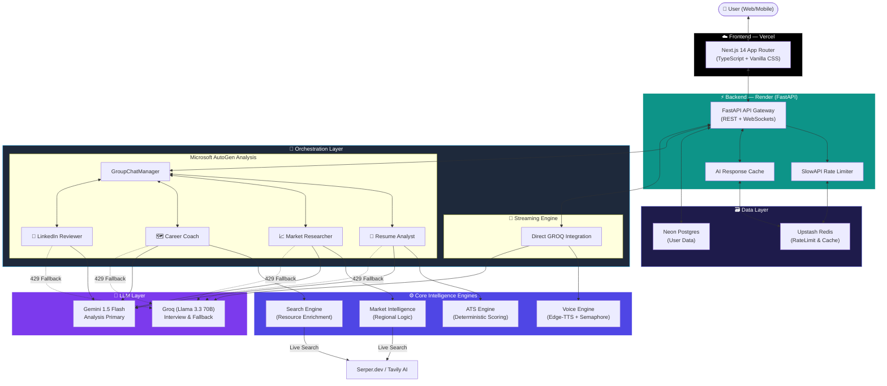
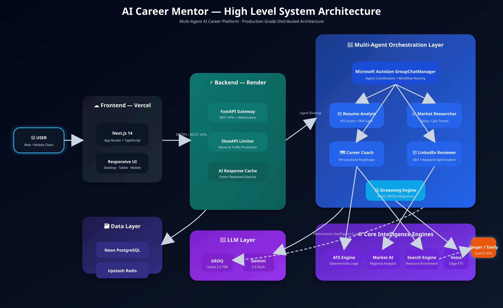

<div align="center">

<br/>


### *5 Specialized AI Agents. One Career Transformation.*

> **Resume Analysis · Personalized Roadmaps · Live Market Intelligence · Streaming Mock Interviews · Google OAuth**

<br/>


<br/><br/>

[](https://ai-career-mentor-anil.vercel.app)
[](https://ai-career-mentor-rrpu.onrender.com/docs)
[](https://microsoft.com)
[](https://devpost.com)
[](LICENSE)
[](https://github.com/Anil-Pradhan-web/ai-career-mentor/commits)

</div>

---

## 🧭 Table of Contents

- [What is AI Career Mentor?](#-what-is-ai-career-mentor)
- [Key Numbers](#-key-numbers)
- [Core Features](#-core-features)
- [System Architecture](#-system-architecture--design)
- [The 5 AI Agents](#-the-5-ai-agents)
- [Tech Stack](#-tech-stack)
- [Local Setup](#-local-setup)
- [API Reference](#-api-reference)
- [CI/CD Pipeline](#-cicd-pipeline)
- [Deployment](#-deployment)
- [Hackathon Submissions](#-hackathon-submissions)
- [Upgrade Roadmap](#-upgrade-roadmap)

---

## 🎯 What is AI Career Mentor?

**AI Career Mentor** is a production-grade, full-stack career coaching platform that deploys a **5-agent AI system** to give developers and students a complete, hyper-personalized career acceleration plan — in under 60 seconds.

Most developers spend months trying to figure out:
- 📚 *What should I learn next?*
- 🏢 *Where should I apply?*
- 🎤 *How do I ace the interview?*

**We solve all three — simultaneously** — using AI agents that collaborate the same way a team of expert human coaches would: a Resume Analyst scores your CV, a Market Researcher pulls live salary data, a Career Coach builds your 8-week plan, a LinkedIn Reviewer optimizes your profile, and a Mock Interviewer stress-tests you with adaptive questions — all in one workflow.

> 🧑‍💻 **Solo-built** — every line of backend, frontend, multi-agent orchestration, Google OAuth, and cloud infrastructure by one developer.
> ⏱️ **5–6 months** from concept to fully deployed production product.
> 📝 **110+ commits** of iterative design, production hardening, and feature delivery.

---

## 📊 Key Numbers

| Metric | Value |
|--------|-------|
| AI Agents | **5 specialized agents** |
| Interview Latency | **< 2 seconds** (Direct GROQ Streaming) |
| Full Analysis Time | **< 60 seconds** |
| Rate Limit Architecture | **100 req/hr · 1000 req/day** per user |
| LLM Fallback | **Auto Gemini → GROQ on 429** |
| DB Connection Pool | **Optimized for free-tier** (pool_size=3) |
| Caching | **SHA-256 keyed Redis cache** — zero redundant LLM calls |
| Interview Questions | **7 adaptive questions** with Persona Discovery & Adaptive Difficulty |
| Hackathon Prize Pool | **$175,000+** across 2 submissions |

---

## ✨ Core Features

<details>
<summary><b>🔐 Google OAuth 2.0</b></summary>

One-click login and registration via Google — no password required. The frontend uses `@react-oauth/google` to securely obtain a Google ID Token, which the backend verifies using `google-auth`, then exchanges for a short-lived JWT and a long-lived refresh token.
</details>

### ⚙️ Core Intelligence Engines
The platform's "brain" is powered by four specialized deterministic engines that work alongside our LLM agents:

1.  **ATS Scoring Engine (`ats_engine.py`)**: A deterministic parsing system that extracts skills, estimates years of experience, and calculates a 0-100 score based on keyword density, achievement metrics, and formatting quality.
2.  **Market Intelligence Engine (`market_engine.py`)**: Combines regional database logic with live web search to identify hiring trends, salary benchmarks, and top companies for specific roles and locations.
3.  **Resource Search Engine (`search_engine.py`)**: Dynamically enriches career roadmaps by searching the live web for the highest-quality documentation, tutorials, and course URLs for every weekly learning goal.
4.  **Voice Interaction Engine (`voice_engine.py`)**: A high-performance wrapper around Edge-TTS that manages concurrent speech synthesis requests with a semaphore-guarded queue to ensure stable real-time interview audio.

---

## 🚀 Key Features

### 1. **Multi-Agent Career Analysis**
*   **Orchestration:** Powered by **Microsoft AutoGen**, coordinating five specialized agents (Resume Analyst, Market Researcher, Career Coach, LinkedIn Reviewer, and Manager).
*   **Deep Scan:** Analyzes resumes against live market trends to identify skill gaps and provide an 8-week actionable learning roadmap.

### 2. **Real-Time Streaming Interviewer**
*   **Ultra-Low Latency:** Uses direct **Groq (Llama 3.3 70B)** integration via WebSockets, bypassing agent overhead for sub-2s response times.
*   **Adaptive Flow:** The interviewer discovers your experience level in Phase 1 and adapts all technical/behavioral questions accordingly.
*   **Voice Synthesis:** Integrated **Edge-TTS** provides natural, role-specific interviewer personas.

### 3. **Smart Skill-Gap Discovery**
*   Uses a hybrid approach (Deterministic ATS Engine + LLM Reasoning) to pinpoint exact technologies you need to learn to reach your target role.

### 4. **Live Market Intelligence**
*   **Professional Search Pipeline**: Real-time job market tracking via a hybrid **Tavily AI** (Primary) and **Serper.dev** (Fallback) engine.
*   **High Accuracy**: Delivers precise salary ranges, active hiring volumes, trending skills, and key hiring entities by analyzing live Google Search snippets.

### 5. **Premium Developer Experience**
*   **Rate Limiting:** Strict per-feature limits via **SlowAPI** and Redis.
*   **AI Caching:** SHA-256 keyed response caching for cost efficiency and instant repeat analysis.
*   **Clean Architecture:** Fully decoupled frontend (Vercel) and backend (Render) with Neon Postgres.

<details>
<summary><b>⚡ Dual LLM Engine with Auto-Fallback</b></summary>

- **Groq (Llama 3.3 70B)** — Primary for all streaming interviews + fallback for all agents
- **Google Gemini 1.5 Flash** — Primary for all analysis agents (Resume, Market, Roadmap, LinkedIn)
- **Auto-fallback**: Every agent catches 429 rate limit errors from Gemini and automatically retries with GROQ — zero user-facing failures
</details>

<details>
<summary><b>🛡️ Global Redis Caching Layer</b></summary>

Performance is optimized across the entire platform using Upstash Redis:
- **Universal Caching**: AI responses for **Resume Analysis**, **Career Roadmaps**, **LinkedIn Reviews**, and **Full Career Analysis** are all cached.
- **SHA-256 Keying**: Unique request fingerprints ensure cache hits are precise and secure.
- **Debug Bypass**: Caching is automatically disabled in local `DEBUG` mode to allow for real-time testing of AI prompts.
- **Success-Only Increment**: Rate limit counters only increment on *successful* AI responses — not on errors or cached hits.
</details>

---

## 🏗️ System Architecture & Design

The platform follows a modern decoupled architecture with a dedicated Multi-Agent Orchestration layer sitting between the API gateway and the LLM providers.


```mermaid
flowchart TD
    User(["👤 User (Web/Mobile)"])
    
    subgraph Frontend ["☁️ Frontend — Vercel"]
        NextJS["Next.js 14 App Router\n(TypeScript + Vanilla CSS)"]
    end

    subgraph Backend ["⚡ Backend — Render (FastAPI)"]
        API["FastAPI API Gateway\n(REST + WebSockets)"]
        RateLimit["SlowAPI Rate Limiter"]
        Cache["AI Response Cache"]
    end

    subgraph Orchestration ["🧠 Orchestration Layer"]
        subgraph AutoGen ["Microsoft AutoGen Analysis"]
            Manager["GroupChatManager"]
            A1["📄 Resume Analyst"]
            A2["📈 Market Researcher"]
            A3["🗺️ Career Coach"]
            A4["🔗 LinkedIn Reviewer"]
        end
        
        subgraph Interview ["🎤 Streaming Engine"]
            DirectLLM["Direct GROQ Integration"]
        end
    end

    subgraph Intelligence ["⚙️ Core Intelligence Engines"]
        ATS["ATS Engine\n(Deterministic Scoring)"]
        Market["Market Intelligence\n(Regional Logic)"]
        Search["Search Engine\n(Resource Enrichment)"]
        Voice["Voice Engine\n(Edge-TTS + Semaphore)"]
    end

    subgraph LLM ["🤖 LLM Layer"]
        GROQ["Groq (Llama 3.3 70B)\nInterview & Fallback"]
        GEMINI["Gemini 1.5 Flash\nAnalysis Primary"]
    end

    subgraph Data ["🗃️ Data Layer"]
        Postgres["Neon Postgres\n(User Data)"]
        Redis["Upstash Redis\n(RateLimit & Cache)"]
    end

    User <--> NextJS
    NextJS <--> API
    API --> RateLimit <--> Redis
    API <--> Cache <--> Redis
    API <--> Postgres
    
    API <--> Manager
    Manager <--> A1 & A2 & A3 & A4
    API <--> DirectLLM
    
    A1 --> ATS
    A2 --> Market
    A3 --> Search
    DirectLLM --> Voice
    
    A1 & A2 & A3 & A4 --> GEMINI
    A1 & A2 & A3 & A4 -.->|"429 Fallback"| GROQ
    DirectLLM --> GROQ
    
    Market & Search -->|"Live Search"| SERPER["Serper.dev / Tavily AI"]

    style Frontend fill:#000,stroke:#fff,color:#fff
    style Backend fill:#0D9488,stroke:#fff,color:#fff
    style Orchestration fill:#1E293B,stroke:#38BDF8,color:#fff
    style Intelligence fill:#4F46E5,stroke:#fff,color:#fff
    style LLM fill:#7C3AED,stroke:#fff,color:#fff
    style Data fill:#1E1B4B,stroke:#818cf8,color:#fff
```

### 🖼️ SVG Architecture Design


### 🔍 Component Deep Dive

#### 1. Frontend — Next.js 14 on Vercel
- **Framework:** Next.js 14 App Router with SSR and client-side routing
- **Styling:** Pure Vanilla CSS with CSS Variables — no Tailwind overhead, full design control
- **State:** React Context + Hooks for global auth state
- **Auth Flow:** `@react-oauth/google` fetches the Google ID Token client-side → sent to backend → verified → exchanged for JWT + refresh token

#### 2. API Gateway & Security — FastAPI on Render
- **CORS** is the outermost middleware layer to handle browser preflight flawlessly
- **SlowAPI** intercepts *before* routing — enforces Upstash Redis-backed per-user IP limits
- **Auth Middleware:** Custom dependency injection (`deps.py`) verifies JWT Bearer tokens on every protected route, attaching the authenticated `User` object to request context
- **Health Check exemptions:** `/health` and `/ping` explicitly excluded from rate limiting to support cron keep-alives

#### 3. AutoGen Multi-Agent Engine
- **Framework:** Microsoft AutoGen v0.2 (`ag2`) with a `GroupChat` of 4 specialized agents
- **Orchestration:** `GroupChatManager` with a custom `speaker_selection_method` to route tasks intelligently
- **Async Safety:** All agent calls wrapped in `asyncio.to_thread()` — prevents blocking Uvicorn's event loop on Render's free tier
- **Gemini→GROQ Fallback:** Every agent catches 429 errors from Gemini and retries with GROQ automatically
- **Live Data:** Market Researcher agent fetches DuckDuckGo search snippets *before* synthesizing salary/hiring reports

#### 4. Real-Time Mock Interviews
- **Zero AutoGen overhead:** Interview Agent uses the OpenAI SDK pointed at `base_url="https://api.groq.com/openai/v1"` for sub-2s first-token latency
- **WebSocket streaming:** Token-by-token streaming via `interviewer_stream` events — real conversational feel
- **Crash resilience:** `_safe_send_json()` guards wrap all WebSocket sends — server cleans up gracefully on client disconnect
- **Adaptive state machine:** 7-question flow with company-tier difficulty scaling (FAANG → Hard, Service-based → Easy)
- **Voice synthesis:** Full response piped into `edge-tts` post-stream, base64 encoded, sent back over WebSocket with a 30s timeout guard

#### 5. Data Persistence Layer
- **Neon Postgres:** Production relational DB with optimized connection pooling (`pool_size=3, max_overflow=5, pool_recycle=300s, pool_pre_ping=True`) — tuned to handle Neon's idle connection drops on free tier
- **Upstash Redis:** Powers both distributed rate limiting and SHA-256 keyed AI response caching
- **Resume storage:** `pdfplumber` extracts text in-memory → structured JSON analysis stored in Postgres — no S3 bucket required

---

## 🧠 The 5 AI Agents

```
User Input: resume PDF + target role + location
                    ↓
        FastAPI → AutoGen GroupChat (asyncio.to_thread)
                    ↓
    ┌───────────────────────────────────────┐
    │         GroupChatManager              │
    │  (Custom speaker_selection_method)    │
    └──────┬────────┬──────────┬────────────┘
           │        │          │          │
    📄 Resume   📈 Market  🗺️ Career  🔗 LinkedIn
    Analyst    Researcher   Coach     Reviewer
           │        │          │          │
           └────────┴──────────┴────────────┘
                    ↓
        Consolidated output → < 60 seconds

────────────────────────────────────────────────

User: Starts Mock Interview
                    ↓
    FastAPI WebSocket → Direct GROQ OpenAI SDK
                (Bypasses AutoGen entirely)
                    ↓
    Token-by-token streaming → Edge-TTS voice
                    ↓
    7 adaptive questions → Score /100 + Feedback
```

| Agent | Engine | Key Output |
|-------|--------|------------|
| **📄 Resume Analyst** | AutoGen + Gemini/GROQ | `ats_score`, `technical_skills`, `skill_gaps`, `top_strengths` |
| **📈 Market Researcher** | AutoGen + Gemini/GROQ + DuckDuckGo | `salary_range`, `top_skills`, `top_companies` — *live real-time data* |
| **🗺️ Career Coach** | AutoGen + Gemini/GROQ + DuckDuckGo | 8-week roadmap with `topic`, `resource_url`, `mini_project` per week |
| **🔗 LinkedIn Reviewer** | AutoGen + Gemini/GROQ | `headline_suggestions`, `profile_score`, `key_keywords` |
| **🎤 Mock Interviewer** | **Direct GROQ Streaming** (no AutoGen) | 7 adaptive questions → streaming voice → final score `/100` |

---

## 🛠️ Tech Stack

### Frontend
| Technology | Version | Purpose |
|-----------|---------|---------|
| **Next.js** | 14 (App Router) | Full-stack React framework with SSR |
| **TypeScript** | — | Type safety across all components |
| **Vanilla CSS** | — | Custom design system — zero Tailwind overhead |
| **@react-oauth/google** | — | Google OAuth 2.0 integration |
| **Recharts** | — | Dashboard charts (Radar, Bar, Area) |
| **Lucide React** | — | Icon library |
| **react-hot-toast** | — | Toast notification system |
| **axios** | — | HTTP client with interceptors |

### Backend
| Technology | Version | Purpose |
|-----------|---------|---------|
| **FastAPI** | Python 3.11 | Async REST API + WebSocket server |
| **Microsoft AutoGen** | `ag2` v0.7.5 | Multi-agent GroupChat orchestration |
| **OpenAI SDK** (via GROQ) | — | Direct streaming for Mock Interviews |
| **google-auth** | — | Google ID Token verification |
| **SQLAlchemy + Alembic** | — | ORM + schema migrations |
| **Neon Postgres** | — | Production DB (optimized pooling) |
| **Upstash Redis** | — | Rate limiting + AI response caching |
| **SlowAPI** | — | Request rate limiting middleware |
| **JWT + bcrypt** | — | Auth tokens + password hashing |
| **pdfplumber** | — | In-memory PDF resume parsing |
| **edge-tts** | — | Natural voice synthesis (30s guard) |
| **Serper.dev & Tavily** | — | Professional Real-time market data |
| **Loguru** | — | Structured logging |

### Infrastructure
| Tool | Role |
|------|------|
| **Vercel** | Frontend hosting + CDN |
| **Render.com** | Backend hosting (FastAPI + WebSocket) |
| **Neon** | Serverless Postgres |
| **Upstash** | Serverless Redis |
| **GitHub Actions** | CI/CD pipeline |

### AI Providers
| Provider | Model | Role |
|---------|-------|------|
| **Groq** | Llama 3.3 70B | Primary for interviews (streaming) + fallback for all agents |
| **Google Gemini** | 1.5 Flash | Primary for all analysis agents — auto-fallback to GROQ on 429 |

---

## 🚀 Local Setup

### Prerequisites
- Python **3.11+**
- Node.js **18+**
- Groq API key — free at [console.groq.com](https://console.groq.com)
- Google OAuth credentials — [console.cloud.google.com](https://console.cloud.google.com)

### 1. Clone the Repository

```bash
git clone https://github.com/Anil-Pradhan-web/ai-career-mentor.git
cd ai-career-mentor
```

### 2. Backend Setup

```bash
cd backend
python -m venv venv

# Windows
venv\Scripts\activate
# macOS/Linux
source venv/bin/activate

pip install -r requirements.txt
```

Create `backend/.env`:

```env
# ── AI Providers ───────────────────────────────────────
LLM_PROVIDER=groq
GROQ_API_KEY=your_groq_key_here
GROQ_MODEL=llama-3.3-70b-versatile
GOOGLE_API_KEY=your_google_api_key
GOOGLE_MODEL=gemini-1.5-flash

# ── Database ──────────────────────────────────────────
DATABASE_URL=sqlite:///./dev.db

# ── Auth ──────────────────────────────────────────────
SECRET_KEY=your_super_secret_jwt_key_here
ACCESS_TOKEN_EXPIRE_MINUTES=60
REFRESH_TOKEN_EXPIRE_DAYS=30
APP_ENV=development

# ── Google OAuth ──────────────────────────────────────
GOOGLE_CLIENT_ID=your_google_client_id
GOOGLE_CLIENT_SECRET=your_google_client_secret

# ── Redis (optional for local) ────────────────────────
REDIS_URL=redis://localhost:6379/0
```

```bash
uvicorn app.main:app --reload
# ✅ API:  http://localhost:8000
# ✅ Docs: http://localhost:8000/docs
```

### 3. Frontend Setup

```bash
cd frontend
npm install
```

Create `frontend/.env.local`:

```env
NEXT_PUBLIC_API_URL=http://localhost:8000
NEXT_PUBLIC_GOOGLE_CLIENT_ID=your_google_client_id
```

```bash
npm run dev
# ✅ App: http://localhost:3000
```

---

## 📡 API Reference

| Method | Endpoint | Auth | Description |
|--------|----------|------|-------------|
| `GET` | `/health` | — | System health — DB status, LLM info, timestamp |
| `GET` | `/ping` | — | Ultra-lightweight cron keep-alive (no DB query) |
| `POST` | `/auth/register` | — | Email/password registration |
| `POST` | `/auth/login` | — | Login → JWT + refresh token |
| `POST` | `/auth/google` | — | Google OAuth ID Token → JWT |
| `GET` | `/user/stats` | ✅ JWT | Dashboard stats + weekly activity |
| `POST` | `/resume/upload` | ✅ JWT | Upload PDF resume |
| `POST` | `/resume/analyze` | ✅ JWT | AI resume scoring + ATS analysis |
| `POST` | `/roadmap/generate` | ✅ JWT | Generate 8-week learning roadmap |
| `GET` | `/market/trends` | ✅ JWT | **Live** real-time job market data |
| `POST` | `/linkedin/review` | ✅ JWT | LinkedIn profile optimization |
| `WS` | `/interview/ws/{id}` | ✅ JWT | **Streaming** mock interview (Direct GROQ) |
| `POST` | `/career/full-analysis` | ✅ JWT | Full 5-agent coordinated analysis |

> 📖 **Interactive Swagger UI:** `http://localhost:8000/docs`

---

## 📁 Project Structure

```
├── backend/
│   ├── app/
│   │   ├── agents/                # Multi-Agent Logic (AutoGen)
│   │   │   ├── registry.py        # Agent Definitions
│   │   │   └── workflow.py        # GroupChat Orchestration
│   │   ├── api/                   # REST & WebSocket Endpoints
│   │   │   ├── auth.py            # Google OAuth 2.0
│   │   │   ├── career.py          # Full Career Analysis
│   │   │   ├── interview.py       # Streaming Mock Interviews
│   │   │   ├── market.py          # Market Explorer API
│   │   │   ├── resume.py          # ATS Analysis
│   │   │   └── ... (Roadmap, LinkedIn, User)
│   │   ├── core/                  # Intelligence & Logic Engines
│   │   │   ├── market/            # Unified Market Intelligence
│   │   │   │   └── service.py     # Single Source of Truth
│   │   │   ├── ats_engine.py      # Resume Scoring Logic
│   │   │   ├── search_engine.py   # Resource Enrichment
│   │   │   ├── voice_engine.py    # Edge-TTS Integration
│   │   │   ├── cache.py           # Redis AI Cache
│   │   │   ├── config.py          # Settings & Environment
│   │   │   └── ... (Rate Limit, Database, Security)
│   │   └── models/                # SQLAlchemy Models & Pydantic Schemas
│   └── requirements.txt
│
├── frontend/
│   ├── src/
│   │   ├── app/                   # Next.js 14 App Router
│   │   │   ├── dashboard/         # Market, Interview, Analysis, etc.
│   │   │   ├── login/             # Auth Pages
│   │   │   └── register/          # Onboarding
│   │   ├── components/            # Reusable UI Blocks (Sidebar, Navbar, etc.)
│   │   ├── services/              # API Client (Axios)
│   │   └── types/                 # TypeScript Definitions
│   └── package.json
└── system_design.svg              # Architecture Diagram
```

---

## 🔄 CI/CD Pipeline

```
Push to main branch
        ↓
┌───────────────────────────────────────┐
│         GitHub Actions CI             │
├───────────────────────────────────────┤
│  Frontend   │  npm install            │
│             │  eslint --max-warnings 0│
│             │  next build             │
├─────────────┼─────────────────────────┤
│  Backend    │  Python 3.11 setup      │
│             │  pip install -r reqs    │
│             │  pytest tests/ -v       │
├─────────────┼─────────────────────────┤
│  Docker     │  Build & Push to GHCR   │
│             │  (Frontend & Backend)   │
└───────────────────────────────────────┘
        ↓ (all checks pass)
┌───────────────────────────────────────┐
│              CD                       │
│  Vercel   → Auto-deploy frontend      │
│  Render   → Webhook → deploy backend  │
└───────────────────────────────────────┘
```

Only fully tested, lint-free, and security-audited code reaches production.

**Test coverage includes:**
- ✅ Root endpoint
- ✅ Health check with LLM status
- ✅ Protected routes require valid JWT
- ✅ Google OAuth token verification flow

---

## 🌐 Deployment

### Live Production

| Component | Platform | URL |
|-----------|----------|-----|
| **Frontend** | Vercel | [ai-career-mentor-anil.vercel.app](https://ai-career-mentor-anil.vercel.app) |
| **Backend API** | Render.com | [ai-career-mentor-rrpu.onrender.com/docs](https://ai-career-mentor-rrpu.onrender.com/docs) |
| **Database** | Neon Postgres | Serverless, auto-scaling |
| **Cache / Rate Limit** | Upstash Redis | Serverless, globally distributed |

### Production Environment Variables

**Render (Backend):**
```env
LLM_PROVIDER=google
GOOGLE_API_KEY=...
GOOGLE_MODEL=gemini-1.5-flash
DATABASE_URL=postgresql://...        # Neon connection string
SECRET_KEY=...
ACCESS_TOKEN_EXPIRE_MINUTES=60
REFRESH_TOKEN_EXPIRE_DAYS=30
APP_ENV=production
GOOGLE_CLIENT_ID=...
GOOGLE_CLIENT_SECRET=...
REDIS_URL=rediss://...
CORS_ORIGINS=https://ai-career-mentor-anil.vercel.app
SERPER_API_KEY=...
TAVILY_API_KEY=...
```

**Vercel (Frontend):**
```env
NEXT_PUBLIC_API_URL=https://ai-career-mentor-rrpu.onrender.com
NEXT_PUBLIC_GOOGLE_CLIENT_ID=...
```

---

## 🔐 Google OAuth Setup

1. Go to [console.cloud.google.com](https://console.cloud.google.com)
2. Create a project → **APIs & Services** → **Credentials**
3. Create **OAuth 2.0 Client ID** (Web application type)
4. Add authorized JavaScript origins:
   - `http://localhost:3000`
   - `https://ai-career-mentor-anil.vercel.app`
5. Copy the **Client ID** and **Client Secret** into your `.env` files

---

## 🧪 Testing

```bash
cd backend
source venv/bin/activate
pytest tests/ -v
```

Coverage includes root endpoints, health checks, protected route JWT enforcement, and Google OAuth token flow.

---

## 🏆 Hackathon Submissions

### 🔵 Microsoft AI DevDays Hackathon

| Detail | Info |
|--------|------|
| Total Prize Pool | **$80,000+** |
| Grand Prize | **$20,000 × 2** |
| Submission Date | **April 12, 2026** ✅ |
| Requirements Satisfied | Microsoft AutoGen ✅ · Deployed MVP ✅ · Public Repo ✅ |

### 🟠 Amazon Nova AI Hackathon

| Detail | Info |
|--------|------|
| Total Prize Pool | **$40,000 cash + $55,000 AWS Credits** |
| Target Categories | Agentic AI ($10K) · Voice AI ($10K) |
| Submission Date | **April 12, 2026** ✅ |
| Requirements Satisfied | 5 AutoGen Agents ✅ · Edge-TTS Voice ✅ · Full-stack deployed MVP ✅ |

---

## 🗺️ Upgrade Roadmap

| Feature | Status |
|---------|--------|
| Google OAuth 2.0 | ✅ Shipped |
| Responsive Mobile UI (Desktop · Tablet · Mobile) | ✅ Shipped |
| Redis Rate Limiter + AI Response Cache | ✅ Shipped |
| Neon Postgres (Optimized Connection Pooling) | ✅ Shipped |
| Real-Time Market Data (DuckDuckGo Pipeline) | ✅ Shipped |
| Streaming Mock Interviews (Direct GROQ) | ✅ Shipped |
| Adaptive AI Interview Logic (Persona-based) | ✅ Shipped |
| Primary Goal Management & Progress Tracking | ✅ Shipped |
| Production WebSocket Hardening (Keep-Alive) | ✅ Shipped |
| Gemini → GROQ Auto-Fallback (All Agents) | ✅ Shipped |
| Edge-TTS Timeout Guards | ✅ Shipped |
| Cron Keep-Alive `/ping` Endpoint | ✅ Shipped |
| Rate Limit Increment on Success Only | ✅ Shipped |
| httpOnly Cookie Auth | 🔜 Planned |
| Email Verification (Resend) | 🔜 Planned |
| Error Monitoring (Sentry) | 🔜 Planned |

---

## 👤 Built By

| Name | Role |
|------|------|
| **[Anil Pradhan](https://github.com/Anil-Pradhan-web)** | Solo Full-Stack Developer |

> *Every line of backend, frontend, multi-agent orchestration, Google OAuth, cloud infrastructure, and UI/UX — built solo over 5–6 months across 110+ commits.*

---

## 🙏 Acknowledgements

- **[Microsoft AutoGen](https://github.com/microsoft/autogen)** — multi-agent orchestration framework
- **[Groq](https://groq.com)** — free-tier Llama 3.3 70B inference
- **[Google Gemini](https://ai.google.dev)** — multimodal AI via AI Studio
- **[Neon](https://neon.tech)** — serverless Postgres
- **[Upstash](https://upstash.com)** — serverless Redis
- **[Edge-TTS](https://github.com/rany2/edge-tts)** — natural voice generation
- **[Serper.dev](https://serper.dev)** — Google Search API for salary benchmarks
- **[Tavily](https://tavily.com)** — AI-optimized search for market research
- FastAPI · Next.js · SQLAlchemy · pdfplumber — the open-source backbone of this project

---

<div align="center">

<br/>

**Built with 🧠 by [Anil Pradhan](https://github.com/Anil-Pradhan-web)**

<br/>

`#AutoGen` `#MultiAgent` `#GoogleOAuth` `#CareerTech` `#FastAPI` `#NextJS` `#AgenticAI` `#Groq` `#Gemini` `#WebSocket`

</div>
