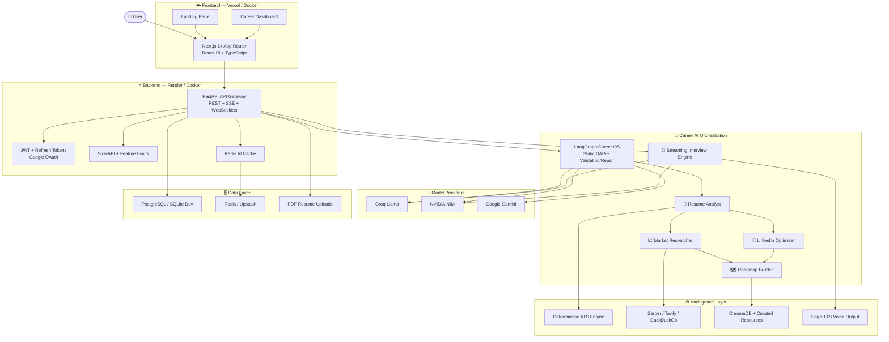

<div align="center">

```
 █████╗ ██╗      ██████╗ █████╗ ██████╗ ███████╗███████╗██████╗
██╔══██╗██║     ██╔════╝██╔══██╗██╔══██╗██╔════╝██╔════╝██╔══██╗
███████║██║     ██║     ███████║██████╔╝█████╗  █████╗  ██████╔╝
██╔══██║██║     ██║     ██╔══██║██╔══██╗██╔══╝  ██╔══╝  ██╔══██╗
██║  ██║██║     ╚██████╗██║  ██║██║  ██║███████╗███████╗██║  ██║
╚═╝  ╚═╝╚═╝      ╚═════╝╚═╝  ╚═╝╚═╝  ╚═╝╚══════╝╚══════╝╚═╝  ╚═╝

███╗   ███╗███████╗███╗   ██╗████████╗ ██████╗ ██████╗
████╗ ████║██╔════╝████╗  ██║╚══██╔══╝██╔═══██╗██╔══██╗
██╔████╔██║█████╗  ██╔██╗ ██║   ██║   ██║   ██║██████╔╝
██║╚██╔╝██║██╔══╝  ██║╚██╗██║   ██║   ██║   ██║██╔══██╗
██║ ╚═╝ ██║███████╗██║ ╚████║   ██║   ╚██████╔╝██║  ██║
╚═╝     ╚═╝╚══════╝╚═╝  ╚═══╝   ╚═╝    ╚═════╝ ╚═╝  ╚═╝
```

### ✦ *5 Specialized AI Workflows. One Career Transformation.* ✦

> 🎯 **Resume Analysis** · 🗺️ **Personalized Roadmaps** · 📈 **Live Market Intel** · 🎤 **Streaming Mock Interviews** · 🔐 **Google OAuth**

<br/>


<br/>

[](https://ai-career-mentor-anil.vercel.app)
[](https://ai-career-mentor-rrpu.onrender.com/docs)
[](https://microsoft.com)
[](https://devpost.com)
[](LICENSE)
[](https://github.com/Anil-Pradhan-web/ai-career-mentor/commits)

</div>

---

## 🧭 Table of Contents

- [What is AI Career Mentor?](#-what-is-ai-career-mentor)
- [Key Numbers](#-key-numbers-at-a-glance)
- [System Architecture](#-system-architecture)
  - [Pipeline Board](#-notion-style-pipeline-board)
  - [Mermaid Architecture](#-detailed-mermaid-architecture)
  - [Request Lifecycle](#-request-lifecycle--full-career-analysis)
- [Core Features](#-core-features)
- [The 5 AI Workflows](#-the-5-ai-workflows)
- [Hybrid Semantic RAG Engine](#-hybrid-semantic-rag-engine)
- [Dynamic Model Selector & Fallbacks](#-dynamic-model-selector--fallback-systems)
- [Tech Stack](#-tech-stack)
- [Local Setup](#-local-setup)
  - [Prerequisites](#prerequisites)
  - [Backend Setup](#2-backend-setup)
  - [Frontend Setup](#3-frontend-setup)
  - [Docker Setup](#4-docker-setup)
- [API Reference](#-api-reference)
- [Project Structure](#-project-structure)
- [CI/CD Pipeline & Hardening](#-cicd-pipeline--hardening)
- [Deployment](#-deployment)
- [Hackathon Submissions](#-hackathon-submissions)
- [Upgrade Roadmap](#-upgrade-roadmap)
- [Built By](#-built-by)

---

## 🎯 What is AI Career Mentor?

**AI Career Mentor** is a production-grade, full-stack career coaching platform that helps developers and students move from career confusion to a concrete execution plan. It combines resume parsing, ATS scoring, live market research, resource-enriched roadmaps, LinkedIn optimization, and adaptive mock interviews into one polished dashboard.

Most developers spend months trying to figure out:

- 📚 *What should I learn next?*
- 🏢 *Where should I apply?*
- 🎤 *How do I ace the interview?*
- 🔎 *Which skills are actually demanded in my target market?*
- 🧾 *Why is my resume not converting?*

**We solve all of these together** — a Resume Analyst scores the CV, a Market Researcher studies salary and hiring signals, a Career Coach builds an 8-week plan, a LinkedIn Reviewer upgrades profile positioning, and a Mock Interviewer stress-tests the candidate through a realtime WebSocket experience.

> 🧑‍💻 **Solo-built** — backend, frontend, agent orchestration, Google OAuth, RAG, Docker, CI/CD, and production infrastructure by one developer.
> ⏱️ **5–6 months** from concept to a fully deployed MVP.
> 📝 **130+ commits** of iterative design, production hardening, and feature delivery.

---

## 📊 Key Numbers at a Glance

| Metric | Value |
|--------|-------|
| Career Workflows | **5 core AI-powered workflows** |
| Full Analysis Graph | **Resume → parallel Market + LinkedIn → Roadmap** |
| Roadmap Length | **8 weeks** with projects, success criteria, and curated resources |
| Interview Flow | **7 adaptive questions** with persona discovery and final scoring |
| Rate Limit Architecture | **100 req/hr · 1000 req/day** in production + per-feature daily limits |
| Primary LLM Options | **Groq · NVIDIA NIM · Google Gemini** |
| Fallback Strategy | **Provider fallback chain + circuit breaker + deterministic fallbacks** |
| DB Connection Pool | **Free-tier optimized** (`pool_size=3`, `max_overflow=5`, `pool_pre_ping=True`) |
| Caching | **SHA-256 keyed Redis cache** for expensive full-analysis results |
| Semantic RAG | **ChromaDB persistent store + in-memory keyword fallback** |
| Auth | **Email/password JWT + refresh token + Google OAuth** |
| Deployment | **Vercel frontend · Render backend · Neon Postgres · Upstash Redis** |
| Hackathon Prize Pool | **$175,000+** across 2 submissions |

---

## 🏗️ System Architecture

The platform uses a decoupled frontend/backend architecture with a dedicated orchestration layer. The frontend is a Next.js 14 App Router application, while the backend is a FastAPI service that exposes REST, SSE, and WebSocket endpoints.

### 🧩 Notion-Style Pipeline Board

<table>
  <tr>
    <td width="20%" valign="top">
      <strong>① User Layer</strong><br/>
      <sub>Landing · Login · Dashboard</sub><br/><br/>
      👤 Developer / Student<br/>
      🧾 Resume PDF<br/>
      🎯 Target Role<br/>
      📍 Location + Seniority
    </td>
    <td width="20%" valign="top">
      <strong>② Frontend Layer</strong><br/>
      <sub>Next.js 14 App Router</sub><br/><br/>
      🏠 Landing Page<br/>
      📊 Career Hub<br/>
      🧭 Full Analysis Wizard<br/>
      🎤 Interview UI<br/>
      ⚙️ Provider Settings
    </td>
    <td width="20%" valign="top">
      <strong>③ API Layer</strong><br/>
      <sub>FastAPI Gateway</sub><br/><br/>
      🔐 JWT + Google OAuth<br/>
      🚦 SlowAPI Limits<br/>
      🔁 Token Refresh<br/>
      📡 REST + SSE + WS<br/>
      🧾 Activity Logs
    </td>
    <td width="20%" valign="top">
      <strong>④ AI Orchestration</strong><br/>
      <sub>LangGraph + Agent Registry</sub><br/><br/>
      📄 Resume Analyst<br/>
      📈 Market Researcher<br/>
      🔗 LinkedIn Optimizer<br/>
      🗺️ Roadmap Builder<br/>
      🎤 Mock Interviewer
    </td>
    <td width="20%" valign="top">
      <strong>⑤ Output Layer</strong><br/>
      <sub>Personalized Career OS</sub><br/><br/>
      ✅ ATS Score<br/>
      ✅ Salary + Hiring Trends<br/>
      ✅ 8-Week Roadmap<br/>
      ✅ LinkedIn Strategy<br/>
      ✅ Interview Scorecard
    </td>
  </tr>
</table>

```text
┌──────────────────────────────────────────────────────────────────────────────┐
│                      AI CAREER MENTOR — SYSTEM PIPELINE                      │
├──────────────────────────────────────────────────────────────────────────────┤
│  User Input                                                                  │
│  Resume PDF + Target Role + Location + Preferred LLM Provider                │
│        │                                                                     │
│        ▼                                                                     │
│  Next.js Dashboard                                                           │
│  Auth Pages · Full Analysis Wizard · Market Explorer · Interview Console     │
│        │                                                                     │
│        ▼                                                                     │
│  FastAPI Gateway                                                             │
│  JWT/Google OAuth · Rate Limit · Cache Check · Activity Audit · Validation   │
│        │                                                                     │
│        ├──────────────► PostgreSQL / SQLite                                  │
│        ├──────────────► Redis Cache + Rate Limit Store                       │
│        └──────────────► LangGraph Career OS                                  │
│                              │                                               │
│                              ▼                                               │
│     Resume Analyst ──► [Market Researcher + LinkedIn Optimizer in Parallel]  │
│                              │                         │                     │
│                              └──────────────┬──────────┘                     │
│                                             ▼                                │
│                                  Roadmap Aggregator                          │
│                                             │                                │
│                                             ▼                                │
│  Intelligence Engines                                                        │
│  ATS Engine · Market Service · Search Enrichment · ChromaDB RAG · Edge-TTS  │
│        │                                                                     │
│        ▼                                                                     │
│  Provider Router                                                             │
│  Groq ⇄ NVIDIA NIM ⇄ Google Gemini + deterministic fallback + circuit breaker│
│        │                                                                     │
│        ▼                                                                     │
│  Final Dashboard Output                                                      │
│  Resume Score · Market Insights · Roadmap · LinkedIn Plan · Mock Interview   │
└──────────────────────────────────────────────────────────────────────────────┘
```

### 🗺️ Detailed Mermaid Architecture


```mermaid
flowchart TD
    User(["👤 User"])

    subgraph Frontend ["☁️ Frontend — Vercel / Docker"]
        Landing["Landing Page"]
        Dashboard["Career Dashboard"]
        NextJS["Next.js 14 App Router\nReact 18 + TypeScript"]
    end

    subgraph Backend ["⚡ Backend — Render / Docker"]
        API["FastAPI API Gateway\nREST + SSE + WebSockets"]
        Auth["JWT + Refresh Tokens\nGoogle OAuth"]
        RateLimit["SlowAPI + Feature Limits"]
        Cache["Redis AI Cache"]
    end

    subgraph Orchestration ["🧠 Career AI Orchestration"]
        Graph["LangGraph Career OS\nStatic DAG + Validation/Repair"]
        Resume["📄 Resume Analyst"]
        Market["📈 Market Researcher"]
        LinkedIn["🔗 LinkedIn Optimizer"]
        Roadmap["🗺️ Roadmap Builder"]
        Interview["🎤 Streaming Interview Engine"]
    end

    subgraph Intelligence ["⚙️ Intelligence Layer"]
        ATS["Deterministic ATS Engine"]
        Search["Serper / Tavily / DuckDuckGo"]
        RAG["ChromaDB + Curated Resources"]
        Voice["Edge-TTS Voice Output"]
    end

    subgraph Providers ["🤖 Model Providers"]
        Groq["Groq Llama"]
        NVIDIA["NVIDIA NIM"]
        Gemini["Google Gemini"]
    end

    subgraph Data ["🗄️ Data Layer"]
        Postgres["PostgreSQL / SQLite Dev"]
        Redis["Redis / Upstash"]
        Files["PDF Resume Uploads"]
    end

    User --> NextJS
    Landing --> NextJS
    Dashboard --> NextJS
    NextJS --> API
    API --> Auth
    API --> RateLimit
    API --> Cache
    API --> Graph
    API --> Interview
    Graph --> Resume
    Resume --> Market
    Resume --> LinkedIn
    Market --> Roadmap
    LinkedIn --> Roadmap
    Resume --> ATS
    Market --> Search
    Roadmap --> RAG
    Interview --> Voice
    Graph --> Groq
    Graph --> NVIDIA
    Graph --> Gemini
    Interview --> Groq
    Interview --> NVIDIA
    API --> Postgres
    Cache --> Redis
    API --> Files
```

### 📋 Request Lifecycle — Full Career Analysis

1. **User uploads resume** — PDF text is extracted and sent with target role + location.
2. **Rate limit and cache check** — feature limits are enforced before the SHA-256 cache lookup.
3. **Resume node runs first** — deterministic ATS analysis is blended with LLM enhancement.
4. **Market and LinkedIn nodes run in parallel** — market data and profile strategy are generated independently after resume analysis.
5. **Roadmap node aggregates everything** — skill gaps + market trend + LinkedIn strategy become an 8-week plan.
6. **Validation/repair layer runs** — Pydantic validation catches malformed outputs and falls back when needed.
7. **Result is cached and logged** — response is stored for repeat requests, usage is incremented, and user activity is saved.

---

## ✨ Core Features

### 📄 Resume Intelligence

- PDF upload with plain-text extraction.
- ATS scoring with keyword, achievements, action verbs, and formatting breakdowns.
- Technical skills, soft skills, strengths, gaps, and experience estimation.
- Cached analysis paths to reduce duplicate model calls.

### 🗺️ Personalized Roadmap Generator

- 8-week learning roadmap based on role + skill gaps.
- Weekly topics, estimated hours, mini-projects, success criteria, and resource lists.
- Real resource enrichment from curated data, search APIs, and RAG similarity matching.
- Roadmap history, delete support, and dashboard progress tracking.

### 📈 Live Market Explorer

- Role, location, and seniority-aware market research.
- Salary range, market trend, hiring volume, remote signal, top skills, and hiring companies.
- Historical salary and hiring data visualized with dashboard charts.
- Professional API support through Serper/Tavily with deterministic fallback logic.

### 🔗 LinkedIn Optimizer

- Target-role-specific headline ideas.
- About-section rewrite strategy.
- Demanding skills, ATS keywords, recruiter search trends, certifications, and density advice.
- Available as a standalone page and inside the full-analysis workflow.

### 🎤 Adaptive Mock Interviews

- WebSocket-based interview experience.
- Company and interview-type aware flow.
- Adaptive questions, chat history, final score, and feedback.
- Interview history, detail view, and delete support.
- Edge-TTS integration for natural voice output with production safeguards.

### 📊 Career Dashboard

- Usage cards for resume, roadmap, interview, market, LinkedIn, and full-analysis features.
- Activity timeline from persisted user logs.
- Skill radar from latest resume analysis.
- Weekly activity chart and primary-goal progress tracking.
- Today's high interview score and report-depth metrics.

### 🔐 Authentication & User System

- Email/password registration and login.
- Google OAuth login.
- JWT access token + refresh token flow.
- Automatic frontend token refresh and session-expiry handling.

---

## 🧠 The 5 AI Workflows

| Workflow | What It Does | Implementation |
|----------|--------------|----------------|
| **1. Resume Analyst** | Extracts skills, gaps, strengths, experience, and ATS scoring. | Deterministic ATS engine + LLM polish + Pydantic validation |
| **2. Market Researcher** | Builds salary, hiring, trend, company, and skill-demand insights. | Market service + search APIs + provider LLM summary |
| **3. Career Coach / Roadmap Builder** | Produces an 8-week role-specific execution plan. | LangGraph aggregation + batched LLM calls + RAG enrichment |
| **4. LinkedIn Reviewer** | Optimizes profile positioning for recruiter search. | Standalone optimizer + full-analysis node |
| **5. Mock Interviewer** | Runs realtime adaptive interview sessions. | FastAPI WebSocket + direct model streaming + persisted history |

> The full-analysis workflow is powered by a **LangGraph static DAG** with parallel fan-out/fan-in. AutoGen/AG2 remains available for agent-style task execution and provider-compatible assistant definitions.

---

## 🧬 Hybrid Semantic RAG Engine

The roadmap generator does not rely on generic LLM output only. It enriches each week with real learning resources through a hybrid retrieval layer:

1. **Curated knowledge base** — `backend/app/data/curated_resources.json` stores high-quality YouTube, article, GitHub, and documentation resources.
2. **ChromaDB persistent vector store** — resources are auto-seeded at backend startup.
3. **In-memory fallback** — if ChromaDB is unavailable, a keyword-based semantic matcher keeps roadmap enrichment functional.
4. **Deduplication and normalization** — roadmap resources are organized into YouTube, article, GitHub, and official-doc buckets.

---

## ⚡ Dynamic Model Selector & Fallback Systems

To keep the product usable under free-tier limits and provider instability, the backend includes multiple resilience layers:

**Frontend model preference**
- Users can choose a preferred provider from settings.
- Services pass the provider into resume, roadmap, market, LinkedIn, and full-analysis requests.

**Provider routing**
- Supported providers: **Groq**, **NVIDIA NIM**, and **Google Gemini**.
- Groq defaults to `llama-3.1-8b-instant`; `.env.example` documents `llama-3.3-70b-versatile` as the stronger option.
- NVIDIA defaults to `meta/llama-3.3-70b-instruct`.
- Gemini defaults to `gemini-2.5-flash-lite`.

**Automatic fallbacks**
- LLM calls move through a fallback chain if the selected provider fails.
- Deterministic fallback engines protect resume, market, and roadmap paths from malformed model output.
- A circuit breaker temporarily disables repeated failing model calls to protect the API.

**Caching and rate limiting**
- Full-analysis results are cached with SHA-256 fingerprints.
- SlowAPI enforces global request limits.
- Feature-level usage counters enforce daily caps in the product experience.

---

## 🧱 Tech Stack

### Frontend

| Technology | Purpose |
|-----------|---------|
| **Next.js 14 App Router** | Full-stack React framework with route-level pages and layouts |
| **React 18 + TypeScript** | Typed UI components and client-side state |
| **Vanilla CSS + Tailwind config** | Custom visual system and utility support |
| **@react-oauth/google** | Google OAuth 2.0 login flow |
| **Axios** | API client with auth and refresh-token interceptors |
| **Recharts** | Dashboard charts and market visualizations |
| **Lucide React** | Icon system |
| **react-hot-toast** | Toast notifications |
| **Monaco Editor** | Rich code/editor-ready dependency for advanced UI workflows |

### Backend

| Technology | Purpose |
|-----------|---------|
| **FastAPI** | Async REST API, SSE streaming, WebSocket interviews |
| **LangGraph** | Full-analysis orchestration graph |
| **AG2 / AutoGen-compatible agents** | Agent definitions and assistant task execution |
| **OpenAI SDK** | OpenAI-compatible calls for Groq/NVIDIA streaming |
| **Google Generative AI** | Gemini fallback and Google model execution |
| **SQLAlchemy + Alembic** | ORM and database migrations |
| **PostgreSQL / SQLite** | Production and local persistence |
| **Redis + SlowAPI** | Rate limiting and cache storage |
| **ChromaDB** | Persistent vector database for resource RAG |
| **pdfplumber** | PDF resume parsing |
| **Serper / Tavily / DuckDuckGo** | Market and resource search |
| **edge-tts** | Voice synthesis for interviews |
| **Pytest** | Backend test coverage |

### DevOps & Infrastructure

| Tool | Purpose |
|------|---------|
| **Docker + Docker Compose** | Local and production container workflows |
| **Render** | Backend deployment |
| **Vercel** | Frontend deployment |
| **Neon Postgres** | Serverless production database |
| **Upstash Redis** | Serverless Redis for cache/rate limits |
| **GitHub Actions** | CI, Render deployment hook, Docker image publishing |

---

## 🚀 Local Setup

### Prerequisites

- Python **3.11+**
- Node.js **18+** / npm
- Groq, NVIDIA, or Google Gemini API key
- Google OAuth Client ID
- Optional: Redis, Serper, Tavily, Docker

### 1. Clone the Repository

```bash
git clone https://github.com/Anil-Pradhan-web/ai-career-mentor.git
cd ai-career-mentor
```

### 2. Backend Setup

```bash
cd backend
python -m venv venv

# Windows
venv\Scripts\activate

# macOS/Linux
source venv/bin/activate

pip install -r requirements.txt
cp .env.example .env
```

Update `backend/.env`:

```env
# ── LLM Configuration ─────────────────────────────────────
LLM_PROVIDER=groq
GROQ_API_KEY=your_groq_api_key_here
GROQ_MODEL=llama-3.3-70b-versatile
NVIDIA_API_KEY=your_nvidia_nim_key_here
NVIDIA_MODEL=meta/llama-3.3-70b-instruct
GOOGLE_API_KEY=your_google_api_key_here
GOOGLE_MODEL=gemini-2.5-flash

# ── Search APIs ───────────────────────────────────────────
SERPER_API_KEY=your_serper_api_key_here
TAVILY_API_KEY=your_tavily_api_key_here

# ── Database ──────────────────────────────────────────────
DATABASE_URL=sqlite:///./dev.db

# ── Auth ──────────────────────────────────────────────────
SECRET_KEY=your_super_secret_jwt_key_here
ACCESS_TOKEN_EXPIRE_MINUTES=60
REFRESH_TOKEN_EXPIRE_DAYS=30
GOOGLE_CLIENT_ID=your_google_client_id.apps.googleusercontent.com

# ── Redis / App ───────────────────────────────────────────
REDIS_URL=redis://localhost:6379/0
APP_ENV=development
CORS_ORIGINS=http://localhost:3000
```

Run the backend:

```bash
uvicorn app.main:app --reload
```

Backend runs at:
- API root: `http://localhost:8000`
- Swagger docs: `http://localhost:8000/docs`
- Health check: `http://localhost:8000/health`

### 3. Frontend Setup

```bash
cd frontend
npm install
```

Create `frontend/.env.local`:

```env
NEXT_PUBLIC_API_URL=http://localhost:8000
NEXT_PUBLIC_GOOGLE_CLIENT_ID=your_google_client_id.apps.googleusercontent.com
```

Run the frontend:

```bash
npm run dev
# Runs at http://localhost:3000
```

### 4. Docker Setup

```bash
# Development stack
docker compose up --build

# Production override
docker compose -f docker-compose.yml -f docker-compose.prod.yml up --build
```

Frontend runs at `http://localhost:3000`.

---

## 📡 API Reference

| Method | Endpoint | Auth | Description |
|--------|----------|------|-------------|
| `GET` | `/` | — | API welcome payload |
| `GET` | `/health` | — | System health, DB status, provider, model, timestamp |
| `GET` | `/ping` | — | Ultra-lightweight Render keep-alive |
| `POST` | `/auth/register` | — | Email/password registration |
| `POST` | `/auth/login` | — | Login and issue JWT + refresh token |
| `POST` | `/auth/google` | — | Google OAuth credential login |
| `POST` | `/auth/refresh` | — | Refresh access token |
| `GET` | `/user/stats` | ✅ JWT | Dashboard stats, histories, usage, and activity |
| `POST` | `/resume/upload` | ✅ JWT | Upload PDF and extract text preview |
| `POST` | `/resume/analyze` | ✅ JWT | Resume ATS + AI analysis |
| `POST` | `/roadmap/generate` | ✅ JWT | Generate resource-enriched 8-week roadmap |
| `GET` | `/roadmap/history` | ✅ JWT | Fetch saved roadmap history |
| `DELETE` | `/roadmap/{roadmap_id}` | ✅ JWT | Delete a roadmap |
| `GET` | `/market/config` | ✅ JWT | Fetch market form configuration |
| `GET` | `/market/trends` | ✅ JWT | Role/location/seniority-aware market trends |
| `POST` | `/linkedin/optimize` | ✅ JWT | LinkedIn profile optimization strategy |
| `POST` | `/career/full-analysis` | ✅ JWT | Full coordinated career analysis |
| `POST` | `/career/full-analysis/stream` | ✅ JWT | SSE streaming full-analysis progress and result |
| `WS` | `/interview/ws/{session_id}` | Session JWT | Streaming mock interview socket |
| `GET` | `/interview/history` | ✅ JWT | Interview session history |
| `GET` | `/interview/{session_id}` | ✅ JWT | Interview session details |
| `DELETE` | `/interview/{session_id}` | ✅ JWT | Delete interview session |

---

## 📁 Project Structure

```
ai-career-mentor/
├── .github/
│   └── workflows/
│       ├── ci.yml                      # Frontend lint + build, backend pytest + pip-audit
│       ├── render-deploy.yml           # Render backend deploy hook on main push
│       └── docker-publish.yml          # Build & publish backend/frontend images to GHCR
│
├── assets/
│   └── banner.png
│
├── backend/
│   ├── alembic/                        # Database migration scripts
│   │   └── versions/
│   ├── app/
│   │   ├── agents/
│   │   │   ├── registry.py             # Provider calls, agent factories, fallback logic
│   │   │   └── workflow.py             # LangGraph Career OS graph orchestration
│   │   ├── api/
│   │   │   ├── auth.py                 # Email/password, refresh token, Google OAuth
│   │   │   ├── career.py               # Full analysis + SSE streaming analysis
│   │   │   ├── interview.py            # WebSocket interview engine + history
│   │   │   ├── linkedin.py             # LinkedIn optimizer endpoint
│   │   │   ├── market.py               # Market explorer endpoint
│   │   │   ├── resume.py               # PDF upload + resume analysis
│   │   │   ├── roadmap.py              # Roadmap generation + history
│   │   │   └── user.py                 # Dashboard stats endpoint
│   │   ├── core/
│   │   │   ├── market/
│   │   │   │   └── service.py          # Unified market intelligence service
│   │   │   ├── activity.py             # User activity logging
│   │   │   ├── ats_engine.py           # Deterministic resume scoring engine
│   │   │   ├── cache.py                # SHA-256 keyed Redis response cache
│   │   │   ├── config.py               # Environment and provider configuration
│   │   │   ├── database.py             # SQLAlchemy engine/session setup
│   │   │   ├── rag_service.py          # ChromaDB + in-memory RAG fallback
│   │   │   ├── rate_limit.py           # Feature-level usage controls
│   │   │   ├── search_engine.py        # Resource/search enrichment layer
│   │   │   ├── security.py             # Password hashing and JWT utilities
│   │   │   └── voice_engine.py         # Edge-TTS voice generation
│   │   ├── data/
│   │   │   └── curated_resources.json  # Curated YouTube, article, GitHub, doc resources
│   │   ├── models/                     # SQLAlchemy models, Pydantic schemas, validation
│   │   └── main.py                     # FastAPI app entry point
│   ├── tests/                          # Backend pytest test suite
│   ├── Dockerfile
│   ├── requirements.txt
│   └── .env.example
│
├── frontend/
│   ├── public/                         # Brand/company SVGs and static assets
│   ├── src/
│   │   ├── app/
│   │   │   ├── dashboard/              # Main app pages: resume, roadmap, market, interview
│   │   │   ├── login/                  # Login page
│   │   │   └── register/              # Registration page
│   │   ├── components/
│   │   │   ├── auth/                   # Auth cards, inputs, buttons
│   │   │   ├── charts/                 # Recharts-based dashboard charts
│   │   │   ├── full-analysis/          # Career OS panels and streaming logs
│   │   │   ├── interview/              # Interview wizard, chat interface, history
│   │   │   └── landing/                # Marketing landing sections
│   │   ├── hooks/                      # Shared React hooks
│   │   ├── services/                   # Axios client + feature API wrappers
│   │   └── types/                      # TypeScript interfaces and types
│   ├── Dockerfile
│   ├── next.config.js
│   └── package.json
│
├── docker-compose.yml                  # Local full-stack services
├── docker-compose.prod.yml             # Production compose override
├── render.yaml                         # Render backend service config
├── system_design.svg                   # Architecture diagram
├── DOCKER_GUIDE.md                     # Docker deployment guide
├── project_walkthrough.md              # Project walkthrough notes
└── README.md
```

---

## 🔄 CI/CD Pipeline & Hardening

### GitHub Actions

**CI** — runs on every push and pull request:
- Frontend: `npm ci` → `npm run lint` → `npm run build`
- Backend: install Python dependencies → `pytest` → `pip-audit`

**Backend Deploy** — pushes to `main` affecting backend files trigger a Render deploy hook automatically.

**Docker Publish** — builds backend and frontend images and publishes them to GitHub Container Registry on every `main` push.

### Production Hardening Protocols

1. **CORS allow-listing** — configured through `CORS_ORIGINS`; wildcard filtering is avoided.
2. **Production environment validation** — production rejects SQLite, default secrets, and missing search API keys.
3. **Postgres connection pooling** — `pool_pre_ping`, `pool_recycle`, and small pool sizes protect free-tier DBs.
4. **Redis-aware rate limiting** — development uses memory storage; production uses managed Redis.
5. **WebSocket cleanup guards** — interview sessions include defensive cleanup paths for disconnects.
6. **Response caching** — expensive full-analysis calls are SHA-256 fingerprinted and cached.
7. **Validation/repair loops** — malformed LLM outputs are caught via Pydantic before reaching the UI.
8. **Container-ready builds** — backend and frontend ship with Dockerfiles plus compose orchestration.

---

## 🌐 Deployment

### Live Production

| Component | Platform | URL |
|-----------|----------|-----|
| **Frontend** | Vercel | [ai-career-mentor-anil.vercel.app](https://ai-career-mentor-anil.vercel.app) |
| **Backend API** | Render.com | [ai-career-mentor-rrpu.onrender.com/docs](https://ai-career-mentor-rrpu.onrender.com/docs) |
| **Database** | Neon Postgres | Serverless production persistence |
| **Cache / Rate Limit** | Upstash Redis | Serverless cache and rate-limit storage |
| **Container Images** | GitHub Container Registry | Backend and frontend image publishing |

### Production Environment Checklist

- [ ] `APP_ENV=production`
- [ ] PostgreSQL `DATABASE_URL` configured — **do not use SQLite in production**
- [ ] Strong `SECRET_KEY` configured
- [ ] At least one search provider configured: `SERPER_API_KEY` or `TAVILY_API_KEY`
- [ ] LLM provider keys configured for the selected model path
- [ ] `CORS_ORIGINS` includes the production frontend domain
- [ ] `NEXT_PUBLIC_API_URL` points to the deployed backend
- [ ] `NEXT_PUBLIC_GOOGLE_CLIENT_ID` matches Google OAuth console settings

---

## 🏆 Hackathon Submissions

### 🔵 Microsoft AI DevDays Hackathon

- **Total Prize Pool**: **$80,000+**
- **Submission Date**: **April 12, 2026** ✅
- **Requirements Satisfied**: AutoGen/agentic AI architecture ✅ · Deployed MVP ✅ · Public repo ✅

### 🟠 Amazon Nova AI Hackathon

- **Total Prize Pool**: **$40,000 cash + $55,000 AWS Credits**
- **Submission Date**: **April 12, 2026** ✅
- **Requirements Satisfied**: Multi-agent career workflow ✅ · Edge-TTS voice ✅ · Full-stack deployed MVP ✅

---

## 🗺️ Upgrade Roadmap

### ✅ Shipped

| Feature | Status |
|---------|--------|
| Google OAuth 2.0 | ✅ Shipped |
| Email/password auth with JWT + refresh tokens | ✅ Shipped |
| Responsive Landing + Dashboard UI | ✅ Shipped |
| Resume PDF Upload + ATS Analysis | ✅ Shipped |
| Roadmap Generator with RAG Resources | ✅ Shipped |
| Market Explorer with Charts | ✅ Shipped |
| LinkedIn Optimizer | ✅ Shipped |
| Full Career Analysis Graph | ✅ Shipped |
| SSE Streaming Full Analysis Endpoint | ✅ Shipped |
| WebSocket Mock Interviews | ✅ Shipped |
| Interview History + Delete | ✅ Shipped |
| Roadmap History + Delete | ✅ Shipped |
| Redis Rate Limiter + AI Response Cache | ✅ Shipped |
| Neon/Postgres Connection Pooling | ✅ Shipped |
| Dynamic Provider Selector | ✅ Shipped |
| Groq / NVIDIA / Gemini Provider Support | ✅ Shipped |
| Hybrid Semantic RAG Engine | ✅ Shipped |
| Docker + Docker Compose | ✅ Shipped |
| GitHub Actions CI + Docker Publish | ✅ Shipped |
| Render Deploy Hook Workflow | ✅ Shipped |

### 🔜 Planned

| Feature | Status |
|---------|--------|
| httpOnly Cookie Auth | 🔜 Planned |
| Email Verification (Resend) | 🔜 Planned |
| Admin Analytics Panel | 🔜 Planned |
| Interview Voice Input | 🔜 Planned |

---

## 👤 Built By

<div align="center">

| Name | Role |
|------|------|
| **[Anil Pradhan](https://github.com/Anil-Pradhan-web)** | Solo Full-Stack Developer |

> *Every line of backend, frontend, orchestration, Google OAuth, RAG engines, cloud infrastructure, Docker workflow, and UI/UX — built solo over 5–6 months across 130+ commits.*

---

**Built with 🧠 by [Anil Pradhan](https://github.com/Anil-Pradhan-web)**

`#LangGraph` `#AutoGen` `#MultiAgent` `#NVIDIANIM` `#GoogleOAuth` `#RAG` `#ChromaDB` `#FastAPI` `#NextJS` `#AgenticAI` `#Groq` `#Gemini` `#WebSocket`

</div>
