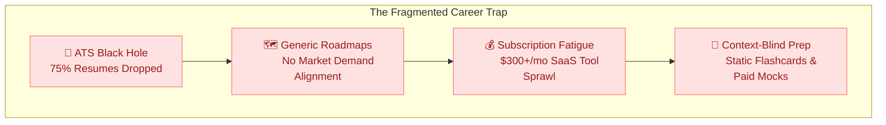
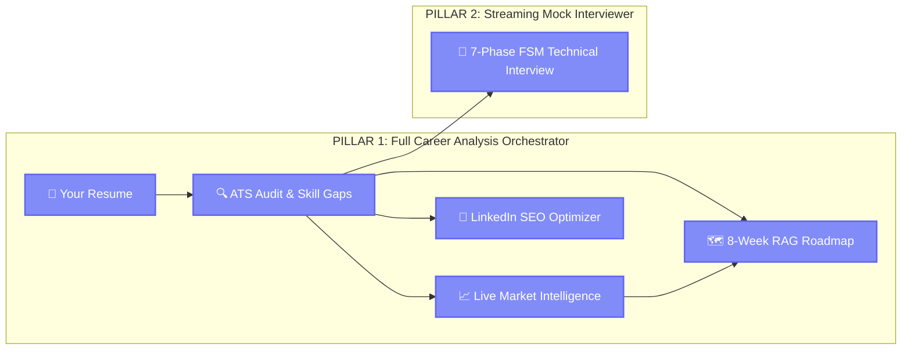
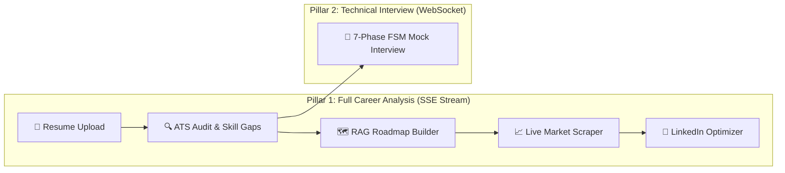
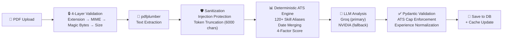
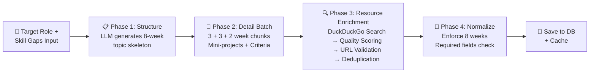
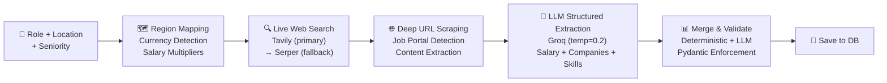
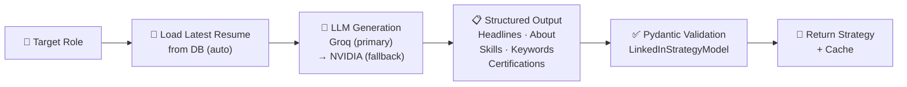
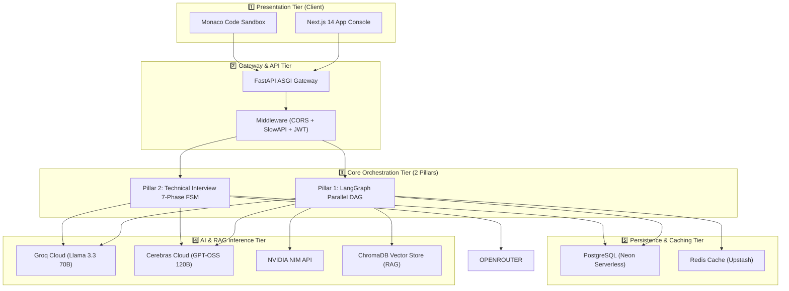
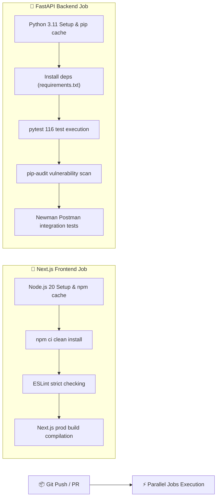
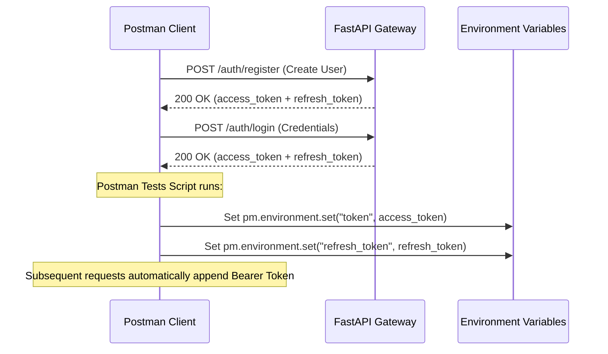

<div align="center">

```
  █████╗ ██╗     ██████╗  █████╗  ██████╗  ███████╗ ███████╗ ██████╗ 
 ██╔══██╗██║    ██╔════╝ ██╔══██╗ ██╔══██╗ ██╔════╝ ██╔════╝ ██╔══██╗
 ███████║██║    ██║      ███████║ ██████╔╝ █████╗   █████╗   ██████╔╝
 ██╔══██║██║    ██║      ██╔══██║ ██╔══██╗ ██╔══╝   ██╔══╝   ██╔══██╗
 ██║  ██║██║    ╚██████╗ ██║  ██║ ██║  ██║ ███████╗ ███████╗ ██║  ██║
 ╚═╝  ╚═╝╚═╝     ╚═════╝ ╚═╝  ╚═╝ ╚═╝  ╚═╝ ╚══════╝ ╚══════╝ ╚═╝  ╚═╝

 ███╗   ███╗ ███████╗ ███╗   ██╗ ████████╗  ██████╗  ██████╗ 
 ████╗ ████║ ██╔════╝ ████╗  ██║ ╚══██╔══╝ ██╔═══██╗ ██╔══██╗
 ██╔████╔██║ █████╗   ██╔██╗ ██║    ██║    ██║   ██║ ██████╔╝
 ██║╚██╔╝██║ ██╔══╝   ██║╚██╗██║    ██║    ██║   ██║ ██╔══██╗
 ██║ ╚═╝ ██║ ███████╗ ██║ ╚████║    ██║    ╚██████╔╝ ██║  ██║
 ╚═╝     ╚═╝ ╚══════╝ ╚═╝  ╚═══╝    ╚═╝     ╚═════╝  ╚═╝  ╚═╝
```

### ✦ **2 Core AI Pillars. 1 Complete Career Transformation.** ✦

> 🧠 **Pillar 1: Full Career Analysis** (Resume Intelligence · Personalized Roadmap · Live Market Intel · LinkedIn Optimization)
> 🎤 **Pillar 2: Streaming Mock Interviewer** (7-Phase FSM · Monaco Code Sandbox · Real-Time Feedback Scoring)

<br/>


<br/>

[](https://ai-career-mentor-anil.vercel.app)
[](https://ai-career-mentor-rrpu.onrender.com/docs)
[](https://microsoft.com)
[](https://devpost.com)
[](./documentation/ARCHITECTURE.md)
[](./documentation/API.md)

</div>

---

## 📑 **Table of Contents**

| # | Section | 🔗 |
|---|---------|-----|
| 1 | [🧭 What is AI CAREER MENTOR?](#what-is-ai-career-mentor) | Project Overview |
| 2 | [❗ The Problem](#the-problem-career-transitions-are-broken) | Problem Statement & Pain Points |
| 3 | [🎯 Who Faces This Problem?](#who-faces-this-problem) | Target Audience |
| 4 | [🏆 Competitive Landscape](#competitive-landscape-what-exists-today) | Market Analysis & Tool Comparison |
| 5 | [💡 How We Uniquely Solve This](#how-ai-career-mentor-uniquely-solves-this) | Differentiators & USP |
| 6 | [🚀 Core System Workflows](#core-system-workflows) | Detailed Pipeline Walkthroughs |
| 7 | [📊 Key Numbers at a Glance](#key-numbers-at-a-glance) | Metrics & Stats |
| 8 | [🏗️ System Architecture Overview](#system-architecture-overview) | High-Level Design |
| 9 | [🛠️ Complete Tech Stack and Tooling](#complete-tech-stack-and-tooling) | Full Stack Details |
| 10 | [🔄 CI/CD Pipeline and Docker](#cicd-pipeline-and-docker) | GitHub Actions + Docker |
| 11 | [📁 Complete Project Structure](#complete-project-structure) | Deep Tree |
| 12 | [🧪 Testing and API Validation](#testing-and-api-validation) | 116 Pytest + Postman Suite |
| 13 | [🚀 Local Setup Guide](#local-setup-guide) | 5-Minute Setup |
| 14 | [🚦 Rate Limits and Cooldowns](#rate-limits-and-cooldowns) | Daily Caps and Gap Locks |
| 15 | [🔑 Environment Variables](#environment-variables) | Config Reference |
| 16 | [📚 Documentation Index](#documentation-index) | All Docs |
| 17 | [🏆 Hackathon Submits](#hackathon-achievements) | Participation |

---

<a id="what-is-ai-career-mentor"></a>
## 🧭 **What is AI CAREER MENTOR?**

**AI CAREER MENTOR** is an open-source, production-grade **Career Orchestration Operating System** 🤖 engineered to solve the systemic fragmentation in tech hiring. Built using **LangGraph Multi-Agent Orchestration**, **Vector-Search RAG (ChromaDB)**, and **Full-Duplex WebSockets**, it unifies the entire career transition lifecycle into **2 Core Interconnected Pillars**:

1. **🧠 Pillar 1: Full Career Analysis Orchestrator** — A parallel LangGraph DAG that chains Resume ATS Auditing, 8-Week RAG Roadmap Generation, Live Market Intelligence Scraping, and LinkedIn SEO Optimization in ~60 seconds.
2. **🎤 Pillar 2: Streaming Technical Mock Interviewer** — A 7-Phase Finite State Machine (FSM) running real-time WebSocket interview simulations with Monaco Code Sandbox execution and automated performance scorecards.

---

<a id="the-problem-career-transitions-are-broken"></a>
## ❗ **The Problem: Career Transitions Are Broken**

### 📖 **The Story of Alex: A Developer's Frustrating Journey**

> [!IMPORTANT]
> **Meet Alex** — a 3rd-year CS student with solid coding fundamentals, a portfolio of projects, and a dream to break into software engineering. 
> 
> * **Month 1:** Alex spends weeks polishing a resume and applies to 250+ job openings using one-click portals. **Result:** 0 recruiter callbacks. 75% of resumes are silently dropped by Automated Applicant Tracking Systems (ATS) due to missing keyword aliases.
> * **Month 2:** Confused about what skills are missing, Alex turns to the internet. Generic roadmaps ("Learn React", "Learn System Design") don't account for Alex's existing knowledge or local market hiring trends.
> * **Month 3:** Alex attempts to research salaries on Levels.fyi and Glassdoor, optimizes LinkedIn using trial-and-error, and looks for mock interview prep. To cover all these tools, Alex faces **$300+/month in fragmented SaaS subscriptions** (Jobscan + Teal + Interviewing.io).
> * **Month 4:** Alex finally gets an interview invitation but freezes during the coding and architecture rounds — because existing practice tools use static flashcards without knowing Alex's specific resume projects or background.

**This isn't just Alex's story — it's the reality for millions of developers worldwide.**

---

### 📊 **Industry Research & Hiring Reality in Numbers**

Our market research highlights a severe structural disconnect between how developers prepare and how modern tech companies hire:

| 📊 Market Statistic | 🔍 Data Source | 🧩 Impact on Candidates |
|:---|:---|:---|
| **75% of Resumes Dropped** | *Jobscan / Hiring Insights (2024–2025)* | Automated ATS parsers reject candidate resumes before a human recruiter ever sees them. |
| **5.2 Months Average Job Search** | *U.S. & Global Tech Hiring Reports* | Fragmented tools and unstructured learning lead to multi-month candidate burnouts. |
| **250+ Applicants Per Role** | *Dice.com & LinkedIn Talent Insights* | Easy-apply features cause recruiter inbox overload, making keyword optimization mandatory. |
| **$250 – $500 / Month SaaS Cost** | *SaaS Pricing Analysis (2025)* | Candidates must juggle 5–7 separate subscriptions for resumes, roadmaps, salaries, and mock interviews. |
| **143% Spike in AI/ML Roles** | *Ravio Compensation & Hiring Data* | Hiring standards have shifted rapidly toward production engineering, system design, and AI integration skills. |

---

### 🧩 **The 4 Structural Gaps in Tech Hiring Today**


```mermaid
flowchart TD
    subgraph "The Fragmented Career Trap"
        A["📄 ATS Black Hole
        75% Resumes Dropped"] --> B["🗺️ Generic Roadmaps
        No Market Demand Alignment"]
        B --> C["💰 Subscription Fatigue
        $300+/mo SaaS Tool Sprawl"]
        C --> D["🎤 Context-Blind Prep
        Static Flashcards & Paid Mocks"]
    end

    classDef danger fill:#fee2e2,color:#991b1b,stroke:#f87171
    class A,B,C,D danger
```

1. **ATS Keyword Asymmetry:** Job descriptions use specific recruiter search tags. Candidates with strong project experience get filtered out simply because their resume lacks exact industry keyword aliases.
2. **Static & Non-Personalized Roadmaps:** Online roadmaps are static checklists. They do not analyze a candidate's specific resume gaps nor align with real-time hiring demand in target cities.
3. **Fragmented SaaS Tool Sprawl:** Job hunters must pay separate monthly fees for ATS scanners ($49/mo), resume builders ($29/mo), market data ($19/mo), and mock interviews ($179/session). None of these tools share context.
4. **Context-Blind Mock Interviews:** Standard practice platforms do not know what projects are on your resume. When an interviewer asks *"Tell me about a challenging bug in your project"*, static platforms cannot evaluate candidate-specific answers.

---

<a id="who-faces-this-problem"></a>
## 🎯 **Who Faces This Problem?**

| 👤 Candidate Persona | 😰 Specific Pain Point | 🚀 How AI Career Mentor Solves It |
|:---|:---|:---|
| **🎓 Fresh CS Graduates** | Have strong theoretical fundamentals but struggle with ATS resume screening and lack industry skill clarity. | **Deterministic ATS Audit + RAG Roadmap** pinpoints exact keyword gaps and generates an 8-week actionable project syllabus. |
| **💻 Self-Taught & Bootcamp Developers** | Possess coding skills but lack exposure to production engineering, system design, and test-driven development. | **7-Phase FSM Mock Interviewer** tests system design, CS theory, and coding with real-time feedback scoring. |
| **🔄 Career Switchers (Non-Tech → Tech)** | Don't know how to translate past domain experience (finance, healthcare, engineering) into tech-relevant accomplishments. | **LinkedIn Optimizer Agent** rewrites experience narratives using recruiter-targeted keywords and headline variants. |
| **📈 Mid-Level Devs Aiming for Senior** | Stuck at developer plateaus; need FAANG-tier system design depth and salary benchmark transparency. | **Live Market Scraper** delivers location-aware salary band analysis and region-specific hiring trends. |

---

<a id="competitive-landscape-what-exists-today"></a>
## 🏆 **Competitive Landscape: What Exists Today**

| 🏷️ Platform / Tool | 💰 Pricing | 📄 ATS Audit | 🗺️ RAG Roadmap | 📈 Market Intel | 🔗 LinkedIn SEO | 🎤 FSM Mock Interview | 🧠 Interconnected Context |
|:---|:---:|:---:|:---:|:---:|:---:|:---:|:---:|
| **Jobscan** | $49.95/mo | ✅ Basic ATS | ❌ | ❌ | ❌ | ❌ | ❌ |
| **TealHQ** | $29.00/mo | ✅ Builder | ❌ | ❌ | ❌ | ❌ | ❌ |
| **Roadmap.sh** | Free | ❌ | ✅ Static Only | ❌ | ❌ | ❌ | ❌ |
| **Levels.fyi** | Free / Paid | ❌ | ❌ | ✅ Salary Only | ❌ | ❌ | ❌ |
| **Interviewing.io** | $179–$300/sess | ❌ | ❌ | ❌ | ❌ | ✅ Human Expert | ❌ |
| 🚀 **AI CAREER MENTOR** | **100% Free & Open Source** | ✅ **Hybrid ATS + LLM** | ✅ **8-Week RAG Syllabus** | ✅ **Live Scraper** | ✅ **Resume-Aware** | ✅ **7-Phase FSM** | ✅ **LangGraph DAG Memory** |

> 💡 **The Unified Context Advantage:** Existing tools operate in silos. In **AI CAREER MENTOR**, your resume analysis automatically informs your roadmap skill gaps, your market research tunes your learning priorities, and your mock interviewer asks questions directly about YOUR projects.

---

### 💡 **How AI CAREER MENTOR Uniquely Solves This**

AI Career Mentor unifies all career transition needs into **2 Core Interconnected Pillars**:


```mermaid
graph LR
    classDef unique fill:#818cf8,color:#fff,stroke:#6366f1,stroke-width:2px

    subgraph "PILLAR 1: Full Career Analysis Orchestrator"
        A["📄 Your Resume"] --> B["🔍 ATS Audit & Skill Gaps"]
        B --> C["🗺️ 8-Week RAG Roadmap"]
        B --> D["📈 Live Market Intelligence"]
        B --> E["🔗 LinkedIn SEO Optimizer"]
        D --> C
    end

    subgraph "PILLAR 2: Streaming Mock Interviewer"
        B --> F["🎤 7-Phase FSM Technical Interview"]
    end

    class A,B,C,D,E,F unique
```

| 🔑 Differentiator | 🔍 What Makes It Unique |
|:---|:---|
| **🧠 Pillar 1: Full Career Analysis (LangGraph DAG)** | Runs 4 specialized agents in parallel via LangGraph DAG (Resume + Market → LinkedIn + Roadmap). Your resume analysis feeds directly into your roadmap (targets YOUR skill gaps), market data tunes your roadmap (focuses on in-demand skills), and LinkedIn strategy uses YOUR resume strengths. |
| **🎤 Pillar 2: Streaming Mock Interview Engine** | Loads YOUR resume, adapts questions to your role category (7 categories), scales difficulty by company tier (FAANG/startup), and provides a real Monaco code editor for live coding — all via a persistent WebSocket with automated feedback scoring. |
| **📈 Live Market Intelligence** | Scrapes live job boards in real-time, normalizes salaries to your local currency (INR/USD/EUR/GBP/AED/SGD/AUD), and identifies region-specific hiring trends. |
| **🗺️ Personalized RAG Roadmaps** | Generates an 8-week syllabus using YOUR skill gaps + market demand, enriched with quality-scored YouTube, GitHub, and documentation links. Includes gamified weekly quizzes. |
| **🏗️ Production-Grade Architecture** | 116 Pytest test suite, GitHub Actions CI/CD, multi-stage Docker builds, PostgreSQL + Redis, and Pydantic validation at every layer. |

---

### 🎯 **The Value Proposition: 6 Months vs. 6 Minutes**

Traditional career transitions are exhausting. Developers waste months reading disjointed roadmaps, guessing ATS keywords, analyzing salary benchmarks, and practicing mock interviews with static cards. 

**AI CAREER MENTOR automates this entire lifecycle into 2 streamlined pillars:**


```mermaid
flowchart LR
    subgraph "Pillar 1: Full Career Analysis (SSE Stream)"
        A["📄 Resume Upload"] --> B["🔍 ATS Audit & Skill Gaps"]
        B --> C["🗺️ RAG Roadmap Builder"]
        C --> D["📈 Live Market Scraper"]
        D --> E["🔗 LinkedIn Optimizer"]
    end

    subgraph "Pillar 2: Technical Interview (WebSocket)"
        B --> F["🎤 7-Phase FSM Mock Interview"]
    end
```

---

### 🚀 **Core System Workflows**

At the heart of the platform are the **Primary AI Workflows** split across the 2 Core Pillars:

#### 🧠 **Pillar 1 — Full Career Analysis Pipeline**
| # | 🚦 Agent / Workflow | 🚇 Transport | ⚙️ Engine | 🎯 What It Does |
|---|--------------------|-------------|-----------|-----------------|
| 1 | **🧠 Full Career Analysis DAG** | `SSE Stream` | LangGraph Parallel DAG | Fan-out 4 agents in parallel → stream real-time logs → aggregate complete career report |
| 2 | **📄 Resume Intelligence Agent** | `REST` | Deterministic ATS + LLM Hybrid | 4-layer PDF validation → ATS scoring → LLM skill extraction → Pydantic validation |
| 3 | **🗺️ Career Roadmap Agent** | `REST` | LangGraph + RAG + Groq/Gemini | 8-week personalized syllabus → ChromaDB enrichment → DuckDuckGo resource search |
| 4 | **📈 Market Explorer Agent** | `REST` | Tavily/Serper + Groq LLM | Live job board scraping → salary normalization → region-aware trend analysis |
| 5 | **🔗 LinkedIn Optimizer Agent** | `REST` | Groq/NVIDIA + Programmatic Fallback | Resume-aware headline rewriting → ATS keyword injection → recruiter trend mapping |

<br/>

#### 🎤 **Pillar 2 — Streaming Technical Mock Interviewer**
| # | 🚦 Agent / Workflow | 🚇 Transport | ⚙️ Engine | 🎯 What It Does |
|---|--------------------|-------------|-----------|-----------------|
| 6 | **🎤 Mock Interview Engine** | `🔌 WebSocket` | 7-Phase FSM + Groq/Gemini | Real-time interview simulation → Monaco code editor → audio feedback & scorecard |

---

### 📄 **Workflow 1 — Resume Intelligence**

> **Endpoint**: `POST /resume/analyze` · **Transport**: REST · **Rate Limit**: 1/day (2-day gap lock)

**🧑‍💻 How the User Uses It:**
Upload your PDF resume → the system instantly extracts text, runs a deterministic ATS audit, then sends the content to an LLM for deep skill extraction → you get a complete analysis with an ATS score, skill gaps, strengths, and experience breakdown.


```mermaid
flowchart LR
    A["📁 PDF Upload"] --> B["🔒 4-Layer Validation
    Extension → MIME → Magic Bytes → Size"]
    B --> C["📄 pdfplumber
    Text Extraction"]
    C --> D["🛡️ Sanitization
    Injection Protection
    Token Truncation (6000 chars)"]
    D --> E["📊 Deterministic ATS Engine
    120+ Skill Aliases
    Date Merging
    4-Factor Score"]
    E --> F["🤖 LLM Analysis
    Groq (primary)
    NVIDIA (fallback)"]
    F --> G["✅ Pydantic Validation
    ATS Cap Enforcement
    Experience Normalization"]
    G --> H["💾 Save to DB
    + Cache Update"]
```

**🔧 Technical Highlights:**
- **Hybrid Scoring**: Combines a rules-based ATS engine (keyword matching, action verb detection, date range merging) with LLM-powered semantic analysis for nuanced gap detection
- **4-Layer PDF Validation**: File extension → MIME type → magic bytes (`%PDF-`) → size check (max 5MB) prevents malicious uploads
- **Prompt Injection Protection**: Strips `{}`, triple backticks, and normalizes whitespace before sending to LLM
- **RAG Pipeline Integration**: When a target role is specified, injects gold-standard skills, common toolchains, and experience benchmarks from `resume_rag_pipeline.json` into the LLM prompt
- **Provider Fallback**: Tries Groq first (free, fast) → auto-falls back to NVIDIA NIM on failure

---

### 🗺️ **Workflow 2 — Career Roadmap Builder**

> **Endpoint**: `POST /roadmap/generate` · **Transport**: REST · **Rate Limit**: 1/day (5-day gap lock)

**🧑‍💻 How the User Uses It:**
Choose your target role (e.g. "Backend Engineer"), select skill gaps, experience level, and learning style → the system builds a personalized 8-week learning syllabus with real YouTube videos, GitHub repos, and official docs → track progress week-by-week and take AI-generated quizzes.


```mermaid
flowchart LR
    A["🎯 Target Role +
    Skill Gaps Input"] --> B["📋 Phase 1: Structure
    LLM generates 8-week
    topic skeleton"]
    B --> C["📝 Phase 2: Detail Batch
    3 + 3 + 2 week chunks
    Mini-projects + Criteria"]
    C --> D["🔍 Phase 3: Resource Enrichment
    DuckDuckGo Search
    → Quality Scoring
    → URL Validation
    → Deduplication"]
    D --> E["📐 Phase 4: Normalize
    Enforce 8 weeks
    Required fields check"]
    E --> F["💾 Save to DB
    + Cache"]
```

**🔧 Technical Highlights:**
- **3-Phase LLM Generation**: Structure skeleton → Detail batch (3+3+2 chunk pattern for token efficiency) → Resource enrichment
- **Parallel Resource Enrichment**: Uses `ThreadPoolExecutor` to search DuckDuckGo for YouTube, GitHub, articles, and official docs concurrently across all 8 weeks
- **Quality-Weighted Search**: Each URL is scored against a domain quality map (e.g. `roadmap.sh: 40`, `github.com: 25`, `medium.com: 5`), validated for HTTP reachability, and deduplicated
- **ChromaDB RAG Fallback**: On Render (512MB RAM), auto-switches from ChromaDB vector similarity to a keyword-matching fallback to prevent OOM crashes
- **Gamified Quizzes**: Each week has a `/roadmap/{id}/quiz/{week}` endpoint generating 5 AI-powered MCQ questions with explanations (3 quizzes/day limit)
- **Progress Tracking**: Toggle week completion with `PUT /roadmap/{id}/toggle-week/{week}`, tracked in the database

---

### 📈 **Workflow 3 — Market Explorer**

> **Endpoint**: `GET /market/trends` · **Transport**: REST · **Rate Limit**: 1/day

**🧑‍💻 How the User Uses It:**
Select your target role and location (e.g. "Data Scientist" in "Bangalore, India") → the system scrapes live job boards, normalizes salary ranges to local currency, identifies top hiring companies, and surfaces the most in-demand skills for that region.


```mermaid
flowchart LR
    A["🎯 Role + Location
    + Seniority"] --> B["🗺️ Region Mapping
    Currency Detection
    Salary Multipliers"]
    B --> C["🔍 Live Web Search
    Tavily (primary)
    → Serper (fallback)"]
    C --> D["🌐 Deep URL Scraping
    Job Portal Detection
    Content Extraction"]
    D --> E["🤖 LLM Structured Extraction
    Groq (temp=0.2)
    Salary + Companies + Skills"]
    E --> F["📊 Merge & Validate
    Deterministic + LLM
    Pydantic Enforcement"]
    F --> G["💾 Save to DB"]
```

**🔧 Technical Highlights:**
- **Deterministic + LLM Hybrid**: Region-aware salary bands and currency mapping are computed deterministically, then merged with LLM-extracted hiring trends for accuracy
- **Multi-Search Fallback Chain**: Tavily API (primary, agentic search) → Serper API (Google search fallback) → DuckDuckGo (free, zero-key fallback)
- **URL Classification**: Each scraped URL is classified as `job_portal`, `blog`, or `other` — job portal results get priority weighting
- **Global Currency Mapping**: Automatically detects location-based currency (INR, USD, GBP, EUR, AED, SGD, AUD) and applies region-specific salary multipliers based on seniority level
- **History Tracking**: All analyses are saved to the database and browsable via `GET /market/history`

---

### 🔗 **Workflow 4 — LinkedIn Optimizer**

> **Endpoint**: `POST /linkedin/optimize` · **Transport**: REST · **Rate Limit**: 1/day

**🧑‍💻 How the User Uses It:**
Enter your target role → the system loads your latest resume analysis from the database → generates 3 optimized LinkedIn headlines, a complete "About" section, trending recruiter keywords, in-demand skills, and recommended certifications — all tailored to your actual profile.


```mermaid
flowchart LR
    A["🎯 Target Role"] --> B["📄 Load Latest Resume
    from DB (auto)"]
    B --> C["🤖 LLM Generation
    Groq (primary)
    → NVIDIA (fallback)"]
    C --> D["📋 Structured Output
    Headlines · About
    Skills · Keywords
    Certifications"]
    D --> E["✅ Pydantic Validation
    LinkedInStrategyModel"]
    E --> F["📨 Return Strategy
    + Cache"]
```

**🔧 Technical Highlights:**
- **Resume-Aware Context**: Automatically queries the database for your latest resume analysis and injects skills, strengths, gaps, and experience into the LLM prompt — your LinkedIn strategy is personalized, not generic
- **ATS Keyword Injection**: Surfaces high-frequency recruiter search terms (e.g. "Scalability", "Distributed Systems", "CI/CD") to inject into your profile for maximum search visibility
- **Programmatic Fallback**: If the LLM fails, a deterministic fallback generates a basic strategy using your resume skills + target role keywords
- **3 Headline Variants**: Each optimized with emoji, action verbs, and high-converting keyword density patterns used by top LinkedIn profiles

---

### 🎤 **Workflow 5 — Mock Interview Engine**

> **Endpoint**: `WebSocket /interview/ws/{session_id}` · **Transport**: Full-Duplex WebSocket · **Rate Limit**: 1 session / 7 days (gap lock)

**🧑‍💻 How the User Uses It:**
Select your target company (Google, Amazon, Meta, etc.), role, and interview type (technical/behavioral) → connect to a real-time WebSocket session → the AI interviewer asks you questions phase-by-phase → you type answers and write code in the built-in Monaco Editor → at the end, receive a detailed performance scorecard with strengths, weaknesses, and actionable advice.


```mermaid
stateDiagram-v2
    direction LR
    [*] --> INTRO : Connection Established
    INTRO --> CORE_THEORY : "Tell me about yourself"
    CORE_THEORY --> HANDS_ON : CS Fundamentals / ML Theory
    HANDS_ON --> PAST_EXP : Coding Challenge / Case Study
    PAST_EXP --> ARCH_DESIGN : Resume Deep-Dive
    ARCH_DESIGN --> BIZ_DOMAIN : System Design / ML Pipeline
    BIZ_DOMAIN --> CLOSING : Business Problem
    CLOSING --> FEEDBACK : "Any questions for me?"
    FEEDBACK --> [*] : Score + Report → DB
```

**🔧 Technical Highlights:**
- **7-Phase Finite State Machine (FSM)**: Each interview progresses through INTRO → CORE_THEORY → HANDS_ON_CHALLENGE → PAST_EXPERIENCE → ARCHITECTURE_DESIGN → BUSINESS_DOMAIN → CLOSING → FEEDBACK. State transitions happen automatically after each Q&A exchange
- **Resume-Aware Personalization**: On connection, the backend loads your latest resume from the database and injects your skills, projects, and experience into the interviewer's system prompt — Phase 4 specifically deep-dives into YOUR projects and achievements
- **7 Role Categories**: The interview adapts its questions based on your role category — SWE gets LeetCode problems, Data/AI gets ML case studies, Infra/Cloud gets K8s troubleshooting, Security gets threat modeling, and more
- **Company Tier Difficulty Scaling**: FAANG-tier companies get harder questions than startups. Company-specific styles (Google GCA, Amazon LP, Microsoft AZ) customize the behavioral focus
- **Real-Time Audio (edge-tts)**: The interviewer's text is synthesized into MP3 audio fragments in real-time using `en-US-AndrewNeural` voice and streamed word-by-word to the client
- **Monaco Code Editor**: During Phase 3 (Coding Challenge), candidates can write and submit code via `code_update` messages, which the interviewer evaluates for correctness and complexity
- **Keepalive Ping-Pong**: Clients send `__ping__` every 30 seconds to prevent cloud proxy timeouts on Render

---

### 🧠 **Workflow 5 — Full Career Analysis (The Unified Pipeline)**

> **Endpoint**: `POST /career/full-analysis/stream` · **Transport**: SSE (Server-Sent Events) · **Rate Limit**: 1/day (7-day gap lock)

**🧑‍💻 How the User Uses It:**
Enter your target role, paste your resume text, and select your location → the system launches ALL 4 analysis agents in parallel → you see real-time progress logs streaming to your screen (e.g. "Started Resume Analysis...", "Market Node Complete...") → after ~60 seconds, a complete career report appears with resume analysis, market intelligence, an 8-week roadmap, and a LinkedIn optimization strategy — all in one shot.


```mermaid
graph TD
    classDef startCls fill:#818cf8,color:#fff
    classDef phase1 fill:#34d399,color:#fff
    classDef phase2 fill:#f59e0b,color:#fff
    classDef endCls fill:#ef4444,color:#fff

    START(["▶ START"]) --> RESUME["📄 Resume Node
    ATS Engine + LLM Analysis
    → Pydantic Validation"]
    START --> MARKET["📈 Market Node
    Live Search + LLM Extraction
    → Salary Normalization"]

    RESUME --> LINKEDIN["🔗 LinkedIn Node
    Resume-Aware Headlines
    + Keyword Injection"]
    MARKET --> LINKEDIN

    RESUME --> ROADMAP["🗺️ Roadmap Node
    Structure + Details + RAG
    Resource Enrichment"]
    MARKET --> ROADMAP

    LINKEDIN --> END_NODE(["🏁 END
    Save All to DB
    Stream Final Result"])
    ROADMAP --> END_NODE

    class START startCls
    class RESUME,MARKET phase1
    class LINKEDIN,ROADMAP phase2
    class END_NODE endCls
```

**🔧 Technical Highlights:**
- **LangGraph Parallel DAG Orchestration**: Phase 1 fans out Resume + Market nodes concurrently (latency = `max(resume, market)`). Phase 2 fans in and triggers LinkedIn + Roadmap nodes concurrently. Total latency: ~45-60 seconds instead of ~3-4 minutes sequential
- **Real-Time SSE Streaming**: Every node start, fallback, and completion is streamed as `data: {"type": "log", "message": "..."}` events — the client renders a live progress tracker
- **State Accumulation with `operator.add`**: LangGraph's `CareerState` uses `Annotated[List[str], operator.add]` for `logs` and `errors` fields, allowing parallel nodes to safely append without race conditions
- **Pydantic Validation at Every Node**: Each agent's output is validated against its Pydantic model (`ResumeAnalysisModel`, `MarketTrendsModel`, `LinkedInStrategyModel`, `RoadmapModel`). On validation failure, a repair loop retries with corrective instructions
- **Atomic DB Persistence**: On successful completion, ALL results (resume analysis, market trends, roadmap, LinkedIn strategy) are persisted to Postgres in a single transaction
- **5-Day Gap Lock**: After a successful full analysis, a Redis TTL key blocks re-execution for 5 days to manage LLM token costs


---

### 🛡️ **Enterprise-Grade Admin & Telemetry**

In addition to developer-facing features, AI CAREER MENTOR includes a premium dashboard for real-time telemetry, allowing administrators to monitor platform health and token costs at scale:

| # | 🚦 Infrastructure | 🚇 Transport | ⚙️ Engine | 🎯 What It Does |
|---|------------------|-------------|-----------|-----------------|
| 8 | **📊 Observability Dashboard** | `REST` (HTTP) | Redis Serverless + Postgres Rollups | Tracks active users, open WebSockets, API latency matrices, error-log feeds, and daily cost rollups. |
| 9 | **📈 Telemetry Endpoint** | `REST` (HTTP) | Prometheus Instrumentator | Exposes raw system metrics for Prometheus scraping, alerting, and Grafana visualization. |

* **Automated Loguru Error Sink**: Intercepts all system-wide `logger.error` and `logger.critical` events backend-wide, automatically capturing traces and piping them directly into the Admin dashboard's error logs stream.

---

### ✨ **Premium UX & Layout Fidelity**

* **Lenis Smooth Scroll Integration**: Configured with premium global inertial scrolling physics (`duration: 0.9s`, `wheelMultiplier: 1.8`, `touchMultiplier: 2.0`) to eliminate scroll stutter and deliver buttery-smooth landing page transitions.
* **Viewport Fidelity Blocker**: Blocks viewports below `1024px` width using a sleek, glassmorphic warning overlay (`MobileBlocker.tsx`), preserving the layout fidelity, code sandboxes, and data dashboards from mobile resizing artifacts.

---

<a id="key-numbers-at-a-glance"></a>
## 📊 **Key Numbers at a Glance**

| Category | Metric | Architecture & Performance Value |
|:---|:---|:---|
| **🧠 AI & Agent Systems** | **Core Architecture Pillars** | **2 Interconnected Pillars** (Pillar 1: Multi-Agent Analysis DAG · Pillar 2: Streaming Mock Interviewer) |
| | **Agent Orchestrator** | **LangGraph Parallel DAG** fanning out Resume + Market, fanning in to LinkedIn + Roadmap |
| | **Primary LLM Engines** | **Groq Cloud (Llama 3.3 70B)** · **Cerebras (GPT-OSS 120B)** · **NVIDIA NIM API** |
| | **RAG Vector Storage** | **ChromaDB** with automated keyword-search fallback for OOM safety |
| **⚡ Performance & UX** | **Analysis DAG Latency** | **~60% latency reduction** (~60s vs ~4min sequential) via parallel SSE streaming |
| | **Streaming Interview FSM** | **7-Phase State Machine** (CS Theory, Coding, System Design) with Monaco Code Sandbox |
| | **WebSocket Protocol** | Full-duplex WebSocket session with keepalive ping-pong & automated scoring |
| | **Frontend Dynamics** | **Lenis Smooth Scroll** global inertial physics + Viewport Fidelity Blocker |
| **🛡️ Quality & Engineering** | **Automated Test Suite** | **116 passing Pytest tests** across 13 test files covering agents, endpoints & security |
| | **Data Schema Validation** | **Pydantic V2** strict models enforcing validation & auto-repair loops at every node |
| | **Rate Limits & Protection** | **SlowAPI 100 req/hr** + Redis gap locks (2-day to 7-day feature cooldowns) |
| **⚙️ DevOps & Infrastructure** | **Production Cloud Stack** | **Vercel** (Next.js 14) · **Render** (Docker FastAPI) · **Neon** (Serverless PG) · **Upstash** (Redis) |
| | **Docker Engineering** | **Multi-stage builds** (2-stage backend builder/runner, 3-stage frontend pipeline) |
| | **CI/CD Automation** | **GitHub Actions** running parallel linters, Next.js builds, Pytest, and security scans |

---

<a id="system-architecture-overview"></a>
## 🏗️ **System Architecture Overview**

> 📐 **Full architecture diagrams and detailed component maps** → See [**ARCHITECTURE.md**](./documentation/ARCHITECTURE.md)

AI CAREER MENTOR is engineered as a **5-Tier Decoupled System Architecture** designed for high concurrency, real-time WebSocket state management, and parallel multi-agent LLM orchestration:


```mermaid
graph TD
    subgraph T1 ["1️⃣ Presentation Tier (Client)"]
        UI["Next.js 14 App Console"]
        MONACO["Monaco Code Sandbox"]
    end

    subgraph T2 ["2️⃣ Gateway & API Tier"]
        FASTAPI["FastAPI ASGI Gateway"]
        MW["Middleware (CORS + SlowAPI + JWT)"]
    end

    subgraph T3 ["3️⃣ Core Orchestration Tier (2 Pillars)"]
        DAG["Pillar 1: LangGraph Parallel DAG"]
        FSM["Pillar 2: Technical Interview 7-Phase FSM"]
    end

    subgraph T4 ["4️⃣ AI & RAG Inference Tier"]
        GROQ["Groq Cloud (Llama 3.3 70B)"]
        CEREBRAS["Cerebras Cloud (GPT-OSS 120B)"]
        NVIDIA["NVIDIA NIM API"]
        CHROMA["ChromaDB Vector Store (RAG)"]
    end

    subgraph T5 ["5️⃣ Persistence & Caching Tier"]
        PG["PostgreSQL (Neon Serverless)"]
        REDIS["Redis Cache (Upstash)"]
    end

    UI --> FASTAPI
    MONACO --> FASTAPI

    FASTAPI --> MW
    MW --> DAG
    MW --> FSM

    DAG --> GROQ
    DAG --> CEREBRAS
    DAG --> NVIDIA
    DAG --> CHROMA

    FSM --> GROQ
    FSM --> CEREBRAS
    FSM --> OPENROUTER

    DAG --> PG
    DAG --> REDIS
    FSM --> PG
```

---

### 🧱 **The 5-Tier Architecture Breakdown**

| Tier | Layer | Core Technologies | Architectural Responsibility & Protocol |
|:---:|:---|:---|:---|
| **1** | **🌐 Client / Presentation** | `Next.js 14` · `Monaco Editor` · `TailwindCSS` | Renders a high-performance SPA Console. Houses the Monaco Code Sandbox for coding challenges, handles real-time bidirectional WebSocket sessions for Pillar 2 (Mock Interview), and streams SSE events for Pillar 1 (Full Career Analysis). |
| **2** | **⚡ Gateway / Edge** | `FastAPI` · `SlowAPI` · `PyJWT` | Manages API routing and ASGI concurrency. Executes middleware pipeline: CORS origins check → duration logger → SlowAPI Redis rate limiting → PyJWT signature verification. |
| **3** | **🧠 Orchestration / Agents** | `LangGraph` · `ChromaDB` · `pdfplumber` | Coordinates the 2 Core Pillars: (1) LangGraph Parallel DAG for 4-agent Career Analysis with state merging, and (2) 7-Phase FSM Engine for stateful technical interviews. Performs pdfplumber ATS parsing and ChromaDB RAG vector search. |
| **4** | **🤖 Inference / LLMs** | `Groq API` · `Cerebras Cloud` · `OpenRouter API` | Executes high-speed LLM inference. Uses a registry pattern with **automatic circuit breakers** and provider failover retry loops (Groq ➔ Cerebras ➔ OpenRouter). |
| **5** | **🗃️ Persistence / Data** | `PostgreSQL (Neon)` · `Upstash Redis` | Ensures data durability and caching. Redis manages WebSocket session tokens, rate-limit keys, and feature gap locks. Neon Serverless Postgres stores user profiles, resumes, roadmaps, and interview scorecards. |

---

<a id="complete-tech-stack-and-tooling"></a>
## 🛠️ **Complete Tech Stack and Tooling**

A curated stack of modern technologies chosen for optimal performance, low latency, type safety, and cost efficiency.

### 💻 **Frontend — Next.js 14 Client Console**

| Technology | Purpose & Implementation | Key Architectural Benefit |
|:---|:---|:---|
| **📐 Next.js 14 (App Router)** | Framework Core | Leverages App Router structure, layouts, and route handlers for clean client-side SPA state management. |
| **🛡️ TypeScript** | Static Type Safety | Enforces strict compile-time types for API payloads, database schemas, component props, and global states. |
| **🎨 Styling** | Tailwind CSS + CSS Variables | Implements a sleek, responsive dark-themed interface utilizing dynamic variables for smooth theme transitions. |
| **💻 Monaco Editor React** | Interactive Coding Sandbox | Renders a fully functional VS Code-like editing sandbox in browser with custom theme presets for coding sessions. |
| **📊 Recharts** | Observability Analytics | Generates beautiful responsive charts showing token costs, API success metrics, and real-time user usage. |
| **📁 React Dropzone** | File Upload Interface | Handles client-side drag-and-drop actions for PDF resume uploads with validation indicators. |
| **📝 React Markdown** | Rich AI Output Rendering | Parses and renders structured AI roadmap paths, resume keyword analysis, and markdown feedbacks. |
| **🔔 React Hot Toast** | Dynamic Alerts & Feedback | Renders real-time, non-blocking toast notifications for logins, API limits, database actions, and system messages. |
| **🔐 React Google OAuth** | Identity Management | Handles one-tap OAuth login processes securely, syncing credentials directly with backend user accounts. |
| **🌐 Axios (custom client)** | API Communication | Uses request/response interceptors to attach JWT headers, capture rate limits, and auto-refresh auth tokens. |
| **📜 Lenis Smooth Scroll** | Kinetic Scroll Physics | Delivers buttery-smooth inertial page scrolling mechanics across landing views and dashboards. |
| **✨ Lucide React** | Dashboard Iconography | Provides a unified set of sleek, customizable dynamic vector icons for premium visual elements. |
| **📱 Viewport Blocker** | Layout Protection | Prevents rendering on screen sizes <1024px to enforce visual layout structure for dashboards and IDE code views. |

---

### ⚡ **Backend — High-Concurrency FastAPI Gateway**

| Technology | Purpose & Implementation | Key Architectural Benefit |
|:---|:---|:---|
| **⚡ FastAPI + Uvicorn** | Framework Gateway | Uses asynchronous route processing (ASGI) to handle heavy stream payloads and WebSocket connections concurrently. |
| **🧠 LangGraph** | Multi-Agent Orchestrator | Models agents as nodes in state graphs. Runs resume, market, and roadmap pipelines concurrently for optimal DAG flows. |
| **⚙️ Pydantic v2** | Request & Response Schemas | Enforces strict input validation, data parsing, type coercion, and JSON serialization. |
| **🗃️ SQLAlchemy ORM** | Object-Relational Mapper | Decouples Python models from the database engine, managing session registries, model definitions, and relationships. |
| **📄 pdfplumber** | PDF Parsing | Extracts plain text from uploaded files, bypassing heavy OCR runtimes for clean metadata analysis. |
| **🎤 edge-tts** | Real-time Speech | Synthesizes answers in mock interviews into low-latency audio streams on the fly. |
| **🔐 Jose JWT & bcrypt** | Security Architecture | Manages user passwords with secure bcrypt hashing and generates signed JWT tokens with 1-hour access windows. |
| **🌐 HTTPX** | Asynchronous HTTP Client | Drives concurrent, non-blocking API calls to upstream providers like Groq, Sentry, and Tavily. |
| **🚦 SlowAPI** | Rate Limiting Middleware | Implements sliding-window token bucket limits per client IP to safeguard downstream AI resources. |
| **📊 Prometheus & Sentry** | System Telemetry | Exposes raw system performance metrics for scraping and alerts Sentry dynamically on critical runtime crashes. |
| **🪵 Loguru** | Structured Server Logging | Replaces standard logging with fully structured, color-coded, and customizable console diagnostics for agent traces. |
| **📮 Postman Test Suite** | Integration Verification | Contains an automated suite of integration test routes verifying core APIs, tokens, and error payloads. |

---

### 🗃️ **High-Performance Persistence & Cache**

| Technology | Role | Implementation & Fallback Details |
|:---|:---|:---|
| **🗄️ PostgreSQL (Neon Serverless)** | Primary DB | Serverless Postgres database storing transactional models (Users, Roadmaps, Sessions) with PgBouncer connection limits. |
| **🔗 PgBouncer** | Connection Pooling | Manages serverless PostgreSQL connection scaling, minimizing database handshakes and latency under peak load. |
| **⚡ Upstash Redis** | Cache & Lock Registry | High-throughput serverless cache. Stores live WebSocket sessions, rate-limit counts, and premium feature gap locks. |
| **🧠 ChromaDB** | RAG Vector Store | Vector store containing gold-standard learning resources, querying local ONNX embeddings with keyword search fallback. |
| **🧠 ONNX Runtime** | Vector Embedding Inference | Executes lightweight local embeddings (using the `all-MiniLM-L6-v2` model) within ChromaDB, keeping RAG queries offline and cost-free. |
| **📦 SQLite & Alembic** | Dev DB & Migrations | Provides a zero-dependency local DB for developers and tracks database schema histories with Alembic migrations. |

---

### 🤖 **AI Models, Search APIs, & Infrastructure Pricing**

| Source Engine | Targeted Model / API | Core Operational Role | Cost Structure |
|:---|:---|:---|:---|
| **⚡ Cerebras Cloud** | `gpt-oss-120b` | High-speed structured JSON model for resume auditing, roadmap structure, and LinkedIn strategy. | ✅ Free Tier (1M tokens/day) / Ultra-Fast |
| **🔴 Groq Cloud** | `llama-3.3-70b-versatile` | Low-latency inference model for live market trends, detailed roadmap expansion, and 7-phase mock interviews. | ✅ Free Tier / Low Latency |
| **🌐 OpenRouter** | `nvidia/nemotron-3-ultra-550b-a55b:free` | Universal free fallback provider across agent workflows when primary rate limits trigger. | ✅ Free Public Tier |
| **🔍 Tavily API** | Live Agentic Search | Primary engine for job board scraping, hiring volume detection, and salary normalization. | 💰 Free / Paid Token API |
| **🔍 Serper API** | Google Search Fallback | Backup search engine for regional job listings and company hiring insights. | 💰 Paid Token-Based API |
| **🦆 DuckDuckGo API** | Search Fallback | Zero-key lightweight web search fallback to verify open YouTube, GitHub, and documentation resources. | ✅ 100% FREE / Zero-Key |

---

<a id="cicd-pipeline-and-docker"></a>
## 🔄 **CI/CD Pipeline and Docker**

High-performance continuous integration and containerized deployment workflows designed to guarantee build safety, static security compliance, and rapid releases.

### ⚙️ **Automated CI Workflow (`.github/workflows/ci.yml`)**

Every push to `main` and all Pull Requests trigger parallel build and validation pipelines:


```mermaid
flowchart LR
    TRIGGER["📦 Git Push / PR"] --> PARALLEL["⚡ Parallel Jobs Execution"]
    
    subgraph "📱 Next.js Frontend Job"
        F1["Node.js 20 Setup & npm cache"]
        F1 --> F2["npm ci clean install"]
        F2 --> F3["ESLint strict checking"]
        F3 --> F4["Next.js prod build compilation"]
    end
    
    subgraph "🐍 FastAPI Backend Job"
        B1["Python 3.11 Setup & pip cache"]
        B1 --> B2["Install deps (requirements.txt)"]
        B2 --> B3["pytest 116 test execution"]
        B3 --> B4["pip-audit vulnerability scan"]
        B4 --> B5["Newman Postman integration tests"]
    end
```

---

### 🐳 **Containerized Architecture**

The project is fully containerized, leveraging optimized multi-stage Dockerfiles to minimize final production image sizes and guarantee dependency sandboxing.

> 📐 **Full Docker network & deployment diagrams** → See [**ARCHITECTURE.md § Deployment**](./documentation/ARCHITECTURE.md#9-deployment-topology) · **Quick-start setup instructions** → See [**DOCKER_GUIDE.md**](./documentation/DOCKER_GUIDE.md)

| Service | Source Location | Build Stage Pipeline | Port Mapping | Production Image Optimization |
|:---|:---|:---|:---:|:---|
| **FastAPI Backend** | `backend/Dockerfile` | **2-Stage** (`python:3.11-slim` builder → runner) | `8000` | Excludes compile dependencies, uses non-root security contexts, and bundles only required packages. |
| **Next.js Frontend** | `frontend/Dockerfile` | **3-Stage** (`deps` caching → `builder` compilation → `runner` execution) | `3000` | Leverages Next.js output standalone configuration, reducing final image footprint by ~85%. |
| **Redis Cache** | `redis:7-alpine` | Alpine official image base | `6379` | High-throughput in-memory key-value cache with persistent storage backup enabled. |

---

### ☁️ **Infrastructure Deployment Channels**

| Provider | Targeting Tier | Configuration Blueprint | Deployment Mechanics |
|:---|:---|:---|:---|
| **Render Cloud** | `FastAPI Backend Service` | [`render.yaml`](./render.yaml) | Containerized auto-deploy on `main` push. Deploys using a custom Docker blueprint file with 512MB RAM and swap checks. |
| **Vercel Edge** | `Next.js Frontend Client` | Automatic Git Integration | Zero-configuration serverless edge hosting. Automatically recompiles static pages and triggers instant global CDNs on push. |

---

<a id="complete-project-structure"></a>
## 📁 **Complete Project Structure**

The verified project tree mapping the dual-workspace monorepo architecture:

```
AI-CAREER-MENTOR/
│
├── 📄 Root Files (Project Config)
│   ├── .gitignore
│   ├── package.json                         # Workspace root configuration (npm workspaces)
│   ├── package-lock.json
│   ├── start.bat                            # Windows automation startup script
│   ├── render.yaml                          # Render orchestration blueprint
│   ├── LICENSE                              # MIT License
│   ├── clear_cache.py                       # Cache eviction utility
│   ├── clear_db.py                          # Database resetting & purging utility
│   ├── README.md                            # Main project walkthrough
│   │
│   ├── 📁 documentation/                    # 📚 Standard Project Manuals
│   │   ├── ARCHITECTURE.md                  # Comprehensive system topography & diagrams
│   │   ├── SYSTEM.md                        # Architectural design records (ADR)
│   │   ├── API.md                           # Endpoint schema & protocol reference
│   │   └── DOCKER_GUIDE.md                  # Container deployment instructions
│   │
│   ├── 🐳 Docker Configuration
│   │   ├── docker-compose.yml               # Local compose (fastapi + nextjs + redis)
│   │   └── docker-compose.prod.yml          # Production stage overrides
│   │
│   └── 📁 assets/                           # Media & static documentation images
│       └── banner.png
│
├── 📁 .github/workflows/
│   └── ci.yml                               # GitHub Actions workflow (parallel CI pipelines)
│
├── 📁 backend/                               # 🐍 FastAPI Backend Application
│   ├── Dockerfile                            # Optimized 2-stage slim container builder
│   ├── requirements.txt                      # Declared python dependencies
│   ├── alembic.ini                           # Database migration configuration
│   ├── .env.example                          # Reference configuration variables file
│   ├── .gitignore
│   │
│   ├── 📁 app/                               # FastAPI Application Core
│   │   ├── __init__.py
│   │   ├── main.py                           # App entrypoint, middleware stack & gateways
│   │   │
│   │   ├── 📁 agents/                        # 🧠 Multi-Agent Orchestration Nodes
│   │   │   ├── __init__.py
│   │   │   ├── registry.py                   # Registry + LLM client dispatch + circuit breakers
│   │   │   └── workflow.py                   # LangGraph DAG workflow definition
│   │   │
│   │   ├── 📁 api/                           # 🌐 API Controller Routing Layer
│   │   │   ├── __init__.py
│   │   │   ├── admin.py                      # Observability feed & rollups endpoints
│   │   │   ├── auth.py                       # Auth, token refreshes & Google sign-in handlers
│   │   │   ├── career.py                     # Full Analysis server-sent event (SSE) endpoints
│   │   │   ├── deps.py                       # Route dependencies & JWT security bounds
│   │   │   ├── interview.py                  # Coding mock interview websocket logic
│   │   │   ├── linkedin.py                   # Profile content optimizer router
│   │   │   ├── market.py                     # Salary explorer & hiring scraper endpoints
│   │   │   ├── resume.py                     # PDF file parser & ATS audit endpoints
│   │   │   ├── roadmap.py                    # Learning path CRUD & quiz endpoints
│   │   │   ├── user.py                       # Dashboard metadata aggregation
│   │   │   └── voice_assistant.py            # Anya voice assistant websocket gateway
│   │   │
│   │   ├── 📁 core/                          # ⚙️ Application Logic Engines
│   │   │   ├── __init__.py
│   │   │   ├── activity.py                   # User activity tracking logs compiler
│   │   │   ├── cache.py                      # Redis server cache wrappers
│   │   │   ├── config.py                     # Decoupled pydantic configurations loader
│   │   │   ├── database.py                   # SQLAlchemy engine session registry
│   │   │   ├── limiter.py                    # Rate-limiting exception definitions
│   │   │   ├── llm_client.py                 # Unified LLM provider runner interface
│   │   │   ├── llm_config.py                 # Centralized agent-to-model configuration profiles loader
│   │   │   ├── observability.py              # Telemetry tracking & cost rollup handlers
│   │   │   ├── rate_limit.py                 # Redis token bucket limits middleware
│   │   │   ├── search_engine.py              # Tavily/Serper & DDG quality-weighted crawlers
│   │   │   ├── security.py                   # Pass hashing & JWT signing module
│   │   │   │
│   │   │   ├── 📁 interview/                 # 🎤 WebSocket Mock Interview Engine
│   │   │   │   ├── __init__.py
│   │   │   │   ├── constants.py              # Curated list of roles & target companies
│   │   │   │   ├── llm.py                    # Interview scenario generator & worker threads
│   │   │   │   ├── prompts.py                # Strict system-behavior prompts
│   │   │   │   ├── session.py                # Chat buffer memory & token compression
│   │   │   │   ├── state.py                  # 7-phase finite state machine (FSM)
│   │   │   │   └── websocket_manager.py      # Broadcasts, connections, & room states
│   │   │   │
│   │   │   ├── 📁 market/                    # 📈 Market Intelligence Scraper Engine
│   │   │   │   ├── __init__.py
│   │   │   │   ├── history.py                # Market metrics database persistence handlers
│   │   │   │   └── service.py                # Scraper aggregator & region multipliers
│   │   │   │
│   │   │   ├── 📁 resume/                    # 📄 Resume Intelligence & Scoring
│   │   │   │   ├── __init__.py
│   │   │   │   ├── ats_engine.py             # Rules-based ATS evaluator & matchers
│   │   │   │   └── rag_service.py            # ChromaDB vector store client & fallback matchers
│   │   │   │
│   │   │   ├── 📁 roadmap/                   # 🗺️ Career Roadmap Orchestrator
│   │   │   │   ├── __init__.py
│   │   │   │   ├── agents.py                 # Path generator agent executors
│   │   │   │   ├── helpers.py                # Dynamic structures & JSON format parsers
│   │   │   │   ├── prompts.py                # Context instructions and guide prompts
│   │   │   │   └── quiz.py                   # Gamified quiz & scorecard generator
│   │   │   │
│   │   │   └── 📁 voice/                     # 🎙️ Voice Assistant Audio Engine
│   │   │       ├── __init__.py
│   │   │       └── voice_engine.py           # Text-to-speech unicode normalizer & streaming
│   │   │
│   │   ├── 📁 models/                        # 📦 SQLAlchemy & Pydantic Data Structures
│   │   │   ├── __init__.py
│   │   │   ├── models.py                     # SQLAlchemy Database Schema definitions
│   │   │   ├── schemas.py                    # Validation Request & Response models
│   │   │   └── validation.py                 # Agent response verification models
│   │   │
│   │   └── 📁 data/                          # 🗃️ ChromaDB Vectors & Seed Files
│   │       ├── curated_resources.json        # Gold-standard roadmap recommendations seeds
│   │       └── resume_rag_pipeline.json      # ATS keywords & skills mapping templates
│   │
│   ├── 📁 tests/                             # 🧪 Automated Test Suite (116 tests)
│   │   ├── __init__.py
│   │   ├── conftest.py                       # Shared test fixtures & client overrides
│   │   ├── debug_steps_type.py               # Telemetry verification debugging runner
│   │   ├── test_admin_metrics_fetch.py       # Admin observability API checks (2 tests)
│   │   ├── test_agents_registry.py           # Multi-agent system checks (24 tests)
│   │   ├── test_ats_engine.py                # ATS parser rules checking (5 tests)
│   │   ├── test_career_and_interview_apis.py # Analysis & Websocket checks (6 tests)
│   │   ├── test_features.py                  # Core workspace metrics (13 tests)
│   │   ├── test_gamified_roadmap.py          # Quizzes & completion checks (4 tests)
│   │   ├── test_linkedin.py                  # Profile SEO validator (2 tests)
│   │   ├── test_main.py                      # App initialization & gateways checks (9 tests)
│   │   ├── test_market_service.py            # Aggregations & salary normalizations (4 tests)
│   │   ├── test_observability.py             # Counters & performance checks (2 tests)
│   │   ├── test_roadmap_agents.py            # LangGraph roadmap graph tests (24 tests)
│   │   ├── test_validation.py                # Schema constraints verification (16 tests)
│   │   └── test_voice_assistant.py           # Speech socket channels checks (3 tests)
│   │
│   ├── 📁 alembic/                           # Database Migration Histories
│   │   ├── env.py
│   │   ├── script.py.mako
│   │   ├── README
│   │   └── 📁 versions/                      # Automatic Alembic versioning files
│   │
│   └── 📁 scripts/                           # 🛠️ System Validation Scripts
│       └── validate_resources.py             # Validates seeds link status & format
│
└── 📁 frontend/                              # 💻 NextJS 14 Presentation Client
    ├── Dockerfile                            # Optimized 3-stage production builder
    ├── package.json                          # Client dependencies
    ├── next.config.js                        # Framework custom configurations
    ├── tailwind.config.js                    # Style utility layouts definitions
    ├── postcss.config.js
    ├── tsconfig.json                         # Strict type compile parameters
    ├── types.d.ts
    ├── .eslintrc.js
    ├── .gitignore
    │
    ├── 📁 public/                            # Global static graphics & branding
    └── 📁 src/                               # Frontend Modules
        ├── 📁 app/                           # NextJS App Router Layouts & Routing
        │   ├── 📁 login/                     # Authentication entry screen
        │   ├── 📁 register/                  # Signup entry screen
        │   └── 📁 dashboard/                 # Protected App Workspaces
        │       ├── 📁 admin/                 # Observability tracking views
        │       ├── 📁 resume/                # ATS optimization panel
        │       ├── 📁 roadmap/               # Gamified milestones board
        │       ├── 📁 market/                # Hiring metrics explorer board
        │       ├── 📁 interview/             # Monaco-integrated mock board
        │       ├── 📁 linkedin/              # Headline SEO tuner views
        │       ├── 📁 full-analysis/         # Dynamic parallel analysis progress views
        │       └── 📁 settings/              # Settings & configurations
        │
        ├── 📁 components/                    # Shared Component Modules
        │   ├── 📁 landing/                   # Showcase, Hero, & features
        │   ├── 📁 auth/                      # Login cards & button bounds
        │   ├── 📁 interview/                 # Monaco wizards & histories views
        │   ├── 📁 charts/                    # Salary & recruitment analytics
        │   └── 📁 full-analysis/             # SSE panels, logs, & milestones tracker
        │
        ├── 📁 services/                      # Axios client instance wrappers
        ├── 📁 hooks/                         # Global hooks definitions
        └── 📁 types/                         # Shared typescript interface models
```

---

<a id="testing-and-api-validation"></a>
## 🧪 **Testing and API Validation**

AI CAREER MENTOR enforces quality control across two layers: **116 automated backend unit/integration tests** using Pytest, and a **comprehensive API test suite** via Postman.

### 🐍 **Pytest Suite (116 Passing Tests)**

Execute the test suite locally:

```bash
cd backend
PYTHONPATH=. python -m pytest tests/ -v
```

| 📁 Test File | ✅ Tests | 🎯 Scope & Verification Area |
|:---|:---:|:---|
| `test_agents_registry.py` | **26** | Validates LLM outputs, JSON parsing formats, retry fallbacks, and circuit breaker logic. |
| `test_roadmap_agents.py` | **24** | Assures curriculum structures, RAG content formatting, weekly quizzes, and progress maps. |
| `test_validation.py` | **16** | Tests strict ATS threshold boundaries, typing coercions, and agent response schemas. |
| `test_features.py` | **13** | Audits market salary scrapers, edge-tts audio synthesis, and Tavily fallback workflows. |
| `test_main.py` | **9** | Tests gateway setup, CORS rules, logging middleware, and authentication limits. |
| `test_career_and_interview_apis.py` | **6** | Checks career graph deletions, SSE streams, and interview history database transactions. |
| `test_ats_engine.py` | **5** | Assures deterministic experience metrics, date ranges, and resume overlap rules. |
| `test_market_service.py` | **4** | Verifies currency conversion ratios, salary normalization ranges, and classification filters. |
| `test_gamified_roadmap.py` | **4** | Validates milestone locks, completion scoring flags, and sliding-window rate limit triggers. |
| `test_voice_assistant.py` | **3** | Tests real-time WebSocket authentication, voice assistant endpoints, and connection session limits. |
| `test_linkedin.py` | **2** | Tests profile SEO audit engines, fallback prompt injections, and token limits. |
| `test_observability.py` | **2** | Verifies Telemetry metrics collection, Redis rollout buffers, and latency trackers. |
| `test_admin_metrics_fetch.py` | **2** | Tests Admin panel dashboard metrics calculations and rollups persistence scripts. |

---

### 📮 **Postman API Validation Suite**

For end-to-end integration testing, a pre-configured, automated test suite is available at the root: [`ai_career_mentor_postman_collection.json`](./ai_career_mentor_postman_collection.json).

#### 🔄 **Automatic JWT Token Lifecycle Flow**

The collection includes scripts to automate authentication. When you trigger **Register** followed by **Login**, Postman dynamically extracts the payload tokens and updates the environment variables, authorizing subsequent requests automatically:


```mermaid
sequenceDiagram
    participant User as Postman Client
    participant API as FastAPI Gateway
    participant Env as Environment Variables

    User->>API: POST /auth/register (Create User)
    API-->>User: 200 OK (access_token + refresh_token)
    User->>API: POST /auth/login (Credentials)
    API-->>User: 200 OK (access_token + refresh_token)
    Note over User: Postman Tests Script runs:
    User->>Env: Set pm.environment.set("token", access_token)
    User->>Env: Set pm.environment.set("refresh_token", refresh_token)
    Note over User: Subsequent requests automatically append Bearer Token
```

#### 📡 **Mapped API Coverage & Validation Scope**

* **Authentication & Identity**: Registration, login flow, token refreshments, and Google OAuth payload checks.
* **Core Career Agents**: Resume uploading/ATS scoring, RAG roadmap compilers, and LinkedIn profile audit calls.
* **Real-time Channels**: Market intelligence triggers, WebSocket mock interview steps, and SSE career analyzer stream endpoints.

---

<a id="local-setup-guide"></a>
## 🚀 **Local Setup Guide**

Get the entire development environment running locally in minutes. Choose between a native setup (recommended for Windows with automatic hot-reload) or a fully dockerized stack.

### ⚡ **One-Click Native Setup (Windows Quick Start)**

If you are developing on Windows, a custom orchestrator script is included at the root to launch both servers simultaneously:

* Execute **`.\start.bat`** from your terminal, or double-click the file in File Explorer.
* This automatically creates and updates dependencies, boots the FastAPI gateway on `http://localhost:8000`, and spins up the Next.js developer compilation on `http://localhost:3000` in separate shell panels.

---

### 📥 **Step-by-Step Native Installation**

#### **1. Spin Up the FastAPI Gateway**
```bash
# Clone the repository
git clone https://github.com/Anil-Pradhan-web/ai-career-mentor.git
cd ai-career-mentor/backend

# Initialize virtual environment
python -m venv venv
source venv/Scripts/activate  # On macOS/Linux: source venv/bin/activate

# Install dependencies and setup configuration
pip install -r requirements.txt
cp .env.example .env

# Apply database schemas & migrations
alembic upgrade head

# Launch Uvicorn local runner
uvicorn app.main:app --reload
```
* **Backend Gateway URL**: `http://localhost:8000`
* **Swagger API Playground**: `http://localhost:8000/docs`

#### **2. Compile the Next.js Client**
```bash
cd ../frontend

# Install dependencies
npm install

# Create environment configuration: frontend/.env.local
# Add: NEXT_PUBLIC_API_URL=http://localhost:8000
# Add: NEXT_PUBLIC_GOOGLE_CLIENT_ID=your_google_oauth_client_id

# Launch developers workspace
npm run dev
```
* **Frontend Console URL**: `http://localhost:3000`

---

### 🐳 **Option: Containerized Architecture (Docker Compose)**

For a complete sandboxed deployment (FastAPI backend + Next.js client + Redis database):

* **Development (Hot-Reloading Enabled)**:
  ```bash
  docker compose up --build
  ```
* **Production Build Overrides**:
  ```bash
  docker compose -f docker-compose.yml -f docker-compose.prod.yml up --build
  ```

---

<a id="rate-limits-and-cooldowns"></a>
## 🚦 **Rate Limits, Daily Caps, and Cooldowns**

To protect upstream LLM usage budgets and handle server capacity limits, the backend gateway executes strict feature-specific rate limit locks backended by Redis.

> [!NOTE]
> Rate limits and cooldown timers are automatically bypassed when `APP_ENV=development` and `DEBUG=True` are configured in your environment variable bindings.

| Target Feature | Communication Channel | Max Limit (Free Tier) | Cooldown & Gap Lock Mechanics |
|:---|:---:|:---:|:---|
| **🧠 Full Career Analysis** | SSE Stream | **1 Request / Day** | **7-Day gap lock** to manage heavy LangGraph agent loops. |
| **📄 Resume Analysis** | REST API | **1 Request / Day** | **2-Day gap lock** to enforce ATS parser usage control. |
| **🗺️ Learning Roadmap** | REST API | **1 Request / Day** | **5-Day gap lock** to throttle vector RAG resource search loops. |
| **📈 Market Intelligence** | REST API | **1 Request / Day** | Zero lock. Scrapers use cached Redis outputs for 12 hours. |
| **🔗 LinkedIn Optimization** | REST API | **1 Request / Day** | Zero lock. Standard daily API throttling applies. |
| **🎤 Mock Interview** | WebSockets | **1 Session / Day** | **7-Day gap lock** on database session creation. |
| **🎙️ Anya Voice Coach** | WebSockets | **2 Calls / Day** | **3-Day gap lock** with a **5-minute session cap** per call. |
| **📝 Weekly Quiz** | REST API | **3 Quizzes / Day** | Zero lock. Allows continuous practice within daily boundaries. |

---

<a id="environment-variables"></a>
## 🔑 **Environment Variables Blueprint**

Ensure these variables are bound in your local configuration files to allow external integrations to authenticate successfully.

### 🐍 **Backend Bindings (`backend/.env`)**

| Configuration Key | Required | Default / Placeholder | Purpose & Technical Scope |
|:---|:---:|:---|:---|
| **`LLM_PROVIDER`** | ❌ | `cerebras` | Primary LLM provider fallback option (`cerebras`, `groq`, `nvidia`). |
| **`CEREBRAS_API_KEY`** | ✅ | *(Required)* | Authorizes requests to Cerebras Cloud (Free tier 1M tokens/day). |
| **`CEREBRAS_MODEL`** | ❌ | `gpt-oss-120b` | Targeted LLM engine on Cerebras for roadmap and resume parsing nodes. |
| **`GROQ_API_KEY`** | ❌ | *(Optional)* | Groq API Key (used as fallback or secondary provider). |
| **`GROQ_MODEL`** | ❌ | `openai/gpt-oss-120b` | Targeted LLM engine for Groq fallback. |
| **`GOOGLE_API_KEY`** | ✅ | *(Required)* | Google AI Studio credentials, driving the Anya voice WebSocket. |
| **`GOOGLE_MODEL`** | ❌ | `gemini-2.5-flash` | Google Gemini model used for LinkedIn optimization and full analysis. |
| **`NVIDIA_API_KEY`** | ✅ | *(Required)* | NVIDIA NIM API credentials, used as fallback LLM for interview and analysis pipelines. |
| **`NVIDIA_MODEL`** | ❌ | `meta/llama-3.1-8b-instruct` | NVIDIA LLM target for coding and system design agent evaluations. |
| **`DATABASE_URL`** | ✅ | `sqlite:///./dev.db` | Target SQLAlchemy database engine connection string. |
| **`SECRET_KEY`** | ✅ | *(Required)* | Secret phrase for hashing and signing client-side JWT access keys. |
| **`ACCESS_TOKEN_EXPIRE_MINUTES`** | ❌ | `60` | Lifespan window before JWT token expiration forces a refresh. |
| **`REFRESH_TOKEN_EXPIRE_DAYS`** | ❌ | `30` | Session persistence duration before user is prompted to relogin. |
| **`GOOGLE_CLIENT_ID`** | ✅ | *(Required)* | Google OAuth API credentials identifying the client interface. |
| **`TAVILY_API_KEY`** | ❌ | *(Optional)* | Tavily agentic search crawler API key (used for hiring trends). |
| **`SERPER_API_KEY`** | ❌ | *(Optional)* | Google Serper search endpoint API key (fallback trends query). |
| **`BING_SEARCH_API_KEY`** | ❌ | *(Optional)* | Bing Search API engine crawler key (secondary fallbacks). |
| **`REDIS_URL`** | ❌ | `redis://localhost:6379/0` | Connection string targeting local cache or Upstash server. |
| **`APP_ENV`** | ❌ | `development` | Environment mode control (`development` or `production`). |
| **`ADMIN_EMAIL`** | ❌ | `anilpradhan9644@gmail.com` | Email address identifying accounts with dashboard admin rights. |
| **`SENTRY_DSN`** | ❌ | *(Optional)* | Telemetry crash-tracking boundary configuration endpoint. |
| **`ENABLE_OBSERVABILITY`** | ❌ | `true` | System telemetry toggle. Set to false to bypass Redis rollups. |

### 💻 **Frontend Bindings (`frontend/.env.local`)**

| Configuration Key | Required | Targeted Scope |
|:---|:---:|:---|
| **`NEXT_PUBLIC_API_URL`** | ✅ | Target URL point pointing to the running backend gateway (e.g., `http://localhost:8000`). |
| **`NEXT_PUBLIC_GOOGLE_CLIENT_ID`** | ✅ | OAuth client ID key mapping user requests to the registered Google app credential. |

---

<a id="documentation-index"></a>
## 📚 **Documentation Index**

This project has **5 documentation files**, each with a distinct purpose. No content is duplicated between them — each file is the **single source of truth** for its domain.

| 📄 Document | 📖 What's Inside | 🎯 Read This If… |
|-------------|-----------------|------------------|
| [**README.md**](./README.md) | Project overview, tech stack, project tree, env vars, setup guide, testing summary, hackathon achievements | 👋 You're new to the project or need a quick overview |
| [**ARCHITECTURE.md**](./documentation/ARCHITECTURE.md) | **19 Mermaid diagrams**: system arch, LangGraph DAG, interview FSM, voice pipeline, circuit breaker, ERD, frontend tree, deployment topology, auth flow, WebSocket protocols, RAG pipeline, CI/CD pipeline, telemetry sync pipeline | 🏗️ You want to **visually understand** how components connect |
| [**SYSTEM.md**](./documentation/SYSTEM.md) | **Code-level deep dive**: Python ORM models (including DailyAnalytics), agent registry implementation, circuit breaker code, ATS engine formula, market/roadmap/LinkedIn agent pipelines, security layers, performance optimizations, LLM integration patterns, Redis & PostgreSQL telemetry orchestration | 🔧 You want to **read or modify** the actual implementation |
| [**API.md**](./documentation/API.md) | **Complete API reference**: all REST/SSE/WebSocket endpoints with request/response examples, rate limits, error codes, auth flow, admin metrics | 🌐 You want to **call or integrate** with the backend API |
| [**DOCKER_GUIDE.md**](./documentation/DOCKER_GUIDE.md) | Docker Compose setup (dev + prod), Dockerfile details, environment configuration, deployment commands | 🐳 You want to **deploy** with Docker |


<div align="center">

**Built with 🧠 by [Anil Pradhan](https://github.com/Anil-Pradhan-web)**


</div>