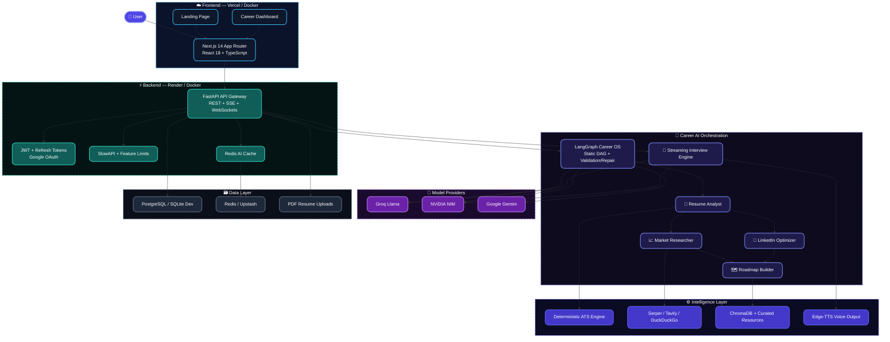

<div align="center">

<br/>

```
 █████╗ ██╗     ██████╗ █████╗ ██████╗ ███████╗███████╗██████╗
██╔══██╗██║    ██╔════╝██╔══██╗██╔══██╗██╔════╝██╔════╝██╔══██╗
███████║██║    ██║     ███████║██████╔╝█████╗  █████╗  ██████╔╝
██╔══██║██║    ██║     ██╔══██║██╔══██╗██╔══╝  ██╔══╝  ██╔══██╗
██║  ██║██║    ╚██████╗██║  ██║██║  ██║███████╗███████╗██║  ██║
╚═╝  ╚═╝╚═╝     ╚═════╝╚═╝  ╚═╝╚═╝  ╚═╝╚══════╝╚══════╝╚═╝  ╚═╝

███╗   ███╗███████╗███╗   ██╗████████╗ ██████╗ ██████╗
████╗ ████║██╔════╝████╗  ██║╚══██╔══╝██╔═══██╗██╔══██╗
██╔████╔██║█████╗  ██╔██╗ ██║   ██║   ██║   ██║██████╔╝
██║╚██╔╝██║██╔══╝  ██║╚██╗██║   ██║   ██║   ██║██╔══██╗
██║ ╚═╝ ██║███████╗██║ ╚████║   ██║   ╚██████╔╝██║  ██║
╚═╝     ╚═╝╚══════╝╚═╝  ╚═══╝   ╚═╝    ╚═════╝ ╚═╝  ╚═╝
```

### ✦ *5 Specialized AI Workflows. One Career Transformation.* ✦

> 🎯 **Resume Analysis** · 🗺️ **Personalized Roadmaps** · 📈 **Live Market Intel** · 🎤 **Streaming Mock Interviews** · 🔐 **Google OAuth**

<br/>

<!-- ══════════ TECH STACK BADGES ══════════ -->


<br/>

<!-- ══════════ ACTION BADGES ══════════ -->

[](https://ai-career-mentor-anil.vercel.app)
[](https://ai-career-mentor-rrpu.onrender.com/docs)
[](https://microsoft.com)
[](https://devpost.com)

[](LICENSE)
[](https://github.com/Anil-Pradhan-web/ai-career-mentor/commits)
[](https://github.com/Anil-Pradhan-web)

</div>

---

## 🧭 Table of Contents

- [What is AI Career Mentor?](#-what-is-ai-career-mentor)
- [Key Numbers at a Glance](#-key-numbers-at-a-glance)
- [System Architecture](#-system-architecture)
  - [Pipeline Board](#-pipeline-board)
  - [Mermaid Architecture](#-detailed-mermaid-architecture)
  - [Request Lifecycle](#-request-lifecycle--full-career-analysis)
- [Core Features](#-core-features)
- [The 5 AI Workflows](#-the-5-ai-workflows)
- [Hybrid Semantic RAG Engine](#-hybrid-semantic-rag-engine)
- [Dynamic Model Selector & Fallbacks](#-dynamic-model-selector--fallback-systems)
- [Tech Stack](#-tech-stack)
- [Local Setup](#-local-setup)
- [API Reference](#-api-reference)
- [Project Structure](#-project-structure)
- [CI/CD & Production Hardening](#-cicd-pipeline--hardening)
- [Deployment](#-deployment)
- [Hackathon Submissions](#-hackathon-submissions)
- [Upgrade Roadmap](#-upgrade-roadmap)

---

## 🎯 What is AI Career Mentor?

**AI Career Mentor** is a production-grade, full-stack career coaching platform that takes developers and students from career confusion to a concrete execution plan — all in one polished dashboard.

Most developers spend months wondering:

| ❓ Question | ✅ What We Do |
|---|---|
| 📚 *What should I learn next?* | 8-week personalized roadmap with curated resources |
| 🏢 *Where should I apply?* | Live market research with salary + hiring signals |
| 🎤 *How do I ace the interview?* | Adaptive streaming mock interviews with scoring |
| 🔎 *Which skills are in demand?* | Role + location + seniority-aware market intelligence |
| 🧾 *Why isn't my resume converting?* | ATS scoring with keyword, verb, and format breakdown |

> 🧑‍💻 **Solo-built** — backend, frontend, agent orchestration, Google OAuth, RAG, Docker, CI/CD, and production infrastructure, all by one developer.
> ⏱️ **5–6 months** from concept to fully deployed MVP.
> 📝 **130+ commits** of iterative design, production hardening, and feature delivery.

---

## 📊 Key Numbers at a Glance

<table>
<tr>
<td>

| Metric | Value |
|--------|-------|
| 🤖 AI Workflows | **5 core workflows** |
| 🔗 Full Analysis Graph | **Resume → Market + LinkedIn → Roadmap** |
| 🗺️ Roadmap Length | **8 weeks** with projects + resources |
| 🎤 Interview Flow | **7 adaptive questions** + final scorecard |
| 🚦 Rate Limits | **100 req/hr · 1000 req/day** |

</td>
<td>

| Metric | Value |
|--------|-------|
| 🧠 LLM Providers | **Groq · NVIDIA NIM · Gemini** |
| 🔄 Fallbacks | **Provider chain + circuit breaker** |
| 🗄️ DB Pool | `pool_size=3`, `max_overflow=5` |
| ⚡ Cache | **SHA-256 keyed Redis** |
| 🏆 Hackathon Prize Pool | **$175,000+** |

</td>
</tr>
</table>

---

## 🏗️ System Architecture

### 🧩 Pipeline Board

> Full product pipeline — from user action to AI orchestration, storage, fallback, and final output.

```
┌─────────────────────────────────────────────────────────────────────────────┐
│                    AI CAREER MENTOR  —  SYSTEM PIPELINE                     │
├─────────────────────────────────────────────────────────────────────────────┤
│                                                                             │
│  👤 User Input                                                              │
│     Resume PDF  +  Target Role  +  Location  +  Preferred LLM Provider     │
│           │                                                                 │
│           ▼                                                                 │
│  ┌─────────────────────────────────────────────────────────────────────┐   │
│  │  🖥️  Next.js 14 Dashboard                                           │   │
│  │  Auth Pages · Full Analysis Wizard · Market Explorer · Interview UI │   │
│  └──────────────────────────────┬──────────────────────────────────────┘   │
│                                 │                                           │
│                                 ▼                                           │
│  ┌─────────────────────────────────────────────────────────────────────┐   │
│  │  ⚡ FastAPI Gateway                                                  │   │
│  │  JWT / Google OAuth  ·  Rate Limit  ·  Cache Check  ·  Validation   │   │
│  └──────┬──────────────────┬──────────────────────┬─────────────────────┘  │
│         │                  │                      │                         │
│         ▼                  ▼                      ▼                         │
│   🗄️ PostgreSQL      ⚡ Redis Cache       🧠 LangGraph Career OS           │
│                                                   │                         │
│                              ┌────────────────────┤                         │
│                              │                    │                         │
│                    📄 Resume Analyst     ┌─────────────────┐               │
│                              │           │   Run Parallel  │               │
│                              │    📈 Market Researcher     │               │
│                              │    🔗 LinkedIn Optimizer    │               │
│                              │           └────────┬────────┘               │
│                              └──────────┬─────────┘                        │
│                                         ▼                                   │
│                               🗺️ Roadmap Aggregator                        │
│                                         │                                   │
│                                         ▼                                   │
│  ┌─────────────────────────────────────────────────────────────────────┐   │
│  │  ⚙️  Intelligence Engines                                            │   │
│  │  ATS Engine · Market Service · Search APIs · ChromaDB RAG · TTS     │   │
│  └──────────────────────────────┬──────────────────────────────────────┘   │
│                                 │                                           │
│                                 ▼                                           │
│  ┌─────────────────────────────────────────────────────────────────────┐   │
│  │  🤖 Provider Router                                                  │   │
│  │  Groq  ⇄  NVIDIA NIM  ⇄  Google Gemini  +  circuit breaker          │   │
│  └──────────────────────────────┬──────────────────────────────────────┘   │
│                                 │                                           │
│                                 ▼                                           │
│  ✅ ATS Score  ·  ✅ Market Insights  ·  ✅ 8-Week Roadmap                │
│  ✅ LinkedIn Plan  ·  ✅ Interview Scorecard                               │
│                                                                             │
└─────────────────────────────────────────────────────────────────────────────┘
```

### 🗺️ Detailed Mermaid Architecture


```mermaid
flowchart TD
    User(["👤 User"])

    subgraph Frontend ["☁️ Frontend — Vercel / Docker"]
        Landing["Landing Page"]
        Dashboard["Career Dashboard"]
        NextJS["Next.js 14 App Router\nReact 18 + TypeScript"]
    end

    subgraph Backend ["⚡ Backend — Render / Docker"]
        API["FastAPI API Gateway\nREST + SSE + WebSockets"]
        Auth["JWT + Refresh Tokens\nGoogle OAuth"]
        RateLimit["SlowAPI + Feature Limits"]
        Cache["Redis AI Cache"]
    end

    subgraph Orchestration ["🧠 Career AI Orchestration"]
        Graph["LangGraph Career OS\nStatic DAG + Validation/Repair"]
        Resume["📄 Resume Analyst"]
        Market["📈 Market Researcher"]
        LinkedIn["🔗 LinkedIn Optimizer"]
        Roadmap["🗺️ Roadmap Builder"]
        Interview["🎤 Streaming Interview Engine"]
    end

    subgraph Intelligence ["⚙️ Intelligence Layer"]
        ATS["Deterministic ATS Engine"]
        Search["Serper / Tavily / DuckDuckGo"]
        RAG["ChromaDB + Curated Resources"]
        Voice["Edge-TTS Voice Output"]
    end

    subgraph Providers ["🤖 Model Providers"]
        Groq["Groq Llama"]
        NVIDIA["NVIDIA NIM"]
        Gemini["Google Gemini"]
    end

    subgraph Data ["🗃️ Data Layer"]
        Postgres["PostgreSQL / SQLite Dev"]
        Redis["Redis / Upstash"]
        Files["PDF Resume Uploads"]
    end

    User --> NextJS
    Landing --> NextJS
    Dashboard --> NextJS
    NextJS --> API
    API --> Auth
    API --> RateLimit
    API --> Cache
    API --> Graph
    API --> Interview
    Graph --> Resume
    Resume --> Market
    Resume --> LinkedIn
    Market --> Roadmap
    LinkedIn --> Roadmap
    Resume --> ATS
    Market --> Search
    Roadmap --> RAG
    Interview --> Voice
    Graph --> Groq
    Graph --> NVIDIA
    Graph --> Gemini
    Interview --> Groq
    Interview --> NVIDIA
    API --> Postgres
    Cache --> Redis
    API --> Files

    classDef userStyle fill:#4F46E5,stroke:#818CF8,stroke-width:2px,color:#fff,rx:10px,ry:10px;
    classDef frontStyle fill:#0F172A,stroke:#38BDF8,stroke-width:2px,color:#fff,rx:12px,ry:12px;
    classDef backStyle fill:#115E59,stroke:#2DD4BF,stroke-width:2px,color:#fff,rx:12px,ry:12px;
    classDef orchStyle fill:#1E1B4B,stroke:#818CF8,stroke-width:2px,color:#fff,rx:12px,ry:12px;
    classDef intelStyle fill:#4338CA,stroke:#6366F1,stroke-width:2px,color:#fff,rx:12px,ry:12px;
    classDef provStyle fill:#6B21A8,stroke:#C084FC,stroke-width:2px,color:#fff,rx:12px,ry:12px;
    classDef dataStyle fill:#1E293B,stroke:#64748B,stroke-width:2px,color:#fff,rx:12px,ry:12px;

    class User userStyle;
    class Landing,Dashboard,NextJS frontStyle;
    class API,Auth,RateLimit,Cache backStyle;
    class Graph,Resume,Market,LinkedIn,Roadmap,Interview orchStyle;
    class ATS,Search,RAG,Voice intelStyle;
    class Groq,NVIDIA,Gemini provStyle;
    class Postgres,Redis,Files dataStyle;
    
    style Frontend fill:#0B132B,stroke:#38BDF8,stroke-width:2px,stroke-dasharray: 5 5,color:#fff
    style Backend fill:#041414,stroke:#2DD4BF,stroke-width:2px,stroke-dasharray: 5 5,color:#fff
    style Orchestration fill:#0E0B1F,stroke:#818CF8,stroke-width:2px,stroke-dasharray: 5 5,color:#fff
    style Intelligence fill:#0B0B24,stroke:#6366F1,stroke-width:2px,stroke-dasharray: 5 5,color:#fff
    style Providers fill:#1A0B2E,stroke:#C084FC,stroke-width:2px,stroke-dasharray: 5 5,color:#fff
    style Data fill:#0B0F19,stroke:#64748B,stroke-width:2px,stroke-dasharray: 5 5,color:#fff
```

### 🔄 Request Lifecycle — Full Career Analysis

```
  Step 1  →  User uploads resume PDF; target role + location sent
  Step 2  →  Rate limit check + SHA-256 cache lookup
  Step 3  →  Resume node runs: deterministic ATS + LLM enhancement
  Step 4  →  Market + LinkedIn nodes fan out in parallel
  Step 5  →  Roadmap node aggregates skill gaps + trends + LinkedIn data
  Step 6  →  Pydantic validation / repair layer catches malformed output
  Step 7  →  Result cached, usage incremented, activity logged
```

---

## ✨ Core Features

### 📄 Resume Intelligence

- PDF upload with plain-text extraction
- ATS scoring: keywords, action verbs, achievements, formatting
- Skills extraction: technical, soft, strengths, gaps, experience estimate
- Cached analysis to minimize duplicate model calls

### 🗺️ Personalized Roadmap Generator

- 8-week learning plan based on role + skill gaps
- Weekly topics, estimated hours, mini-projects, success criteria, resource lists
- Real enrichment via curated data, search APIs, and RAG similarity matching
- Roadmap history, delete support, and dashboard progress tracking

### 📈 Live Market Explorer

- Role, location, seniority-aware market research
- Salary range, market trend, hiring volume, remote signal, top skills, top companies
- Historical salary and hiring data visualized with dashboard charts
- Serper / Tavily support with deterministic fallback logic

### 🔗 LinkedIn Optimizer

- Target-role-specific headline ideas
- About-section rewrite strategy
- High-demand skills, ATS keywords, recruiter search trends, certifications
- Available standalone and inside the full-analysis workflow

### 🎤 Adaptive Mock Interviews

- WebSocket-based real-time interview experience
- Company and interview-type aware flow
- Adaptive questions, chat history, final score + feedback
- Interview history, detail view, and delete support
- Edge-TTS integration for natural voice output

### 📊 Career Dashboard

- Usage cards: resume, roadmap, interview, market, LinkedIn, full-analysis
- Activity timeline from persisted user logs
- Skill radar from latest resume analysis
- Weekly activity chart and primary-goal progress tracking

### 🔐 Auth & User System

- Email/password registration + login
- Google OAuth login
- JWT access token + refresh token flow
- Automatic frontend token refresh + session-expiry handling

---

## 🧠 The 5 AI Workflows

| # | Workflow | What it does | Implementation |
|---|----------|--------------|----------------|
| 1️⃣ | **Resume Analyst** | Extracts skills, gaps, strengths, experience, ATS score | Deterministic ATS engine + LLM polish + Pydantic validation |
| 2️⃣ | **Market Researcher** | Salary, hiring, trend, company, and skill-demand insights | Market service + search APIs + LLM summary |
| 3️⃣ | **Career Coach / Roadmap** | 8-week role-specific execution plan | LangGraph aggregation + batched LLM calls + RAG enrichment |
| 4️⃣ | **LinkedIn Reviewer** | Profile positioning for recruiter search | Standalone optimizer + full-analysis node |
| 5️⃣ | **Mock Interviewer** | Real-time adaptive interview sessions | FastAPI WebSocket + direct model streaming + persisted history |

> The full-analysis workflow is powered by a **LangGraph static DAG** with parallel fan-out/fan-in, orchestrating specialized sub-agents with strict output parsing and validation.

---

## 🧬 Hybrid Semantic RAG Engine

The roadmap generator enriches each week with real learning resources through a hybrid retrieval pipeline:

```
┌─────────────────────────────────────────────────────────┐
│               Hybrid RAG Architecture                   │
├─────────────────────────────────────────────────────────┤
│                                                         │
│  1. Curated Knowledge Base                              │
│     curated_resources.json                              │
│     YouTube · Articles · GitHub · Docs                  │
│                  │                                      │
│                  ▼                                      │
│  2. ChromaDB Persistent Vector Store                    │
│     Auto-seeded at backend startup                      │
│                  │                                      │
│                  ▼                                      │
│  3. In-Memory Keyword Fallback                          │
│     Keeps enrichment live even if ChromaDB is down      │
│                  │                                      │
│                  ▼                                      │
│  4. Deduplication + Normalization                       │
│     Organized into: YouTube · Articles · GitHub · Docs  │
│                                                         │
└─────────────────────────────────────────────────────────┘
```

---

## ⚡ Dynamic Model Selector & Fallback Systems

```
┌─────────────────────────────────────────────────────────────┐
│  Frontend Model Preference                                  │
│  User selects provider in settings → passed into all calls  │
├─────────────────────────────────────────────────────────────┤
│  Provider Routing                                           │
│                                                             │
│  🟠 Groq        →  llama-3.3-70b-versatile (recommended)   │
│  🟢 NVIDIA NIM  →  meta/llama-3.3-70b-instruct             │
│  🔵 Gemini      →  gemini-2.5-flash-lite                   │
├─────────────────────────────────────────────────────────────┤
│  Automatic Fallbacks                                        │
│  Selected provider fails → fallback chain activates        │
│  Malformed output → deterministic fallback engines step in  │
│  Repeated failures → circuit breaker disables provider     │
├─────────────────────────────────────────────────────────────┤
│  Caching + Rate Limiting                                    │
│  Full-analysis: SHA-256 fingerprinted + Redis cached       │
│  Global: SlowAPI 100 req/hr · 1000 req/day                 │
│  Feature-level daily caps enforced per user                 │
└─────────────────────────────────────────────────────────────┘
```

---

## 🧱 Tech Stack

### 🖥️ Frontend

| Technology | Purpose |
|-----------|---------|
| **Next.js 14 App Router** | Full-stack React with route-level pages and layouts |
| **React 18 + TypeScript** | Typed UI components and client-side state |
| **Vanilla CSS + Tailwind config** | Custom visual system + utility support |
| **@react-oauth/google** | Google OAuth 2.0 login flow |
| **Axios** | API client with auth and refresh-token interceptors |
| **Recharts** | Dashboard charts and market visualizations |
| **Lucide React** | Icon system |
| **react-hot-toast** | Toast notifications |
| **Monaco Editor** | Rich code/editor-ready dependency for advanced UI |

### ⚡ Backend

| Technology | Purpose |
|-----------|---------|
| **FastAPI** | Async REST API, SSE streaming, WebSocket interviews |
| **LangGraph** | Full-analysis orchestration graph |
| **OpenAI SDK** | OpenAI-compatible calls for Groq/NVIDIA streaming |
| **Google Generative AI** | Gemini fallback and Google model execution |
| **SQLAlchemy + Alembic** | ORM and database migrations |
| **PostgreSQL / SQLite** | Production and local persistence |
| **Redis + SlowAPI** | Rate limiting and cache storage |
| **ChromaDB** | Persistent vector database for resource RAG |
| **pdfplumber** | PDF resume parsing |
| **Serper / Tavily / DuckDuckGo** | Market and resource search |
| **edge-tts** | Voice synthesis for interviews |
| **Pytest** | Backend test coverage |

### 🚀 DevOps & Infrastructure

| Tool | Purpose |
|------|---------|
| **Docker + Docker Compose** | Local and production container workflows |
| **Render** | Backend deployment |
| **Vercel** | Frontend deployment |
| **Neon Postgres** | Serverless production database |
| **Upstash Redis** | Serverless Redis for cache/rate limits |
| **GitHub Actions** | CI, Render deployment hook, Docker image publishing |

---

## 🚀 Local Setup

### Prerequisites

- 🐍 Python **3.11+**
- 🟢 Node.js **18+** / npm
- 🔑 Groq, NVIDIA, or Google Gemini API key
- 🔐 Google OAuth Client ID
- 🔧 Optional: Redis, Serper, Tavily, Docker

### 1. Clone the Repository

```bash
git clone https://github.com/Anil-Pradhan-web/ai-career-mentor.git
cd ai-career-mentor
```

### 2. Backend Setup

```bash
cd backend
python -m venv venv

# Windows
venv\Scripts\activate

# macOS/Linux
source venv/bin/activate

pip install -r requirements.txt
cp .env.example .env
```

Update `backend/.env`:

```env
# ── LLM Configuration ──────────────────────────────────────────
LLM_PROVIDER=groq
GROQ_API_KEY=your_groq_api_key_here
GROQ_MODEL=llama-3.3-70b-versatile
NVIDIA_API_KEY=your_nvidia_nim_key_here
NVIDIA_MODEL=meta/llama-3.3-70b-instruct
GOOGLE_API_KEY=your_google_api_key_here
GOOGLE_MODEL=gemini-2.5-flash

# ── Search APIs ────────────────────────────────────────────────
SERPER_API_KEY=your_serper_api_key_here
TAVILY_API_KEY=your_tavily_api_key_here

# ── Database ───────────────────────────────────────────────────
DATABASE_URL=sqlite:///./dev.db

# ── Auth ───────────────────────────────────────────────────────
SECRET_KEY=your_super_secret_jwt_key_here
ACCESS_TOKEN_EXPIRE_MINUTES=60
REFRESH_TOKEN_EXPIRE_DAYS=30
GOOGLE_CLIENT_ID=your_google_client_id.apps.googleusercontent.com

# ── Redis / App ────────────────────────────────────────────────
REDIS_URL=redis://localhost:6379/0
APP_ENV=development
CORS_ORIGINS=http://localhost:3000
```

Start the backend:

```bash
uvicorn app.main:app --reload
```

| Endpoint | URL |
|---|---|
| API Root | `http://localhost:8000` |
| Swagger Docs | `http://localhost:8000/docs` |
| Health Check | `http://localhost:8000/health` |

### 3. Frontend Setup

```bash
cd frontend
npm install
```

Create `frontend/.env.local`:

```env
NEXT_PUBLIC_API_URL=http://localhost:8000
NEXT_PUBLIC_GOOGLE_CLIENT_ID=your_google_client_id.apps.googleusercontent.com
```

```bash
npm run dev
# Runs at http://localhost:3000
```

### 4. Docker Setup

```bash
# Development stack
docker compose up --build

# Production override
docker compose -f docker-compose.yml -f docker-compose.prod.yml up --build
```

---

## 📡 API Reference

| Method | Endpoint | Auth | Description |
|--------|----------|:----:|-------------|
| `GET` | `/` | — | API welcome payload |
| `GET` | `/health` | — | System health, DB status, provider, model, timestamp |
| `GET` | `/ping` | — | Ultra-lightweight keep-alive |
| `POST` | `/auth/register` | — | Email/password registration |
| `POST` | `/auth/login` | — | Login → JWT + refresh token |
| `POST` | `/auth/google` | — | Google OAuth credential login |
| `POST` | `/auth/refresh` | — | Refresh access token |
| `GET` | `/user/stats` | 🔒 | Dashboard stats, histories, usage, activity |
| `POST` | `/resume/upload` | 🔒 | Upload PDF + extract text preview |
| `POST` | `/resume/analyze` | 🔒 | Resume ATS + AI analysis |
| `POST` | `/roadmap/generate` | 🔒 | Generate resource-enriched 8-week roadmap |
| `GET` | `/roadmap/history` | 🔒 | Fetch saved roadmap history |
| `DELETE` | `/roadmap/{id}` | 🔒 | Delete a roadmap |
| `GET` | `/market/config` | 🔒 | Fetch market form config |
| `GET` | `/market/trends` | 🔒 | Role/location/seniority market trends |
| `POST` | `/linkedin/optimize` | 🔒 | LinkedIn profile optimization strategy |
| `POST` | `/career/full-analysis` | 🔒 | Full coordinated career analysis |
| `POST` | `/career/full-analysis/stream` | 🔒 | SSE streaming full-analysis |
| `WS` | `/interview/ws/{session_id}` | 🔒 | Streaming mock interview socket |
| `GET` | `/interview/history` | 🔒 | Interview session history |
| `GET` | `/interview/{id}` | 🔒 | Interview session details |
| `DELETE` | `/interview/{id}` | 🔒 | Delete interview session |

---

## 📁 Project Structure

```
ai-career-mentor/
│
├── 📁 .github/workflows/           # CI · Render deploy hook · Docker publish
├── 📁 assets/
│   └── banner.png
│
├── 📁 backend/
│   ├── 📁 alembic/                 # DB migrations
│   ├── 📁 app/
│   │   ├── 📁 agents/
│   │   │   ├── registry.py         # Provider calls, agent factories, fallbacks
│   │   │   └── workflow.py         # Career OS graph orchestration
│   │   ├── 📁 api/
│   │   │   ├── auth.py             # Email/password, refresh token, Google OAuth
│   │   │   ├── career.py           # Full analysis + streaming analysis
│   │   │   ├── interview.py        # WebSocket interview engine + history
│   │   │   ├── linkedin.py         # LinkedIn optimizer
│   │   │   ├── market.py           # Market explorer
│   │   │   ├── resume.py           # PDF upload + resume analysis
│   │   │   ├── roadmap.py          # Roadmap generation + history
│   │   │   └── user.py             # Dashboard stats
│   │   ├── 📁 core/
│   │   │   ├── market/service.py   # Unified market intelligence service
│   │   │   ├── activity.py         # User activity logging
│   │   │   ├── ats_engine.py       # Deterministic resume scoring
│   │   │   ├── cache.py            # Redis response cache
│   │   │   ├── config.py           # Env + provider config
│   │   │   ├── database.py         # SQLAlchemy engine/session
│   │   │   ├── rag_service.py      # ChromaDB + in-memory RAG
│   │   │   ├── rate_limit.py       # Feature usage controls
│   │   │   ├── search_engine.py    # Resource/search enrichment
│   │   │   ├── security.py         # Password hashing + JWT utils
│   │   │   └── voice_engine.py     # Edge-TTS voice generation
│   │   ├── 📁 data/                # Curated roadmap resources
│   │   └── 📁 models/              # SQLAlchemy models, schemas, validation
│   ├── 📁 tests/
│   ├── Dockerfile
│   ├── requirements.txt
│   └── .env.example
│
├── 📁 frontend/
│   ├── 📁 public/                  # Brand SVGs + static assets
│   ├── 📁 src/
│   │   ├── 📁 app/                 # Next.js 14 App Router pages
│   │   │   ├── 📁 dashboard/       # Resume · Roadmap · Market · Interview
│   │   │   ├── 📁 login/
│   │   │   └── 📁 register/
│   │   ├── 📁 components/
│   │   │   ├── 📁 auth/            # Auth cards, inputs, buttons
│   │   │   ├── 📁 charts/          # Recharts-based charts
│   │   │   ├── 📁 full-analysis/   # Career OS panels and logs
│   │   │   ├── 📁 interview/       # Interview wizard, chat, history
│   │   │   └── 📁 landing/         # Marketing landing sections
│   │   ├── 📁 hooks/               # Shared hooks
│   │   ├── 📁 services/            # Axios client + API wrappers
│   │   └── 📁 types/               # TypeScript interfaces
│   ├── Dockerfile
│   ├── next.config.js
│   └── package.json
│
├── docker-compose.yml
├── docker-compose.prod.yml
├── render.yaml
├── DOCKER_GUIDE.md
└── README.md
```

---

## 🔄 CI/CD Pipeline & Hardening

### GitHub Actions

| Workflow | Trigger | Steps |
|---|---|---|
| **CI** | Every push | Frontend: `npm ci` → lint → build · Backend: install → pytest → pip-audit |
| **Backend Deploy** | Push to `main` (backend files) | Render deploy hook |
| **Docker Publish** | Push to `main` | Build + publish backend + frontend images to GHCR |

### Production Hardening Checklist

```
✅  CORS allow-listing via CORS_ORIGINS (no wildcards in production)
✅  Production rejects SQLite, default secrets, missing search API keys
✅  Postgres pool: pool_pre_ping + pool_recycle + small pool_size
✅  Redis-aware rate limiting (memory fallback in dev)
✅  WebSocket cleanup guards for disconnected interview sessions
✅  SHA-256 keyed Redis cache for full-analysis results
✅  Pydantic validation/repair loops catch malformed LLM outputs
✅  Container-ready: Dockerfile + Docker Compose for local + production
```

---

## 🌐 Deployment

### Live Production

| Component | Platform | URL |
|-----------|----------|-----|
| 🖥️ **Frontend** | Vercel | [ai-career-mentor-anil.vercel.app](https://ai-career-mentor-anil.vercel.app) |
| ⚡ **Backend API** | Render.com | [ai-career-mentor-rrpu.onrender.com/docs](https://ai-career-mentor-rrpu.onrender.com/docs) |
| 🗄️ **Database** | Neon Postgres | Serverless production persistence |
| ⚡ **Cache / Rate Limit** | Upstash Redis | Serverless cache + rate-limit storage |
| 🐳 **Container Images** | GitHub Container Registry | Backend + frontend publishing workflow |

### Production Environment Checklist

```bash
APP_ENV=production                              # ✅ Required
DATABASE_URL=<postgres_url>                     # ✅ Not SQLite!
SECRET_KEY=<strong_random_key>                  # ✅ Not the default
SERPER_API_KEY or TAVILY_API_KEY=<key>          # ✅ At least one search provider
GROQ_API_KEY or NVIDIA_API_KEY or GOOGLE_API_KEY  # ✅ At least one LLM provider
CORS_ORIGINS=https://your-frontend-domain.com   # ✅ Production frontend
NEXT_PUBLIC_API_URL=https://your-backend.com    # ✅ Deployed backend URL
NEXT_PUBLIC_GOOGLE_CLIENT_ID=<id>.googleusercontent.com  # ✅ OAuth console match
```

---

## 🏆 Hackathon Submissions

<table>
<tr>
<td width="50%">

### 🔵 Microsoft AI DevDays

| | |
|---|---|
| 💰 Prize Pool | **$80,000+** |
| 📅 Submitted | April 12, 2026 ✅ |
| ✅ LangGraph / Agentic AI | Satisfied |
| ✅ Deployed MVP | Satisfied |
| ✅ Public Repo | Satisfied |

</td>
<td width="50%">

### 🟠 Amazon Nova AI

| | |
|---|---|
| 💰 Prize Pool | **$40K cash + $55K AWS Credits** |
| 📅 Submitted | April 12, 2026 ✅ |
| ✅ Multi-agent career workflow | Satisfied |
| ✅ Edge-TTS voice | Satisfied |
| ✅ Full-stack deployed MVP | Satisfied |

</td>
</tr>
</table>

---

## 🗺️ Upgrade Roadmap

### ✅ Shipped

| Feature | Status |
|---------|--------|
| Google OAuth 2.0 | ✅ Shipped |
| Email/password auth with JWT + refresh tokens | ✅ Shipped |
| Responsive Landing + Dashboard UI | ✅ Shipped |
| Resume PDF Upload + ATS Analysis | ✅ Shipped |
| Roadmap Generator with RAG Resources | ✅ Shipped |
| Market Explorer with Charts | ✅ Shipped |
| LinkedIn Optimizer | ✅ Shipped |
| Full Career Analysis Graph | ✅ Shipped |
| SSE Streaming Full Analysis Endpoint | ✅ Shipped |
| WebSocket Mock Interviews | ✅ Shipped |
| Interview History + Delete | ✅ Shipped |
| Roadmap History + Delete | ✅ Shipped |
| Redis Rate Limiter + AI Response Cache | ✅ Shipped |
| Neon/Postgres Connection Pooling | ✅ Shipped |
| Dynamic Provider Selector | ✅ Shipped |
| Groq / NVIDIA / Gemini Provider Support | ✅ Shipped |
| Hybrid Semantic RAG Engine | ✅ Shipped |
| Docker + Docker Compose | ✅ Shipped |
| GitHub Actions CI + Docker Publish | ✅ Shipped |
| Render Deploy Hook Workflow | ✅ Shipped |

### 🔜 Planned

| Feature | Status |
|---------|--------|
| httpOnly Cookie Auth | 🔜 Planned |
| Email Verification (Resend) | 🔜 Planned |
| Admin Analytics Panel | 🔜 Planned |
| Interview Voice Input | 🔜 Planned |

---

## 👤 Built By

<div align="center">

| Name | Role |
|------|------|
| **[Anil Pradhan](https://github.com/Anil-Pradhan-web)** | Solo Full-Stack Developer |

*Every line of backend, frontend, orchestration, Google OAuth, RAG engines, cloud infrastructure, Docker workflow, and UI/UX — built solo over 5–6 months across 130+ commits.*

<br/>

**Built with 🧠 by [Anil Pradhan](https://github.com/Anil-Pradhan-web)**

<br/>

`#LangGraph` `#MultiAgent` `#NVIDIANIM` `#GoogleOAuth` `#RAG` `#ChromaDB` `#FastAPI` `#NextJS` `#AgenticAI` `#Groq` `#Gemini` `#WebSocket`

</div>
