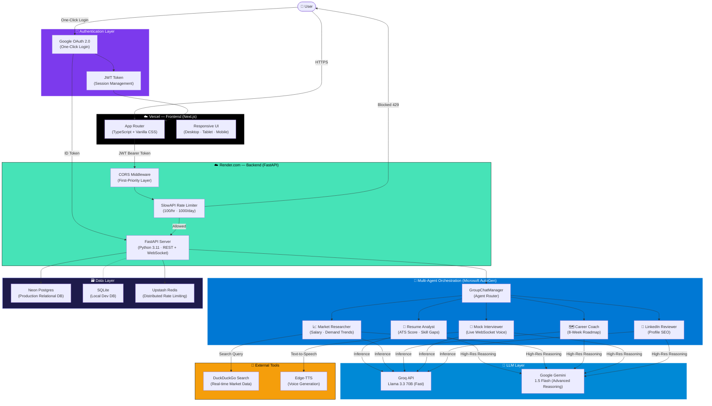

<div align="center">

# 🤖 AI Career Mentor

### 🌟 *Your Personal AI Career Coach — 5 Intelligent Agents Working 24/7 for Your Success*

**📄 Resume Analysis** · **🗺️ Personalized Roadmaps** · **📈 Live Market Intelligence** · **🎤 AI Mock Interviews** · **🔐 Google OAuth**

---


---

[](https://ai-career-mentor-anil.vercel.app)
[](https://ai-career-mentor-rrpu.onrender.com/docs)
[](https://microsoft.com)
[](https://devpost.com)
[](LICENSE)

</div>

---

## 📌 What is AI Career Mentor?

**AI Career Mentor** is a full-stack, production-grade career coaching platform that uses a **5-agent AI system** to give developers and students a complete, personalised career acceleration plan — in under 60 seconds.

Most developers spend months trying to figure out what to learn, where to apply, and how to prepare for interviews. We solve all three — simultaneously — with AI agents that collaborate the same way a team of human experts would.

> 👋 **Built solo by a developer** — every line of backend, frontend, AI agents, Google OAuth, and cloud deployment done by one person.
>⏱️ **Development Duration:** 5-6 months+ from concept to deployed product.
>🧾 **Commit Count:** 109 commits of iterative design, implementation, and testing.

---

## ✨ Core Features

| Feature | What it does |
|---------|-------------|
| 🔐 **Google OAuth 2.0** | One-click login/register via Google — no password required |
| 📄 **Resume Analyzer** | Uploads PDF, scores sections, calculates **ATS Score**, flags skill gaps |
| 📊 **Persistent Dashboard** | Real-time **Skill Radar**, **Day Streaks**, **Weekly Activity** tracking |
| 🎤 **Mock Interview Coach** | Live AI interview via WebSocket + voice feedback via **Edge-TTS** |
| 🗺️ **Learning Roadmap** | Generates 8-week plans with resources and history management |
| 📈 **Market Intelligence** | Real-time salary ranges and hiring trends via DuckDuckGo |
| 🔗 **LinkedIn Reviewer** | AI profile optimization and recruiter SEO scoring |
| ⚡ **Dual LLM Engines** | Toggle between **Groq** (Speed) and **Google Gemini** (Reasoning) |
| 🛡️ **Rate Limiter & Cache** | Daily limits + **Global AI Response Caching** via **Upstash Redis** |
| 📱 **Fully Responsive** | Optimized for desktop, tablet, and mobile with bottom nav |

---

## 🏗️ System Architecture & Design

Our system follows a modern, decoupled microservices architecture with a dedicated Multi-Agent Orchestration layer.


```mermaid
flowchart TD
    User(["👤 User"])

    subgraph Auth ["🔐 Authentication Layer"]
        GOOGLE["Google OAuth 2.0\n(One-Click Login)"]
        JWT["JWT Token\n(Session Management)"]
    end

    subgraph Vercel ["☁️ Vercel — Frontend (Next.js)"]
        FE["App Router\n(TypeScript + Vanilla CSS)"]
        RESP["Responsive UI\n(Desktop · Tablet · Mobile)"]
    end

    subgraph Render ["☁️ Render.com — Backend (FastAPI)"]
        CORS["CORS Middleware\n(First-Priority Layer)"]
        RATE["SlowAPI Rate Limiter\n(100/hr · 1000/day)"]
        API["FastAPI Server\n(Python 3.11 · REST + WebSocket)"]
    end

    subgraph Agents ["🧠 Multi-Agent Orchestration (Microsoft AutoGen)"]
        ORCH["GroupChatManager\n(Agent Router)"]
        A1["📄 Resume Analyst\n(ATS Score · Skill Gaps)"]
        A2["📈 Market Researcher\n(Salary · Demand Trends)"]
        A3["🗺️ Career Coach\n(8-Week Roadmap)"]
        A4["🎤 Mock Interviewer\n(Live WebSocket Voice)"]
        A5["🔗 LinkedIn Reviewer\n(Profile SEO)"]
    end

    subgraph LLM ["🤖 LLM Layer"]
        GROQ["Groq API\nLlama 3.3 70B (Fast)"]
        GOOGLE_AI["Google Gemini\n1.5 Flash (Advanced Reasoning)"]
    end

    subgraph Tools ["🔧 External Tools"]
        DDG["DuckDuckGo Search\n(Real-time Market Data)"]
        TTS["Edge-TTS\n(Voice Generation)"]
    end

    subgraph DB ["🗃️ Data Layer"]
        POSTGRES["Neon Postgres\n(Production Relational DB)"]
        SQLITE["SQLite\n(Local Dev DB)"]
        REDIS["Upstash Redis\n(Distributed Rate Limiting)"]
    end

    User -->|"HTTPS"| FE
    User -->|"One-Click Login"| GOOGLE
    GOOGLE -->|"ID Token"| API
    FE -->|"JWT Bearer Token"| CORS
    CORS --> RATE
    RATE -->|"Allowed"| API
    RATE -->|"Blocked 429"| User
    API --> ORCH
    ORCH --> A1 & A2 & A3 & A4 & A5
    A1 & A2 & A3 & A4 & A5 -->|"Inference"| GROQ
    A1 & A2 & A3 & A4 & A5 -->|"High-Res Reasoning"| GOOGLE_AI
    A2 -->|"Search Query"| DDG
    A4 -->|"Text-to-Speech"| TTS
    API --> POSTGRES
    API -.- SQLITE
    API --> REDIS
    GOOGLE --> JWT
    JWT --> FE

    style Vercel fill:#000,stroke:#fff,color:#fff
    style Render fill:#46E3B7,stroke:#000,color:#000
    style Agents fill:#0078D4,stroke:#fff,color:#fff
    style LLM fill:#0089D6,stroke:#fff,color:#fff
    style DB fill:#1e1b4b,stroke:#818cf8,color:#fff
    style Auth fill:#7c3aed,stroke:#fff,color:#fff
    style Tools fill:#f59e0b,stroke:#000,color:#000
```

### 🔍 System Component Deep Dive

#### 1. Frontend Layer (Next.js on Vercel)
*   **Framework:** Next.js 14 App Router for optimized Server-Side Rendering (SSR) and Client-Side Routing.
*   **Styling:** Pure Vanilla CSS with CSS Variables for a lightweight, dependency-free design system (no Tailwind overhead).
*   **State Management:** React Context + Hooks for global user state and authentication.
*   **Authentication Flow:** Uses `@react-oauth/google` to securely obtain Google ID Tokens, which are sent to the backend for verification and exchanged for a JWT.

#### 2. API Gateway & Security Layer (FastAPI on Render)
*   **Framework:** FastAPI provides high-performance asynchronous request handling.
*   **CORS:** Configured as the outermost middleware to handle browser preflight requests flawlessly.
*   **Rate Limiting:** `SlowAPI` intercepts requests *before* routing. It uses an Upstash Redis backend to enforce global and per-user IP limits (100/hr, 1000/day) to protect LLM resources. Health check endpoints are explicitly exempted.
*   **Auth Middleware:** Custom dependency injection verifies JWT Bearer tokens on protected routes, attaching the authenticated `User` object to the request context.

#### 3. The AutoGen Multi-Agent Engine
The core intelligence of the platform is driven by Microsoft AutoGen v0.2. Instead of a single LLM prompt, we deploy a `GroupChat` consisting of specialized agents:
*   **Orchestrator (`GroupChatManager`):** Routes messages between agents based on a custom `speaker_selection_method`.
*   **Asynchronous Execution:** The FastAPI server triggers the agent workflow asynchronously, allowing long-running multi-agent debates (like the Full Analysis) without blocking the main event loop.
*   **Tool Calling:** The Market Researcher agent is equipped with a registered Python function (`search_job_trends`) that uses DuckDuckGo to pull live data *before* synthesizing its report.

#### 4. Real-time Mock Interviews (WebSockets + TTS)
*   **Connection:** A dedicated FastAPI WebSocket endpoint (`/interview/ws/{id}`) maintains a persistent full-duplex connection with the client.
*   **State Machine:** The Interviewer Agent strictly follows a 7-question state machine (defined in its `system_message`).
*   **Voice Synthesis:** When the agent generates a text response, it is immediately piped into `edge-tts` (running asynchronously). The resulting audio is base64 encoded and streamed back over the WebSocket to be played natively in the browser.

#### 5. Data Persistence Layer
*   **Relational DB (Neon Postgres):** Configured with production-grade **Connection Pooling** for serverless execution. SQLAlchemy ORM maps Python objects to Postgres tables. Alembic handles schema migrations.
*   **Caching/KV (Upstash Redis):** Powers distributed **Rate Limiting** and **Global AI Response Caching** (via SHA-256 hash lookups) to bypass redundant LLM calls, saving API tokens and delivering millisecond response times.
*   **Blob Storage:** Resumes are parsed in-memory using `pdfplumber`. The extracted raw text and the structured JSON AI analysis are persisted in the Postgres database, eliminating the need for an external S3 bucket.

---

## 🛠️ Tech Stack

### Frontend
| Technology | Purpose |
|-----------|---------|
| **Next.js 14** (App Router) | Full-stack React framework |
| **TypeScript** | Type safety |
| **Vanilla CSS** | Custom design system — no Tailwind |
| **@react-oauth/google** | Google OAuth 2.0 integration |
| **Recharts** | Dashboard charts (Radar, Bar, Area) |
| **Lucide React** | Icon library |
| **react-hot-toast** | Toast notifications |
| **axios** | HTTP client |

### Backend
| Technology | Purpose |
|-----------|---------|
| **FastAPI** (Python 3.11) | REST API + WebSocket server |
| **Microsoft AutoGen** (`ag2` v0.7.5) | Multi-agent GroupChat |
| **google-auth** | Google OAuth 2.0 token verification |
| **SQLAlchemy + Alembic** | ORM + migrations |
| **Neon Postgres** | Production database (w/ Pooling) |
| **Upstash Redis** | Rate limiting & Response Caching |
| **SlowAPI** | Request rate limiting middleware |
| **JWT + bcrypt** | Auth + password hashing |
| **pdfplumber** | PDF resume parsing |
| **edge-tts** | Voice feedback for interviews |
| **DuckDuckGo Search** | Real-time market data |
| **Loguru** | Structured logging |

### Infrastructure
| Tool | Purpose |
|------|---------|
| **Vercel** | Frontend hosting |
| **Render.com** | Backend hosting |
| **Neon** | Serverless Postgres |
| **Upstash** | Serverless Redis |
| **GitHub Actions** | CI/CD pipeline |

### AI Providers
| Provider | Model | Environment |
|---------|-------|-------------|
| **Groq** | Llama 3.3 70B | Development (free) |
| **Google Gemini** | Gemini 1.5 Flash | Production (GCP) |

---

## 🚀 Local Setup

### Prerequisites
- Python **3.11+**
- Node.js **18+**
- Groq API key (free at [console.groq.com](https://console.groq.com))

### 1. Clone
```bash
git clone https://github.com/Anil-Pradhan-web/ai-career-mentor.git
cd ai-career-mentor
```

### 2. Backend
```bash
cd backend
python -m venv venv
venv\Scripts\activate        # Windows
source venv/bin/activate     # macOS/Linux
pip install -r requirements.txt
```

**Create `backend/.env`:**
```env
# ── AI Provider ───────────────────────────────────────
LLM_PROVIDER=groq

# ── Groq (FREE) ───────────────────────────────────────
GROQ_API_KEY=your_groq_key_here
GROQ_MODEL=llama-3.3-70b-versatile

# ── Google Gemini (production) ─────────────────────────
GOOGLE_API_KEY=your_google_api_key
GOOGLE_MODEL=gemini-1.5-flash

# ── Database ──────────────────────────────────────────
DATABASE_URL=sqlite:///./dev.db

# ── Auth ──────────────────────────────────────────────
SECRET_KEY=your_super_secret_jwt_key_here
ACCESS_TOKEN_EXPIRE_MINUTES=60
REFRESH_TOKEN_EXPIRE_DAYS=30
APP_ENV=development

# ── Google OAuth ──────────────────────────────────────
GOOGLE_CLIENT_ID=your_google_client_id
GOOGLE_CLIENT_SECRET=your_google_client_secret

# ── Redis (optional for local) ────────────────────────
REDIS_URL=redis://localhost:6379/0
```

```bash
uvicorn app.main:app --reload
# ✅ API: http://localhost:8000
# ✅ Docs: http://localhost:8000/docs
```

### 3. Frontend
```bash
cd frontend
npm install
```

**Create `frontend/.env.local`:**
```env
NEXT_PUBLIC_API_URL=http://localhost:8000
NEXT_PUBLIC_GOOGLE_CLIENT_ID=your_google_client_id
```

```bash
npm run dev
# ✅ Frontend: http://localhost:3000
```

---

## 📡 API Reference

| Method | Endpoint | Auth | Description |
|--------|----------|------|-------------|
| `GET` | `/health` | — | System health + LLM status |
| `POST` | `/auth/register` | — | Email/password registration |
| `POST` | `/auth/login` | — | Login → JWT token |
| `POST` | `/auth/google` | — | Google OAuth → JWT token |
| `GET` | `/user/stats` | ✅ JWT | Dashboard stats + activity |
| `POST` | `/resume/upload` | ✅ JWT | Upload PDF resume |
| `POST` | `/resume/analyze` | ✅ JWT | AI resume scoring |
| `POST` | `/roadmap/generate` | ✅ JWT | 8-week roadmap |
| `GET` | `/market/trends` | ✅ JWT | Real-time job market data |
| `POST` | `/linkedin/review` | ✅ JWT | LinkedIn profile review |
| `WS` | `/interview/ws/{id}` | ✅ JWT | Live mock interview |
| `POST` | `/career/full-analysis` | ✅ JWT | Full 5-agent analysis |

> 📖 Interactive Swagger UI: `http://localhost:8000/docs`

---

## 🧠 How the Multi-Agent System Works

```
User: resume PDF + target role + location
         ↓
FastAPI → AutoGen GroupChat starts
         ↓
GroupChatManager coordinates 5 agents in parallel:
    📄 Resume Analyst    → "ATS: 72/100. Gaps: Docker, K8s"
    📈 Market Researcher → "SDE-2 Bangalore: ₹18-28 LPA"
    🗺️ Career Coach      → "Week 1: Docker fundamentals"
    🔗 LinkedIn Reviewer → "Headline optimization tips"
    🎤 Mock Interviewer  → "Technical questions via voice feedback"
         ↓
All outputs consolidated → returned in < 60 seconds
```

### The 5 AI Agents

| Agent | Output |
|-------|--------|
| **Resume Analyst** | `technical_skills`, `ats_score`, `skill_gaps`, `top_strengths` |
| **Market Researcher** | `salary_range`, `top_skills`, `top_companies`, `market_trend` |
| **Career Coach** | 8-week roadmap with `topic`, `resource_url`, `mini_project` |
| **LinkedIn Reviewer** | `headline_suggestions`, `profile_score`, `key_keywords` |
| **Mock Interviewer** | 7 structured questions → final score `/70` + voice feedback |

---

## 📁 Project Structure

```
ai-career-mentor/
├── backend/
│   ├── app/
│   │   ├── api/
│   │   │   ├── auth.py          # Register, login, Google OAuth
│   │   │   ├── deps.py          # JWT validation & user dependency
│   │   │   ├── resume.py        # PDF upload + AI analysis
│   │   │   ├── roadmap.py       # Roadmap generation
│   │   │   ├── market.py        # Market trends + DuckDuckGo
│   │   │   ├── interview.py     # WebSocket mock interview + TTS
│   │   │   ├── linkedin.py      # LinkedIn profile review
│   │   │   ├── career.py        # Full multi-agent analysis
│   │   │   └── user.py          # User stats + activity log
│   │   ├── agents/
│   │   │   ├── registry.py      # 5 AutoGen agent definitions
│   │   │   └── workflow.py      # GroupChat orchestration
│   │   ├── core/
│   │   │   ├── config.py        # LLM + OAuth config
│   │   │   ├── security.py      # JWT + bcrypt
│   │   │   ├── database.py      # SQLAlchemy connection (Pooling)
│   │   │   ├── rate_limit.py    # Redis rate limiting
│   │   │   ├── cache.py         # Redis AI response caching
│   │   │   ├── voice_engine.py  # Edge-TTS voice synthesis
│   │   │   └── activity.py      # Activity log helpers
│   │   ├── tools/
│   │   │   └── market_search.py # DuckDuckGo dynamic web search
│   │   ├── models/
│   │   │   ├── models.py        # DB models (User, Resume, Roadmap)
│   │   │   └── schemas.py       # Pydantic schemas + GoogleLogin
│   │   └── main.py              # FastAPI app + middleware stack
│   ├── requirements.txt
│   └── .env.example
│
├── frontend/
│   ├── src/
│   │   ├── app/
│   │   │   ├── page.tsx         # Landing page
│   │   │   ├── login/           # Login + Google OAuth button
│   │   │   ├── register/        # Register + Google OAuth button
│   │   │   └── dashboard/
│   │   │       ├── page.tsx     # Main dashboard (responsive grids)
│   │   │       ├── loading.tsx  # Dashboard loading state
│   │   │       ├── resume/      # Resume analyzer
│   │   │       ├── roadmap/     # Career roadmap
│   │   │       ├── market/      # Market trends
│   │   │       ├── interview/   # Mock interview
│   │   │       ├── linkedin/    # LinkedIn reviewer
│   │   │       ├── full-analysis/ # Multi-agent complete scan
│   │   │       └── settings/    # User settings and API keys
│   │   ├── components/
│   │   │   ├── Sidebar.tsx      # Sidebar → bottom nav on mobile
│   │   │   └── Providers.tsx    # GoogleOAuthProvider wrapper
│   │   └── services/
│   │       └── api.ts           # Axios client + googleLogin()
│   └── package.json
│
└── README.md
```

---

## 🔄 CI/CD Pipeline

The project uses **GitHub Actions** for robust Continuous Integration and Continuous Deployment (CI/CD) to ensure code quality and seamless deployments.

### Continuous Integration (CI)
Our automated workflow triggers on every push and pull request to the `main` branch:
- **Frontend Checks**: Runs `npm ci`, strict ESLint checks (`npm run lint`), and builds the optimized Next.js production bundle (`npm run build`).
- **Backend Checks**: Sets up a Python 3.11 environment, installs dependencies, and runs the `pytest` suite locally against a temporary testing database.
- **Security Audit**: Executes `pip-audit` on backend dependencies to proactively catch known vulnerabilities.

### Continuous Deployment (CD)
- **Frontend**: Automatically deployed via **Vercel's** GitHub integration upon a successful merge to `main`.
- **Backend**: **Render.com** automatically deploys the FastAPI backend once the GitHub webhook fires, pulling the latest `main` branch.

This ensures that only fully tested, lint-free, and secure code is deployed to production.

---

## 🌐 Deployment

### Live Production

| Component | Platform | URL |
|-----------|----------|-----|
| **Frontend** | Vercel | [ai-career-mentor-anil.vercel.app](https://ai-career-mentor-anil.vercel.app) |
| **Backend API** | Render.com | [ai-career-mentor-rrpu.onrender.com](https://ai-career-mentor-rrpu.onrender.com/docs) |
| **Database** | Neon Postgres | Serverless |
| **Cache** | Upstash Redis | Serverless |

### Environment Variables for Cloud

**Render (Backend):**
```env
LLM_PROVIDER=google
GOOGLE_API_KEY=...
GOOGLE_MODEL=gemini-1.5-flash
DATABASE_URL=postgresql://...  # Neon connection string
SECRET_KEY=...
ACCESS_TOKEN_EXPIRE_MINUTES=60
REFRESH_TOKEN_EXPIRE_DAYS=30
APP_ENV=production
GOOGLE_CLIENT_ID=...
GOOGLE_CLIENT_SECRET=...
REDIS_URL=rediss://...
CORS_ORIGINS=https://ai-career-mentor-anil.vercel.app
```

**Vercel (Frontend):**
```env
NEXT_PUBLIC_API_URL=https://ai-career-mentor-rrpu.onrender.com
NEXT_PUBLIC_GOOGLE_CLIENT_ID=...
```

### Migration Paths

| Target | Changes |
|--------|---------|
| **AWS** | `LLM_PROVIDER=bedrock`, deploy to App Runner + Amplify |
| **Azure** | `LLM_PROVIDER=azure`, deploy to App Service + Static Web Apps |
| **GCP** | Add Vertex AI, deploy to Cloud Run |

---

## 🔐 Google OAuth Setup

1. Go to [console.cloud.google.com](https://console.cloud.google.com)
2. Create a project → **APIs & Services** → **Credentials**
3. Create **OAuth 2.0 Client ID** (Web application)
4. Add authorized origins:
   - `http://localhost:3000`
   - `https://ai-career-mentor-anil.vercel.app`
5. Copy **Client ID** and **Client Secret** to your env files

---

## 🧪 Testing

```bash
cd backend
source venv/bin/activate
pytest tests/ -v
```

**Coverage:**
- ✅ Root endpoint
- ✅ Health check with LLM status
- ✅ Protected routes require JWT
- ✅ Google OAuth token flow

---

## 🏆 Hackathon Submissions

### 🔵 Microsoft AI DevDays Hackathon

| Detail | Info |
|--------|------|
| Prize Pool | $80,000+ |
| Grand Prize | $20,000 × 2 |
| Requirements Met | AutoGen ✅ · Azure OpenAI ✅ · Deployed ✅ · Public Repo ✅ |

### 🟠 Amazon Nova AI Hackathon

| Detail | Info |
|--------|------|
| Prize Pool | $40,000 cash + $55,000 AWS Credits |
| Categories | Agentic AI ($10K) · Voice AI ($10K) |
| Requirements Met | 5 AutoGen Agents ✅ · Edge-TTS Voice ✅ · Full-stack ✅ |

---

## 🗺️ Upgrade Roadmap

| Feature | Status |
|---------|--------|
| Google OAuth 2.0 | ✅ Done |
| Responsive Mobile UI | ✅ Done |
| Redis Rate Limiter & Response Cache | ✅ Done |
| Neon Postgres (Connection Pooling) | ✅ Done |
| httpOnly Cookie Auth | 🔜 Planned |
| Email Verification (Resend) | 🔜 Planned |
| Error Monitoring (Sentry) | 🔜 Planned |
| Amazon Bedrock Integration | 🔜 Planned |

---

## 👤 Team

| Name | Role |
|------|------|
| **Anil Pradhan** | Full-Stack Solo Developer |

> *Built solo — frontend, backend, AI agents, Google OAuth, cloud deployment, and UI/UX.*

---

## 🙏 Acknowledgements

- **Microsoft AutoGen** — multi-agent framework
- **Groq** — free-tier Llama 3.3 70B inference
- **Google Gemini** — multimodal intelligence provider via Vertex AI / AI Studio
- **Neon** — serverless Postgres
- **Upstash** — serverless Redis
- **Edge-TTS** — natural voice generation
- **DuckDuckGo** — real-time job market data
- FastAPI · Next.js · SQLAlchemy · pdfplumber open-source communities

---

<div align="center">

**Built with ❤️ by [Anil Pradhan](https://github.com/Anil-Pradhan-web)**

`#AutoGen` `#MultiAgent` `#GoogleOAuth` `#CareerTech` `#FastAPI` `#NextJS` `#AgenticAI`

</div>
