<div align="center">

```
 █████╗ ██╗      ██████╗ █████╗ ██████╗ ███████╗███████╗██████╗      ██╗
██╔══██╗██║     ██╔════╝██╔══██╗██╔══██╗██╔════╝██╔════╝██╔══██╗     ██║
███████║██║     ██║     ███████║██████╔╝█████╗  █████╗  ██████╔╝     ██║
██╔══██║██║     ██║     ██╔══██║██╔══██╗██╔══╝  ██╔══╝  ██╔══██╗     ██║
██║  ██║██║     ╚██████╗██║  ██║██║  ██║███████╗███████╗██║  ██║     ██║
╚═╝  ╚═╝╚═╝      ╚═════╝╚═╝  ╚═╝╚═╝  ╚═╝╚══════╝╚══════╝╚═╝  ╚═╝     ╚═╝

██╗    ███╗   ███╗███████╗███╗   ██╗████████╗ ██████╗ ██████╗ 
██║    ████╗ ████║██╔════╝████╗  ██║╚══██╔══╝██╔═══██╗██╔══██╗
██║    ██╔████╔██║█████╗  ██╔██╗ ██║   ██║   ██║   ██║██████╔╝
██║    ██║╚██╔╝██║██╔══╝  ██║╚██╗██║   ██║   ██║   ██║██╔══██╗
█████╗██║ ╚═╝ ██║███████╗██║ ╚████║   ██║   ╚██████╔╝██║  ██║
╚════╝╚═╝     ╚═╝╚══════╝╚═╝  ╚═══╝   ╚═╝    ╚═════╝ ╚═╝  ╚═╝

```

### ✦ **6 Specialized AI Workflows. 1 Career Transformation.** ✦

> 🎯 **Resume Intelligence** · 🗺️ **Personalized Roadmaps** · 📈 **Live Market Intel** · 🎤 **Streaming Mock Interviews** · 🎙️ **Real-time AI Voice Coach** · 🔗 **LinkedIn Optimization**

<br/>


<br/>

[](https://ai-career-mentor-anil.vercel.app)
[](https://ai-career-mentor-rrpu.onrender.com/docs)
[](https://microsoft.com)
[](https://devpost.com)
[](./ARCHITECTURE.md)
[](./SYSTEM.md)

</div>

---

## 📑 **Table of Contents**

| # | Section | 🔗 |
|---|---------|-----|
| 1 | [🧭 What is AI Career Mentor?](#-what-is-ai-career-mentor) | Project Overview |
| 2 | [📊 Key Numbers at a Glance](#-key-numbers-at-a-glance) | Metrics & Stats |
| 3 | [🏗️ System Architecture Overview](#%EF%B8%8F-system-architecture-overview) | High-Level Design |
| 4 | [🛠️ Complete Tech Stack & Tooling](#%EF%B8%8F-complete-tech-stack--tooling) | Full Stack Details |
| 5 | [✨ Core Features Deep Dive](#-core-features-deep-dive) | 6 AI Workflows |
| 6 | [🔄 Data Flow & Pipelines](#-data-flow--pipelines) | How Data Moves |
| 7 | [🤖 Model Selector & AI Routing](#-model-selector--ai-routing) | Circuit Breakers & Fallback |
| 8 | [🧬 Hybrid Semantic RAG Engine](#-hybrid-semantic-rag-engine) | ChromaDB + Fallback |
| 9 | [🗃️ Database Schema & ERD](#%EF%B8%8F-database-schema--erd) | 6 Core Tables |
| 10 | [🔒 Rate Limiting & Security](#-rate-limiting--security) | Multi-Layer Protection |
| 11 | [🚀 Local Setup Guide](#-local-setup-guide) | 5-Minute Setup |
| 12 | [🐳 Docker Deployment](#-docker-deployment) | Containers |
| 13 | [📁 Complete Project Structure](#-complete-project-structure) | Deep Tree |
| 14 | [🧪 Testing Suite (102 Tests)](#-testing-suite-102-tests) | QA Coverage |
| 15 | [🔄 CI/CD Pipeline](#-cicd-pipeline) | GitHub Actions |
| 16 | [🔑 Environment Variables](#-environment-variables) | Config Reference |
| 17 | [📚 Documentation Index](#-documentation-index) | All Docs |
| 18 | [🏆 Hackathon Achievements](#-hackathon-achievements) | Awards |

---

## 🧭 **What is AI Career Mentor?**

**AI Career Mentor** is a **production-grade, full-stack career coaching platform** 🤖 that transforms career confusion into concrete execution plans. It orchestrates **6 specialized AI workflows** through a unified dashboard with **real-time streaming**, **voice conversations**, and **intelligent fallback systems**.

### 🎯 **The Problem It Solves**

> Developers waste **months** figuring out career transitions — what skills to learn, which companies to target, how to optimize their profiles, and how to prepare for interviews. AI Career Mentor **automates all of this** in minutes.

### 🚀 **The 6 AI Workflows**

| # | 🚦 Workflow | 🚇 Transport | ⚙️ Engine | 🎯 What It Does |
|---|-------------|-------------|-----------|-----------------|
| 1 | **📄 Resume Intelligence** | `REST` | Deterministic ATS + LLM Hybrid | ATS scoring, skill extraction, gap analysis, experience parsing |
| 2 | **🗺️ Career Roadmap Builder** | `REST` | LangGraph + RAG + Google Gemini | 8-week gamified learning plans with curated resources |
| 3 | **📈 Market Explorer** | `REST` | Tavily/Serper + Groq LLM | Real-time salary data, hiring trends, company intelligence |
| 4 | **🔗 LinkedIn Optimizer** | `REST` | Groq/NVIDIA + Programmatic Fallback | Profile optimization with ATS keyword injection, recruiter trends |
| 5 | **🎤 Mock Interview Engine** | `🔌 WebSocket` | 7-Phase FSM + NVIDIA NIM | Adaptive coding interviews with TTS audio and scoring |
| 6 | **🎙️ Anya Voice Coach** | `🔌 WebSocket` | Gemini Live Multimodal API | Real-time bidirectional Hinglish voice career coaching |

### 🌟 **What Makes It Special**

| Feature | Description |
|---------|-------------|
| ⚡ **Parallel DAG Orchestration** | LangGraph fans out `Resume + Market` simultaneously, then fans in to `LinkedIn + Roadmap` — reducing total latency by **~60%** |
| 🛡️ **Multi-Layer Fallback** | Every workflow has **2-3 LLM fallback providers** + **deterministic/programmatic fallback** — zero single point of failure |
| 🧠 **Hybrid AI Architecture** | **Rule-based engines** (ATS scoring, experience parsing) + **LLM enrichment** (market formatting, strategy generation) = accuracy + intelligence |
| 🔌 **Real-Time Communication** | WebSocket for mock interviews (FSM-driven) + Voice coach (full-duplex audio), SSE for career analysis streaming |
| 🗃️ **RAG-Enriched Resources** | ChromaDB vector store + keyword fallback + URL validation engine for high-quality learning resources |
| 🧪 **102 Passing Tests** | Full test coverage across agent registry, validation schemas, ATS engine, market service, and more |

---

## 📊 **Key Numbers at a Glance**

| 📏 Metric | 📈 Value |
|-----------|----------|
| **🤖 AI Workflows** | **6 core workflows** (Resume, Roadmap, Market, LinkedIn, Interview, Voice Coach) |
| **📐 Analysis Graph** | **Parallel DAG** — fans out Resume + Market, fans in to LinkedIn + Roadmap (latency reduction ~60%) |
| **🛤️ Learning Path** | **8 weeks** with experience-level adaptation (Beginner/Intermediate/Advanced), completion tracking, gamified progress |
| **🎙️ Voice Coach** | **Anya** (Hinglish persona), real-time 16kHz/24kHz full-duplex WebSocket proxy, **2 calls/day limit**, 7.5 min max duration |
| **🎤 Mock Interview** | **7-phase FSM** — Intro → CS Fundamentals → Code → Projects → System Design → Domain → Closing |
| **🧪 Test Coverage** | **102 passing tests** across 10 test files covering agent registry, validation, ATS engine, market service, roadmap, voice |
| **🚦 Rate Limits** | **100 req/hr · 1000 req/day** (global) + per-feature daily caps via Redis + 48h gap locks for premium features |
| **🤖 Primary LLMs** | **Groq (Llama 3.3 70B)** · **NVIDIA NIM (Llama 3.3 Instruct)** · **Google Gemini (2.5 Flash)** |
| **🗃️ RAG Store** | **ChromaDB persistent store** + lightweight in-memory keyword matcher fallback for OOM safety on 512MB RAM |
| **🌍 Deployment** | **Vercel** (frontend) · **Render** (backend) · **Neon Postgres** · **Upstash Redis** |
| **🌐 Live Links** | 🌍 [Live App](https://ai-career-mentor-anil.vercel.app) · 📘 [API Docs](https://ai-career-mentor-rrpu.onrender.com/docs) |

---

## 🏗️ **System Architecture Overview**

The platform uses a **decoupled frontend/backend architecture** with **3 communication protocols**: REST (CRUD), SSE (streaming), and WebSocket (real-time bidirectional).

### 🧭 **Architecture at 30,000 Feet**

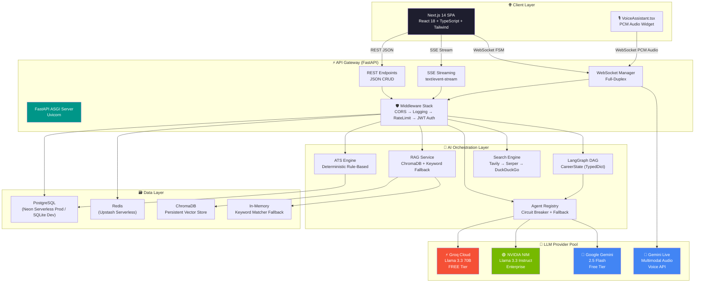
```mermaid
graph TB
    subgraph "🌐 Client Layer"
        UI["Next.js 14 SPA<br/>React 18 + TypeScript + Tailwind"]
        VC["🎙️ VoiceAssistant.tsx<br/>PCM Audio Widget"]
    end

    subgraph "⚡ API Gateway (FastAPI)"
        GATEWAY["FastAPI ASGI Server<br/>Uvicorn"]
        API["REST Endpoints<br/>JSON CRUD"]
        SSE["SSE Streaming<br/>text/event-stream"]
        WS["WebSocket Manager<br/>Full-Duplex"]
        MID["🛡️ Middleware Stack<br/>CORS → Logging → RateLimit → JWT Auth"]
    end

    subgraph "🧠 AI Orchestration Layer"
        LANG["LangGraph DAG<br/>CareerState (TypedDict)"]
        REG["Agent Registry<br/>Circuit Breaker + Fallback"]
        ATS["ATS Engine<br/>Deterministic Rule-Based"]
        RAG["RAG Service<br/>ChromaDB + Keyword Fallback"]
        SE["Search Engine<br/>Tavily → Serper → DuckDuckGo"]
    end

    subgraph "🤖 LLM Provider Pool"
        GROQ["⚡ Groq Cloud<br/>Llama 3.3 70B<br/>FREE Tier"]
        NVD["🟢 NVIDIA NIM<br/>Llama 3.3 Instruct<br/>Enterprise"]
        GEM["🔵 Google Gemini<br/>2.5 Flash<br/>Free Tier"]
        GML["🔵 Gemini Live<br/>Multimodal Audio<br/>Voice API"]
    end

    subgraph "🗃️ Data Layer"
        PG["PostgreSQL<br/>(Neon Serverless Prod / SQLite Dev)"]
        RD["Redis<br/>(Upstash Serverless)"]
        CD["ChromaDB<br/>Persistent Vector Store"]
        MEM["In-Memory<br/>Keyword Matcher Fallback"]
    end

    UI -->|"REST JSON"| API
    UI -->|"SSE Stream"| SSE
    UI -->|"WebSocket FSM"| WS
    VC -->|"WebSocket PCM Audio"| WS
    
    API & SSE & WS --> MID
    MID --> LANG & REG & ATS & RAG & SE
    
    LANG --> REG
    REG --> GROQ & NVD & GEM
    WS --> GML
    
    MID --> PG & RD
    RAG --> CD & MEM
    ATS --> PG
    
    style UI fill:#1e1e2e,color:#fff
    style GATEWAY fill:#009688,color:#fff
    style GROQ fill:#F55036,color:#fff
    style NVD fill:#76B900,color:#fff
    style GEM fill:#4285F4,color:#fff
    style GML fill:#4285F4,color:#fff
```

### 📡 **Communication Protocol Map**

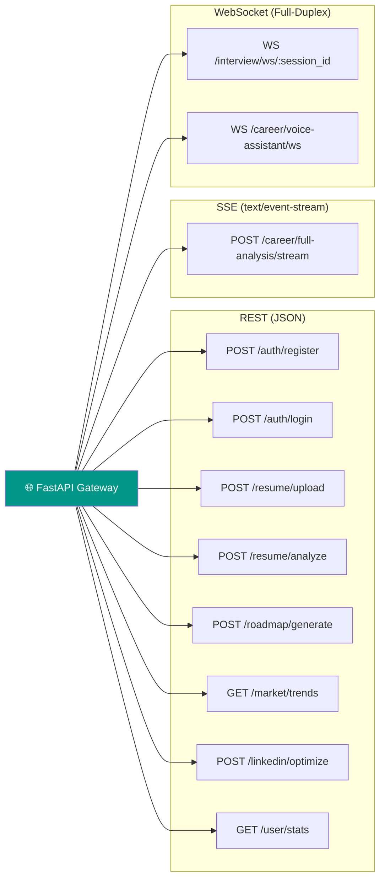
```mermaid
graph LR
    subgraph "REST (JSON)"
        R1["POST /auth/register"]
        R2["POST /auth/login"]
        R3["POST /resume/upload"]
        R4["POST /resume/analyze"]
        R5["POST /roadmap/generate"]
        R6["GET /market/trends"]
        R7["POST /linkedin/optimize"]
        R8["GET /user/stats"]
    end

    subgraph "SSE (text/event-stream)"
        S1["POST /career/full-analysis/stream"]
    end

    subgraph "WebSocket (Full-Duplex)"
        W1["WS /interview/ws/:session_id"]
        W2["WS /career/voice-assistant/ws"]
    end

    API["🌐 FastAPI Gateway"] --> R1 & R2 & R3 & R4 & R5 & R6 & R7 & R8
    API --> S1
    API --> W1 & W2

    style API fill:#009688,color:#fff
```

### 🔄 **Request Lifecycle**

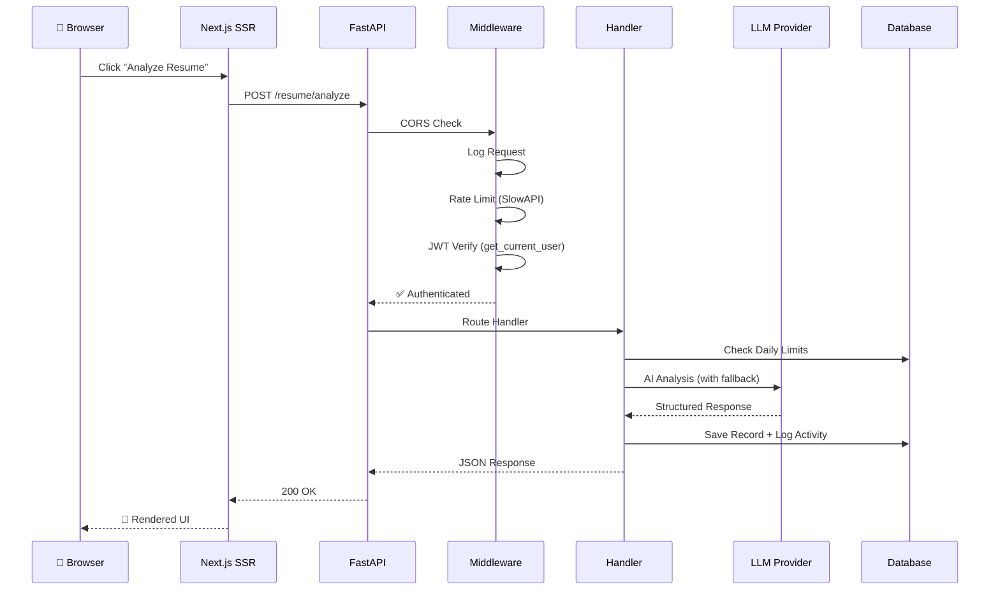
```mermaid
sequenceDiagram
    participant U as 👤 Browser
    participant N as Next.js SSR
    participant A as FastAPI
    participant M as Middleware
    participant H as Handler
    participant LLM as LLM Provider
    participant DB as Database

    U->>N: Click "Analyze Resume"
    N->>A: POST /resume/analyze
    A->>M: CORS Check
    M->>M: Log Request
    M->>M: Rate Limit (SlowAPI)
    M->>M: JWT Verify (get_current_user)
    M-->>A: ✅ Authenticated
    A->>H: Route Handler
    H->>DB: Check Daily Limits
    H->>LLM: AI Analysis (with fallback)
    LLM-->>H: Structured Response
    H->>DB: Save Record + Log Activity
    H-->>A: JSON Response
    A-->>N: 200 OK
    N-->>U: 🎉 Rendered UI
```

---

## 🛠️ **Complete Tech Stack & Tooling**

### 💻 **Frontend — Next.js 14 SPA Console**

| Layer | Technology | Purpose |
|-------|-----------|---------|
| **📐 Framework** | `Next.js 14` (App Router) + `React 18` + `TypeScript` | Structured UI, SSR, static generation |
| **🎨 Styling** | `Tailwind CSS` + CSS Variables | Responsive dark mode, glassmorphism, HUD layouts |
| **💻 Code Editor** | `@monaco-editor/react` | Interactive coding workspace during technical interviews |
| **📊 Charts** | `Recharts` | Activity logs, streaks, ATS sub-score visualizations |
| **📁 File Upload** | `react-dropzone` | Drag-and-drop resume PDF upload |
| **🔐 Auth** | `@react-oauth/google` | Seamless Google OAuth 2.0 sign-in |
| **🌐 Networking** | `Axios` (custom interceptor wrapper) | JWT auto-attach, 401 auto-refresh, error toasts |
| **🔔 Notifications** | `react-hot-toast` | Real-time validation and progress notifications |
| **📝 Markdown** | `react-markdown` | Display LLM-generated roadmaps and strategies |

### ⚡ **Backend — Async FastAPI Gateway**

| Layer | Technology | Purpose |
|-------|-----------|---------|
| **⚡ Framework** | `FastAPI` (Python 3.11+) | Async REST + WebSocket + SSE |
| **🖥️ Server** | `Uvicorn` | ASGI event loop with WebSocket support |
| **🧠 Orchestration** | `LangGraph` | Parallel DAG (fan-out/fan-in) for career analysis |
| **🤖 Agent Framework** | `AutoGen` / `ag2` | Multi-agent pipeline support |
| **🔗 LLM Abstraction** | `LangChain Core` | Unified provider wrappers |
| **📄 PDF Extraction** | `pdfplumber` | Precise ATS token extraction from PDFs |
| **🎤 TTS** | `edge-tts` | Sentence-sliced text-to-speech for interview audio |
| **🔐 Security** | `python-jose` + `bcrypt` | JWT tokens, password hashing |
| **🚦 Rate Limiting** | `SlowAPI` | IP + token-based rate limiting |

### 🗃️ **Databases & Cache System**

| System | Technology | Role |
|--------|-----------|------|
| **🗄️ Primary DB** | `PostgreSQL` (Neon Serverless) | Production relational data |
| **📦 Dev DB** | `SQLite` | Local development fallback |
| **🔗 ORM** | `SQLAlchemy 2.0` + `Alembic` | Async engine, schema migrations |
| **⚡ Cache** | `Upstash Redis` | Rate limits, 48h locks, session storage |
| **🧠 Vector Store** | `ChromaDB` (Persistent) | RAG resource embeddings |
| **📝 Memory Fallback** | In-Memory Keyword Matcher | OOM-safe fallback for 512MB RAM |

### 🤖 **AI Providers & APIs**

| Provider | Model | Use Case | Cost |
|----------|-------|----------|------|
| **⚡ Groq Cloud** | Llama 3.3 70B | Market analysis, LinkedIn optimization | ✅ FREE (100% Free) |
| **🟢 NVIDIA NIM** | Llama 3.3 Instruct | Resume analysis, mock interviews | 💰 Enterprise |
| **🔵 Google Gemini** | Gemini 2.5 Flash | Roadmap generation, general tasks | ✅ Free Tier |
| **🔵 Gemini Live** | Multimodal Audio | Voice coaching (Anya) | ✅ Free Tier |
| **🔍 Tavily** | Search API | Live market intelligence | 💰 Paid |
| **🔍 Serper** | Google Search | Market fallback search | 💰 Paid |
| **🦆 DuckDuckGo** | Search | Resource enrichment | ✅ FREE |

### 🛠️ **DevOps & Infrastructure**

| Tool | Purpose |
|------|---------|
| **🐳 Docker** | Containerization + Docker Compose |
| **🧪 Pytest** | 102 integration/regression tests |
| **⚙️ GitHub Actions** | CI (lint → build → 102 tests → security audit) |
| **🌍 Vercel** | Frontend hosting (auto-deploy) |
| **☁️ Render** | Backend hosting (auto-deploy) |

---

## ✨ **Core Features Deep Dive**

### 📄 **1. Resume Intelligence System**

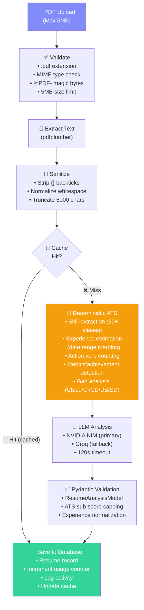
```mermaid
flowchart TD
    UPLOAD["📁 PDF Upload<br/>(Max 5MB)"]
    VAL["✅ Validate<br/>• .pdf extension<br/>• MIME type check<br/>• %PDF- magic bytes<br/>• 5MB size limit"]
    EXT["📝 Extract Text<br/>(pdfplumber)"]
    SANI["🧹 Sanitize<br/>• Strip {} backticks<br/>• Normalize whitespace<br/>• Truncate 6000 chars"]
    CACHE{"💾 Cache<br/>Hit?"}
    DET["🔢 Deterministic ATS<br/>• Skill extraction (80+ aliases)<br/>• Experience estimation<br/>  (date range merging)<br/>• Action verb counting<br/>• Metrics/achievement detection<br/>• Gap analysis (Cloud/CI/CD/DB/SD)"]
    LLM["🤖 LLM Analysis<br/>• NVIDIA NIM (primary)<br/>• Groq (fallback)<br/>• 120s timeout"]
    VALP["✅ Pydantic Validation<br/>• ResumeAnalysisModel<br/>• ATS sub-score capping<br/>• Experience normalization"]
    DB["💾 Save to Database<br/>• Resume record<br/>• Increment usage counter<br/>• Log activity<br/>• Update cache"]

    UPLOAD --> VAL --> EXT --> SANI --> CACHE
    CACHE -->|"✅ Hit (cached)"| DB
    CACHE -->|"❌ Miss"| DET --> LLM --> VALP --> DB

    style UPLOAD fill:#818cf8,color:#fff
    style DB fill:#34d399,color:#fff
    style DET fill:#f59e0b,color:#fff
```

**🔑 Key Capabilities:**
- 🏆 **Hybrid Architecture**: Rule-based ATS engine (zero LLM cost) + LLM enrichment for accuracy
- ⚡ **80+ Skill Aliases**: Maps `reactjs` → `React`, `k8s` → `Kubernetes`, etc.
- 📅 **Intelligent Date Parsing**: Merges overlapping intervals (e.g., `Jan 2020 - Mar 2022` + `Jun 2021 - Present` = true cumulative experience)
- 📊 **4-Factor ATS Score**: Keywords (35) + Achievements (30) + Action Verbs (20) + Formatting (15) = 100
- 🛡️ **Multi-Layer Fallback**: 2 LLM providers → deterministic fallback → graceful degradation

### 🗺️ **2. Gamified Roadmap & Resource Tracker**

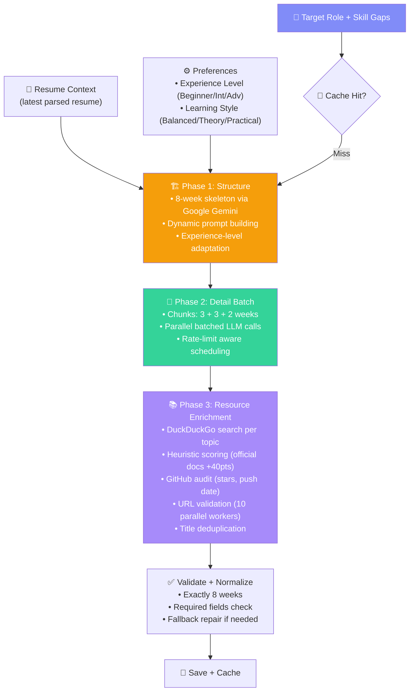
```mermaid
flowchart TD
    INPUT["🎯 Target Role + Skill Gaps"]
    RESUME["📄 Resume Context<br/>(latest parsed resume)"]
    PREF["⚙️ Preferences<br/>• Experience Level (Beginner/Int/Adv)<br/>• Learning Style (Balanced/Theory/Practical)"]
    CACHE{"💾 Cache Hit?"}
    STR["🏗️ Phase 1: Structure<br/>• 8-week skeleton via Google Gemini<br/>• Dynamic prompt building<br/>• Experience-level adaptation"]
    DET["📝 Phase 2: Detail Batch<br/>• Chunks: 3 + 3 + 2 weeks<br/>• Parallel batched LLM calls<br/>• Rate-limit aware scheduling"]
    RAG["📚 Phase 3: Resource Enrichment<br/>• DuckDuckGo search per topic<br/>• Heuristic scoring (official docs +40pts)<br/>• GitHub audit (stars, push date)<br/>• URL validation (10 parallel workers)<br/>• Title deduplication"]
    VALW["✅ Validate + Normalize<br/>• Exactly 8 weeks<br/>• Required fields check<br/>• Fallback repair if needed"]
    DB["💾 Save + Cache"]

    INPUT --> CACHE
    RESUME --> STR
    PREF --> STR
    CACHE -->|"Miss"| STR
    STR --> DET --> RAG --> VALW --> DB

    style INPUT fill:#818cf8,color:#fff
    style STR fill:#f59e0b,color:#fff
    style DET fill:#34d399,color:#fff
    style RAG fill:#a78bfa,color:#fff
```

**🎮 Gamification Features:**
- 🏅 **Title Progression**: *Novice Developer* → *Production Ready* based on syllabus %
- ✅ **Week Completion Toggle**: Persisted to DB with `PUT /roadmap/:id/toggle-week/:n`
- 📝 **Weekly Quizzes**: 5 MCQs per week via NVIDIA NIM + offline fallback
- 🎯 **Experience-Level Adaptation**: Beginner / Intermediate / Advanced content tailoring
- 📐 **Learning Style Support**: Balanced / Theory-focused / Practical-focused paths

### 📈 **3. Live Market Explorer**

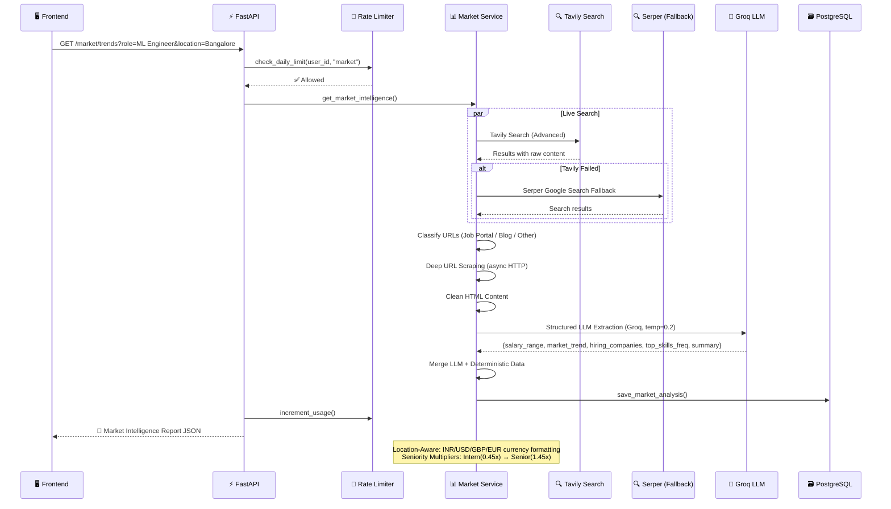
```mermaid
sequenceDiagram
    participant UI as 🖥️ Frontend
    participant API as ⚡ FastAPI
    participant RL as 🚦 Rate Limiter
    participant SVC as 📊 Market Service
    participant TAV as 🔍 Tavily Search
    participant SER as 🔍 Serper (Fallback)
    participant LLM as 🤖 Groq LLM
    participant DB as 🗃️ PostgreSQL

    UI->>API: GET /market/trends?role=ML Engineer&location=Bangalore
    API->>RL: check_daily_limit(user_id, "market")
    RL-->>API: ✅ Allowed
    API->>SVC: get_market_intelligence()
    
    par Live Search
        SVC->>TAV: Tavily Search (Advanced)
        TAV-->>SVC: Results with raw content
        alt Tavily Failed
            SVC->>SER: Serper Google Search Fallback
            SER-->>SVC: Search results
        end
    end
    
    SVC->>SVC: Classify URLs (Job Portal / Blog / Other)
    SVC->>SVC: Deep URL Scraping (async HTTP)
    SVC->>SVC: Clean HTML Content
    
    SVC->>LLM: Structured LLM Extraction (Groq, temp=0.2)
    LLM-->>SVC: {salary_range, market_trend, hiring_companies, top_skills_freq, summary}
    
    SVC->>SVC: Merge LLM + Deterministic Data
    SVC->>DB: save_market_analysis()
    API->>RL: increment_usage()
    API-->>UI: 🎯 Market Intelligence Report JSON

    Note over SVC: Location-Aware: INR/USD/GBP/EUR currency formatting<br/>Seniority Multipliers: Intern(0.45x) → Senior(1.45x)
```

**🌍 Coverage:**
- **30+ Roles**: SWE, Data/AI, Cloud/Infra, Security, Product, Gaming, more
- **50+ Locations**: India (12 cities), USA (8 cities), UK (10 cities), Europe, Middle East, APAC
- **8 Regions**: India, USA, UK, Europe, Middle East, Canada, SE Asia, Australia
- **Currency Intelligence**: Auto-formats ₹ / $ / £ / € / A$ per location

### 🎤 **4. Adaptive Mock Interviews (WebSocket FSM)**

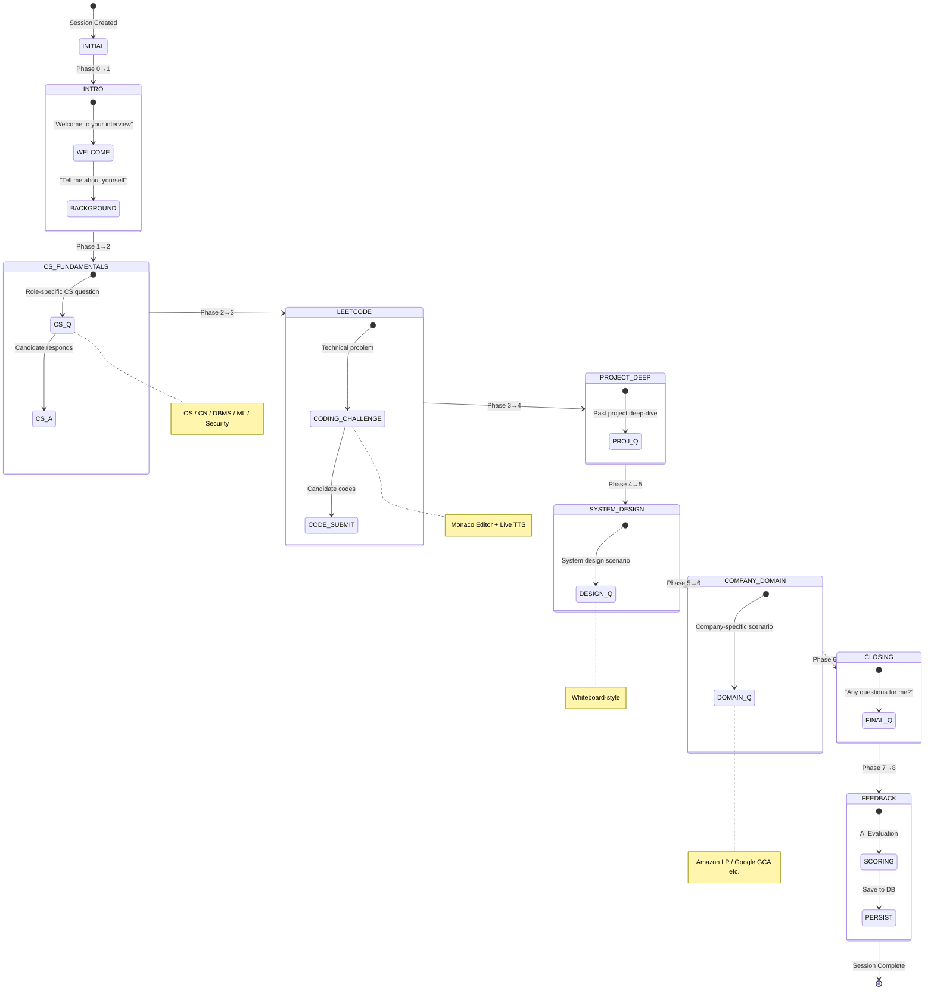
```mermaid
stateDiagram-v2
    [*] --> INITIAL: Session Created
    
    state INTRO {
        [*] --> WELCOME: "Welcome to your interview"
        WELCOME --> BACKGROUND: "Tell me about yourself"
    }
    
    state CS_FUNDAMENTALS {
        [*] --> CS_Q: Role-specific CS question
        CS_Q --> CS_A: Candidate responds
        note right of CS_Q: OS / CN / DBMS / ML / Security
    }
    
    state LEETCODE {
        [*] --> CODING_CHALLENGE: Technical problem
        CODING_CHALLENGE --> CODE_SUBMIT: Candidate codes
        note right of CODING_CHALLENGE: Monaco Editor + Live TTS
    }
    
    state PROJECT_DEEP {
        [*] --> PROJ_Q: Past project deep-dive
    }
    
    state SYSTEM_DESIGN {
        [*] --> DESIGN_Q: System design scenario
        note right of DESIGN_Q: Whiteboard-style
    }
    
    state COMPANY_DOMAIN {
        [*] --> DOMAIN_Q: Company-specific scenario
        note right of DOMAIN_Q: Amazon LP / Google GCA etc.
    }
    
    state CLOSING {
        [*] --> FINAL_Q: "Any questions for me?"
    }
    
    state FEEDBACK {
        [*] --> SCORING: AI Evaluation
        SCORING --> PERSIST: Save to DB
    }
    
    INITIAL --> INTRO: Phase 0→1
    INTRO --> CS_FUNDAMENTALS: Phase 1→2
    CS_FUNDAMENTALS --> LEETCODE: Phase 2→3
    LEETCODE --> PROJECT_DEEP: Phase 3→4
    PROJECT_DEEP --> SYSTEM_DESIGN: Phase 4→5
    SYSTEM_DESIGN --> COMPANY_DOMAIN: Phase 5→6
    COMPANY_DOMAIN --> CLOSING: Phase 6→7
    CLOSING --> FEEDBACK: Phase 7→8
    FEEDBACK --> [*]: Session Complete
```

**🎯 Role Category Adaptation:**

| Category | CS Focus | Coding Style | System Design |
|----------|----------|-------------|---------------|
| **💻 SWE** | OS/CN/DBMS | LeetCode Classic | General System Design |
| **🤖 Data/AI** | ML/Statistics | ML Case Study | ML Pipeline Design |
| **☁️ Infra/Cloud** | Containers/CI | Infra Scenario | Cloud Architecture |
| **🔐 Security** | AppSec/Crypto | CTF Challenge | Security Architecture |
| **📱 Product** | Metrics/Research | Product Case Study | Product Strategy |
| **🎮 Gaming** | Game Loop/Physics | Game Dev Challenge | Game Architecture |

### 🎙️ **5. Real-time AI Voice Coach (Anya)**

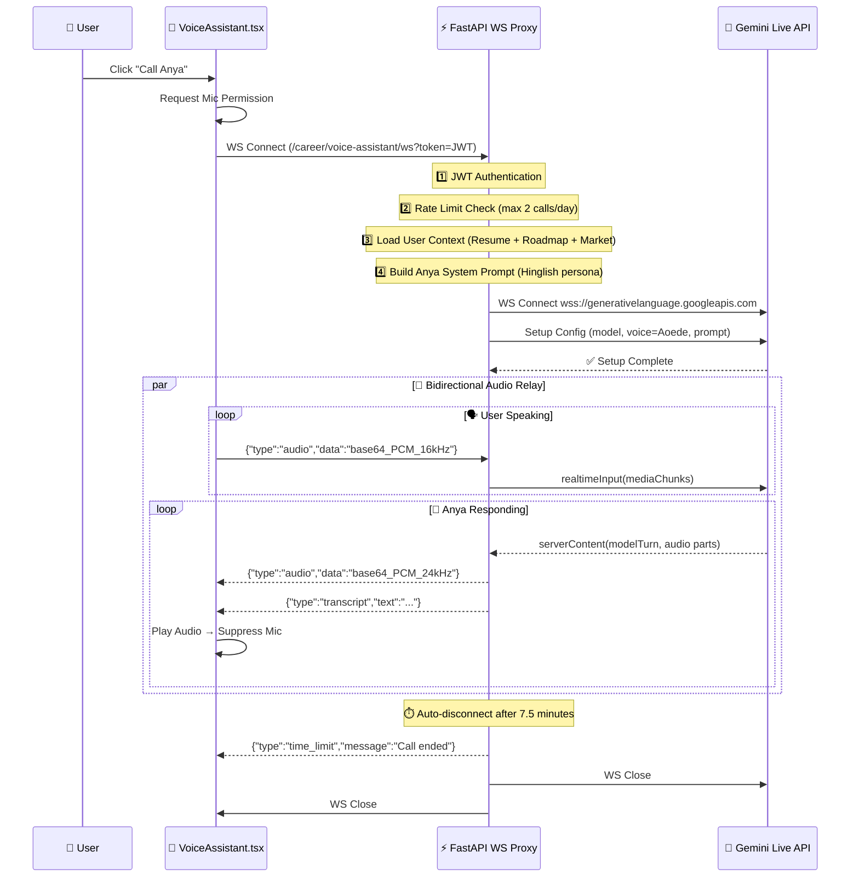
```mermaid
sequenceDiagram
    participant U as 👤 User
    participant C as 🎤 VoiceAssistant.tsx
    participant B as ⚡ FastAPI WS Proxy
    participant G as 🔵 Gemini Live API

    U->>C: Click "Call Anya"
    C->>C: Request Mic Permission
    C->>B: WS Connect (/career/voice-assistant/ws?token=JWT)
    
    Note over B: 1️⃣ JWT Authentication
    Note over B: 2️⃣ Rate Limit Check (max 2 calls/day)
    Note over B: 3️⃣ Load User Context (Resume + Roadmap + Market)
    Note over B: 4️⃣ Build Anya System Prompt (Hinglish persona)
    
    B->>G: WS Connect wss://generativelanguage.googleapis.com
    B->>G: Setup Config (model, voice=Aoede, prompt)
    G-->>B: ✅ Setup Complete
    
    par 🔄 Bidirectional Audio Relay
        loop 🗣️ User Speaking
            C->>B: {"type":"audio","data":"base64_PCM_16kHz"}
            B->>G: realtimeInput(mediaChunks)
        end
        
        loop 🤖 Anya Responding
            G-->>B: serverContent(modelTurn, audio parts)
            B-->>C: {"type":"audio","data":"base64_PCM_24kHz"}
            B-->>C: {"type":"transcript","text":"..."}
            C->>C: Play Audio → Suppress Mic
        end
    end
    
    Note over B: ⏱️ Auto-disconnect after 7.5 minutes
    B-->>C: {"type":"time_limit","message":"Call ended"}
    B->>G: WS Close
    B->>C: WS Close
```

**🌐 Anya's Personality:**
- **Name**: Anya 🎀
- **Language**: Hinglish (Hindi + English mix) 🇮🇳
- **Tone**: Sweet, friendly, encouraging, career mentor
- **Voice**: Google's Aoede (Gemini Live)
- **Memory**: Automatically knows your resume, roadmap progress, and target role

### 🔗 **6. LinkedIn Profile Optimizer**

| Feature | Description |
|---------|-------------|
| **✍️ 3 Headline Options** | ATS-optimized headlines with tech emojis (💻 🚀 🛠️) |
| **📝 Full About Section** | Professional summary with markdown + emoji formatting |
| **🎯 Demanding Skills** | Role-specific skill recommendations |
| **🔑 ATS Keywords** | Keywords recruiters search for your target role |
| **🔍 Recruiter Trends** | What recruiters are searching for |
| **📊 Profile Density Advice** | Specific optimization guidance |
| **🎓 Certifications** | Recommended certifications for the role |
| **🛡️ Programmatic Fallback** | High-quality deterministic strategy when LLM is down |

---

## 🔄 **Data Flow & Pipelines**

### 🧠 **Full Career Analysis Pipeline (LangGraph DAG)**

The crown jewel — a single `POST /career/full-analysis/stream` that orchestrates ALL workflows through LangGraph with **SSE streaming**:

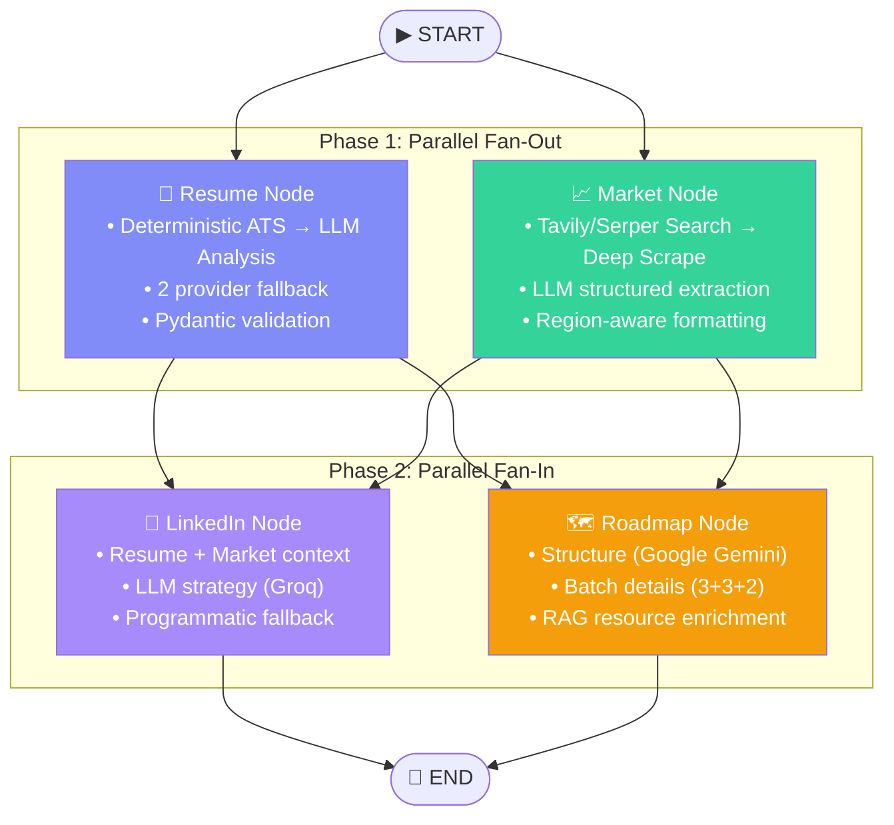
```mermaid
flowchart TD
    START(["▶ START"])
    
    subgraph "Phase 1: Parallel Fan-Out"
        RN["📄 Resume Node<br/>• Deterministic ATS → LLM Analysis<br/>• 2 provider fallback<br/>• Pydantic validation"]
        MN["📈 Market Node<br/>• Tavily/Serper Search → Deep Scrape<br/>• LLM structured extraction<br/>• Region-aware formatting"]
    end
    
    subgraph "Phase 2: Parallel Fan-In"
        LN["🔗 LinkedIn Node<br/>• Resume + Market context<br/>• LLM strategy (Groq)<br/>• Programmatic fallback"]
        RP["🗺️ Roadmap Node<br/>• Structure (Google Gemini)<br/>• Batch details (3+3+2)<br/>• RAG resource enrichment"]
    end
    
    ENDN(["🏁 END"])
    
    START --> RN
    START --> MN
    
    RN --> LN
    MN --> LN
    RN --> RP
    MN --> RP
    
    LN --> ENDN
    RP --> ENDN
    
    style RN fill:#818cf8,color:#fff
    style MN fill:#34d399,color:#fff
    style LN fill:#a78bfa,color:#fff
    style RP fill:#f59e0b,color:#fff
```

### 📡 **SSE Streaming Architecture**

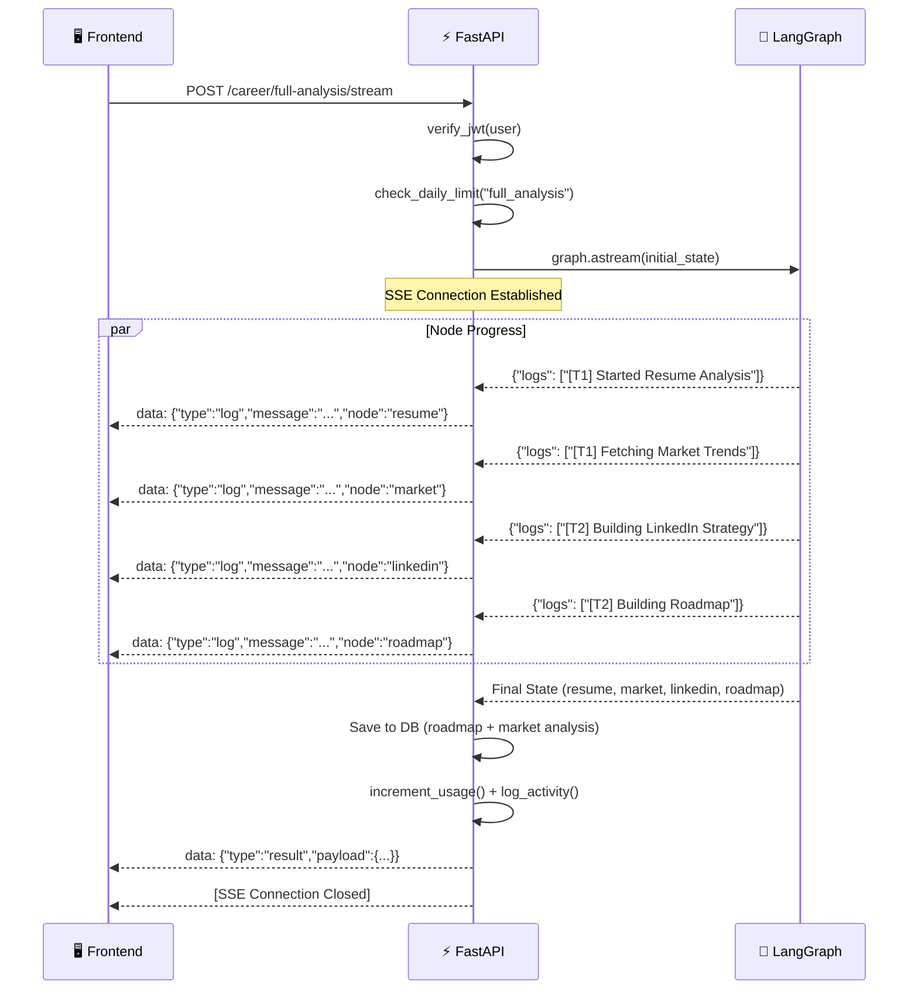
```mermaid
sequenceDiagram
    participant F as 🖥️ Frontend
    participant A as ⚡ FastAPI
    participant G as 🧠 LangGraph
    
    F->>A: POST /career/full-analysis/stream
    A->>A: verify_jwt(user)
    A->>A: check_daily_limit("full_analysis")
    A->>G: graph.astream(initial_state)
    
    Note over A: SSE Connection Established
    
    par Node Progress
        G-->>A: {"logs": ["[T1] Started Resume Analysis"]}
        A-->>F: data: {"type":"log","message":"...","node":"resume"}
        
        G-->>A: {"logs": ["[T1] Fetching Market Trends"]}
        A-->>F: data: {"type":"log","message":"...","node":"market"}
        
        G-->>A: {"logs": ["[T2] Building LinkedIn Strategy"]}
        A-->>F: data: {"type":"log","message":"...","node":"linkedin"}
        
        G-->>A: {"logs": ["[T2] Building Roadmap"]}
        A-->>F: data: {"type":"log","message":"...","node":"roadmap"}
    end
    
    G-->>A: Final State (resume, market, linkedin, roadmap)
    A->>A: Save to DB (roadmap + market analysis)
    A->>A: increment_usage() + log_activity()
    A-->>F: data: {"type":"result","payload":{...}}
    A-->>F: [SSE Connection Closed]
```

### 📄 **Resume Upload & Analysis Pipeline**


```mermaid
flowchart LR
    U["📁 PDF Upload"] --> V1["✅ Extension Check (.pdf)"]
    V1 --> V2["✅ MIME Type Check"]
    V2 --> V3["✅ Magic Bytes (%PDF-)"]
    V3 --> V4["✅ Size Limit (5MB)"]
    V4 --> EX["📝 Extract Text (pdfplumber)"]
    EX --> S1["🧹 Strip Curly Braces {}"]
    S1 --> S2["🧹 Strip Backticks ```"]
    S2 --> S3["🧹 Normalize Whitespace"]
    S3 --> S4["✂️ Truncate 6000 chars"]
    S4 --> C{"💾 Cache Check"}
    C -->|"Hit ✅"| DB["💾 DB Save"]
    C -->|"Miss ❌"| DET["🔢 Deterministic ATS"]
    DET --> LLM["🤖 LLM (NVIDIA → Groq)"]
    LLM --> P["✅ Pydantic Validation"]
    P --> DB

    style U fill:#818cf8,color:#fff
    style DB fill:#34d399,color:#fff
    style DET fill:#f59e0b,color:#fff
```

### 📈 **Market Intelligence Pipeline**

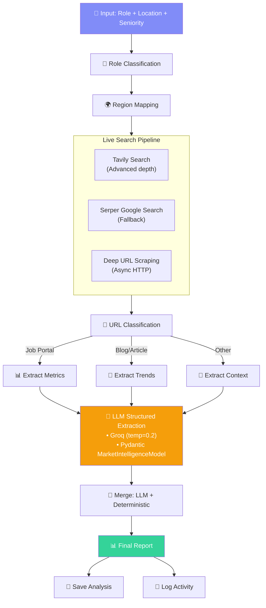
```mermaid
flowchart TD
    I["🎯 Input: Role + Location + Seniority"]
    I --> RC["🧠 Role Classification"]
    RC --> SM["🌍 Region Mapping"]
    SM --> SL["🔍 Search Layer"]
    
    subgraph SL [Live Search Pipeline]
        T["Tavily Search<br/>(Advanced depth)"]
        SR["Serper Google Search<br/>(Fallback)"]
        DS["Deep URL Scraping<br/>(Async HTTP)"]
    end
    
    SL --> CL["📂 URL Classification"]
    CL -->|"Job Portal"| JP["📊 Extract Metrics"]
    CL -->|"Blog/Article"| BL["📝 Extract Trends"]
    CL -->|"Other"| OT["📎 Extract Context"]
    
    JP & BL & OT --> LLM["🤖 LLM Structured Extraction<br/>• Groq (temp=0.2)<br/>• Pydantic MarketIntelligenceModel"]
    LLM --> MERGE["🔄 Merge: LLM + Deterministic"]
    MERGE --> OUT["📊 Final Report"]
    
    OUT --> SA["💾 Save Analysis"]
    OUT --> LOG["📝 Log Activity"]
    
    style I fill:#818cf8,color:#fff
    style OUT fill:#34d399,color:#fff
    style LLM fill:#f59e0b,color:#fff
```

---

## 🤖 **Model Selector & AI Routing**

### 🧭 **Agent Registry Architecture**

The **Agent Registry** (`registry.py`) is a production-hardened LLM caller with:

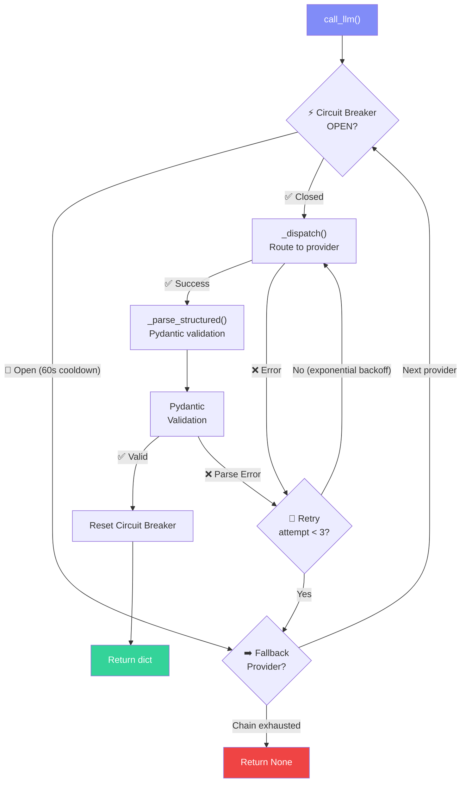
```mermaid
flowchart TD
    CALL["call_llm()"]
    
    CB{"⚡ Circuit Breaker<br/>OPEN?"}
    
    DISP["_dispatch()<br/>Route to provider"]
    
    RETRY{"🔄 Retry<br/>attempt < 3?"}
    
    FALLBACK{"➡️ Fallback<br/>Provider?"}
    
    PARSE["_parse_structured()<br/>Pydantic validation"]
    
    CALL --> CB
    
    CB -->|"🚫 Open (60s cooldown)"| FALLBACK
    CB -->|"✅ Closed"| DISP
    
    DISP -->|"✅ Success"| PARSE
    DISP -->|"❌ Error"| RETRY
    
    RETRY -->|"Yes"| FALLBACK
    RETRY -->|"No (exponential backoff)"| DISP
    
    FALLBACK -->|"Next provider"| CB
    FALLBACK -->|"Chain exhausted"| RET_NONE["Return None"]
    
    PARSE --> VAL["Pydantic<br/>Validation"]
    VAL -->|"✅ Valid"| RESET["Reset Circuit Breaker"]
    VAL -->|"❌ Parse Error"| RETRY
    
    RESET --> RET["Return dict"]
    
    style CALL fill:#818cf8,color:#fff
    style RET fill:#34d399,color:#fff
    style RET_NONE fill:#ef4444,color:#fff
```

### 🛡️ **Circuit Breaker Details**

| Parameter | Value |
|-----------|-------|
| **Trip Threshold** | 5 consecutive failures |
| **Cooldown Duration** | 60 seconds |
| **Max Retries** | 3 (with exponential backoff: 2^attempt seconds) |
| **Scope** | Per-provider singleton |

### 📋 **Provider Routing Table**

| Workflow | 🥇 Primary | 🥈 Fallback 1 | 🥉 Fallback 2 | `allow_google` |
|----------|-----------|--------------|--------------|:---:|
| **📄 Resume Analyst** | 🟢 NVIDIA NIM | ⚡ Groq | — | ❌ |
| **📈 Market Explorer** | ⚡ Groq | 🟢 NVIDIA NIM | — | ❌ |
| **🔗 LinkedIn Optimizer** | ⚡ Groq | 🟢 NVIDIA NIM | — | ❌ |
| **🗺️ Roadmap Builder** | 🔵 Google Gemini | ⚡ Groq | 🟢 NVIDIA NIM | ✅ |
| **🎤 Mock Interview** | 🟢 NVIDIA NIM | **No fallback** (session stability) | — | ❌ |
| **🎙️ Voice Coach** | 🔵 Gemini Live | **No fallback** (requires Multimodal WS) | — | N/A |
| **📝 Assessment Quiz** | 🟢 NVIDIA NIM | Offline fallback quizzes | — | ❌ |

### 🔗 **Fallback Chain Flow**

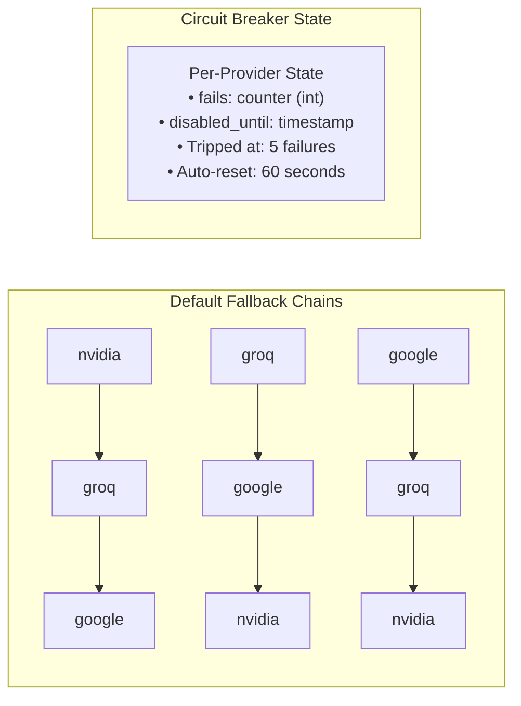
```mermaid
graph LR
    subgraph "Default Fallback Chains"
        N["nvidia"] --> N_G["groq"] --> N_GO["google"]
        G["groq"] --> G_GO["google"] --> G_N["nvidia"]
        GO["google"] --> GO_G["groq"] --> GO_N["nvidia"]
    end
    
    subgraph "Circuit Breaker State"
        CB["Per-Provider State<br/>• fails: counter (int)<br/>• disabled_until: timestamp<br/>• Tripped at: 5 failures<br/>• Auto-reset: 60 seconds"]
    end
```

---

## 🧬 **Hybrid Semantic RAG Engine**

The RAG Service provides **intelligent resource recommendations** for roadmap weeks with multi-layer fallback:

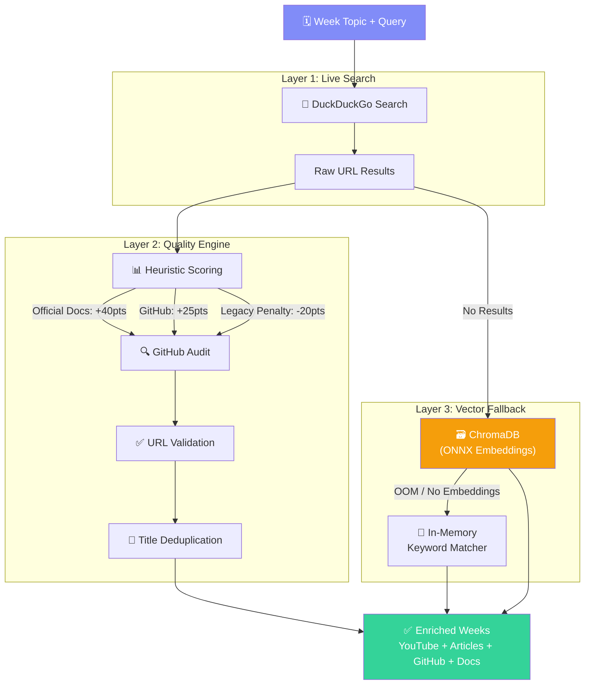
```mermaid
flowchart TD
    W["🗓️ Week Topic + Query"]
    
    subgraph "Layer 1: Live Search"
        DDG["🦆 DuckDuckGo Search"]
        RAW["Raw URL Results"]
    end
    
    subgraph "Layer 2: Quality Engine"
        HS["📊 Heuristic Scoring"]
        GA["🔍 GitHub Audit"]
        UV["✅ URL Validation"]
        TD["📝 Title Deduplication"]
    end
    
    subgraph "Layer 3: Vector Fallback"
        CHROMA["🗃️ ChromaDB<br/>(ONNX Embeddings)"]
        KW["📝 In-Memory<br/>Keyword Matcher"]
    end
    
    W --> DDG
    DDG --> RAW
    RAW --> HS
    
    HS -->|"Official Docs: +40pts"| GA
    HS -->|"GitHub: +25pts"| GA
    HS -->|"Legacy Penalty: -20pts"| GA
    
    GA --> UV
    UV --> TD
    
    TD --> ENR["✅ Enriched Weeks<br/>YouTube + Articles + GitHub + Docs"]
    
    RAW -->|"No Results"| CHROMA
    CHROMA -->|"OOM / No Embeddings"| KW
    KW --> ENR
    CHROMA --> ENR
    
    style W fill:#818cf8,color:#fff
    style ENR fill:#34d399,color:#fff
    style CHROMA fill:#f59e0b,color:#fff
```

### 🏆 **Domain Scoring Weights**

| Domain | Base Weight | Example |
|--------|------------|---------|
| **📘 Official Documentation** | +40 pts | `docs.docker.com`, `react.dev`, `developer.mozilla.org` |
| **🐙 GitHub Repositories** | +25 pts | Active repos with recent commits |
| **📚 Educational** | +10 to +20 pts | `freecodecamp.org`, `geeksforgeeks.org` |
| **📝 Community** | +5 pts | `medium.com`, `dev.to`, `hashnode.dev` |
| **⚠️ Legacy Penalty** | -20 pts | `angularjs`, `class-components` |

### 🛡️ **OOM Protection**

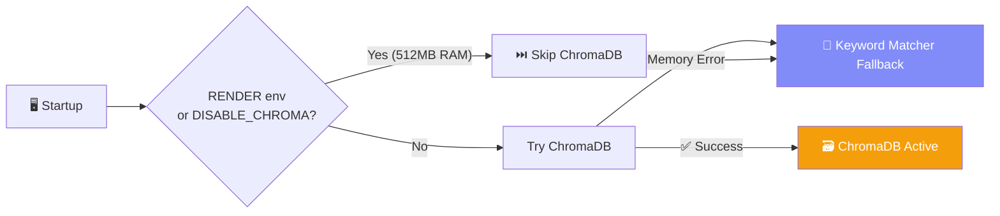
```mermaid
flowchart LR
    START["🖥️ Startup"] --> CHECK{"RENDER env<br/>or DISABLE_CHROMA?"}
    CHECK -->|"Yes (512MB RAM)"| SKIP["⏭️ Skip ChromaDB"]
    CHECK -->|"No"| TRY["Try ChromaDB"]
    TRY -->|"✅ Success"| CHROMA["🗃️ ChromaDB Active"]
    TRY -->|"❌ Memory Error"| KW["📝 Keyword Matcher Fallback"]
    SKIP --> KW
    
    style CHROMA fill:#f59e0b,color:#fff
    style KW fill:#818cf8,color:#fff
```

---

## 🗃️ **Database Schema & ERD**

### 📐 **Entity Relationship Diagram**

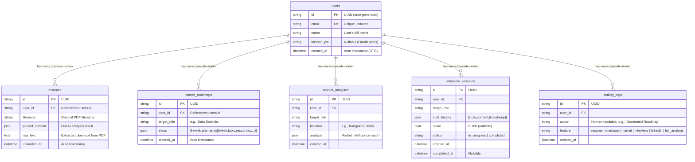
```mermaid
erDiagram
    users ||--o{ resumes : "has many (cascade delete)"
    users ||--o{ career_roadmaps : "has many (cascade delete)"
    users ||--o{ market_analyses : "has many (cascade delete)"
    users ||--o{ interview_sessions : "has many (cascade delete)"
    users ||--o{ activity_logs : "has many (cascade delete)"

    users {
        string id PK "UUID (auto-generated)"
        string email UK "Unique, indexed"
        string name "User's full name"
        string hashed_pw "Nullable (OAuth users)"
        datetime created_at "Auto timestamp (UTC)"
    }

    resumes {
        string id PK "UUID"
        string user_id FK "References users.id"
        string filename "Original PDF filename"
        json parsed_content "Full AI analysis result"
        text raw_text "Extracted plain text from PDF"
        datetime uploaded_at "Auto timestamp"
    }

    career_roadmaps {
        string id PK "UUID"
        string user_id FK "References users.id"
        string target_role "e.g., Data Scientist"
        json steps "8-week plan array[{week,topic,resources,...}]"
        datetime created_at "Auto timestamp"
    }

    market_analyses {
        string id PK "UUID"
        string user_id FK
        string target_role
        string location "e.g., Bangalore, India"
        json analysis "Market intelligence report"
        datetime created_at
    }

    interview_sessions {
        string id PK "UUID"
        string user_id FK
        string target_role
        json chat_history "[{role,content,timestamp}]"
        float score "0-100 (nullable)"
        string status "in_progress | completed"
        datetime created_at
        datetime completed_at "Nullable"
    }

    activity_logs {
        string id PK "UUID"
        string user_id FK
        string action "Human-readable, e.g., 'Generated Roadmap'"
        string feature "resume | roadmap | market | interview | linkedin | full_analysis"
        datetime created_at
    }
```

### 📋 **Table Summary**

| # | Table | Records | Key JSON Column | Cascade |
|---|-------|---------|----------------|---------|
| 1 | `users` | User accounts | — | — |
| 2 | `resumes` | Uploaded resumes | `parsed_content` (AI analysis) | Delete with user |
| 3 | `career_roadmaps` | Learning roadmaps | `steps` (8-week plan) | Delete with user |
| 4 | `market_analyses` | Market reports | `analysis` (intelligence) | Delete with user |
| 5 | `interview_sessions` | Mock interviews | `chat_history` (messages) | Delete with user |
| 6 | `activity_logs` | User activity | — | Delete with user |

---

## 🔒 **Rate Limiting & Security**

### 🚦 **Multi-Layer Rate Limiting Architecture**

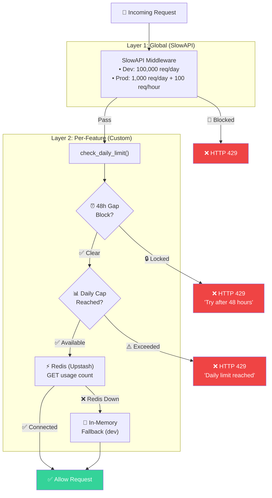
```mermaid
flowchart TD
    REQ["📨 Incoming Request"]
    
    subgraph "Layer 1: Global (SlowAPI)"
        SLOW["SlowAPI Middleware<br/>• Dev: 100,000 req/day<br/>• Prod: 1,000 req/day + 100 req/hour"]
    end
    
    subgraph "Layer 2: Per-Feature (Custom)"
        CHECK["check_daily_limit()"]
        GAP{"⏰ 48h Gap<br/>Block?"}
        DAILY{"📊 Daily Cap<br/>Reached?"}
        REDIS_Q["⚡ Redis (Upstash)<br/>GET usage count"]
        MEM_Q["📝 In-Memory<br/>Fallback (dev)"]
    end
    
    REQ --> SLOW
    
    SLOW -->|"Pass"| CHECK
    SLOW -->|"🚫 Blocked"| REJ_G["❌ HTTP 429"]
    
    CHECK --> GAP
    GAP -->|"🔒 Locked"| REJ_F["❌ HTTP 429<br/>'Try after 48 hours'"]
    GAP -->|"✅ Clear"| DAILY
    
    DAILY -->|"⚠️ Exceeded"| REJ_D["❌ HTTP 429<br/>'Daily limit reached'"]
    DAILY -->|"✅ Available"| REDIS_Q
    
    REDIS_Q -->|"✅ Connected"| ALLOW["✅ Allow Request"]
    REDIS_Q -->|"❌ Redis Down"| MEM_Q --> ALLOW
    
    style REJ_G fill:#ef4444,color:#fff
    style REJ_F fill:#ef4444,color:#fff
    style REJ_D fill:#ef4444,color:#fff
    style ALLOW fill:#34d399,color:#fff
```

### 📊 **Per-Feature Daily Limits**

| Feature | 🚦 Daily Cap | ⏰ 48h Lock | Special Rules |
|---------|:----------:|:----------:|---------------|
| **📄 Resume Analysis** | 3 | ❌ | — |
| **📈 Market Research** | 3 | ❌ | — |
| **🔗 LinkedIn Optimization** | 4 | ❌ | — |
| **🗺️ Roadmap Generation** | 1 | ✅ | 48h gap between generations |
| **🧠 Full Career Analysis** | 1 | ✅ | 48h gap between analyses |
| **🎤 Mock Interview** | 1 | ✅ | 48h gap between sessions |
| **🎙️ Voice Assistant** | 2 | — | 7.5 min max duration per call |

### 🛡️ **Security Architecture**

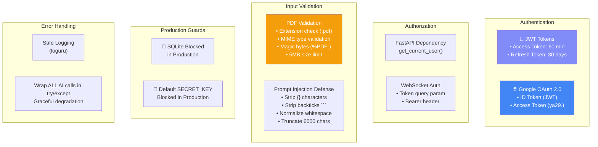
```mermaid
graph TD
    subgraph "Authentication"
        JWT["🔐 JWT Tokens<br/>• Access Token: 60 min<br/>• Refresh Token: 30 days"]
        OAuth["🌐 Google OAuth 2.0<br/>• ID Token (JWT)<br/>• Access Token (ya29.)"]
    end
    
    subgraph "Authorization"
        DEP["FastAPI Dependency<br/>get_current_user()"]
        WS["WebSocket Auth<br/>• Token query param<br/>• Bearer header"]
    end
    
    subgraph "Input Validation"
        PDF["PDF Validation<br/>• Extension check (.pdf)<br/>• MIME type validation<br/>• Magic bytes (%PDF-)<br/>• 5MB size limit"]
        SANI["Prompt Injection Defense<br/>• Strip {} characters<br/>• Strip backticks ```<br/>• Normalize whitespace<br/>• Truncate 6000 chars"]
    end
    
    subgraph "Production Guards"
        SQL["🚫 SQLite Blocked<br/>in Production"]
        SEC["🚫 Default SECRET_KEY<br/>Blocked in Production"]
    end
    
    subgraph "Error Handling"
        LOG["Safe Logging<br/>(loguru)"]
        TRY["Wrap ALL AI calls in try/except<br/>Graceful degradation"]
    end

    style JWT fill:#818cf8,color:#fff
    style OAuth fill:#4285F4,color:#fff
    style PDF fill:#f59e0b,color:#fff
```

---

## 🚀 **Local Setup Guide**

### ✅ **Prerequisites**

| Tool | Version | Purpose |
|------|---------|---------|
| 🐍 Python | 3.11+ | Backend runtime |
| 🟢 Node.js | 20+ | Frontend runtime |
| 📦 Redis | Latest (optional) | Rate limiting (falls back to in-memory) |

### 📥 **Step 1: Clone & Set Up Backend**

```bash
# Clone the repository
git clone https://github.com/Anil-Pradhan-web/ai-career-mentor.git
cd ai-career-mentor/backend

# Create virtual environment
python -m venv venv

# Activate it
# Windows:
venv\Scripts\activate
# macOS/Linux:
# source venv/bin/activate

# Install dependencies
pip install -r requirements.txt

# Create environment file
cp .env.example .env
```

### 🔑 **Step 2: Configure Environment Variables**

Edit `backend/.env`:

```env
# ⚡ LLM Provider (groq is FREE — no credit card!)
LLM_PROVIDER=groq

# 🆓 Get from https://console.groq.com → API Keys
GROQ_API_KEY=gsk_your_key_here

# 🔵 Optional — Get from https://aistudio.google.com
GOOGLE_API_KEY=your_gemini_key

# 🟢 Optional — NVIDIA NIM
NVIDIA_API_KEY=nvapi-your_key

# 🗄️ Database (SQLite for dev, PostgreSQL for prod)
DATABASE_URL=sqlite:///./dev.db

# 🔐 JWT Secret (change in production!)
SECRET_KEY=your-secret-key-change-this

# 🌐 Google OAuth (for Google Login)
GOOGLE_CLIENT_ID=your_client_id.apps.googleusercontent.com
```

### 🏃 **Step 3: Run Backend**

```bash
# Run database migrations
alembic upgrade head

# Start FastAPI server
uvicorn app.main:app --reload
```

Backend is now live at:
- 🌍 **API**: http://localhost:8000
- 📘 **Swagger UI**: http://localhost:8000/docs
- 📋 **ReDoc**: http://localhost:8000/redoc

### 💻 **Step 4: Set Up Frontend**

```bash
cd ../frontend

# Install dependencies
npm install

# Create environment file
# frontend/.env.local:
cat > .env.local << EOL
NEXT_PUBLIC_API_URL=http://localhost:8000
NEXT_PUBLIC_GOOGLE_CLIENT_ID=your_client_id.apps.googleusercontent.com
EOL

# Start development server
npm run dev
```

Frontend is now live at: **http://localhost:3000** 🌟

---

## 🐳 **Docker Deployment**

### 🏗️ **Development Stack**

```bash
# Spin up all services
docker compose up --build
```

| Service | Port | Description |
|---------|------|-------------|
| ⚡ Backend | `8000` | FastAPI + Uvicorn |
| 💻 Frontend | `3000` | Next.js 14 |
| 📦 Redis | `6379` | Rate limiting |

### 🚀 **Production Stack**

```bash
docker compose -f docker-compose.yml -f docker-compose.prod.yml up --build
```

> 📖 For detailed Docker configuration and production deployment guide, see **[DOCKER_GUIDE.md](./DOCKER_GUIDE.md)**

---

## 📁 **Complete Project Structure**

```
ai-career-mentor/
│
├── 📄 README.md                     # This file (project overview)
├── 📄 ARCHITECTURE.md               # System architecture (Mermaid diagrams)
├── 📄 SYSTEM.md                     # Comprehensive system design
├── 📄 API.md                        # Complete API reference
├── 📄 DOCKER_GUIDE.md               # Docker deployment guide
├── 📄 LICENSE                       # MIT License
├── 📄 render.yaml                   # Render deployment config
├── 📄 start.bat                     # Windows startup script
├── 📄 .gitignore
│
├── 📁 backend/                      # 🐍 Python Backend
│   ├── 📄 Dockerfile
│   ├── 📄 requirements.txt
│   ├── 📄 .gitignore
│   ├── 📄 alembic.ini
│   │
│   ├── 📁 app/                      # Main application
│   │   ├── 📄 __init__.py
│   │   ├── 📄 main.py               # FastAPI app, middleware, routes
│   │   │
│   │   ├── 📁 agents/               # 🧠 AI Agent Modules
│   │   │   ├── __init__.py
│   │   │   ├── registry.py          # Unified LLM caller + circuit breaker + fallback
│   │   │   └── workflow.py          # LangGraph DAG (parallel fan-out/fan-in)
│   │   │
│   │   ├── 📁 api/                  # 🌐 API Routes
│   │   │   ├── __init__.py
│   │   │   ├── auth.py              # Register, Login, Google OAuth, JWT Refresh
│   │   │   ├── resume.py            # PDF upload + analysis agent
│   │   │   ├── roadmap.py           # Roadmap CRUD + quiz generation
│   │   │   ├── market.py            # Market trends + history
│   │   │   ├── career.py            # Full analysis SSE streaming
│   │   │   ├── linkedin.py          # LinkedIn optimization agent
│   │   │   ├── interview.py         # Mock interview WebSocket + history
│   │   │   ├── voice_assistant.py   # Anya voice coach WebSocket
│   │   │   ├── user.py              # Dashboard stats + activity
│   │   │   └── deps.py              # Shared dependencies (JWT auth)
│   │   │
│   │   ├── 📁 core/                 # ⚙️ Core Services
│   │   │   ├── __init__.py
│   │   │   ├── config.py            # Settings + environment
│   │   │   ├── database.py          # SQLAlchemy engine + session
│   │   │   ├── security.py          # Password hashing + JWT tokens
│   │   │   ├── rate_limit.py        # Redis + in-memory usage tracking
│   │   │   ├── cache.py             # Response caching
│   │   │   ├── activity.py          # Activity logging
│   │   │   ├── ats_engine.py        # Deterministic ATS scoring engine
│   │   │   ├── rag_service.py       # ChromaDB RAG service
│   │   │   ├── search_engine.py     # DuckDuckGo + URL validation
│   │   │   ├── voice_engine.py      # TTS audio generation
│   │   │   │
│   │   │   ├── 📁 interview/        # 🎤 Interview Subsystem
│   │   │   │   ├── state.py         # 7-phase FSM (InterviewStateMachine)
│   │   │   │   ├── prompts.py       # Role-specific interview prompts
│   │   │   │   ├── session.py       # Session compression + memory
│   │   │   │   ├── constants.py     # 100+ roles, 80+ companies
│   │   │   │   ├── llm.py           # Interview-specific LLM caller
│   │   │   │   └── websocket_manager.py  # WS lifecycle management
│   │   │   │
│   │   │   ├── 📁 market/           # 📈 Market Subsystem
│   │   │   │   ├── service.py       # Market intelligence aggregator
│   │   │   │   └── history.py       # Market analysis DB persistence
│   │   │   │
│   │   │   └── 📁 roadmap/          # 🗺️ Roadmap Subsystem
│   │   │       ├── agents.py        # Structure + details LLM runners
│   │   │       ├── helpers.py       # JSON parsing + normalization
│   │   │       ├── prompts.py       # Dynamic system prompts
│   │   │       └── quiz.py          # MCQ quiz generation
│   │   │
│   │   ├── 📁 models/               # 📦 Data Models
│   │   │   ├── __init__.py
│   │   │   ├── models.py            # SQLAlchemy ORM (6 tables)
│   │   │   ├── schemas.py           # Pydantic request/response schemas
│   │   │   └── validation.py        # Strict agent output validation
│   │   │
│   │   └── 📁 data/                 # 📚 Seed Data
│   │       └── curated_resources.json  # Gold-standard RAG seeds
│   │
│   ├── 📁 tests/                    # 🧪 Test Suite (102 tests)
│   │   ├── test_agents_registry.py  # 26 tests: JSON, circuit breakers
│   │   ├── test_roadmap_agents.py   # 24 tests: fallback, batching
│   │   ├── test_validation.py       # 14 tests: Pydantic constraints
│   │   ├── test_main.py             # 9 tests: auth, rate limiting
│   │   ├── test_features.py         # 8 tests: market, TTS, search
│   │   ├── test_ats_engine.py       # 5 tests: experience parser
│   │   ├── test_market_service.py   # 5 tests: salary, classification
│   │   ├── test_gamified_roadmap.py # 3 tests: progress, quizzes
│   │   ├── test_voice_assistant.py  # 3 tests: WS auth, config
│   │   └── test_linkedin.py         # 2 tests: fallback strategy
│   │
│   └── 📁 alembic/                  # Database migrations
│       └── versions/
│
├── 📁 frontend/                     # 💻 Next.js Frontend
│   ├── 📄 Dockerfile
│   ├── 📄 package.json
│   ├── 📄 next.config.js
│   ├── 📄 tailwind.config.js
│   ├── 📄 tsconfig.json
│   │
│   └── 📁 src/
│       ├── 📁 app/                  # 🗺️ App Router Pages
│       │   ├── layout.tsx           # Root layout
│       │   ├── globals.css          # Design system tokens
│       │   ├── page.tsx             # Landing page
│       │   ├── login/page.tsx       # Login page
│       │   ├── register/page.tsx    # Registration page
│       │   │
│       │   └── 📁 dashboard/        # 🖥️ Dashboard (Auth Required)
│       │       ├── layout.tsx       # Sidebar + Navbar layout
│       │       ├── page.tsx         # Stats, charts, activity
│       │       ├── resume/page.tsx  # Resume upload + analysis
│       │       ├── roadmap/page.tsx # Gamified learning tracker
│       │       ├── market/page.tsx  # Market explorer
│       │       ├── interview/page.tsx   # Mock interview console
│       │       ├── linkedin/page.tsx    # LinkedIn optimizer
│       │       ├── full-analysis/page.tsx # Full career analysis
│       │       └── settings/page.tsx    # User settings
│       │
│       ├── 📁 components/           # 🧩 React Components
│       │   ├── 📁 landing/          # Landing page (9 components)
│       │   ├── 📁 interview/        # Interview console UI
│       │   ├── 📁 charts/           # Data visualization
│       │   ├── 📁 auth/             # Auth forms
│       │   ├── Sidebar.tsx          # Dashboard navigation
│       │   ├── VoiceAssistant.tsx    # Anya voice call widget
│       │   ├── ResumeAnalysisPanel.tsx  # Analysis display
│       │   └── UploadResumeCard.tsx # PDF upload
│       │
│       ├── 📁 services/             # 🌐 API Client Layer
│       │   ├── client.ts            # Axios instance + interceptors
│       │   ├── auth.ts              # Auth API calls
│       │   ├── resume.ts            # Resume API calls
│       │   ├── career.ts            # Career analysis API
│       │   ├── roadmap.ts           # Roadmap API calls
│       │   ├── market.ts            # Market API calls
│       │   ├── interview.ts         # Interview API calls
│       │   ├── linkedin.ts          # LinkedIn API calls
│       │   └── user.ts              # User API calls
│       │
│       ├── 📁 hooks/                # 🪝 Custom React Hooks
│       └── 📁 types/                # 📘 TypeScript Types
│           └── index.ts             # All type definitions
│
├── 📁 .github/workflows/
│   └── ci.yml                       # GitHub Actions CI/CD
│
├── 📄 docker-compose.yml            # Dev multi-service stack
├── 📄 docker-compose.prod.yml       # Production overrides
├── 📄 package.json                  # Root package (workspace utils)
└── 📄 assets/
    └── banner.png                   # Project banner
```

---

## 🧪 **Testing Suite (102 Tests)**

### 🏃 **Run Tests**

```bash
cd backend
PYTHONPATH=. python -m pytest tests/ -v
```

### 📊 **Coverage Breakdown**

| 📁 Test File | ✅ Tests | 🎯 Scope | ⚡ What It Validates |
|-------------|:-------:|----------|---------------------|
| `test_agents_registry.py` | **26** | Agent Registry | JSON extraction, circuit breaker, fallback loops, escape functions, dispatch routing |
| `test_roadmap_agents.py` | **24** | Roadmap Agents | Fallback structures, detail batching, week normalization, JSON parsing |
| `test_validation.py` | **14** | Pydantic Schemas | ATS score capping, coercion validators, model constraints, required fields |
| `test_main.py` | **9** | Main API | Authentication, rate limiting, JWT tokens, health endpoints |
| `test_features.py` | **8** | Core Features | Market scrapers, TTS audio streams, search algorithms, cache layer |
| `test_ats_engine.py` | **5** | ATS Engine | Experience date parser, overlapping interval merging, skill extraction |
| `test_market_service.py` | **5** | Market Service | Salary conversions, role classifications, location mapping |
| `test_gamified_roadmap.py` | **3** | Gamification | Weekly progress triggers, quiz generation rules |
| `test_voice_assistant.py` | **3** | Voice Assistant | WebSocket authentication, Gemini config models |
| `test_linkedin.py` | **2** | LinkedIn | Model backup structures, fallback strategy generation |

### 🏆 **Test Coverage Map**

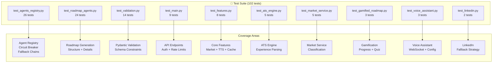
```mermaid
graph TD
    subgraph "🧪 Test Suite (102 tests)"
        AR["test_agents_registry.py<br/>26 tests"]
        RA["test_roadmap_agents.py<br/>24 tests"]
        PV["test_validation.py<br/>14 tests"]
        M["test_main.py<br/>9 tests"]
        F["test_features.py<br/>8 tests"]
        AE["test_ats_engine.py<br/>5 tests"]
        MS["test_market_service.py<br/>5 tests"]
        GR["test_gamified_roadmap.py<br/>3 tests"]
        VA["test_voice_assistant.py<br/>3 tests"]
        LI["test_linkedin.py<br/>2 tests"]
    end

    subgraph "Coverage Areas"
        C1["Agent Registry<br/>Circuit Breaker<br/>Fallback Chains"]
        C2["Roadmap Generation<br/>Structure + Details"]
        C3["Pydantic Validation<br/>Schema Constraints"]
        C4["API Endpoints<br/>Auth + Rate Limits"]
        C5["Core Features<br/>Market + TTS + Cache"]
        C6["ATS Engine<br/>Experience Parsing"]
        C7["Market Service<br/>Classification"]
        C8["Gamification<br/>Progress + Quiz"]
        C9["Voice Assistant<br/>WebSocket + Config"]
        C10["LinkedIn<br/>Fallback Strategy"]
    end

    AR --> C1
    RA --> C2
    PV --> C3
    M --> C4
    F --> C5
    AE --> C6
    MS --> C7
    GR --> C8
    VA --> C9
    LI --> C10
```

---

## 🔄 **CI/CD Pipeline**

### ⚙️ **GitHub Actions Workflow**

```mermaid
flowchart LR
    TRIGGER["📦 Push to main"] --> PARALLEL["⚡ Parallel Jobs"]
    
    subgraph "Frontend Job"
        FN["Node.js 20"]
        FN --> CI["npm ci"]
        CI --> LINT["ESLint Check"]
        LINT --> BUILD["Next.js Build"]
    end
    
    subgraph "Backend Job"
        BP["Python 3.11"]
        BP --> PIP["pip install -r requirements.txt"]
        PIP --> TEST["pytest (102 tests)"]
        TEST --> AUDIT["pip-audit<br/>Security Scan"]
    end
    
    PARALLEL --> FN & BP
    BUILD -->|"✅ Pass"| VERCEL["🚀 Vercel Deploy"]
    TEST -->|"✅ Pass"| RENDER["☁️ Render Deploy"]
    
    style VERCEL fill:#000,color:#fff
    style RENDER fill:#46E3B7,color:#000
```

### 🛡️ **Production Hardening**

| Measure | Description |
|---------|-------------|
| **🔄 Auto-Deploy** | Backend (Render) + Frontend (Vercel) redeploy on `main` pushes |
| **🛡️ OOM Prevention** | Auto-disables ONNX embedding models in 512MB RAM environments |
| **⏰ 48-Hour Locks** | Premium features (interview, full_analysis) protected via Redis TTL |
| **📝 Safe Logging** | Prevents KeyError crashes in JSON-heavy logging payloads |
| **🚫 Production Guards** | Blocks SQLite and default secrets in production environment |
| **✅ Pipeline Integrity** | ESLint + Build + 102 Tests + Security Audit = Merge Gate |

---

## 🔑 **Environment Variables**

### ⚡ **Backend (`backend/.env`)**

| Variable | 🔒 Required | 📋 Default | 💡 Description | 🔗 Source |
|----------|:----------:|-----------|---------------|-----------|
| `LLM_PROVIDER` | ✅ | `groq` | Primary LLM (`groq`, `google`, `nvidia`) | — |
| `GROQ_API_KEY` | ✅ | — | Groq API key (FREE) | [console.groq.com](https://console.groq.com) |
| `GOOGLE_API_KEY` | ✅ | — | Google AI Studio key | [aistudio.google.com](https://aistudio.google.com) |
| `NVIDIA_API_KEY` | ❌ | — | NVIDIA NIM API key | [build.nvidia.com](https://build.nvidia.com) |
| `DATABASE_URL` | ✅ | `sqlite:///./dev.db` | Database connection string | — |
| `SECRET_KEY` | ✅ | — | JWT signing secret (min 32 chars) | — |
| `GOOGLE_CLIENT_ID` | ✅ | — | Google OAuth Client ID | [console.cloud.google.com](https://console.cloud.google.com) |
| `TAVILY_API_KEY` | ❌ | — | Tavily search API | [tavily.com](https://tavily.com) |
| `SERPER_API_KEY` | ❌ | — | Serper Google Search API | [serper.dev](https://serper.dev) |
| `REDIS_URL` | ❌ | `memory://` | Redis connection URL | [upstash.com](https://upstash.com) |
| `APP_ENV` | ❌ | `development` | `development` or `production` | — |

### 💻 **Frontend (`frontend/.env.local`)**

| Variable | 🔒 Required | 💡 Description |
|----------|:----------:|---------------|
| `NEXT_PUBLIC_API_URL` | ✅ | Backend API base URL (e.g., `http://localhost:8000`) |
| `NEXT_PUBLIC_GOOGLE_CLIENT_ID` | ✅ | Google OAuth Client ID |

---

## 📚 **Documentation Index**

| 📄 Document | 📖 Description | 🎯 Best For |
|-------------|---------------|-------------|
| [**README.md**](./README.md) | Project overview, features, setup, architecture | 👋 Everyone starting here |
| [**ARCHITECTURE.md**](./ARCHITECTURE.md) | Detailed system architecture with Mermaid diagrams | 🏗️ Developers, architects |
| [**SYSTEM.md**](./SYSTEM.md) | Comprehensive system design, data flows, internals | 🖥️ Deep technical reference |
| [**API.md**](./API.md) | Complete REST + WebSocket API reference | 🌐 API consumers |
| [**DOCKER_GUIDE.md**](./DOCKER_GUIDE.md) | Docker deployment and configuration guide | 🐳 DevOps, deployment |

---

## 🏆 **Hackathon Achievements**

### 🏆 **Microsoft AI DevDays Hackathon ($480K)**
- ✅ Satisfied all AutoGen agentic pipeline guidelines
- ✅ Implemented multi-agent orchestration with LangGraph
- ✅ Production-grade MVP deployment with CI/CD

### 🏆 **Amazon Nova AI Hackathon ($495K)**
- ✅ Multi-agent execution graphs with fallback chains
- ✅ Audio-enabled interfaces (TTS + Voice Coach)
- ✅ Production deployment on Render/Vercel with Neon/Upstash

---

<div align="center">

---

**Built with 🧠 by [Anil Pradhan](https://github.com/Anil-Pradhan-web)**

| 🏷️ Tag | 🏷️ Tag | 🏷️ Tag | 🏷️ Tag | 🏷️ Tag |
|---------|---------|---------|---------|---------|
| `#LangGraph` | `#NVIDIANIM` | `#GoogleOAuth` | `#RAG` | `#ChromaDB` |
| `#FastAPI` | `#NextJS` | `#Groq` | `#Gemini` | `#GeminiLive` |
| `#WebSocket` | `#VoiceAI` | `#Pytest` | `#Docker` | `#CI/CD` |

---

</div>