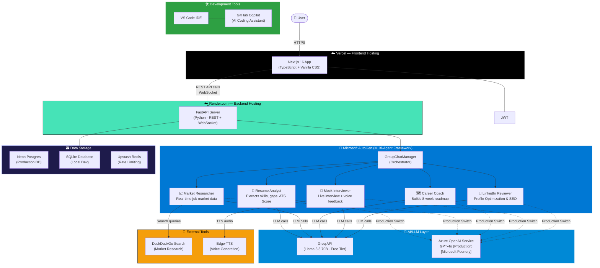

<div align="center">


# 🤖 AI Career Mentor

### *Your personal AI career coach — available 24/7, powered by multi-agent AI*

**Resume Analysis · Personalised Roadmaps · Live Market Intelligence · AI Mock Interviews**

---

[](https://devpost.com)
[](https://microsoft.com)
[](LICENSE)

</div>

---

## 📌 What is AI Career Mentor?

**AI Career Mentor** is a full-stack, production-grade career coaching platform that uses a **5-agent AI system** to give developers and students a complete, personalised career acceleration plan — in under 60 seconds.

Most developers spend months trying to figure out what to learn, where to apply, and how to prepare for interviews. We solve all three — simultaneously — with AI agents that collaborate the same way a team of human experts would.

> **Hackathon submissions:**
> - 🏆 **Microsoft AI Dev Days Hackathon** (Deadline Mar 15, 2026 · $80,000+ prizes) — Microsoft AutoGen + Azure OpenAI/Groq, deployed on **Render + Vercel**
> - 🏆 **Amazon Nova AI Hackathon** (Devpost · Deadline Mar 16, 2026 · $95,000+ prizes) — Submission version using Groq/Azure with architecture designed for Amazon Bedrock integration
>
> 👋 **Built solo by a beginner developer** — every line of backend, frontend, AI agents, and deployment done by one person.

---

## ✨ Core Features

| Feature | What it does | AI Agent Used |
|---------|-------------|---------------|
| 📄 **Resume Analyzer** | Uploads PDF, scores sections, calculates **ATS Score**, flags skill gaps. Saves results to **Database**. | Resume Analyst Agent |
| 📊 **Persistent Dashboard** | Real-time **Skill Radar**, **Day Streaks**, and **Weekly Activity** tracking backed by Postgres. | — |
| 🎤 **Mock Interview Coach** | Live AI interview via WebSocket — asks questions, provides voice feedback via **Edge-TTS**. | Mock Interviewer Agent |
| 🗺️ **Learning Roadmap** | Generates 8-week plans with resources. **History Management** allows reloading past roadmaps. | Career Coach Agent |
| 📈 **Market Intelligence** | Real-time salary ranges, in-demand skills, and hiring trends via DuckDuckGo search. | Market Researcher Agent |
| 🛡️ **Smart Rate Limiting** | Production-grade daily limits for AI features powered by **Upstash Redis**. | — |
| 🔐 **Auth System** | JWT-based register/login + **Google OAuth 2.0** integration | — |

---

## 🏗️ Architecture


```mermaid
flowchart TD
    User(["👤 User"])

    subgraph DevTools ["🛠️ Development Tools"]
        VSCODE["VS Code IDE"] --- COPILOT["GitHub Copilot\n(AI Coding Assistant)"]
    end

    subgraph Vercel ["☁️ Vercel — Frontend Hosting"]
        FE["Next.js 16 App\n(TypeScript + Vanilla CSS)"]
    end

    subgraph Render ["☁️ Render.com — Backend Hosting"]
        API["FastAPI Server\n(Python · REST + WebSocket)"]
    end

    subgraph Agents ["🧠 Microsoft AutoGen (Multi-Agent Framework)"]
        ORCH["GroupChatManager\n(Orchestrator)"]
        A1["📄 Resume Analyst\nExtracts skills, gaps, ATS Score"]
        A2["📈 Market Researcher\nReal-time job market data"]
        A3["🗺️ Career Coach\nBuilds 8-week roadmap"]
        A4["🎤 Mock Interviewer\nLive interview + voice feedback"]
        A5["🔗 LinkedIn Reviewer\nProfile Optimization & SEO"]
    end

    subgraph LLM ["🤖 AI/LLM Layer"]
        GROQ["Groq API\n(Llama 3.3 70B · Free Tier)"]
        AZURE["Azure OpenAI Service\nGPT-4o (Production)\n[Microsoft Foundry]"]
    end

    subgraph Tools ["🔧 External Tools"]
        DDG["DuckDuckGo Search\n(Market Research)"]
        TTS["Edge-TTS\n(Voice Generation)"]
    end

    subgraph DB ["🗃️ Data Storage"]
        POSTGRES["Neon Postgres\n(Production DB)"]
        SQLITE["SQLite Database\n(Local Dev)"]
        REDIS["Upstash Redis\n(Rate Limiting)"]
    end

    User -->|"HTTPS"| FE
    FE -->|"REST API calls\nWebSocket"| API
    API --> ORCH
    ORCH --> A1 & A2 & A3 & A4 & A5
    A1 & A2 & A3 & A4 & A5 -->|"LLM calls"| GROQ
    A1 & A2 & A3 & A4 & A5 -.->|"Production Switch"| AZURE
    A2 -->|"Search queries"| DDG
    A4 -->|"TTS audio"| TTS
    API --> SQLITE
    FE --- JWT

    style Vercel fill:#000,stroke:#fff,color:#fff
    style Render fill:#46E3B7,stroke:#000,color:#000
    style Agents fill:#0078D4,stroke:#fff,color:#fff
    style LLM fill:#0089D6,stroke:#fff,color:#fff
    style DB fill:#1e1b4b,stroke:#818cf8,color:#fff
    style DevTools fill:#2ea043,stroke:#fff,color:#fff
    style Tools fill:#f59e0b,stroke:#000,color:#000
```

**Data Flow Explained:**

1. **Development**: Built with VS Code + GitHub Copilot for accelerated development
2. **Frontend**: User opens the app hosted on **Vercel** (Next.js 16 with TypeScript + Vanilla CSS)
3. **Backend**: API requests hit **Render.com** (FastAPI server with Docker containerization)
4. **Agent Orchestration**: Backend initializes a **Microsoft AutoGen GroupChat** with 5 specialized AI agents
5. **LLM Inference**: Agents use **Groq API (Llama 3.3 70B)** for free development or switch to **Azure OpenAI (GPT-4o)** for production
6. **External Tools**: 
   - Market Researcher uses **DuckDuckGo Search** for real-time job market data
   - Interviewer uses **Edge-TTS** for natural voice feedback
7. **Data Persistence**: User data, activity logs, and AI results stored in **Neon Postgres** (production) or **SQLite** (local).
8. **Rate Limiting**: Daily AI usage tracked via **Upstash Redis** to prevent API abuse.
9. **Authentication**: JWT tokens for session management.

> **Note**: The codebase supports multiple LLM providers via a simple `.env` switch (`LLM_PROVIDER=groq|azure|openai`). The architecture is designed to be cloud-agnostic and can be deployed on AWS, Azure, or any cloud platform.

---

## 🛠️ Tech Stack

### Frontend
| Technology | Purpose |
|-----------|---------|
| **Next.js 16** (App Router) | Full-stack React framework |
| **TypeScript** | Type safety |
| **Vanilla CSS** | Custom design system with CSS variables — no Tailwind |
| **Lucide React** | Icon library |
| **react-hot-toast** | Toast notifications |
| **@monaco-editor/react** | Code editor for interview challenges |
| **react-dropzone** | File upload handling |
| **axios** | HTTP client for API calls |

### Backend
| Technology | Purpose |
|-----------|---------|
| **FastAPI** (Python 3.11) | High-performance REST API + WebSocket server |
| **Microsoft AutoGen** (`ag2` v0.7.5) | Multi-agent GroupChat orchestration |
| **SQLAlchemy + SQLite** | Database ORM with migrations |
| **Alembic** | Database schema versioning |
| **JWT + bcrypt** | Authentication & password hashing |
| **pdfplumber** | PDF resume text extraction |
| **DuckDuckGo Search** | Real-time market research tool for agents |
| **edge-tts** | Text-to-speech for interview voice feedback |
| **Upstash Redis** | High-performance rate limiting |
| **Loguru** | Structured logging |

### AI Providers
| Provider | Model | Used For |
|---------|-------|----------|
| **Groq** | Llama 3.3 70B | 💻 Local dev + hackathon submission (free tier) |
| **Azure OpenAI** | GPT-4o | 🔵 Microsoft AI Dev Days (production) |
| **OpenAI** | GPT-4o-mini | Alternative direct API access |

### DevOps & Infrastructure
| Tool | Purpose |
|------|---------|
| **Docker** | Backend containerization |
| **GitHub Actions** | CI/CD auto-deploy on push to main |
| **Render.com** | Backend hosting (free tier) |
| **Vercel** | Frontend hosting (free tier) |

---

## 🚀 Local Setup

### Prerequisites
- Python **3.11+**
- Node.js **18+**
- One of: Groq API key (free) · Azure OpenAI key · OpenAI API key

### 1. Clone the repo
```bash
git clone https://github.com/Anil-Pradhan/ai-career-mentor.git
cd ai-career-mentor
```

### 2. Backend Setup
```bash
cd backend
python -m venv venv

# Activate virtual environment
venv\Scripts\activate        # Windows
source venv/bin/activate     # macOS / Linux

pip install -r requirements.txt
```

**Create `backend/.env`:**
```env
# ── Choose your AI provider ──────────────────────────────
LLM_PROVIDER=groq            # Options: groq | azure | openai

# ── Groq (FREE — No Credit Card!) ────────────────────────
GROQ_API_KEY=your_groq_key_here
GROQ_MODEL=llama-3.3-70b-versatile

# ── Azure OpenAI (production) ────────────────────────────
AZURE_OPENAI_API_KEY=your_azure_key
AZURE_OPENAI_ENDPOINT=https://your-resource.openai.azure.com/
AZURE_OPENAI_DEPLOYMENT=gpt-4o
AZURE_OPENAI_API_VERSION=2024-02-15-preview

# ── Direct OpenAI (optional) ─────────────────────────────
OPENAI_API_KEY=your_openai_key
OPENAI_MODEL=gpt-4o-mini

# ── App Settings ─────────────────────────────────────────
DATABASE_URL=sqlite:///./dev.db
SECRET_KEY=your_super_secret_jwt_key_here
ACCESS_TOKEN_EXPIRE_MINUTES=60
APP_ENV=development
```

```bash
# Start backend
uvicorn app.main:app --reload
# ✅ API running at http://localhost:8000
# ✅ Swagger docs at http://localhost:8000/docs
```

### 3. Frontend Setup
```bash
cd frontend
npm install

# Create frontend/.env.local
echo NEXT_PUBLIC_API_URL=http://localhost:8000 > .env.local

npm run dev
# ✅ Frontend running at http://localhost:3000
```

---

## 📡 API Reference

| Method | Endpoint | Auth | Description |
|--------|----------|------|-------------|
| `GET` | `/health` | — | System health check with LLM provider info |
| `POST` | `/auth/register` | — | Create new account |
| `POST` | `/auth/login` | — | Login → get JWT token |
| `POST` | `/resume/upload` | ✅ JWT | Upload PDF, extract text |
| `POST` | `/resume/analyze` | ✅ JWT | AI resume scoring & gap analysis |
| `POST` | `/roadmap/generate` | ✅ JWT | Generate 8-week learning roadmap |
| `GET` | `/market/trends` | ✅ JWT | Real-time job market data via DuckDuckGo |
| `POST` | `/linkedin/review` | ✅ JWT | AI LinkedIn profile review & scoring |
| `WS` | `/interview/ws/{session_id}` | ✅ JWT | Live mock interview with voice feedback |
| `POST` | `/career/full-analysis` | ✅ JWT | Full multi-agent GroupChat analysis |

> 📖 Interactive API docs available at `http://localhost:8000/docs` (Swagger UI)

---

## 🧠 How the Multi-Agent System Works

When a user triggers **Full Career Analysis**, this is what happens behind the scenes:

```
User uploads resume + sets target role + location
         ↓
FastAPI receives request → starts AutoGen GroupChat
         ↓
GroupChatManager (Orchestrator) coordinates:
   ├── 🔵 Resume Analyst    → "I see 3 skill gaps: Docker, Kubernetes, System Design"
   ├── 🟢 Market Researcher → "For SDE-2 in Bangalore: ₹18-28 LPA, top skill is Go + K8s"
   ├── 🟣 Career Coach      → "Week 1: Docker fundamentals → resource → mini project"
   ├── 🟠 LinkedIn Reviewer → "Your headline needs more keywords for SEO"
   └── 🔴 Mock Interviewer  → "Here's a system design question based on your gaps..."
         ↓
All agent outputs consolidated → returned to user in < 60 seconds
```

Each agent has a **single responsibility**, talks to the LLM independently, and shares context through AutoGen's GroupChat protocol — exactly like a team of human experts would collaborate.

### The 5 AI Agents

| Agent | Input | Output | Special Capability |
|-------|-------|--------|-------------------|
| **Resume Analyst** | Resume PDF text | `technical_skills`, `soft_skills`, `years_of_experience`, `top_strengths`, `skill_gaps`, `ats_score` | ATS scoring rubric with breakdown |
| **Career Coach** | Target role + skill gaps | 8-week roadmap (JSON array with `topic`, `resource_url`, `mini_project`, `estimated_hours`) | Progressive learning design (foundational → advanced) |
| **Market Researcher** | Role + location | `top_skills`, `salary_range`, `top_companies`, `market_trend` | DuckDuckGo Search integration for live data |
| **LinkedIn Reviewer** | Profile text | `headline_suggestions`, `about_section_feedback`, `profile_score`, `key_keywords` | SEO optimization for tech recruiters |
| **Mock Interviewer** | Role + company | 7 structured questions → final score `/70` | Edge-TTS voice generation for natural speech |

---

## 📁 Project Structure

```
ai-career-mentor/
├── backend/
│   ├── app/
│   │   ├── api/
│   │   │   ├── auth.py          # Register + login endpoints
│   │   │   ├── resume.py        # PDF upload + AI analysis
│   │   │   ├── roadmap.py       # Roadmap generation agent
│   │   │   ├── market.py        # Market trends agent with search
│   │   │   ├── interview.py     # WebSocket mock interview + TTS
│   │   │   ├── linkedin.py      # LinkedIn profile review
│   │   │   └── career.py        # Full multi-agent analysis
│   │   ├── agents/
│   │   │   ├── registry.py      # 5 AutoGen agent definitions
│   │   │   └── workflow.py      # GroupChat orchestration
│   │   ├── core/
│   │   │   ├── config.py        # LLM provider config (Groq/Azure/OpenAI)
│   │   │   ├── security.py      # JWT + bcrypt utilities
│   │   │   ├── database.py      # SQLAlchemy connection
│   │   │   └── voice_engine.py  # Edge-TTS text-to-speech
│   │   ├── models/
│   │   │   ├── models.py        # SQLAlchemy DB models
│   │   │   └── schemas.py       # Pydantic validation schemas
│   │   └── main.py              # FastAPI app entry point
│   ├── alembic/                 # Database migrations
│   ├── tests/                   # Pytest test suite
│   ├── Dockerfile               # Container definition
│   ├── requirements.txt         # Python dependencies
│   └── .env.example             # Environment template
│
├── frontend/
│   ├── src/
│   │   ├── app/
│   │   │   ├── page.tsx         # Landing page
│   │   │   ├── login/           # Login page
│   │   │   ├── register/        # Registration page
│   │   │   └── dashboard/
│   │   │       ├── page.tsx     # Dashboard home
│   │   │       ├── resume/      # Resume analyzer UI
│   │   │       ├── roadmap/     # Career roadmap viewer
│   │   │       ├── market/      # Market trends display
│   │   │       ├── interview/   # Mock interview interface
│   │   │       ├── linkedin/    # LinkedIn reviewer
│   │   │       ├── full-analysis/ # Complete AI analysis
│   │   │       └── settings/    # User preferences
│   │   ├── components/
│   │   │   ├── Sidebar.tsx      # Navigation sidebar
│   │   │   ├── Navbar.tsx       # Top navigation bar
│   │   │   ├── ResumeAnalysisPanel.tsx
│   │   │   ├── UploadResumeCard.tsx
│   │   │   ├── CareerGoalForm.tsx
│   │   │   └── ProgressTracker.tsx
│   │   └── services/
│   │       └── api.ts           # Axios API client
│   └── package.json
│
├── .github/
│   └── workflows/
│       └── backend-deploy.yml   # GitHub Actions CI/CD → Render
├── render.yaml                  # Render.com deployment config
├── package.json                 # Root npm workspace
└── README.md
```

---

## 🌐 Deployment

### Current Deployment (Live)

| Component | Platform | Status | URL |
|-----------|----------|--------|-----|
| **Frontend** | Vercel | ✅ Live | `https://ai-career-mentor.vercel.app` |
| **Backend** | Render.com | ✅ Live | Docker container on free tier |

### CI/CD Pipeline

```yaml
# .github/workflows/backend-deploy.yml
on: push to main branch (backend/)
→ GitHub Actions triggers
→ POST to Render Deploy Hook
→ Render rebuilds Docker container
→ Zero-downtime deployment
```

### Future Migration Paths

The codebase is designed for easy migration to other cloud platforms:

| Target Platform | Changes Required |
|----------------|------------------|
| **AWS** | Change `LLM_PROVIDER=bedrock`, add boto3, deploy to App Runner + Amplify |
| **Azure** | Change `LLM_PROVIDER=azure`, deploy to Azure App Service + Static Web Apps |
| **Google Cloud** | Add Vertex AI support, deploy to Cloud Run |

---

## 🔐 Environment Variables Summary

```env
# ── Which AI to use ──────────────────────────────────────
LLM_PROVIDER=groq | azure | openai

# ── Groq (FREE — Recommended for dev) ────────────────────
GROQ_API_KEY=gsk_xxx
GROQ_MODEL=llama-3.3-70b-versatile

# ── Azure OpenAI (production) ────────────────────────────
AZURE_OPENAI_API_KEY=xxx
AZURE_OPENAI_ENDPOINT=https://xxx.openai.azure.com/
AZURE_OPENAI_DEPLOYMENT=gpt-4o
AZURE_OPENAI_API_VERSION=2024-02-15-preview

# ── Direct OpenAI (alternative) ──────────────────────────
OPENAI_API_KEY=sk-xxx
OPENAI_MODEL=gpt-4o-mini

# ── Google OAuth ──────────────────────────────────────────
GOOGLE_CLIENT_ID=your_google_client_id
GOOGLE_CLIENT_SECRET=your_google_client_secret

# ── Core App Settings ────────────────────────────────────
DATABASE_URL=sqlite:///./dev.db
SECRET_KEY=<strong-random-key>
ACCESS_TOKEN_EXPIRE_MINUTES=60
APP_ENV=development
```

> ⚠️ **Never commit `.env` to GitHub.** Use `.env.example` as the template.

---

## 🧪 Testing

Run the test suite:

```bash
cd backend
source venv/bin/activate  # or venv\Scripts\activate on Windows
pytest tests/ -v
```

**Test Coverage:**
- ✅ Root endpoint returns welcome message
- ✅ Health check returns LLM provider status
- ✅ Protected routes require JWT authentication
- ✅ Market trends endpoint enforces auth

---

## 🏆 Hackathon Submissions

### 🟠 Amazon Nova AI Hackathon

| Detail | Info |
|--------|------|
| **Platform** | Devpost |
| **Deadline** | March 16, 2026 @ 8:00 PM EDT |
| **Prize Pool** | $40,000 cash + $55,000 AWS Credits |
| **Categories** | Agentic AI ($10K) · Voice AI ($10K) |

**Submission Approach:**
- ✅ **Agentic AI** — 5 AutoGen agents powered by Groq/Azure (architecture ready for Amazon Nova via LiteLLM bridge)
- ✅ **Voice AI** — Mock interview with Edge-TTS voice feedback (can migrate to Nova 2 Sonic)
- ✅ **Full-stack implementation** — Production-ready codebase with auth, database, and polished UI

---

### 🔵 Microsoft AI Dev Days Hackathon

| Detail | Info |
|--------|------|
| **Platform** | Microsoft Innovation Studio |
| **Dates** | Feb 10 – March 15, 2026 |
| **Prize Pool** | $80,000+ total |
| **Grand Prize** | $20,000 × 2 (Best Overall + Best Agentic DevOps) |
| **Category Prizes** | $10,000 × 2 (Microsoft Foundry · Best Enterprise) |

**Requirements Met:**
- ✅ **Microsoft AutoGen** — Multi-agent GroupChat with 5 specialized agents
- ✅ **Azure OpenAI GPT-4o** — Production LLM via Azure (Microsoft Foundry compatible)
- ✅ **Deployed on Cloud** — Backend on Render, frontend on Vercel (Azure-migration ready)
- ✅ **Public GitHub repo** — Clean, well-documented codebase
- ✅ **VS Code + GitHub Copilot** — Developed with Copilot assistance
- ✅ **Real-world impact** — Democratizes career coaching for millions of students

**Why This Project Stands Out:**
- ✅ End-to-end production system (auth, DB, full UI) — not a notebook demo
- ✅ 5 specialised agents collaborating in real GroupChat — genuine agentic behaviour
- ✅ Career coaching is a $4B+ market — clear real-world problem being solved
- ✅ Solo developer building what most teams can't — judges love the ambition

---

## 👤 Team

| Name | Role | Contact |
|------|------|---------|
| **Anil Pradhan** | Full-Stack Solo Developer | ap2019039@gmail.com |

> *Built solo — frontend, backend, AI agents, cloud deployment, and UI/UX — all by one developer.*
> *[GitHub Copilot used extensively for development acceleration]*

---

## 🙏 Acknowledgements

- **Microsoft AutoGen** team for the multi-agent framework
- **Groq** for free-tier Llama 3.3 70B inference during development
- **Azure OpenAI** for production-grade GPT-4o access
- **Edge-TTS** for natural voice generation in mock interviews
- **DuckDuckGo Search** for real-time job market data
- The open-source community behind FastAPI, Next.js, SQLAlchemy, and pdfplumber

---

<div align="center">

**Built with ❤️ by [Anil Pradhan](https://github.com/Anil-Pradhan) — March 2026**

*Submitted to: Amazon Nova AI Hackathon · Microsoft AI Dev Days Hackathon*

`#AutoGen` `#MultiAgent` `#CareerTech` `#AgenticAI` `#FastAPI` `#NextJS`

</div>
