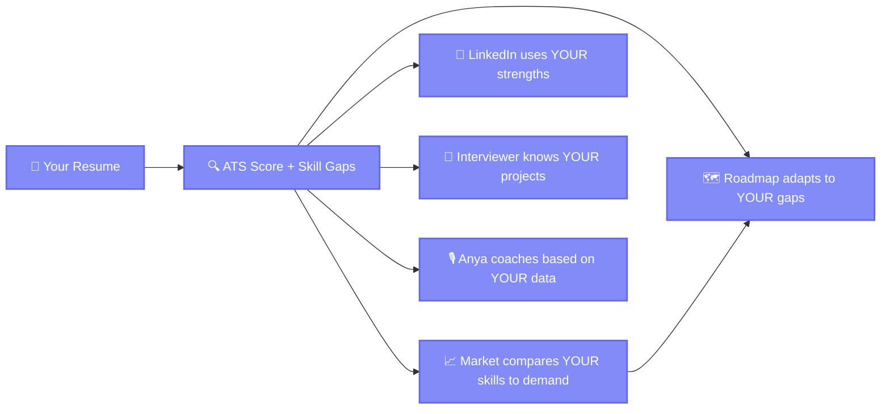
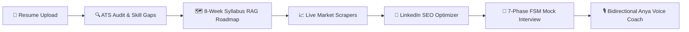
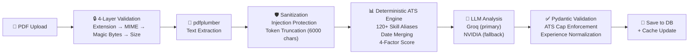
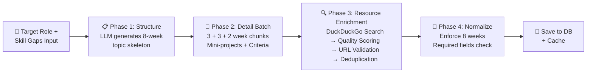
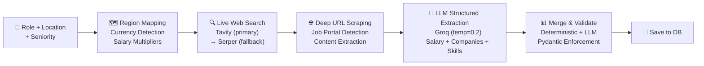
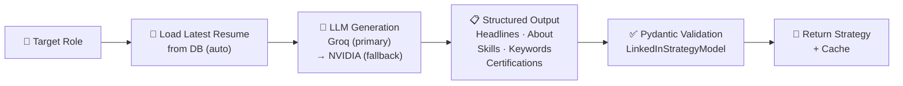
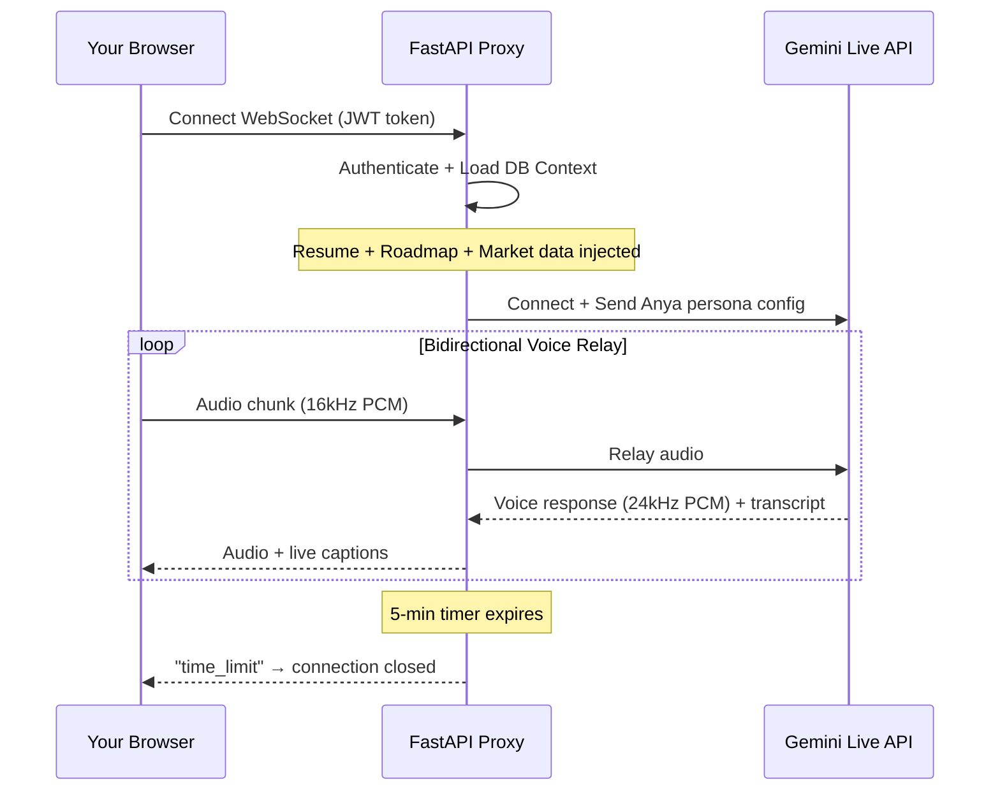
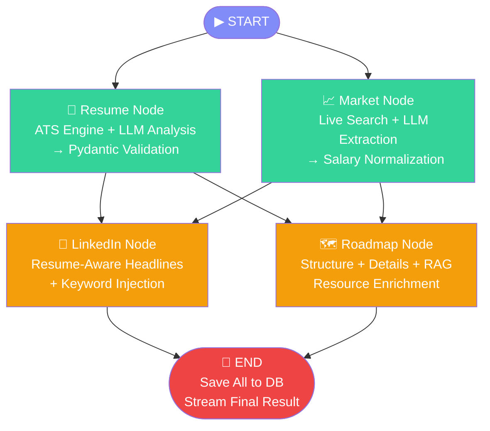
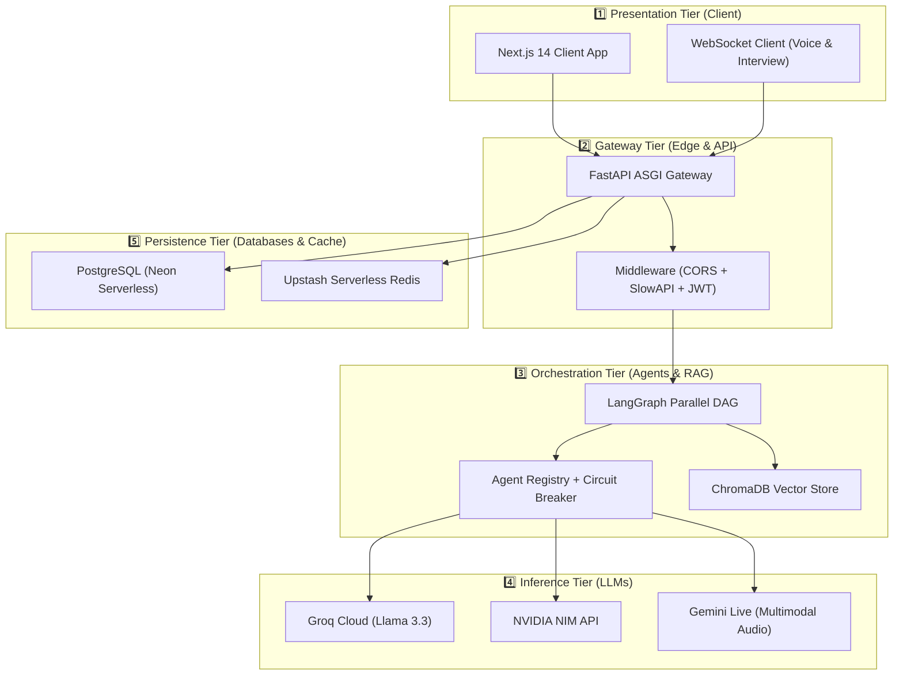
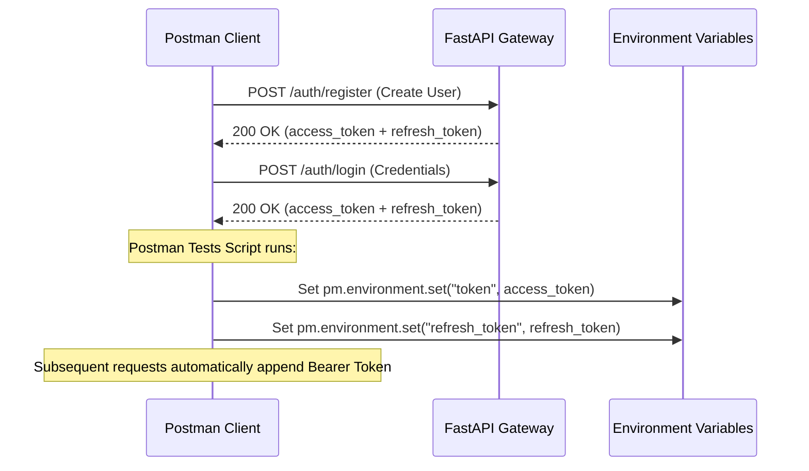

<div align="center">

```
  █████╗ ██╗     ██████╗  █████╗  ██████╗  ███████╗ ███████╗ ██████╗ 
 ██╔══██╗██║    ██╔════╝ ██╔══██╗ ██╔══██╗ ██╔════╝ ██╔════╝ ██╔══██╗
 ███████║██║    ██║      ███████║ ██████╔╝ █████╗   █████╗   ██████╔╝
 ██╔══██║██║    ██║      ██╔══██║ ██╔══██╗ ██╔══╝   ██╔══╝   ██╔══██╗
 ██║  ██║██║    ╚██████╗ ██║  ██║ ██║  ██║ ███████╗ ███████╗ ██║  ██║
 ╚═╝  ╚═╝╚═╝     ╚═════╝ ╚═╝  ╚═╝ ╚═╝  ╚═╝ ╚══════╝ ╚══════╝ ╚═╝  ╚═╝

 ███╗   ███╗ ███████╗ ███╗   ██╗ ████████╗  ██████╗  ██████╗ 
 ████╗ ████║ ██╔════╝ ████╗  ██║ ╚══██╔══╝ ██╔═══██╗ ██╔══██╗
 ██╔████╔██║ █████╗   ██╔██╗ ██║    ██║    ██║   ██║ ██████╔╝
 ██║╚██╔╝██║ ██╔══╝   ██║╚██╗██║    ██║    ██║   ██║ ██╔══██╗
 ██║ ╚═╝ ██║ ███████╗ ██║ ╚████║    ██║    ╚██████╔╝ ██║  ██║
 ╚═╝     ╚═╝ ╚══════╝ ╚═╝  ╚═══╝    ╚═╝     ╚═════╝  ╚═╝  ╚═╝
```

### ✦ **7 Specialized AI Workflows. 1 Career Transformation.** ✦

> 🎯 **Resume Intelligence** · 🗺️ **Personalized Roadmaps** · 📈 **Live Market Intel** · 🎤 **Streaming Mock Interviews** · 🎙️ **Real-time AI Voice Coach** · 🔗 **LinkedIn Optimization** · 🧠 **Full Career Analysis**

<br/>


<br/>

[](https://ai-career-mentor-anil.vercel.app)
[](https://ai-career-mentor-rrpu.onrender.com/docs)
[](https://microsoft.com)
[](https://devpost.com)
[](./documentation/ARCHITECTURE.md)
[](./documentation/SYSTEM.md)

</div>

---

## 📑 **Table of Contents**

| # | Section | 🔗 |
|---|---------|-----|
| 1 | [🧭 What is AI CAREER MENTOR?](#what-is-ai-career-mentor) | Project Overview |
| 2 | [❗ The Problem](#the-problem-career-transitions-are-broken) | Problem Statement & Pain Points |
| 3 | [🎯 Who Faces This Problem?](#who-faces-this-problem) | Target Audience |
| 4 | [🏆 Competitive Landscape](#competitive-landscape-what-exists-today) | Market Analysis & Tool Comparison |
| 5 | [💡 How We Uniquely Solve This](#how-ai-career-mentor-uniquely-solves-this) | Differentiators & USP |
| 6 | [🚀 The 7 AI Workflows](#the-7-specialized-ai-workflows) | Detailed Pipeline Walkthroughs |
| 7 | [📊 Key Numbers at a Glance](#key-numbers-at-a-glance) | Metrics & Stats |
| 8 | [🏗️ System Architecture Overview](#system-architecture-overview) | High-Level Design |
| 9 | [🛠️ Complete Tech Stack and Tooling](#complete-tech-stack-and-tooling) | Full Stack Details |
| 10 | [🔄 CI/CD Pipeline and Docker](#cicd-pipeline-and-docker) | GitHub Actions + Docker |
| 11 | [📁 Complete Project Structure](#complete-project-structure) | Deep Tree |
| 12 | [🧪 Testing and API Validation](#testing-and-api-validation) | 114 Pytest + Postman Suite |
| 13 | [🚀 Local Setup Guide](#local-setup-guide) | 5-Minute Setup |
| 14 | [🚦 Rate Limits and Cooldowns](#rate-limits-and-cooldowns) | Daily Caps and Gap Locks |
| 15 | [🔑 Environment Variables](#environment-variables) | Config Reference |
| 16 | [📚 Documentation Index](#documentation-index) | All Docs |
| 17 | [🏆 Hackathon Submits](#hackathon-achievements) | Participation |

---

<a id="what-is-ai-career-mentor"></a>
## 🧭 **What is AI CAREER MENTOR?**

**AI CAREER MENTOR** is a production-grade, enterprise-ready **Career Orchestration OS** 🤖 designed to fast-track developer career transitions. By combining **LangGraph multi-agent systems**, **vector-search RAG retrieval**, and **real-time full-duplex WebSocket protocols**, it automates the entire career transition pipeline—from initial ATS auditing to live multimodal voice coaching.

---

### ❗ **The Problem: Career Transitions Are Broken**

Breaking into tech — or switching roles within it — is one of the most frustrating experiences a developer can go through. The process is **fragmented**, **expensive**, and **overwhelming**.

**The reality in numbers:**

| 📊 Statistic | 🔍 Source |
|:---|:---|
| Average developer job search duration: **5–6 months** | Industry hiring reports (2024–2025) |
| Junior developer job postings dropped **23%** year-over-year | U.S. developer hiring data |
| Typical hiring pipeline: **6–16 weeks** from application to offer | Software Placements |
| AI Engineer job postings surged **143%** since May 2024 | Ravio compensation data |
| Companies now receive **250+ applications per role** due to one-click apply fatigue | Dice.com hiring insights |

**What developers actually struggle with:**

| 😰 Pain Point | 🧩 The Frustrating Reality |
|:---|:---|
| **"My resume gets zero callbacks"** | 75% of resumes are rejected by ATS bots before a human ever sees them. Developers don't know which keywords they're missing for their target role. |
| **"I don't know what to learn next"** | Roadmaps on the internet are generic ("Learn React"). They don't account for YOUR existing skills, gaps, or target role's actual market demand. |
| **"I have no idea what companies are paying"** | Salary data is scattered across Glassdoor, Levels.fyi, and LinkedIn — all requiring accounts, all showing conflicting numbers, none normalized to your currency. |
| **"My LinkedIn profile gets no recruiter views"** | Most profiles read like resumes, not search-optimized landing pages. Developers don't know which keywords recruiters actually search for. |
| **"I freeze in interviews"** | Mock interview platforms either cost $179–$300/session (Interviewing.io) or offer generic AI Q&A with no context about YOUR background. |
| **"I can't afford a career coach"** | Professional career coaching costs $150–$500/hour. AI tools like BetterUp charge $100+/month. Free tools only solve one piece of the puzzle. |

---

### 🎯 **Who Faces This Problem?**

| 👤 Target User | 🔍 Their Specific Pain |
|:---|:---|
| **🎓 Fresh CS Graduates** | Have strong fundamentals but no production experience. ATS rejects them because their resumes lack industry keywords. Don't know what "production-ready" skills to learn. Need structured roadmaps, not YouTube playlists. |
| **💻 Self-Taught & Bootcamp Devs** | Know how to code but struggle with system design, testing, and DevOps — the skills that differentiate entry-level from hire-able. LinkedIn profiles don't reflect their true capabilities. |
| **🔄 Career Switchers (Non-CS → Tech)** | Former analysts, mechanical engineers, or finance professionals transitioning to tech. Need to map existing skills to tech roles and understand what gaps to fill first. |
| **📈 Mid-Level Devs Aiming for Senior** | Stuck at the "mid-level plateau." Know the frameworks but lack system design depth, leadership narratives, and FAANG-caliber interview fluency. |
| **🌏 International Developers** | Targeting global remote jobs but lack location-aware salary benchmarks, region-specific hiring trends, and culturally-adapted LinkedIn strategies. |
| **🧠 AI/ML Engineers (High Demand, High Bar)** | The fastest-growing segment (143% YoY), but interviews are uniquely challenging — combining coding, ML theory, system design, and research paper discussions. |

---

### 🏆 **Competitive Landscape: What Exists Today**

The market is **fragmented**. No single platform solves the full career transition lifecycle. Each tool handles one piece — and developers must juggle 5–7 different tools, each with its own subscription:

| 🏷️ Tool | 💰 Pricing | 📄 Resume | 🗺️ Roadmap | 📈 Market Intel | 🔗 LinkedIn | 🎤 Interview | 🎙️ Voice | 🧠 Unified Pipeline |
|:---|:---:|:---:|:---:|:---:|:---:|:---:|:---:|:---:|
| **Jobscan** | $49.95/mo | ✅ ATS keywords | ❌ | ❌ | ❌ | ❌ | ❌ | ❌ |
| **TealHQ** | $29/mo | ✅ Builder | ❌ | ❌ | ❌ | ❌ | ❌ | ❌ |
| **Kickresume** | $19/mo | ✅ Templates | ❌ | ❌ | ❌ | ❌ | ❌ | ❌ |
| **Rezi** | $29/mo | ✅ AI rewrite | ❌ | ❌ | ❌ | ❌ | ❌ | ❌ |
| **VMock** | Institutional | ✅ Scoring | ❌ | ❌ | ✅ Basic | ❌ | ❌ | ❌ |
| **Careerflow** | $39/mo | ✅ Analysis | ❌ | ❌ | ✅ Optimization | ❌ | ❌ | ❌ |
| **Levels.fyi** | Free/Paid | ❌ | ❌ | ✅ Salary only | ❌ | ❌ | ❌ | ❌ |
| **Roadmap.sh** | Free | ❌ | ✅ Generic | ❌ | ❌ | ❌ | ❌ | ❌ |
| **Pramp** | Free/Paid | ❌ | ❌ | ❌ | ❌ | ✅ Peer-to-peer | ❌ | ❌ |
| **Interviewing.io** | $179–300/session | ❌ | ❌ | ❌ | ❌ | ✅ Expert human | ❌ | ❌ |
| **Yoodli** | $8–20/mo | ❌ | ❌ | ❌ | ❌ | ✅ AI speech | ✅ Basic | ❌ |
| **Prentus** | Institutional | ✅ Basic | ❌ | ❌ | ❌ | ✅ AI advisor | ❌ | ❌ |
| **BetterUp** | $100+/mo | ❌ | ❌ | ❌ | ❌ | ❌ | ❌ | ❌ |
| 🚀 **AI Career Mentor** | **Free & Open-Source** | ✅ **Hybrid ATS + LLM** | ✅ **8-Week RAG** | ✅ **Live Scraping** | ✅ **Resume-Aware** | ✅ **7-Phase FSM** | ✅ **Gemini Live** | ✅ **LangGraph DAG** |

> **The bottom line:** Developers currently need to subscribe to **$200–$500/month** worth of fragmented SaaS tools to cover resume optimization, interview prep, market research, LinkedIn coaching, and career roadmapping. And even then, none of these tools talk to each other — your resume analysis doesn't inform your roadmap, your roadmap doesn't adapt to market demand, and your interview prep has no context about YOUR skills.

---

### 💡 **How AI CAREER MENTOR Uniquely Solves This**

AI Career Mentor is the **first open-source platform to unify all 7 career workflows into a single, interconnected system** where each agent's output feeds into the next:


```mermaid
graph LR
    classDef unique fill:#818cf8,color:#fff,stroke:#6366f1,stroke-width:2px

    A["📄 Your Resume"] --> B["🔍 ATS Score + Skill Gaps"]
    B --> C["🗺️ Roadmap adapts to YOUR gaps"]
    B --> D["📈 Market compares YOUR skills to demand"]
    B --> E["🔗 LinkedIn uses YOUR strengths"]
    D --> C
    B --> F["🎤 Interviewer knows YOUR projects"]
    B --> G["🎙️ Anya coaches based on YOUR data"]

    class A,B,C,D,E,F,G unique
```

| 🔑 Differentiator | 🔍 What Makes It Unique |
|:---|:---|
| **🔄 Interconnected Intelligence** | Your resume analysis feeds into your roadmap (targets YOUR skill gaps), your market data tunes your roadmap (focuses on in-demand skills), your LinkedIn strategy uses YOUR resume strengths, and your interview prep loads YOUR projects. No other tool does this. |
| **🆓 100% Free & Open-Source** | No subscriptions. No paywalls. No "upgrade to pro" bait. Self-host it, fork it, customize it. Uses free-tier LLMs (Groq) — zero API cost for the user. |
| **🎙️ Multimodal Voice Coaching** | The only career platform with a **real-time, bidirectional Hinglish voice coach** (Anya) powered by Gemini Live's native audio model — not text-to-speech, but actual conversational AI that adapts to YOUR resume data in real-time. |
| **🎤 Context-Aware Mock Interviews** | Unlike Pramp (peer-based, no context) or Interviewing.io ($300/session), our interview engine loads YOUR resume, adapts questions to YOUR role category (7 categories), scales difficulty by company tier (FAANG/startup), and provides a real code editor for live coding — all via a persistent WebSocket with audio feedback. |
| **📈 Live Market Intelligence** | Not a static salary database like Levels.fyi. Scrapes live job boards (Tavily/Serper/DDG) in real-time, normalizes salaries to your local currency (INR/USD/EUR/GBP/AED/SGD/AUD), and classifies hiring volume — updated every time you run it. |
| **🗺️ Personalized RAG Roadmaps** | Not generic "Learn React → Build projects" advice like Roadmap.sh. Generates an 8-week syllabus using YOUR skill gaps + market demand, enriched with quality-scored YouTube, GitHub, and documentation links verified for HTTP reachability. Includes gamified quizzes per week. |
| **🧠 Parallel Agent Orchestration** | The Full Career Analysis runs 4 agents simultaneously via LangGraph DAG (Resume + Market → LinkedIn + Roadmap), reducing total latency from ~4 minutes to ~60 seconds while streaming real-time progress via SSE. |
| **🏗️ Production-Grade Architecture** | Not a demo or hackathon prototype. 114 Pytest tests, GitHub Actions CI/CD, multi-stage Docker builds, PostgreSQL + Redis in production, Pydantic validation at every layer, circuit breakers, and Sentry observability. |

---

### 🎯 **The Value Proposition: 6 Months vs. 6 Minutes**

Traditional career transitions are exhausting. Developers waste months reading disjointed roadmaps, guessing ATS keywords, analyzing salary benchmarks, and practicing mock interviews with static cards. 

**AI CAREER MENTOR automates this entire lifecycle in under 6 minutes:**


```mermaid
flowchart LR
    A["📄 Resume Upload"] --> B["🔍 ATS Audit & Skill Gaps"]
    B --> C["🗺️ 8-Week Syllabus RAG Roadmap"]
    C --> D["📈 Live Market Scrapers"]
    D --> E["🔗 LinkedIn SEO Optimizer"]
    E --> F["🎤 7-Phase FSM Mock Interview"]
    F --> G["🎙️ Bidirectional Anya Voice Coach"]
```

---

### 🚀 **The 7 Specialized AI Workflows**

At the core of the platform are **7 highly-optimized AI workflows** designed to operate either independently or as a unified orchestration DAG:

| # | 🚦 Workflow | 🚇 Transport | ⚙️ Engine | 🎯 What It Does |
|---|-------------|-------------|-----------|-----------------|
| 1 | **📄 Resume Intelligence** | `REST` | Deterministic ATS + LLM Hybrid | 4-layer PDF validation → ATS scoring → LLM skill extraction → Pydantic validation |
| 2 | **🗺️ Career Roadmap Builder** | `REST` | LangGraph + RAG + Groq/NVIDIA | 8-week personalized syllabus → ChromaDB enrichment → DuckDuckGo resource search |
| 3 | **📈 Market Explorer** | `REST` | Tavily/Serper + Groq LLM | Live job board scraping → salary normalization → region-aware trend analysis |
| 4 | **🔗 LinkedIn Optimizer** | `REST` | Groq/NVIDIA + Programmatic Fallback | Resume-aware headline rewriting → ATS keyword injection → recruiter trend mapping |
| 5 | **🎤 Mock Interview Engine** | `🔌 WebSocket` | 7-Phase FSM + Groq/NVIDIA | Real-time interview simulation → Monaco code editor → edge-tts voice feedback |
| 6 | **🎙️ Anya Voice Coach** | `🔌 WebSocket` | Gemini Live Multimodal API | Full-duplex Hinglish voice calls → DB context injection → 5-min session cap |
| 7 | **🧠 Full Career Analysis** | `SSE Stream` | LangGraph Parallel DAG | Fan-out 4 agents in parallel → stream real-time logs → aggregate final report |

---

### 📄 **Workflow 1 — Resume Intelligence**

> **Endpoint**: `POST /resume/analyze` · **Transport**: REST · **Rate Limit**: 2/day

**🧑‍💻 How the User Uses It:**
Upload your PDF resume → the system instantly extracts text, runs a deterministic ATS audit, then sends the content to an LLM for deep skill extraction → you get a complete analysis with an ATS score, skill gaps, strengths, and experience breakdown.


```mermaid
flowchart LR
    A["📁 PDF Upload"] --> B["🔒 4-Layer Validation
    Extension → MIME → Magic Bytes → Size"]
    B --> C["📄 pdfplumber
    Text Extraction"]
    C --> D["🛡️ Sanitization
    Injection Protection
    Token Truncation (6000 chars)"]
    D --> E["📊 Deterministic ATS Engine
    120+ Skill Aliases
    Date Merging
    4-Factor Score"]
    E --> F["🤖 LLM Analysis
    Groq (primary)
    NVIDIA (fallback)"]
    F --> G["✅ Pydantic Validation
    ATS Cap Enforcement
    Experience Normalization"]
    G --> H["💾 Save to DB
    + Cache Update"]
```

**🔧 Technical Highlights:**
- **Hybrid Scoring**: Combines a rules-based ATS engine (keyword matching, action verb detection, date range merging) with LLM-powered semantic analysis for nuanced gap detection
- **4-Layer PDF Validation**: File extension → MIME type → magic bytes (`%PDF-`) → size check (max 5MB) prevents malicious uploads
- **Prompt Injection Protection**: Strips `{}`, triple backticks, and normalizes whitespace before sending to LLM
- **RAG Pipeline Integration**: When a target role is specified, injects gold-standard skills, common toolchains, and experience benchmarks from `resume_rag_pipeline.json` into the LLM prompt
- **Provider Fallback**: Tries Groq first (free, fast) → auto-falls back to NVIDIA NIM on failure

---

### 🗺️ **Workflow 2 — Career Roadmap Builder**

> **Endpoint**: `POST /roadmap/generate` · **Transport**: REST · **Rate Limit**: 1 / 3 days (gap lock)

**🧑‍💻 How the User Uses It:**
Choose your target role (e.g. "Backend Engineer"), select skill gaps, experience level, and learning style → the system builds a personalized 8-week learning syllabus with real YouTube videos, GitHub repos, and official docs → track progress week-by-week and take AI-generated quizzes.


```mermaid
flowchart LR
    A["🎯 Target Role +
    Skill Gaps Input"] --> B["📋 Phase 1: Structure
    LLM generates 8-week
    topic skeleton"]
    B --> C["📝 Phase 2: Detail Batch
    3 + 3 + 2 week chunks
    Mini-projects + Criteria"]
    C --> D["🔍 Phase 3: Resource Enrichment
    DuckDuckGo Search
    → Quality Scoring
    → URL Validation
    → Deduplication"]
    D --> E["📐 Phase 4: Normalize
    Enforce 8 weeks
    Required fields check"]
    E --> F["💾 Save to DB
    + Cache"]
```

**🔧 Technical Highlights:**
- **3-Phase LLM Generation**: Structure skeleton → Detail batch (3+3+2 chunk pattern for token efficiency) → Resource enrichment
- **Parallel Resource Enrichment**: Uses `ThreadPoolExecutor` to search DuckDuckGo for YouTube, GitHub, articles, and official docs concurrently across all 8 weeks
- **Quality-Weighted Search**: Each URL is scored against a domain quality map (e.g. `roadmap.sh: 40`, `github.com: 25`, `medium.com: 5`), validated for HTTP reachability, and deduplicated
- **ChromaDB RAG Fallback**: On Render (512MB RAM), auto-switches from ChromaDB vector similarity to a keyword-matching fallback to prevent OOM crashes
- **Gamified Quizzes**: Each week has a `/roadmap/{id}/quiz/{week}` endpoint generating 5 AI-powered MCQ questions with explanations (3 quizzes/day limit)
- **Progress Tracking**: Toggle week completion with `PUT /roadmap/{id}/toggle-week/{week}`, tracked in the database

---

### 📈 **Workflow 3 — Market Explorer**

> **Endpoint**: `GET /market/trends` · **Transport**: REST · **Rate Limit**: 2/day

**🧑‍💻 How the User Uses It:**
Select your target role and location (e.g. "Data Scientist" in "Bangalore, India") → the system scrapes live job boards, normalizes salary ranges to local currency, identifies top hiring companies, and surfaces the most in-demand skills for that region.


```mermaid
flowchart LR
    A["🎯 Role + Location
    + Seniority"] --> B["🗺️ Region Mapping
    Currency Detection
    Salary Multipliers"]
    B --> C["🔍 Live Web Search
    Tavily (primary)
    → Serper (fallback)"]
    C --> D["🌐 Deep URL Scraping
    Job Portal Detection
    Content Extraction"]
    D --> E["🤖 LLM Structured Extraction
    Groq (temp=0.2)
    Salary + Companies + Skills"]
    E --> F["📊 Merge & Validate
    Deterministic + LLM
    Pydantic Enforcement"]
    F --> G["💾 Save to DB"]
```

**🔧 Technical Highlights:**
- **Deterministic + LLM Hybrid**: Region-aware salary bands and currency mapping are computed deterministically, then merged with LLM-extracted hiring trends for accuracy
- **Multi-Search Fallback Chain**: Tavily API (primary, agentic search) → Serper API (Google search fallback) → DuckDuckGo (free, zero-key fallback)
- **URL Classification**: Each scraped URL is classified as `job_portal`, `blog`, or `other` — job portal results get priority weighting
- **Global Currency Mapping**: Automatically detects location-based currency (INR, USD, GBP, EUR, AED, SGD, AUD) and applies region-specific salary multipliers based on seniority level
- **History Tracking**: All analyses are saved to the database and browsable via `GET /market/history`

---

### 🔗 **Workflow 4 — LinkedIn Optimizer**

> **Endpoint**: `POST /linkedin/optimize` · **Transport**: REST · **Rate Limit**: 4/day

**🧑‍💻 How the User Uses It:**
Enter your target role → the system loads your latest resume analysis from the database → generates 3 optimized LinkedIn headlines, a complete "About" section, trending recruiter keywords, in-demand skills, and recommended certifications — all tailored to your actual profile.


```mermaid
flowchart LR
    A["🎯 Target Role"] --> B["📄 Load Latest Resume
    from DB (auto)"]
    B --> C["🤖 LLM Generation
    Groq (primary)
    → NVIDIA (fallback)"]
    C --> D["📋 Structured Output
    Headlines · About
    Skills · Keywords
    Certifications"]
    D --> E["✅ Pydantic Validation
    LinkedInStrategyModel"]
    E --> F["📨 Return Strategy
    + Cache"]
```

**🔧 Technical Highlights:**
- **Resume-Aware Context**: Automatically queries the database for your latest resume analysis and injects skills, strengths, gaps, and experience into the LLM prompt — your LinkedIn strategy is personalized, not generic
- **ATS Keyword Injection**: Surfaces high-frequency recruiter search terms (e.g. "Scalability", "Distributed Systems", "CI/CD") to inject into your profile for maximum search visibility
- **Programmatic Fallback**: If the LLM fails, a deterministic fallback generates a basic strategy using your resume skills + target role keywords
- **3 Headline Variants**: Each optimized with emoji, action verbs, and high-converting keyword density patterns used by top LinkedIn profiles

---

### 🎤 **Workflow 5 — Mock Interview Engine**

> **Endpoint**: `WebSocket /interview/ws/{session_id}` · **Transport**: Full-Duplex WebSocket · **Rate Limit**: 1 session / 4 days (gap lock)

**🧑‍💻 How the User Uses It:**
Select your target company (Google, Amazon, Meta, etc.), role, and interview type (technical/behavioral) → connect to a real-time WebSocket session → the AI interviewer asks you questions phase-by-phase → you type answers and write code in the built-in Monaco Editor → at the end, receive a detailed performance scorecard with strengths, weaknesses, and actionable advice.


```mermaid
stateDiagram-v2
    direction LR
    [*] --> INTRO : Connection Established
    INTRO --> CORE_THEORY : "Tell me about yourself"
    CORE_THEORY --> HANDS_ON : CS Fundamentals / ML Theory
    HANDS_ON --> PAST_EXP : Coding Challenge / Case Study
    PAST_EXP --> ARCH_DESIGN : Resume Deep-Dive
    ARCH_DESIGN --> BIZ_DOMAIN : System Design / ML Pipeline
    BIZ_DOMAIN --> CLOSING : Business Problem
    CLOSING --> FEEDBACK : "Any questions for me?"
    FEEDBACK --> [*] : Score + Report → DB
```

**🔧 Technical Highlights:**
- **7-Phase Finite State Machine (FSM)**: Each interview progresses through INTRO → CORE_THEORY → HANDS_ON_CHALLENGE → PAST_EXPERIENCE → ARCHITECTURE_DESIGN → BUSINESS_DOMAIN → CLOSING → FEEDBACK. State transitions happen automatically after each Q&A exchange
- **Resume-Aware Personalization**: On connection, the backend loads your latest resume from the database and injects your skills, projects, and experience into the interviewer's system prompt — Phase 4 specifically deep-dives into YOUR projects and achievements
- **7 Role Categories**: The interview adapts its questions based on your role category — SWE gets LeetCode problems, Data/AI gets ML case studies, Infra/Cloud gets K8s troubleshooting, Security gets threat modeling, and more
- **Company Tier Difficulty Scaling**: FAANG-tier companies get harder questions than startups. Company-specific styles (Google GCA, Amazon LP, Microsoft AZ) customize the behavioral focus
- **Real-Time Audio (edge-tts)**: The interviewer's text is synthesized into MP3 audio fragments in real-time using `en-US-AndrewNeural` voice and streamed word-by-word to the client
- **Monaco Code Editor**: During Phase 3 (Coding Challenge), candidates can write and submit code via `code_update` messages, which the interviewer evaluates for correctness and complexity
- **Keepalive Ping-Pong**: Clients send `__ping__` every 30 seconds to prevent cloud proxy timeouts on Render

---

### 🎙️ **Workflow 6 — Anya Voice Coach**

> **Endpoint**: `WebSocket /career/voice-assistant/ws` · **Transport**: Full-Duplex WebSocket · **Rate Limit**: 2 calls/day, 5-min max per session

**🧑‍💻 How the User Uses It:**
Click the voice assistant button → your microphone captures audio in real-time → Anya (a sweet, Hinglish-speaking AI career coach) responds with voice, personalized to YOUR resume, roadmap progress, and local job market data → ask her anything about your career, skills, interview prep, or job search strategy.


```mermaid
sequenceDiagram
    participant You as Your Browser
    participant Server as FastAPI Proxy
    participant Anya as Gemini Live API

    You->>Server: Connect WebSocket (JWT token)
    Server->>Server: Authenticate + Load DB Context
    Note over Server: Resume + Roadmap + Market data injected
    Server->>Anya: Connect + Send Anya persona config
    
    loop Bidirectional Voice Relay
        You->>Server: Audio chunk (16kHz PCM)
        Server->>Anya: Relay audio
        Anya-->>Server: Voice response (24kHz PCM) + transcript
        Server-->>You: Audio + live captions
    end

    Note over Server: 5-min timer expires
    Server-->>You: "time_limit" → connection closed
```

**🔧 Technical Highlights:**
- **Gemini Multimodal Live API**: Uses `gemini-2.5-flash-native-audio-latest` model with `Aoede` prebuilt voice for natural spoken rhythm — not a text-to-speech wrapper, but native audio generation
- **Database-Backed Context Injection**: Before connecting to Gemini, the backend queries Postgres for your latest resume (skills, strengths, gaps), roadmap (weekly topics, target role), and market analysis (salary, companies, skills) — each trimmed to 2000 chars — and injects them into Anya's system instruction
- **Hinglish Persona**: Anya speaks in a natural Hindi-English mix ("Haan, toh tumhara resume dekh ke lagta hai ki tumhe system design pe focus karna chahiye!") without reading bullet points or markdown
- **Interruption Handling**: If you start speaking while Anya is talking, the client sends an `interrupt` signal → the server sends a `clientContent` reset to Gemini → Anya stops mid-sentence and listens
- **5-Minute Session Cap**: A server-side timer automatically disconnects after 300 seconds and sends a `time_limit` event to the client

---

### 🧠 **Workflow 7 — Full Career Analysis (The Unified Pipeline)**

> **Endpoint**: `POST /career/full-analysis/stream` · **Transport**: SSE (Server-Sent Events) · **Rate Limit**: 1 / 5 days (gap lock)

**🧑‍💻 How the User Uses It:**
Enter your target role, paste your resume text, and select your location → the system launches ALL 4 analysis agents in parallel → you see real-time progress logs streaming to your screen (e.g. "Started Resume Analysis...", "Market Node Complete...") → after ~60 seconds, a complete career report appears with resume analysis, market intelligence, an 8-week roadmap, and a LinkedIn optimization strategy — all in one shot.


```mermaid
graph TD
    classDef startCls fill:#818cf8,color:#fff
    classDef phase1 fill:#34d399,color:#fff
    classDef phase2 fill:#f59e0b,color:#fff
    classDef endCls fill:#ef4444,color:#fff

    START(["▶ START"]) --> RESUME["📄 Resume Node
    ATS Engine + LLM Analysis
    → Pydantic Validation"]
    START --> MARKET["📈 Market Node
    Live Search + LLM Extraction
    → Salary Normalization"]

    RESUME --> LINKEDIN["🔗 LinkedIn Node
    Resume-Aware Headlines
    + Keyword Injection"]
    MARKET --> LINKEDIN

    RESUME --> ROADMAP["🗺️ Roadmap Node
    Structure + Details + RAG
    Resource Enrichment"]
    MARKET --> ROADMAP

    LINKEDIN --> END_NODE(["🏁 END
    Save All to DB
    Stream Final Result"])
    ROADMAP --> END_NODE

    class START startCls
    class RESUME,MARKET phase1
    class LINKEDIN,ROADMAP phase2
    class END_NODE endCls
```

**🔧 Technical Highlights:**
- **LangGraph Parallel DAG Orchestration**: Phase 1 fans out Resume + Market nodes concurrently (latency = `max(resume, market)`). Phase 2 fans in and triggers LinkedIn + Roadmap nodes concurrently. Total latency: ~45-60 seconds instead of ~3-4 minutes sequential
- **Real-Time SSE Streaming**: Every node start, fallback, and completion is streamed as `data: {"type": "log", "message": "..."}` events — the client renders a live progress tracker
- **State Accumulation with `operator.add`**: LangGraph's `CareerState` uses `Annotated[List[str], operator.add]` for `logs` and `errors` fields, allowing parallel nodes to safely append without race conditions
- **Pydantic Validation at Every Node**: Each agent's output is validated against its Pydantic model (`ResumeAnalysisModel`, `MarketTrendsModel`, `LinkedInStrategyModel`, `RoadmapModel`). On validation failure, a repair loop retries with corrective instructions
- **Atomic DB Persistence**: On successful completion, ALL results (resume analysis, market trends, roadmap, LinkedIn strategy) are persisted to Postgres in a single transaction
- **5-Day Gap Lock**: After a successful full analysis, a Redis TTL key blocks re-execution for 5 days to manage LLM token costs


---

### 🛡️ **Enterprise-Grade Admin & Telemetry**

In addition to developer-facing features, AI CAREER MENTOR includes a premium dashboard for real-time telemetry, allowing administrators to monitor platform health and token costs at scale:

| # | 🚦 Infrastructure | 🚇 Transport | ⚙️ Engine | 🎯 What It Does |
|---|------------------|-------------|-----------|-----------------|
| 8 | **📊 Observability Dashboard** | `REST` (HTTP) | Redis Serverless + Postgres Rollups | Tracks active users, open WebSockets, API latency matrices, error-log feeds, and daily cost rollups. |
| 9 | **📈 Telemetry Endpoint** | `REST` (HTTP) | Prometheus Instrumentator | Exposes raw system metrics for Prometheus scraping, alerting, and Grafana visualization. |

* **Automated Loguru Error Sink**: Intercepts all system-wide `logger.error` and `logger.critical` events backend-wide, automatically capturing traces and piping them directly into the Admin dashboard's error logs stream.

---

### ✨ **Premium UX & Layout Fidelity**

* **Lenis Smooth Scroll Integration**: Configured with premium global inertial scrolling physics (`duration: 0.9s`, `wheelMultiplier: 1.8`, `touchMultiplier: 2.0`) to eliminate scroll stutter and deliver buttery-smooth landing page transitions.
* **Viewport Fidelity Blocker**: Blocks viewports below `1024px` width using a sleek, glassmorphic warning overlay (`MobileBlocker.tsx`), preserving the layout fidelity, code sandboxes, and data dashboards from mobile resizing artifacts.

---

<a id="key-numbers-at-a-glance"></a>
## 📊 **Key Numbers at a Glance**

| Category | Metric | Architecture & Performance Value |
|:---|:---|:---|
| **🧠 Intelligent Systems** | **AI Agent Workflows** | **7 core workflows** (Resume, Roadmap, Market, LinkedIn, Interview, Voice Coach, Full Analysis) |
| | **Primary LLM Engines** | **Groq Cloud (Llama 3.3 70B)** · **NVIDIA NIM** · **Google Gemini Live (Multimodal Audio)** |
| | **RAG Vector Database** | **ChromaDB** with auto-switching keyword search fallback for OOM safety |
| **⚡ Performance & UX** | **Analysis DAG Latency** | Parallel processing fanning out Resume + Market, fanning in to LinkedIn + Roadmap (**~60% latency reduction**) |
| | **Voice Coach Audio** | **Full-duplex Anya (Hinglish)**, 16kHz/24kHz streaming PCM WebSocket (5-min cap) |
| | **Mock Interview FSM** | **7-phase state machine** (CS, Coding, System Design, etc.) with Monaco Editor sandbox |
| | **Scroll Dynamics** | **Lenis Smooth Scroll** global integration with lag-free inertial physics |
| **🛡️ Quality & Security** | **Test Suite Coverage** | **114 passing tests** across 13 test files (Pytest) |
| | **API Rate Limiting** | **100 req/hr · 1000 req/day** global rate limits + multi-day premium feature gap locks |
| **⚙️ DevOps & Cloud** | **Deployment Stack** | **Vercel** (Frontend Next.js) · **Render** (Docker FastAPI) · **Neon** (Serverless PG) · **Upstash** (Redis) |
| | **Docker Pipeline** | **Multi-stage builds** (2-stage backend builder/runner, 3-stage frontend build pipeline) |
| | **CI/CD Automation** | **GitHub Actions** running parallel linters, Next.js builds, Pytest, and security scans |

---

<a id="system-architecture-overview"></a>
## 🏗️ **System Architecture Overview**

> 📐 **Full architecture diagrams and detailed component maps** → See [**ARCHITECTURE.md**](./documentation/ARCHITECTURE.md)

The platform is engineered as a **5-tier decoupled architecture** designed to handle high-concurrency WebSocket connections, streaming Server-Sent Events (SSE), and heavy parallel agent workloads without performance degradation:


```mermaid
graph TD
    subgraph "1️⃣ Presentation Tier (Client)"
        UI["Next.js 14 Client App"]
        WS_C["WebSocket Client (Voice & Interview)"]
    end
    
    subgraph "2️⃣ Gateway Tier (Edge & API)"
        FASTAPI["FastAPI ASGI Gateway"]
        MW["Middleware (CORS + SlowAPI + JWT)"]
    end
    
    subgraph "3️⃣ Orchestration Tier (Agents & RAG)"
        LG["LangGraph Parallel DAG"]
        REG["Agent Registry + Circuit Breaker"]
        CHROMA["ChromaDB Vector Store"]
    end
    
    subgraph "4️⃣ Inference Tier (LLMs)"
        GROQ["Groq Cloud (Llama 3.3)"]
        NVIDIA["NVIDIA NIM API"]
        GEMINI["Gemini Live (Multimodal Audio)"]
    end
    
    subgraph "5️⃣ Persistence Tier (Databases & Cache)"
        PG["PostgreSQL (Neon Serverless)"]
        REDIS["Upstash Serverless Redis"]
    end

    UI --> FASTAPI
    WS_C --> FASTAPI
    FASTAPI --> MW
    MW --> LG
    LG --> REG
    REG --> GROQ & NVIDIA & GEMINI
    LG --> CHROMA
    FASTAPI --> PG & REDIS
```

### 🧱 **The 5-Tier Architecture Breakdown**

| Tier | Layer | Core Technologies | Architectural Responsibility & Protocol |
|:---:|:---|:---|:---|
| **1** | **🌐 Client / Presentation** | `Next.js 14` · `Monaco Editor` · `Axios` | Renders a zero-hydration-mismatch SPA Console. Captures live audio input using custom web browser media queues, buffers it, and handles real-time bidirectional messaging via WebSocket and SSE streams. |
| **2** | **⚡ Gateway / Edge** | `FastAPI` · `SlowAPI` · `Jose JWT` | Coordinates entry routes. Executes consecutive, ordered middleware intercepts: CORS origin checks → Custom request duration logger → Redis-backed IP rate limits (SlowAPI) → Cryptographic signature and expiry verification (JWT). |
| **3** | **🧠 Orchestration / Agents** | `LangGraph` · `ChromaDB` · `pdfplumber` | Resolves complex user requests using structured state trees. Handles text parsing from files, performs semantic lookup via local embeddings on ChromaDB, and schedules parallel node execution paths in LangGraph DAG graphs. |
| **4** | **🤖 Inference / LLMs** | `Groq API` · `NVIDIA NIM` · `Gemini Live` | Executes LLM generations. Routes prompts using a registry pattern with **automatic circuit breakers** and failover retry loops. Leverages Gemini's Live API for multimodal audio streams, and NVIDIA NIM for DSA/system design interviews. |
| **5** | **🗃️ Persistence / Data** | `PostgreSQL` · `Upstash Redis` · `SQLAlchemy` | Ensures absolute durability. Redis manages live WebSocket tokens, rate limits, and premium feature locks. Neon Serverless Postgres houses core schemas (Users, Roadmaps, Audits) with pgBouncer pooling limits. |

---

<a id="complete-tech-stack-and-tooling"></a>
## 🛠️ **Complete Tech Stack and Tooling**

A curated stack of modern technologies chosen for optimal performance, low latency, type safety, and cost efficiency.

### 💻 **Frontend — Next.js 14 Client Console**

| Technology | Purpose & Implementation | Key Architectural Benefit |
|:---|:---|:---|
| **📐 Next.js 14 (App Router)** | Framework Core | Leverages App Router structure, layouts, and route handlers for clean client-side SPA state management. |
| **🛡️ TypeScript** | Static Type Safety | Enforces strict compile-time types for API payloads, database schemas, component props, and global states. |
| **🎨 Styling** | Tailwind CSS + CSS Variables | Implements a sleek, responsive dark-themed interface utilizing dynamic variables for smooth theme transitions. |
| **💻 Monaco Editor React** | Interactive Coding Sandbox | Renders a fully functional VS Code-like editing sandbox in browser with custom theme presets for coding sessions. |
| **📊 Recharts** | Observability Analytics | Generates beautiful responsive charts showing token costs, API success metrics, and real-time user usage. |
| **📁 React Dropzone** | File Upload Interface | Handles client-side drag-and-drop actions for PDF resume uploads with validation indicators. |
| **📝 React Markdown** | Rich AI Output Rendering | Parses and renders structured AI roadmap paths, resume keyword analysis, and markdown feedbacks. |
| **🔔 React Hot Toast** | Dynamic Alerts & Feedback | Renders real-time, non-blocking toast notifications for logins, API limits, database actions, and system messages. |
| **🔐 React Google OAuth** | Identity Management | Handles one-tap OAuth login processes securely, syncing credentials directly with backend user accounts. |
| **🌐 Axios (custom client)** | API Communication | Uses request/response interceptors to attach JWT headers, capture rate limits, and auto-refresh auth tokens. |
| **📜 Lenis Smooth Scroll** | Kinetic Scroll Physics | Delivers buttery-smooth inertial page scrolling mechanics across landing views and dashboards. |
| **✨ Lucide React** | Dashboard Iconography | Provides a unified set of sleek, customizable dynamic vector icons for premium visual elements. |
| **📱 Viewport Blocker** | Layout Protection | Prevents rendering on screen sizes <1024px to enforce visual layout structure for dashboards and IDE code views. |

---

### ⚡ **Backend — High-Concurrency FastAPI Gateway**

| Technology | Purpose & Implementation | Key Architectural Benefit |
|:---|:---|:---|
| **⚡ FastAPI + Uvicorn** | Framework Gateway | Uses asynchronous route processing (ASGI) to handle heavy stream payloads and WebSocket connections concurrently. |
| **🧠 LangGraph** | Multi-Agent Orchestrator | Models agents as nodes in state graphs. Runs resume, market, and roadmap pipelines concurrently for optimal DAG flows. |
| **⚙️ Pydantic v2** | Request & Response Schemas | Enforces strict input validation, data parsing, type coercion, and JSON serialization. |
| **🗃️ SQLAlchemy ORM** | Object-Relational Mapper | Decouples Python models from the database engine, managing session registries, model definitions, and relationships. |
| **📄 pdfplumber** | PDF Parsing | Extracts plain text from uploaded files, bypassing heavy OCR runtimes for clean metadata analysis. |
| **🎤 edge-tts** | Real-time Speech | Synthesizes answers in mock interviews into low-latency audio streams on the fly. |
| **🔐 Jose JWT & bcrypt** | Security Architecture | Manages user passwords with secure bcrypt hashing and generates signed JWT tokens with 1-hour access windows. |
| **🌐 HTTPX** | Asynchronous HTTP Client | Drives concurrent, non-blocking API calls to upstream providers like Groq, Sentry, and Tavily. |
| **🚦 SlowAPI** | Rate Limiting Middleware | Implements sliding-window token bucket limits per client IP to safeguard downstream AI resources. |
| **📊 Prometheus & Sentry** | System Telemetry | Exposes raw system performance metrics for scraping and alerts Sentry dynamically on critical runtime crashes. |
| **🪵 Loguru** | Structured Server Logging | Replaces standard logging with fully structured, color-coded, and customizable console diagnostics for agent traces. |
| **📮 Postman Test Suite** | Integration Verification | Contains an automated suite of integration test routes verifying core APIs, tokens, and error payloads. |

---

### 🗃️ **High-Performance Persistence & Cache**

| Technology | Role | Implementation & Fallback Details |
|:---|:---|:---|
| **🗄️ PostgreSQL (Neon Serverless)** | Primary DB | Serverless Postgres database storing transactional models (Users, Roadmaps, Sessions) with PgBouncer connection limits. |
| **🔗 PgBouncer** | Connection Pooling | Manages serverless PostgreSQL connection scaling, minimizing database handshakes and latency under peak load. |
| **⚡ Upstash Redis** | Cache & Lock Registry | High-throughput serverless cache. Stores live WebSocket sessions, rate-limit counts, and premium feature gap locks. |
| **🧠 ChromaDB** | RAG Vector Store | Vector store containing gold-standard learning resources, querying local ONNX embeddings with keyword search fallback. |
| **🧠 ONNX Runtime** | Vector Embedding Inference | Executes lightweight local embeddings (using the `all-MiniLM-L6-v2` model) within ChromaDB, keeping RAG queries offline and cost-free. |
| **📦 SQLite & Alembic** | Dev DB & Migrations | Provides a zero-dependency local DB for developers and tracks database schema histories with Alembic migrations. |

---

### 🤖 **AI Models, Search APIs, & Infrastructure Pricing**

| Source Engine | Targeted Model / API | Core Operational Role | Cost Structure |
|:---|:---|:---|:---|
| **⚡ Groq Cloud** | `llama-3.3-70b-versatile` | Primary model for structured parsing, roadmap details, quiz creation, and default interview engine. | ✅ Free Tier / Low Latency |
| **🟢 NVIDIA NIM** | `meta/llama-3.3-70b-instruct` | Fallback LLM for mock interview sessions, CS theory QA, and coding evaluations. | 💰 Enterprise Token Billing |
| **🔵 Gemini Live** | `gemini-2.5-flash-native-audio-latest` | Multimodal live WebSocket streaming for Anya Voice Coach (native audio output). | ✅ Free Tier (AI Studio Key) |
| **🔍 Tavily API** | Live Web Search | Performs job listing lookup, developer salary concurrency searches. | 💰 Paid Token-Based API |
| **🔍 Serper API** | Google Search fallback | Backup search engine for job roles, market locations, and company info. | 💰 Paid Token-Based API |
| **🦆 DuckDuckGo API** | Search fallback | Lightweight free search fallback to scrape open resources. | ✅ FREE / Zero-Key |

---

<a id="cicd-pipeline-and-docker"></a>
## 🔄 **CI/CD Pipeline and Docker**

High-performance continuous integration and containerized deployment workflows designed to guarantee build safety, static security compliance, and rapid releases.

### ⚙️ **Automated CI Workflow (`.github/workflows/ci.yml`)**

Every push to `main` and all Pull Requests trigger parallel build and validation pipelines:


```mermaid
flowchart LR
    TRIGGER["📦 Git Push / PR"] --> PARALLEL["⚡ Parallel Jobs Execution"]
    
    subgraph "📱 Next.js Frontend Job"
        F1["Node.js 20 Setup & npm cache"]
        F1 --> F2["npm ci clean install"]
        F2 --> F3["ESLint strict checking"]
        F3 --> F4["Next.js prod build compilation"]
    end
    
    subgraph "🐍 FastAPI Backend Job"
        B1["Python 3.11 Setup & pip cache"]
        B1 --> B2["Install deps (requirements.txt)"]
        B2 --> B3["pytest 114 test execution"]
        B3 --> B4["pip-audit vulnerability scan"]
        B4 --> B5["Newman Postman integration tests"]
    end
```

---

### 🐳 **Containerized Architecture**

The project is fully containerized, leveraging optimized multi-stage Dockerfiles to minimize final production image sizes and guarantee dependency sandboxing.

> 📐 **Full Docker network & deployment diagrams** → See [**ARCHITECTURE.md § Deployment**](./documentation/ARCHITECTURE.md#9-deployment-topology) · **Quick-start setup instructions** → See [**DOCKER_GUIDE.md**](./documentation/DOCKER_GUIDE.md)

| Service | Source Location | Build Stage Pipeline | Port Mapping | Production Image Optimization |
|:---|:---|:---|:---:|:---|
| **FastAPI Backend** | `backend/Dockerfile` | **2-Stage** (`python:3.11-slim` builder → runner) | `8000` | Excludes compile dependencies, uses non-root security contexts, and bundles only required packages. |
| **Next.js Frontend** | `frontend/Dockerfile` | **3-Stage** (`deps` caching → `builder` compilation → `runner` execution) | `3000` | Leverages Next.js output standalone configuration, reducing final image footprint by ~85%. |
| **Redis Cache** | `redis:7-alpine` | Alpine official image base | `6379` | High-throughput in-memory key-value cache with persistent storage backup enabled. |

---

### ☁️ **Infrastructure Deployment Channels**

| Provider | Targeting Tier | Configuration Blueprint | Deployment Mechanics |
|:---|:---|:---|:---|
| **Render Cloud** | `FastAPI Backend Service` | [`render.yaml`](./render.yaml) | Containerized auto-deploy on `main` push. Deploys using a custom Docker blueprint file with 512MB RAM and swap checks. |
| **Vercel Edge** | `Next.js Frontend Client` | Automatic Git Integration | Zero-configuration serverless edge hosting. Automatically recompiles static pages and triggers instant global CDNs on push. |

---

<a id="complete-project-structure"></a>
## 📁 **Complete Project Structure**

The verified project tree mapping the dual-workspace monorepo architecture:

```
AI-CAREER-MENTOR/
│
├── 📄 Root Files (Project Config)
│   ├── .gitignore
│   ├── package.json                         # Workspace root configuration (npm workspaces)
│   ├── package-lock.json
│   ├── start.bat                            # Windows automation startup script
│   ├── render.yaml                          # Render orchestration blueprint
│   ├── LICENSE                              # MIT License
│   ├── clear_cache.py                       # Cache eviction utility
│   ├── clear_db.py                          # Database resetting & purging utility
│   ├── README.md                            # Main project walkthrough
│   │
│   ├── 📁 documentation/                    # 📚 Standard Project Manuals
│   │   ├── ARCHITECTURE.md                  # Comprehensive system topography & diagrams
│   │   ├── SYSTEM.md                        # Architectural design records (ADR)
│   │   ├── API.md                           # Endpoint schema & protocol reference
│   │   └── DOCKER_GUIDE.md                  # Container deployment instructions
│   │
│   ├── 🐳 Docker Configuration
│   │   ├── docker-compose.yml               # Local compose (fastapi + nextjs + redis)
│   │   └── docker-compose.prod.yml          # Production stage overrides
│   │
│   └── 📁 assets/                           # Media & static documentation images
│       └── banner.png
│
├── 📁 .github/workflows/
│   └── ci.yml                               # GitHub Actions workflow (parallel CI pipelines)
│
├── 📁 backend/                               # 🐍 FastAPI Backend Application
│   ├── Dockerfile                            # Optimized 2-stage slim container builder
│   ├── requirements.txt                      # Declared python dependencies
│   ├── alembic.ini                           # Database migration configuration
│   ├── .env.example                          # Reference configuration variables file
│   ├── .gitignore
│   │
│   ├── 📁 app/                               # FastAPI Application Core
│   │   ├── __init__.py
│   │   ├── main.py                           # App entrypoint, middleware stack & gateways
│   │   │
│   │   ├── 📁 agents/                        # 🧠 Multi-Agent Orchestration Nodes
│   │   │   ├── __init__.py
│   │   │   ├── registry.py                   # Registry + LLM client dispatch + circuit breakers
│   │   │   └── workflow.py                   # LangGraph DAG workflow definition
│   │   │
│   │   ├── 📁 api/                           # 🌐 API Controller Routing Layer
│   │   │   ├── __init__.py
│   │   │   ├── admin.py                      # Observability feed & rollups endpoints
│   │   │   ├── auth.py                       # Auth, token refreshes & Google sign-in handlers
│   │   │   ├── career.py                     # Full Analysis server-sent event (SSE) endpoints
│   │   │   ├── deps.py                       # Route dependencies & JWT security bounds
│   │   │   ├── interview.py                  # Coding mock interview websocket logic
│   │   │   ├── linkedin.py                   # Profile content optimizer router
│   │   │   ├── market.py                     # Salary explorer & hiring scraper endpoints
│   │   │   ├── resume.py                     # PDF file parser & ATS audit endpoints
│   │   │   ├── roadmap.py                    # Learning path CRUD & quiz endpoints
│   │   │   ├── user.py                       # Dashboard metadata aggregation
│   │   │   └── voice_assistant.py            # Anya voice assistant websocket gateway
│   │   │
│   │   ├── 📁 core/                          # ⚙️ Application Logic Engines
│   │   │   ├── __init__.py
│   │   │   ├── activity.py                   # User activity tracking logs compiler
│   │   │   ├── ats_engine.py                 # Rules-based ATS evaluator & matcher
│   │   │   ├── cache.py                      # Redis server cache wrappers
│   │   │   ├── config.py                     # Decoupled pydantic configurations loader
│   │   │   ├── database.py                   # SQLAlchemy engine session registry
│   │   │   ├── limiter.py                    # Rate-limiting exception definitions
│   │   │   ├── observability.py              # Telemetry tracking & cost rollup handlers
│   │   │   ├── rag_service.py                # ChromaDB vector store client + ONNX models
│   │   │   ├── rate_limit.py                 # Redis token bucket limits middleware
│   │   │   ├── search_engine.py              # Tavily/Serper & DDG quality-weighted crawlers
│   │   │   ├── security.py                   # Pass hashing & JWT signing module
│   │   │   ├── voice_engine.py               # Text-to-speech audio rendering engine
│   │   │   │
│   │   │   ├── 📁 interview/                 # 🎤 WebSocket Mock Interview Engine
│   │   │   │   ├── __init__.py
│   │   │   │   ├── constants.py              # Curated list of roles & target companies
│   │   │   │   ├── llm.py                    # Interview scenario generator
│   │   │   │   ├── prompts.py                # Strict system-behavior prompts
│   │   │   │   ├── session.py                # Chat buffer memory & token compression
│   │   │   │   ├── state.py                  # 7-phase finite state machine (FSM)
│   │   │   │   └── websocket_manager.py      # Broadcasts, connections, & room states
│   │   │   │
│   │   │   ├── 📁 market/                    # 📈 Market Intelligence Scraper Engine
│   │   │   │   ├── __init__.py
│   │   │   │   ├── history.py                # Market metrics persistence handlers
│   │   │   │   └── service.py                # Scraper aggregator & parser
│   │   │   │
│   │   │   └── 📁 roadmap/                   # 🗺️ Career Roadmap Orchestrator
│   │   │       ├── __init__.py
│   │   │       ├── agents.py                 # Path generator agent executors
│   │   │       ├── helpers.py                # Dynamic structures & JSON format parsers
│   │   │       ├── prompts.py                # Context instructions and guide prompts
│   │   │       └── quiz.py                   # Gamified quiz & scorecard generator
│   │   │
│   │   ├── 📁 models/                        # 📦 SQLAlchemy & Pydantic Data Structures
│   │   │   ├── __init__.py
│   │   │   ├── models.py                     # SQLAlchemy Database Schema definitions
│   │   │   ├── schemas.py                    # Validation Request & Response models
│   │   │   └── validation.py                 # Agent response verification models
│   │   │
│   │   └── 📁 data/                          # 🗃️ ChromaDB Vectors & Seed Files
│   │       ├── curated_resources.json        # Gold-standard roadmap recommendations seeds
│   │       └── resume_rag_pipeline.json      # ATS keywords & skills mapping templates
│   │
│   ├── 📁 tests/                             # 🧪 Automated Test Suite (114 tests)
│   │   ├── __init__.py
│   │   ├── conftest.py                       # Shared test fixtures & client overrides
│   │   ├── debug_steps_type.py               # Telemetry verification debugging runner
│   │   ├── test_admin_metrics_fetch.py       # Admin observability API checks (2 tests)
│   │   ├── test_agents_registry.py           # Multi-agent system checks (24 tests)
│   │   ├── test_ats_engine.py                # ATS parser rules checking (5 tests)
│   │   ├── test_career_and_interview_apis.py # Analysis & Websocket checks (6 tests)
│   │   ├── test_features.py                  # Core workspace metrics (13 tests)
│   │   ├── test_gamified_roadmap.py          # Quizzes & completion checks (4 tests)
│   │   ├── test_linkedin.py                  # Profile SEO validator (2 tests)
│   │   ├── test_main.py                      # App initialization & gateways checks (9 tests)
│   │   ├── test_market_service.py            # Aggregations & salary normalizations (4 tests)
│   │   ├── test_observability.py             # Counters & performance checks (2 tests)
│   │   ├── test_roadmap_agents.py            # LangGraph roadmap graph tests (24 tests)
│   │   ├── test_validation.py                # Schema constraints verification (16 tests)
│   │   └── test_voice_assistant.py           # Speech socket channels checks (3 tests)
│   │
│   ├── 📁 alembic/                           # Database Migration Histories
│   │   ├── env.py
│   │   ├── script.py.mako
│   │   ├── README
│   │   └── 📁 versions/                      # Automatic Alembic versioning files
│   │
│   └── 📁 scripts/                           # 🛠️ System Validation Scripts
│       └── validate_resources.py             # Validates seeds link status & format
│
└── 📁 frontend/                              # 💻 NextJS 14 Presentation Client
    ├── Dockerfile                            # Optimized 3-stage production builder
    ├── package.json                          # Client dependencies
    ├── next.config.js                        # Framework custom configurations
    ├── tailwind.config.js                    # Style utility layouts definitions
    ├── postcss.config.js
    ├── tsconfig.json                         # Strict type compile parameters
    ├── types.d.ts
    ├── .eslintrc.js
    ├── .gitignore
    │
    ├── 📁 public/                            # Global static graphics & branding
    └── 📁 src/                               # Frontend Modules
        ├── 📁 app/                           # NextJS App Router Layouts & Routing
        │   ├── 📁 login/                     # Authentication entry screen
        │   ├── 📁 register/                  # Signup entry screen
        │   └── 📁 dashboard/                 # Protected App Workspaces
        │       ├── 📁 admin/                 # Observability tracking views
        │       ├── 📁 resume/                # ATS optimization panel
        │       ├── 📁 roadmap/               # Gamified milestones board
        │       ├── 📁 market/                # Hiring metrics explorer board
        │       ├── 📁 interview/             # Monaco-integrated mock board
        │       ├── 📁 linkedin/              # Headline SEO tuner views
        │       ├── 📁 full-analysis/         # Dynamic parallel analysis progress views
        │       └── 📁 settings/              # Settings & configurations
        │
        ├── 📁 components/                    # Shared Component Modules
        │   ├── 📁 landing/                   # Showcase, Hero, & features
        │   ├── 📁 auth/                      # Login cards & button bounds
        │   ├── 📁 interview/                 # Monaco wizards & histories views
        │   ├── 📁 charts/                    # Salary & recruitment analytics
        │   └── 📁 full-analysis/             # SSE panels, logs, & milestones tracker
        │
        ├── 📁 services/                      # Axios client instance wrappers
        ├── 📁 hooks/                         # Global hooks definitions
        └── 📁 types/                         # Shared typescript interface models
```

---

<a id="testing-and-api-validation"></a>
## 🧪 **Testing and API Validation**

AI CAREER MENTOR enforces quality control across two layers: **114 automated backend unit/integration tests** using Pytest, and a **comprehensive API test suite** via Postman.

### 🐍 **Pytest Suite (114 Passing Tests)**

Execute the test suite locally:

```bash
cd backend
PYTHONPATH=. python -m pytest tests/ -v
```

| 📁 Test File | ✅ Tests | 🎯 Scope & Verification Area |
|:---|:---:|:---|
| `test_agents_registry.py` | **24** | Validates LLM outputs, JSON parsing formats, retry fallbacks, and circuit breaker logic. |
| `test_roadmap_agents.py` | **24** | Assures curriculum structures, RAG content formatting, weekly quizzes, and progress maps. |
| `test_validation.py` | **16** | Tests strict ATS threshold boundaries, typing coercions, and agent response schemas. |
| `test_features.py` | **13** | Audits market salary scrapers, edge-tts audio synthesis, and Tavily fallback workflows. |
| `test_main.py` | **9** | Tests gateway setup, CORS rules, logging middleware, and authentication limits. |
| `test_career_and_interview_apis.py` | **6** | Checks career graph deletions, SSE streams, and interview history database transactions. |
| `test_ats_engine.py` | **5** | Assures deterministic experience metrics, date ranges, and resume overlap rules. |
| `test_market_service.py` | **4** | Verifies currency conversion ratios, salary normalization ranges, and classification filters. |
| `test_gamified_roadmap.py` | **4** | Validates milestone locks, completion scoring flags, and sliding-window rate limit triggers. |
| `test_voice_assistant.py` | **3** | Tests low-latency WebSocket authentication and Gemini Multimodal Live protocols. |
| `test_linkedin.py` | **2** | Tests profile SEO audit engines, fallback prompt injections, and token limits. |
| `test_observability.py` | **2** | Verifies Telemetry metrics collection, Redis rollout buffers, and latency trackers. |
| `test_admin_metrics_fetch.py` | **2** | Tests Admin panel dashboard metrics calculations and rollups persistence scripts. |

---

### 📮 **Postman API Validation Suite**

For end-to-end integration testing, a pre-configured, automated test suite is available at the root: [`ai_career_mentor_postman_collection.json`](./ai_career_mentor_postman_collection.json).

#### 🔄 **Automatic JWT Token Lifecycle Flow**

The collection includes scripts to automate authentication. When you trigger **Register** followed by **Login**, Postman dynamically extracts the payload tokens and updates the environment variables, authorizing subsequent requests automatically:


```mermaid
sequenceDiagram
    participant User as Postman Client
    participant API as FastAPI Gateway
    participant Env as Environment Variables

    User->>API: POST /auth/register (Create User)
    API-->>User: 200 OK (access_token + refresh_token)
    User->>API: POST /auth/login (Credentials)
    API-->>User: 200 OK (access_token + refresh_token)
    Note over User: Postman Tests Script runs:
    User->>Env: Set pm.environment.set("token", access_token)
    User->>Env: Set pm.environment.set("refresh_token", refresh_token)
    Note over User: Subsequent requests automatically append Bearer Token
```

#### 📡 **Mapped API Coverage & Validation Scope**

* **Authentication & Identity**: Registration, login flow, token refreshments, and Google OAuth payload checks.
* **Core Career Agents**: Resume uploading/ATS scoring, RAG roadmap compilers, and LinkedIn profile audit calls.
* **Real-time Channels**: Market intelligence triggers, WebSocket mock interview steps, and SSE career analyzer stream endpoints.

---

<a id="local-setup-guide"></a>
## 🚀 **Local Setup Guide**

Get the entire development environment running locally in minutes. Choose between a native setup (recommended for Windows with automatic hot-reload) or a fully dockerized stack.

### ⚡ **One-Click Native Setup (Windows Quick Start)**

If you are developing on Windows, a custom orchestrator script is included at the root to launch both servers simultaneously:

* Execute **`.\start.bat`** from your terminal, or double-click the file in File Explorer.
* This automatically creates and updates dependencies, boots the FastAPI gateway on `http://localhost:8000`, and spins up the Next.js developer compilation on `http://localhost:3000` in separate shell panels.

---

### 📥 **Step-by-Step Native Installation**

#### **1. Spin Up the FastAPI Gateway**
```bash
# Clone the repository
git clone https://github.com/Anil-Pradhan-web/ai-career-mentor.git
cd ai-career-mentor/backend

# Initialize virtual environment
python -m venv venv
source venv/Scripts/activate  # On macOS/Linux: source venv/bin/activate

# Install dependencies and setup configuration
pip install -r requirements.txt
cp .env.example .env

# Apply database schemas & migrations
alembic upgrade head

# Launch Uvicorn local runner
uvicorn app.main:app --reload
```
* **Backend Gateway URL**: `http://localhost:8000`
* **Swagger API Playground**: `http://localhost:8000/docs`

#### **2. Compile the Next.js Client**
```bash
cd ../frontend

# Install dependencies
npm install

# Create environment configuration: frontend/.env.local
# Add: NEXT_PUBLIC_API_URL=http://localhost:8000
# Add: NEXT_PUBLIC_GOOGLE_CLIENT_ID=your_google_oauth_client_id

# Launch developers workspace
npm run dev
```
* **Frontend Console URL**: `http://localhost:3000`

---

### 🐳 **Option: Containerized Architecture (Docker Compose)**

For a complete sandboxed deployment (FastAPI backend + Next.js client + Redis database):

* **Development (Hot-Reloading Enabled)**:
  ```bash
  docker compose up --build
  ```
* **Production Build Overrides**:
  ```bash
  docker compose -f docker-compose.yml -f docker-compose.prod.yml up --build
  ```

---

<a id="rate-limits-and-cooldowns"></a>
## 🚦 **Rate Limits, Daily Caps, and Cooldowns**

To protect upstream LLM usage budgets and handle server capacity limits, the backend gateway executes strict feature-specific rate limit locks backended by Redis.

> [!NOTE]
> Rate limits and cooldown timers are automatically bypassed when `APP_ENV=development` and `DEBUG=True` are configured in your environment variable bindings.

| Target Feature | Communication Channel | Max Limit (Free Tier) | Cooldown & Gap Lock Mechanics |
|:---|:---:|:---:|:---|
| **🧠 Full Career Analysis** | SSE Stream | **1 Request / 5 Days** | **5-Day sliding window** to prevent heavy LangGraph agent loops. |
| **📄 Resume Analysis** | REST API | **2 Requests / Day** | Zero lock. Sliding daily count resets dynamically. |
| **🗺️ Learning Roadmap** | REST API | **1 Request / 3 Days** | **3-Day sliding cooldown** to manage heavy vector RAG embeddings. |
| **📈 Market Intelligence** | REST API | **2 Requests / Day** | Zero lock. Scrapers use cached Redis outputs for 12 hours. |
| **🔗 LinkedIn Optimization** | REST API | **4 Requests / Day** | Zero lock. Standard daily API throttling applies. |
| **🎤 Mock Interview** | WebSockets | **1 Session / 4 Days** | **4-Day gap lock** on database session creation. |
| **🎙️ Anya Voice Coach** | WebSockets | **2 Calls / Day** | Custom WebSocket receiver timeout with **5-minute session cap**. |
| **📝 Weekly Quiz** | REST API | **3 Quizzes / Day** | Zero lock. Allows continuous practice within daily boundaries. |

---

<a id="environment-variables"></a>
## 🔑 **Environment Variables Blueprint**

Ensure these variables are bound in your local configuration files to allow external integrations to authenticate successfully.

### 🐍 **Backend Bindings (`backend/.env`)**

| Configuration Key | Required | Default / Placeholder | Purpose & Technical Scope |
|:---|:---:|:---|:---|
| **`GROQ_API_KEY`** | ✅ | *(Required)* | Authorizes requests to Groq Cloud (Free tier Llama-3.3 generations). |
| **`GROQ_MODEL`** | ❌ | `llama-3.3-70b-versatile` | Targeted LLM engine for roadmap structured parsing nodes. |
| **`GOOGLE_API_KEY`** | ✅ | *(Required)* | Google AI Studio credentials, driving the Anya voice WebSocket. |
| **`GOOGLE_MODEL`** | ❌ | `gemini-2.5-flash` | Google Gemini model used for LinkedIn optimization and full analysis. |
| **`NVIDIA_API_KEY`** | ✅ | *(Required)* | NVIDIA NIM API credentials, used as fallback LLM for interview and analysis pipelines. |
| **`NVIDIA_MODEL`** | ❌ | `meta/llama-3.3-70b-instruct` | NVIDIA LLM target for coding and system design agent evaluations. |
| **`DATABASE_URL`** | ✅ | `sqlite:///./dev.db` | Target SQLAlchemy database engine connection string. |
| **`SECRET_KEY`** | ✅ | *(Required)* | Secret phrase for hashing and signing client-side JWT access keys. |
| **`ACCESS_TOKEN_EXPIRE_MINUTES`** | ❌ | `60` | Lifespan window before JWT token expiration forces a refresh. |
| **`REFRESH_TOKEN_EXPIRE_DAYS`** | ❌ | `30` | Session persistence duration before user is prompted to relogin. |
| **`GOOGLE_CLIENT_ID`** | ✅ | *(Required)* | Google OAuth API credentials identifying the client interface. |
| **`TAVILY_API_KEY`** | ❌ | *(Optional)* | Tavily agentic search crawler API key (used for hiring trends). |
| **`SERPER_API_KEY`** | ❌ | *(Optional)* | Google Serper search endpoint API key (fallback trends query). |
| **`BING_SEARCH_API_KEY`** | ❌ | *(Optional)* | Bing Search API engine crawler key (secondary fallbacks). |
| **`REDIS_URL`** | ❌ | `redis://localhost:6379/0` | Connection string targeting local cache or Upstash server. |
| **`APP_ENV`** | ❌ | `development` | Environment mode control (`development` or `production`). |
| **`ADMIN_EMAIL`** | ❌ | `anilpradhan9644@gmail.com` | Email address identifying accounts with dashboard admin rights. |
| **`SENTRY_DSN`** | ❌ | *(Optional)* | Telemetry crash-tracking boundary configuration endpoint. |
| **`ENABLE_OBSERVABILITY`** | ❌ | `true` | System telemetry toggle. Set to false to bypass Redis rollups. |

### 💻 **Frontend Bindings (`frontend/.env.local`)**

| Configuration Key | Required | Targeted Scope |
|:---|:---:|:---|
| **`NEXT_PUBLIC_API_URL`** | ✅ | Target URL point pointing to the running backend gateway (e.g., `http://localhost:8000`). |
| **`NEXT_PUBLIC_GOOGLE_CLIENT_ID`** | ✅ | OAuth client ID key mapping user requests to the registered Google app credential. |

---

<a id="documentation-index"></a>
## 📚 **Documentation Index**

This project has **5 documentation files**, each with a distinct purpose. No content is duplicated between them — each file is the **single source of truth** for its domain.

| 📄 Document | 📖 What's Inside | 🎯 Read This If… |
|-------------|-----------------|------------------|
| [**README.md**](./README.md) | Project overview, tech stack, project tree, env vars, setup guide, testing summary, hackathon achievements | 👋 You're new to the project or need a quick overview |
| [**ARCHITECTURE.md**](./documentation/ARCHITECTURE.md) | **19 Mermaid diagrams**: system arch, LangGraph DAG, interview FSM, voice pipeline, circuit breaker, ERD, frontend tree, deployment topology, auth flow, WebSocket protocols, RAG pipeline, CI/CD pipeline, telemetry sync pipeline | 🏗️ You want to **visually understand** how components connect |
| [**SYSTEM.md**](./documentation/SYSTEM.md) | **Code-level deep dive**: Python ORM models (including DailyAnalytics), agent registry implementation, circuit breaker code, ATS engine formula, market/roadmap/LinkedIn agent pipelines, security layers, performance optimizations, LLM integration patterns, Redis & PostgreSQL telemetry orchestration | 🔧 You want to **read or modify** the actual implementation |
| [**API.md**](./documentation/API.md) | **Complete API reference**: all REST/SSE/WebSocket endpoints with request/response examples, rate limits, error codes, auth flow, admin metrics | 🌐 You want to **call or integrate** with the backend API |
| [**DOCKER_GUIDE.md**](./documentation/DOCKER_GUIDE.md) | Docker Compose setup (dev + prod), Dockerfile details, environment configuration, deployment commands | 🐳 You want to **deploy** with Docker |

---

<a id="hackathon-achievements"></a>
## 🏆 **Hackathon Achievements**

### 🏆 **Microsoft AI DevDays Hackathon ($480K)**
- ✅ Satisfied all agentic pipeline guidelines
- ✅ Multi-agent orchestration with LangGraph
- ✅ Production-grade MVP deployment with CI/CD

### 🏆 **Amazon Nova AI Hackathon ($495K)**
- ✅ Multi-agent execution graphs with fallback chains
- ✅ Audio-enabled interfaces (TTS + Voice Coach)
- ✅ Docker deployment with multi-stage builds

---

<div align="center">

**Built with 🧠 by [Anil Pradhan](https://github.com/Anil-Pradhan-web)**

| `#LangGraph` `#NVIDIANIM` `#GoogleOAuth` `#RAG` `#ChromaDB` |
| `#FastAPI` `#NextJS` `#Groq` `#Gemini` `#GeminiLive` |
| `#WebSocket` `#VoiceAI` `#Pytest` `#Docker` `#CI/CD` |

</div>