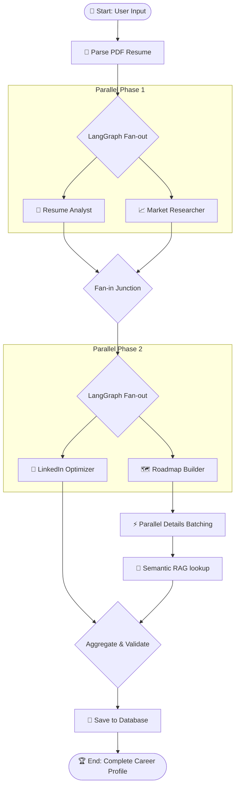
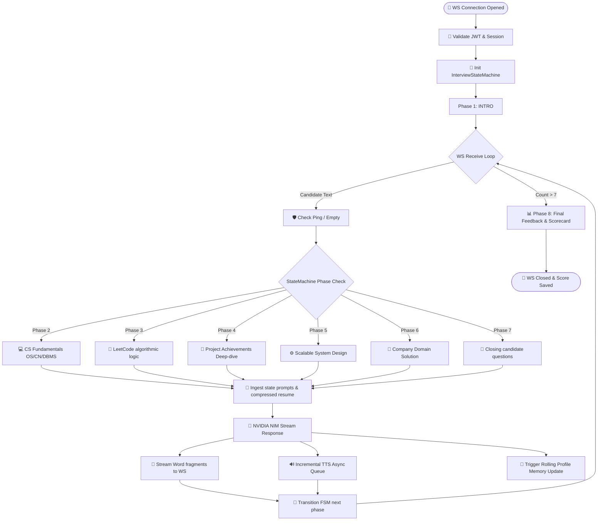
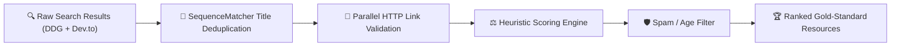

<div align="center">

```
 █████╗ ██╗      ██████╗ █████╗ ██████╗ ███████╗███████╗██████╗
██╔══██╗██║     ██╔════╝██╔══██╗██╔══██╗██╔════╝██╔════╝██╔══██╗
███████║██║     ██║     ███████║██████╔╝█████╗  █████╗  ██████╔╝
██╔══██║██║     ██║     ██╔══██║██╔══██╗██╔══╝  ██╔══╝  ██╔══██╗
██║  ██║██║     ╚██████╗██║  ██║██║  ██║███████╗███████╗██║  ██║
╚═╝  ╚═╝╚═╝      ╚═════╝╚═╝  ╚═╝╚═╝  ╚═╝╚══════╝╚══════╝╚═╝  ╚═╝

███╗   ███╗███████╗███╗   ██╗████████╗ ██████╗ ██████╗
████╗ ████║██╔════╝████╗  ██║╚══██╔══╝██╔═══██╗██╔══██╗
██╔████╔██║█████╗  ██╔██╗ ██║   ██║   ██║   ██║██████╔╝
██║╚██╔╝██║██╔══╝  ██║╚██╗██║   ██║   ██║   ██║██╔══██╗
██║ ╚═╝ ██║███████╗██║ ╚████║   ██║   ╚██████╔╝██║  ██║
╚═╝     ╚═╝╚══════╝╚═╝  ╚═══╝   ╚═╝    ╚═════╝ ╚═╝  ╚═╝
```

### ✦ *5 Specialized AI Workflows. One Career Transformation.* ✦

> 🎯 **Resume Analysis** · 🗺️ **Personalized Roadmaps** · 📈 **Live Market Intel** · 🎤 **Streaming Mock Interviews** · 🔐 **Google OAuth**

<br/>


<br/>

[](https://ai-career-mentor-anil.vercel.app)
[](https://ai-career-mentor-rrpu.onrender.com/docs)
[](https://microsoft.com)
[](https://devpost.com)
[](LICENSE)
[](https://github.com/Anil-Pradhan-web/ai-career-mentor/commits)
[](https://github.com/Anil-Pradhan-web/ai-career-mentor/actions)

</div>

---

## 🧭 Table of Contents

- [What is AI Career Mentor?](#-what-is-ai-career-mentor)
- [Key Numbers](#-key-numbers-at-a-glance)
- [System Architecture](#-system-architecture)
  - [Pipeline Board](#-notion-style-pipeline-board)
  - [Mermaid Architecture](#-detailed-mermaid-architecture)
  - [Request Lifecycle](#-request-lifecycle--full-career-analysis)
- [Core Features](#-core-features)
- [The 5 AI Workflows](#-the-5-ai-workflows)
- [Hybrid Semantic RAG Engine](#-hybrid-semantic-rag-engine)
- [Dynamic Model Selector & Fallbacks](#-dynamic-model-selector--fallback-systems)
- [Tech Stack](#-tech-stack)
- [Local Setup](#-local-setup)
- [API Reference](#-api-reference)
- [Project Structure](#-project-structure)
- [Testing Suite (95 Tests)](#-testing-suite-95-tests)
- [CI/CD Pipeline & Hardening](#-cicd-pipeline--hardening)
- [Deployment](#-deployment)
- [Hackathon Submissions](#-hackathon-submissions)
- [Upgrade Roadmap](#-upgrade-roadmap)
- [Built By](#-built-by)

---

## 🎯 What is AI Career Mentor?

**AI Career Mentor** is a production-grade, full-stack career coaching platform that helps developers and students move from career confusion to a concrete execution plan. It combines resume parsing, ATS scoring, live market research, resource-enriched roadmaps, LinkedIn optimization, and adaptive mock interviews into one polished dashboard.

Most developers spend months trying to figure out:

- 📚 *What should I learn next?*
- 🏢 *Where should I apply?*
- 🎤 *How do I ace the interview?*
- 🔎 *Which skills are actually demanded in my target market?*
- 🧾 *Why is my resume not converting?*

**We solve all of these together** — a Resume Analyst scores the CV, a Market Researcher studies salary and hiring signals, a Career Coach builds an 8-week plan, a LinkedIn Reviewer upgrades profile positioning, and a Mock Interviewer stress-tests the candidate through a realtime WebSocket experience.

> 🧑‍💻 **Solo-built** — backend, frontend, agent orchestration, Google OAuth, RAG, Docker, CI/CD, and production infrastructure by one developer.
> ⏱️ **5–6 months** from concept to a fully deployed MVP.
> 📝 **140+ commits** of iterative design, production hardening, and feature delivery.
> ✅ **95 passing tests** covering agent registry, validation models, roadmap logic, and API integration.

---

## 📊 Key Numbers at a Glance

| Metric | Value |
|--------|-------|
| Career Workflows | **5 core AI-powered workflows** |
| Full Analysis Graph | **Parallel (Resume + Market) → Parallel (LinkedIn + Roadmap)** |
| Roadmap Length | **8 weeks** with projects, success criteria, and curated resources |
| Interview Flow | **7 adaptive questions** with persona discovery and final scoring |
| Test Coverage | **95 passing tests** across registry, validation, roadmap, and API layers |
| Rate Limit Architecture | **100 req/hr · 1000 req/day** in production + per-feature daily limits |
| Primary LLM Options | **Groq · NVIDIA NIM · Google Gemini** |
| Fallback Strategy | **Provider fallback chain + circuit breaker + deterministic fallbacks** |
| DB Connection Pool | **Free-tier optimized** (`pool_size=3`, `max_overflow=5`, `pool_pre_ping=True`) |
| Caching | **Disabled for Full Analysis** to guarantee fresh, up-to-date results (Rate limits apply) |
| Semantic RAG | **ChromaDB persistent store + in-memory keyword fallback** |
| Auth | **Email/password JWT + refresh token + Google OAuth** |
| Deployment | **Vercel frontend · Render backend · Neon Postgres · Upstash Redis** |
| Hackathon Prize Pool | **$175,000+** across 2 submissions |

---

## 🏗️ System Architecture

The platform uses a decoupled frontend/backend architecture with a dedicated orchestration layer. The frontend is a Next.js 14 App Router application, while the backend is a FastAPI service that exposes REST, SSE, and WebSocket endpoints.

### 🧩 Notion-Style Pipeline Board

<table>
  <tr>
    <td width="20%" valign="top">
      <strong>① User Layer</strong><br/>
      <sub>Landing · Login · Dashboard</sub><br/><br/>
      👤 Developer / Student<br/>
      🧾 Resume PDF<br/>
      🎯 Target Role<br/>
      📍 Location + Seniority
    </td>
    <td width="20%" valign="top">
      <strong>② Frontend Layer</strong><br/>
      <sub>Next.js 14 App Router</sub><br/><br/>
      🏠 Landing Page<br/>
      📊 Career Hub<br/>
      🧭 Full Analysis Wizard<br/>
      🎤 Interview UI<br/>
      ⚙️ Provider Settings
    </td>
    <td width="20%" valign="top">
      <strong>③ API Layer</strong><br/>
      <sub>FastAPI Gateway</sub><br/><br/>
      🔐 JWT + Google OAuth<br/>
      🚦 SlowAPI Limits<br/>
      🔁 Token Refresh<br/>
      📡 REST + SSE + WS<br/>
      🧾 Activity Logs
    </td>
    <td width="20%" valign="top">
      <strong>④ AI Orchestration</strong><br/>
      <sub>LangGraph + Agent Registry</sub><br/><br/>
      📄 Resume Analyst<br/>
      📈 Market Researcher<br/>
      🔗 LinkedIn Optimizer<br/>
      🗺️ Roadmap Builder<br/>
      🎤 Mock Interviewer
    </td>
    <td width="20%" valign="top">
      <strong>⑤ Output Layer</strong><br/>
      <sub>Personalized Career OS</sub><br/><br/>
      ✅ ATS Score<br/>
      ✅ Salary + Hiring Trends<br/>
      ✅ 8-Week Roadmap<br/>
      ✅ LinkedIn Strategy<br/>
      ✅ Interview Scorecard
    </td>
  </tr>
</table>

```text
┌──────────────────────────────────────────────────────────────────────────────┐
│                      AI CAREER MENTOR — SYSTEM PIPELINE                      │
├──────────────────────────────────────────────────────────────────────────────┤
│  User Input                                                                  │
│  Resume PDF + Target Role + Location + Preferred LLM Provider                │
│        │                                                                     │
│        ▼                                                                     │
│  Next.js Dashboard                                                           │
│  Auth Pages · Full Analysis Wizard · Market Explorer · Interview Console     │
│        │                                                                     │
│        ▼                                                                     │
│  FastAPI Gateway                                                             │
│  JWT/Google OAuth · Rate Limit · Cache Check · Activity Audit · Validation   │
│        │                                                                     │
│        ├──────────────► PostgreSQL / SQLite                                  │
│        ├──────────────► Redis Cache + Rate Limit Store                       │
│        └──────────────► LangGraph Career OS                                  │
│                              │                                               │
│                              ▼                                               │
│             ┌────────────────┴────────────────┐                              │
│             ▼                                 ▼                              │
│       Resume Analyst                  Market Researcher                      │
│             │       \                 /       │                              │
│             │        \               /        │                              │
│             ▼         ▼             ▼         ▼                              │
│     LinkedIn Optimizer               Roadmap Aggregator                      │
│             └────────────────┬────────────────┘                              │
│                              │                                               │
│                              ▼                                               │
│  Intelligence Engines                                                        │
│  ATS Engine · Market Service · Search Enrichment · ChromaDB RAG · Edge-TTS  │
│        │                                                                     │
│        ▼                                                                     │
│  Provider Router                                                             │
│  Groq ⇄ NVIDIA NIM ⇄ Google Gemini + deterministic fallback + circuit breaker│
│        │                                                                     │
│        ▼                                                                     │
│  Final Dashboard Output                                                      │
│  Resume Score · Market Insights · Roadmap · LinkedIn Plan · Mock Interview   │
└──────────────────────────────────────────────────────────────────────────────┘
```

### 🗺️ Detailed Mermaid Architecture


```mermaid
flowchart TD
    User(["👤 User"])

    subgraph Frontend ["☁️ Frontend — Vercel / Docker"]
        Landing["🏠 Landing Page"]
        Dashboard["📊 Career Dashboard"]
        NextJS["Next.js 14 App Router\nReact 18 + TypeScript"]
    end

    subgraph Backend ["⚡ Backend — Render / Docker"]
        API["FastAPI API Gateway\nREST + SSE + WebSockets"]
        Auth["🔐 JWT + Refresh Tokens\nGoogle OAuth"]
        RateLimit["🚦 SlowAPI + Feature Limits"]
        Cache["⚡ Redis AI Cache"]
    end

    subgraph Orchestration ["🧠 Career AI Orchestration"]
        Graph["LangGraph Career OS\nParallel DAG + Validation/Repair"]
        Resume["📄 Resume Analyst\n(app.api.resume)"]
        Market["📈 Market Researcher\n(app.api.market)"]
        LinkedIn["🔗 LinkedIn Optimizer\n(app.api.linkedin)"]
        Roadmap["🗺️ Roadmap Builder\n(app.api.roadmap)"]
        Quiz["📝 Weekly MCQ Quiz\n(app.api.roadmap)"]
        Interview["🎤 Streaming Interview Engine\n(app.api.interview)"]
        Randomizer["🎲 Question Randomizer\n(app.api.interview)"]
    end

    subgraph Routing ["🤖 Agent Registry & Router"]
        Registry["registry.py (call_llm)\nFallback Chain + Circuit Breaker"]
    end

    subgraph Intelligence ["⚙️ Intelligence Layer"]
        ATS["🎯 Deterministic ATS Engine"]
        Search["🔍 Serper / Tavily / DuckDuckGo"]
        RAG["🧬 ChromaDB + Curated Resources"]
        Voice["🔊 Edge-TTS Voice Output"]
    end

    subgraph Providers ["🤖 Model Providers"]
        Groq["⚡ Groq Llama\n(llama-3.3-70b-versatile)"]
        NVIDIA["🟢 NVIDIA NIM\n(deepseek-ai/deepseek-v4-pro)"]
        Gemini["🔵 Google Gemini\n(gemini-2.5-flash)"]
    end

    subgraph Data ["🗄️ Data Layer"]
        Postgres["🐘 PostgreSQL / SQLite Dev"]
        Redis["🔴 Redis / Upstash"]
        Files["📁 PDF Resume Uploads"]
    end

    %% Flow Connections with Sequence Numbers
    User -->|"[1] Interactions"| NextJS
    Landing --> NextJS
    Dashboard --> NextJS
    NextJS -->|"[2] REST / SSE / WS API Request"| API
    API -->|"[3a] Authenticate"| Auth
    API -->|"[3b] Check Rate Limit"| RateLimit
    API -->|"[3c] Cache Check"| Cache
    Cache -->|"[3d] Query Keys"| Redis

    API -->|"[4a] Cache Miss: Execute Graph"| Graph
    API -->|"[4b] Active Session: Connect WebSocket"| Interview

    Graph -->|"[5] Parallel Node Init"| Resume
    Graph -->|"[5] Parallel Node Init"| Market
    Resume -->|"[5a] Grade ATS Score"| ATS
    Market -->|"[5b] Live Search & Scrape"| Search

    Resume -->|"[6] Wait & Fan-out"| LinkedIn
    Market -->|"[6] Wait & Fan-out"| LinkedIn
    Resume -->|"[6] Wait & Fan-out"| Roadmap
    Market -->|"[6] Wait & Fan-out"| Roadmap
    Roadmap -->|"[6a] Context Lookup"| RAG
    Roadmap -->|"[7] Enroll Candidate Quiz"| Quiz
    Interview -->|"[7a] Topic Seed"| Randomizer
    Interview -->|"[7b] Audio generation"| Voice

    Resume -->|"[8] Persist Analysis"| Postgres
    Postgres -->|"[8b] Inject Candidate Context"| Interview
    API -->|"[8c] Commit / Fetch Records"| Postgres
    API -->|"[8d] Store PDF"| Files

    %% Consolidated LLM Routing through Registry
    Resume -->|"[9] Request LLM"| Registry
    LinkedIn -->|"[9] Request LLM"| Registry
    Market -->|"[9] Request LLM"| Registry
    Roadmap -->|"[9] Request LLM"| Registry
    Quiz -->|"[9] Request LLM"| Registry
    Interview -->|"[9] Request LLM"| Registry

    Registry -->|"[10] Route: selected / fallback"| Groq
    Registry -->|"[10] Route: selected / fallback"| NVIDIA
    Registry -->|"[10] Route: selected / fallback"| Gemini

    classDef userStyle fill:#7C3AED,stroke:#5B21B6,color:#EDE9FE,rx:20
    classDef frontendStyle fill:#0D9488,stroke:#0F766E,color:#F0FDFA
    classDef backendStyle fill:#1D4ED8,stroke:#1E40AF,color:#DBEAFE
    classDef orchestrationStyle fill:#7C3AED,stroke:#6D28D9,color:#EDE9FE
    classDef agentStyle fill:#DB2777,stroke:#BE185D,color:#FCE7F3
    classDef intelligenceStyle fill:#16A34A,stroke:#15803D,color:#DCFCE7
    classDef providerStyle fill:#D97706,stroke:#B45309,color:#FEF3C7
    classDef dataStyle fill:#4B5563,stroke:#374151,color:#F3F4F6

    class User userStyle
    class Landing,Dashboard,NextJS frontendStyle
    class API,Auth,RateLimit,Cache backendStyle
    class Graph orchestrationStyle
    class Resume,Market,LinkedIn,Roadmap,Quiz,Interview,Randomizer agentStyle
    class ATS,Search,RAG,Voice intelligenceStyle
    class Groq,NVIDIA,Gemini,Registry,Routing providerStyle
    class Postgres,Redis,Files dataStyle
```

### 🧠 Main Agent Architecture

To visualize how the intelligence flows, here are the detailed structures of the two primary agent workflows:

#### 1. Full Career Analysis (LangGraph Career OS)

The career orchestration graph uses a static LangGraph DAG with parallel fan-out/fan-in nodes.


```mermaid
graph TD
    Start([🏁 Start: User Input]) --> Parse[📄 Parse PDF Resume]
    Parse --> Dispatch{LangGraph Fan-out}
    
    subgraph Parallel Phase 1
        Dispatch --> Resume[📄 Resume Analyst]
        Dispatch --> Market[📈 Market Researcher]
    end
    
    Resume --> Wait{Fan-in Junction}
    Market --> Wait
    
    Wait --> Fanout2{LangGraph Fan-out}
    
    subgraph Parallel Phase 2
        Fanout2 --> LinkedIn[🔗 LinkedIn Optimizer]
        Fanout2 --> Roadmap[🗺️ Roadmap Builder]
    end
    
    Roadmap --> Batch[⚡ Parallel Details Batching]
    Batch --> RAG[🧬 Semantic RAG lookup]
    
    LinkedIn --> Output{Aggregate & Validate}
    RAG --> Output
    
    Output --> DB[💾 Save to Database]
    DB --> End([🏆 End: Complete Career Profile])
```

#### 2. Mock Interview Simulator (FSM WebSocket Loop)

The WebSocket mock interview sessions operate on a strict state controller transition loop.


```mermaid
graph TD
    WS([🔌 WS Connection Opened]) --> Init[🔐 Validate JWT & Session]
    Init --> FSM[🤖 Init InterviewStateMachine]
    
    FSM --> Phase1[Phase 1: INTRO]
    Phase1 --> Loop{WS Receive Loop}
    
    Loop -->|Candidate Text| Guard[🛡️ Check Ping / Empty]
    Guard --> StateCheck{StateMachine Phase Check}
    
    StateCheck -->|Phase 2| CS[💻 CS Fundamentals OS/CN/DBMS]
    StateCheck -->|Phase 3| LC[📝 LeetCode algorithmic logic]
    StateCheck -->|Phase 4| Proj[📁 Project Achievements Deep-dive]
    StateCheck -->|Phase 5| Sys[⚙️ Scalable System Design]
    StateCheck -->|Phase 6| Comp[🏢 Company Domain Solution]
    StateCheck -->|Phase 7| Close[🤝 Closing candidate questions]
    
    CS & LC & Proj & Sys & Comp & Close --> Prompt[📝 Ingest state prompts & compressed resume]
    
    Prompt --> LLM[🤖 NVIDIA NIM Stream Response]
    LLM --> Stream[📡 Stream Word fragments to WS]
    LLM --> TTS[🔊 Incremental TTS Async Queue]
    LLM --> Mem[🧠 Trigger Rolling Profile Memory Update]
    
    Stream & TTS --> Transition[🔄 Transition FSM next phase]
    Transition --> Loop
    
    Loop -->|Count > 7| Feedback[📊 Phase 8: Final Feedback & Scorecard]
    Feedback --> CloseWS([🔌 WS Closed & Score Saved])
```


### 📋 Request Lifecycle — Full Career Analysis

1. **User uploads resume** — PDF text is extracted and sent with target role + location.
2. **Rate limit check** — Feature limits are checked and enforced (cache lookups are skipped to ensure fresh generation).
3. **Parallel Resume & Market nodes run first** — Resume analysis is generated via `run_resume_agent()` (hardcoded to `nvidia`) from `app.api.resume` while Market intelligence is concurrently queried and parsed via `run_market_agent()` (hardcoded to `groq`) from `app.api.market`.
4. **Parallel LinkedIn & Roadmap nodes run next** — Once both Resume and Market data are ready, the LinkedIn Optimizer (`run_linkedin_agent()` (hardcoded to `groq`) from `app.api.linkedin`) and the Roadmap Builder (`run_roadmap_structure()` (hardcoded to `gemini`) from `app.api.roadmap`) run in parallel.
5. **Detail Batching & Enrichment** — The Roadmap Builder runs 3 parallel batched operations to generate detail weeks, followed by dynamic resource enrichment via RAG.
6. **Validation/repair layer runs** — Pydantic validation catches malformed outputs and falls back when needed.
7. **Result is processed and logged** — Response is returned directly to the client, the generated roadmap is persisted to the DB, usage is incremented, and user activity is saved.

### 🧱 Module Ownership Architecture

Each agent function lives in its owning API module and is imported by the LangGraph workflow:

```
app/agents/registry.py          → Thin LLM caller (call_llm, parse_json, circuit breaker, fallback chain)
app/api/resume.py               → run_resume_agent() + _RESUME_SYSTEM_PROMPT
app/api/market.py               → run_market_agent() + _MARKET_SYSTEM_PROMPT
app/api/linkedin.py             → run_linkedin_agent() + _LINKEDIN_SYSTEM_PROMPT
app/api/roadmap.py              → run_roadmap_structure() + run_roadmap_details_batch() + prompts
app/agents/workflow.py          → LangGraph graph imports from all API modules above
app/api/career.py               → Entry point importing create_career_graph() from workflow
```

### ⚙️ Core Design Decisions & Architectural Patterns

To transition the platform from simple AI wrappers to a resilient enterprise-ready agentic system, we implemented several advanced patterns:

#### 1. Parallel Concurrency & State Aggregation (LangGraph State OS)
* **Reducer Patterns:** LangGraph's state uses `Annotated[List[str], operator.add]` for logs and errors. This allows parallel executing nodes to concurrently append messages without race conditions or state overwrite bugs.
* **Latency Reduction:** By decoupling independent agents, the orchestrator fan-out achieves a total latency of `max(resume, market) + max(linkedin, roadmap)`, saving over **60% total execution time** in multi-agent pipelines compared to linear execution.
* **Inline Self-Correction:** When Pydantic validation flags a malformed agent output, the validator triggers an inline repair fallback mechanism, returning parsed deterministic structures rather than failing the request.

#### 2. Strict FSM State Controller Loop (Mock Interview WebSocket)
* **Separation of Concerns:** The WebSocket connection is separated into I/O handling (`websocket_manager.py`) and conversation control (`state.py`). The manager handles standard connection loops and audio streams, while the `InterviewStateMachine` maintains the conversational context.
* **Deterministic Stage Progression:** The interview follows a strict 7-phase Finite State Machine (FSM). The FSM prevents prompt injections or user answers from skipping phases, keeping the conversation naturally guided from basic CS fundamentals to system design.

#### 3. Dual-Tier Caching & Expiry Locks (Redis + Local Fallback)
* **Fresh Generation over Caching:** Caching has been disabled for Full Analysis requests to guarantee that users always receive real-time, up-to-date career intelligence.
* **2-Day Expiry locks (48 Hours):** High-cost features (`interview` and `full_analysis`) implement usage block keys (`usage_block:{uid}:{feature}`) expiring after 172,800 seconds (2 days) via Redis `SETEX`. If Upstash Redis experiences downtime, the system falls back to a thread-safe local in-memory lock dict with UTC `datetime` calculations.

#### 4. Hybrid RAG & Render OOM Safety (ChromaDB ONNX Bypass)
* **ONNX Memory Overhead:** ChromaDB's default embedding models (`all-MiniLM-L6-v2`) run locally via ONNX Runtime and consume upwards of 200MB of RAM. This routinely triggers Out-Of-Memory (OOM) crashes on serverless hosting providers with 512MB RAM constraints (e.g. Render Free Tier).
* **Environment-Aware Bypass:** The RAG layer detects the execution environment and switches to a mock `SequenceMatcher` fallback algorithm for local keyword matching when memory-constrained settings are active, assuring 100% server uptime.

---

## ✨ Core Features

### 📄 Resume Intelligence

- PDF upload with plain-text extraction.
- ATS scoring with keyword, achievements, action verbs, and formatting breakdowns.
- Technical skills, soft skills, strengths, gaps, and experience estimation.
- Cached analysis paths to reduce duplicate model calls.

### 🗺️ Gamified Roadmap & Resource Tracker

- **8-Week Personalized Learning Path:** Structured week-by-week learning plan mapped to specific technical roles and identified skill gaps.
- **Two Experience Levels:** Supports toggling between "Beginner to Intermediate" and "Intermediate to Advanced" curriculum progression. The beginner generator filters out complex cloud infrastructure and microservice patterns, keeping topics focused on programming syntax, database CRUD, and foundations.
- **Two-Phase Parallel Generation:** Creates structure skeleton first, then runs three parallel batch operations to enrich details (saving up to 60% LLM execution time).
- **Single Active Primary Goal & Validation Popups:** Ensures the candidate only pursues one primary path. Attempting to select a new role as primary triggers a browser alert. The "Remove Primary Goal" button dynamically adapts and appears only for the active primary goal role.
- **Gamified Level Progress HUD:** Global syllabus coverage tracker displaying percentage of completed weeks. Dynamically updates candidate title:
  - `0% - 25%`: **Novice Developer** 🌱
  - `26% - 75%`: **SDE-1 Ready** 🚀
  - `76% - 100%`: **Production Ready** 🏆
- **Weekly Assessment MCQ Quizzes:** Generate exactly 5 highly educational, role-specific multiple-choice questions via the active LLM.
- **NVIDIA NIM Quiz Logic with Output Questions:** Leverages NVIDIA NIM reasoning models (DeepSeek-v4-Pro) to build logic-heavy and code-tracing quizzes. If the candidate is marked as a beginner (resume experience < 2.0 years or a beginner roadmap is selected), the AI generates trace/output-based programming questions.
- **Robust Quiz Fallbacks:** Features programmatic, keyword-matching fallback quiz pools (Database, APIs, Docker, and general topics) to bypass rate limits or parsing failures.
- **Real Resource Enrichment:** Integrates local ChromaDB semantic RAG with direct YouTube search query generation to let users choose up-to-date video tutorials.
- **History & Progress Persistence:** Interactive complete/uncomplete toggles, persistent database state tracking via SQLAlchemy JSON fields, and clean React Portal modals.

### 📈 Live Market Explorer

- **Live Search Engine Routing:** Role, location, and seniority-aware market intelligence queries targeting Tavily as the primary search service, with automatic fallback to Serper API to ensure resilience.
- **Deep URL Scraping:** Extracts the top 3 unique resource links from search results and scrapes their live web page contents dynamically using an async HTTP client (`httpx.AsyncClient`) with customized headers.
- **HTML Sanitization & Context Pruning:** Strips layout structures (`<script>`, `<style>`, `<nav>`, `<footer>`, `<header>`), decodes entities, collapses extra whitespace, and limits text extraction to 3,000 characters per page to prevent prompt/token overflow while supplying rich, up-to-date context.
- **Region Profiles & Experience Scales:** Custom currency normalization (e.g. INR/₹ for India, USD/$ for USA, GBP/£ for UK, EUR/€ for Europe) coupled with experience level multipliers (intern, junior, mid, senior, staff) to scale and format salaries accurately.
- **Detailed Insights:** Salary range, market trend, hiring volume, remote signal, top skills, and hiring companies.
- **Data Visualisation:** Historical salary and hiring data visualized with interactive dashboard charts.

### 🔗 LinkedIn Optimizer

- Target-role-specific headline ideas.
- About-section rewrite strategy.
- Demanding skills, ATS keywords, recruiter search trends, certifications, and density advice.
- Available as a standalone page and inside the full-analysis workflow.

### 🎤 Adaptive Mock Interviews

- **Modular Backend Refactoring:** Overhauled the technical interview module, moving from a single monolithic 800+ line API file to a clean, decoupled package (`app.core.interview/`) split into dedicated sub-modules (`websocket_manager.py`, `llm.py`, `prompts.py`, `state.py`, `session.py`, `constants.py`).
- **Finite State Machine (FSM) Transition Controller:** Enforces a strict 7-phase mock interview flow using `InterviewStateMachine` (defined in `state.py`):
  1. *Phase 1: Intro & Discovery* (warm greeting and resume tech stack overview)
  2. *Phase 2: CS Fundamentals* (focused strictly on Operating Systems, Computer Networks, or Database Management Systems)
  3. *Phase 3: LeetCode Coding Challenge* (candidate explains algorithmic logic and complexity for a coding problem similarity)
  4. *Phase 4: Project Deep-Dive* (drills down into exactly one candidate project and selects exactly two bullet-point achievements to detail)
  5. *Phase 5: System Design* (designs scalable cloud backends customized to company business domains)
  6. *Phase 6: Real-life Domain of the Company's Solution* (e.g., legacy migrations/reliability for consultancy companies vs high-scale low-latency issues for FAANG/product companies)
  7. *Phase 7: Closing Q&A* (candidate asks the interviewer questions)
  - followed by *Phase 8: Feedback* (answers candidate questions and concludes).
- **Sub-Second First-Token Latency Optimization:** For WebSocket real-time queries using the NVIDIA NIM provider, the engine overrides the default reasoning model (DeepSeek-v4-Pro) to use `meta/llama-3.3-70b-instruct`. This resolves the typical 1.30-minute delay introduced by DeepSeek's reasoning thought tokens stream (`delta.reasoning_content`) down to a sub-second response (under 200ms first-token delay), preserving conversational fluency.
- **Incremental Text-to-Speech (TTS):** Implements an async consumer queue (`tts_queue`) that parses the stream into sentences in real-time, yielding base64 audio fragments concurrently. This avoids waiting for the entire LLM message to compile, producing immediate verbal responses.
- **Structured Resume Summarizer (Prompt Size Optimization):** Incorporates `build_compressed_resume_summary` in `session.py` to compress candidate profile records (skills, gaps, experience) and truncate raw resume text to a maximum of 1,500 characters, significantly lowering token overhead and hallucination risks.
- **Experience Filtering Guardrails:** Filters resume text to distinguish professional software engineering internships and jobs from student roles (e.g. college club memberships, campus ambassadors) to prevent false experience counts.
- **Realtime WebSocket Integration:** Continuous bi-directional WebSocket interface (`/interview/ws/{session_id}`) with live direct model streaming, persisted chat records, and final scorecard logs.
- **Direct Technical Interview Safeguard (Popup Modal):** Detects if a user attempts to launch a Technical Mock Interview without analyzing their resume first, showing a glassmorphic warning dialog with a direct path to the Resume page.
- **Post-Analysis Call-to-Action:** Adds a premium start banner on the Resume page after parsing completes, prompting candidates to *"Practice your skills through our interview agent"*.
- **Premium Glassmorphic Console:** Upgraded active mock interview dashboard with radial glow backdrops, Siri-style bouncing speech waveforms, focus-glowing text areas, custom scrollbars, and interactive buttons.
- **Active Input Blocking Safeguard:** Automatically locks the candidate's input workspace (textarea, submit triggers, and key events) as soon as the final Phase 8 (Feedback/Conclusion) response starts generating, preventing duplicate answers or out-of-order submissions while the final report is compiled.
- **Persisted Scorecards & History:** Track historical interviews, scores, and full interactive transcripts in the user panel.
- **Mock Interview Randomization & Replayability:** Added distinct randomized pools of technical topics (concurrency, caching, CAP, network protocols), system design company domains (Google search, Amazon cart, Netflix streaming), and behavioral challenges. Employs session-specific seed tokens to ensure every single mock interview session asks unique questions.

### 📊 Career Dashboard

- Usage cards for resume, roadmap, interview, market, LinkedIn, and full-analysis features.
- Activity timeline from persisted user logs.
- Skill radar from latest resume analysis.
- Weekly activity chart and primary-goal progress tracking.
- Today's high interview score and report-depth metrics.

### 🔐 Authentication & User System

- Email/password registration and login.
- Google OAuth login.
- JWT access token + refresh token flow.
- Automatic frontend token refresh and session-expiry handling.
- Refresh tokens cannot access protected routes.

---

## 🧠 The 5 AI Workflows

| Workflow | What It Does | Implementation |
|----------|--------------|----------------|
| **1. Resume Analyst** | Extracts skills, gaps, strengths, experience, and ATS scoring. | Deterministic ATS engine + LLM polish + Pydantic validation via `app.api.resume.run_resume_agent()` |
| **2. Market Researcher** | Builds salary, hiring, trend, company, and skill-demand insights. | Market service + search APIs + provider LLM summary via `app.api.market.run_market_agent()` |
| **3. Career Coach / Roadmap Builder** | Produces an 8-week role-specific execution plan. | LangGraph aggregation + 3 parallel batched LLM calls + RAG enrichment via `app.api.roadmap.run_roadmap_structure()` + `run_roadmap_details_batch()` |
| **4. LinkedIn Reviewer** | Optimizes profile positioning for recruiter search. | Standalone optimizer + full-analysis node via `app.api.linkedin.run_linkedin_agent()` |
| **5. Mock Interviewer** | Runs realtime adaptive interview sessions. | FastAPI WebSocket + direct model streaming + persisted history |

> The full-analysis workflow is powered by a **LangGraph static DAG** with parallel fan-out/fan-in. Each agent function is owned by its respective API module, and the workflow imports them cleanly with zero circular dependencies.

---

## 🧬 Hybrid Semantic RAG Engine

The roadmap generator does not rely on generic LLM output only. It enriches each week with real learning resources through a hybrid retrieval layer:

1. **Curated knowledge base** — `backend/app/data/curated_resources.json` stores high-quality YouTube, article, GitHub, and documentation resources.
2. **ChromaDB persistent vector store** — resources are auto-seeded at backend startup.
3. **In-memory fallback & Render OOM Safety** — ChromaDB embeds local ONNX models (`all-MiniLM-L6-v2`) which consume over 200MB+ RAM, crashing free-tier containers with 512MB RAM limits. The service automatically detects Render environment (`os.environ.get("RENDER")` or `DISABLE_CHROMA=true`) and disables ChromaDB to switch seamlessly to the lightweight MockRAGEngine (in-memory sequence matcher) for instant startup and zero memory overhead.
4. **Direct YouTube Search Integration** — Discards static youtube links in favor of direct search engine queries (`https://www.youtube.com/results?search_query={topic}+tutorial`) so candidates can search and select popular video materials interactively.
5. **Deduplication and normalization** — roadmap resources are organized into YouTube, article, GitHub, and official-doc buckets.

---

## 🏆 Production-Grade Career Intelligence Engine

To transition the platform from simple AI wrappers to a hardened, production-ready career mentor, we implemented a comprehensive validation, scoring, and deduplication pipeline in [search_engine.py](file:///c:/Users/ANIL/Desktop/ai-career-mentor/backend/app/core/search_engine.py):


```mermaid
flowchart LR
    Raw["🔍 Raw Search Results (DDG + Dev.to)"] --> Dedup["🧩 SequenceMatcher Title Deduplication"]
    Dedup --> Ping["📡 Parallel HTTP Link Validation"]
    Ping --> Score["⚖️ Heuristic Scoring Engine"]
    Score --> Filter["🛡️ Spam / Age Filter"]
    Filter --> Out["🏆 Ranked Gold-Standard Resources"]
```

### 🧠 Core Subsystems Under the Hood

#### 1. Heuristic Scoring & Ranking Engine (`score_resource`)
Instead of displaying random search results, the backend calculates a quality score for every crawled link:
* **Domain Authority weights:** Pre-defined high-quality platforms are rewarded:
  * *Official docs & developer portals* (`docs.docker.com`, `react.dev`, `mdn`, etc.): **+40 points**
  * *GitHub code repositories* (`github.com`): **+25 points**
  * *Education portals* (`freecodecamp.org`): **+20 points**
  * *Tech blogging sites* (`dev.to`, `medium.com`): **+5 points**
* **Keyword Density Alignment:** Awards **+5 points** per target topic keyword found directly in the URL path segment.
* **Legacy Technology Penalty:** Deducts **-40 points** if out-of-date or legacy phrases are found in the URL (e.g. `class-components`, `angularjs`, `pages-router`, `deprecated`, `legacy`) unless explicitly requested.
* **Spam & Clickbait Penalization:** Deducts **-30 points** for spam networks or ad-heavy hosting domains (e.g., `blogspot.com`, `wordpress.com`).

#### 2. Deep GitHub Repository Quality Audit (`check_github_repo_quality`)
If a resource points to a GitHub repository, the backend performs a real-time REST query to the GitHub API:
* **Inactivity Penalty:** Deducts **-30 points** if the repository has not received a git push commit for more than 2 years.
* **Low Popularity Penalty:** Deducts **-25 points** if the repository has accumulated fewer than 100 stargazers.
* **Archived Penalty:** Deducts **-50 points** if the repository has been marked as archived or read-only by its maintainers.

#### 3. Concurrent URL Reachability Verification (`validate_urls_parallel`)
To prevent dead links or parking pages, the engine tests links concurrently before they reach the UI:
* Uses a `ThreadPoolExecutor` with **10 concurrent workers** to resolve connections in parallel.
* Initiates a lightweight HTTP `HEAD` request (following redirects) with a strict **1.5-second timeout**.
* If a server blocks `HEAD` requests, it immediately falls back to a streaming `GET` request to verify the response returns `200 OK`. Any broken link, `404 Not Found`, or timed-out domain is pruned from the list.

#### 4. SequenceMatcher Semantic Deduplication (`deduplicate_resources`)
To avoid recommending repetitive contents across the 8-week path:
* Uses Python's `difflib.SequenceMatcher` to evaluate text similarity ratios on clean, alphanumeric title strings.
* Rejects any search result that exceeds a **0.75 title similarity ratio** against already selected articles.
* Wraps the roadmap generator's weekly loop in a thread-safe `threading.Lock()` to maintain a global set of `used_urls` across parallel worker threads. This prevents the same URL from showing up in multiple weeks of a single generated syllabus.

#### 5. Personalized Context & Openings Scaling
* **Resume Context Alignment:** Extracts candidate years of experience, target role, and strengths directly from the database history and injects them into the prompt templates to tailor the curriculum structure.
* **Density-Aware Numeric Job Ranges:** Analyzes target location densities to estimate realistic job openings ranges (e.g., `450 - 750 Openings` for popular tech hubs vs lower ranges for small regions) based on hiring signals, completely eliminating generic static placeholders.

---

## ⚡ Dynamic Model Selector & Fallback Systems

To keep the product usable under free-tier limits and provider instability, the backend includes multiple resilience layers:

**Frontend model preference**
- Users can choose a preferred provider from settings.
- Services pass the provider into resume, roadmap, market, LinkedIn, and full-analysis requests.

**Provider routing**
- Supported providers: **Groq** (Llama 3.3 70B), **NVIDIA NIM** (DeepSeek-v4-Pro), and **Google Gemini** (Gemini 2.5 Flash).
- Groq defaults to `llama-3.3-70b-versatile`.
- NVIDIA defaults to `deepseek-ai/deepseek-v4-pro` (the flagship reasoning model for math, coding, and logic).
- Gemini defaults to `gemini-2.5-flash`.

**Selective Agent Routing & Fallback Chains**

| Page / Agent | Allowed Providers | Agent Default | Fallback Chain |
| :--- | :--- | :--- | :--- |
| **Interview** | NVIDIA NIM, Groq | NVIDIA NIM | **No Fallback** (ensures session & voice stability) |
| **Market** | NVIDIA, Groq, Google Gemini | Groq | `groq` → `google` → `nvidia` |
| **Resume** | NVIDIA, Groq, Google Gemini | NVIDIA NIM | `nvidia` → `groq` → `google` |
| **Roadmap** | NVIDIA, Groq, Google Gemini | NVIDIA NIM | `google` → `groq` → `nvidia` |
| **LinkedIn** | NVIDIA, Groq, Google Gemini | Groq | `groq` → `google` → `nvidia` |
| **Full Analysis** | None (Model selector removed) | Statically mapped per agent node | Centralized 3-way fallback loops per node |

- **Mock Interview Latency Override:** For mock interviews using the `NVIDIA NIM` provider, the WebSocket streaming engine automatically overrides the default reasoning model (`deepseek-ai/deepseek-v4-pro`) and invokes `meta/llama-3.3-70b-instruct`. This bypasses the long delay (up to 90 seconds) caused by generating reasoning thoughts, reducing latency to under 200ms for a real-time conversational experience.
- A circuit breaker temporarily disables repeated failing model calls to protect the API.
- Roadmap generation includes a programmatic 8-week fallback if both structure and detail agents fail.

**Caching and rate limiting**
- Full-analysis results are cached with SHA-256 fingerprints.
- SlowAPI enforces global request limits.
- Feature-level usage counters enforce daily caps in the product experience.

---

## 🧱 Tech Stack

### Frontend

| Technology | Purpose |
|-----------|---------|
| **Next.js 14 App Router** | Full-stack React framework with route-level pages and layouts |
| **React 18 + TypeScript** | Typed UI components and client-side state |
| **Vanilla CSS + Tailwind config** | Custom visual system and utility support |
| **@react-oauth/google** | Google OAuth 2.0 login flow |
| **Axios** | API client with auth and refresh-token interceptors |
| **Recharts** | Dashboard charts and market visualizations |
| **Lucide React** | Icon system |
| **react-hot-toast** | Toast notifications |
| **React Markdown** | Renders dynamic AI markdown responses (roadmaps, LinkedIn guides) |
| **React Dropzone** | Drag-and-drop file upload interface for PDF resumes |
| **Monaco Editor** | Rich code/editor-ready dependency for advanced UI workflows |

### Backend

| Technology | Purpose |
|-----------|---------|
| **FastAPI** | Async REST API, SSE streaming, WebSocket interviews |
| **LangGraph** | Full-analysis orchestration graph |
| **ag2 (Microsoft AutoGen)** | Advanced conversational multi-agent framework integration |
| **OpenAI SDK** | OpenAI-compatible calls for Groq/NVIDIA streaming |
| **Google Generative AI** | Gemini fallback and Google model execution |
| **SQLAlchemy + Alembic** | ORM and database migrations |
| **PostgreSQL / SQLite** | Production and local persistence |
| **Jose + Bcrypt** | Secure JWT verification and bcrypt user password hashing |
| **Redis + SlowAPI** | Rate limiting and cache storage |
| **ChromaDB** | Persistent vector database for resource RAG |
| **pdfplumber** | PDF resume parsing |
| **python-multipart** | Enables binary parsing of multi-part form data uploads for resumes |
| **httpx** | Asynchronous HTTP client for parallel search and web page scraping |
| **Serper / Tavily / DuckDuckGo** | Market and resource search |
| **edge-tts** | Voice synthesis for interviews |
| **Loguru** | Structured asynchronous console logging system |
| **Pytest** | 95 backend tests covering registry, validation, roadmap, and integration |

### DevOps & Infrastructure

| Tool | Purpose |
|------|---------|
| **Docker + Docker Compose** | Local and production container workflows |
| **Render** | Backend deployment |
| **Vercel** | Frontend deployment |
| **Neon Postgres** | Serverless production database |
| **Upstash Redis** | Serverless Redis for cache/rate limits |
| **GitHub Actions** | CI (lint + 95 tests + pip-audit), Render deploy hook, Docker image publishing |

---

## 🚀 Local Setup

### Prerequisites

- Python **3.11+**
- Node.js **18+** / npm
- Groq, NVIDIA, or Google Gemini API key
- Google OAuth Client ID
- Optional: Redis, Serper, Tavily, Docker

### 1. Clone the Repository

```bash
git clone https://github.com/Anil-Pradhan-web/ai-career-mentor.git
cd ai-career-mentor
```

### 2. Backend Setup

From the project root directory, navigate to the `backend` folder, create and activate a virtual environment, install requirements, and copy the environment template:

```bash
cd backend
python -m venv venv

# Windows
venv\Scripts\activate

# macOS/Linux
source venv/bin/activate

pip install -r requirements.txt
cp .env.example .env
```

Update `backend/.env` with your API keys, database settings, and JWT configurations:

```env
# ── LLM Configuration ─────────────────────────────────────
LLM_PROVIDER=groq
GROQ_API_KEY=your_groq_api_key_here
GROQ_MODEL=llama-3.3-70b-versatile
NVIDIA_API_KEY=your_nvidia_nim_key_here
NVIDIA_MODEL=deepseek-ai/deepseek-v4-pro
GOOGLE_API_KEY=your_google_api_key_here
GOOGLE_MODEL=gemini-2.5-flash

# ── Search APIs ───────────────────────────────────────────
SERPER_API_KEY=your_serper_api_key_here
TAVILY_API_KEY=your_tavily_api_key_here

# ── Database ──────────────────────────────────────────────
DATABASE_URL=sqlite:///./dev.db

# ── Auth ──────────────────────────────────────────────────
SECRET_KEY=your_super_secret_jwt_key_here
ACCESS_TOKEN_EXPIRE_MINUTES=60
REFRESH_TOKEN_EXPIRE_DAYS=30
GOOGLE_CLIENT_ID=your_google_client_id.apps.googleusercontent.com

# ── Redis / App ───────────────────────────────────────────
REDIS_URL=redis://localhost:6379/0
APP_ENV=development
CORS_ORIGINS=http://localhost:3000
```

Run the database migrations using Alembic to set up your database tables (SQLite or Postgres):

```bash
# Verify venv is active and you are in the backend directory
alembic upgrade head
```

Run the backend development server:

```bash
# Starts FastAPI server with live reload
uvicorn app.main:app --reload
```

Backend runs at:
- API root: `http://localhost:8000`
- Swagger docs: `http://localhost:8000/docs`
- Health check: `http://localhost:8000/health`

### 3. Frontend Setup

Open a new terminal window at the project root directory, navigate to the `frontend` folder, and install dependencies:

```bash
cd frontend
npm install
```

Create `frontend/.env.local` to point to the backend server and configure Google OAuth:

```env
NEXT_PUBLIC_API_URL=http://localhost:8000
NEXT_PUBLIC_GOOGLE_CLIENT_ID=your_google_client_id.apps.googleusercontent.com
```

Run the Next.js development server:

```bash
npm run dev
# Runs at http://localhost:3000
```

### 4. Docker Setup

```bash
# Development stack
docker compose up --build

# Production override
docker compose -f docker-compose.yml -f docker-compose.prod.yml up --build
```

Frontend runs at `http://localhost:3000`.

---

## 📡 API Reference

| Method | Endpoint | Auth | Description |
|--------|----------|------|-------------|
| `GET` | `/` | — | API welcome payload |
| `GET` | `/health` | — | System health, DB status, provider, model, timestamp |
| `GET` | `/ping` | — | Ultra-lightweight Render keep-alive |
| `POST` | `/auth/register` | — | Email/password registration |
| `POST` | `/auth/login` | — | Login and issue JWT + refresh token |
| `POST` | `/auth/google` | — | Google OAuth credential login |
| `POST` | `/auth/refresh` | — | Refresh access token |
| `GET` | `/user/stats` | ✅ JWT | Dashboard stats, histories, usage, and activity |
| `POST` | `/resume/upload` | ✅ JWT | Upload PDF and extract text preview |
| `POST` | `/resume/analyze` | ✅ JWT | Resume ATS + AI analysis via `run_resume_agent()` |
| `POST` | `/roadmap/generate` | ✅ JWT | Generate resource-enriched 8-week roadmap via `run_roadmap_structure()` + `run_roadmap_details_batch()` |
| `GET` | `/roadmap/history` | ✅ JWT | Fetch saved roadmap history |
| `DELETE` | `/roadmap/{roadmap_id}` | ✅ JWT | Delete a roadmap |
| `GET` | `/market/config` | ✅ JWT | Fetch market form configuration |
| `GET` | `/market/trends` | ✅ JWT | Role/location/seniority-aware market trends |
| `POST` | `/linkedin/optimize` | ✅ JWT | LinkedIn profile optimization strategy |
| `POST` | `/career/full-analysis` | ✅ JWT | Full coordinated career analysis via LangGraph |
| `POST` | `/career/full-analysis/stream` | ✅ JWT | SSE streaming full-analysis progress and result |
| `WS` | `/interview/ws/{session_id}` | Session JWT | Streaming mock interview socket |
| `GET` | `/interview/history` | ✅ JWT | Interview session history |
| `GET` | `/interview/{session_id}` | ✅ JWT | Interview session details |
| `DELETE` | `/interview/{session_id}` | ✅ JWT | Delete interview session |

---

## 📁 Project Structure

```
ai-career-mentor/
├── .github/
│   └── workflows/
│       ├── ci.yml                      # Frontend lint + build, backend pytest + pip-audit
│       ├── backend-deploy.yml          # Render backend deploy hook on main push
│       └── docker-publish.yml          # Build & publish backend/frontend images to GHCR
│
├── assets/
│   └── banner.png
│
├── backend/
│   ├── alembic/                        # Database migration scripts
│   │   └── versions/
│   ├── app/
│   │   ├── agents/
│   │   │   ├── registry.py             # Thin LLM caller: call_llm, parse_json, circuit breaker, fallback chain
│   │   │   └── workflow.py             # LangGraph Career OS graph (imports agents from API modules)
│   │   ├── api/
│   │   │   ├── auth.py                 # Email/password, refresh token, Google OAuth
│   │   │   ├── career.py               # Full analysis + SSE streaming (entry point for LangGraph)
│   │   │   ├── interview.py            # Slim API router delegating WebSocket work to core interview manager
│   │   │   ├── linkedin.py             # LinkedIn optimizer agent (run_linkedin_agent)
│   │   │   ├── market.py               # Market explorer agent (run_market_agent)
│   │   │   ├── resume.py               # Resume analysis agent (run_resume_agent) + PDF upload
│   │   │   ├── roadmap.py              # Roadmap agents (run_roadmap_structure, run_roadmap_details_batch)
│   │   │   └── user.py                 # Dashboard stats endpoint
│   │   ├── core/
│   │   │   ├── interview/              # Modular technical interview logic package
│   │   │   │   ├── constants.py        # Curated technical, system design, and behavioral pools
│   │   │   │   ├── llm.py              # Streaming LLM wrapper, model latency override, and Edge-TTS queues
│   │   │   │   ├── prompts.py          # Phase-specific system and user prompts
│   │   │   │   ├── session.py          # JWT validation, active session metadata, resume summarization (1500 chars limit)
│   │   │   │   ├── state.py            # FSM (Finite State Machine) definition and transitions (7 phases)
│   │   │   │   └── websocket_manager.py # WebSocket connections, bi-directional event loops, and exception handling
│   │   │   ├── market/
│   │   │   │   └── service.py          # Unified market intelligence service
│   │   │   ├── activity.py             # User activity logging
│   │   │   ├── ats_engine.py           # Deterministic resume scoring engine
│   │   │   ├── cache.py                # SHA-256 keyed Redis response cache
│   │   │   ├── config.py               # Environment and provider configuration
│   │   │   ├── database.py             # SQLAlchemy engine/session setup
│   │   │   ├── rag_service.py          # ChromaDB + in-memory RAG fallback
│   │   │   ├── rate_limit.py           # Feature-level usage controls
│   │   │   ├── search_engine.py        # Resource/search enrichment layer
│   │   │   ├── security.py             # Password hashing and JWT utilities
│   │   │   └── voice_engine.py         # Edge-TTS voice generation
│   │   ├── data/
│   │   │   └── curated_resources.json  # Curated YouTube, article, GitHub, doc resources
│   │   ├── models/
│   │   │   ├── models.py               # SQLAlchemy ORM models
│   │   │   ├── schemas.py              # Pydantic request/response schemas
│   │   │   └── validation.py           # Pydantic validation models for agent output
│   │   └── main.py                     # FastAPI app entry point
│   ├── tests/                          # Backend pytest test suite (95 tests)
│   │   ├── test_main.py                # Integration tests: auth, rate limiting, validation
│   │   ├── test_features.py            # Feature tests: market, interview, voice, search
│   │   ├── test_gamified_roadmap.py    # Gamified roadmap tests: weekly toggling, quiz generation
│   │   ├── test_market_service.py      # Market service: classification, live data
│   │   ├── test_agents_registry.py     # Registry tests: parse_json, fallback chain, circuit breaker, dispatch (23 tests)
│   │   ├── test_roadmap_agents.py      # Roadmap tests: parse/normalise/generate/validate agents (19 tests)
│   │   └── test_validation.py          # Model validation tests: all 4 validation schemas (11 tests)
│   ├── Dockerfile
│   ├── requirements.txt
│   └── .env.example
│
├── frontend/
│   ├── public/                         # Brand/company SVGs and static assets
│   ├── src/
│   │   ├── app/
│   │   │   ├── dashboard/              # Main app pages: resume, roadmap, market, interview
│   │   │   ├── login/                  # Login page
│   │   │   └── register/              # Registration page
│   │   ├── components/
│   │   │   ├── auth/                   # Auth cards, inputs, buttons
│   │   │   ├── charts/                 # Recharts-based dashboard charts
│   │   │   ├── full-analysis/          # Career OS panels and streaming logs
│   │   │   ├── interview/              # Interview wizard, chat interface, history
│   │   │   └── landing/                # Marketing landing sections
│   │   ├── hooks/                      # Shared React hooks
│   │   ├── services/                   # Axios client + feature API wrappers
│   │   └── types/                      # TypeScript interfaces and types
│   ├── Dockerfile
│   ├── next.config.js
│   └── package.json
│
├── docker-compose.yml                  # Local full-stack services
├── docker-compose.prod.yml             # Production compose override
├── render.yaml                         # Render backend service config
├── DOCKER_GUIDE.md                     # Docker deployment guide
├── project_walkthrough.md              # Project walkthrough notes
└── README.md
```

---

## 🧪 Testing Suite (95 Tests)

The backend ships with **95 passing tests** covering all critical layers:

### Test Files

| Test File | Tests | Coverage |
|-----------|:-----:|----------|
| `test_agents_registry.py` | **26** | `parse_json` (10 tests), fallback chain (6), circuit breaker (4), `call_llm` structured output (2), dispatch routing (4) |
| `test_roadmap_agents.py` | **24** | `_parse_agent_json` (7), `_normalise_week` (3), `_generate_fallback_roadmap` (4), `_build_validated_weeks` (4), `run_roadmap_structure` (3), `run_roadmap_details_batch` (3) |
| `test_validation.py` | **14** | `ResumeAnalysisModel` (3), `MarketTrendsModel` (3), `LinkedInStrategyModel` (4), `RoadmapWeekModel` (2), `RoadmapModel` (2) |
| `test_main.py` | **8** | Auth register/login/refresh, protected routes, rate limiting, resume upload validation |
| `test_features.py` | **8** | Market live data, interview prompt tier, voice engine, unauthorized endpoints, search ranking |
| `test_ats_engine.py` | **5** | Deterministic experience parser, numeric date parsing, overlapping range merging, sequential years, future date filters |
| `test_gamified_roadmap.py` | **3** | Weekly progress toggling, AI-generated/fallback quiz routing, unauthorized endpoint guards |
| `test_market_service.py` | **5** | Role classification, live/unavailable data, service response structure, salary coercion and robust formatting |
| `test_linkedin.py` | **2** | Programmatic fallback strategy on LLM failure, validation structure conformance |

### Run Tests

```bash
cd backend
pip install -r requirements.txt
PYTHONPATH=. python -m pytest tests/ -v
```

---

## 🔄 CI/CD Pipeline & Hardening

### GitHub Actions

**CI** — runs on every push and pull request:
- Frontend: `npm ci` → `npm run lint` → `npm run build`
- Backend: install Python dependencies → `pytest` (95 tests) → `pip-audit`

**Backend Deploy** — pushes to `main` affecting backend files trigger a Render deploy hook automatically.

**Docker Publish** — builds backend and frontend images and publishes them to GitHub Container Registry on every `main` push.

### Production Hardening Protocols

1. **CORS allow-listing** — configured through `CORS_ORIGINS`; wildcard filtering is avoided.
2. **Production environment validation** — production rejects SQLite, default secrets, and missing search API keys.
3. **Postgres connection pooling** — `pool_pre_ping`, `pool_recycle`, and small pool sizes protect free-tier DBs.
4. **Redis-aware rate limiting** — development uses memory storage; production uses managed Redis.
5. **WebSocket cleanup guards** — interview sessions include defensive cleanup paths for disconnects.
6. **Response caching** — disabled for Full Analysis stream requests to guarantee up-to-date real-time generation.
7. **Validation/repair loops** — malformed LLM outputs are caught via Pydantic before reaching the UI.
8. **Clean module ownership** — each agent function is owned by its API module; no circular imports.
9. **Comprehensive test coverage** — 95 tests validate registry, validation, roadmap, and integration layers.
10. **Container-ready builds** — backend and frontend ship with Dockerfiles plus compose orchestration.
11. **Static Import Stability** — Migrated dynamic panel imports (e.g. LinkedIn and Roadmap panels) to static imports, and wrapped Monaco Editor in localized chunk-failure recovery handlers to eliminate client-side `ChunkLoadErrors` under hot-reloading/eviction.

---

## 🌐 Deployment

### Live Production

| Component | Platform | URL |
|-----------|----------|-----|
| **Frontend** | Vercel | [ai-career-mentor-anil.vercel.app](https://ai-career-mentor-anil.vercel.app) |
| **Backend API** | Render.com | [ai-career-mentor-rrpu.onrender.com/docs](https://ai-career-mentor-rrpu.onrender.com/docs) |
| **Database** | Neon Postgres | Serverless production persistence |
| **Cache / Rate Limit** | Upstash Redis | Serverless cache and rate-limit storage |
| **Container Images** | GitHub Container Registry | Backend and frontend image publishing |

### Production Environment Checklist

- [ ] `APP_ENV=production`
- [ ] PostgreSQL `DATABASE_URL` configured — **do not use SQLite in production**
- [ ] Strong `SECRET_KEY` configured
- [ ] At least one search provider configured: `SERPER_API_KEY` or `TAVILY_API_KEY`
- [ ] LLM provider keys configured for the selected model path
- [ ] `CORS_ORIGINS` includes the production frontend domain
- [ ] `NEXT_PUBLIC_API_URL` points to the deployed backend
- [ ] `NEXT_PUBLIC_GOOGLE_CLIENT_ID` matches Google OAuth console settings

---

## 🏆 Hackathon Submissions

### 🔵 Microsoft AI DevDays Hackathon

- **Total Prize Pool**: **$80,000+**
- **Submission Date**: **April 12, 2026** ✅
- **Requirements Satisfied**: AutoGen/agentic AI architecture ✅ · Deployed MVP ✅ · Public repo ✅

### 🟠 Amazon Nova AI Hackathon

- **Total Prize Pool**: **$40,000 cash + $55,000 AWS Credits**
- **Submission Date**: **April 12, 2026** ✅
- **Requirements Satisfied**: Multi-agent career workflow ✅ · Edge-TTS voice ✅ · Full-stack deployed MVP ✅

---

## 🗺️ Upgrade Roadmap

### ✅ Shipped

| Feature | Status |
|---------|--------|
| Google OAuth 2.0 | ✅ Shipped |
| Email/password auth with JWT + refresh tokens | ✅ Shipped |
| Responsive Landing + Dashboard UI | ✅ Shipped |
| Resume PDF Upload + ATS Analysis | ✅ Shipped |
| Roadmap Generator with RAG Resources | ✅ Shipped |
| Roadmap Two-Phase Generation (Structure + Batch Details) | ✅ Shipped |
| Market Explorer with Charts | ✅ Shipped |
| LinkedIn Optimizer | ✅ Shipped |
| Full Career Analysis Graph | ✅ Shipped |
| SSE Streaming Full Analysis Endpoint | ✅ Shipped |
| WebSocket Mock Interviews | ✅ Shipped |
| Interview History + Delete | ✅ Shipped |
| Roadmap History + Delete | ✅ Shipped |
| Redis Rate Limiter + AI Response Cache | ✅ Shipped |
| Neon/Postgres Connection Pooling | ✅ Shipped |
| Dynamic Provider Selector | ✅ Shipped |
| Groq / NVIDIA / Gemini Provider Support | ✅ Shipped |
| Provider Fallback Chain + Circuit Breaker | ✅ Shipped |
| Hybrid Semantic RAG Engine | ✅ Shipped |
| Import Architecture Cleanup (no circular deps) | ✅ Shipped |
| Docker + Docker Compose | ✅ Shipped |
| GitHub Actions CI + Docker Publish | ✅ Shipped |
| Render Deploy Hook Workflow | ✅ Shipped |
| 95 Comprehensive Pytest Tests | ✅ Shipped |
| Strict Pydantic Output Validation | ✅ Shipped |
| Programmatic Roadmap Fallback (8-week) | ✅ Shipped |
| Gamified Learning Roadmap HUD & Weekly Quiz | ✅ Shipped |
| Mock Interview Randomization & Replayability | ✅ Shipped |
| LangGraph Parallel Orchestration Fan-out/fan-in (reduces analysis latency to ~24s) | ✅ Shipped |
| Selective Agent Routing & `deepseek-ai/deepseek-v4-pro` NIM Integration | ✅ Shipped |
| Restored Weekly Quiz database persistence on Career Roadmaps | ✅ Shipped |
| Expanded database-seeded curated resources to prevent search latency | ✅ Shipped |
| Experience Level Roadmaps (Beginner/Intermediate & Intermediate/Advanced) | ✅ Shipped |
| Single Active Primary Goal UI Guardrails & Popups | ✅ Shipped |
| NVIDIA NIM-powered MCQs with logic & output-based questions for beginners | ✅ Shipped |
| Cache-aligned database persistence & verification on Full Analysis hits | ✅ Shipped |
| Modular Technical Mock Interview Refactoring (`app/core/interview/`) | ✅ Shipped |
| Technical Interview 7-Phase FSM state transitions controller | ✅ Shipped |
| First-Token Latency Optimization: `meta/llama-3.3-70b-instruct` override for WebSockets | ✅ Shipped |
| Token-efficient Resume Summary compression (1,500 characters limit) | ✅ Shipped |
| Static Imports Migration on frontend (resolved client-side ChunkLoadErrors) | ✅ Shipped |
| Market intelligence Deep URL Scrape with sanitisation and token pruning | ✅ Shipped |
| Active Input Blocking Safeguard during interview evaluation generation | ✅ Shipped |


### 🔜 Planned

| Feature | Status |
|---------|--------|
| httpOnly Cookie Auth | 🔜 Planned |
| Email Verification (Resend) | 🔜 Planned |
| Admin Analytics Panel | 🔜 Planned |
| Interview Voice Input | 🔜 Planned |

---

## 👤 Built By

<div align="center">

| Name | Role |
|------|------|
| **[Anil Pradhan](https://github.com/Anil-Pradhan-web)** | Solo Full-Stack Developer |

> *Every line of backend, frontend, orchestration, Google OAuth, RAG engines, cloud infrastructure, Docker workflow, and UI/UX — built solo over 5–6 months across 140+ commits with 95 passing tests.*

---

**Built with 🧠 by [Anil Pradhan](https://github.com/Anil-Pradhan-web)**

`#LangGraph` `#AutoGen` `#MultiAgent` `#NVIDIANIM` `#GoogleOAuth` `#RAG` `#ChromaDB` `#FastAPI` `#NextJS` `#AgenticAI` `#Groq` `#Gemini` `#WebSocket` `#Pytest` `#CleanArchitecture`

</div>