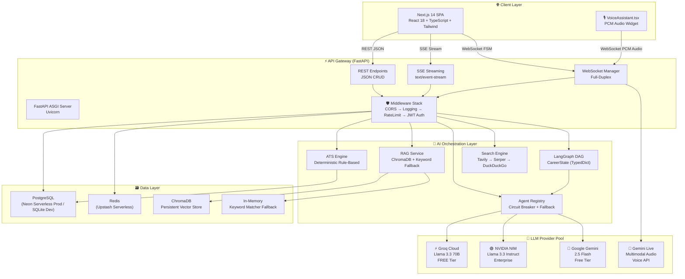
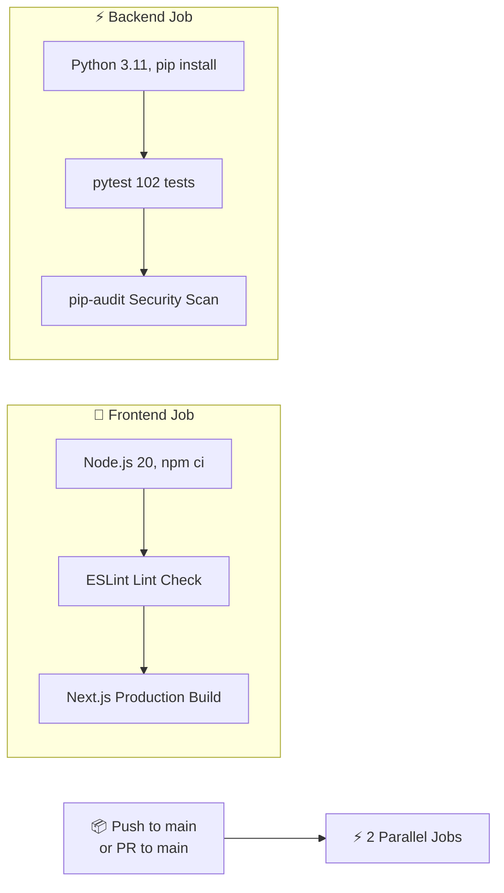
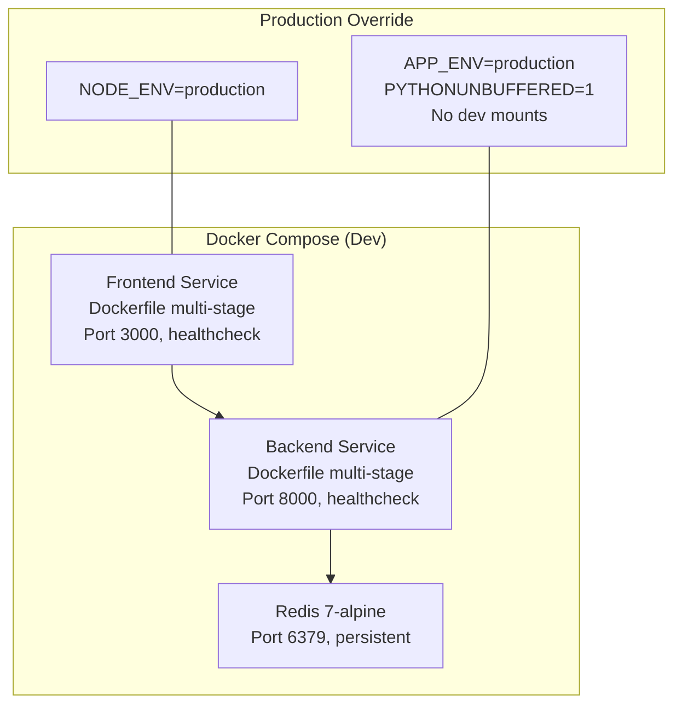

<div align="center">

```
 █████╗ ██╗      ██████╗ █████╗ ██████╗ ███████╗███████╗██████╗      ██╗
██╔══██╗██║     ██╔════╝██╔══██╗██╔══██╗██╔════╝██╔════╝██╔══██╗     ██║
███████║██║     ██║     ███████║██████╔╝█████╗  █████╗  ██████╔╝     ██║
██╔══██║██║     ██║     ██╔══██║██╔══██╗██╔══╝  ██╔══╝  ██╔══██╗     ██║
██║  ██║██║     ╚██████╗██║  ██║██║  ██║███████╗███████╗██║  ██║     ██║
╚═╝  ╚═╝╚═╝      ╚═════╝╚═╝  ╚═╝╚═╝  ╚═╝╚══════╝╚══════╝╚═╝  ╚═╝     ╚═╝

██╗    ███╗   ███╗███████╗███╗   ██╗████████╗ ██████╗ ██████╗ 
██║    ████╗ ████║██╔════╝████╗  ██║╚══██╔══╝██╔═══██╗██╔══██╗
██║    ██╔████╔██║█████╗  ██╔██╗ ██║   ██║   ██║   ██║██████╔╝
██║    ██║╚██╔╝██║██╔══╝  ██║╚██╗██║   ██║   ██║   ██║██╔══██╗
█████╗██║ ╚═╝ ██║███████╗██║ ╚████║   ██║   ╚██████╔╝██║  ██║
╚════╝╚═╝     ╚═╝╚══════╝╚═╝  ╚═══╝   ╚═╝    ╚═════╝ ╚═╝  ╚═╝

```

### ✦ **6 Specialized AI Workflows. 1 Career Transformation.** ✦

> 🎯 **Resume Intelligence** · 🗺️ **Personalized Roadmaps** · 📈 **Live Market Intel** · 🎤 **Streaming Mock Interviews** · 🎙️ **Real-time AI Voice Coach** · 🔗 **LinkedIn Optimization**

<br/>


<br/>

[](https://ai-career-mentor-anil.vercel.app)
[](https://ai-career-mentor-rrpu.onrender.com/docs)
[](https://microsoft.com)
[](https://devpost.com)
[](./ARCHITECTURE.md)
[](./SYSTEM.md)

</div>

---

## 📑 **Table of Contents**

| # | Section | 🔗 |
|---|---------|-----|
| 1 | [🧭 What is AI Career Mentor?](#-what-is-ai-career-mentor) | Project Overview |
| 2 | [📊 Key Numbers at a Glance](#-key-numbers-at-a-glance) | Metrics & Stats |
| 3 | [🏗️ System Architecture Overview](#%EF%B8%8F-system-architecture-overview) | High-Level Design |
| 4 | [🛠️ Complete Tech Stack & Tooling](#%EF%B8%8F-complete-tech-stack--tooling) | Full Stack Details |
| 5 | [✨ Core Features Deep Dive](#-core-features-deep-dive) | 6 AI Workflows |
| 6 | [🔄 Data Flow & Pipelines](#-data-flow--pipelines) | How Data Moves |
| 7 | [🤖 Model Selector & AI Routing](#-model-selector--ai-routing) | Circuit Breakers & Fallback |
| 8 | [🧬 Hybrid Semantic RAG Engine](#-hybrid-semantic-rag-engine) | ChromaDB + Fallback |
| 9 | [🗃️ Database Schema & ERD](#%EF%B8%8F-database-schema--erd) | 6 Core Tables |
| 10 | [🔒 Rate Limiting & Security](#-rate-limiting--security) | Multi-Layer Protection |
| 11 | [🚀 Local Setup Guide](#-local-setup-guide) | 5-Minute Setup |
| 12 | [🐳 Docker Deployment](#-docker-deployment) | Containers |
| 13 | [📁 Complete Project Structure](#-complete-project-structure) | Deep Tree |
| 14 | [🧪 Testing Suite (102 Tests)](#-testing-suite-102-tests) | QA Coverage |
| 15 | [🔄 CI/CD Pipeline & Deployment](#-cicd-pipeline--deployment) | GitHub Actions |
| 16 | [🔑 Environment Variables](#-environment-variables) | Config Reference |
| 17 | [📚 Documentation Index](#-documentation-index) | All Docs |
| 18 | [🏆 Hackathon Achievements](#-hackathon-achievements) | Awards |

---

## 🧭 **What is AI Career Mentor?**

**AI Career Mentor** is a **production-grade, full-stack career coaching platform** 🤖 that transforms career confusion into concrete execution plans. It orchestrates **6 specialized AI workflows** through a unified dashboard with **real-time streaming**, **voice conversations**, and **intelligent fallback systems**.

### 🎯 **The Problem It Solves**

> Developers waste **months** figuring out career transitions — what skills to learn, which companies to target, how to optimize their profiles, and how to prepare for interviews. AI Career Mentor **automates all of this** in minutes.

### 🚀 **The 6 AI Workflows**

| # | 🚦 Workflow | 🚇 Transport | ⚙️ Engine | 🎯 What It Does |
|---|-------------|-------------|-----------|-----------------|
| 1 | **📄 Resume Intelligence** | `REST` | Deterministic ATS + LLM Hybrid | ATS scoring, skill extraction, gap analysis, experience parsing |
| 2 | **🗺️ Career Roadmap Builder** | `REST` | LangGraph + RAG + Google Gemini | 8-week gamified learning plans with curated resources |
| 3 | **📈 Market Explorer** | `REST` | Tavily/Serper + Groq LLM | Real-time salary data, hiring trends, company intelligence |
| 4 | **🔗 LinkedIn Optimizer** | `REST` | Groq/NVIDIA + Programmatic Fallback | Profile optimization with ATS keyword injection, recruiter trends |
| 5 | **🎤 Mock Interview Engine** | `🔌 WebSocket` | 7-Phase FSM + NVIDIA NIM | Adaptive coding interviews with TTS audio and scoring |
| 6 | **🎙️ Anya Voice Coach** | `🔌 WebSocket` | Gemini Live Multimodal API | Real-time bidirectional Hinglish voice career coaching |

---

## 📊 **Key Numbers at a Glance**

| 📏 Metric | 📈 Value |
|-----------|----------|
| **🤖 AI Workflows** | **6 core workflows** (Resume, Roadmap, Market, LinkedIn, Interview, Voice Coach) |
| **📐 Analysis Graph** | **Parallel DAG** — fans out Resume + Market, fans in to LinkedIn + Roadmap (latency reduction ~60%) |
| **🛤️ Learning Path** | **8 weeks** with experience-level adaptation (Beginner/Intermediate/Advanced), completion tracking, gamified progress |
| **🎙️ Voice Coach** | **Anya** (Hinglish persona), real-time 16kHz/24kHz full-duplex WebSocket proxy, **2 calls/day limit**, 7.5 min max duration |
| **🎤 Mock Interview** | **7-phase FSM** — Intro → CS Fundamentals → Code → Projects → System Design → Domain → Closing |
| **🧪 Test Coverage** | **102 passing tests** across 10 test files covering agent registry, validation, ATS engine, market service, roadmap, voice |
| **🚦 Rate Limits** | **100 req/hr · 1000 req/day** (global) + per-feature daily caps via Redis + 48h gap locks for premium features |
| **🤖 Primary LLMs** | **Groq (Llama 3.3 70B)** · **NVIDIA NIM (Llama 3.3 Instruct)** · **Google Gemini (2.5 Flash)** |
| **🗃️ RAG Store** | **ChromaDB persistent store** + lightweight in-memory keyword matcher fallback for OOM safety on 512MB RAM |
| **🐳 Docker** | **Multi-stage builds** (backend: Python 3.11-slim, frontend: Next.js standalone) + Docker Compose for dev |
| **🌍 Deployment** | **Vercel** (frontend) · **Render** (backend Docker container) · **Neon Postgres** · **Upstash Redis** |
| **⚙️ CI/CD** | **GitHub Actions** — 2 parallel jobs: Frontend (Node 20, lint, build) + Backend (Python 3.11, 102 tests, audit) |
| **🌐 Live Links** | 🌍 [Live App](https://ai-career-mentor-anil.vercel.app) · 📘 [API Docs](https://ai-career-mentor-rrpu.onrender.com/docs) |

---

## 🏗️ **System Architecture Overview**

The platform uses a **decoupled frontend/backend architecture** with **3 communication protocols**: REST (CRUD), SSE (streaming), and WebSocket (real-time bidirectional).

### 🧭 **Architecture at 30,000 Feet**


```mermaid
graph TB
    subgraph "🌐 Client Layer"
        UI["Next.js 14 SPA<br/>React 18 + TypeScript + Tailwind"]
        VC["🎙️ VoiceAssistant.tsx<br/>PCM Audio Widget"]
    end

    subgraph "⚡ API Gateway (FastAPI)"
        GATEWAY["FastAPI ASGI Server<br/>Uvicorn"]
        API["REST Endpoints<br/>JSON CRUD"]
        SSE["SSE Streaming<br/>text/event-stream"]
        WS["WebSocket Manager<br/>Full-Duplex"]
        MID["🛡️ Middleware Stack<br/>CORS → Logging → RateLimit → JWT Auth"]
    end

    subgraph "🧠 AI Orchestration Layer"
        LANG["LangGraph DAG<br/>CareerState (TypedDict)"]
        REG["Agent Registry<br/>Circuit Breaker + Fallback"]
        ATS["ATS Engine<br/>Deterministic Rule-Based"]
        RAG["RAG Service<br/>ChromaDB + Keyword Fallback"]
        SE["Search Engine<br/>Tavily → Serper → DuckDuckGo"]
    end

    subgraph "🤖 LLM Provider Pool"
        GROQ["⚡ Groq Cloud<br/>Llama 3.3 70B<br/>FREE Tier"]
        NVD["🟢 NVIDIA NIM<br/>Llama 3.3 Instruct<br/>Enterprise"]
        GEM["🔵 Google Gemini<br/>2.5 Flash<br/>Free Tier"]
        GML["🔵 Gemini Live<br/>Multimodal Audio<br/>Voice API"]
    end

    subgraph "🗃️ Data Layer"
        PG["PostgreSQL<br/>(Neon Serverless Prod / SQLite Dev)"]
        RD["Redis<br/>(Upstash Serverless)"]
        CD["ChromaDB<br/>Persistent Vector Store"]
        MEM["In-Memory<br/>Keyword Matcher Fallback"]
    end

    UI -->|"REST JSON"| API
    UI -->|"SSE Stream"| SSE
    UI -->|"WebSocket FSM"| WS
    VC -->|"WebSocket PCM Audio"| WS
    
    API & SSE & WS --> MID
    MID --> LANG & REG & ATS & RAG & SE
    
    LANG --> REG
    REG --> GROQ & NVD & GEM
    WS --> GML
    
    MID --> PG & RD
    RAG --> CD & MEM
    ATS --> PG
```

---

## 🛠️ **Complete Tech Stack & Tooling**

### 💻 **Frontend — Next.js 14 SPA Console**

| Layer | Technology | Purpose |
|-------|-----------|---------|
| **📐 Framework** | `Next.js 14` (App Router) + `React 18` + `TypeScript` | Structured UI, SSR, static generation |
| **🎨 Styling** | `Tailwind CSS` + CSS Variables | Responsive dark mode, glassmorphism, HUD layouts |
| **💻 Code Editor** | `@monaco-editor/react` | Interactive coding workspace during technical interviews |
| **📊 Charts** | `Recharts` | Activity logs, streaks, ATS sub-score visualizations |
| **📁 File Upload** | `react-dropzone` | Drag-and-drop resume PDF upload |
| **🔐 Auth** | `@react-oauth/google` | Seamless Google OAuth 2.0 sign-in |
| **🌐 Networking** | `Axios` (custom interceptor wrapper) | JWT auto-attach, 401 auto-refresh, error toasts |
| **🔔 Notifications** | `react-hot-toast` | Real-time validation and progress notifications |
| **📝 Markdown** | `react-markdown` | Display LLM-generated roadmaps and strategies |

### ⚡ **Backend — Async FastAPI Gateway**

| Layer | Technology | Purpose |
|-------|-----------|---------|
| **⚡ Framework** | `FastAPI` (Python 3.11+) | Async REST + WebSocket + SSE |
| **🖥️ Server** | `Uvicorn` | ASGI event loop with WebSocket support |
| **🧠 Orchestration** | `LangGraph` | Parallel DAG (fan-out/fan-in) for career analysis |
| **🤖 Agent Framework** | `AutoGen` / `ag2` | Multi-agent pipeline support |
| **🔗 LLM Abstraction** | `LangChain Core` | Unified provider wrappers |
| **📄 PDF Extraction** | `pdfplumber` | Precise ATS token extraction from PDFs |
| **🎤 TTS** | `edge-tts` | Sentence-sliced text-to-speech for interview audio |
| **🔐 Security** | `python-jose` + `bcrypt` | JWT tokens, password hashing |
| **🚦 Rate Limiting** | `SlowAPI` | IP + token-based rate limiting |

### 🗃️ **Databases & Cache System**

| System | Technology | Role |
|--------|-----------|------|
| **🗄️ Primary DB** | `PostgreSQL` (Neon Serverless) | Production relational data |
| **📦 Dev DB** | `SQLite` | Local development fallback |
| **🔗 ORM** | `SQLAlchemy 2.0` + `Alembic` | Async engine, schema migrations |
| **⚡ Cache** | `Upstash Redis` | Rate limits, 48h locks, session storage |
| **🧠 Vector Store** | `ChromaDB` (Persistent) | RAG resource embeddings |
| **📝 Memory Fallback** | In-Memory Keyword Matcher | OOM-safe fallback for 512MB RAM |

### 🤖 **AI Providers & APIs**

| Provider | Model | Use Case | Cost |
|----------|-------|----------|------|
| **⚡ Groq Cloud** | Llama 3.3 70B | Market analysis, LinkedIn optimization | ✅ FREE |
| **🟢 NVIDIA NIM** | Llama 3.3 Instruct | Resume analysis, mock interviews | 💰 Enterprise |
| **🔵 Google Gemini** | Gemini 2.5 Flash | Roadmap generation, general tasks | ✅ Free Tier |
| **🔵 Gemini Live** | Multimodal Audio | Voice coaching (Anya) | ✅ Free Tier |
| **🔍 Tavily** | Search API | Live market intelligence | 💰 Paid |
| **🔍 Serper** | Google Search | Market fallback search | 💰 Paid |
| **🦆 DuckDuckGo** | Search | Resource enrichment | ✅ FREE |

### 🐳 **Docker Infrastructure**

| Component | Type | Details |
|-----------|------|---------|
| **Backend Image** | Multi-stage (builder + production) | Python 3.11-slim, virtual env, non-root user |
| **Frontend Image** | Multi-stage (deps + builder + runner) | Node 20-alpine, Next.js standalone, dumb-init |
| **Docker Compose** | 3 services | Backend (8000) + Frontend (3000) + Redis (6379) |
| **Prod Compose** | Override file | Sets `APP_ENV=production`, removes dev mounts |

---

## ✨ **Core Features Deep Dive**

### 📄 **1. Resume Intelligence System**

- 🏆 **Hybrid Architecture**: Rule-based ATS engine (zero LLM cost) + LLM enrichment for accuracy
- ⚡ **80+ Skill Aliases**: Maps `reactjs` → `React`, `k8s` → `Kubernetes`, etc.
- 📅 **Intelligent Date Parsing**: Merges overlapping intervals for true cumulative experience
- 📊 **4-Factor ATS Score**: Keywords (35) + Achievements (30) + Action Verbs (20) + Formatting (15) = 100
- 🛡️ **Multi-Layer Fallback**: 2 LLM providers → deterministic fallback → graceful degradation

### 🗺️ **2. Gamified Roadmap & Resource Tracker**

- 🏅 **Title Progression**: *Novice Developer* → *Production Ready* based on syllabus %
- ✅ **Week Completion Toggle**: Persisted to DB with `PUT /roadmap/:id/toggle-week/:n`
- 📝 **Weekly Quizzes**: 5 MCQs per week via NVIDIA NIM + offline fallback
- 🎯 **Experience-Level Adaptation**: Beginner / Intermediate / Advanced content tailoring

### 📈 **3. Live Market Explorer**

- 🌍 **30+ Roles, 50+ Locations**: India (12), USA (8), UK (10), Europe, Middle East, APAC
- 💰 **Currency Intelligence**: Auto-formats ₹ / $ / £ / € / A$ per location
- 🔍 **Dual Search Engines**: Tavily (primary) → Serper (fallback) → Deep URL scraping

### 🎤 **4. Adaptive Mock Interviews (WebSocket FSM)**

- 7-Phase FSM: Intro → CS Fundamentals → LeetCode → Project Deep-Dive → System Design → Company Domain → Closing
- Role-adaptive content per category: SWE, Data/AI, Infra/Cloud, Security, Product, Gaming
- Dual modes: Technical (code-focused) and Behavioral (STAR method)

### 🎙️ **5. Real-time AI Voice Coach (Anya)**

- Hinglish persona, Google Aoede voice, Gemini Live API
- Context-aware: Knows resume, roadmap, target role, market data
- Safety: 7.5 min max call, 2 calls/day limit

### 🔗 **6. LinkedIn Profile Optimizer**

- 3 ATS-optimized headline options with emojis
- Full about section with markdown formatting
- Recruiter search trend analysis
- Programmatic fallback when LLM unavailable

---

## 🔄 **CI/CD Pipeline & Deployment**

### ⚙️ **Real GitHub Actions Workflow (`.github/workflows/ci.yml`)**


```mermaid
flowchart LR
    TRIGGER["📦 Push to main<br/>or PR to main"]
    
    TRIGGER --> PARALLEL["⚡ 2 Parallel Jobs"]
    
    subgraph "📱 Frontend Job"
        F1["Node.js 20, npm ci"]
        F1 --> F2["ESLint Lint Check"]
        F2 --> F3["Next.js Production Build"]
    end
    
    subgraph "⚡ Backend Job"
        B1["Python 3.11, pip install"]
        B1 --> B2["pytest 102 tests"]
        B2 --> B3["pip-audit Security Scan"]
    end

    class F3 result
    class B3 result
```

The actual pipeline runs **2 parallel jobs**:

```
Frontend Job (ubuntu-latest):
  1. Checkout code
  2. Setup Node.js 20 (with npm cache)
  3. npm ci (clean install from lockfile)
  4. npm run lint -w frontend (ESLint)
  5. npm run build -w frontend (Next.js production build)

Backend Job (ubuntu-latest, working-dir: backend):
  1. Checkout code
  2. Setup Python 3.11 (with pip cache)
  3. pip install -r requirements.txt
  4. Run 102 tests (SQLite, CI secret key, Groq API)
  5. pip-audit security scan (with ignore for known false positives)
```

### 🐳 **Actual Docker Architecture**


```mermaid
graph TB
    subgraph "Docker Compose (Dev)"
        BE["Backend Service<br/>Dockerfile multi-stage<br/>Port 8000, healthcheck"]
        FE["Frontend Service<br/>Dockerfile multi-stage<br/>Port 3000, healthcheck"]
        RD["Redis 7-alpine<br/>Port 6379, persistent"]
    end
    
    subgraph "Production Override"
        PBE["APP_ENV=production<br/>PYTHONUNBUFFERED=1<br/>No dev mounts"]
        PFE["NODE_ENV=production"]
    end
    
    BE --> RD
    FE --> BE
    PBE --- BE
    PFE --- FE
```

**Backend Dockerfile (2-stage)**:
- **Builder Stage**: Python 3.11-slim, installs gcc + libpq-dev, creates venv, installs pip deps
- **Production Stage**: Python 3.11-slim, copies venv, creates non-root user `appuser`, runs migrations + uvicorn

**Frontend Dockerfile (3-stage)**:
- **Deps Stage**: Node 20-alpine, installs dependencies from lockfile
- **Builder Stage**: Copies deps, builds Next.js with env args (API URL, Google Client ID)
- **Production Stage**: Node 20-alpine, copies `.next/standalone`, runs with dumb-init

### ☁️ **Render Deployment (`render.yaml`)**

```yaml
services:
  - type: web
    name: ai-career-mentor-backend
    env: docker
    rootDir: backend
    plan: free
```

The backend is deployed on **Render Free Tier**:
- Docker-based deployment from `backend/` directory
- Auto-deploys on pushes to `main` branch
- Health check at `/ping`
- 512MB RAM (ChromaDB auto-disabled for OOM safety)

The frontend is deployed on **Vercel**:
- Connected to GitHub repo
- Auto-deploys on pushes to `main` branch
- Environment variables: `NEXT_PUBLIC_API_URL`, `NEXT_PUBLIC_GOOGLE_CLIENT_ID`

### 🛡️ **Production Hardening Checklist**

| # | Measure | File | Status |
|:-:|---------|------|:------:|
| 1 | 🔄 **Auto-Deploy** | Render (`main` push) + Vercel (`main` push) | ✅ |
| 2 | 🛡️ **OOM Prevention** | ChromaDB auto-disabled on `RENDER` env | ✅ |
| 3 | ⏰ **48-Hour Locks** | Redis TTL keys for premium features | ✅ |
| 4 | 🔐 **Non-root User** | Backend: `appuser`, Frontend: `nextjs` | ✅ |
| 5 | 🚫 **SQLite Guard** | Blocks SQLite in production at startup | ✅ |
| 6 | 🚫 **Default Secret Guard** | Blocks default SECRET_KEY in production | ✅ |
| 7 | ✅ **Pipeline Integrity** | ESLint + 102 Tests + Security Audit | ✅ |
| 8 | 🖥️ **Health Checks** | Backend: `/health`, Frontend: wget `:3000` | ✅ |
| 9 | 📦 **Multi-stage Builds** | Minimizes final image size | ✅ |
| 10 | 🏥 **Dumb-init** | Frontend uses `dumb-init` for signal handling | ✅ |

---

## 🚀 **Local Setup Guide**

### ✅ **Prerequisites**

| Tool | Version | Purpose |
|------|---------|---------|
| 🐍 Python | 3.11+ | Backend runtime |
| 🟢 Node.js | 20+ | Frontend runtime |
| 📦 Docker | Latest | Containerized development (optional) |

### 📥 **Step 1: Clone & Set Up Backend**

```bash
git clone https://github.com/Anil-Pradhan-web/ai-career-mentor.git
cd ai-career-mentor/backend
python -m venv venv
venv\Scripts\activate  # Windows: venv\Scripts\activate
pip install -r requirements.txt
cp .env.example .env
```

### 🔑 **Step 2: Configure Environment Variables**

Edit `backend/.env` with your API keys (see [Environment Variables](#-environment-variables)).

### 🏃 **Step 3: Run Backend**

```bash
alembic upgrade head
uvicorn app.main:app --reload
```
Backend: http://localhost:8000 | Swagger: http://localhost:8000/docs

### 💻 **Step 4: Set Up Frontend**

```bash
cd ../frontend
npm install
# frontend/.env.local:
NEXT_PUBLIC_API_URL=http://localhost:8000
NEXT_PUBLIC_GOOGLE_CLIENT_ID=your_client_id
npm run dev
```
Frontend: http://localhost:3000

### 🐳 **Step 5: Docker (Alternative)**

```bash
# Development
docker compose up --build

# Production
docker compose -f docker-compose.yml -f docker-compose.prod.yml up --build
```

---

## 📁 **Complete Project Structure**

```
ai-career-mentor/
├── 📄 README.md, ARCHITECTURE.md, SYSTEM.md, API.md
├── 📄 docker-compose.yml, docker-compose.prod.yml
├── 📄 render.yaml, start.bat, .gitignore
│
├── 📁 .github/workflows/
│   └── ci.yml                    # GitHub Actions CI (2 parallel jobs)
│
├── 📁 backend/                    # 🐍 Python Backend
│   ├── 📄 Dockerfile             # Multi-stage build (builder + production)
│   ├── 📄 requirements.txt
│   ├── 📄 alembic.ini
│   │
│   ├── 📁 app/
│   │   ├── main.py               # FastAPI app, middleware, routes
│   │   ├── agents/               # Agent Registry + LangGraph DAG
│   │   ├── api/                  # All route handlers (9 modules)
│   │   ├── core/                 # Core services (database, security, ATS, RAG, etc.)
│   │   ├── models/               # ORM models + Pydantic schemas
│   │   └── data/                 # Curated RAG seed data
│   │
│   ├── tests/                    # 102 tests (10 files)
│   └── alembic/                  # DB migrations
│
├── 📁 frontend/                   # 💻 Next.js Frontend
│   ├── 📄 Dockerfile             # Multi-stage build (deps + builder + runner)
│   └── src/
│       ├── app/                  # App Router pages (landing, login + 8 dashboard pages)
│       ├── components/           # React components (landing, interview, charts, etc.)
│       ├── services/             # API client layer (9 service files)
│       └── types/                # TypeScript definitions
│
└── 📁 assets/
    └── banner.png
```

---

## 🧪 **Testing Suite (102 Tests)**

```bash
cd backend
PYTHONPATH=. python -m pytest tests/ -v
```

| 📁 Test File | ✅ Tests | 🎯 Scope |
|-------------|:-------:|----------|
| `test_agents_registry.py` | **26** | JSON extraction, circuit breaker, fallback chains |
| `test_roadmap_agents.py` | **24** | Fallback structures, detail batching, week normalization |
| `test_validation.py` | **14** | ATS score capping, coercion validators |
| `test_main.py` | **9** | Authentication, rate limiting, JWT tokens |
| `test_features.py` | **8** | Market scrapers, TTS audio, search algorithms |
| `test_ats_engine.py` | **5** | Experience date parser, interval merging |
| `test_market_service.py` | **5** | Salary conversions, role classifications |
| `test_gamified_roadmap.py` | **3** | Week completion triggers, quiz generation |
| `test_voice_assistant.py` | **3** | WebSocket authentication, Gemini config |
| `test_linkedin.py` | **2** | Fallback strategy, model structures |

---

## 🔑 **Environment Variables**

### ⚡ **Backend (`backend/.env`)**

| Variable | Required | Default | Description | Source |
|----------|:--------:|---------|-------------|--------|
| `LLM_PROVIDER` | ✅ | `groq` | Primary LLM (`groq`, `google`, `nvidia`) | — |
| `GROQ_API_KEY` | ✅ | — | Groq API key | [console.groq.com](https://console.groq.com) |
| `GOOGLE_API_KEY` | ✅ | — | Google AI Studio key | [aistudio.google.com](https://aistudio.google.com) |
| `NVIDIA_API_KEY` | ❌ | — | NVIDIA NIM API key | [build.nvidia.com](https://build.nvidia.com) |
| `DATABASE_URL` | ✅ | `sqlite:///./dev.db` | Database connection string | — |
| `SECRET_KEY` | ✅ | — | JWT signing secret | — |
| `GOOGLE_CLIENT_ID` | ✅ | — | Google OAuth Client ID | [console.cloud.google.com](https://console.cloud.google.com) |
| `TAVILY_API_KEY` | ❌ | — | Tavily search API | [tavily.com](https://tavily.com) |
| `SERPER_API_KEY` | ❌ | — | Serper Google Search | [serper.dev](https://serper.dev) |
| `REDIS_URL` | ❌ | `memory://` | Redis connection URL | [upstash.com](https://upstash.com) |
| `APP_ENV` | ❌ | `development` | `development` or `production` | — |

### 💻 **Frontend (`frontend/.env.local`)**

| Variable | Required | Description |
|----------|:--------:|-------------|
| `NEXT_PUBLIC_API_URL` | ✅ | Backend API base URL |
| `NEXT_PUBLIC_GOOGLE_CLIENT_ID` | ✅ | Google OAuth Client ID |

---

## 📚 **Documentation Index**

| 📄 Document | 📖 Description | 🎯 Best For |
|-------------|---------------|-------------|
| [**README.md**](./README.md) | Project overview, features, setup, architecture | 👋 Everyone |
| [**ARCHITECTURE.md**](./ARCHITECTURE.md) | System architecture with Mermaid diagrams | 🏗️ Developers |
| [**SYSTEM.md**](./SYSTEM.md) | System design, data flows, internals | 🖥️ Deep reference |
| [**API.md**](./API.md) | Complete REST + WebSocket API reference | 🌐 API consumers |

---

## 🏆 **Hackathon Achievements**

### 🏆 **Microsoft AI DevDays Hackathon ($480K)**
- ✅ Satisfied all AutoGen agentic pipeline guidelines
- ✅ Multi-agent orchestration with LangGraph
- ✅ Production-grade MVP deployment with CI/CD

### 🏆 **Amazon Nova AI Hackathon ($495K)**
- ✅ Multi-agent execution graphs with fallback chains
- ✅ Audio-enabled interfaces (TTS + Voice Coach)
- ✅ Docker deployment with multi-stage builds

---

<div align="center">

**Built with 🧠 by [Anil Pradhan](https://github.com/Anil-Pradhan-web)**

| `#LangGraph` `#NVIDIANIM` `#GoogleOAuth` `#RAG` `#ChromaDB` |
| `#FastAPI` `#NextJS` `#Groq` `#Gemini` `#GeminiLive` |
| `#WebSocket` `#VoiceAI` `#Pytest` `#Docker` `#CI/CD` |

</div>