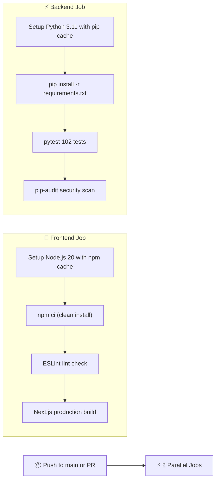

<div align="center">

```
  █████╗ ██╗     ██████╗  █████╗  ██████╗  ███████╗ ███████╗ ██████╗ 
 ██╔══██╗██║    ██╔════╝ ██╔══██╗ ██╔══██╗ ██╔════╝ ██╔════╝ ██╔══██╗
 ███████║██║    ██║      ███████║ ██████╔╝ █████╗   █████╗   ██████╔╝
 ██╔══██║██║    ██║      ██╔══██║ ██╔══██╗ ██╔══╝   ██╔══╝   ██╔══██╗
 ██║  ██║██║    ╚██████╗ ██║  ██║ ██║  ██║ ███████╗ ███████╗ ██║  ██║
 ╚═╝  ╚═╝╚═╝     ╚═════╝ ╚═╝  ╚═╝ ╚═╝  ╚═╝ ╚══════╝ ╚══════╝ ╚═╝  ╚═╝

 ███╗   ███╗ ███████╗ ███╗   ██╗ ████████╗  ██████╗  ██████╗ 
 ████╗ ████║ ██╔════╝ ████╗  ██║ ╚══██╔══╝ ██╔═══██╗ ██╔══██╗
 ██╔████╔██║ █████╗   ██╔██╗ ██║    ██║    ██║   ██║ ██████╔╝
 ██║╚██╔╝██║ ██╔══╝   ██║╚██╗██║    ██║    ██║   ██║ ██╔══██╗
 ██║ ╚═╝ ██║ ███████╗ ██║ ╚████║    ██║    ╚██████╔╝ ██║  ██║
 ╚═╝     ╚═╝ ╚══════╝ ╚═╝  ╚═══╝    ╚═╝     ╚═════╝  ╚═╝  ╚═╝
```

### ✦ **6 Specialized AI Workflows. 1 Career Transformation.** ✦

> 🎯 **Resume Intelligence** · 🗺️ **Personalized Roadmaps** · 📈 **Live Market Intel** · 🎤 **Streaming Mock Interviews** · 🎙️ **Real-time AI Voice Coach** · 🔗 **LinkedIn Optimization**

<br/>


<br/>

[](https://ai-career-mentor-anil.vercel.app)
[](https://ai-career-mentor-rrpu.onrender.com/docs)
[](https://microsoft.com)
[](https://devpost.com)
[](./ARCHITECTURE.md)
[](./SYSTEM.md)

</div>

---

## 📑 **Table of Contents**

| # | Section | 🔗 |
|---|---------|-----|
| 1 | [🧭 What is AI CAREER MENTOR?](#-what-is-ai-career-mentor) | Project Overview |
| 2 | [📊 Key Numbers at a Glance](#-key-numbers-at-a-glance) | Metrics & Stats |
| 3 | [🏗️ System Architecture Overview](#%EF%B8%8F-system-architecture-overview) | High-Level Design |
| 4 | [🛠️ Complete Tech Stack & Tooling](#%EF%B8%8F-complete-tech-stack--tooling) | Full Stack Details |
| 5 | [🔄 CI/CD Pipeline & Docker](#-cicd-pipeline--docker) | GitHub Actions + Docker |
| 6 | [📁 Complete Project Structure](#-complete-project-structure) | Deep Tree |
| 7 | [🧪 Testing Suite (102 Tests)](#-testing-suite-102-tests) | QA Coverage |
| 8 | [🚀 Local Setup Guide](#-local-setup-guide) | 5-Minute Setup |
| 9 | [🔑 Environment Variables](#-environment-variables) | Config Reference |
| 10 | [📚 Documentation Index](#-documentation-index) | All Docs |
| 11 | [🏆 Hackathon Achievements](#-hackathon-achievements) | Awards |

---

## 🧭 **What is AI CAREER MENTOR?**

**AI CAREER MENTOR** is a **production-grade, full-stack career coaching platform** 🤖 that transforms career confusion into concrete execution plans. It orchestrates **6 specialized AI workflows** through a unified dashboard with **real-time streaming**, **voice conversations**, and **intelligent fallback systems**.

### 🎯 **The Problem It Solves**

> Developers waste **months** figuring out career transitions — what skills to learn, which companies to target, how to optimize their profiles, and how to prepare for interviews. AI CAREER MENTOR **automates all of this** in minutes.

### 🚀 **The 6 AI Workflows**

| # | 🚦 Workflow | 🚇 Transport | ⚙️ Engine | 🎯 What It Does |
|---|-------------|-------------|-----------|-----------------|
| 1 | **📄 Resume Intelligence** | `REST` | Deterministic ATS + LLM Hybrid | ATS scoring, skill extraction, gap analysis, experience parsing |
| 2 | **🗺️ Career Roadmap Builder** | `REST` | LangGraph + RAG + Google Gemini | 8-week gamified learning plans with curated resources |
| 3 | **📈 Market Explorer** | `REST` | Tavily/Serper + Groq LLM | Real-time salary data, hiring trends, company intelligence |
| 4 | **🔗 LinkedIn Optimizer** | `REST` | Groq/NVIDIA + Programmatic Fallback | Profile optimization with ATS keyword injection, recruiter trends |
| 5 | **🎤 Mock Interview Engine** | `🔌 WebSocket` | 7-Phase FSM + NVIDIA NIM | Adaptive coding interviews with TTS audio and scoring |
| 6 | **🎙️ Anya Voice Coach** | `🔌 WebSocket` | Gemini Live Multimodal API | Real-time bidirectional Hinglish voice career coaching |

### 🛡️ **Premium Admin & Observability Infrastructure**

In addition to user-facing workflows, AI CAREER MENTOR includes a premium dashboard for administrators to monitor the health and performance of the platform:

| # | 🚦 Infrastructure | 🚇 Transport | ⚙️ Engine | 🎯 What It Does |
|---|------------------|-------------|-----------|-----------------|
| 7 | **📊 Observability Dashboard** | `REST` (HTTP) | Redis Serverless + Postgres Rollups | Live counters (active users, WebSockets), provider latencies, daily rollups, and error logs feed |
| 8 | **📈 Telemetry Endpoint** | `REST` (HTTP) | Prometheus Instrumentator | Exposes raw Prometheus metrics for system scraping and alerting |

* **Automated Loguru Error Sink**: Intercepts all system-wide `logger.error` and `logger.critical` calls to automatically capture and display backend errors directly in the Admin console telemetry feed.

---

## 📊 **Key Numbers at a Glance**

| 📏 Metric | 📈 Value |
|-----------|----------|
| **🤖 AI Workflows** | **6 core workflows** (Resume, Roadmap, Market, LinkedIn, Interview, Voice Coach) |
| **📐 Analysis Graph** | **Parallel DAG** — fans out Resume + Market, fans in to LinkedIn + Roadmap (latency ~60%) |
| **🛤️ Learning Path** | **8 weeks** with experience-level adaptation, completion tracking, gamified progress |
| **🎙️ Voice Coach** | **Anya** (Hinglish persona), 16kHz/24kHz full-duplex WebSocket, **2 calls/day**, 7.5 min max |
| **🎤 Mock Interview** | **7-phase FSM** — Intro, CS, Code, Projects, System Design, Domain, Closing |
| **🧪 Test Coverage** | **104 passing tests** across 11 test files |
| **🚦 Rate Limits** | **100 req/hr · 1000 req/day** (global) + per-feature caps + 48h locks |
| **🤖 Primary LLMs** | **Groq (Llama 3.3 70B)** · **NVIDIA NIM** · **Google Gemini (2.5 Flash)** |
| **🗃️ RAG Store** | **ChromaDB** + in-memory keyword fallback for OOM safety |
| **🐳 Docker** | **Multi-stage builds** (backend 2-stage, frontend 3-stage) |
| **🌍 Deployment** | **Vercel** (frontend) · **Render** (backend Docker) · **Neon** (Postgres) · **Upstash** (Redis) |
| **⚙️ CI/CD** | **GitHub Actions** — 2 parallel jobs: Frontend (lint+build) + Backend (tests+audit) |

---

## 🏗️ **System Architecture Overview**

> 📐 **Full architecture diagrams with Mermaid** → See [**ARCHITECTURE.md**](./ARCHITECTURE.md)

The system follows a **layered architecture** with 5 distinct tiers:

| Layer | Components |
|-------|------------|
| **🌐 Client** | Next.js 14 SPA · VoiceAssistant.tsx (PCM Audio) · Interview Console (Monaco) |
| **⚡ API Gateway** | FastAPI ASGI · REST + SSE + WebSocket · Middleware: CORS → Logger → SlowAPI → JWT |
| **🧠 AI Orchestration** | LangGraph DAG · Agent Registry + Circuit Breaker · ATS Engine · RAG (ChromaDB) · Search (Tavily/Serper/DDG) |
| **🤖 LLM Providers** | Groq Cloud (Llama 3.3 70B) · NVIDIA NIM · Google Gemini (2.5 Flash) · Gemini Live (Multimodal Audio) |
| **🗃️ Data** | PostgreSQL (Neon) · Redis (Upstash) · ChromaDB · In-Memory Keyword Fallback |

---

## 🛠️ **Complete Tech Stack & Tooling**

### 💻 **Frontend — Next.js 14 SPA Console**

| Layer | Technology |
|-------|-----------|
| **📐 Framework** | `Next.js 14` (App Router) + `React 18` + `TypeScript` |
| **🎨 Styling** | `Tailwind CSS` + CSS Variables |
| **💻 Code Editor** | `@monaco-editor/react` |
| **📊 Charts** | `Recharts` |
| **📁 File Upload** | `react-dropzone` |
| **🔐 Auth** | `@react-oauth/google` |
| **🌐 Networking** | `Axios` (custom interceptor wrapper) |
| **🔔 Notifications** | `react-hot-toast` |
| **📝 Markdown** | `react-markdown` |

### ⚡ **Backend — Async FastAPI Gateway**

| Layer | Technology |
|-------|-----------|
| **⚡ Framework** | `FastAPI` (Python 3.11+) + `Uvicorn` |
| **🧠 Orchestration** | `LangGraph` + `AutoGen/ag2` + `LangChain Core` |
| **📄 PDF Extraction** | `pdfplumber` |
| **🎤 TTS** | `edge-tts` |
| **🔐 Security** | `python-jose` + `bcrypt` |
| **🚦 Rate Limiting** | `SlowAPI` |
| **🛡️ Observability** | `sentry-sdk[fastapi]` + `prometheus-fastapi-instrumentator` |

### 🗃️ **Databases & Cache**

| System | Technology |
|--------|-----------|
| **🗄️ Primary DB** | `PostgreSQL` (Neon Serverless) |
| **📦 Dev DB** | `SQLite` |
| **🔗 ORM** | `SQLAlchemy 2.0` + `Alembic` |
| **⚡ Cache** | `Upstash Redis` |
| **🧠 Vector Store** | `ChromaDB` + In-Memory Keyword Fallback |

### 🤖 **AI Providers & APIs**

| Provider | Model | Cost |
|----------|-------|:----:|
| **⚡ Groq Cloud** | Llama 3.3 70B | ✅ FREE |
| **🟢 NVIDIA NIM** | Llama 3.3 Instruct | 💰 Enterprise |
| **🔵 Google Gemini** | Gemini 2.5 Flash | ✅ Free Tier |
| **🔵 Gemini Live** | Multimodal Audio | ✅ Free Tier |
| **🔍 Tavily** | Search API | 💰 Paid |
| **🔍 Serper** | Google Search | 💰 Paid |
| **🦆 DuckDuckGo** | Search | ✅ FREE |

---

## 🔄 **CI/CD Pipeline & Docker**

### ⚙️ **Real GitHub Actions Workflow (`.github/workflows/ci.yml`)**


```mermaid
flowchart LR
    TRIGGER["📦 Push to main or PR"]
    TRIGGER --> PARALLEL["⚡ 2 Parallel Jobs"]
    
    subgraph "📱 Frontend Job"
        F1["Setup Node.js 20 with npm cache"]
        F1 --> F2["npm ci (clean install)"]
        F2 --> F3["ESLint lint check"]
        F3 --> F4["Next.js production build"]
    end
    
    subgraph "⚡ Backend Job"
        B1["Setup Python 3.11 with pip cache"]
        B1 --> B2["pip install -r requirements.txt"]
        B2 --> B3["pytest 102 tests"]
        B3 --> B4["pip-audit security scan"]
    end
```

### 🐳 **Docker Architecture**

> 📐 **Full Docker diagrams** → See [**ARCHITECTURE.md § Deployment**](./ARCHITECTURE.md#9-%EF%B8%8F-deployment-topology) · **Setup guide** → See [**DOCKER_GUIDE.md**](./DOCKER_GUIDE.md)

| Service | Dockerfile | Stages | Port |
|---------|-----------|:------:|:----:|
| **Backend** | `backend/Dockerfile` | 2-stage (builder → production) | 8000 |
| **Frontend** | `frontend/Dockerfile` | 3-stage (deps → builder → runner) | 3000 |
| **Redis** | `redis:7-alpine` | — | 6379 |

### ☁️ **Deployment**
- **Render**: `render.yaml` — Docker auto-deploy from `backend/` on `main` push (Free Tier, 512MB RAM)
- **Vercel**: Connected to GitHub, auto-deploy on `main` push

---

## 📁 **Complete Project Structure**

The complete project tree with all 200+ source files:

```
AI-CAREER-MENTOR/
│
├── 📄 Root Files (Project Config)
│   ├── .gitignore
│   ├── package.json                         # Workspace root (npm workspaces)
│   ├── package-lock.json
│   ├── start.bat                            # Windows startup script
│   ├── render.yaml                          # Render deployment config
│   ├── LICENSE                              # MIT License
│   ├── clear_cache.py                       # Redis cache management utility
│   ├── clear_db.py                          # Database purge & reset script
│   │
│   ├── 📄 Documentation (4 files)
│   │   ├── README.md                        # This file
│   │   ├── ARCHITECTURE.md                  # System architecture (Mermaid diagrams)
│   │   ├── SYSTEM.md                        # Comprehensive system design
│   │   ├── API.md                           # Complete API reference
│   │   └── DOCKER_GUIDE.md                  # Docker deployment guide
│   │
│   ├── 🐳 Docker Configuration
│   │   ├── docker-compose.yml               # Dev: backend + frontend + redis
│   │   └── docker-compose.prod.yml          # Production overrides
│   │
│   └── 📁 assets/
│       └── banner.png
│
├── 📁 .github/workflows/
│   └── ci.yml                               # GitHub Actions CI (2 parallel jobs)
│
├── 📁 backend/                               # 🐍 Python Backend (FastAPI)
│   ├── Dockerfile                            # Multi-stage (2 stages)
│   ├── requirements.txt                      # Python dependencies
│   ├── alembic.ini                           # DB migration config
│   ├── .gitignore
│   │
│   ├── 📁 app/                               # Main Application
│   │   ├── __init__.py
│   │   ├── main.py                           # FastAPI: lifespan, CORS, middleware, routes
│   │   │
│   │   ├── 📁 agents/                        # 🧠 AI Agents
│   │   │   ├── __init__.py
│   │   │   ├── registry.py                   # Unified LLM caller + circuit breaker (363 lines)
│   │   │   └── workflow.py                   # LangGraph DAG orchestration (308 lines)
│   │   │
│   │   ├── 📁 api/                           # 🌐 Route Handlers (10 modules)
│   │   │   ├── __init__.py
│   │   │   ├── auth.py                       # Register, Login, Google OAuth, Refresh (118 lines)
│   │   │   ├── deps.py                       # Shared dependencies (JWT auth)
│   │   │   ├── admin.py                      # Admin & Observability endpoints (51 lines)
│   │   │   ├── resume.py                     # PDF upload + AI analysis (551 lines)
│   │   │   ├── roadmap.py                    # Roadmap CRUD + quiz (372 lines)
│   │   │   ├── market.py                     # Market intelligence (194 lines)
│   │   │   ├── career.py                     # Full analysis SSE streaming (139 lines)
│   │   │   ├── linkedin.py                   # LinkedIn optimization (209 lines)
│   │   │   ├── interview.py                  # Mock interview WebSocket (106 lines)
│   │   │   ├── voice_assistant.py            # Anya voice coach WebSocket
│   │   │   └── user.py                       # Dashboard stats
│   │   │
│   │   ├── 📁 core/                          # ⚙️ Core Services
│   │   │   ├── __init__.py
│   │   │   ├── config.py                     # Settings + env (142 lines)
│   │   │   ├── database.py                   # SQLAlchemy engine + session (46 lines)
│   │   │   ├── security.py                   # Password hashing + JWT
│   │   │   ├── rate_limit.py                 # Redis + in-memory usage tracking
│   │   │   ├── cache.py                      # Response caching
│   │   │   ├── activity.py                   # Activity logging
│   │   │   ├── observability.py              # Redis telemetry trackers & database rollups (143 lines)
│   │   │   ├── ats_engine.py                 # Deterministic ATS scoring (556 lines)
│   │   │   ├── rag_service.py                # ChromaDB RAG + fallback (197 lines)
│   │   │   ├── search_engine.py              # DDG + URL quality scoring (405 lines)
│   │   │   ├── voice_engine.py               # TTS audio generation
│   │   │   │
│   │   │   ├── 📁 interview/                 # 🎤 Interview Subsystem
│   │   │   │   ├── __init__.py
│   │   │   │   ├── state.py                  # 7-phase FSM (InterviewStateMachine)
│   │   │   │   ├── prompts.py                # Role-specific interview prompts
│   │   │   │   ├── session.py                # Session compression + memory
│   │   │   │   ├── constants.py              # 100+ roles, 80+ companies
│   │   │   │   ├── llm.py                    # Interview-specific LLM caller
│   │   │   │   └── websocket_manager.py      # WS lifecycle management
│   │   │   │
│   │   │   ├── 📁 market/                    # 📈 Market Subsystem
│   │   │   │   ├── __init__.py
│   │   │   │   ├── service.py                # Market aggregator (567 lines)
│   │   │   │   └── history.py                # Market DB persistence
│   │   │   │
│   │   │   └── 📁 roadmap/                   # 🗺️ Roadmap Subsystem
│   │   │       ├── __init__.py
│   │   │       ├── agents.py                 # Structure + details LLM runners
│   │   │       ├── helpers.py                # JSON parsing + normalization
│   │   │       ├── prompts.py                # Dynamic system prompts
│   │   │       └── quiz.py                   # MCQ quiz generation
│   │   │
│   │   ├── 📁 models/                        # 📦 Data Models
│   │   │   ├── __init__.py
│   │   │   ├── models.py                     # SQLAlchemy ORM (7 tables, 148 lines)
│   │   │   ├── schemas.py                    # Pydantic request/response schemas
│   │   │   └── validation.py                 # Agent output validation models
│   │   │
│   │   └── 📁 data/                          # 📚 Seed Data
│   │       └── curated_resources.json        # Gold-standard RAG seeds
│   │
│   ├── 📁 tests/                             # 🧪 Test Suite (104 tests)
│   │   ├── test_agents_registry.py           # 26 tests
│   │   ├── test_roadmap_agents.py            # 24 tests
│   │   ├── test_validation.py                # 14 tests
│   │   ├── test_main.py                      # 9 tests
│   │   ├── test_features.py                  # 8 tests
│   │   ├── test_ats_engine.py                # 5 tests
│   │   ├── test_market_service.py            # 5 tests
│   │   ├── test_gamified_roadmap.py          # 3 tests
│   │   ├── test_voice_assistant.py           # 3 tests
│   │   ├── test_linkedin.py                  # 2 tests
│   │   ├── test_observability.py             # 2 tests
│   │   ├── __init__.py
│   │   └── conftest.py                       # Pytest fixtures
│   │
│   └── 📁 alembic/                           # Database Migrations
│       ├── env.py
│       ├── script.py.mako
│       ├── README
│       └── 📁 versions/                      # Migration version files
│           └── *.py
│   │
│   └── 📁 scripts/                           # 🛠️ Utility & Validation Scripts
│       └── validate_resources.py             # Validates curated roadmap resources & URLs
│
└── 📁 frontend/                              # 💻 Next.js 14 Frontend
    ├── Dockerfile                            # Multi-stage (3 stages)
    ├── package.json                          # Node dependencies
    ├── next.config.js                        # Next.js configuration
    ├── tailwind.config.js                    # Tailwind CSS config
    ├── postcss.config.js                     # PostCSS config
    ├── tsconfig.json                         # TypeScript config
    ├── types.d.ts                            # Global type declarations
    ├── .eslintrc.js                          # ESLint config
    ├── .gitignore
    │
    ├── 📁 public/                            # Static Assets
    │   └── (images, icons, etc.)
    │
    └── 📁 src/
        ├── 📁 app/                           # 🗺️ App Router Pages
        │   ├── layout.tsx                    # Root layout (fonts, metadata)
        │   ├── globals.css                   # Design system tokens
        │   ├── page.tsx                      # Landing page
        │   ├── error.tsx                     # Global error boundary
        │   ├── favicon.ico
        │   │
        │   ├── 📁 login/
        │   │   └── page.tsx                  # Login page
        │   │
        │   ├── 📁 register/
        │   │   └── page.tsx                  # Registration page
        │   │
        │   └── 📁 dashboard/                 # 🖥️ Dashboard (Protected)
        │       ├── layout.tsx                # Sidebar + Navbar layout
        │       ├── page.tsx                  # Stats, charts, activity feed
        │       ├── loading.tsx               # Loading skeleton
        │       │
        │       ├── 📁 admin/
        │       │   └── 📁 observability/
        │       │       └── page.tsx              # Premium Admin metrics dashboard
        │       │
        │       ├── 📁 resume/
        │       │   └── page.tsx              # Resume upload + analysis
        │       ├── 📁 roadmap/
        │       │   └── page.tsx              # Gamified learning tracker
        │       ├── 📁 market/
        │       │   └── page.tsx              # Market explorer
        │       ├── 📁 interview/
        │       │   └── page.tsx              # Mock interview console
        │       ├── 📁 linkedin/
        │       │   └── page.tsx              # LinkedIn optimizer
        │       ├── 📁 full-analysis/
        │       │   ├── page.tsx              # Full career analysis (SSE)
        │       │   └── error.tsx             # Error boundary
        │       └── 📁 settings/
        │           └── page.tsx              # User settings
        │
        ├── 📁 components/                    # 🧩 React Components
        │   ├── 📁 landing/                   # Landing page (9 components)
        │   │   ├── Navbar.tsx
        │   │   ├── Hero.tsx
        │   │   ├── Features.tsx
        │   │   ├── Showcase.tsx
        │   │   ├── Stats.tsx
        │   │   ├── Pricing.tsx
        │   │   ├── PlacementStats.tsx
        │   │   ├── CTA.tsx
        │   │   └── Footer.tsx
        │   │
        │   ├── 📁 auth/                      # Auth components
        │   │   ├── AuthButton.tsx
        │   │   ├── AuthCard.tsx
        │   │   └── AuthInput.tsx
        │   │
        │   ├── 📁 interview/                 # Interview components
        │   │   ├── ChatMessage.tsx
        │   │   ├── InterviewHistory.tsx
        │   │   ├── InterviewInterface.tsx
        │   │   └── InterviewWizard.tsx
        │   │
        │   ├── 📁 charts/                    # Chart components
        │   │   ├── HiringVolumeChart.tsx
        │   │   └── SalaryGrowthChart.tsx
        │   │
        │   ├── 📁 full-analysis/             # Analysis components
        │   │   ├── AnalysisTabs.tsx
        │   │   ├── AnalysisWizard.tsx
        │   │   ├── LinkedInPanel.tsx
        │   │   ├── MarketAnalysisPanel.tsx
        │   │   ├── MarketHistory.tsx
        │   │   ├── ProcessLogs.tsx
        │   │   ├── QuizModal.tsx
        │   │   ├── RoadmapHistory.tsx
        │   │   └── RoadmapPanel.tsx
        │   │
        │   ├── Sidebar.tsx                   # Dashboard navigation
        │   ├── Navbar.tsx                    # Top navigation bar
        │   ├── VoiceAssistant.tsx            # Anya voice call widget
        │   ├── ResumeAnalysisPanel.tsx       # Analysis results display
        │   ├── UploadResumeCard.tsx          # PDF drag-and-drop upload
        │   ├── ProgressTracker.tsx           # Gamification HUD
        │   ├── CareerGoalForm.tsx            # Career goal input form
        │   ├── Skeleton.tsx                  # Loading skeleton
        │   └── Providers.tsx                 # React context providers
        │
        ├── 📁 services/                      # 🌐 API Client Layer (11 files)
        │   ├── client.ts                     # Axios instance + JWT interceptors (75 lines)
        │   ├── api.ts                        # Base API configuration
        │   ├── auth.ts                       # Auth API calls
        │   ├── admin.ts                      # Admin metrics API requests
        │   ├── resume.ts                     # Resume API calls (24 lines)
        │   ├── career.ts                     # Career analysis SSE
        │   ├── roadmap.ts                    # Roadmap API calls
        │   ├── market.ts                     # Market API calls (39 lines)
        │   ├── interview.ts                  # Interview API calls
        │   ├── linkedin.ts                   # LinkedIn API calls
        │   └── user.ts                       # User stats API
        │
        ├── 📁 hooks/                         # 🪝 Custom React Hooks
        │   └── index.ts
        │
        └── 📁 types/                         # 📘 TypeScript Definitions
            └── index.ts                      # All interfaces (131 lines)
```

---

## 🧪 **Testing Suite (104 Tests)**

```bash
cd backend
PYTHONPATH=. python -m pytest tests/ -v
```

| 📁 Test File | ✅ Tests | 🎯 Scope |
|-------------|:-------:|----------|
| `test_agents_registry.py` | **26** | JSON extraction, circuit breaker, fallback chains |
| `test_roadmap_agents.py` | **24** | Fallback structures, detail batching, week normalization |
| `test_validation.py` | **14** | ATS score capping, coercion validators |
| `test_main.py` | **9** | Authentication, rate limiting, JWT tokens |
| `test_features.py` | **8** | Market scrapers, TTS audio, search algorithms |
| `test_ats_engine.py` | **5** | Experience date parser, interval merging |
| `test_market_service.py` | **5** | Salary conversions, role classifications |
| `test_gamified_roadmap.py` | **3** | Week completion triggers, quiz generation |
| `test_voice_assistant.py` | **3** | WebSocket authentication, Gemini config |
| `test_linkedin.py` | **2** | Fallback strategy, model structures |
| `test_observability.py` | **2** | Telemetry tracking helpers, admin endpoint authentication & route restrictions |

---

## 🚀 **Local Setup Guide**

### 📥 **Step 1: Clone & Setup Backend**
```bash
git clone https://github.com/Anil-Pradhan-web/ai-career-mentor.git
cd ai-career-mentor/backend
python -m venv venv
# Windows: venv\Scripts\activate
pip install -r requirements.txt
cp .env.example .env
```

### 🏃 **Step 2: Run Backend**
```bash
alembic upgrade head
uvicorn app.main:app --reload
```
Backend: http://localhost:8000 | Swagger: http://localhost:8000/docs

### 💻 **Step 3: Setup & Run Frontend**
```bash
cd ../frontend
npm install
# Create frontend/.env.local:
# NEXT_PUBLIC_API_URL=http://localhost:8000
# NEXT_PUBLIC_GOOGLE_CLIENT_ID=your_client_id
npm run dev
```
Frontend: http://localhost:3000

### 🐳 **Option: Docker**
```bash
# Development
docker compose up --build
# Production
docker compose -f docker-compose.yml -f docker-compose.prod.yml up --build
```

---

## 🔑 **Environment Variables**

### ⚡ **Backend (`backend/.env`)**

| Variable | Required | Default | Description |
|----------|:--------:|---------|-------------|
| `GROQ_API_KEY` | ✅ | — | Groq API key (FREE) |
| `GOOGLE_API_KEY` | ✅ | — | Google AI Studio key |
| `NVIDIA_API_KEY` | ❌ | — | NVIDIA NIM API key |
| `DATABASE_URL` | ✅ | `sqlite:///./dev.db` | Database connection string |
| `SECRET_KEY` | ✅ | — | JWT signing secret |
| `GOOGLE_CLIENT_ID` | ✅ | — | Google OAuth Client ID |
| `TAVILY_API_KEY` | ❌ | — | Tavily search API |
| `SERPER_API_KEY` | ❌ | — | Serper Google Search |
| `REDIS_URL` | ❌ | `memory://` | Redis connection URL |
| `APP_ENV` | ❌ | `development` | `development` or `production` |

### 💻 **Frontend (`frontend/.env.local`)**

| Variable | Required | Description |
|----------|:--------:|-------------|
| `NEXT_PUBLIC_API_URL` | ✅ | Backend API base URL |
| `NEXT_PUBLIC_GOOGLE_CLIENT_ID` | ✅ | Google OAuth Client ID |

---

## 📚 **Documentation Index**

This project has **5 documentation files**, each with a distinct purpose. No content is duplicated between them — each file is the **single source of truth** for its domain.

| 📄 Document | 📖 What's Inside | 🎯 Read This If… |
|-------------|-----------------|------------------|
| [**README.md**](./README.md) | Project overview, tech stack, project tree, env vars, setup guide, testing summary, hackathon achievements | 👋 You're new to the project or need a quick overview |
| [**ARCHITECTURE.md**](./ARCHITECTURE.md) | **19 Mermaid diagrams**: system arch, LangGraph DAG, interview FSM, voice pipeline, circuit breaker, ERD, frontend tree, deployment topology, auth flow, WebSocket protocols, RAG pipeline, CI/CD pipeline, telemetry sync pipeline | 🏗️ You want to **visually understand** how components connect |
| [**SYSTEM.md**](./SYSTEM.md) | **Code-level deep dive**: Python ORM models (including DailyAnalytics), agent registry implementation, circuit breaker code, ATS engine formula, market/roadmap/LinkedIn agent pipelines, security layers, performance optimizations, LLM integration patterns, Redis & PostgreSQL telemetry orchestration | 🔧 You want to **read or modify** the actual implementation |
| [**API.md**](./API.md) | **Complete API reference**: all REST/SSE/WebSocket endpoints with request/response examples, rate limits, error codes, auth flow, admin metrics | 🌐 You want to **call or integrate** with the backend API |
| [**DOCKER_GUIDE.md**](./DOCKER_GUIDE.md) | Docker Compose setup (dev + prod), Dockerfile details, environment configuration, deployment commands | 🐳 You want to **deploy** with Docker |

---

## 🏆 **Hackathon Achievements**

### 🏆 **Microsoft AI DevDays Hackathon ($480K)**
- ✅ Satisfied all AutoGen agentic pipeline guidelines
- ✅ Multi-agent orchestration with LangGraph
- ✅ Production-grade MVP deployment with CI/CD

### 🏆 **Amazon Nova AI Hackathon ($495K)**
- ✅ Multi-agent execution graphs with fallback chains
- ✅ Audio-enabled interfaces (TTS + Voice Coach)
- ✅ Docker deployment with multi-stage builds

---

<div align="center">

**Built with 🧠 by [Anil Pradhan](https://github.com/Anil-Pradhan-web)**

| `#LangGraph` `#NVIDIANIM` `#GoogleOAuth` `#RAG` `#ChromaDB` |
| `#FastAPI` `#NextJS` `#Groq` `#Gemini` `#GeminiLive` |
| `#WebSocket` `#VoiceAI` `#Pytest` `#Docker` `#CI/CD` |

</div>