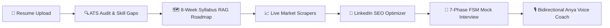
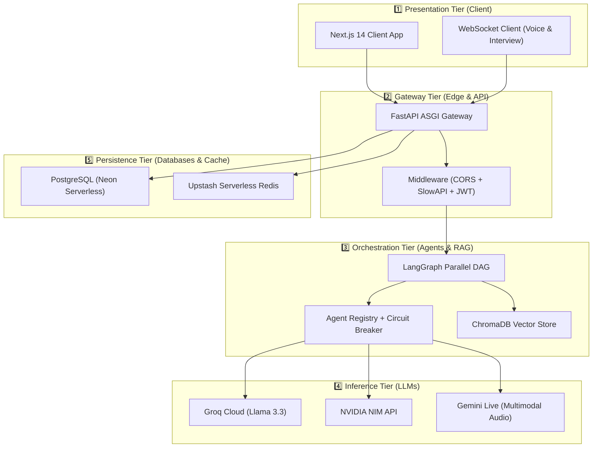
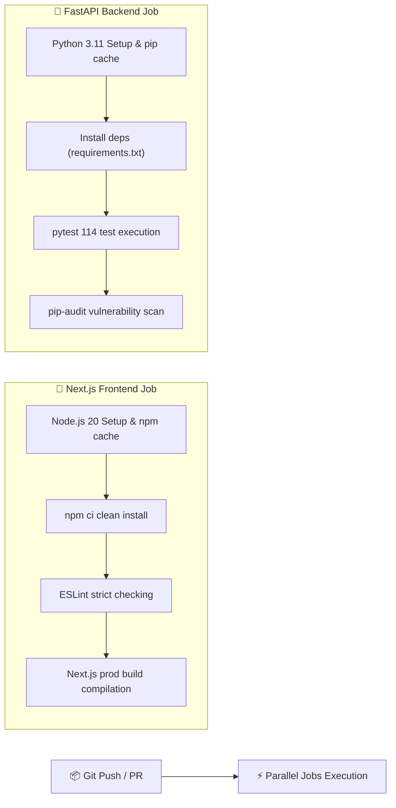

<div align="center">

```
  █████╗ ██╗     ██████╗  █████╗  ██████╗  ███████╗ ███████╗ ██████╗ 
 ██╔══██╗██║    ██╔════╝ ██╔══██╗ ██╔══██╗ ██╔════╝ ██╔════╝ ██╔══██╗
 ███████║██║    ██║      ███████║ ██████╔╝ █████╗   █████╗   ██████╔╝
 ██╔══██║██║    ██║      ██╔══██║ ██╔══██╗ ██╔══╝   ██╔══╝   ██╔══██╗
 ██║  ██║██║    ╚██████╗ ██║  ██║ ██║  ██║ ███████╗ ███████╗ ██║  ██║
 ╚═╝  ╚═╝╚═╝     ╚═════╝ ╚═╝  ╚═╝ ╚═╝  ╚═╝ ╚══════╝ ╚══════╝ ╚═╝  ╚═╝

 ███╗   ███╗ ███████╗ ███╗   ██╗ ████████╗  ██████╗  ██████╗ 
 ████╗ ████║ ██╔════╝ ████╗  ██║ ╚══██╔══╝ ██╔═══██╗ ██╔══██╗
 ██╔████╔██║ █████╗   ██╔██╗ ██║    ██║    ██║   ██║ ██████╔╝
 ██║╚██╔╝██║ ██╔══╝   ██║╚██╗██║    ██║    ██║   ██║ ██╔══██╗
 ██║ ╚═╝ ██║ ███████╗ ██║ ╚████║    ██║    ╚██████╔╝ ██║  ██║
 ╚═╝     ╚═╝ ╚══════╝ ╚═╝  ╚═══╝    ╚═╝     ╚═════╝  ╚═╝  ╚═╝
```

### ✦ **7 Specialized AI Workflows. 1 Career Transformation.** ✦

> 🎯 **Resume Intelligence** · 🗺️ **Personalized Roadmaps** · 📈 **Live Market Intel** · 🎤 **Streaming Mock Interviews** · 🎙️ **Real-time AI Voice Coach** · 🔗 **LinkedIn Optimization** · 🧠 **Full Career Analysis**

<br/>


<br/>

[](https://ai-career-mentor-anil.vercel.app)
[](https://ai-career-mentor-rrpu.onrender.com/docs)
[](https://microsoft.com)
[](https://devpost.com)
[](./documentation/ARCHITECTURE.md)
[](./documentation/SYSTEM.md)

</div>

---

## 📑 **Table of Contents**

| # | Section | 🔗 |
|---|---------|-----|
| 1 | [🧭 What is AI CAREER MENTOR?](#what-is-ai-career-mentor) | Project Overview |
| 2 | [📊 Key Numbers at a Glance](#key-numbers-at-a-glance) | Metrics & Stats |
| 3 | [🏗️ System Architecture Overview](#system-architecture-overview) | High-Level Design |
| 4 | [🛠️ Complete Tech Stack & Tooling](#complete-tech-stack-and-tooling) | Full Stack Details |
| 5 | [🔄 CI/CD Pipeline & Docker](#cicd-pipeline-and-docker) | GitHub Actions + Docker |
| 6 | [📁 Complete Project Structure](#complete-project-structure) | Deep Tree |
| 7 | [🧪 Testing Suite (114 Tests)](#testing-suite-114-tests) | QA Coverage |
| 8 | [🚀 Local Setup Guide](#local-setup-guide) | 5-Minute Setup |
| 9 | [📮 API Testing with Postman](#api-testing-with-postman) | Collection & JWT Lifecycle |
| 10 | [🚦 Rate Limits & Cooldowns](#-per-feature-daily-caps-and-gap-locks) | Daily Caps & Gap Locks |
| 11 | [🔑 Environment Variables](#environment-variables) | Config Reference |
| 12 | [📚 Documentation Index](#documentation-index) | All Docs |
| 13 | [🏆 Hackathon Submits](#hackathon-achievements) | Participation |

---

<a id="what-is-ai-career-mentor"></a>
## 🧭 **What is AI CAREER MENTOR?**

**AI CAREER MENTOR** is a production-grade, enterprise-ready **Career Orchestration OS** 🤖 designed to fast-track developer career transitions. By combining **LangGraph multi-agent systems**, **vector-search RAG retrieval**, and **real-time full-duplex WebSocket protocols**, it automates the entire career transition pipeline—from initial ATS auditing to live multimodal voice coaching.

---

### 🎯 **The Value Proposition: 6 Months vs. 6 Minutes**

Traditional career transitions are exhausting. Developers waste months reading disjointed roadmaps, guessing ATS keywords, analyzing salary benchmarks, and practicing mock interviews with static cards. 

**AI CAREER MENTOR automates this entire lifecycle in under 6 minutes:**


```mermaid
flowchart LR
    A["📄 Resume Upload"] --> B["🔍 ATS Audit & Skill Gaps"]
    B --> C["🗺️ 8-Week Syllabus RAG Roadmap"]
    C --> D["📈 Live Market Scrapers"]
    D --> E["🔗 LinkedIn SEO Optimizer"]
    E --> F["🎤 7-Phase FSM Mock Interview"]
    F --> G["🎙️ Bidirectional Anya Voice Coach"]
```

---

### 🚀 **The 7 Specialized AI Workflows**

At the core of the platform are **7 highly-optimized AI workflows** designed to operate either independently or as a unified orchestration DAG:

| # | 🚦 Workflow | 🚇 Transport | ⚙️ Engine | 🎯 What It Does |
|---|-------------|-------------|-----------|-----------------|
| 1 | **📄 Resume Intelligence** | `REST` | Deterministic ATS + LLM Hybrid | Runs OCR noise removal, parses 120+ skill aliases, merges overlapping job durations, and scores keywords/achievements against 50,000+ benchmark specs. |
| 2 | **🗺️ Career Roadmap Builder** | `REST` | LangGraph + RAG + Groq/NVIDIA | Builds adaptive 8-week structured syllabus paths using ChromaDB vector store enrichment, generating custom programming quizzes and live DuckDuckGo resource searches. |
| 3 | **📈 Market Explorer** | `REST` | Tavily/Serper + Groq LLM | Concurrently scrapes job boards, developer portals, and hiring trends; normalizes salary figures across global currencies, and filters stale job listings. |
| 4 | **🔗 LinkedIn Optimizer** | `REST` | Groq/NVIDIA + Programmatic Fallback | Performs semantic keyword density auditing and re-keys headlines to maximize recruiter search index visibility with section-by-section rewrite strategies. |
| 5 | **🎤 Mock Interview Engine** | `🔌 WebSocket` | 7-Phase FSM + NVIDIA NIM | Runs a strict finite state machine (Intro → CS → Coding → Projects → System Design → Domain → Closing) with an integrated Monaco code editor and edge-tts audio feed. |
| 6 | **🎙️ Anya Voice Coach** | `🔌 WebSocket` | Gemini Live Multimodal API | Initiates real-time, low-latency Hinglish bidirectional voice calls using Gemini Live, custom PCM audio buffers, and jitter-reducing frame queues. |
| 7 | **🧠 Full Career Analysis** | `SSE Stream` | LangGraph Parallel Orchestrator | Fan-out Resume + Market agents, sync and fan-in to LinkedIn + Roadmap agents; streams real-time state logs to client via Server-Sent Events (SSE). |

---

### 🛡️ **Enterprise-Grade Admin & Telemetry**

In addition to developer-facing features, AI CAREER MENTOR includes a premium dashboard for real-time telemetry, allowing administrators to monitor platform health and token costs at scale:

| # | 🚦 Infrastructure | 🚇 Transport | ⚙️ Engine | 🎯 What It Does |
|---|------------------|-------------|-----------|-----------------|
| 7 | **📊 Observability Dashboard** | `REST` (HTTP) | Redis Serverless + Postgres Rollups | Tracks active users, open WebSockets, API latency matrices, error-log feeds, and daily cost rollups. |
| 8 | **📈 Telemetry Endpoint** | `REST` (HTTP) | Prometheus Instrumentator | Exposes raw system metrics for Prometheus scraping, alerting, and Grafana visualization. |

* **Automated Loguru Error Sink**: Intercepts all system-wide `logger.error` and `logger.critical` events backend-wide, automatically capturing traces and piping them directly into the Admin dashboard's error logs stream.

---

### ✨ **Premium UX & Layout Fidelity**

* **Lenis Smooth Scroll Integration**: Configured with premium global inertial scrolling physics (`duration: 0.9s`, `wheelMultiplier: 1.8`, `touchMultiplier: 2.0`) to eliminate scroll stutter and deliver buttery-smooth landing page transitions.
* **Viewport Fidelity Blocker**: Blocks viewports below `1024px` width using a sleek, glassmorphic warning overlay (`MobileBlocker.tsx`), preserving the layout fidelity, code sandboxes, and data dashboards from mobile resizing artifacts.

---

<a id="key-numbers-at-a-glance"></a>
## 📊 **Key Numbers at a Glance**

| Category | Metric | Architecture & Performance Value |
|:---|:---|:---|
| **🧠 Intelligent Systems** | **AI Agent Workflows** | **7 core workflows** (Resume, Roadmap, Market, LinkedIn, Interview, Voice Coach, Full Analysis) |
| | **Primary LLM Engines** | **Groq Cloud (Llama 3.3 70B)** · **NVIDIA NIM** · **Google Gemini Live (Multimodal Audio)** |
| | **RAG Vector Database** | **ChromaDB** with auto-switching keyword search fallback for OOM safety |
| **⚡ Performance & UX** | **Analysis DAG Latency** | Parallel processing fanning out Resume + Market, fanning in to LinkedIn + Roadmap (**~60% latency reduction**) |
| | **Voice Coach Audio** | **Full-duplex Anya (Hinglish)**, 16kHz/24kHz streaming PCM WebSocket (5-min cap) |
| | **Mock Interview FSM** | **7-phase state machine** (CS, Coding, System Design, etc.) with Monaco Editor sandbox |
| | **Scroll Dynamics** | **Lenis Smooth Scroll** global integration with lag-free inertial physics |
| **🛡️ Quality & Security** | **Test Suite Coverage** | **114 passing tests** across 13 test files (Pytest) |
| | **API Rate Limiting** | **100 req/hr · 1000 req/day** global rate limits + multi-day premium feature gap locks |
| **⚙️ DevOps & Cloud** | **Deployment Stack** | **Vercel** (Frontend Next.js) · **Render** (Docker FastAPI) · **Neon** (Serverless PG) · **Upstash** (Redis) |
| | **Docker Pipeline** | **Multi-stage builds** (2-stage backend builder/runner, 3-stage frontend build pipeline) |
| | **CI/CD Automation** | **GitHub Actions** running parallel linters, Next.js builds, Pytest, and security scans |

---

<a id="system-architecture-overview"></a>
## 🏗️ **System Architecture Overview**

> 📐 **Full architecture diagrams and detailed component maps** → See [**ARCHITECTURE.md**](./documentation/ARCHITECTURE.md)

The platform is engineered as a **5-tier decoupled architecture** designed to handle high-concurrency WebSocket connections, streaming Server-Sent Events (SSE), and heavy parallel agent workloads without performance degradation:


```mermaid
graph TD
    subgraph "1️⃣ Presentation Tier (Client)"
        UI["Next.js 14 Client App"]
        WS_C["WebSocket Client (Voice & Interview)"]
    end
    
    subgraph "2️⃣ Gateway Tier (Edge & API)"
        FASTAPI["FastAPI ASGI Gateway"]
        MW["Middleware (CORS + SlowAPI + JWT)"]
    end
    
    subgraph "3️⃣ Orchestration Tier (Agents & RAG)"
        LG["LangGraph Parallel DAG"]
        REG["Agent Registry + Circuit Breaker"]
        CHROMA["ChromaDB Vector Store"]
    end
    
    subgraph "4️⃣ Inference Tier (LLMs)"
        GROQ["Groq Cloud (Llama 3.3)"]
        NVIDIA["NVIDIA NIM API"]
        GEMINI["Gemini Live (Multimodal Audio)"]
    end
    
    subgraph "5️⃣ Persistence Tier (Databases & Cache)"
        PG["PostgreSQL (Neon Serverless)"]
        REDIS["Upstash Serverless Redis"]
    end

    UI --> FASTAPI
    WS_C --> FASTAPI
    FASTAPI --> MW
    MW --> LG
    LG --> REG
    REG --> GROQ & NVIDIA & GEMINI
    LG --> CHROMA
    FASTAPI --> PG & REDIS
```

### 🧱 **The 5-Tier Architecture Breakdown**

| Tier | Layer | Core Technologies | Architectural Responsibility & Protocol |
|:---:|:---|:---|:---|
| **1** | **🌐 Client / Presentation** | `Next.js 14` · `Monaco Editor` · `Axios` | Renders a zero-hydration-mismatch SPA Console. Captures live audio input using custom web browser media queues, buffers it, and handles real-time bidirectional messaging via WebSocket and SSE streams. |
| **2** | **⚡ Gateway / Edge** | `FastAPI` · `SlowAPI` · `Jose JWT` | Coordinates entry routes. Executes consecutive, ordered middleware intercepts: CORS origin checks → Custom request duration logger → Redis-backed IP rate limits (SlowAPI) → Cryptographic signature and expiry verification (JWT). |
| **3** | **🧠 Orchestration / Agents** | `LangGraph` · `ChromaDB` · `pdfplumber` | Resolves complex user requests using structured state trees. Handles text parsing from files, performs semantic lookup via local embeddings on ChromaDB, and schedules parallel node execution paths in LangGraph DAG graphs. |
| **4** | **🤖 Inference / LLMs** | `Groq API` · `NVIDIA NIM` · `Gemini Live` | Executes LLM generations. Routes prompts using a registry pattern with **automatic circuit breakers** and failover retry loops. Leverages Gemini's Live API for multimodal audio streams, and NVIDIA NIM for DSA/system design interviews. |
| **5** | **🗃️ Persistence / Data** | `PostgreSQL` · `Upstash Redis` · `SQLAlchemy` | Ensures absolute durability. Redis manages live WebSocket tokens, rate limits, and premium feature locks. Neon Serverless Postgres houses core schemas (Users, Roadmaps, Audits) with pgBouncer pooling limits. |

---

<a id="complete-tech-stack-and-tooling"></a>
## 🛠️ **Complete Tech Stack & Tooling**

A curated stack of modern technologies chosen for optimal performance, low latency, type safety, and cost efficiency.

### 💻 **Frontend — Next.js 14 Client Console**

| Technology | Purpose & Implementation | Key Architectural Benefit |
|:---|:---|:---|
| **📐 Next.js 14 (App Router)** | Framework Core | Leverages App Router structure, layouts, and route handlers for clean client-side SPA state management. |
| **🎨 Styling** | Tailwind CSS + CSS Variables | Implements a sleek, responsive dark-themed interface utilizing dynamic variables for smooth theme transitions. |
| **💻 Monaco Editor React** | Interactive Coding Sandbox | Renders a fully functional VS Code-like editing sandbox in browser with custom theme presets for coding sessions. |
| **📊 Recharts** | Observability Analytics | Generates beautiful responsive charts showing token costs, API success metrics, and real-time user usage. |
| **📁 React Dropzone** | File Upload Interface | Handles client-side drag-and-drop actions for PDF resume uploads with validation indicators. |
| **🔐 React Google OAuth** | Identity Management | Handles one-tap OAuth login processes securely, syncing credentials directly with backend user accounts. |
| **🌐 Axios (custom client)** | API Communication | Uses request/response interceptors to attach JWT headers, capture rate limits, and auto-refresh auth tokens. |
| **📜 Lenis Smooth Scroll** | Kinetic Scroll Physics | Delivers buttery-smooth inertial page scrolling mechanics across landing views and dashboards. |
| **📱 Viewport Blocker** | Layout Protection | Prevents rendering on screen sizes <1024px to enforce visual layout structure for dashboards and IDE code views. |

---

### ⚡ **Backend — High-Concurrency FastAPI Gateway**

| Technology | Purpose & Implementation | Key Architectural Benefit |
|:---|:---|:---|
| **⚡ FastAPI + Uvicorn** | Framework Gateway | Uses asynchronous route processing (ASGI) to handle heavy stream payloads and WebSocket connections concurrently. |
| **🧠 LangGraph** | Multi-Agent Orchestrator | Models agents as nodes in state graphs. Runs resume, market, and roadmap pipelines concurrently for optimal DAG flows. |
| **📄 pdfplumber** | PDF Parsing | Extracts plain text from uploaded files, bypassing heavy OCR runtimes for clean metadata analysis. |
| **🎤 edge-tts** | Real-time Speech | Synthesizes answers in mock interviews into low-latency audio streams on the fly. |
| **🔐 Jose JWT & bcrypt** | Security Architecture | Manages user passwords with secure bcrypt hashing and generates signed JWT tokens with 1-hour access windows. |
| **🚦 SlowAPI** | Rate Limiting Middleware | Implements sliding-window token bucket limits per client IP to safeguard downstream AI resources. |
| **📊 Prometheus & Sentry** | System Telemetry | Exposes raw system performance metrics for scraping and alerts Sentry dynamically on critical runtime crashes. |
| **📮 Postman Test Suite** | Integration Verification | Contains an automated suite of integration test routes verifying core APIs, tokens, and error payloads. |

---

### 🗃️ **High-Performance Persistence & Cache**

| Technology | Role | Implementation & Fallback Details |
|:---|:---|:---|
| **🗄️ PostgreSQL (Neon Serverless)** | Primary DB | Serverless Postgres database storing transactional models (Users, Roadmaps, Sessions) with PgBouncer connection limits. |
| **⚡ Upstash Redis** | Cache & Lock Registry | High-throughput serverless cache. Stores live WebSocket sessions, rate-limit counts, and premium feature gap locks. |
| **🧠 ChromaDB** | RAG Vector Store | Vector store containing gold-standard learning resources, querying local ONNX embeddings with keyword search fallback. |
| **📦 SQLite & Alembic** | Dev DB & Migrations | Provides a zero-dependency local DB for developers and tracks database schema histories with Alembic migrations. |

---

### 🤖 **AI Models, Search APIs, & Infrastructure Pricing**

| Source Engine | Targeted Model / API | Core Operational Role | Cost Structure |
|:---|:---|:---|:---|
| **⚡ Groq Cloud** | `llama-3.3-70b-specdec` | Primary model for structured parsing, roadmap details, and quiz creation. | ✅ Free Tier / Low Latency |
| **🟢 NVIDIA NIM** | `meta/llama-3.3-70b-instruct` | Drives FSM mock interview sessions, CS theory QA, and coding evaluations. | 💰 Enterprise Token Billing |
| **🔵 Gemini Live** | `gemini-2.0-flash-exp` | Multimodal live websocket streaming for Anya Voice Coach. | ✅ Free Tier Developer Key |
| **🔍 Tavily API** | Live Web Search | Performs job listing lookup, developer salary concurrency searches. | 💰 Paid Token-Based API |
| **🔍 Serper API** | Google Search fallback | Backup search engine for job roles, market locations, and company info. | 💰 Paid Token-Based API |
| **🦆 DuckDuckGo API** | Search fallback | Lightweight free search fallback to scrape open resources. | ✅ FREE / Zero-Key |

---

<a id="cicd-pipeline-and-docker"></a>
## 🔄 **CI/CD Pipeline & Docker**

High-performance continuous integration and containerized deployment workflows designed to guarantee build safety, static security compliance, and rapid releases.

### ⚙️ **Automated CI Workflow (`.github/workflows/ci.yml`)**

Every push to `main` and all Pull Requests trigger parallel build and validation pipelines:


```mermaid
flowchart LR
    TRIGGER["📦 Git Push / PR"] --> PARALLEL["⚡ Parallel Jobs Execution"]
    
    subgraph "📱 Next.js Frontend Job"
        F1["Node.js 20 Setup & npm cache"]
        F1 --> F2["npm ci clean install"]
        F2 --> F3["ESLint strict checking"]
        F3 --> F4["Next.js prod build compilation"]
    end
    
    subgraph "🐍 FastAPI Backend Job"
        B1["Python 3.11 Setup & pip cache"]
        B1 --> B2["Install deps (requirements.txt)"]
        B2 --> B3["pytest 114 test execution"]
        B3 --> B4["pip-audit vulnerability scan"]
    end
```

---

### 🐳 **Containerized Architecture**

The project is fully containerized, leveraging optimized multi-stage Dockerfiles to minimize final production image sizes and guarantee dependency sandboxing.

> 📐 **Full Docker network & deployment diagrams** → See [**ARCHITECTURE.md § Deployment**](./documentation/ARCHITECTURE.md#9-%EF%B8%8F-deployment-topology) · **Quick-start setup instructions** → See [**DOCKER_GUIDE.md**](./documentation/DOCKER_GUIDE.md)

| Service | Source Location | Build Stage Pipeline | Port Mapping | Production Image Optimization |
|:---|:---|:---|:---:|:---|
| **FastAPI Backend** | `backend/Dockerfile` | **2-Stage** (`python:3.11-slim` builder → runner) | `8000` | Excludes compile dependencies, uses non-root security contexts, and bundles only required packages. |
| **Next.js Frontend** | `frontend/Dockerfile` | **3-Stage** (`deps` caching → `builder` compilation → `runner` execution) | `3000` | Leverages Next.js output standalone configuration, reducing final image footprint by ~85%. |
| **Redis Cache** | `redis:7-alpine` | Alpine official image base | `6379` | High-throughput in-memory key-value cache with persistent storage backup enabled. |

---

### ☁️ **Infrastructure Deployment Channels**

| Provider | Targeting Tier | Configuration Blueprint | Deployment Mechanics |
|:---|:---|:---|:---|
| **Render Cloud** | `FastAPI Backend Service` | [`render.yaml`](./render.yaml) | Containerized auto-deploy on `main` push. Deploys using a custom Docker blueprint file with 512MB RAM and swap checks. |
| **Vercel Edge** | `Next.js Frontend Client` | Automatic Git Integration | Zero-configuration serverless edge hosting. Automatically recompiles static pages and triggers instant global CDNs on push. |

---

<a id="complete-project-structure"></a>
## 📁 **Complete Project Structure**

The verified project tree mapping the dual-workspace monorepo architecture:

```
AI-CAREER-MENTOR/
│
├── 📄 Root Files (Project Config)
│   ├── .gitignore
│   ├── package.json                         # Workspace root configuration (npm workspaces)
│   ├── package-lock.json
│   ├── start.bat                            # Windows automation startup script
│   ├── render.yaml                          # Render orchestration blueprint
│   ├── LICENSE                              # MIT License
│   ├── clear_cache.py                       # Cache eviction utility
│   ├── clear_db.py                          # Database resetting & purging utility
│   ├── README.md                            # Main project walkthrough
│   │
│   ├── 📁 documentation/                    # 📚 Standard Project Manuals
│   │   ├── ARCHITECTURE.md                  # Comprehensive system topography & diagrams
│   │   ├── SYSTEM.md                        # Architectural design records (ADR)
│   │   ├── API.md                           # Endpoint schema & protocol reference
│   │   └── DOCKER_GUIDE.md                  # Container deployment instructions
│   │
│   ├── 🐳 Docker Configuration
│   │   ├── docker-compose.yml               # Local compose (fastapi + nextjs + redis)
│   │   └── docker-compose.prod.yml          # Production stage overrides
│   │
│   └── 📁 assets/                           # Media & static documentation images
│       └── banner.png
│
├── 📁 .github/workflows/
│   └── ci.yml                               # GitHub Actions workflow (parallel CI pipelines)
│
├── 📁 backend/                               # 🐍 FastAPI Backend Application
│   ├── Dockerfile                            # Optimized 2-stage slim container builder
│   ├── requirements.txt                      # Declared python dependencies
│   ├── alembic.ini                           # Database migration configuration
│   ├── .env.example                          # Reference configuration variables file
│   ├── .gitignore
│   │
│   ├── 📁 app/                               # FastAPI Application Core
│   │   ├── __init__.py
│   │   ├── main.py                           # App entrypoint, middleware stack & gateways
│   │   │
│   │   ├── 📁 agents/                        # 🧠 Multi-Agent Orchestration Nodes
│   │   │   ├── __init__.py
│   │   │   ├── registry.py                   # Registry + LLM client dispatch + circuit breakers
│   │   │   └── workflow.py                   # LangGraph DAG workflow definition
│   │   │
│   │   ├── 📁 api/                           # 🌐 API Controller Routing Layer
│   │   │   ├── __init__.py
│   │   │   ├── admin.py                      # Observability feed & rollups endpoints
│   │   │   ├── auth.py                       # Auth, token refreshes & Google sign-in handlers
│   │   │   ├── career.py                     # Full Analysis server-sent event (SSE) endpoints
│   │   │   ├── deps.py                       # Route dependencies & JWT security bounds
│   │   │   ├── interview.py                  # Coding mock interview websocket logic
│   │   │   ├── linkedin.py                   # Profile content optimizer router
│   │   │   ├── market.py                     # Salary explorer & hiring scraper endpoints
│   │   │   ├── resume.py                     # PDF file parser & ATS audit endpoints
│   │   │   ├── roadmap.py                    # Learning path CRUD & quiz endpoints
│   │   │   ├── user.py                       # Dashboard metadata aggregation
│   │   │   └── voice_assistant.py            # Anya voice assistant websocket gateway
│   │   │
│   │   ├── 📁 core/                          # ⚙️ Application Logic Engines
│   │   │   ├── __init__.py
│   │   │   ├── activity.py                   # User activity tracking logs compiler
│   │   │   ├── ats_engine.py                 # Rules-based ATS evaluator & matcher
│   │   │   ├── cache.py                      # Redis server cache wrappers
│   │   │   ├── config.py                     # Decoupled pydantic configurations loader
│   │   │   ├── database.py                   # SQLAlchemy engine session registry
│   │   │   ├── limiter.py                    # Rate-limiting exception definitions
│   │   │   ├── observability.py              # Telemetry tracking & cost rollup handlers
│   │   │   ├── rag_service.py                # ChromaDB vector store client + ONNX models
│   │   │   ├── rate_limit.py                 # Redis token bucket limits middleware
│   │   │   ├── search_engine.py              # Tavily/Serper & DDG quality-weighted crawlers
│   │   │   ├── security.py                   # Pass hashing & JWT signing module
│   │   │   ├── voice_engine.py               # Text-to-speech audio rendering engine
│   │   │   │
│   │   │   ├── 📁 interview/                 # 🎤 WebSocket Mock Interview Engine
│   │   │   │   ├── __init__.py
│   │   │   │   ├── constants.py              # Curated list of roles & target companies
│   │   │   │   ├── llm.py                    # Interview scenario generator
│   │   │   │   ├── prompts.py                # Strict system-behavior prompts
│   │   │   │   ├── session.py                # Chat buffer memory & token compression
│   │   │   │   ├── state.py                  # 7-phase finite state machine (FSM)
│   │   │   │   └── websocket_manager.py      # Broadcasts, connections, & room states
│   │   │   │
│   │   │   ├── 📁 market/                    # 📈 Market Intelligence Scraper Engine
│   │   │   │   ├── __init__.py
│   │   │   │   ├── history.py                # Market metrics persistence handlers
│   │   │   │   └── service.py                # Scraper aggregator & parser
│   │   │   │
│   │   │   └── 📁 roadmap/                   # 🗺️ Career Roadmap Orchestrator
│   │   │       ├── __init__.py
│   │   │       ├── agents.py                 # Path generator agent executors
│   │   │       ├── helpers.py                # Dynamic structures & JSON format parsers
│   │   │       ├── prompts.py                # Context instructions and guide prompts
│   │   │       └── quiz.py                   # Gamified quiz & scorecard generator
│   │   │
│   │   ├── 📁 models/                        # 📦 SQLAlchemy & Pydantic Data Structures
│   │   │   ├── __init__.py
│   │   │   ├── models.py                     # SQLAlchemy Database Schema definitions
│   │   │   ├── schemas.py                    # Validation Request & Response models
│   │   │   └── validation.py                 # Agent response verification models
│   │   │
│   │   └── 📁 data/                          # 🗃️ ChromaDB Vectors & Seed Files
│   │       ├── curated_resources.json        # Gold-standard roadmap recommendations seeds
│   │       └── resume_rag_pipeline.json      # ATS keywords & skills mapping templates
│   │
│   ├── 📁 tests/                             # 🧪 Automated Test Suite (114 tests)
│   │   ├── __init__.py
│   │   ├── conftest.py                       # Shared test fixtures & client overrides
│   │   ├── debug_steps_type.py               # Telemetry verification debugging runner
│   │   ├── test_admin_metrics_fetch.py       # Admin observability API checks (2 tests)
│   │   ├── test_agents_registry.py           # Multi-agent system checks (24 tests)
│   │   ├── test_ats_engine.py                # ATS parser rules checking (5 tests)
│   │   ├── test_career_and_interview_apis.py # Analysis & Websocket checks (6 tests)
│   │   ├── test_features.py                  # Core workspace metrics (13 tests)
│   │   ├── test_gamified_roadmap.py          # Quizzes & completion checks (4 tests)
│   │   ├── test_linkedin.py                  # Profile SEO validator (2 tests)
│   │   ├── test_main.py                      # App initialization & gateways checks (9 tests)
│   │   ├── test_market_service.py            # Aggregations & salary normalizations (4 tests)
│   │   ├── test_observability.py             # Counters & performance checks (2 tests)
│   │   ├── test_roadmap_agents.py            # LangGraph roadmap graph tests (24 tests)
│   │   ├── test_validation.py                # Schema constraints verification (16 tests)
│   │   └── test_voice_assistant.py           # Speech socket channels checks (3 tests)
│   │
│   ├── 📁 alembic/                           # Database Migration Histories
│   │   ├── env.py
│   │   ├── script.py.mako
│   │   ├── README
│   │   └── 📁 versions/                      # Automatic Alembic versioning files
│   │
│   └── 📁 scripts/                           # 🛠️ System Validation Scripts
│       └── validate_resources.py             # Validates seeds link status & format
│
└── 📁 frontend/                              # 💻 NextJS 14 Presentation Client
    ├── Dockerfile                            # Optimized 3-stage production builder
    ├── package.json                          # Client dependencies
    ├── next.config.js                        # Framework custom configurations
    ├── tailwind.config.js                    # Style utility layouts definitions
    ├── postcss.config.js
    ├── tsconfig.json                         # Strict type compile parameters
    ├── types.d.ts
    ├── .eslintrc.js
    ├── .gitignore
    │
    ├── 📁 public/                            # Global static graphics & branding
    └── 📁 src/                               # Frontend Modules
        ├── 📁 app/                           # NextJS App Router Layouts & Routing
        │   ├── 📁 login/                     # Authentication entry screen
        │   ├── 📁 register/                  # Signup entry screen
        │   └── 📁 dashboard/                 # Protected App Workspaces
        │       ├── 📁 admin/                 # Observability tracking views
        │       ├── 📁 resume/                # ATS optimization panel
        │       ├── 📁 roadmap/               # Gamified milestones board
        │       ├── 📁 market/                # Hiring metrics explorer board
        │       ├── 📁 interview/             # Monaco-integrated mock board
        │       ├── 📁 linkedin/              # Headline SEO tuner views
        │       ├── 📁 full-analysis/         # Dynamic parallel analysis progress views
        │       └── 📁 settings/              # Settings & configurations
        │
        ├── 📁 components/                    # Shared Component Modules
        │   ├── 📁 landing/                   # Showcase, Hero, & features
        │   ├── 📁 auth/                      # Login cards & button bounds
        │   ├── 📁 interview/                 # Monaco wizards & histories views
        │   ├── 📁 charts/                    # Salary & recruitment analytics
        │   └── 📁 full-analysis/             # SSE panels, logs, & milestones tracker
        │
        ├── 📁 services/                      # Axios client instance wrappers
        ├── 📁 hooks/                         # Global hooks definitions
        └── 📁 types/                         # Shared typescript interface models
```
```

---

<a id="testing-suite-114-tests"></a>
## 🧪 **Testing Suite (114 Tests)**

```bash
cd backend
PYTHONPATH=. python -m pytest tests/ -v
```

| 📁 Test File | ✅ Tests | 🎯 Scope |
|-------------|:-------:|----------|
| `test_agents_registry.py` | **24** | JSON extraction, circuit breaker, fallback chains |
| `test_roadmap_agents.py` | **24** | Fallback structures, detail batching, week normalization |
| `test_validation.py` | **16** | ATS score capping, coercion validators |
| `test_features.py` | **13** | Market scrapers, TTS audio, search algorithms |
| `test_main.py` | **9** | Authentication, rate limiting, JWT tokens |
| `test_career_and_interview_apis.py` | **6** | Career history/deletion, SSE streaming career analysis, mock interview history/deletion |
| `test_ats_engine.py` | **5** | Experience date parser, interval merging |
| `test_market_service.py` | **4** | Salary conversions, role classifications |
| `test_gamified_roadmap.py` | **4** | Week completion triggers, quiz generation, rate limits |
| `test_voice_assistant.py` | **3** | WebSocket authentication, Gemini config |
| `test_linkedin.py` | **2** | Fallback strategy, model structures |
| `test_observability.py` | **2** | Telemetry tracking helpers, admin endpoint authentication & route restrictions |
| `test_admin_metrics_fetch.py` | **2** | Real-time observability pipeline, DB sync rollups |

---

<a id="local-setup-guide"></a>
## 🚀 **Local Setup Guide**

### ⚡ **Quick Start (Windows)**
If you are on Windows, you can start both the backend and frontend servers with a single command/click:
- Run `.\start.bat` in Command Prompt or double-click **`start.bat`** in the root directory.
- This will automatically start the FastAPI backend on port 8000 and the Next.js frontend on port 3000 in separate windows.

---

### 📥 **Step 1: Clone & Setup Backend**
```bash
git clone https://github.com/Anil-Pradhan-web/ai-career-mentor.git
cd ai-career-mentor/backend
python -m venv venv
# Windows: venv\Scripts\activate
pip install -r requirements.txt
cp .env.example .env
```

### 🏃 **Step 2: Run Backend**
```bash
alembic upgrade head
uvicorn app.main:app --reload
```
Backend: http://localhost:8000 | Swagger: http://localhost:8000/docs

### 💻 **Step 3: Setup & Run Frontend**
```bash
cd ../frontend
npm install
# Create frontend/.env.local:
# NEXT_PUBLIC_API_URL=http://localhost:8000
# NEXT_PUBLIC_GOOGLE_CLIENT_ID=your_client_id
npm run dev
```
Frontend: http://localhost:3000

### 🐳 **Option: Docker**
```bash
# Development
docker compose up --build
# Production
docker compose -f docker-compose.yml -f docker-compose.prod.yml up --build
```

### 📮 **API Testing with Postman**
A comprehensive, automated Postman collection is located at the root of the project: [`ai_career_mentor_postman_collection.json`](./ai_career_mentor_postman_collection.json).
- **How to Use**: Import the JSON file into Postman.
- **Authentication**: Run the **Register User** request followed by **Login User** in the `Auth` folder. The collection automatically extracts and updates the JWT bearer tokens (`access_token`, `refresh_token`) in the environment variables, meaning subsequent requests to protected endpoints will authorize automatically.
- **API Coverage**: Mapped with 100% API coverage, including:
  - Auth, User stats, Resume upload/ATS analysis
  - Learning Roadmaps & Weekly Quiz generation (with rate-limiting simulation)
  - Market Trends, Job history, LinkedIn optimization
  - SSE real-time Career Analysis streaming & WebSockets (Anya Live, Mock Interviews)

---

### 🚦 **Per-Feature Daily Caps and Gap Locks**

To prevent API abuse and manage free tier quotas, the backend implements per-feature rate limits and multi-day gap locks for computationally expensive or stateful agent workflows:

| Feature | Transport | Limit (Free Tier) | Cooldown / Gap Lock |
|---------|:---------:|:----------------------:|---------------------|
| **🧠 Career Full Analysis** | `SSE Stream` | **1 request / 5 days** | 5-day gap lock |
| **📄 Resume Analysis** | `REST` | **2 requests / day** | None |
| **🗺️ Learning Roadmap** | `REST` | **1 request / 3 days** | 3-day gap lock |
| **📈 Market Intelligence** | `REST` | **2 requests / day** | None |
| **🔗 LinkedIn Optimization** | `REST` | **4 requests / day** | None |
| **🎤 Mock Interview** | `WebSocket` | **1 session / 4 days** | 4-day gap lock |
| **🎙️ Anya Voice Coach** | `WebSocket` | **2 calls / day** | 5-minute call duration cap |
| **📝 Weekly Quiz** | `REST` | **3 quizzes / day** | None |

*(Note: Rate limits are automatically bypassed when `APP_ENV=development` and `DEBUG=True` (or `settings.DEBUG`) are active.)*

---

<a id="environment-variables"></a>
## 🔑 **Environment Variables**

### ⚡ **Backend (`backend/.env`)**

| Variable | Required | Default | Description |
|----------|:--------:|---------|-------------|
| `GROQ_API_KEY` | ✅ | — | Groq API key (FREE) |
| `GROQ_MODEL` | ❌ | `llama-3.3-70b-versatile` | Groq Llama Model |
| `GOOGLE_API_KEY` | ✅ | — | Google AI Studio key (used for Anya Voice Coach only) |
| `NVIDIA_API_KEY` | ❌ | — | NVIDIA NIM API key |
| `NVIDIA_MODEL` | ❌ | `meta/llama-3.3-70b-instruct` | NVIDIA Llama Model |
| `DATABASE_URL` | ✅ | `sqlite:///./dev.db` | Database connection string |
| `SECRET_KEY` | ✅ | — | JWT signing secret |
| `ACCESS_TOKEN_EXPIRE_MINUTES` | ❌ | `60` | JWT Access Token expiry minutes |
| `REFRESH_TOKEN_EXPIRE_DAYS` | ❌ | `30` | JWT Refresh Token expiry days |
| `GOOGLE_CLIENT_ID` | ✅ | — | Google OAuth Client ID |
| `TAVILY_API_KEY` | ❌ | — | Tavily search API |
| `SERPER_API_KEY` | ❌ | — | Serper Google Search |
| `BING_SEARCH_API_KEY` | ❌ | — | Bing Search API Key |
| `REDIS_URL` | ❌ | `redis://localhost:6379/0` | Upstash/Local Redis connection URL |
| `APP_ENV` | ❌ | `development` | `development` or `production` |
| `ADMIN_EMAIL` | ❌ | `anilpradhan9644@gmail.com` | Administrator email |
| `SENTRY_DSN` | ❌ | — | Sentry monitoring DSN |
| `ENABLE_OBSERVABILITY` | ❌ | `true` | Enable/Disable system telemetry metrics |

### 💻 **Frontend (`frontend/.env.local`)**

| Variable | Required | Description |
|----------|:--------:|-------------|
| `NEXT_PUBLIC_API_URL` | ✅ | Backend API base URL |
| `NEXT_PUBLIC_GOOGLE_CLIENT_ID` | ✅ | Google OAuth Client ID |

---

<a id="documentation-index"></a>
## 📚 **Documentation Index**

This project has **5 documentation files**, each with a distinct purpose. No content is duplicated between them — each file is the **single source of truth** for its domain.

| 📄 Document | 📖 What's Inside | 🎯 Read This If… |
|-------------|-----------------|------------------|
| [**README.md**](./README.md) | Project overview, tech stack, project tree, env vars, setup guide, testing summary, hackathon achievements | 👋 You're new to the project or need a quick overview |
| [**ARCHITECTURE.md**](./documentation/ARCHITECTURE.md) | **19 Mermaid diagrams**: system arch, LangGraph DAG, interview FSM, voice pipeline, circuit breaker, ERD, frontend tree, deployment topology, auth flow, WebSocket protocols, RAG pipeline, CI/CD pipeline, telemetry sync pipeline | 🏗️ You want to **visually understand** how components connect |
| [**SYSTEM.md**](./documentation/SYSTEM.md) | **Code-level deep dive**: Python ORM models (including DailyAnalytics), agent registry implementation, circuit breaker code, ATS engine formula, market/roadmap/LinkedIn agent pipelines, security layers, performance optimizations, LLM integration patterns, Redis & PostgreSQL telemetry orchestration | 🔧 You want to **read or modify** the actual implementation |
| [**API.md**](./documentation/API.md) | **Complete API reference**: all REST/SSE/WebSocket endpoints with request/response examples, rate limits, error codes, auth flow, admin metrics | 🌐 You want to **call or integrate** with the backend API |
| [**DOCKER_GUIDE.md**](./documentation/DOCKER_GUIDE.md) | Docker Compose setup (dev + prod), Dockerfile details, environment configuration, deployment commands | 🐳 You want to **deploy** with Docker |

---

<a id="hackathon-achievements"></a>
## 🏆 **Hackathon Achievements**

### 🏆 **Microsoft AI DevDays Hackathon ($480K)**
- ✅ Satisfied all agentic pipeline guidelines
- ✅ Multi-agent orchestration with LangGraph
- ✅ Production-grade MVP deployment with CI/CD

### 🏆 **Amazon Nova AI Hackathon ($495K)**
- ✅ Multi-agent execution graphs with fallback chains
- ✅ Audio-enabled interfaces (TTS + Voice Coach)
- ✅ Docker deployment with multi-stage builds

---

<div align="center">

**Built with 🧠 by [Anil Pradhan](https://github.com/Anil-Pradhan-web)**

| `#LangGraph` `#NVIDIANIM` `#GoogleOAuth` `#RAG` `#ChromaDB` |
| `#FastAPI` `#NextJS` `#Groq` `#Gemini` `#GeminiLive` |
| `#WebSocket` `#VoiceAI` `#Pytest` `#Docker` `#CI/CD` |

</div>