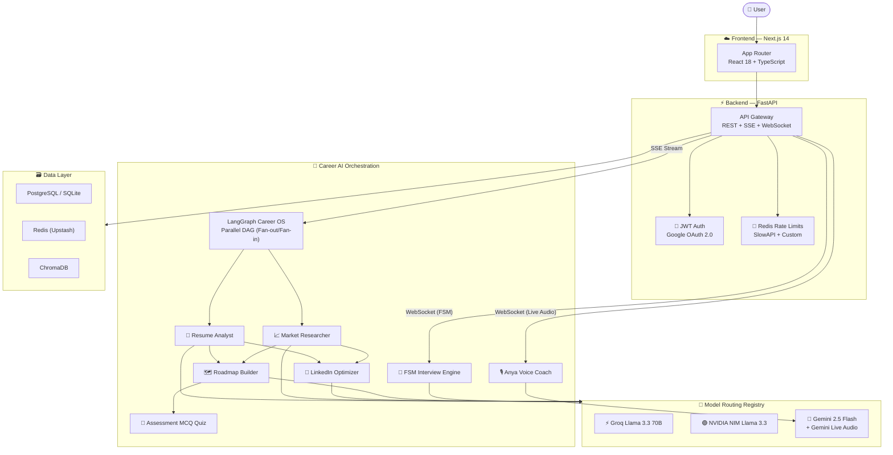
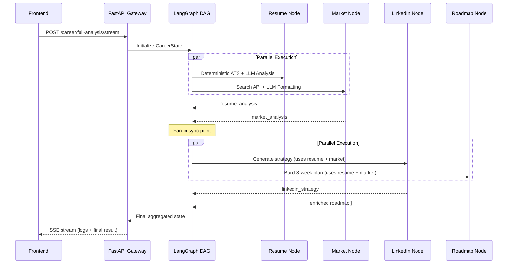

<div align="center">

```
 █████╗ ██╗      ██████╗ █████╗ ██████╗ ███████╗███████╗██████╗
██╔══██╗██║     ██╔════╝██╔══██╗██╔══██╗██╔════╝██╔════╝██╔══██╗
███████║██║     ██║     ███████║██████╔╝█████╗  █████╗  ██████╔╝
██╔══██║██║     ██║     ██╔══██║██╔══██╗██╔══╝  ██╔══╝  ██╔══██╗
██║  ██║██║     ╚██████╗██║  ██║██║  ██║███████╗███████╗██║  ██║
╚═╝  ╚═╝╚═╝      ╚═════╝╚═╝  ╚═╝╚═╝  ╚═╝╚══════╝╚══════╝╚═╝  ╚═╝

███╗   ███╗███████╗███╗   ██╗████████╗ ██████╗ ██████╗
████╗ ████║██╔════╝████╗  ██║╚══██╔══╝██╔═══██╗██╔══██╗
██╔████╔██║█████╗  ██╔██╗ ██║   ██║   ██║   ██║██████╔╝
██║╚██╔╝██║██╔══╝  ██║╚██╗██║   ██║   ██║   ██║██╔══██╗
██║ ╚═╝ ██║███████╗██║ ╚████║   ██║   ╚██████╔╝██║  ██║
╚═╝     ╚═╝╚══════╝╚═╝  ╚═══╝   ╚═╝    ╚═════╝ ╚═╝  ╚═╝
```

### ✦ *6 Specialized AI Workflows. One Career Transformation.* ✦

> 🎯 **Resume Analysis** · 🗺️ **Personalized Roadmaps** · 📈 **Live Market Intel** · 🎤 **Streaming Mock Interviews** · 🎙️ **Real-time AI Voice Coach** · 🔗 **LinkedIn Optimization**

<br/>


<br/>

[](https://ai-career-mentor-anil.vercel.app)
[](https://ai-career-mentor-rrpu.onrender.com/docs)
[](https://microsoft.com)
[](https://devpost.com)
[](https://github.com/Anil-Pradhan-web/ai-career-mentor/actions)

</div>

---

## 🧭 Table of Contents
- [What is AI Career Mentor?](#-what-is-ai-career-mentor)
- [Key Numbers](#-key-numbers-at-a-glance)
- [System Architecture](#-system-architecture)
- [Tech Stack & Tooling](#-complete-tech-stack--tooling)
- [Core Features Deep Dive](#-core-features-deep-dive)
- [Data Flow & Integration Map](#-data-flow--integration-map)
- [Model Selector & Routing](#-model-selector--routing)
- [Hybrid Semantic RAG & Search Quality Engine](#-hybrid-semantic-rag--search-quality-engine)
- [Database Schema](#-database-schema)
- [Rate Limiting & Security](#-rate-limiting--security)
- [Local Setup](#-local-setup)
- [Docker Deployment](#-docker-deployment)
- [Project Structure](#-project-structure)
- [Testing Suite (102 Tests)](#-testing-suite-102-tests)
- [CI/CD & Hardening](#-cicd--hardening)
- [Environment Variables](#-environment-variables)
- [Documentation Index](#-documentation-index)
- [Hackathon Achievements](#-hackathon-achievements)

---

## 🎯 What is AI Career Mentor?

**AI Career Mentor** is a production-grade, full-stack career coaching platform that helps developers transition from career confusion to concrete execution plans. It bundles **6 specialized AI workflows** into a single polished dashboard:

| # | Workflow | Transport | Description |
|---|----------|-----------|-------------|
| 1 | **Resume Intelligence** | REST | ATS scoring, skill extraction, deterministic + LLM hybrid analysis |
| 2 | **Career Roadmap Builder** | REST | 8-week gamified learning plans with RAG-enriched resources |
| 3 | **Market Explorer** | REST | Real-time salary data, hiring trends, and company intelligence |
| 4 | **LinkedIn Optimizer** | REST | Profile optimization with ATS keyword injection |
| 5 | **Mock Interview Engine** | WebSocket | 7-phase FSM-driven adaptive interviews with TTS audio |
| 6 | **Anya Voice Coach** | WebSocket | Real-time bidirectional voice calls via Gemini Live API |

Powered by a parallelized **LangGraph orchestrator** (DAG with fan-out/fan-in) and Google Gemini's **Multimodal Live API**, it delivers context-aware career mentoring with sub-second voice latency and robust fallback systems across three LLM providers.

---

## 📊 Key Numbers at a Glance
| Metric | Value |
|--------|-------|
| **AI Workflows** | **6 core workflows** (Resume, Roadmap, Market, LinkedIn, Interview, Voice Coach) |
| **Analysis Graph** | **Parallel DAG** — fans out Resume + Market, fans in to LinkedIn + Roadmap (reduces latency ~60%) |
| **Learning Path** | **8 weeks** with experience-level adaptation, syllabus completion tracking, and gamified progress |
| **Voice Coach** | **Anya** (Hinglish persona), real-time 16kHz/24kHz full-duplex WebSocket proxy, 2 calls/day limit |
| **Mock Interview** | **7-phase FSM** — Intro → CS Fundamentals → Code → Projects → System Design → Domain → Closing |
| **Test Coverage** | **102 passing tests** across agent registry, validation schemas, and database history |
| **Rate Limits** | **100 req/hr · 1000 req/day** (global) + per-feature daily caps via Redis + 48h gap locks |
| **Primary LLMs** | **Groq (Llama 3.3 70B)** · **NVIDIA NIM (Llama 3.3 Instruct)** · **Google Gemini (2.5 Flash)** |
| **RAG Store** | **ChromaDB persistent store** + lightweight in-memory keyword matcher fallback for OOM safety |
| **Deployment** | **Vercel** (frontend) · **Render** (backend) · **Neon Postgres** · **Upstash Redis** |

---

## 🏗️ System Architecture

The platform uses a decoupled frontend/backend architecture. The frontend is a **Next.js 14 App Router** application, while the backend is an **async FastAPI** service supporting REST, Server-Sent Events (SSE), and WebSockets.

> 📐 For the detailed architecture diagram with all data flows and component interactions, see **[ARCHITECTURE.md](./ARCHITECTURE.md)**.


```mermaid
flowchart TD
    User(["👤 User"])

    subgraph Frontend ["☁️ Frontend — Next.js 14"]
        NextJS["App Router\nReact 18 + TypeScript"]
    end

    subgraph Backend ["⚡ Backend — FastAPI"]
        API["API Gateway\nREST + SSE + WebSocket"]
        Auth["🔐 JWT Auth\nGoogle OAuth 2.0"]
        RateLimit["🚦 Redis Rate Limits\nSlowAPI + Custom"]
    end

    subgraph Orchestration ["🧠 Career AI Orchestration"]
        Graph["LangGraph Career OS\nParallel DAG (Fan-out/Fan-in)"]
        Resume["📄 Resume Analyst"]
        Market["📈 Market Researcher"]
        LinkedIn["🔗 LinkedIn Optimizer"]
        Roadmap["🗺️ Roadmap Builder"]
        Quiz["📝 Assessment MCQ Quiz"]
        Interview["🎤 FSM Interview Engine"]
        VoiceCoach["🎙️ Anya Voice Coach"]
    end

    subgraph Providers ["🤖 Model Routing Registry"]
        Groq["⚡ Groq Llama 3.3 70B"]
        NVIDIA["🟢 NVIDIA NIM Llama 3.3"]
        Gemini["🔵 Gemini 2.5 Flash\n+ Gemini Live Audio"]
    end

    subgraph Storage ["🗃️ Data Layer"]
        PG["PostgreSQL / SQLite"]
        Redis["Redis (Upstash)"]
        Chroma["ChromaDB"]
    end

    User --> NextJS
    NextJS --> API
    API --> Auth & RateLimit
    API -->|"SSE Stream"| Graph
    API -->|"WebSocket (Live Audio)"| VoiceCoach
    API -->|"WebSocket (FSM)"| Interview

    Graph --> Resume & Market
    Resume & Market --> LinkedIn & Roadmap
    Roadmap --> Quiz
    
    Resume & Market & LinkedIn & Roadmap & Interview --> Providers
    VoiceCoach --> Gemini

    API --> Storage
```

---

## 🛠️ Complete Tech Stack & Tooling

The application leverages a modern, highly robust stack optimized for latency, type safety, parallel workflow orchestration, and offline fallbacks:

### 💻 Frontend (Next.js SPA Console)
- **Framework**: `Next.js 14` (App Router) + `React 18` + `TypeScript` for structured UI component flow.
- **Styling**: `Tailwind CSS` for responsive utilities + `Vanilla CSS variables` for custom theme branding (custom-curated dark modes, glassmorphism, HUD layouts).
- **Code Editor Sandbox**: `@monaco-editor/react` (Monaco Editor Integration) providing a fully interactive coding workspace during technical mock interviews.
- **Interactive Visualizations**: `Recharts` for charting candidate activity logs, streaks, and ATS sub-score category metrics.
- **File Upload**: `react-dropzone` for handling resumes with drag-and-drop support.
- **Social Authentication**: `@react-oauth/google` for seamless Google OAuth 2.0 sign-in.
- **Routing & Networking**: Native Next.js routes and `Axios` client wrapper with centralized interceptors.
- **Feedback & Notifications**: `react-hot-toast` for real-time validation and progress notifications.
- **Markdown Renderer**: `react-markdown` for displaying complex LLM-generated roadmaps and LinkedIn strategies.

### ⚡ Backend (Async FastAPI Gateway)
- **Framework**: `FastAPI` (Python 3.11+) offering asynchronous endpoint routes, ASGI performance, and native support for REST, WebSockets, and Server-Sent Events (SSE).
- **Production Server**: `Uvicorn` standard event loop with WebSocket capabilities.
- **Orchestration**:
  - `LangGraph`: Parallel Directed Acyclic Graph (DAG) coordinating concurrent execution of the resume analyst and market researcher nodes, then fanning-in to execute roadmap and LinkedIn optimization.
  - `AutoGen` / `ag2`: Multi-agent pipeline framework support.
  - `LangChain Core`: Unified provider abstraction wrappers.
- **PDF Extraction**: `pdfplumber` for precise local ATS token extraction, text parsing, and page coordinate extraction.
- **Real-Time Voice Assistant Pipeline**:
  - Gemini Multimodal Live API WebSocket Proxy for full-duplex, low-latency PCM audio streaming.
  - `edge-tts` for high-quality, sentence-sliced text-to-speech rendering during mock interview sessions.
- **Security & Session Guarding**:
  - `python-jose` & `bcrypt` for JWT signature generation, validation, and secure password hashing.
  - `SlowAPI` for route-specific rate limiting (IP and Token based).

### 🗃️ Databases & Cache System
- **Relational Databases**: `PostgreSQL` (Neon Serverless in production) & `SQLite` (local development fallback).
- **Database ORM**: `SQLAlchemy 2.0` with async engines + `Alembic` for schema migration version control.
- **Caching & Usage Gateways**: `Upstash Redis` (global rate-limiter backend, session storage, and 48-hour feature-lock TTL keys) + local memory fallback for offline resilience.
- **Semantic search & RAG**: `ChromaDB` (persistent local vector store) + lightweight inline keyword fallback to protect against memory-related out-of-memory (OOM) failures.

### 🤖 AI Providers & APIs
- **Google Gemini**: Gemini 2.5 Flash for rapid text structuring, and Gemini Live Voice API for bidirectional voice coaching.
- **Groq Cloud**: Llama 3.3 70B for lightning-fast structured JSON output.
- **NVIDIA NIM**: Llama 3.3 Instruct and DeepSeek models for ultra-low latency response times.
- **Search Indices**: `Tavily Search API`, `Serper Google Search`, and `DuckDuckGo Search` fallback engines.

### 🛠️ DevOps, Infrastructure & Quality Assurance
- **Containerization**: `Docker` & `Docker Compose` for local deployment orchestration.
- **Testing Suite**: `Pytest` + `pytest-asyncio` for full integration and regression test coverage (102 tests).
- **CI/CD Actions**: GitHub Workflows compiling Node frontend assets, running ESLint checks, executing Python security audits (`pip-audit`), and validating backend test coverage.

---

## ✨ Core Features Deep Dive

### 📄 Resume Intelligence
- **Deterministic ATS Engine:** Scores resume formatting, word count, action verbs, and quantified achievements using a rule-based engine (`ats_engine.py`) — operates without any LLM.
- **Hybrid LLM Analysis:** Overlays NVIDIA NIM/Groq analysis for skill extraction, experience parsing, and gap identification.
- **Structured Validation:** Pydantic `ResumeAnalysisModel` with custom validators capping ATS sub-scores and normalizing experience breakdowns.
- **Fallback Safety:** If all LLM providers fail, the deterministic engine's output is returned directly.

### 🗺️ Gamified Roadmap & Resource Tracker
- **8-Week Modular Syllabus:** Role-specific weeks dynamically tailored to candidate skill gaps with experience-level adaptation (Beginner / Intermediate / Advanced).
- **Two-Phase Generation:** Structure generation → parallel batched detail generation (3 + 3 + 2 weeks) to reduce API rate limit pressure.
- **RAG-Enriched Resources:** Resources enriched with YouTube, articles, GitHub repos, and official docs via DuckDuckGo search + heuristic scoring.
- **Gamified HUD:** Syllabus percentage tracker upgrading title from *Novice Developer* → *Production Ready*; weekly completion toggles with DB persistence.
- **Assessment Quizzes:** 5-MCQ weekly quizzes generated via NVIDIA NIM with offline fallback for each topic.

### 📈 Live Market Explorer
- **Deterministic Intelligence Layer:** Curated salary data, hiring company databases, and skill frequency maps for 30+ roles and 50+ locations.
- **Dual Search Engine:** Tavily Search → Serper API fallback for real-time job market data.
- **Deep URL Scraping:** Scrapes top resources using async HTTP clients, stripping code/layouts for clean LLM context.
- **Location-Aware Salary Scaling:** Automatically formats currencies (INR/USD/GBP/EUR/AUD) with seniority-based multipliers (Junior/Mid/Senior/Principal).
- **History Dashboard:** Persisted market analyses with CRUD operations for historical comparison.

### 🎤 Adaptive Mock Interviews (WebSocket FSM)
- **7-Phase Finite State Machine:** Guided transitions through *Intro → CS Fundamentals → Code/Logic → Project Deep-Dive → System Design → Company Domain Scenario → Closing Q&A*.
- **Multi-Category Support:** Adapts phase content per role category: SWE, Data/AI, Infra/Cloud, Security, Product/Design, Gaming, and Specialized.
- **Two Interview Types:** Technical (code-focused) and Behavioral (STAR method) interview modes.
- **Low-Latency Override:** Switches NVIDIA NIM to Llama 3.3 Instruct for sub-200ms first-token latency during live sessions.
- **Rolling Memory:** Compresses conversation history into a running candidate profile for context-aware follow-ups.
- **Audio Streaming:** Sentence-based async TTS with base64 audio queuing via a dedicated voice engine.
- **Scoring & History:** Automated performance scoring and full chat history persistence with session management.

### 🎙️ Real-time AI Voice Coach (Anya)
- **Hinglish Persona:** Sweet, friendly, real-time Indian career mentor voice conversation using Gemini's Aoede voice.
- **Bidirectional WebSocket Proxy:** Backend proxies between client (16kHz PCM input) ↔ Gemini Multimodal Live API (24kHz PCM output).
- **Context Injection:** Automatically injects resume analysis, roadmap progress, target role, and market/location data into the voice session system prompt.
- **Jitter & Feedback Guards:** Client-side mic silencing during AI output + zero-jitter audio buffering with a lookahead scheduler.
- **Safety Controls:** 7.5-minute max call duration timer, 2 calls/day rate limit, JWT authentication for WebSocket connections.

### 🔗 LinkedIn Profile Optimizer
- **ATS Keyword Injection:** Generates 3 optimized headline options, full about section, and skill recommendations with tech-themed emojis.
- **Recruiter Search Trend Analysis:** Identifies trending search terms recruiters use for the target role.
- **Market-Aware Strategy:** Cross-references market analysis data (hiring companies, top skills) to generate contextually relevant recommendations.
- **Programmatic Fallback:** High-quality deterministic strategy generation when LLM providers are unavailable.

---

## 🔄 Data Flow & Integration Map

The **Full Career Analysis** pipeline orchestrates all workflows through a single LangGraph DAG call via SSE streaming:


```mermaid
sequenceDiagram
    participant Client as Frontend
    participant API as FastAPI Gateway
    participant Graph as LangGraph DAG
    participant Resume as Resume Node
    participant Market as Market Node
    participant LinkedIn as LinkedIn Node
    participant Roadmap as Roadmap Node
    
    Client->>API: POST /career/full-analysis/stream
    API->>Graph: Initialize CareerState
    
    par Parallel Execution
        Graph->>Resume: Deterministic ATS + LLM Analysis
        Graph->>Market: Search API + LLM Formatting
    end
    
    Resume-->>Graph: resume_analysis
    Market-->>Graph: market_analysis
    
    Note over Graph: Fan-in sync point
    
    par Parallel Execution
        Graph->>LinkedIn: Generate strategy (uses resume + market)
        Graph->>Roadmap: Build 8-week plan (uses resume + market)
    end
    
    LinkedIn-->>Graph: linkedin_strategy
    Roadmap-->>Graph: enriched roadmap[]
    
    Graph-->>API: Final aggregated state
    API-->>Client: SSE stream (logs + final result)
```

---

## 🤖 Model Selector & Routing

The **Agent Registry** (`registry.py`) provides a unified LLM caller with exponential backoff, per-provider circuit breakers (trips after 5 failures, 60s cooldown), and configurable fallback chains.

| Workflow | Default Provider | Fallback Chain | Notes |
| :--- | :--- | :--- | :--- |
| **Resume Analyst** | NVIDIA NIM (DeepSeek) | `nvidia` → `groq` | Google disabled (`allow_google=False`) |
| **Market Explorer** | Groq (Llama 3.3) | `groq` → `nvidia` | Google disabled |
| **LinkedIn Optimizer** | Groq (Llama 3.3) | `groq` → `nvidia` | Google disabled |
| **Roadmap Builder** | Google (Gemini 2.5 Flash) | `google` → `groq` → `nvidia` | Full chain available |
| **Mock Interview** | NVIDIA NIM (Llama 3.3 Instruct) | **No fallback** | Session stability critical |
| **Voice Coach (Anya)** | Gemini Live Audio | **No fallback** | Requires Multimodal WebSocket |
| **Assessment Quiz** | NVIDIA NIM | Offline fallback quizzes | Programmatic fallback |

---

## 🧬 Hybrid Semantic RAG & Search Quality Engine

Instead of displaying raw search engine links, the backend scores, validates, and deduplicates resource recommendations:

- **Heuristic Scoring:** Rewards official docs (+40 pts) and GitHub repositories (+25 pts); penalizes legacy technology terms (e.g. `angularjs`, `class-components`).
- **GitHub Audit:** Verifies repository star counts, push dates, and archive statuses via GitHub API.
- **Parallel URL Validation:** Checks URL reachability concurrently via 10 workers using HTTP HEAD requests.
- **Title Deduplication:** Evaluates alphanumeric titles with `difflib.SequenceMatcher` to avoid repeating topics.
- **ONNX Memory Bypass:** Detects memory-constrained setups (e.g., Render 512MB RAM) and bypasses local ONNX embedding models for an in-memory keyword matcher, ensuring OOM safety.

---

## 🗃️ Database Schema

Six core tables power the application:

| Table | Purpose | Key Columns |
|-------|---------|-------------|
| `users` | User accounts (email/password + Google OAuth) | `id`, `email`, `name`, `hashed_pw` |
| `resumes` | Uploaded PDFs + AI-parsed analysis | `user_id`, `filename`, `parsed_content` (JSON), `raw_text` |
| `career_roadmaps` | AI-generated 8-week learning plans | `user_id`, `target_role`, `steps` (JSON array) |
| `market_analyses` | Saved market intelligence reports | `user_id`, `target_role`, `location`, `analysis` (JSON) |
| `interview_sessions` | Mock interview history + scores | `user_id`, `target_role`, `chat_history` (JSON), `score`, `status` |
| `activity_logs` | User activity tracking (for streaks, usage charts) | `user_id`, `action`, `feature`, `created_at` |

> 📐 For the complete Entity Relationship Diagram, see **[ARCHITECTURE.md](./ARCHITECTURE.md)**.

---

## 🔒 Rate Limiting & Security

### Global Rate Limits (SlowAPI)
- **Development:** 100,000 requests/day (effectively unlimited)
- **Production:** 1,000 requests/day + 100 requests/hour per IP

### Per-Feature Daily Caps (Redis / In-Memory Fallback)
| Feature | Daily Limit | Special |
|---------|-------------|---------|
| Resume Analysis | 3 | — |
| Market Research | 3 | — |
| LinkedIn Optimization | 4 | — |
| Roadmap Generation | 1 | + 48h gap lock |
| Full Career Analysis | 1 | + 48h gap lock |
| Mock Interview | 1 | + 48h gap lock |
| Voice Assistant | 2 | 7.5 min max duration |

### Security Features
- **JWT Authentication:** Access tokens (60 min) + Refresh tokens (30 days)
- **Google OAuth 2.0:** Supports both ID Tokens and Access Tokens
- **WebSocket Auth:** Token-based authentication for real-time connections
- **PDF Validation:** Magic byte check (`%PDF-`), MIME type validation, 5MB size limit
- **Prompt Injection Defense:** Resume text sanitization strips `{}`, backticks, normalizes whitespace
- **Production Guards:** SQLite blocked in production, default SECRET_KEY blocked in production

---

## 🚀 Local Setup

### Prerequisites
- **Python 3.11+** — Backend runtime
- **Node.js 20+** — Frontend runtime
- **Redis** (optional) — Rate limiting (falls back to in-memory)

### 1. Clone & Set Up Backend
```bash
git clone https://github.com/Anil-Pradhan-web/ai-career-mentor.git
cd ai-career-mentor/backend
python -m venv venv
source venv/bin/activate  # Windows: venv\Scripts\activate
pip install -r requirements.txt
cp .env.example .env
```
Update `backend/.env` with your API keys. See [Environment Variables](#-environment-variables) for the full list.

Run migrations and launch:
```bash
alembic upgrade head
uvicorn app.main:app --reload
```
Backend runs at: **http://localhost:8000** | Swagger UI: **http://localhost:8000/docs**

### 2. Set Up Frontend
```bash
cd ../frontend
npm install
```
Create `frontend/.env.local`:
```env
NEXT_PUBLIC_API_URL=http://localhost:8000
NEXT_PUBLIC_GOOGLE_CLIENT_ID=your_client_id.apps.googleusercontent.com
```
Start Next.js dev server:
```bash
npm run dev
```
Frontend runs at: **http://localhost:3000**

---

## 🐳 Docker Deployment

### Development
```bash
docker compose up --build
```
Spins up: **Backend** (port 8000) + **Frontend** (port 3000) + **Redis** (port 6379).

### Production
```bash
docker compose -f docker-compose.yml -f docker-compose.prod.yml up --build
```

> 📐 For detailed Docker configuration, multi-service orchestration, and production deployment guide, see **[DOCKER_GUIDE.md](./DOCKER_GUIDE.md)**.

---

## 📁 Project Structure
```
ai-career-mentor/
├── backend/
│   ├── app/
│   │   ├── agents/
│   │   │   ├── registry.py        # Unified LLM caller + circuit breaker + fallback chains
│   │   │   └── workflow.py         # LangGraph DAG (fan-out/fan-in parallel orchestration)
│   │   ├── api/
│   │   │   ├── auth.py             # Register, Login, Google OAuth, JWT Refresh
│   │   │   ├── resume.py           # PDF upload, text extraction, AI analysis
│   │   │   ├── roadmap.py          # 8-week plan generation, quiz, week toggles
│   │   │   ├── market.py           # Market trends, history, config
│   │   │   ├── career.py           # Full Analysis SSE streaming pipeline
│   │   │   ├── linkedin.py         # LinkedIn profile optimization
│   │   │   ├── interview.py        # Mock interview WebSocket + history
│   │   │   ├── voice_assistant.py  # Anya Voice Coach WebSocket proxy
│   │   │   └── user.py             # Dashboard stats, activity logs, streaks
│   │   ├── core/
│   │   │   ├── config.py           # Settings (env vars, provider config)
│   │   │   ├── database.py         # SQLAlchemy engine + session
│   │   │   ├── security.py         # Password hashing, JWT token generation
│   │   │   ├── rate_limit.py       # Redis + in-memory per-user daily limits
│   │   │   ├── cache.py            # Response caching layer
│   │   │   ├── ats_engine.py       # Deterministic ATS scoring engine
│   │   │   ├── rag_service.py      # ChromaDB RAG with ONNX fallback
│   │   │   ├── search_engine.py    # Tavily + Serper + DuckDuckGo search
│   │   │   ├── voice_engine.py     # TTS audio generation
│   │   │   ├── interview/
│   │   │   │   ├── state.py        # 7-phase FSM (InterviewStateMachine)
│   │   │   │   ├── prompts.py      # Dynamic system prompts per role/company
│   │   │   │   ├── session.py      # Session compression & rolling memory
│   │   │   │   ├── constants.py    # 100+ roles, 80+ companies, locations
│   │   │   │   ├── llm.py          # Interview-specific LLM caller
│   │   │   │   └── websocket_manager.py  # WebSocket lifecycle management
│   │   │   ├── market/
│   │   │   │   ├── service.py      # Market intelligence aggregator
│   │   │   │   └── history.py      # Market analysis DB persistence
│   │   │   └── roadmap/
│   │   │       ├── agents.py       # Structure + details batch LLM runners
│   │   │       ├── helpers.py      # JSON parsing, normalization, fallback
│   │   │       ├── prompts.py      # Dynamic roadmap system prompts
│   │   │       └── quiz.py         # MCQ generation (LLM + offline fallback)
│   │   ├── models/
│   │   │   ├── models.py           # SQLAlchemy ORM (6 tables)
│   │   │   ├── schemas.py          # Pydantic request/response schemas
│   │   │   └── validation.py       # Strict agent output validation models
│   │   ├── data/
│   │   │   └── curated_resources.json  # Gold-standard RAG seed data
│   │   └── main.py                 # FastAPI app, middleware, route mounting
│   ├── tests/                      # 102 pytest tests (10 test files)
│   ├── alembic/                    # Database migrations
│   ├── Dockerfile                  # Backend container image
│   └── requirements.txt            # Python dependencies
│
├── frontend/
│   ├── src/
│   │   ├── app/
│   │   │   ├── dashboard/          # Dashboard pages (7 sub-pages)
│   │   │   │   ├── page.tsx        # Main dashboard (stats, charts, activity)
│   │   │   │   ├── resume/         # Resume upload & analysis
│   │   │   │   ├── roadmap/        # Gamified learning tracker
│   │   │   │   ├── market/         # Market explorer
│   │   │   │   ├── interview/      # Mock interview console
│   │   │   │   ├── linkedin/       # LinkedIn optimizer
│   │   │   │   ├── full-analysis/  # Full career analysis (SSE)
│   │   │   │   └── settings/       # User settings
│   │   │   ├── login/              # Login page
│   │   │   ├── register/           # Registration page
│   │   │   ├── globals.css         # Design system (tokens, utilities)
│   │   │   └── layout.tsx          # Root layout (fonts, metadata)
│   │   ├── components/
│   │   │   ├── landing/            # Landing page components (9 files)
│   │   │   ├── interview/          # Interview console UI
│   │   │   ├── charts/             # Data visualization components
│   │   │   ├── auth/               # Auth forms (Google OAuth)
│   │   │   ├── VoiceAssistant.tsx   # Anya voice call widget + wave canvas
│   │   │   ├── ResumeAnalysisPanel.tsx  # Resume analysis display
│   │   │   ├── Sidebar.tsx         # Dashboard navigation sidebar
│   │   │   └── UploadResumeCard.tsx  # PDF upload component
│   │   ├── services/               # API client layer (10 service files)
│   │   ├── hooks/                  # Custom React hooks
│   │   └── types/                  # TypeScript type definitions
│   ├── public/                     # Static assets
│   ├── Dockerfile                  # Frontend container image
│   └── package.json                # Node.js dependencies
│
├── .github/workflows/ci.yml       # GitHub Actions (lint + build + 102 tests)
├── docker-compose.yml              # Development multi-service stack
├── docker-compose.prod.yml         # Production overrides
├── ARCHITECTURE.md                 # Full architecture diagrams (Mermaid)
├── API.md                          # Complete API reference
├── DOCKER_GUIDE.md                 # Docker deployment guide
└── README.md                       # This file
```

---

## 🧪 Testing Suite (102 Tests)

The backend features **102 passing tests** validating all core operations:

```bash
cd backend
PYTHONPATH=. python -m pytest tests/ -v    # 102 tests
```

### Coverage Summary
| Test File | Tests | Scope |
|-----------|-------|-------|
| `test_agents_registry.py` | 26 | JSON extraction, circuit breakers, fallback loops, escape functions |
| `test_roadmap_agents.py` | 24 | Fallback structures, detail batching, week normalization |
| `test_validation.py` | 14 | Pydantic schema constraints, ATS score capping, coercion validators |
| `test_main.py` | 9 | Authentication, rate limiting, JWT tokens, health endpoints |
| `test_features.py` | 8 | Market scrapers, TTS audio streams, search algorithms |
| `test_ats_engine.py` | 5 | Cumulative experience parsers, overlapping date range merges |
| `test_market_service.py` | 5 | Salary conversions, role classifications, location mapping |
| `test_gamified_roadmap.py` | 3 | Weekly progress triggers, quiz generation rules |
| `test_voice_assistant.py` | 3 | WebSocket authentication, Gemini configuration models |
| `test_linkedin.py` | 2 | Model backup structures, fallback strategy generation |

---

## 🔄 CI/CD & Hardening

### GitHub Actions Pipeline
- **Frontend Job:** Node.js 20 → `npm ci` → ESLint → Next.js production build
- **Backend Job:** Python 3.11 → `pip install` → 102 pytest tests → `pip-audit` dependency scan

### Production Hardening
- **Render Auto-Deploy:** Backend redeploys on `main` branch pushes
- **Vercel Auto-Deploy:** Frontend redeploys on `main` branch pushes
- **OOM Prevention:** Automatically disables ONNX embedding models in memory-limited environments
- **48-Hour Usage Locks:** Protects premium features (interview, full_analysis) via Redis TTL keys
- **Safe Exception Logging:** Prevents KeyError crashes in JSON-heavy logging payloads
- **Production Guards:** Blocks SQLite and default secrets in production environment

---

## 🔑 Environment Variables

### Backend (`backend/.env`)
| Variable | Required | Default | Description |
|----------|----------|---------|-------------|
| `LLM_PROVIDER` | Yes | `groq` | Primary LLM provider (`groq`, `google`, `nvidia`) |
| `GROQ_API_KEY` | Yes | — | Groq API key ([console.groq.com](https://console.groq.com)) |
| `GOOGLE_API_KEY` | Yes | — | Google AI Studio key ([aistudio.google.com](https://aistudio.google.com)) |
| `NVIDIA_API_KEY` | No | — | NVIDIA NIM API key |
| `DATABASE_URL` | Yes | `sqlite:///./dev.db` | Database connection string |
| `SECRET_KEY` | Yes | — | JWT signing secret |
| `GOOGLE_CLIENT_ID` | Yes | — | Google OAuth Client ID |
| `TAVILY_API_KEY` | No | — | Tavily search API key |
| `SERPER_API_KEY` | No | — | Serper search API key |
| `REDIS_URL` | No | `memory://` | Redis connection URL |
| `APP_ENV` | No | `development` | `development` or `production` |

### Frontend (`frontend/.env.local`)
| Variable | Required | Description |
|----------|----------|-------------|
| `NEXT_PUBLIC_API_URL` | Yes | Backend API base URL |
| `NEXT_PUBLIC_GOOGLE_CLIENT_ID` | Yes | Google OAuth Client ID |

---

## 📚 Documentation Index

| Document | Description |
|----------|-------------|
| [**README.md**](./README.md) | Project overview, setup, and feature summary (this file) |
| [**ARCHITECTURE.md**](./ARCHITECTURE.md) | Detailed system architecture with Mermaid diagrams |
| [**API.md**](./API.md) | Complete REST + WebSocket API reference |
| [**DOCKER_GUIDE.md**](./DOCKER_GUIDE.md) | Docker deployment and configuration guide |

---

## 🏆 Hackathon Achievements
- **Microsoft AI DevDays Hackathon ($480K):** Satisfied all AutoGen agentic pipeline and MVP deployment guidelines.
- **Amazon Nova AI Hackathon ($495K):** Created multi-agent execution graphs, audio-enabled interfaces, and production deployment setups.

---

<div align="center">

**Built with 🧠 by [Anil Pradhan](https://github.com/Anil-Pradhan-web)**

`#LangGraph` `#NVIDIANIM` `#GoogleOAuth` `#RAG` `#ChromaDB` `#FastAPI` `#NextJS` `#Groq` `#Gemini` `#GeminiLive` `#WebSocket` `#VoiceAI` `#Pytest`

</div>
