# 🤖 AI Career Mentor
### Microsoft AI Dev Days Hackathon Submission

> **Your personal AI career coach — powered by Microsoft AutoGen & multi-agent orchestration.**
> Upload your resume, get a personalized skill gap analysis, a 6-week learning roadmap, real-time job market insights, and practice with an AI mock interviewer.

---

## 🏗️ Architecture Diagram

```mermaid
graph TD
    User(["👤 User (Browser)"])

    subgraph Frontend ["🖥️ Frontend — Next.js / Vercel"]
        LP["Landing Page"]
        AUTH["Auth Pages (Login / Register)"]
        DB["Dashboard"]
        RA["Resume Analyzer Page"]
        RM["Roadmap Page"]
        MI["Market Insights Page"]
        IV["Mock Interview Page"]
        FA["Full Analysis Page"]
    end

    subgraph Backend ["⚙️ Backend — FastAPI (Python)"]
        API["REST API + WebSocket"]
        AUTH_API["POST /auth/register\nPOST /auth/login"]
        RESUME_API["POST /resume/upload\nPOST /resume/analyze"]
        ROAD_API["POST /roadmap/generate"]
        MKT_API["GET /market/trends"]
        IV_API["WebSocket /interview/ws"]
        FULL_API["POST /career/full-analysis"]
    end

    subgraph AgentLayer ["🧠 Microsoft AutoGen — Multi-Agent GroupChat"]
        ORCH["GroupChatManager (Orchestrator)"]
        A1["🔵 Resume Analyst Agent\n— Extracts skills, gaps, strengths"]
        A2["🟢 Market Researcher Agent\n— Live job market trends (DuckDuckGo)"]
        A3["🟣 Career Coach Agent\n— Builds 6-week learning roadmap"]
        A4["🔴 Mock Interviewer Agent\n— Conducts technical interviews"]
    end

    subgraph LLM ["🤖 LLM Provider"]
        GROQ["Groq API\n(Llama 3.3 70B)\nDev Mode"]
        AZURE["Azure OpenAI\n(GPT-4o)\nProduction"]
    end

    subgraph Storage ["🗃️ Storage"]
        SQLITE["SQLite DB\n(Users, Roadmaps, Sessions)"]
        JWT["JWT Tokens\n(localStorage)"]
    end

    User --> Frontend
    Frontend --> API
    API --> AUTH_API
    API --> RESUME_API
    API --> ROAD_API
    API --> MKT_API
    API --> IV_API
    API --> FULL_API

    RESUME_API --> A1
    ROAD_API --> A3
    MKT_API --> A2
    IV_API --> A4
    FULL_API --> ORCH

    ORCH --> A1
    ORCH --> A2
    ORCH --> A3
    ORCH --> A4

    A1 --> LLM
    A2 --> LLM
    A3 --> LLM
    A4 --> LLM

    API --> SQLITE
    AUTH_API --> JWT
```



---

## ✨ Features

| Feature | Description |
|---------|-------------|
| 🔐 **Authentication** | JWT-based register/login with bcrypt password hashing |
| 📄 **Resume Analyzer** | Upload PDF → AI extracts skills, experience, strengths & skill gaps |
| 🗺️ **Career Roadmap** | Personalized 6-week learning plan with free resources & mini projects |
| 📊 **Market Insights** | Real-time job market trends, salary ranges & top hiring companies |
| 🎤 **Mock Interview** | WebSocket-based live AI interview with feedback & scoring |
| 🧠 **Full AI Analysis** | All 4 agents collaborate in a GroupChat for complete career analysis |
| ⚙️ **Settings** | User profile management with persistent preferences |

---

## 🛠️ Tech Stack

### Frontend
- **Next.js 14** (App Router)
- **TypeScript**
- **Vanilla CSS** (Glassmorphism dark theme)
- **Lucide React** (Icons)

### Backend
- **FastAPI** (Python)
- **Microsoft AutoGen** (Multi-agent orchestration)
- **SQLAlchemy + SQLite** (Database)
- **JWT Authentication** (python-jose + bcrypt)
- **pdfplumber** (PDF parsing)
- **DuckDuckGo Search** (Market research tool)

### AI / LLM
- **Groq API** — Llama 3.3 70B (development)
- **Azure OpenAI** — GPT-4o (production ready via config switch)

---

## 🚀 How to Run Locally

### Prerequisites
- Python 3.11+
- Node.js 18+
- Groq API Key (free at [console.groq.com](https://console.groq.com))

### Backend Setup
```bash
cd backend
python -m venv venv
venv\Scripts\activate        # Windows
pip install -r requirements.txt

# Create .env file
echo LLM_PROVIDER=groq >> .env
echo GROQ_API_KEY=your_key_here >> .env
echo SECRET_KEY=your_secret_here >> .env

uvicorn app.main:app --reload
# Backend running at http://localhost:8000
```

### Frontend Setup
```bash
cd frontend
npm install

# Create .env.local
echo NEXT_PUBLIC_API_URL=http://localhost:8000 >> .env.local

npm run dev
# Frontend running at http://localhost:3000
```

---

## 📡 API Endpoints

| Method | Endpoint | Description |
|--------|----------|-------------|
| `GET` | `/health` | System health check |
| `POST` | `/auth/register` | Register new user |
| `POST` | `/auth/login` | Login + get JWT token |
| `POST` | `/resume/upload` | Upload PDF resume |
| `POST` | `/resume/analyze` | AI resume analysis |
| `POST` | `/roadmap/generate` | Generate career roadmap |
| `GET` | `/market/trends` | Job market insights |
| `WS` | `/interview/ws/{id}` | Live mock interview |
| `POST` | `/career/full-analysis` | Full multi-agent analysis |

---

## 👤 Team

| Name | Role | Microsoft Learn |
|------|------|----------------|
| **Anil Pradhan** | Full-Stack Solo Developer | ANIL PRADHAN (ap2019039@gmail.com) |

---

## 🏆 Hackathon

**Microsoft AI Dev Days Hackathon**
- Built with: Microsoft AutoGen, FastAPI, Next.js
- AI: Azure OpenAI compatible (Groq for dev, Azure GPT-4o for prod)
- Category: Agentic AI / Career Tech

---

*Built with ❤️ by Anil Pradhan — Feb 2026*
