<div align="center">

# 🏗️ **AI Career Mentor — System Architecture**

**Complete Technical Architecture Documentation with Mermaid Diagrams**


</div>

---

## 📑 **Table of Contents**

| # | Section | 🔗 |
|---|---------|-----|
| 1 | [🌐 High-Level System Architecture](#1-high-level-system-architecture) |
| 2 | [🧠 LangGraph DAG Orchestration](#2-langgraph-dag-orchestration) |
| 3 | [🎤 Mock Interview FSM State Machine](#3-mock-interview-fsm-state-machine) |
| 4 | [🛡️ Agent Registry & Circuit Breaker](#4-agent-registry--circuit-breaker) |
| 5 | [⚡ API Gateway & Middleware Stack](#5-api-gateway--middleware-stack) |
| 6 | [🗃️ Database Entity Relationship Diagram](#6-database-entity-relationship-diagram) |
| 7 | [💻 Frontend Component Architecture](#7-frontend-component-architecture) |
| 8 | [☁️ Deployment Topology](#8-deployment-topology) |
| 9 | [🔄 Data Flow: Full Career Analysis](#9-data-flow-full-career-analysis) |
| 10 | [📄 Data Flow: Resume Upload & Analysis](#10-data-flow-resume-upload--analysis) |
| 11 | [📈 Data Flow: Market Intelligence](#11-data-flow-market-intelligence) |
| 12 | [🚦 Rate Limiting Architecture](#12-rate-limiting-architecture) |
| 13 | [🧬 RAG & Resource Enrichment Pipeline](#13-rag--resource-enrichment-pipeline) |
| 14 | [🔒 Authentication Flow](#14-authentication-flow) |
| 15 | [🚇 WebSocket Communication Protocol](#15-websocket-communication-protocol) |
| 16 | [🧪 Test Architecture & Coverage](#16-test-architecture--coverage) |
| 17 | [⚙️ CI/CD Pipeline Architecture](#17-cicd-pipeline-architecture) |
| 18 | [🛡️ Admin Observability & Telemetry Console](#18-admin-observability--telemetry-console) |

---

<a id="1-high-level-system-architecture"></a>
## 1. 🌐 **High-Level System Architecture**

### 🧭 **System Overview (30,000 ft View)**

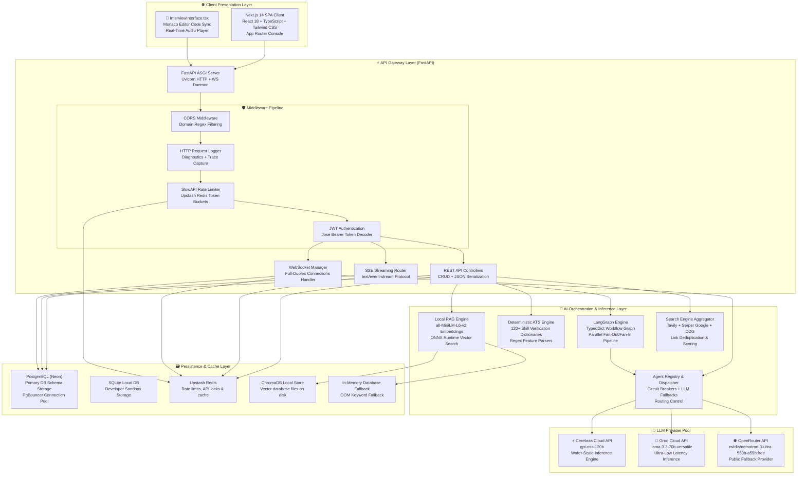

#### **Architecture Layers Walkthrough**

### 📡 **Communication Protocol Matrix**

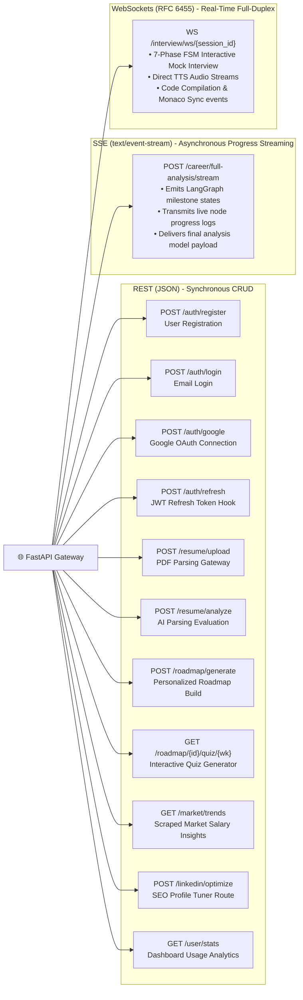

### 🔄 **Complete Request Lifecycle**

```mermaid
sequenceDiagram
    autonumber
    actor User as 👤 Client Browser
    participant Gateway as ⚡ FastAPI Server
    participant Middleware as 🛡️ Middleware Chain
    participant Database as 🗃️ PostgreSQL / Redis
    participant Registry as 🧠 Agent Registry
    participant LLM as 🤖 LLM / Search API
    participant RAG as 📖 ChromaDB Vector RAG

    User->>Gateway: Send Request (REST, SSE, or WebSocket)
    
    rect rgb(30, 41, 59)
        note right of Middleware: Authentication & Rate Limiting Checks
        Gateway->>Middleware: Trigger Middleware Pipeline
        Middleware->>Middleware: CORS Header Filter Validation
        Middleware->>Database: Verify client rate limits (Redis token check)
        Database-->>Middleware: Limit confirmation (Usage count under cap)
        Middleware->>Middleware: Decode JWT signature via Jose secret key
        Middleware-->>Gateway: Return validated payload (Attach user_id)
    end

    rect rgb(20, 83, 45)
        note right of Gateway: Route Controller Execution
        Gateway->>Database: Query current User & Resume details (SQLAlchemy)
        Database-->>Gateway: Return context payload
        
        alt Query requires vector search (Roadmap/RAG)
            Gateway->>RAG: Request local resources lookup
            RAG->>RAG: Compute embeddings locally via ONNX
            RAG-->>Gateway: Return top matching items & links
        end

        Gateway->>Registry: Dispatch task to Agent Registry
        Registry->>Registry: Check circuit breaker status
        Registry->>LLM: Dispatch API call to target provider (Cerebras / Groq / OpenRouter)
        
        alt Target provider experiences failure / rate limits
            note right of Registry: Trigger Fallback Path
            Registry->>Registry: Record failure & open circuit breaker
            Registry->>LLM: Fallback API call (e.g., Cerebras to Groq or OpenRouter)
        end
        
        LLM-->>Registry: Return structured JSON response
        Registry-->>Gateway: Return parsed response model
    end

    rect rgb(30, 41, 59)
        note right of Gateway: Data Persistence & Client Delivery
        Gateway->>Database: Record activity log, usage count & costs (Postgres)
        Database-->>Gateway: Transaction commit success
        Gateway-->>User: Deliver Response payload (JSON / SSE Event / Audio stream)
    end
```

<a id="2-langgraph-dag-orchestration"></a>
## 2. 🧠 **LangGraph DAG Orchestration**

### 🧭 **Career AI Operating System**

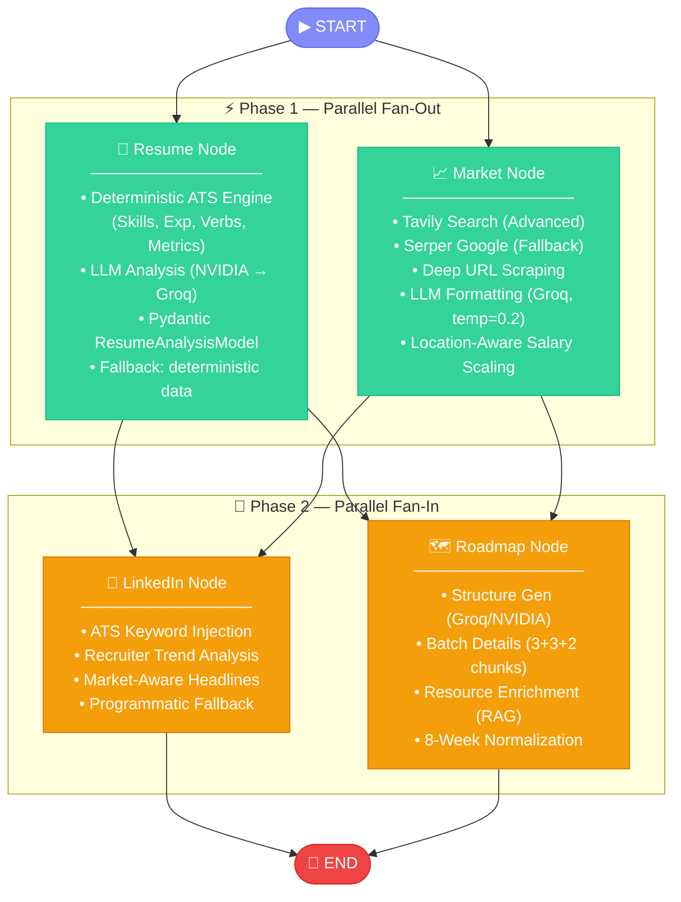

### 📊 **State Schema (TypedDict)**

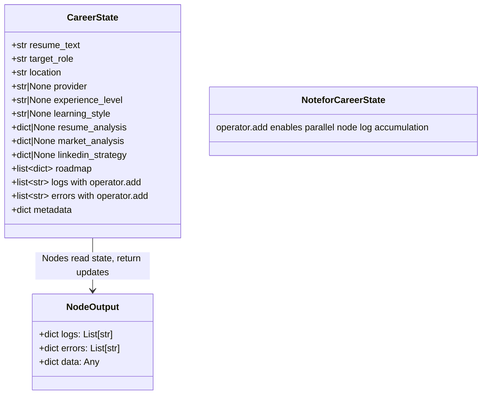

### 🔗 **Node Dependency Matrix**

### 📐 **Pipeline Timing Breakdown**

```mermaid
gantt
    title Career Analysis Pipeline Timing (~60s total)
    dateFormat  X
    axisFormat %s
    
    section Phase 1 (Parallel)
    Resume Node (ATS + LLM)    : 0, 15
    Market Node (Search + LLM) : 0, 20
    
    section Phase 2 (Parallel)
    LinkedIn Node (LLM)        : 20, 10
    Roadmap Node (LLM + RAG)   : 20, 35
    
    section Finalize
    Save + Stream Result       : 55, 5
```

<a id="3-mock-interview-fsm-state-machine"></a>
## 3. 🎤 **Mock Interview FSM (State Machine)**

### 🧭 **7-Phase Finite State Machine Overview**

```mermaid
stateDiagram-v2
    [*] --> INITIAL: Session Created
    
    state INITIAL {
        [*] --> SETUP: Initialize state
        SETUP --> READY: Load company/role config
    }
    
    INITIAL --> INTRO: Phase 0 to 1
    
    state INTRO {
        [*] --> WELCOME: Welcome to interview
        WELCOME --> BACKGROUND: Tell me about yourself
    }
    
    INTRO --> CORE_THEORY: Phase 1 to 2
    
    state CORE_THEORY {
        [*] --> FEEDBACK_INTRO: Feedback on intro
        FEEDBACK_INTRO --> CS_QUESTION: Role-specific theory query
    }
    
    CORE_THEORY --> HANDS_ON_CHALLENGE: Phase 2 to 3
    
    state HANDS_ON_CHALLENGE {
        [*] --> FEEDBACK_THEORY: Feedback on theory answer
        FEEDBACK_THEORY --> CODING_CHALLENGE: Present Coding/LeetCode problem
        CODING_CHALLENGE --> CODE_SUBMIT: Candidate codes in Monaco Sandbox
    }
    
    HANDS_ON_CHALLENGE --> PAST_EXPERIENCE: Phase 3 to 4
    
    state PAST_EXPERIENCE {
        [*] --> FEEDBACK_CODE: Feedback on code
        FEEDBACK_CODE --> PROJECT_QUESTION: Deep dive into past project
    }
    
    PAST_EXPERIENCE --> ARCHITECTURE_DESIGN: Phase 4 to 5
    
    state ARCHITECTURE_DESIGN {
        [*] --> FEEDBACK_PROJECT: Feedback on project
        FEEDBACK_PROJECT --> DESIGN_SCENARIO: Whiteboard system design
    }
    
    ARCHITECTURE_DESIGN --> BUSINESS_DOMAIN: Phase 5 to 6
    
    state BUSINESS_DOMAIN {
        [*] --> FEEDBACK_DESIGN: Feedback on design
        FEEDBACK_DESIGN --> DOMAIN_QUESTION: Company-specific scenario
    }
    
    BUSINESS_DOMAIN --> CLOSING: Phase 6 to 7
    
    state CLOSING {
        [*] --> FEEDBACK_DOMAIN: Feedback on domain
        FEEDBACK_DOMAIN --> FINAL_QUESTION: Any questions for me
    }
    
    CLOSING --> FEEDBACK: Phase 7 to 8
    
    state FEEDBACK {
        [*] --> SCORING: AI Evaluation
        SCORING --> SCORE_CARD: Generate scorecard
        SCORE_CARD --> PERSIST: Save to database
    }
    
    FEEDBACK --> COMPLETED: Session Complete
    
    state COMPLETED {
        [*] --> DONE
    }
```

### 🎯 **Role Category Adaptation Matrix**

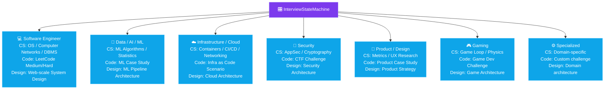

### 📋 **Phase Configuration Details**

### 📊 **Scoring Rubric**

### 🎙️ **Incremental Text-To-Speech (Edge-TTS) Pipeline**

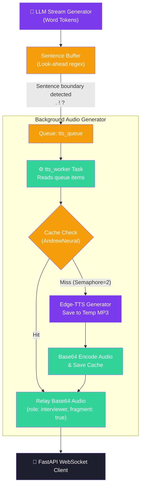

#### **Pipeline Configuration Details**

<a id="4-agent-registry--circuit-breaker"></a>
## 4. 🛡️ **Agent Registry & Circuit Breaker**

The **Agent Registry** (`app/agents/registry.py`) acts as the single unified LLM execution layer for the entire application. It provides **zero-downtime reliability** by combining a **Circuit Breaker state machine** with an automatic **Multi-LLM Fallback Chain** (`Cerebras ➔ Groq ➔ OpenRouter`).

---

### 🛡️ **Circuit Breaker State Machine (3-State Pattern)**

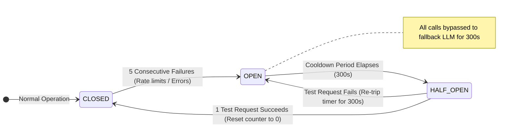

#### 📌 **State Breakdown**

| State | Behavior | Action Taken |
|:---:|:---|:---|
| 🟢 **CLOSED** | API provider is healthy. | Routes all requests to primary LLM (e.g., Cerebras). Resets error counter on success. |
| 🔴 **OPEN** | API provider is down or rate-limited (5+ fails). | Bypasses primary provider for **300 seconds (5 mins)**. Automatically redirects calls to fallback LLM. |
| 🟡 **HALF-OPEN** | Cooldown timer completed. | Sends **1 probe test request**. If successful ➔ resets to 🟢 CLOSED. If failed ➔ re-trips to 🔴 OPEN. |

---

### 🔄 **Automatic LLM Fallback Execution Flow**

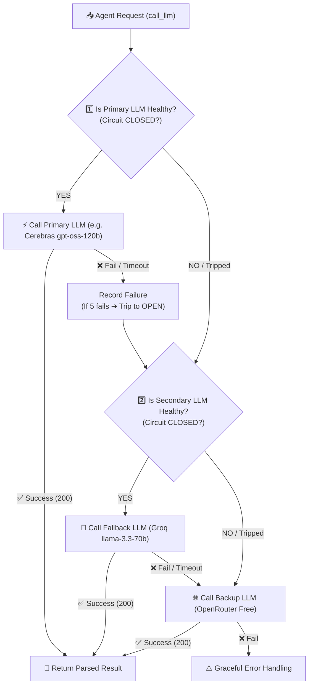

---

### 📋 **Workflow-Specific Provider Fallback Chains**

| Workflow | Primary Model | 1st Fallback | 2nd Fallback | Why This Chain? |
|:---|:---|:---|:---|:---|
| **📄 Resume Audit** | **⚡ Cerebras** (`gpt-oss-120b`) | **🔴 Groq** (`llama-3.3-70b`) | **🌐 OpenRouter** (Free) | Wafer-scale speed for instant JSON parsing. |
| **📈 Market Research** | **🔴 Groq** (`llama-3.3-70b`) | **⚡ Cerebras** (`gpt-oss-120b`) | **🌐 OpenRouter** (Free) | Low latency for search web summaries. |
| **🔗 LinkedIn Strategy** | **⚡ Cerebras** (`gpt-oss-120b`) | **🔴 Groq** (`llama-3.3-70b`) | **🌐 OpenRouter** (Free) | Fast structured text generation for headlines. |
| **🗺️ Roadmap Build** | **⚡ Cerebras** (`gpt-oss-120b`) | **🔴 Groq** (`llama-3.3-70b`) | **🌐 OpenRouter** (Free) | High token generation speed for 8-week syllabus. |
| **🎤 Mock Interview** | **🔴 Groq** (`llama-3.3-70b`) | **⚡ Cerebras** (`gpt-oss-120b`) | **🌐 OpenRouter** (Free) | Ultra-low latency for real-time live chat FSM. |

### 📊 **Provider Performance Comparison**

<a id="6-api-gateway--middleware-stack"></a>
## 6. ⚡ **API Gateway & Middleware Stack**

### 🧭 **Middleware Pipeline Architecture**

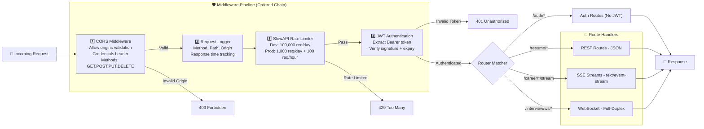

### 📋 **Complete Route Map**

### ⚡ **SSE Streaming Protocol**

<a id="7-database-entity-relationship-diagram"></a>
## 7. 🗃️ **Database Entity Relationship Diagram**

### 📐 **Complete ERD**

```mermaid
erDiagram
    classDef user fill:#818cf8,color:#fff
    classDef resume fill:#34d399,color:#fff
    classDef roadmap fill:#f59e0b,color:#fff
    classDef market fill:#06b6d4,color:#fff
    classDef interview fill:#ec4899,color:#fff
    classDef log fill:#a78bfa,color:#fff
    classDef analytics fill:#10b981,color:#fff
    classDef analysis fill:#14b8a6,color:#fff

    users ||--o{ resumes : "has many (cascade delete)"
    users ||--o{ career_roadmaps : "has many (cascade delete)"
    users ||--o{ market_analyses : "has many (cascade delete)"
    users ||--o{ interview_sessions : "has many (cascade delete)"
    users ||--o{ activity_logs : "has many (cascade delete)"
    users ||--o{ career_analyses : "has many (cascade delete)"

    users {
        string id PK "UUID (auto-generated via uuid4)"
        string email UK "Unique, indexed for fast lookup"
        string name "User's full display name"
        string hashed_pw "Nullable - NULL for OAuth users"
        datetime created_at "Auto-set to UTC timestamp"
    }

    resumes {
        string id PK "UUID"
        string user_id FK "References users.id"
        string filename "Original PDF filename"
        json parsed_content "Full AI analysis result object"
        text raw_text "Extracted plain text from PDF"
        datetime uploaded_at "Auto timestamp"
    }

    career_roadmaps {
        string id PK "UUID"
        string user_id FK "References users.id"
        string target_role "e.g. Data Scientist or ML Engineer"
        json steps "8-week plan array of week objects"
        datetime created_at "Auto timestamp (UTC)"
    }

    market_analyses {
        string id PK "UUID"
        string user_id FK "References users.id"
        string target_role "e.g. Full Stack Developer"
        string location "e.g. Bangalore, India"
        json analysis "Full market intelligence report object"
        datetime created_at "Auto timestamp"
    }

    interview_sessions {
        string id PK "UUID"
        string user_id FK "References users.id"
        string target_role "Role being interviewed for"
        json chat_history "Array of role, content, timestamp objects"
        float score "Final score out of 100 (nullable until completed)"
        string status "in_progress or completed"
        datetime created_at "Session creation timestamp"
        datetime completed_at "Session completion timestamp (nullable)"
    }

    career_analyses {
        string id PK "UUID"
        string user_id FK "References users.id"
        string target_role "e.g. Platform Engineer"
        string location "e.g. San Francisco, CA"
        json resume_analysis "Pydantic parsed resume audit block"
        json market_analysis "Pydantic parsed market trends block"
        json roadmap "Pydantic parsed learning roadmap block"
        json linkedin_strategy "Pydantic parsed LinkedIn optimizing guide"
        datetime created_at "Auto timestamp (UTC)"
    }

    activity_logs {
        string id PK "UUID"
        string user_id FK "References users.id"
        string action "Human-readable action description"
        string feature "Feature category"
        datetime created_at "Auto timestamp"
    }

    daily_analytics {
        string id PK "UUID"
        date date UK "Unique date"
        int total_requests "Request accumulator"
        int total_tokens "Token accumulator"
        float estimated_cost "Estimated LLM cost in USD"
        int fallback_count "Fallback triggers count"
        int error_count "Errors/exceptions count"
        float groq_cost "Estimated Groq API cost in USD"
        float cerebras_cost "Estimated Cerebras API cost in USD"
        float openrouter_cost "Estimated OpenRouter API cost in USD"
    }

    class users user
    class resumes resume
    class career_roadmaps roadmap
    class market_analyses market
    class interview_sessions interview
    class career_analyses analysis
    class activity_logs log
    class daily_analytics analytics
```

### 📋 **Column Detail Reference**

<a id="8-frontend-component-architecture"></a>
## 8. 💻 **Frontend Component Architecture**

### 🧩 **Complete Component Tree**

```mermaid
graph TD
    classDef layout fill:#1e1e2e,color:#fff,stroke:#6c7086
    classDef dash fill:#0ea5e9,color:#fff,stroke:#38bdf8
    classDef shared fill:#7c3aed,color:#fff,stroke:#a78bfa
    classDef landing fill:#f59e0b,color:#fff,stroke:#fbbf24
    classDef svc fill:#34d399,color:#fff,stroke:#10b981
    classDef comp fill:#14b8a6,color:#fff,stroke:#0d9488

    ROOT["Root Layout<br/>(layout.tsx)"]
    
    ROOT --> LANDING["page.tsx<br/>Landing Page"]
    ROOT --> LOGIN["login/page.tsx<br/>Login Form"]
    ROOT --> REGISTER["register/page.tsx<br/>Register Form"]
    ROOT --> DASH_LAYOUT["dashboard/layout.tsx<br/>Dashboard Frame"]
    
    subgraph "Dashboard Routes"
        DASH_LAYOUT --> D_HOME["dashboard/page.tsx<br/>Analytics HUD"]
        DASH_LAYOUT --> D_RESUME["resume/page.tsx<br/>Resume Audit Dashboard"]
        DASH_LAYOUT --> D_ROADMAP["roadmap/page.tsx<br/>Weekly Gamified Study Tracker"]
        DASH_LAYOUT --> D_MARKET["market/page.tsx<br/>Market Explorer Console"]
        DASH_LAYOUT --> D_INTERVIEW["interview/page.tsx<br/>Mock Interview Center"]
        DASH_LAYOUT --> D_LINKEDIN["linkedin/page.tsx<br/>Profile Optimizer Engine"]
        DASH_LAYOUT --> D_ANALYSIS["full-analysis/page.tsx<br/>Parallel Career OS (SSE)"]
        DASH_LAYOUT --> D_SETTINGS["settings/page.tsx<br/>User Configurations"]
        DASH_LAYOUT --> D_ADMIN["admin/observability/page.tsx<br/>Admin Observability Console"]
    end
    
    subgraph "Global / Core UI Components"
        SIDEBAR["Sidebar.tsx<br/>Navigation Frame"]
        NAVBAR["Navbar.tsx<br/>Top Toolbar Panel"]
        RESUME_PANEL["ResumeAnalysisPanel.tsx<br/>Visual Audit Result Viewer"]
        UPLOAD["UploadResumeCard.tsx<br/>PDF Drag-Drop Uploader"]
        PROGRESS["ProgressTracker.tsx<br/>Gamified XP Dashboard HUD"]
        SKELETON["Skeleton.tsx<br/>Dynamic Shimmer States"]
        GOAL_FORM["CareerGoalForm.tsx<br/>Target Goal Configurator"]
        MOBILE_BLK["MobileBlocker.tsx<br/>Viewport Guard"]
        PROVIDERS["Providers.tsx<br/>Auth & Theme Providers Context"]
    end

    subgraph "Feature Components"
        subgraph "auth/ Components"
            A_BTN["AuthButton.tsx<br/>Adaptive Sign-in Action"]
            A_CRD["AuthCard.tsx<br/>Auth Form Canvas"]
            A_INP["AuthInput.tsx<br/>Controlled Field Input"]
        end

        subgraph "charts/ Components"
            C_VOL["HiringVolumeChart.tsx<br/>Volume Trends Line/Bar Chart"]
            C_GRW["SalaryGrowthChart.tsx<br/>Salary Benchmarks Distribution"]
        end

        subgraph "full-analysis/ Components"
            FA_WIZ["AnalysisWizard.tsx<br/>Interactive Form Flow"]
            FA_LOG["ProcessLogs.tsx<br/>Real-Time Graph Milestone Streamer"]
            FA_TABS["AnalysisTabs.tsx<br/>Unified Analysis Results Switcher"]
            FA_MKT["MarketAnalysisPanel.tsx<br/>Demographics Display Node"]
            FA_LKD["LinkedInPanel.tsx<br/>Optimization Checklist Router"]
            FA_RDP["RoadmapPanel.tsx<br/>Syllabus Roadmap Viewer"]
            FA_QZM["QuizModal.tsx<br/>Weekly Quiz Module (Postgres)"]
            FA_HIS["CareerAnalysisHistory.tsx<br/>Saved Analysis Repository"]
            FA_MKH["MarketHistory.tsx<br/>Historical Search Records"]
            FA_RDH["RoadmapHistory.tsx<br/>Saved Roadmaps List"]
        end

        subgraph "interview/ Components"
            I_WIZ["InterviewWizard.tsx<br/>Session Configurations Form"]
            I_INT["InterviewInterface.tsx<br/>Split Monaco Workspace + Audio Console"]
            I_MSG["ChatMessage.tsx<br/>Conversational Feed Node"]
            I_HIS["InterviewHistory.tsx<br/>Past Scores & Transcripts Viewer"]
        end
    end
    
    subgraph "Landing Layout Components"
        L_NAV["Navbar.tsx<br/>Landing Page Navigation Header"]
        L_HERO["Hero.tsx<br/>Animated Landing Intro Call-to-Action"]
        L_FEATURES["Features.tsx<br/>Feature Cards Grid Showcase"]
        L_SHOWCASE["Showcase.tsx<br/>Dashboard Mock Screens Carousel"]
        L_STATS["Stats.tsx<br/>Key Product Metrics Counts"]
        L_PRICING["Pricing.tsx<br/>Dynamic Plans Subscription Tiers"]
        L_INT_PREP["InterviewPrep.tsx<br/>Coding Sandbox Interactive Showcase"]
        L_CTA["CTA.tsx<br/>Pre-footer Sign Up Trigger"]
        L_FOOTER["Footer.tsx<br/>Navigation Links & Copyright Panel"]
    end
    
    subgraph "API Client Service Layer (services/)"
        API_CLIENT["client.ts<br/>Axios Engine Client"]
        S_API["api.ts<br/>API Routes Helper Configuration"]
        S_AUTH["auth.ts<br/>JWT Registration & Sign-in Actions"]
        S_RESUME["resume.ts<br/>Resume Upload & Scoring API Calls"]
        S_CAREER["career.ts<br/>Career Analysis SSE Streaming Hooks"]
        S_ROADMAP["roadmap.ts<br/>Study Tracking & Quizzes APIs"]
        S_MARKET["market.ts<br/>Market Trend API Queries"]
        S_INTERVIEW["interview.ts<br/>Mock Interview WS Setup & Evaluation"]
        S_LINKEDIN["linkedin.ts<br/>LinkedIn Profile API Controls"]
        S_USER["user.ts<br/>User Profile Metrics & Dashboard Statistics"]
        S_ADMIN["admin.ts<br/>Admin Observability REST endpoints"]
    end

    DASH_LAYOUT --> SIDEBAR & NAVBAR
    LANDING --> L_NAV & L_HERO & L_FEATURES & L_SHOWCASE & L_STATS & L_PRICING & L_INT_PREP & L_CTA & L_FOOTER

    class ROOT layout
    class LANDING,LOGIN,REGISTER layout
    class DASH_LAYOUT layout
    class D_HOME,D_RESUME,D_ROADMAP,D_MARKET,D_INTERVIEW,D_LINKEDIN,D_ANALYSIS,D_SETTINGS,D_ADMIN dash
    class SIDEBAR,NAVBAR,VOICE,RESUME_PANEL,UPLOAD,PROGRESS,SKELETON,GOAL_FORM,MOBILE_BLK,PROVIDERS shared
    class L_NAV,L_HERO,L_FEATURES,L_ANYA,L_SHOWCASE,L_STATS,L_PRICING,L_INT_PREP,L_CTA,L_FOOTER landing
    class API_CLIENT,S_API,S_AUTH,S_RESUME,S_CAREER,S_ROADMAP,S_MARKET,S_INTERVIEW,S_LINKEDIN,S_USER,S_ADMIN svc
    class A_BTN,A_CRD,A_INP,C_VOL,C_GRW,FA_WIZ,FA_LOG,FA_TABS,FA_MKT,FA_LKD,FA_RDP,FA_QZM,FA_HIS,FA_MKH,FA_RDH,I_WIZ,I_INT,I_MSG,I_HIS comp
```

#### **Frontend Architecture Highlights**

### 📊 **Client-Server Data Flow**

```mermaid
sequenceDiagram
    participant U as 👤 User
    participant C as 📱 React Component
    participant S as 🌐 Service Layer (Axios client.ts)
    participant A as ⚡ ASGI FastAPI Backend

    U->>C: 1️⃣ User trigger (e.g., upload resume, start call, run analysis)
    C->>C: 2️⃣ Update state variables (loading = true, logs = empty)
    C->>S: 3️⃣ Execute API Service Hook (e.g., uploadResume())
    
    rect rgb(30, 41, 59)
        Note right of S: Request Interceptor Chain
        S->>S: Match endpoint configuration
        S->>S: Fetch JWT from localStorage & append to Authorization Header
        S->>S: Append correlation ID / Content-Type metadata
    end
    
    S->>A: 4️⃣ Dispatch HTTP POST / WS connection / SSE stream request
    
    rect rgb(20, 83, 45)
        Note left of A: Backend executes tasks (DB transactions, LLM calls)
    end
    
    A-->>S: 5️⃣ Returns Response Payload (JSON Data / raw chunk / binary stream)
    
    rect rgb(30, 41, 59)
        Note right of S: Response Interceptor Chain
        alt Case: Status is 200 OK
            S-->>S: Resolve data payload
        else Case: Status is 401 Unauthorized
            S->>A: POST /auth/refresh token update request
            A-->>S: Return fresh access token
            S->>A: Retry original failed request
        else Case: Status is 429 Rate Limited
            S-->>S: Trigger global error toast ("Daily limit reached")
        end
    end
    
    S-->>C: 6️⃣ Deliver parsed response object
    C->>C: 7️⃣ Update React local hook state (loading = false, results = payload)
    C-->>U: 🎉 Re-render React UI tree with fresh visual metrics
```

<a id="9-deployment-topology"></a>
## 9. ☁️ **Deployment Topology**

### 🏗️ **Production Infrastructure**

```mermaid
graph TB
    classDef vercel fill:#000,color:#fff,stroke:#333
    classDef render fill:#46E3B7,color:#000,stroke:#2dd4bf
    classDef neon fill:#4169E1,color:#fff,stroke:#3b82f6
    classDef upstash fill:#DC382D,color:#fff,stroke:#ef4444
    classDef chroma fill:#f59e0b,color:#fff,stroke:#fbbf24
    classDef ext fill:#6b7280,color:#fff,stroke:#9ca3af

    subgraph "Production Cloud Layer"
        subgraph "Frontend Network (Vercel)"
            VERCEL["Vercel Edge CDN<br/>Next.js Static Pages + SSR<br/>Global Edge Nodes routing<br/>HTTPS Protocol"]
        end
        
        subgraph "Application Engine (Render Web Service)"
            RENDER["Render Hosting Container<br/>Docker Engine Runtime<br/>FastAPI Web App (Uvicorn ASGI)<br/>Auto health-check (/ping)<br/>RAM: 512MB (Free Plan Limits)"]
        end
        
        subgraph "Database Store (Neon Serverless)"
            NEON["Neon Postgres DB Instance<br/>PostgreSQL 15 Core<br/>PgBouncer Connection Pooling<br/>Scale-to-zero when idle"]
        end
        
        subgraph "Cache & Rate Limiter (Upstash Serverless)"
            UPSTASH["Upstash Serverless Redis<br/>Rate-limiting buckets<br/>Active features time-locks<br/>Auto-cleanup TTL keys"]
        end
        
        subgraph "Semantic Resources Database (RAG)"
            CHROMADB["Curated Knowledge Base<br/>Embedded ChromaDB (Local Dev)<br/>Memory Fallback (Render Prod)<br/>curated_resources.json Seeding"]
        end
    end

    subgraph "External Web APIs"
        CEREBRAS_API["⚡ Cerebras API Cloud<br/>gpt-oss-120b"]
        GROQ_API["🔴 Groq Cloud API<br/>openai/gpt-oss-120b & llama-3.3-70b-versatile"]
        NVIDIA_API["🟢 NVIDIA NIM Gateway<br/>meta/llama-3.1-8b-instruct"]
        GEMINI_LIVE["🔵 Gemini Live WebSocket<br/>gemini-2.5-flash-native-audio-latest"]
        TAVILY_API["🔍 Tavily Search Engine"]
        SERPER_API["🔍 Serper Google Scraping"]
        GOOGLE_AUTH["🔐 Google OAuth 2.0"]
    end

    USERS["👤 Global Clients"] -->|"HTTPS"| VERCEL
    VERCEL -->|"API Requests (CORS)"| RENDER
    
    RENDER -->|"SQL queries (SQLAlchemy)"| NEON
    RENDER -->|"Feature Locks & Rate limits"| UPSTASH
    RENDER -->|"Vector Embeddings"| CHROMADB
    
    RENDER -->|"JSON LLM Generation"| CEREBRAS_API & GROQ_API & NVIDIA_API
    RENDER -->|"Voice stream proxy"| GEMINI_LIVE
    RENDER -->|"Live search"| TAVILY_API & SERPER_API
    
    VERCEL -->|"Sign-in flow"| GOOGLE_AUTH

    class USERS vercel
    class VERCEL vercel
    class RENDER render
    class NEON neon
    class UPSTASH upstash
    class CHROMADB chroma
    class CEREBRAS_API,GROQ_API,NVIDIA_API,GEMINI_LIVE,TAVILY_API,SERPER_API,GOOGLE_AUTH ext
```

### 🔄 **Deployment Pipeline**

```mermaid
flowchart LR
    classDef dev fill:#1e1e2e,color:#fff
    classDef ci fill:#818cf8,color:#fff
    classDef deploy fill:#34d399,color:#fff

    DEV["💻 Developer Workspace<br/>docker compose dev build"] --> CODE["📝 Version Commit<br/>git push origin main"]
    
    CODE --> GH["🐙 GitHub Repo Hooks"]
    
    GH --> CI["⚙️ GitHub Actions CI Runner"]
    
    subgraph CI [GitHub CI Operations]
        FJ["Frontend Job<br/>Linting & Compile Check"]
        BJ["Backend Job<br/>pytest suite & vulnerability scan"]
    end
    
    CI -->|"Successful Verification"| DEPLOY["🚀 Continuous Deployment Trigger"]
    
    DEPLOY --> VERCEL["Vercel Client Deploy"]
    DEPLOY --> RENDER["Render Docker Web Build"]
    
    VERCEL --> LIVE["🌍 Production Release Ready"]
    RENDER --> LIVE
 
    class DEV dev
    class CODE,GH ci
    class CI,FJ,BJ ci
    class DEPLOY,VERCEL,RENDER deploy
    class LIVE deploy
```

### 🐳 **Docker Compose Infrastructure**

<a id="10-data-flow-full-career-analysis"></a>
## 10. 🔄 **Data Flow: Full Career Analysis**

### 🧠 **Complete Pipeline Execution**

```mermaid
sequenceDiagram
    autonumber
    participant Client as 🖥️ React Frontend
    participant API as ⚡ FastAPI [career.py]
    participant RL as 🚦 Rate Limiter [rate_limit.py]
    participant Graph as 🧠 LangGraph DAG [workflow.py]
    participant ATS as 🔢 ATS Engine [ats_engine.py]
    participant Search as 🔍 Search API [service.py]
    participant LLM as 🤖 LLM Pool [registry.py]
    participant RAG as 📚 RAG Pipeline [rag_service.py]
    participant DB as 🗃️ Database (Postgres)

    Client->>API: POST /career/full-analysis/stream (sanitized inputs)
    
    API->>RL: Check User Rate limit for "full_analysis"
    RL-->>API: Limit approved (under cap)
    
    API->>Graph: Initialize CareerState & start graph.astream() (updates mode)
    Note over API, Graph: Opens SSE (text/event-stream) Connection to write real-time updates
    
    par Phase 1: Parallel Fan-Out
        Graph->>ATS: Run analyze_resume_deterministically()
        ATS-->>Graph: Return raw skills list, experience, and score metrics
        
        Graph->>LLM: Run run_resume_agent() via call_llm()
        Note over LLM: Primary: Cerebras (gpt-oss-120b)<br/>Fallback: Groq (openai/gpt-oss-120b) & NVIDIA NIM (meta/llama-3.1-8b-instruct)
        LLM-->>Graph: Return validated ResumeAnalysisModel JSON data
    and
        Graph->>Search: Run get_market_intelligence()
        Search->>Search: Tavily (Advanced) -> Serper fallback -> clean HTML pages
        Search-->>Graph: Return scraped job trends text context
        
        Graph->>LLM: Run run_market_agent()
        LLM-->>Graph: Return validated MarketTrendsModel JSON data
    end
    
    Graph-->>API: Emit Phase 1 execution logs and milestones
    API-->>Client: Stream SSE data payload (logs & updates)
    
    par Phase 2: Parallel Fan-In (Merged Inputs)
        Graph->>LLM: Run run_linkedin_agent()
        LLM-->>Graph: Return LinkedInStrategyModel (optimized bios, tags)
    and
        Graph->>LLM: Run run_roadmap_structure() -> Get 8-week structured skeleton
        LLM-->>Graph: Return 8-week array of week objects
        
        rect rgb(30, 41, 59)
            Note over Graph: Parallel Batching Optimization
            Graph->>Graph: Split structure into 3 batches (weeks 1-3, 4-6, 7-8)
            Graph->>LLM: Execute run_roadmap_details_batch() in parallel via asyncio.gather()
            LLM-->>Graph: Return detailed week topics, targets & quizzes
        end
        
        Graph->>RAG: Run enrich_weeks_with_resources()
        Note over RAG: Local vector lookup or memory fallback based on RENDER flag
        RAG-->>Graph: Return enriched week structures with curated resources URLs
    end

    Graph-->>API: Graph execution complete. Return final CareerState dictionary
    
    rect rgb(20, 83, 45)
        Note right of API: Database Persistence Transactions
        API->>DB: Save CareerRoadmap database record (steps JSON)
        API->>DB: Save CareerAnalysis database record (links both analysis & roadmap keys)
        API->>RL: Increment daily usage count in Redis for "full_analysis"
        API->>DB: Commit user activity log
    end
    
    API-->>Client: Send final result envelope (type: "result", payload: analysis data)
    Note over Client: Close SSE Stream connection. Set UI display components.
```

### 📦 **Response Envelope**

<a id="11-data-flow-resume-upload--analysis"></a>
## 11. 📄 **Data Flow: Resume Upload & Analysis**

### 📐 **Detailed Pipeline**

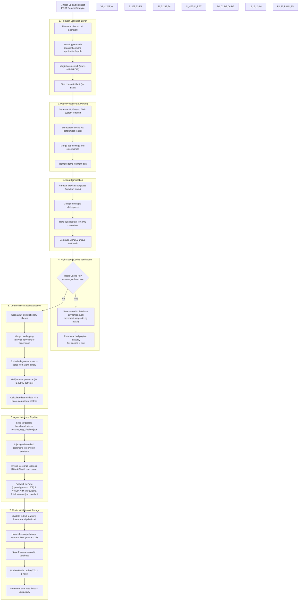

#### **Deterministic ATS Score Formula**

<a id="12-data-flow-market-intelligence"></a>
## 12. 📈 **Data Flow: Market Intelligence**

### 🔍 **Complete Market Intelligence Pipeline**

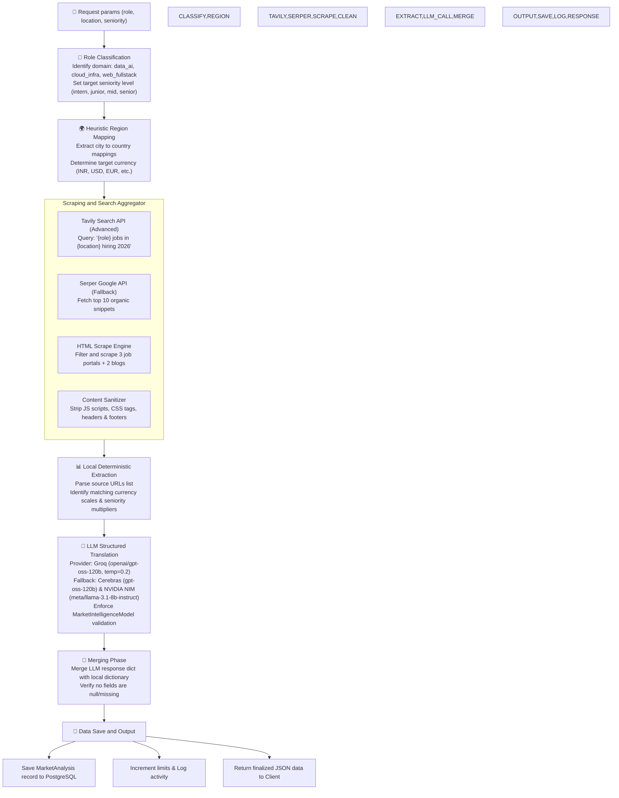

#### **Market Mapping & Seniority Calculations**

<a id="13-rate-limiting-architecture"></a>
## 13. 🚦 **Rate Limiting Architecture**

### 🧅 **Multi-Layer Rate Limiting**

```mermaid
flowchart TD
    classDef layer fill:#0ea5e9,color:#fff,stroke:#38bdf8
    classDef decision fill:#f59e0b,color:#fff,stroke:#d97706
    classDef block fill:#ef4444,color:#fff,stroke:#dc2626
    classDef allow fill:#34d399,color:#fff,stroke:#10b981

    REQ["📨 Incoming Request"]
    
    subgraph "Layer 1: Global Rate Limit (SlowAPI)"
        SLOW["SlowAPI Middleware<br/>Backend: Redis (Upstash)<br/>Key: IP Address<br/>Dev: 100,000 req/day<br/>Prod: 1,000 req/day + 100 req/hour"]
    end
    
    subgraph "Layer 2: Per-Feature Daily Caps"
        CHECK["check_daily_limit(user_id, feature)"]
        
        GAP{"Multi-Day Gap Lock Check"}
        DAILY{"Daily Cap Check"}
    end
    
    subgraph "Backend Store: Redis (Upstash)"
        R_GET["Redis GET usage count"]
        R_INCR["Redis INCR increment"]
        R_TTL["Redis TTL dynamic expiry (3-5 days)"]
    end
    
    subgraph "Fallback: In-Memory Storage"
        M_GET["dict() lookup per-user per-feature"]
        M_INCR["Counter increment"]
    end
    
    REQ --> SLOW
    
    SLOW -->|"Under Limit"| CHECK
    SLOW -->|"Exceeded"| BLOCK_G["429 Too Many Requests"]
    
    CHECK --> GAP
    
    GAP -->|"Locked"| BLOCK_F["429 Feature Gap-Locked (3-5 days)"]
    GAP -->|"No Lock"| DAILY
    
    DAILY -->|"Cap Reached"| BLOCK_D["429 Daily Limit Reached"]
    DAILY -->|"Available"| R_GET
    
    R_GET -->|"Redis OK"| ALLOW["✅ Allow Request"]
    R_GET -->|"Redis Down"| M_GET --> ALLOW["✅ Allow (memory fallback)"]
    
    ALLOW --> HANDLER["🎯 Route Handler"]
    HANDLER --> R_INCR & M_INCR
 
    style REQ layer
    style SLOW,CHECK layer
    style GAP,DAILY decision
    style R_GET,R_INCR,R_TTL layer
    style M_GET,M_INCR layer
    style BLOCK_G,BLOCK_F,BLOCK_D block
    style ALLOW,HANDLER allow
```

### 📊 **Feature Limits Matrix**

<a id="14-rag--resource-enrichment-pipeline"></a>
## 14. 🧬 **RAG & Resource Enrichment Pipeline**

### 📚 **Complete Resource Quality Engine**

```mermaid
flowchart TD
    classDef input fill:#818cf8,color:#fff,stroke:#6366f1
    classDef search fill:#06b6d4,color:#fff,stroke:#0891b2
    classDef quality fill:#f59e0b,color:#fff,stroke:#d97706
    classDef fallback fill:#7c3aed,color:#fff,stroke:#a78bfa
    classDef output fill:#34d399,color:#fff,stroke:#10b981

    WEEKS["🗓️ 8-Week Roadmap Topics"]
    
    WEEKS --> GEN_QUERY["🔍 Generate Search Queries<br/>2-3 topic-specific queries per week"]
    
    GEN_QUERY --> DDG["🦆 DuckDuckGo Search<br/>10 results per query"]
    
    subgraph "Quality Scoring Engine"
        DOMAIN["📊 Domain Weight Scoring"]
        GITHUB["🐙 GitHub Repository Audit"]
        URL_CHECK["✅ URL Reachability Check"]
        DEDUP["📝 Title Deduplication"]
    end
    
    subgraph "Domain Scoring"
        HEURISTIC["Official docs: +40pts<br/>GitHub repos: +25pts<br/>Educational: +20pts<br/>Tutorials: +10pts<br/>Community: +5pts"]
    end
    
    subgraph "GitHub Audit"
        GH_AUDIT["Star count check (+10)<br/>Last push date check<br/>Archive status check (-30)"]
    end
    
    subgraph "URL Validation"
        URL_VAL["Parallel HTTP Validation<br/>10 concurrent workers<br/>HEAD request with GET fallback<br/>Must return 200 OK"]
    end
    
    subgraph "Deduplication"
        DEDUP_LOGIC["Title Similarity Check<br/>difflib.SequenceMatcher<br/>Threshold: 0.85"]
    end

    subgraph "Fallback Layer"
        CHROMA["🗃️ ChromaDB Vector Search<br/>ONNX all-MiniLM-L6-v2<br/>Cosine similarity"]
        KEYWORD["📝 In-Memory Keyword Matcher<br/>OOM-safe fallback<br/>Zero dependencies"]
    end

    DDG --> HEURISTIC
    HEURISTIC --> GH_AUDIT
    GH_AUDIT --> URL_VAL
    URL_VAL --> DEDUP_LOGIC
    
    DEDUP_LOGIC -->|"3 or more resources"| ENRICHED["✅ Enriched Roadmap Weeks<br/>YouTube, Articles, GitHub, Docs"]
    
    DEDUP_LOGIC -->|"Less than 3 resources"| CHROMA
    CHROMA -->|"Found"| ENRICHED
    CHROMA -->|"OOM or Error"| KEYWORD --> ENRICHED
    
    style WEEKS input
    style GEN_QUERY,DDG search
    style DOMAIN,GITHUB,URL_CHECK,DEDUP quality
    style HEURISTIC,GH_AUDIT,URL_VAL,DEDUP_LOGIC quality
    style CHROMA,KEYWORD fallback
    style ENRICHED output
```

### 🏆 **Domain Scoring Matrix**

### 🛡️ **OOM Prevention Strategy**

```mermaid
flowchart LR
    classDef start fill:#818cf8,color:#fff
    classDef check fill:#f59e0b,color:#fff
    classDef chroma fill:#7c3aed,color:#fff
    classDef fallback fill:#34d399,color:#fff

    START["🚀 Service Startup"]
    
    CHECK_1{"RENDER env or DISABLE_CHROMA?"}
    CHECK_2{"chromadb imports?"}
    CHECK_3{"ONNX model load success?"}
    
    START --> CHECK_1
    
    CHECK_1 -->|"Yes (512MB RAM)"| SKIP["⏭️ Skip ChromaDB<br/>Use In-Memory Only"]
    CHECK_1 -->|"No"| CHECK_2
    
    CHECK_2 -->|"Not installed"| FALLBACK["📝 In-Memory Keyword Matcher"]
    CHECK_2 -->|"Installed"| CHECK_3
    
    CHECK_3 -->|"Success"| ACTIVE["🗃️ ChromaDB Active<br/>Full Vector Search"]
    CHECK_3 -->|"Memory Error"| FALLBACK
    
    SKIP --> FALLBACK
 
    class START start
    class CHECK_1,CHECK_2,CHECK_3 check
    class ACTIVE chroma
    class SKIP,FALLBACK fallback
```

<a id="15-authentication-flow"></a>
## 15. 🔒 **Authentication Flow**

### 🧭 **Complete Auth Architecture**

```mermaid
sequenceDiagram
    participant User as 👤 User
    participant Frontend as 🖥️ Frontend Client
    participant Backend as ⚡ FastAPI [auth.py]
    participant DB as 🗃️ Database (PostgreSQL)
    participant Google as 🌐 Google Auth API

    rect rgb(30, 30, 46)
        Note over User,DB: Email/Password Registration
        User->>Frontend: Enter registration credentials
        Frontend->>Backend: POST /auth/register
        Backend->>DB: Check email duplicate (lowercased)
        DB-->>Backend: Email is available
        Backend->>Backend: Hash password via bcrypt
        Backend->>DB: INSERT User record
        DB-->>Backend: Record committed
        Backend->>Backend: Generate JWT Pair (Access + Refresh)
        Backend-->>Frontend: Return token payload
        Frontend->>Frontend: Store JWT in localStorage
        Frontend-->>User: Redirect to dashboard view
    end

    rect rgb(30, 30, 46)
        Note over User,DB: Standard Password Sign-In
        User->>Frontend: Enter login credentials
        Frontend->>Backend: POST /auth/login
        Backend->>DB: Fetch user by email
        DB-->>Backend: User record returned
        Backend->>Backend: Verify password using bcrypt.verify()
        alt Invalid Password
            Backend-->>Frontend: 401 Unauthorized
        else Valid Password
            Backend->>Backend: Create Access + Refresh JWT tokens
            Backend-->>Frontend: Return token payload
        end
    end

    rect rgb(30, 30, 46)
        Note over User,DB: Google OAuth 2.0 Login
        User->>Frontend: Click "Sign in with Google"
        Frontend->>Google: Initialize OAuth popup consent
        Google-->>Frontend: Return OAuth credential token
        Frontend->>Backend: POST /auth/google (credential)
        
        alt Credential is Google Access Token (starts with ya29.)
            Backend->>Google: GET https://www.googleapis.com/oauth2/v3/userinfo
            Google-->>Backend: Return name, email, avatar
        else Credential is ID Token (standard JWT)
            Backend->>Backend: id_token.verify_oauth2_token(clock_skew=10s)
            Backend-->>Backend: Return decrypted claims (name, email)
        end
        
        Backend->>DB: Find or create User by email
        alt New Social User
            Backend->>DB: INSERT User (hashed_pw = NULL)
        end
        Backend->>Backend: Generate JWT Pair
        Backend-->>Frontend: Return token pair + name
    end

    rect rgb(30, 30, 46)
        Note over User,DB: Token Refresh Loop
        Frontend->>Backend: POST /auth/refresh (refresh_token payload)
        Backend->>Backend: Decode & verify claims (type == "refresh")
        Backend->>DB: Fetch User details by subject claim (uuid)
        Backend->>Backend: Generate fresh Access + Refresh JWT pair
        Backend-->>Frontend: Return fresh token pair
    end
```

### 🔑 **JWT Token Structure**

<a id="16-websocket-communication-protocol"></a>
## 16. 🚇 **WebSocket Communication Protocol**

### 🎤 **Interview WebSocket Protocol**

```mermaid
sequenceDiagram
    participant Client as 🖥️ Client (InterviewInterface.tsx)
    participant Server as ⚡ Server (websocket_manager.py)
    participant FSM as 🧠 FSM State Machine

    Client->>Server: 1️⃣ WebSocket Connect (session_id, role, token, provider)
    Server->>Server: Decode JWT and verify usage limits
    Server->>Server: Fetch/resume session history in DB
    Server-->>Client: Send JSON ("Connected. Preparing your interview...")
    
    Note over Client, Server: Phase 1: Intro Initiated
    Server->>FSM: Instantiate InterviewStateMachine(phase = 1)
    Server->>Server: Generate Phase 1 prompt instructions
    Server-->>Client: Stream question text (role: "interviewer_stream")
    Server-->>Client: Dispatch final block (role: "interviewer", type: "question")

    Note over Client: Monaco Code Editor workspace active
    Client->>Client: Candidate writes code or text
    Client->>Server: Send message payload string (combines text + editor markdown code block)
    
    Server->>Server: Append candidate response to session history in DB
    Server->>FSM: Increment progress -> InterviewStateMachine(phase = 2)
    Server->>Server: Stream next question chunk & trigger TTS conversion in background
    
    par Stream Text
        Server-->>Client: Stream question text chunks (role: "interviewer_stream")
    and Stream Audio
        Server-->>Client: Dispatch incremental audio frames (role: "interviewer", audio: base64_mp3, fragment: true)
    end
    
    Note over Client, Server: Concluding Phase 8 (Feedback)
    Server-->>Client: Send system block (role: "system", content: "Interview Concluding...")
    Server->>Server: Evaluate transcript & extract score
    Server-->>Client: Stream scorecard text & send completion signal (role: "system", content: "Interview Completed.", score)
    Client->>Server: Close WebSocket connection
```

### 🎙️ **Voice Assistant WebSocket Protocol**

```mermaid
sequenceDiagram
    participant Client as 🖥️ Client (VoiceAssistant.tsx)
    participant Server as ⚡ Server (voice_assistant.py)
    participant Gemini as 🔵 Gemini Live WebSocket

    Client->>Server: Connect WS (token parameter query)
    Server->>Server: Authenticate JWT & verify daily voice budget (limit = 2)
    Server->>Server: Load user history (resume, roadmap, market trends)
    Server->>Server: Formulate sweet/cute Anya Hinglish system instructions
    
    Server->>Gemini: Connect wss://generativelanguage.googleapis.com/...
    Server->>Gemini: Send generation config (prebuiltVoiceConfig: "Aoede", responseModalities: ["AUDIO"])
    Server-->>Client: Handshake complete
    
    loop Real-Time Conversation
        Client->>Client: Capture 16kHz PCM mono audio buffer
        Client->>Server: JSON message (type: "audio", data: base64_pcm)
        Server->>Gemini: Relay realtimeInput chunk
        
        Gemini-->>Server: Stream serverContent (audio modalities)
        Server-->>Client: JSON frame (audio: base64_pcm 24kHz, transcript: text)
        Client->>Client: Play audio & temporarily suppress microphone (prevent echo)
    end

    Note over Client, Server: Timeout Guard
    Server-->>Client: Close connection after 5 minutes limit (MAX_CALL_DURATION)
    Server->>Gemini: Close WS connection
```

### 📋 **WebSocket Message Types**

#### **1. Mock Interview WS Channel**

#### **2. Voice Assistant (Anya) WS Channel**

<a id="17-test-architecture--coverage"></a>
## 17. 🧪 **Test Architecture & Coverage**

### 📐 **Test Pyramid**

```mermaid
graph TB
    classDef unit fill:#818cf8,color:#fff,stroke:#6366f1
    classDef integ fill:#34d399,color:#fff,stroke:#10b981
    classDef e2e fill:#f59e0b,color:#fff,stroke:#d97706

    E2E["🧪 End-to-End Tests<br/>Full browser UI validation<br/>Coverage: 0 (future)"]
    
    INTEG["🔗 Integration Tests<br/>Main REST API endpoints: 9 tests<br/>Pipeline features: 13 tests<br/>WS Voice assistant proxy: 3 tests<br/>Observability: 2 tests<br/>Admin metrics & delete: 8 tests<br/>Total: 35 tests"]
    
    UNIT["🔬 Unit Tests<br/>LLM Caller & fallback registry: 24 tests<br/>Roadmap normalizations & fallback: 24 tests<br/>Pydantic schema constraints: 16 tests<br/>Deterministic ATS score: 5 tests<br/>Market services classification: 4 tests<br/>Gamified roadmap completion: 4 tests<br/>LinkedIn fallbacks: 2 tests<br/>Total: 79 tests"]

    E2E -.->|"114 Total Tests"| INTEG --> UNIT
 
    class UNIT unit
    class INTEG integ
    class E2E e2e
```

### 📊 **Test Coverage Matrix**

```mermaid
graph TD
    classDef title fill:#1e1e2e,color:#fff,stroke:#6c7086
    classDef test fill:#818cf8,color:#fff,stroke:#6366f1
    classDef area fill:#34d399,color:#fff,stroke:#10b981

    TESTS["🧪 Test Suite - 114 Tests"]
    
    TESTS --> AR["test_agents_registry.py: 24 tests"]
    TESTS --> RA["test_roadmap_agents.py: 24 tests"]
    TESTS --> PV["test_validation.py: 16 tests"]
    TESTS --> F["test_features.py: 13 tests"]
    TESTS --> M["test_main.py: 9 tests"]
    TESTS --> CA["test_career_and_interview_apis.py: 6 tests"]
    TESTS --> AE["test_ats_engine.py: 5 tests"]
    TESTS --> MS["test_market_service.py: 4 tests"]
    TESTS --> GR["test_gamified_roadmap.py: 4 tests"]
    TESTS --> VA["test_voice_assistant.py: 3 tests"]
    TESTS --> LI["test_linkedin.py: 2 tests"]
    TESTS --> OB["test_observability.py: 2 tests"]
    TESTS --> AM["test_admin_metrics_fetch.py: 2 tests"]

    subgraph "Coverage Areas"
        C1["🧠 Agent Registry<br/>JSON extraction, Circuit breaker, Fallback chains"]
        C2["🗺️ Roadmap Agents<br/>Fallback structures, Detail batching, Week normalization"]
        C3["✅ Pydantic Validation<br/>ATS score capping, Coercion validators, Constraints"]
        C4["⚡ Main API & Admin<br/>Auth endpoints, Rate limiting, JWT lifecycle, Metrics"]
        C5["⚙️ Core Features<br/>Market scrapers, TTS audio, Search algorithms, Cache"]
        C6["🔢 ATS Engine<br/>Date parsing, Interval merging, Skill extraction"]
        C7["📈 Market Service<br/>Salary conversion, Role classification, Location mapping"]
        C8["🎮 Gamified Roadmap<br/>Week completion triggers, Quiz generation"]
        C9["🎙️ Voice Assistant<br/>WebSocket auth flow, Gemini config"]
        C10["🔗 LinkedIn<br/>Fallback strategy, Model structures"]
    end

    AR --> C1
    RA --> C2
    PV --> C3
    M --> C4
    F --> C5
    AE --> C6
    MS --> C7
    GR --> C8
    VA --> C9
    LI --> C10
    OB --> C4
    AM --> C4
    CA --> C4
 
    class TESTS title
    class AR,RA,PV,M,F,AE,MS,GR,VA,LI,OB,AM,CA test
    class C1,C2,C3,C4,C5,C6,C7,C8,C9,C10 area
```

### 🏃 **Running Tests**

<a id="18-cicd-pipeline-architecture"></a>
## 18. ⚙️ **CI/CD Pipeline Architecture**

### 🚀 **GitHub Actions Workflows Overview**

```mermaid
flowchart TD
    classDef trigger fill:#818cf8,color:#fff,stroke:#6366f1
    classDef job fill:#f59e0b,color:#fff,stroke:#d97706
    classDef step fill:#34d399,color:#fff,stroke:#10b981
    classDef deploy fill:#0ea5e9,color:#fff,stroke:#38bdf8
    classDef fail fill:#ef4444,color:#fff,stroke:#dc2626

    TRIGGER["📦 Push / PR to main branch"]

    %% Workflow 1: CI Pipeline
    TRIGGER --> CI_JOB["⚡ Continuous Integration (ci.yml)"]
    
    subgraph FE_SUB["Frontend Job"]
        F1["Node.js Setup (v20)"]
        F2["Install Deps (npm ci)"]
        F3["Lint Check (npm run lint)"]
        F4["Next.js Build (npm run build)"]
        F1 --> F2 --> F3 --> F4
    end
    
    subgraph BE_SUB["Backend Job"]
        B1["Python Setup (v3.11)"]
        B2["Install Deps (requirements.txt)"]
        B3["Pytest Suite (114 tests)"]
        B4["Dependency Audit (pip-audit)"]
        B5["Database Migration (Alembic)"]
        B6["FastAPI Background Server"]
        B7["Newman Integration Tests<br/>(Auth, User, Health & System)"]
        B1 --> B2 --> B3 --> B4 --> B5 --> B6 --> B7
    end
    
    CI_JOB --> F1
    CI_JOB --> B1

    %% Workflow 2: Docker Publish
    TRIGGER --> DOCKER_JOB["🐳 Docker Publish (docker-publish.yml)"]
    subgraph DOCKER_SUB["Docker Multi-Arch Build"]
        D1["Log in to GHCR"]
        D2["Build & Push Backend Image"]
        D3["Build & Push Frontend Image"]
        D1 --> D2 --> D3
    end
    DOCKER_JOB --> D1

    %% Workflow 3: Render Deploy
    TRIGGER --> DEPLOY_JOB["☁️ Render Deploy (backend-deploy.yml)"]
    DEPLOY_JOB -->|"Path: backend/**"| R1["Trigger Render Deploy Hook"]

    %% Deployments
    F4 -->|"Pass"| VERCEL["Vercel Auto-Deploy (Frontend)"]
    B7 -->|"Pass"| RENDER["Render Deploy Hook (Backend)"]
    
    VERCEL & RENDER --> PROD["🌍 Production Live"]

    class TRIGGER trigger
    class CI_JOB,DOCKER_JOB,DEPLOY_JOB job
    class F1,F2,F3,F4 step
    class B1,B2,B3,B4,B5,B6,B7 step
    class D1,D2,D3 step
    class R1 step
    class VERCEL,RENDER,PROD deploy
```

### 📋 **Active Pipeline Configurations**

#### 1️⃣ **Continuous Integration** (`.github/workflows/ci.yml`)

#### 2️⃣ **Docker Build & Publish** (`.github/workflows/docker-publish.yml`)

#### 3️⃣ **Trigger Render Deployment** (`.github/workflows/backend-deploy.yml`)

### 🛡️ **Production Hardening Checklist**

<a id="19-admin-observability--telemetry-console"></a>
## 19. 🛡️ **Admin Observability & Telemetry Console**

### 📐 **Telemetry Flow Pipeline Architecture**

```mermaid
sequenceDiagram
    autonumber
    actor Admin as 🛡️ Admin Client
    actor User as 👤 Active User
    participant API as ⚡ FastAPI Gateway
    participant Redis as ⚡ Upstash Redis
    participant DB as 🗃️ PostgreSQL (Neon)

    Note over User, API: Real-Time Event Collection
    User->>API: HTTP Request / WebSocket Connection
    API->>Redis: 1. track_active_user (ZSET key with timestamp score)
    API->>Redis: 2. track_active_websocket ("connect"/"disconnect" INCR/DECR)
    API-->>User: Process Request (Agent workflows, LLM call)
    API->>Redis: 3. track_llm_call (LPUSH latencies, INCR tokens, INCR cost)
    API->>Redis: 4. increment_fallback (on LLM retry fallback triggers)
    API->>Redis: 5. track_error (LPUSH exceptions traceback logs)

    Note over API, DB: Background PostgreSQL Rollup
    loop Daily Cron Task (sync_redis_to_postgres)
        API->>Redis: Fetch raw metrics for current date
        API->>DB: Upsert accumulated counts into daily_analytics
        API->>Redis: Prune ZSET active users (older than 5 min)
    end

    Note over Admin, DB: Observability UI Presentation
    Admin->>API: GET /admin/metrics (verify_admin_user email check)
    API->>Redis: Read real-time active users & websockets & errors
    API->>DB: Query DailyAnalytics historical chart data
    API-->>Admin: Return aggregated metrics payload (rendered in Recharts)
```

### 📊 **Loguru Global Error Interceptor Sink**

### 📈 **Prometheus Instrumentation**

