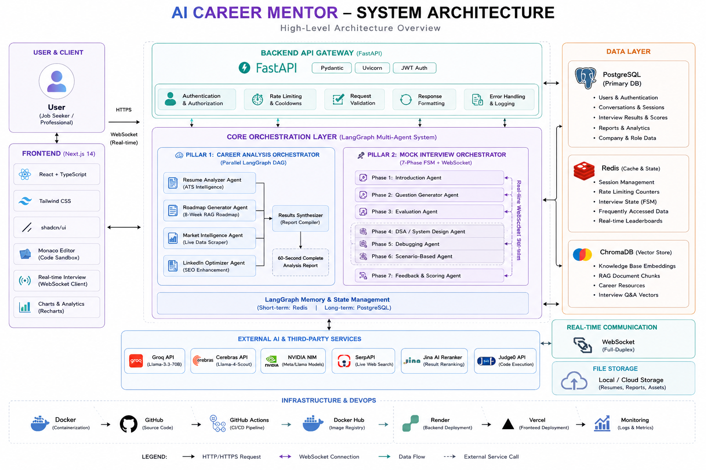

<div align="center">

# 🏗️ **AI Career Mentor — System Architecture**

**Complete Technical Architecture Documentation with Mermaid Diagrams**


</div>

---

## 📑 **Table of Contents**

| # | Section | 🔗 |
|---|---------|-----|
| 1 | [🌐 High-Level System Architecture](#1-high-level-system-architecture) |
| 2 | [🧠 LangGraph DAG Orchestration](#2-langgraph-dag-orchestration) |
| 3 | [🎤 Mock Interview FSM State Machine](#3-mock-interview-fsm-state-machine) |
| 4 | [🛡️ Agent Registry & Circuit Breaker](#4-agent-registry--circuit-breaker) |
| 5 | [⚡ API Gateway & Middleware Stack](#5-api-gateway--middleware-stack) |
| 6 | [🗃️ Database Entity Relationship Diagram](#6-database-entity-relationship-diagram) |
| 7 | [💻 Frontend Component Architecture](#7-frontend-component-architecture) |
| 8 | [☁️ Deployment Topology](#8-deployment-topology) |
| 9 | [🔄 Data Flow: Full Career Analysis](#9-data-flow-full-career-analysis) |
| 10 | [📄 Data Flow: Resume Audit & RAG Benchmarks](#10-data-flow-resume-audit--rag-benchmarks) |
| 11 | [🗺️ Data Flow: Roadmap Build & RAG Resource Enrichment](#11-data-flow-roadmap-build--rag-resource-enrichment) |
| 12 | [📈 Data Flow: Market Intelligence](#12-data-flow-market-intelligence) |
| 13 | [🔗 Data Flow: LinkedIn Strategy Optimizer](#13-data-flow-linkedin-strategy-optimizer) |
| 14 | [🎤 Data Flow: Technical Mock Interview (FSM)](#14-data-flow-technical-mock-interview-fsm) |
| 15 | [🚦 Rate Limiting Architecture](#15-rate-limiting-architecture) |
| 16 | [🧬 RAG & Resource Enrichment Pipeline](#16-rag--resource-enrichment-pipeline) |
| 17 | [🔒 Authentication Flow](#17-authentication-flow) |
| 18 | [🚇 WebSocket Communication Protocol](#18-websocket-communication-protocol) |
| 19 | [🧪 Test Architecture & Coverage](#19-test-architecture--coverage) |
| 20 | [⚙️ CI/CD Pipeline Architecture](#20-cicd-pipeline-architecture) |
| 21 | [🛡️ Admin Observability & Telemetry Console](#21-admin-observability--telemetry-console) |

---

<a id="1-high-level-system-architecture"></a>
## 1. 🌐 **High-Level System Architecture**

### 🧭 **System Overview (30,000 ft View)**

<div align="center">
  
</div>

```text
┌───────────────────────────────────────────────────────────────────────────────┐
│                         🌐 CLIENT PRESENTATION LAYER                           │
│                                                                               │
│  ┌─────────────────────────────┐        ┌────────────────────────────────┐    │
│  │ UI                          │        │ MI                             │    │
│  │ Next.js 14 SPA Client       │        │ InterviewInterface.tsx         │    │
│  │ React 18 + TypeScript +     │        │ Monaco Editor Code Sync        │    │
│  │ Tailwind CSS                │        │ Real-Time Audio Player         │    │
│  │ App Router Console          │        │                                │    │
│  └──────────────┬──────────────┘        └───────────────┬────────────────┘    │
└─────────────────┼────────────────────────────────────────┼─────────────────────┘
                  │                                        │
                  └───────────────────┬────────────────────┘
                                      ▼
┌───────────────────────────────────────────────────────────────────────────────┐
│                          ⚡ API GATEWAY LAYER (FastAPI)                        │
│  ┌────────────────────────────────┐                                           │
│  │ GW                             │                                           │
│  │ FastAPI ASGI Server            │                                           │
│  │ Uvicorn HTTP + WS Daemon       │                                           │
│  └───────────────┬────────────────┘                                           │
│                  ▼                                                            │
│  ┌──────────────┐  ┌──────────────┐  ┌──────────────┐  ┌──────────────┐      │
│  │ CORS         │► │ LOG          │► │ SLW          │► │ JWT          │      │
│  │ CORS         │  │ HTTP Req     │  │ SlowAPI      │  │ JWT Auth     │      │
│  │ Middleware   │  │ Logger       │  │ Rate Limiter │  │ Jose Bearer  │      │
│  │ Domain Regex │  │ Diagnostics  │  │ Upstash Redis│  │ Token Decoder│      │
│  │ Filtering    │  │ Trace Capture│  │ Token Buckets│  │              │      │
│  └──────────────┘  └──────────────┘  └──────┬───────┘  └──────┬───────┘      │
└─────────────────────────────────────────────┼──────────────────┼───────────────┘
                                              │                  ▼
                           SLW ──► RD         │        ┌──────────────────────┐
                                              │        │ REST │ SSE │ WS_MGR  │
                                              │        │ CRUD / text-event-  │
                                              │        │ stream / Full-Duplex │
                                              │        └──────┬──────────┬────┘
                                              │               ▼          ▼
┌─────────────────────────────────────────────┼────────────────────────────────┐
│                 🧠 AI ORCHESTRATION & INFERENCE LAYER                         │
│  ┌────────────────────────┐  ┌────────────────────┐  ┌────────────────────┐   │
│  │ ATS                    │  │ RAG_SVC            │  │ SE                 │   │
│  │ Deterministic ATS      │  │ Local RAG Engine   │  │ Search Engine      │   │
│  │ 120+ Skill Dicts       │  │ all-MiniLM-L6-v2   │  │ Aggregator         │   │
│  │ Regex Feature Parsers  │  │ ONNX Vector Search │  │ Tavily+Serper+DDG  │   │
│  │                        │  │                    │  │ Link Dedup+Scoring │   │
│  └────────────┬───────────┘  └────────┬───────────┘  └─────────┬──────────┘   │
│               │                       │                       │              │
│  ┌────────────────────┐               │                       │              │
│  │ LG                 │               │                       │              │
│  │ LangGraph Engine   │───────────────┴───────────────────────┘              │
│  │ TypedDict Workflow │              │                                       │
│  │ Parallel Fan-Out/  │              │                                       │
│  │ Fan-In Pipeline    │              ▼                                       │
│  └─────────┬──────────┘  ┌─────────────────────────────────────┐             │
│            │             │ REG                                 │             │
│            │             │ Agent Registry & Dispatcher         │             │
│            └────────────►│ Circuit Breakers + LLM Fallbacks    │             │
│                          │ Routing Control                     │             │
│                          └──────────────────┬──────────────────┘             │
└─────────────────────────────────────────────┼────────────────────────────────┘
                                              ▼
┌───────────────────────────────────────────────────────────────────────────────┐
│                              🤖 LLM PROVIDER POOL                              │
│  ┌────────────────────┐  ┌────────────────────┐  ┌──────────────────────┐    │
│  │ CEREBRAS           │  │ GROQ               │  │ NVIDIA               │    │
│  │ Cerebras Cloud API │  │ Groq Cloud API     │  │ NVIDIA NIM API       │    │
│  │ gpt-oss-120b       │  │ openai/gpt-oss-120b│  │ nemotron-3-super-    │    │
│  │ Wafer-Scale Engine │  │ Ultra-Low Latency  │  │ 120b-a12b (Fallback) │    │
│  └────────────────────┘  └────────────────────┘  └──────────────────────┘    │
└───────────────────────────────────────────────────────────────────────────────┘

  🗃️ PERSISTENCE & CACHE LAYER
  ┌────────────────────┐  ┌────────────────────┐  ┌────────────────────┐
  │ PG                 │  │ SQL                │  │ RD                 │
  │ PostgreSQL (Neon)  │  │ SQLite Local DB    │  │ Upstash Redis      │
  │ Primary DB Schema  │  │ Developer Sandbox  │  │ Rate limits, API   │
  │ PgBouncer Pool     │  │ Storage            │  │ locks & cache      │
  └────────────────────┘  └────────────────────┘  └────────────────────┘
  ┌────────────────────┐  ┌────────────────────┐
  │ CD                 │  │ MEM                │
  │ ChromaDB Local     │  │ In-Memory DB       │
  │ Vector DB on disk  │  │ Fallback           │
  │                    │  │ OOM Keyword Fallb. │
  └────────────────────┘  └────────────────────┘

  EDGE LEGEND
  ┌────────────────────────────────────────────────────────────────────────────┐
  │ UI & MI ──► GW                                        GW ──► CORS ► LOG     │
  │                                                            ► SLW ► JWT      │
  │ JWT ──► REST │ SSE │ WS_MGR                              SLW ──► RD         │
  │ REST ──► ATS │ RAG_SVC │ SE │ PG │ RD                    SSE ──► LG │ PG │ RD│
  │ WS_MGR ──► REG │ PG │ RD                                 LG ──► REG          │
  │ REG ──► CEREBRAS │ GROQ │ NVIDIA                         RAG_SVC ──► CD │ MEM│
  └────────────────────────────────────────────────────────────────────────────┘
```

#### **Architecture Layers Walkthrough**

### 📡 **Communication Protocol Matrix**

```text
  ┌────────────────────────────┐
  │ 🌐 FastAPI Gateway         │
  └─────────────┬──────────────┘
                │
   ┌────────────┼─────────────────────────────────────────┐
   ▼            ▼                                         ▼
┌─────────────────────────────────────────────┐  ┌──────────────────────────────────┐
│ REST (JSON) — Synchronous CRUD              │  │ SSE (text/event-stream)           │
│                                             │  │ Asynchronous Progress Streaming   │
│ ┌──────────────────────┐                    │  │ ┌──────────────────────────────┐  │
│ │ R1 POST /auth/       │                    │  │ │ S1 POST /career/             │  │
│ │    register          │                    │  │ │    full-analysis/stream      │  │
│ │ User Registration    │                    │  │ │ • Emits LangGraph milestone  │  │
│ └──────────────────────┘                    │  │ │   states                     │  │
│ ┌──────────────────────┐                    │  │ │ • Transmits live node        │  │
│ │ R2 POST /auth/login  │                    │  │ │   progress logs              │  │
│ │ Email Login          │                    │  │ │ • Delivers final analysis    │  │
│ └──────────────────────┘                    │  │ │   model payload              │  │
│ ┌──────────────────────┐                    │  │ └──────────────────────────────┘  │
│ │ R3 POST /auth/google │                    │  └──────────────────────────────────┘
│ │ Google OAuth         │                    │
│ │ Connection           │                    │
│ └──────────────────────┘                    │
│ ┌──────────────────────┐                    │
│ │ R4 POST /auth/refresh│                    │
│ │ JWT Refresh Token    │                    │
│ │ Hook                 │                    │
│ └──────────────────────┘                    │
│ ┌──────────────────────┐                    │
│ │ R5 POST /resume/     │                    │
│ │    upload            │                    │
│ │ PDF Parsing Gateway  │                    │
│ └──────────────────────┘                    │
│ ┌──────────────────────┐                    │
│ │ R6 POST /resume/     │                    │
│ │    analyze           │                    │
│ │ AI Parsing Evaluation│                    │
│ └──────────────────────┘                    │
│ ┌──────────────────────┐                    │
│ │ R7 POST /roadmap/    │                    │
│ │    generate          │                    │
│ │ Personalized Roadmap │                    │
│ │ Build                │                    │
│ └──────────────────────┘                    │
│ ┌──────────────────────┐                    │
│ │ R8 GET /market/trends│                    │
│ │ Scraped Market Salary│                    │
│ │ Insights             │                    │
│ └──────────────────────┘                    │
│ ┌──────────────────────┐                    │
│ │ R9 POST /linkedin/   │                    │
│ │    optimize          │                    │
│ │ SEO Profile Tuner    │                    │
│ │ Route                │                    │
│ └──────────────────────┘                    │
│ ┌──────────────────────┐                    │
│ │ R10 GET /user/stats  │                    │
│ │ Dashboard Usage      │                    │
│ │ Analytics            │                    │
│ └──────────────────────┘                    │
└─────────────────────────────────────────────┘  ┌──────────────────────────────────┐
                                                 │ WebSockets (RFC 6455)             │
                                                 │ Real-Time Full-Duplex              │
                                                 │ ┌──────────────────────────────┐  │
                                                 │ │ W1 WS /interview/ws/         │  │
                                                 │ │    {session_id}              │  │
                                                 │ │ • 7-Phase FSM Interactive    │  │
                                                 │ │   Mock Interview             │  │
                                                 │ │ • Direct TTS Audio Streams   │  │
                                                 │ │ • Code Compilation & Monaco  │  │
                                                 │ │   Sync events                │  │
                                                 │ └──────────────────────────────┘  │
                                                 └──────────────────────────────────┘

  CONNECTIONS:  API ──► R1,R2,R3,R4,R5,R6,R7,R8,R9,R10   API ──► S1   API ──► W1
```

### 🔄 **Complete Request Lifecycle**

```text
  ┌────────────┐  ┌───────────────┐  ┌──────────────┐  ┌──────────────────┐  ┌──────────────┐  ┌──────────────┐  ┌──────────────────┐
  │  User      │  │  Gateway      │  │  Middleware  │  │  Database        │  │  Registry    │  │  LLM         │  │  RAG             │
  │  Client    │  │  FastAPI      │  │  Chain       │  │  PostgreSQL/Redis│  │  Agent Reg.  │  │  LLM/Search  │  │  ChromaDB Vect.  │
  └─────┬──────┘  └──────┬────────┘  └──────┬───────┘  └────────┬─────────┘  └──────┬───────┘  └──────┬───────┘  └────────┬─────────┘
        │               │               │                │               │               │               │
        │──────────────►│               │                │               │               │               │
        │  Send Request (REST, SSE, or WebSocket)         │               │               │               │
        │               │──────────────►│                │               │               │               │
        │               │  Trigger Middleware Pipeline    │               │               │               │
        │               │               │◄──────────────►│               │               │               │
        │               │               │  CORS Header Filter Validation / Decode JWT (Jose secret key)
        │               │               │────────────────►│               │               │               │
        │               │               │  Verify client rate limits (Redis token check)
        │               │               │◄────────────────│               │               │               │
        │               │               │  Limit confirmation (Usage count under cap)
        │               │◄──────────────┤                │               │               │               │
        │               │  Return validated payload (Attach user_id)
        │               │                               │               │               │               │
        │               │──────────────────────────────►│               │               │               │
        │               │  Query current User & Resume details (SQLAlchemy)
        │               │◄──────────────────────────────┤               │               │               │
        │               │  Return context payload        │               │               │               │
        │               │                               │               │               │               │
        │               │──┐  ALT: Query requires vector search (Roadmap/RAG)
        │               │  │───────────────────────────►│               │               │               │
        │               │  │  Request local resources    │               │               │               │
        │               │  │  lookup                     │               │               │               │
        │               │  │                            │               │               │               │
        │               │  │ RAG computes embeddings locally via ONNX
        │               │  │◄───────────────────────────┤               │               │               │
        │               │  │  Return top matching items & links
        │               │  └───────────────────────────────────────────►│               │               │
        │               │─────────────────────────────────────────────────────────────►│               │
        │               │  Dispatch task to Agent Registry                             │               │
        │               │                               │◄────────────►│               │               │
        │               │                               │  Check circuit breaker status │               │
        │               │                               │─────────────────────────────►│               │
        │               │                               │  Dispatch API call to provider (Cerebras / Groq / NVIDIA)
        │               │                               │◄────────────►│               │               │
        │               │                               │  ALT: Provider failure/rate limits — Record failure,
        │               │                               │  open circuit breaker, Fallback API call (Cerebras->Groq/NVIDIA)
        │               │                               │◄─────────────────────────────┤               │
        │               │                               │  Return structured JSON response
        │               │◄──────────────────────────────┤               │               │               │
        │               │  Return parsed response model │               │               │               │
        │               │                               │               │               │               │
        │               │──────────────────────────────►│               │               │               │
        │               │  Record activity log, usage count & costs (Postgres)
        │               │◄──────────────────────────────┤               │               │               │
        │               │  Transaction commit success   │               │               │               │
        │◄──────────────┤                               │               │               │               │
        │  Deliver Response payload (JSON / SSE Event / Audio stream)
        │               │                               │               │               │               │
```

<a id="2-langgraph-dag-orchestration"></a>
## 2. 🧠 **LangGraph DAG Orchestration**

### 🧭 **Career AI Operating System**

```text
  ┌──────────┐
  │ ▶ START  │
  └────┬─────┘
       │
   ┌───┴───────────────┐
   ▼                   ▼
┌──────────────────────┐  ┌──────────────────────────┐
│ ⚡ PHASE 1 — PARALLEL │  │ ⚡ PHASE 1 — PARALLEL     │
│ FAN-OUT              │  │ FAN-OUT                  │
│                      │  │                          │
│ 📄 RN — RESUME NODE  │  │ 📈 MN — MARKET NODE      │
│ ─────────────────────│  │ ──────────────────────── │
│ • Deterministic ATS  │  │ • Tavily Search (Adv.)   │
│   Engine (Skills,    │  │ • Serper Google (Fall.)  │
│   Exp, Verbs, Metrics│  │ • Deep URL Scraping      │
│ • LLM Analysis       │  │ • LLM Formatting         │
│   (NVIDIA → Groq)    │  │   (Groq, temp=0.2)       │
│ • Pydantic ResumeAna-│  │ • Location-Aware Salary  │
│   lysisModel         │  │   Scaling               │
│ • Fallback:          │  │                          │
│   deterministic data │  │                          │
└─────────┬────────────┘  └──────────┬───────────────┘
          │                          │
   ┌──────┴──────┐      ┌────────────┴────┐
   ▼             ▼      ▼                 ▼
┌──────────────────────┐  ┌──────────────────────────┐
│ 🧩 PHASE 2 — PARALLEL│  │ 🧩 PHASE 2 — PARALLEL     │
│ FAN-IN               │  │ FAN-IN                   │
│                      │  │                          │
│ 🔗 LN — LINKEDIN     │  │ 🗺️ RP — ROADMAP NODE     │
│ NODE                 │  │ ──────────────────────── │
│ ─────────────────────│  │ • Structure Gen          │
│ • ATS Keyword        │  │   (Groq/NVIDIA)          │
│   Injection          │  │ • Batch Details          │
│ • Recruiter Trend    │  │   (3+3+2 chunks)         │
│   Analysis           │  │ • Resource Enrichment    │
│ • Market-Aware       │  │   (RAG)                  │
│   Headlines          │  │ • 8-Week Normalization   │
│ • Programmatic       │  │                          │
│   Fallback           │  │                          │
└─────────┬────────────┘  └──────────┬───────────────┘
          │                          │
          └──────────┬───────────────┘
                     ▼
              ┌───────────┐
              │ 🏁 END    │
              └───────────┘

  EDGES:  START ──► RN ──► LN ──► END     START ──► MN ──► RP ──► END
          RN ──► LN     MN ──► LN          RN ──► RP     MN ──► RP
```

### 📊 **State Schema (TypedDict)**

```text
  ┌─────────────────────────────────────┐      ┌──────────────────────────┐
  │  class CareerState                  │      │  class NodeOutput        │
  │  ─────────────────────────────────  │      │  ─────────────────────── │
  │  +str            resume_text        │      │  +dict  logs: List[str]  │
  │  +str            target_role        │      │  +dict  errors: List[str]│
  │  +str            location           │      │  +dict  data: Any        │
  │  +str|None       provider           │      └────────────┬─────────────┘
  │  +str|None       experience_level   │                   │
  │  +str|None       learning_style     │                   │
  │  +dict|None      resume_analysis    │                   │
  │  +dict|None      market_analysis    │                   │
  │  +dict|None      linkedin_strategy  │                   │
  │  +list~dict~     roadmap            │                   │
  │  +list~str~      logs [operator.add]│                   │
  │  +list~str~      errors [operator.add]│                  │
  │  +dict            metadata          │                   │
  └────────────────────┬────────────────┘                   │
                       │                                    │
                       │   Nodes read state, return updates │
                       └────────────────────────────────────►

  NOTE for CareerState: operator.add enables parallel node log accumulation
```

### 🔗 **Node Dependency Matrix**

### 📐 **Pipeline Timing Breakdown**

```text
  Career Analysis Pipeline Timing (~60s total)

  Time (seconds):   0     10    20    30    40    50    60
                    │     │     │     │     │     │     │
  Phase 1 (Parallel)│███████████████████►
    Resume Node (ATS + LLM)          [0 ─ 15s]
                    │████████████████████████►
    Market Node (Search + LLM)                 [0 ─ 20s]
                    │
  Phase 2 (Parallel)│                     ████████████████►
    LinkedIn Node (LLM)                        [20 ─ 30s]
                    │                     █████████████████████████████████████████►
    Roadmap Node (LLM + RAG)                                       [20 ─ 55s]
                    │
  Finalize          │                                      ████████►
    Save + Stream Result                                      [55 ─ 60s]
                    │     │     │     │     │     │     │
                   0     10    20    30    40    50    60
```

<a id="3-mock-interview-fsm-state-machine"></a>
## 3. 🎤 **Mock Interview FSM (State Machine)**

### 🧭 **7-Phase Finite State Machine Overview**

```text
  [*] ──────────► ┌──────────────┐
                  │  INITIAL     │   Session Created
                  │ ┌──────────┐ │
                  │ │ SETUP ──► │ │  Initialize state
                  │ │   │       │ │
                  │ │   ▼       │ │
                  │ │ READY     │ │  Load company/role config
                  │ └──────────┘ │
                  └──────┬───────┘
                         │ Phase 0 to 1
                         ▼
                  ┌──────────────┐
                  │  INTRO       │
                  │ ┌──────────┐ │
                  │ │ WELCOME ─►│ │  Welcome to interview
                  │ │   │      │ │
                  │ │   ▼      │ │
                  │ │ BACKGROUND││  Tell me about yourself
                  │ └──────────┘ │
                  └──────┬───────┘
                         │ Phase 1 to 2
                         ▼
                  ┌──────────────┐
                  │ CORE_THEORY  │
                  │ ┌──────────┐ │
                  │ │FEEDBACK_ │ │  Feedback on intro
                  │ │ INTRO ──►│ │
                  │ │   │      │ │
                  │ │   ▼      │ │
                  │ │ CS_      │ │  Role-specific theory query
                  │ │ QUESTION │ │
                  │ └──────────┘ │
                  └──────┬───────┘
                         │ Phase 2 to 3
                         ▼
                  ┌──────────────┐
                  │HANDS_ON_     │
                  │CHALLENGE     │
                  │ ┌──────────┐ │
                  │ │FEEDBACK_ │ │  Feedback on theory answer
                  │ │THEORY ──►│ │
                  │ │   │      │ │
                  │ │   ▼      │ │
                  │ │ CODING_  │ │  Present Coding/LeetCode problem
                  │ │CHALLENGE │ │
                  │ │   │      │ │
                  │ │   ▼      │ │
                  │ │ CODE_    │ │  Candidate codes in Monaco Sandbox
                  │ │ SUBMIT   │ │
                  │ └──────────┘ │
                  └──────┬───────┘
                         │ Phase 3 to 4
                         ▼
                  ┌──────────────┐
                  │PAST_         │
                  │EXPERIENCE    │
                  │ ┌──────────┐ │
                  │ │FEEDBACK_ │ │  Feedback on code
                  │ │CODE ────►│ │
                  │ │   │      │ │
                  │ │   ▼      │ │
                  │ │ PROJECT_ │ │  Deep dive into past project
                  │ │ QUESTION │ │
                  │ └──────────┘ │
                  └──────┬───────┘
                         │ Phase 4 to 5
                         ▼
                  ┌──────────────┐
                  │ARCHITECTURE_ │
                  │DESIGN        │
                  │ ┌──────────┐ │
                  │ │FEEDBACK_ │ │  Feedback on project
                  │ │PROJECT ─►│ │
                  │ │   │      │ │
                  │ │   ▼      │ │
                  │ │ DESIGN_  │ │  Whiteboard system design
                  │ │ SCENARIO │ │
                  │ └──────────┘ │
                  └──────┬───────┘
                         │ Phase 5 to 6
                         ▼
                  ┌──────────────┐
                  │BUSINESS_     │
                  │DOMAIN        │
                  │ ┌──────────┐ │
                  │ │FEEDBACK_ │ │  Feedback on design
                  │ │DESIGN ──►│ │
                  │ │   │      │ │
                  │ │   ▼      │ │
                  │ │ DOMAIN_  │ │  Company-specific scenario
                  │ │QUESTION  │ │
                  │ └──────────┘ │
                  └──────┬───────┘
                         │ Phase 6 to 7
                         ▼
                  ┌──────────────┐
                  │  CLOSING     │
                  │ ┌──────────┐ │
                  │ │FEEDBACK_ │ │  Feedback on domain
                  │ │DOMAIN ──►│ │
                  │ │   │      │ │
                  │ │   ▼      │ │
                  │ │ FINAL_   │ │  Any questions for me
                  │ │QUESTION  │ │
                  │ └──────────┘ │
                  └──────┬───────┘
                         │ Phase 7 to 8
                         ▼
                  ┌──────────────┐
                  │  FEEDBACK    │
                  │ ┌──────────┐ │
                  │ │ SCORING  │ │  AI Evaluation
                  │ │   │      │ │
                  │ │   ▼      │ │
                  │ │SCORE_CARD│ │  Generate scorecard
                  │ │   │      │ │
                  │ │   ▼      │ │
                  │ │ PERSIST  │ │  Save to database
                  │ └──────────┘ │
                  └──────┬───────┘
                         │ Session Complete
                         ▼
                  ┌──────────────┐
                  │  COMPLETED   │
                  │ ┌──────────┐ │
                  │ │  DONE    │ │
                  │ └──────────┘ │
                  └──────────────┘
```

### 🎯 **Role Category Adaptation Matrix**

```text
  ┌──────────────────────────────┐
  │ 🎛️ InterviewStateMachine    │
  └──────┬──────────┬──────┬─────┴─────┬─────────┬─────────┬──────────┐
         │          │      │           │         │         │          │
         ▼          ▼      ▼           ▼         ▼         ▼          ▼
  ┌────────────┐┌────────┐┌─────────┐┌────────┐┌────────┐┌────────┐┌────────┐
  │ 💻 SWE     ││ 🤖 DATA││ ☁️ INFRA││ 🔐 SEC ││ 📱 PM  ││ 🎮 GAME││ ⚙️ SPEC│
  │ Software   ││ Data/  ││ Infra/  ││ Security││ Product││ Gaming ││ Special│
  │ Engineer   ││ AI/ML  ││ Cloud   ││        ││ Design ││        ││        │
  │ CS: OS /   ││ CS: ML ││ CS: Cont││ CS:    ││ CS:    ││ CS:    ││ CS:    │
  │  Computer  ││ Algo / ││ ainers /││ AppSec/││ Metrics││ Game   ││ Domain-│
  │  Networks /││ Statis ││ CI/CD / ││ Crypto-││ UX     ││ Loop / ││ specific│
  │  DBMS      ││ tics   ││ Network-││ graphy ││ Research││ Physics││        │
  │ Code:      ││ Code:  ││ ing     ││ Code:  ││ Code:  ││ Code:  ││ Code:  │
  │  LeetCode  ││  ML    ││ Code:   ││  CTF   ││ Product││ Game   ││ Custom │
  │  Medium/   ││ Case   ││  Infra  ││ Challenge││ Case  ││ Dev    ││ Challenge│
  │  Hard      ││ Study  ││  as Code││        ││ Study  ││ Challe-││        │
  │ Design:    ││ Design:││  Scenario││ Design:││ Design:││ nge    ││ Design:│
  │  Web-scale ││  ML    ││ Design: ││  Sec   ││ Product││ Design:││ Domain │
  │  System    ││ Pipelin││  Cloud  ││  Arch  ││ Strategy││ Game   ││ Architect│
  │  Design    ││ e Arch││  Arch   ││        ││        ││ Arch   ││  ture  │
  └────────────┘└────────┘└─────────┘└────────┘└────────┘└────────┘└────────┘

  FSM ──► SWE, DATA, INFRA, SEC, PM, GAME, SPEC   (7 role categories)
```

### 📋 **Phase Configuration Details**

### 📊 **Scoring Rubric**

### 🎙️ **Incremental Text-To-Speech (Edge-TTS) Pipeline**

```text
  ┌──────────────────────────────┐
  │ 🤖 STREAM — LLM Stream       │
  │ Generator (Word Tokens)      │
  └──────────────┬───────────────┘
                 │
                 ▼
  ┌──────────────────────────────┐
  │ BUF — Sentence Buffer        │
  │ (Look-ahead regex)           │
  └──────────────┬───────────────┘
                 │  Sentence boundary detected:  .  !  ?  \n
                 ▼
  ┌──────────────────────────────┐
  │ QUEUE — tts_queue            │
  └──────────────┬───────────────┘
                 │
   ══════════════▼═══════════════════════════
   ║        BACKGROUND AUDIO GENERATOR       ║
   ║                                         ║
   ║  ┌────────────────────────────────┐     ║
   ║  │ WORKER — tts_worker Task       │     ║
   ║  │ Reads queue items             │     ║
   ║  └──────────────┬─────────────────┘     ║
   ║                 ▼                       ║
   ║  ┌────────────────────────────────┐     ║
   ║  │ CACHE — Cache Check            │     ║
   ║  │ (AndrewNeural)                 │     ║
   ║  └───┬───────────────┬────────────┘     ║
   ║      │ "Hit"         │ "Miss"           ║
   ║      │               │ (Semaphore=2)    ║
   ║      ▼               ▼                  ║
   ║  ┌────────────────┐ ┌────────────────┐  ║
   ║  │ SEND — Relay   │ │ EDGE — Edge-TTS│  ║
   ║  │ Base64 Audio   │ │ Generator      │  ║
   ║  │ (role:         │ │ Save to Temp   │  ║
   ║  │ interviewer,   │ │ MP3            │  ║
   ║  │ fragment:true) │ └───────┬────────┘  ║
   ║  └───────▲────────┘         ▼           ║
   ║          │          ┌────────────────┐  ║
   ║          │          │ ENCODE — Base64│  ║
   ║          └──────────┤ Encode Audio & │  ║
   ║                     │ Save Cache     │  ║
   ║                     └────────────────┘  ║
   ╚═════════════════════╦═══════════════════╝
                         ▼
  ┌──────────────────────────────────┐
  │ 🔌 WS — FastAPI WebSocket Client │
  └──────────────────────────────────┘

  FLOW:  STREAM ► BUF ► QUEUE ► WORKER ► CACHE ► (Hit: SEND) | (Miss: EDGE ► ENCODE ► SEND) ► WS
```

#### **Pipeline Configuration Details**

<a id="4-agent-registry--circuit-breaker"></a>
## 4. 🛡️ **Agent Registry & Circuit Breaker**

The **Agent Registry** (`app/agents/registry.py`) acts as the single unified LLM execution layer for the entire application. It provides **zero-downtime reliability** by combining a **Circuit Breaker state machine** with an automatic **Multi-LLM Fallback Chain** (`Cerebras ➔ Groq ➔ NVIDIA`).

---

### 🛡️ **Circuit Breaker State Machine (3-State Pattern)**

```text
  [*] ──► ┌──────────────────────┐
          │ 🟢 CLOSED            │
          │ Normal Operation     │
          └──────────┬───────────┘
                     │  5 Consecutive Failures (Rate limits / Errors)
                     ▼
          ┌──────────────────────┐
          │ 🔴 OPEN              │
          │ (note) All calls     │
          │ bypassed to fallback │
          │ LLM for 300s         │
          └──────────┬───────────┘
                     │  Cooldown Period Elapses (300s)
                     ▼
          ┌──────────────────────┐
          │ 🟡 HALF_OPEN         │
          └─────┬────────┬───────┘
                │        │
  1 Test Request│        │Test Request Fails
  Succeeds (Res-│        │(Re-trip timer for 300s)
  et counter    │        │
  to 0)         │        ▼
                │   ┌──────────────────────┐
                │   │ 🔴 OPEN              │
                │   └──────────────────────┘
                ▼
          ┌──────────────────────┐
          │ 🟢 CLOSED            │
          └──────────────────────┘
```

#### 📌 **State Breakdown**

| State | Behavior | Action Taken |
|:---:|:---|:---|
| 🟢 **CLOSED** | API provider is healthy. | Routes all requests to primary LLM (e.g., Cerebras). Resets error counter on success. |
| 🔴 **OPEN** | API provider is down or rate-limited (5+ fails). | Bypasses primary provider for **300 seconds (5 mins)**. Automatically redirects calls to fallback LLM. |
| 🟡 **HALF-OPEN** | Cooldown timer completed. | Sends **1 probe test request**. If successful ➔ resets to 🟢 CLOSED. If failed ➔ re-trips to 🔴 OPEN. |

---

### 🔄 **Automatic LLM Fallback Execution Flow**

```text
  ┌──────────────────────────────┐
  │ 📥 REQ — Agent Request       │
  │ (call_llm)                   │
  └──────────────┬───────────────┘
                 ▼
        ┌──────────────────────┐
        │ 1️⃣ Is Primary LLM   │
        │ Healthy?             │
        │ (Circuit CLOSED?)    │
        └───┬────────────┬─────┘
            │YES         │NO / Tripped
            ▼            ▼
  ┌────────────────┐ ┌──────────────────────────┐
  │ ⚡ CALL_        │ │ 2️⃣ Is Secondary LLM    │
  │ CEREBRAS       │ │ Healthy?                 │
  │ Call Primary   │ │ (Circuit CLOSED?)        │
  │ LLM (e.g.      │ └───┬──────────────┬───────┘
  │ Cerebras       │     │YES           │NO / Tripped
  │ gpt-oss-120b)  │     ▼              ▼
  └───┬────────┬───┘ ┌──────────────┐ ┌────────────────────┐
      │✅ Suc- │❌ Fail│ 🔴 CALL_GROQ  │ │ 🟢 CALL_NVIDIA      │
      │cess    │/Time-│ Call Fallback│ │ Call Backup LLM    │
      │(200)   │out   │ LLM (Groq    │ │ (NVIDIA NIM)       │
      │        │      │ openai/gpt-  │ └───┬─────────┬──────┘
      │        │      │ oss-120b)    │     │✅ Suc-   │❌ Fail
      │        │      └───┬──────┬───┘     │cess      │
      │        │          │✅    │❌ Fail / │(200)     │
      │        │          │Suc-  │Timeout   │          │
      │        │          │cess  │          │          ▼
      │        │          │(200) │          │   ┌────────────────┐
      │        │          │      ▼          │   │ ⚠️ FAIL_OUT —  │
      │        │          │  ┌──────────────┘   │ Graceful Error │
      │        │          │  │                 │ Handling       │
      │        │          ▼  ▼                 └────────────────┘
      │        │   ┌────────────────────────────┐
      │        │   │ RECORD_CEREBRAS            │
      │        │   │ Record Failure (If 5 fails │
      │        │   │ ➔ Trip to OPEN) ──► CHK2   │
      │        │   └────────────────────────────┘
      ▼        ▼
  ┌──────────────────────┐
  │ 🎉 SUCCESS — Return  │
  │ Parsed Result        │
  └──────────────────────┘

  FLOW: REQ ► CHK1 ► (YES) CALL_CEREBRAS ► SUCCESS | (NO) CHK2 ► (YES) CALL_GROQ ► SUCCESS | (NO) CALL_NVIDIA ► SUCCESS | FAIL_OUT
  FALLBACK: CALL_CEREBRAS Fail/Timeout ► RECORD_CEREBRAS ► CHK2    CALL_GROQ Fail/Timeout ► CALL_NVIDIA
```

---

### 📋 **Workflow-Specific Provider Fallback Chains**

| Workflow | Primary Model | 1st Fallback | 2nd Fallback | Why This Chain? |
|:---|:---|:---|:---|:---|
| **📄 Resume Audit** | **⚡ Cerebras** (`gpt-oss-120b`) | **🔴 Groq** (`openai/gpt-oss-120b`) | **🟢 NVIDIA** (Free) | Wafer-scale speed for instant JSON parsing. |
| **📈 Market Research** | **🔴 Groq** (`openai/gpt-oss-120b`) | **⚡ Cerebras** (`gpt-oss-120b`) | **🟢 NVIDIA** (Free) | Low latency for search web summaries. |
| **🔗 LinkedIn Strategy** | **⚡ Cerebras** (`gpt-oss-120b`) | **🔴 Groq** (`openai/gpt-oss-120b`) | **🟢 NVIDIA** (Free) | Fast structured text generation for headlines. |
| **🗺️ Roadmap Build** | **⚡ Cerebras** (`gpt-oss-120b`) | **🔴 Groq** (`openai/gpt-oss-120b`) | **🟢 NVIDIA** (Free) | High token generation speed for 8-week syllabus. |
| **🎤 Mock Interview** | **🔴 Groq** (`openai/gpt-oss-20b`) | **🟢 NVIDIA** (Free) | — | Ultra-low latency for real-time live chat FSM. |

### 📊 **Provider Performance Comparison**

<a id="6-api-gateway--middleware-stack"></a>
## 6. ⚡ **API Gateway & Middleware Stack**

### 🧭 **Middleware Pipeline Architecture**

```text
  ┌──────────────────────┐
  │ 📨 REQ — Incoming    │
  │ Request              │
  └──────────┬───────────┘
             ▼
  ┌──────────────────────────────────────────────────────────────┐
  │        🛡️ MIDDLEWARE PIPELINE (Ordered Chain)                 │
  │                                                              │
  │  ┌───────────────────┐  ┌───────────────────┐                │
  │  │ 1️⃣ CORS          │► │ 2️⃣ LOG            │►               │
  │  │ Middleware        │  │ Request Logger    │                │
  │  │ Allow origins     │  │ Method, Path,     │                │
  │  │ validation        │  │ Origin            │                │
  │  │ Credentials header│  │ Response time     │                │
  │  │ Methods: GET,POST │  │ tracking          │                │
  │  │ PUT,DELETE        │  └───────────────────┘                │
  │  └───────────────────┘                                       │
  │      │ "Invalid Origin"          ▼                           │
  │      ▼                         ┌───────────────────┐         │
  │  ┌──────────────┐              │ 3️⃣ SLOW — SlowAPI│►        │
  │  │ 403 Forbidden│              │ Rate Limiter     │         │
  │  └──────────────┘              │ Dev: 100,000     │         │
  │                               │ req/day          │         │
  │                               │ Prod: 1,000/day +│         │
  │                               │ 100 req/hour     │         │
  │                               └────────┬──────────┘         │
  │                                        │ "Rate Limited"     │
  │                                        ▼                    │
  │                                    ┌──────────────┐         │
  │                                    │ 429 Too Many │         │
  │                                    └──────────────┘         │
  │                                        │ "Pass"             │
  │                                        ▼                    │
  │                               ┌───────────────────┐         │
  │                               │ 4️⃣ JWT Auth      │►        │
  │                               │ Extract Bearer    │         │
  │                               │ token, Verify     │         │
  │                               │ signature + expiry│         │
  │                               └────────┬──────────┘         │
  │                                        │ "Invalid Token"    │
  │                                        ▼                    │
  │                                    ┌──────────────┐         │
  │                                    │401 Unauthor- │         │
  │                                    │ized          │         │
  │                                    └──────────────┘         │
  │                                        │ "Authenticated"    │
  │                                        ▼                    │
  │                                    ┌──────────────┐         │
  │                                    │ ROUTER       │         │
  │                                    │ Router       │         │
  │                                    │ Matcher      │         │
  │                                    └──────────────┘         │
  └──────────────────────────────────────────┬───────────────────┘
           ┌────────────────────────────────┼─────────────────┐
           │ "/auth/*"                       │ "/resume/*"      │ "/career/*/stream"  "/interview/ws/*"
           ▼                                 ▼                  ▼                    ▼
  ┌──────────────────────┐        ┌──────────────────────┐
  │ 🎯 ROUTE HANDLERS    │        │ 🎯 ROUTE HANDLERS    │
  │ AUTH_R — Auth Routes │        │ REST — REST Routes   │  ┌──────────────────────┐  ┌──────────────────────┐
  │ (No JWT)             │        │ (JSON)               │  │ SSE — SSE Streams    │  │ WS — WebSocket       │
  └──────────┬───────────┘        └──────────┬───────────┘  │ (text/event-stream)  │  │ (Full-Duplex)        │
             │                               │              └──────────┬───────────┘  └──────────┬───────────┘
             └───────────────────────────────┴──────────────────────────┴───────────────────────┘
                                             ▼
                                  ┌──────────────────────┐
                                  │ 📨 RESP — Response   │
                                  └──────────────────────┘
```

### 📋 **Complete Route Map**

### ⚡ **SSE Streaming Protocol**

<a id="7-database-entity-relationship-diagram"></a>
## 7. 🗃️ **Database Entity Relationship Diagram**

### 📐 **Complete ERD**

```text
  ┌───────────────────────────────────┐
  │ users                             │
  │ ───────────────────────────────── │
  │ string id        PK UUID (uuid4)  │
  │ string email     UK Unique/index  │
  │ string name      Full display name│
  │ string hashed_pw Nullable (OAuth) │
  │ datetime created_at UTC timestamp │
  └───┬────┬────┬────┬────┬────┬──────┘
      │    │    │    │    │    │
  1───┘    │    │    │    │    │    (users has many ...  cascade delete)
      │    │    │    │    │    │
      ▼    ▼    ▼    ▼    ▼    ▼
  ┌──────────────────────┐  ┌──────────────────────┐
  │ resumes              │  │ career_roadmaps      │
  │ ─────────────────────│  │ ─────────────────────│
  │ id PK UUID           │  │ id PK UUID           │
  │ user_id FK -> users  │  │ user_id FK -> users  │
  │ filename             │  │ target_role          │
  │ parsed_content (json)│  │ steps (8-week array) │
  │ raw_text             │  │ created_at (UTC)     │
  │ uploaded_at          │  └──────────────────────┘
  └──────────────────────┘
  ┌──────────────────────┐  ┌──────────────────────┐
  │ market_analyses      │  │ interview_sessions   │
  │ ─────────────────────│  │ ─────────────────────│
  │ id PK UUID           │  │ id PK UUID           │
  │ user_id FK -> users  │  │ user_id FK -> users  │
  │ target_role          │  │ target_role          │
  │ location             │  │ chat_history (json)  │
  │ analysis (json)      │  │ score (float /100)   │
  │ created_at           │  │ status in_progress/  │
  │                      │  │        completed     │
  │                      │  │ created_at           │
  │                      │  │ completed_at (null)  │
  └──────────────────────┘  └──────────────────────┘
  ┌──────────────────────┐  ┌──────────────────────┐
  │ activity_logs        │  │ career_analyses      │
  │ ─────────────────────│  │ ─────────────────────│
  │ id PK UUID           │  │ id PK UUID           │
  │ user_id FK -> users  │  │ user_id FK -> users  │
  │ action               │  │ target_role          │
  │ feature              │  │ location             │
  │ created_at           │  │ resume_analysis (json)│
  │                      │  │ market_analysis (json)│
  │                      │  │ roadmap (json)       │
  │                      │  │ linkedin_strategy    │
  │                      │  │   (json)             │
  │                      │  │ created_at (UTC)     │
  └──────────────────────┘  └──────────────────────┘

  ┌──────────────────────────────────────────┐
  │ daily_analytics                          │
  │ ──────────────────────────────────────── │
  │ string id          PK UUID               │
  │ date date          UK Unique date        │
  │ int total_requests    Request accumulator│
  │ int total_tokens      Token accumulator  │
  │ float estimated_cost  Est. LLM cost USD  │
  │ int fallback_count    Fallback triggers  │
  │ int error_count       Errors/exceptions  │
  │ float groq_cost       Groq cost USD      │
  │ float cerebras_cost   Cerebras cost USD  │
  │ float openrouter_cost OpenRouter cost USD│
  └──────────────────────────────────────────┘

  RELATIONSHIPS (all "has many", cascade delete):
    users ||--o{ resumes          users ||--o{ career_roadmaps
    users ||--o{ market_analyses  users ||--o{ interview_sessions
    users ||--o{ activity_logs    users ||--o{ career_analyses
```

### 📋 **Column Detail Reference**

<a id="8-frontend-component-architecture"></a>
## 8. 💻 **Frontend Component Architecture**

### 🧩 **Complete Component Tree**

```text
  ┌───────────────────────────────┐
  │ ROOT — Root Layout            │
  │ (layout.tsx)                  │
  └──────┬──────┬──────┬──────────┘
         │      │      │
         ▼      ▼      ▼            ┌──────────────────────────────────┐
  ┌─────────────┐ ┌──────────┐ ┌──────────────────┐  │ DASH_LAYOUT         │
  │ LANDING     │ │ LOGIN    │ │ REGISTER         │  │ dashboard/layout.tsx│
  │ page.tsx    │ │ login/   │ │ register/page.tsx│  │ Dashboard Frame     │
  │ Landing Page│ │ page.tsx │ │ Register Form    │  └─────┬───────┬───────┘
  └─────┬───────┘ │ Login    │ └──────────────────┘        │       │
        │         │ Form     │                             │       │
        │         └──────────┘                             │       ▼
        │                                                 │  ┌──────────────────┐
        │   Landing Layout Components ───────────────┐    │  │ SIDEBAR │ NAVBAR │
        │                                            ▼    │  │ (Global/Shared)  │
        │   ┌─────────┐ ┌────────┐ ┌────────┐ ┌────────┐ │  └──────────────────┘
        │   │ L_NAV   │ │ L_HERO │ │L_FEAT- │ │L_SHOW- │ │
        │   │ Navbar  │ │ Hero   │ │URES    │ │CASE    │ │
        │   │ Landing │ │ Animated│ │Feature │ │Dashboard││
        │   │ Nav     │ │ CTA    │ │ Cards  │ │ Mock    ││
        │   │ Header  │ │        │ │ Grid   │ │ Screens ││
        │   └─────────┘ └────────┘ └────────┘ │ Carousel││
        │   ┌─────────┐ ┌────────┐ ┌────────┐ └────────┘│
        │   │ L_STATS │ │L_PRIC- │ │L_INT_  │ ┌────────┐│
        │   │ Stats   │ │ING     │ │PREP    │ │ L_CTA  ││
        │   │ Metrics │ │Dynamic │ │Coding  │ │CTA     ││
        │   │ Counts  │ │Plans   │ │Sandbox │ │Pre-    ││
        │   │         │ │Tiers   │ │Showcase│ │footer  ││
        │   └─────────┘ └────────┘ └────────┘ └────────┘│
        │   ┌────────┐                                  │
        │   │ L_FOOT │                                  │
        │   │ ER     │                                  │
        │   │ Footer │                                  │
        │   └────────┘                                  │
        └───────────────────────────────────────────────┘

  DASHBOARD ROUTES (DASH_LAYOUT ──► each)
  ┌────────────────────┐ ┌────────────────────┐ ┌────────────────────┐
  │ D_HOME             │ │ D_RESUME           │ │ D_ROADMAP          │
  │ dashboard/page.tsx │ │ resume/page.tsx    │ │ roadmap/page.tsx   │
  │ Analytics HUD      │ │ Resume Audit Dash  │ │ Weekly Gamified    │
  └────────────────────┘ └────────────────────┘ │ Study Tracker      │
  ┌────────────────────┐ ┌────────────────────┐ └────────────────────┘
  │ D_MARKET           │ │ D_INTERVIEW        │
  │ market/page.tsx    │ │ interview/page.tsx │ ┌────────────────────┐
  │ Market Explorer    │ │ Mock Interview     │ │ D_LINKEDIN         │
  │ Console            │ │ Center             │ │ linkedin/page.tsx  │
  └────────────────────┘ └────────────────────┘ │ Profile Optimizer  │
  ┌────────────────────┐ ┌────────────────────┐ │ Engine             │
  │ D_ANALYSIS         │ │ D_SETTINGS         │ └────────────────────┘
  │ full-analysis/     │ │ settings/page.tsx  │
  │ page.tsx           │ │ User Configurations│ ┌────────────────────┐
  │ Parallel Career OS │ └────────────────────┘ │ D_ADMIN            │
  │ (SSE)              │                        │ admin/observability│
  └────────────────────┘                        │ /page.tsx          │
                                                │ Admin Observability│
  GLOBAL / CORE UI COMPONENTS (shared)          │ Console            │
  ┌────────────────────┐ ┌────────────────────┐ └────────────────────┘
  │ SIDEBAR            │ │ NAVBAR             │
  │ Sidebar.tsx        │ │ Navbar.tsx         │
  │ Navigation Frame   │ │ Top Toolbar Panel  │
  └────────────────────┘ └────────────────────┘
  ┌────────────────────┐ ┌────────────────────┐
  │ RESUME_PANEL       │ │ UPLOAD             │
  │ ResumeAnalysisPanel│ │ UploadResumeCard   │
  │ Visual Audit Result│ │ PDF Drag-Drop      │
  │ Viewer             │ │ Uploader           │
  └────────────────────┘ └────────────────────┘
  ┌────────────────────┐ ┌────────────────────┐
  │ PROGRESS           │ │ SKELETON           │
  │ ProgressTracker.tsx│ │ Skeleton.tsx       │
  │ Gamified XP HUD    │ │ Dynamic Shimmer    │
  └────────────────────┘ └────────────────────┘
  ┌────────────────────┐ ┌────────────────────┐
  │ GOAL_FORM          │ │ MOBILE_BLK         │
  │ CareerGoalForm.tsx │ │ MobileBlocker.tsx  │
  │ Target Goal Config │ │ Viewport Guard     │
  └────────────────────┘ └────────────────────┘
  ┌────────────────────┐
  │ PROVIDERS          │
  │ Providers.tsx      │
  │ Auth & Theme       │
  │ Providers Context  │
  └────────────────────┘

  FEATURE COMPONENTS
  ┌ auth/ ─────────────────────────────────────────────────┐
  │ ┌──────────────────┐ ┌──────────────────┐ ┌──────────────┐ │
  │ │ A_BTN            │ │ A_CRD            │ │ A_INP        │ │
  │ │ AuthButton.tsx   │ │ AuthCard.tsx     │ │ AuthInput.tsx│ │
  │ │ Adaptive Sign-in │ │ Auth Form Canvas │ │ Controlled   │ │
  │ │ Action           │ │                  │ │ Field Input  │ │
  │ └──────────────────┘ └──────────────────┘ └──────────────┘ │
  └────────────────────────────────────────────────────────────┘
  ┌ charts/ ────────────────────────────────────────────────┐
  │ ┌──────────────────┐ ┌──────────────────────────────┐   │
  │ │ C_VOL            │ │ C_GRW                        │   │
  │ │ HiringVolumeChart│ │ SalaryGrowthChart            │   │
  │ │ Volume Trends    │ │ Salary Benchmarks            │   │
  │ │ Line/Bar Chart   │ │ Distribution                 │   │
  │ └──────────────────┘ └──────────────────────────────┘   │
  └──────────────────────────────────────────────────────────┘
  ┌ full-analysis/ ────────────────────────────────────────┐
  │ ┌──────────────┐ ┌──────────────┐ ┌──────────────────┐ │
  │ │ FA_WIZ       │ │ FA_LOG       │ │ FA_TABS          │ │
  │ │ AnalysisWiz  │ │ ProcessLogs  │ │ AnalysisTabs.tsx │ │
  │ │ ard.tsx      │ │ Real-Time    │ │ Unified Analysis │ │
  │ │ Interactive  │ │ Graph Milestone│ Results Switcher │ │
  │ │ Form Flow    │ │ Streamer     │ │                  │ │
  │ └──────────────┘ └──────────────┘ └──────────────────┘ │
  │ ┌──────────────┐ ┌──────────────┐ ┌──────────────────┐ │
  │ │ FA_MKT       │ │ FA_LKD       │ │ FA_RDP           │ │
  │ │ MarketAna-   │ │ LinkedInPanel│ │ RoadmapPanel.tsx │ │
  │ │ lysisPanel   │ │ Optimization │ │ Prerequisites,   │ │
  │ │ Demographics │ │ Checklist    │ │ Projects & Week  │ │
  │ │ Display Node │ │ Router       │ │ Progress         │ │
  │ └──────────────┘ └──────────────┘ └──────────────────┘ │
  │ ┌──────────────┐ ┌──────────────┐ ┌──────────────────┐ │
  │ │ FA_HIS       │ │ FA_MKH       │ │ FA_RDH           │ │
  │ │ CareerAna-   │ │ MarketHistory│ │ RoadmapHistory   │ │
  │ │ lysisHistory │ │ Historical   │ │ Saved Roadmaps   │ │
  │ │ Saved Ana-   │ │ Search Records│ │ List             │ │
  │ │ lysis Repo   │ │              │ │                  │ │
  │ └──────────────┘ └──────────────┘ └──────────────────┘ │
  └─────────────────────────────────────────────────────────┘
  ┌ interview/ ───────────────────────────────────────────┐
  │ ┌──────────────────┐ ┌──────────────────────────────┐ │
  │ │ I_WIZ            │ │ I_INT                        │ │
  │ │ InterviewWizard  │ │ InterviewInterface.tsx       │ │
  │ │ Session Config   │ │ Split Monaco Workspace +     │ │
  │ │ Form             │ │ Audio Console                │ │
  │ └──────────────────┘ └──────────────┬───────────────┘ │
  │ ┌──────────────────┐ ┌──────────────┴───────────────┐ │
  │ │ I_MSG            │ │ I_HIS                        │ │
  │ │ ChatMessage.tsx  │ │ InterviewHistory.tsx         │ │
  │ │ Conversational   │ │ Past Scores & Transcripts    │ │
  │ │ Feed Node        │ │ Viewer                       │ │
  │ └──────────────────┘ └──────────────────────────────┘ │
  └───────────────────────────────────────────────────────┘

  API CLIENT SERVICE LAYER (services/)
  ┌──────────────────────┐ ┌──────────────────────┐ ┌──────────────────────┐
  │ API_CLIENT           │ │ S_API                │ │ S_AUTH               │
  │ client.ts            │ │ api.ts               │ │ auth.ts              │
  │ Axios Engine Client  │ │ API Routes Helper    │ │ JWT Registration &   │
  └──────────────────────┘ │ Configuration        │ │ Sign-in Actions      │
  ┌──────────────────────┐ └──────────────────────┘ └──────────────────────┘
  │ S_RESUME             │ ┌──────────────────────┐ ┌──────────────────────┐
  │ resume.ts            │ │ S_CAREER             │ │ S_ROADMAP            │
  │ Resume Upload &      │ │ career.ts            │ │ roadmap.ts           │
  │ Scoring API Calls    │ │ Career Analysis SSE  │ │ Roadmap Generation & │
  └──────────────────────┘ │ Streaming Hooks      │ │ Week Progress APIs   │
  ┌──────────────────────┐ └──────────────────────┘ └──────────────────────┘
  │ S_MARKET             │ ┌──────────────────────┐ ┌──────────────────────┐
  │ market.ts            │ │ S_INTERVIEW          │ │ S_LINKEDIN           │
  │ Market Trend API     │ │ interview.ts         │ │ linkedin.ts          │
  │ Queries              │ │ Mock Interview WS    │ │ LinkedIn Profile API │
  └──────────────────────┘ │ Setup & Evaluation   │ │ Controls             │
  ┌──────────────────────┐ └──────────────────────┘ └──────────────────────┘
  │ S_USER               │ ┌──────────────────────┐
  │ user.ts              │ │ S_ADMIN              │
  │ User Profile Metrics │ │ admin.ts             │
  │ & Dashboard Stats    │ │ Admin Observability  │
  └──────────────────────┘ │ REST endpoints       │
                           └──────────────────────┘

  EDGES:  ROOT ──► LANDING, LOGIN, REGISTER, DASH_LAYOUT
          DASH_LAYOUT ──► SIDEBAR & NAVBAR  (plus all 9 dashboard routes)
          LANDING ──► L_NAV, L_HERO, L_FEATURES, L_SHOWCASE, L_STATS,
                      L_PRICING, L_INT_PREP, L_CTA, L_FOOTER
```

#### **Frontend Architecture Highlights**

### 📊 **Client-Server Data Flow**

```text
  ┌────────┐  ┌────────────────┐  ┌───────────────────────────┐  ┌────────────────────┐
  │ U      │  │ C              │  │ S — Service Layer         │  │ A — ASGI FastAPI   │
  │ User   │  │ React Component│  │ (Axios client.ts)         │  │ Backend            │
  └───┬────┘  └───────┬────────┘  └────────────┬──────────────┘  └────────┬───────────┘
      │               │                        │                           │
      │──────────────►│                        │                           │
      │ 1️⃣ User trigger (e.g., upload resume, start call, run analysis)   │
      │               │                        │                           │
      │               │◄──────────────────────►│                           │
      │               │ 2️⃣ Update state variables (loading=true, logs=empty)
      │               │                        │                           │
      │               │───────────────────────►│                           │
      │               │ 3️⃣ Execute API Service Hook (e.g., uploadResume())
      │               │                        │                           │
      │               │      REQUEST INTERCEPTOR CHAIN (note right of S)   │
      │               │      S►S Match endpoint configuration              │
      │               │      S►S Fetch JWT from localStorage & append      │
      │               │          to Authorization Header                   │
      │               │      S►S Append correlation ID / Content-Type meta │
      │               │                        │                           │
      │               │                        │──────────────────────────►│
      │               │                        │ 4️⃣ Dispatch HTTP POST / WS
      │               │                        │ connection / SSE stream req
      │               │                        │                           │
      │               │      (note left of A: Backend executes tasks —     │
      │               │       DB transactions, LLM calls)                  │
      │               │                        │◄──────────────────────────┤
      │               │                        │ 5️⃣ Returns Response Payload
      │               │                        │ (JSON Data / raw chunk /  │
      │               │                        │  binary stream)           │
      │               │                        │                           │
      │               │      RESPONSE INTERCEPTOR CHAIN (note right of S)  │
      │               │      ALT Case 200 OK:  S►S Resolve data payload    │
      │               │      ALT Case 401 Unauthorized:                    │
      │               │        S─────────────► A  POST /auth/refresh       │
      │               │        A ◄──────────── S  Return fresh access token│
      │               │        S─────────────► A  Retry original request   │
      │               │      ALT Case 429 Rate Limited:                    │
      │               │        S►S Trigger global error toast              │
      │               │        ("Daily limit reached")                     │
      │               │◄───────────────────────┤                           │
      │               │ 6️⃣ Deliver parsed response object                  │
      │               │                        │                           │
      │               │◄──────────────────────►│                           │
      │               │ 7️⃣ Update React local hook state                  │
      │               │ (loading=false, results=payload)                   │
      │◄──────────────┤                        │                           │
      │ 🎉 Re-render React UI tree with fresh visual metrics               │
```

<a id="9-deployment-topology"></a>
## 9. ☁️ **Deployment Topology**

### 🏗️ **Production Infrastructure**

```text
  ┌───────────────────────────────────────────────────────────────────────────────┐
  │                             PRODUCTION CLOUD LAYER                            │
  │                                                                               │
  │  ┌────────────────────────────────┐                                           │
  │  │ Frontend Network (Vercel)      │                                           │
  │  │ ┌──────────────────────────┐   │                                           │
  │  │ │ VERCEL                   │   │                                           │
  │  │ │ Vercel Edge CDN          │   │                                           │
  │  │ │ Next.js Static Pages +   │   │                                           │
  │  │ │ SSR                      │   │                                           │
  │  │ │ Global Edge Nodes routing│   │                                           │
  │  │ │ HTTPS Protocol           │   │                                           │
  │  │ └──────────────────────────┘   │                                           │
  │  └────────────────────────────────┘                                           │
  │                                                                               │
  │  ┌────────────────────────────────┐  ┌──────────────────────────────────┐      │
  │  │ Application Engine             │  │ Database Store (Neon Serverless) │      │
  │  │ (Render Web Service)           │  │ ┌────────────────────────────┐   │      │
  │  │ ┌──────────────────────────┐   │  │ │ NEON                       │   │      │
  │  │ │ RENDER                   │   │  │ │ Neon Postgres DB Instance  │   │      │
  │  │ │ Render Hosting Container │   │  │ │ PostgreSQL 15 Core         │   │      │
  │  │ │ Docker Engine Runtime    │   │  │ │ PgBouncer Connection Pool  │   │      │
  │  │ │ FastAPI Web App (Uvicorn│   │  │ │ Scale-to-zero when idle    │   │      │
  │  │ │ ASGI)                   │   │  │ └────────────────────────────┘   │      │
  │  │ │ Auto health-check (/ping)│  │  └──────────────────────────────────┘      │
  │  │ │ RAM: 512MB (Free Plan)  │   │                                           │
  │  │ └──────────────────────────┘   │                                           │
  │  └────────────────────────────────┘                                           │
  │                                                                               │
  │  ┌────────────────────────────────┐  ┌──────────────────────────────────┐      │
  │  │ Cache & Rate Limiter           │  │ Semantic Resources DB (RAG)       │      │
  │  │ (Upstash Serverless)           │  │ ┌────────────────────────────┐   │      │
  │  │ ┌──────────────────────────┐   │  │ │ CHROMADB                   │   │      │
  │  │ │ UPSTASH                  │   │  │ │ Curated Knowledge Base     │   │      │
  │  │ │ Upstash Serverless Redis │   │  │ │ Embedded ChromaDB (Local   │   │      │
  │  │ │ Rate-limiting buckets    │   │  │ │ Dev)                       │   │      │
  │  │ │ Active features time-    │   │  │ │ Memory Fallback (Render    │   │      │
  │  │ │ locks                    │   │  │ │ Prod)                      │   │      │
  │  │ │ Auto-cleanup TTL keys    │   │  │ │ curated_resources.json     │   │      │
  │  │ └──────────────────────────┘   │  │ │ Seeding                    │   │      │
  │  └────────────────────────────────┘  │ └────────────────────────────┘   │      │
  │                                      └──────────────────────────────────┘      │
  └───────────────────────────────────────────────────────────────────────────────┘

  ┌───────────────────────────────────────────────────────────────────────────────┐
  │                              EXTERNAL WEB APIS                                 │
  │  ┌────────────────────┐  ┌────────────────────┐  ┌──────────────────────────┐ │
  │  │ CEREBRAS_API       │  │ GROQ_API           │  │ NVIDIA_API               │ │
  │  │ Cerebras API Cloud │  │ Groq Cloud API     │  │ NVIDIA NIM Gateway       │ │
  │  │ gpt-oss-120b       │  │ openai/gpt-oss-120b│  │ nemotron-3-super-120b-   │ │
  │  └────────────────────┘  └────────────────────┘  │ a12b                     │ │
  │  ┌────────────────────┐  ┌────────────────────┐  └──────────────────────────┘ │
  │  │ TAVILY_API         │  │ SERPER_API         │  ┌──────────────────────────┐ │
  │  │ Tavily Search      │  │ Serper Google      │  │ GOOGLE_AUTH              │ │
  │  │ Engine             │  │ Scraping           │  │ Google OAuth 2.0         │ │
  │  └────────────────────┘  └────────────────────┘  └──────────────────────────┘ │
  └───────────────────────────────────────────────────────────────────────────────┘

  ┌────────────────────┐
  │ 👤 USERS — Global  │
  │ Clients            │
  └─────────┬──────────┘
            │ HTTPS
            ▼
  ┌────────────────────┐   API Requests (CORS)   ┌────────────────────┐
  │ VERCEL             │────────────────────────►│ RENDER             │
  └────────────────────┘                         └───┬─────┬─────┬────┘
            │ Sign-in flow                           │     │     │
            ▼                                        │     │     │
  ┌────────────────────┐    SQL queries (SQLAlchemy) │     │     │
  │ GOOGLE_AUTH        │◄────────────────────────────┘     │     │
  └────────────────────┘    Feature Locks & Rate limits     │     │
                            ────────────────────────────────┘     │
                            Vector Embeddings                    │
                            ─────────────────────────────────────┘
            │
            ├──────────────────────────► NEON
            ├──────────────────────────► UPSTASH
            └──────────────────────────► CHROMADB

  RENDER LLM / SEARCH EDGES:
    RENDER ──► CEREBRAS_API & GROQ_API & NVIDIA_API   (JSON LLM Generation)
    RENDER ──► TAVILY_API & SERPER_API                 (Live search)
```

### 🔄 **Deployment Pipeline**

```text
  ┌──────────────────────────┐
  │ 💻 DEV — Developer       │
  │ Workspace               │
  │ docker compose dev build│
  └───────────┬──────────────┘
              │
              ▼
  ┌──────────────────────────┐
  │ 📝 CODE — Version Commit │
  │ git push origin main     │
  └───────────┬──────────────┘
              │
              ▼
  ┌──────────────────────────┐
  │ 🐙 GH — GitHub Repo Hooks│
  └───────────┬──────────────┘
              │
              ▼
  ┌──────────────────────────┐
  │ ⚙️ CI — GitHub Actions   │
  │ CI Runner                │
  └───┬──────────────┬───────┘
      │              │
      ▼              ▼
  ┌────────────────────┐  ┌────────────────────┐
  │ GITHUB CI OPERATIONS┘  │ GITHUB CI OPERATIONS┘
  │ ┌──────────────────┐ │  │ ┌──────────────────┐ │
  │ │ FJ — Frontend    │ │  │ │ BJ — Backend Job │ │
  │ │ Job              │ │  │ │ pytest suite &   │ │
  │ │ Linting &        │ │  │ │ vulnerability    │ │
  │ │ Compile Check    │ │  │ │ scan             │ │
  │ └──────────────────┘ │  │ └──────────────────┘ │
  └──────────────────────┘  └──────────────────────┘
      │              │
      └──────┬───────┘
             │ Successful Verification
             ▼
  ┌──────────────────────────┐
  │ 🚀 DEPLOY — Continuous   │
  │ Deployment Trigger       │
  └───┬────────────────┬─────┘
      │                │
      ▼                ▼
  ┌──────────────────────┐  ┌──────────────────────┐
  │ VERCEL — Vercel      │  │ RENDER — Render Docker│
  │ Client Deploy        │  │ Web Build            │
  └───────────┬──────────┘  └──────────┬───────────┘
              │                        │
              └──────────┬─────────────┘
                         ▼
              ┌──────────────────────┐
              │ 🌍 LIVE — Production │
              │ Release Ready        │
              └──────────────────────┘

  FLOW:  DEV ► CODE ► GH ► CI ► (FJ │ BJ) ► DEPLOY ► (VERCEL │ RENDER) ► LIVE
```

### 🐳 **Docker Compose Infrastructure**

<a id="9-data-flow-full-career-analysis"></a>
## 9. 🔄 **Data Flow 1: Full Career Analysis (LangGraph SSE Stream)**

### 🧠 **Parallel DAG Pipeline Flow**

```text
  ┌─────────────┐  ┌──────────────────┐  ┌───────────────────┐  ┌─────────────────────┐  ┌─────────────┐  ┌────────────────┐  ┌─────────────┐  ┌─────────────┐  ┌───────────────┐
  │ Client      │  │ API FastAPI      │  │ RL Rate Limiter   │  │ Graph LangGraph DAG │  │ ATS Engine  │  │ Search Scraper │  │ LLM Pool    │  │ RAG Pipeline │  │ DB Postgres   │
  │ React FE    │  │ [career.py]      │  │ [rate_limit.py]   │  │ [workflow.py]      │  │ [ats_engine]│  │ [service.py]   │  │ [registry.py]│  │ [rag_service] │  │               │
  └──────┬──────┘  └────────┬─────────┘  └─────────┬─────────┘  └─────────┬───────────┘  └──────┬──────┘  └───────┬────────┘  └──────┬──────┘  └──────┬───────┘  └───────┬───────┘
         │                 │                     │                       │                     │              │                 │            │             │
         │────────────────►│                     │                       │                     │              │                 │            │             │
         │  POST /career/full-analysis/stream (sanitized inputs)          │                     │              │                 │            │             │
         │                 │────────────────────►│                       │                     │              │                 │            │             │
         │                 │  Check User Rate limit for "full_analysis"   │                     │              │                 │            │             │
         │                 │◄────────────────────┤                       │                     │              │                 │            │             │
         │                 │  Limit approved (under cap)                  │                     │              │                 │            │             │
         │                 │────────────────────────────────────────────►│                     │              │                 │            │             │
         │                 │  Initialize CareerState & start graph.astream()                  │              │                 │            │             │
         │                 │  (Opens SSE text/event-stream connection for real-time progress) │              │                 │            │             │
         │                 │                     │                       │                     │              │                 │            │             │
         │                 │  PAR PHASE 1 — PARALLEL FAN-OUT (Resume + Market)                 │              │                 │            │             │
         │                 │                     │───────────────────────►│                     │              │                 │            │             │
         │                 │                     │  Run analyze_resume_deterministically()      │              │                 │            │             │
         │                 │                     │◄───────────────────────┤                     │              │                 │            │             │
         │                 │                     │  Return raw skills list, experience & score  │              │                 │            │             │
         │                 │                     │─────────────────────────────────────────────►│              │                 │            │             │
         │                 │                     │  Run run_resume_agent() via call_llm()       │              │                 │            │             │
         │                 │                     │  (LLM note: Primary Cerebras gpt-oss-120b;   │              │                 │            │             │
         │                 │                     │   Fallback Groq openai/gpt-oss-120b / NVIDIA) │              │                 │            │             │
         │                 │                     │◄─────────────────────────────────────────────┤              │                 │            │             │
         │                 │                     │  Return validated ResumeAnalysisModel JSON   │              │                 │            │             │
         │                 │                     │───────────────────────►│                     │              │                 │            │             │
         │                 │                     │  Run get_market_intelligence()               │              │                 │            │             │
         │                 │                     │                     │◄─────────────────────►│              │                 │            │             │
         │                 │                     │                     │ Tavily (Primary) ->    │              │                 │            │             │
         │                 │                     │                     │ Serper fallback -> HTML│              │                 │            │             │
         │                 │                     │◄───────────────────────┤                     │              │                 │            │             │
         │                 │                     │  Return scraped market context               │              │                 │            │             │
         │                 │                     │─────────────────────────────────────────────►│              │                 │            │             │
         │                 │                     │  Run run_market_agent() (Groq openai/gpt-oss-120b)          │                 │            │             │
         │                 │                     │◄─────────────────────────────────────────────┤              │                 │            │             │
         │                 │                     │  Return validated MarketTrendsModel JSON    │              │                 │            │             │
         │                 │◄────────────────────────────────────────────┤                     │              │                 │            │             │
         │                 │  Emit Phase 1 execution logs and milestones  │                     │              │                 │            │             │
         │◄────────────────┤                     │                       │                     │              │                 │            │             │
         │  Stream SSE log payload               │                       │                     │              │                 │            │             │
         │                 │  PAR PHASE 2 — PARALLEL FAN-IN (LinkedIn + Roadmap)                │              │                 │            │             │
         │                 │                     │─────────────────────────────────────────────►│              │                 │            │             │
         │                 │                     │  Run run_linkedin_agent() (Cerebras gpt-oss-120b)          │                 │            │             │
         │                 │                     │◄─────────────────────────────────────────────┤              │                 │            │             │
         │                 │                     │  Return LinkedInStrategyModel (bios, tags)  │              │                 │            │             │
         │                 │                     │─────────────────────────────────────────────►│              │                 │            │             │
         │                 │                     │  Run run_roadmap_structure() -> 8-week skeleton           │                 │            │             │
         │                 │                     │◄─────────────────────────────────────────────┤              │                 │            │             │
         │                 │                     │  Return 8-week structure array               │              │                 │            │             │
         │                 │                     │◄────────────────────────►│                   │              │                 │            │             │
         │                 │                     │  BATCHING: Split into 3 batches (weeks 1-3, 4-6, 7-8)      │                 │            │             │
         │                 │                     │─────────────────────────────────────────────►│              │                 │            │             │
         │                 │                     │  Execute run_roadmap_details_batch() in parallel via asyncio.gather()
         │                 │                     │◄─────────────────────────────────────────────┤              │                 │            │             │
         │                 │                     │  Return detailed week topics, targets & prereqs             │                 │            │             │
         │                 │                     │───────────────────────────────────────────────────────────►│            │             │
         │                 │                     │  Run enrich_weeks_with_resources()                         │            │             │
         │                 │                     │  (note: ChromaDB vector search all-MiniLM-L6-v2 or memory fallback)
         │                 │                     │◄───────────────────────────────────────────────────────────┤            │             │
         │                 │                     │  Return enriched week structures with curated resource URLs │            │             │
         │                 │◄────────────────────────────────────────────┤                                     │            │             │
         │                 │  Graph execution complete — final CareerState │                                     │            │             │
         │                 │────────────────────►│                       │                                     │            │             │
         │                 │  DB TRANSACTIONS: Save CareerRoadmap record │                                     │            │             │
         │                 │────────────────────►│                       │                                     │            │             │
         │                 │  Save CareerAnalysis record                 │                                     │            │             │
         │                 │────────────────────►│                       │                                     │            │             │
         │                 │  Increment daily usage count in Redis       │                                     │            │             │
         │                 │────────────────────►│                       │                                     │            │             │
         │                 │  Commit user activity log                   │                                     │            │             │
         │◄────────────────┤                     │                       │                                     │            │             │
         │  Send final result envelope (type:"result", payload: analysis data)                                 │            │             │
         │  (note: close SSE stream connection & re-render UI)           │                                     │            │             │
```

---

<a id="10-data-flow-resume-audit--rag-benchmarks"></a>
## 10. 📄 **Data Flow 2: Resume Audit & RAG Skill Benchmarks**

### 📐 **Resume Processing & RAG Benchmark Evaluation**

```text
  ┌────────────────────────────────┐
  │ 📁 UPLOAD — User Upload Request│
  │ POST /resume/analyze          │
  └───────────────┬────────────────┘
                  ▼
  ┌────────────────────────────────┐
  │ 1️⃣ V — Request Validation     │
  │ PDF magic bytes + MIME + Size  │
  │ <= 5MB                         │
  └───────────────┬────────────────┘
                  ▼
  ┌────────────────────────────────┐
  │ 2️⃣ E — Text Extraction        │
  │ pdfplumber text extraction     │
  └───────────────┬────────────────┘
                  ▼
  ┌────────────────────────────────┐
  │ 3️⃣ S — Input Sanitization     │
  │ Truncate to 6,000 chars +      │
  │ SHA256 hash                    │
  └───────────────┬────────────────┘
                  ▼
         ┌───────────────────────┐
         │ 4️⃣ CACHE — Redis     │
         │ Cache Hit?            │
         └────┬────────────┬─────┘
        "YES" │            │ "NO"
              ▼            ▼
  ┌────────────────────┐  ┌────────────────────────────────┐
  │ C_RET — Return     │  │ 5️⃣ ATS — Local Deterministic  │
  │ Cached Payload     │  │ ATS Engine                    │
  │ Instantly          │  │ Scan 120+ Skill Dictionaries &│
  └────────────────────┘  │ Calculate ATS Metrics          │
                          └───────────────┬────────────────┘
                                          ▼
                          ┌────────────────────────────────┐
                          │ 6️⃣ RAG_BENCH — RAG Skill       │
                          │ Benchmark Evaluation           │
                          │ Compare parsed skills vs        │
                          │ resume_rag_pipeline.json       │
                          │ Identify skill gaps & seniority│
                          └───────────────┬────────────────┘
                                          ▼
                          ┌────────────────────────────────┐
                          │ 7️⃣ LLM — LLM Inference Audit   │
                          │ Primary: Cerebras Cloud         │
                          │ (gpt-oss-120b)                 │
                          │ Fallback: Groq Cloud            │
                          │ (openai/gpt-oss-120b)          │
                          └───────────────┬────────────────┘
                                          ▼
                          ┌────────────────────────────────┐
                          │ 8️⃣ MODEL_VAL — Pydantic        │
                          │ Validation                     │
                          │ Validate ResumeAnalysisModel    │
                          │ output schema                  │
                          └───────────────┬────────────────┘
                                          ▼
                          ┌────────────────────────────────┐
                          │ 9️⃣ DB_SAVE — Database Persist. │
                          │ Save Resume DB record +        │
                          │ Redis 1h Cache                 │
                          └────────────────────────────────┘
```

---

<a id="11-data-flow-roadmap-build--rag-resource-enrichment"></a>
## 11. 🗺️ **Data Flow 3: Roadmap Build & RAG Resource Enrichment**

### 🗺️ **Syllabus Generation & ChromaDB RAG Vector Lookup**

```text
  ┌──────────────────────────────────┐
  │ 🗺️ REQ — Roadmap Request        │
  │ POST /roadmap/generate          │
  └───────────────┬──────────────────┘
                  ▼
  ┌──────────────────────────────────┐
  │ 1️⃣ GAPS — Extract Identified    │
  │ Skill Gaps                       │
  │ From parsed resume & target role │
  └───────────────┬──────────────────┘
                  ▼
  ┌──────────────────────────────────┐
  │ 2️⃣ SKELETON — LLM Syllabus      │
  │ Generation                       │
  │ Cerebras (gpt-oss-120b)          │
  │ generates 8-week plan            │
  └───────────────┬──────────────────┘
                  ▼
  ┌──────────────────────────────────┐
  │ 3️⃣ BATCH — Parallel Batching    │
  │ Split into 3 batches             │
  │ (asyncio.gather)                 │
  └───────────────┬──────────────────┘
                  ▼
         ┌──────────────────────────────────┐
         │ 4️⃣ RAG_LOOKUP — ChromaDB Vector │
         │ RAG Lookup                       │
         │ all-MiniLM-L6-v2 ONNX Embeddings │
         │ query_similarity(topic,n_results=5)
         └─────┬──────────────────────┬─────┘
  "Similarity>=50%"                    "Similarity<50%"
               ▼                      ▼
  ┌────────────────────────────┐  ┌────────────────────────────┐
  │ 🎯 RAG_HIT — RAG Hit!      │  │ 🌐 RAG_MISS — RAG Miss    │
  │ Inject curated YouTube,    │  │ Fallback to Tavily /       │
  │ GitHub, Docs & Articles    │  │ DuckDuckGo web search      │
  └─────────────┬──────────────┘  └──────────────┬─────────────┘
                └───────────────┬────────────────┘
                                ▼
                  ┌────────────────────────────┐
                  │ 5️⃣ ENRICHED — Final        │
                  │ Enriched Roadmap           │
                  └──────────────┬─────────────┘
                                 ▼
                  ┌────────────────────────────┐
                  │ 6️⃣ DB_SAVE — Save          │
                  │ CareerRoadmap Record       │
                  │ to Postgres                │
                  └────────────────────────────┘
```

---

<a id="12-data-flow-market-intelligence"></a>
## 12. 📈 **Data Flow 4: Live Market Intelligence Scraper**

### 🔍 **Live Job Search & Salary Normalization**

```text
  ┌──────────────────────────────────┐
  │ 📈 REQ — Market Request          │
  │ GET /market/trends              │
  └───────────────┬──────────────────┘
                  ▼
  ┌──────────────────────────────────┐
  │ 1️⃣ CLASSIFY — Role & Seniority  │
  │ Classification                   │
  │ Map role to domain & seniority   │
  │ multipliers                      │
  └───────────────┬──────────────────┘
                  ▼
  ┌──────────────────────────────────┐
  │ 2️⃣ SEARCH — Live Web Scraping   │
  │ Aggregator                       │
  │ Tavily Search API (Primary) ->   │
  │ Serper Google (Fallback)         │
  └───────────────┬──────────────────┘
                  ▼
  ┌──────────────────────────────────┐
  │ 3️⃣ EXTRACT — Local Deterministic│
  │ Normalization                    │
  │ Extract salary ranges, currencies│
  │ & hiring volume                  │
  └───────────────┬──────────────────┘
                  ▼
  ┌──────────────────────────────────┐
  │ 4️⃣ LLM — LLM Structuring        │
  │ Groq Cloud (openai/gpt-oss-120b, │
  │ temp=0.2)                        │
  │ Enforce MarketTrendsModel        │
  │ Pydantic validation              │
  └───────────────┬──────────────────┘
                  ▼
  ┌──────────────────────────────────┐
  │ 5️⃣ DB_SAVE — Save MarketAnalysis│
  │ Record to Postgres               │
  └──────────────────────────────────┘
```

---

<a id="13-data-flow-linkedin-strategy-optimizer"></a>
## 13. 🔗 **Data Flow 5: LinkedIn Strategy Optimizer**

### 💼 **Profile Optimization & ATS Keyword Injection**

```text
  ┌──────────────────────────────────┐
  │ 🔗 REQ — LinkedIn Request        │
  │ POST /linkedin/optimize         │
  └───────────────┬──────────────────┘
                  ▼
  ┌──────────────────────────────────┐
  │ 1️⃣ CTX — Load Profile Context   │
  │ Target role + Resume skill gaps  │
  └───────────────┬──────────────────┘
                  ▼
  ┌──────────────────────────────────┐
  │ 2️⃣ STRATEGY — LLM Strategy      │
  │ Generation                       │
  │ Cerebras Cloud (gpt-oss-120b)    │
  │ Generate headlines, about section│
  │ & keyword density rules          │
  └───────────────┬──────────────────┘
                  ▼
  ┌──────────────────────────────────┐
  │ 3️⃣ TRENDS — Recruiter Search    │
  │ Trends                           │
  │ Inject high-converting ATS       │
  │ keywords & certifications        │
  └───────────────┬──────────────────┘
                  ▼
  ┌──────────────────────────────────┐
  │ 4️⃣ VALIDATE — Pydantic          │
  │ Validation                       │
  │ Enforce LinkedInStrategyModel    │
  │ schema                           │
  └───────────────┬──────────────────┘
                  ▼
  ┌──────────────────────────────────┐
  │ 5️⃣ RESPONSE — Return Strategy   │
  │ Payload                          │
  └──────────────────────────────────┘
```

---

<a id="14-data-flow-technical-mock-interview-fsm"></a>
## 14. 🎤 **Data Flow 6: Technical Mock Interview (7-Phase FSM)**

### 🎤 **Real-Time FSM & Monaco Code Workspace Stream**

```text
  ┌──────────────┐  ┌───────────────────────┐  ┌──────────────────────┐  ┌───────────────┐  ┌──────────────────┐  ┌───────────────┐
  │ Client       │  │ WS — FastAPI WebSocket│  │ FSM — 7-Phase        │  │ LLM — Groq    │  │ TTS — Edge-TTS  │  │ DB — Postgres  │
  │ Monaco Editor│  │ Manager               │  │ Interview FSM         │  │ LLM Engine    │  │ Generator        │  │               │
  └──────┬───────┘  └─────────┬─────────────┘  └─────────┬────────────┘  └──────┬────────┘  └────────┬─────────┘  └───────┬───────┘
         │                    │                         │                      │              │             │
         │───────────────────►│                         │                      │              │             │
         │  Establish WebSocket Handshake (session_id, JWT token)               │              │             │
         │                    │─────────────────────────►│                      │              │             │
         │                    │  Fetch user resume & profile details            │              │             │
         │                    │◄─────────────────────────┤                      │              │             │
         │                    │  Hydrate candidate context                      │              │             │
         │                    │─────────────────────────►│                      │              │             │
         │                    │  Initialize InterviewStateMachine (Phase 1: INTRO)
         │                    │                         │                      │              │             │
         │                    │  LOOP 7-Phase Progression (Intro -> CS Theory -> Coding -> System Design -> Domain -> Closing -> Feedback)
         │                    │                         │─────────────────────►│              │             │
         │                    │                         │  Generate phase-specific question (Resume-aware prompt)
         │                    │                         │◄─────────────────────┤              │             │
         │                    │                         │  Return question text │              │             │
         │                    │◄────────────────────────┤                      │              │             │
         │                    │  Stream question text tokens                     │              │             │
         │◄───────────────────┤                         │                      │              │             │
         │  Stream interviewer_stream text               │                      │              │             │
         │                    │                         │───────────────────────────────────────►│             │
         │                    │                         │  Synthesize sentence to MP3 (en-US-AndrewNeural)
         │                    │◄────────────────────────┤───────────────────────────────────────┤             │
         │                    │  Return base64 encoded audio fragment           │              │             │
         │◄───────────────────┤                         │                      │              │             │
         │  Dispatch audio fragment frame               │                      │              │             │
         │                    │                         │                      │              │             │
         │                    │  ALT Phase 3 — Coding Challenge:                │              │             │
         │───────────────────►│                         │                      │              │             │
         │  Send code_update (Monaco Editor content)     │                      │              │             │
         │                    │─────────────────────────►│                      │              │             │
         │                    │  Buffer candidate code logic                    │              │             │
         │                    │                         │                      │              │             │
         │───────────────────►│                         │                      │              │             │
         │  Send candidate response (verbal text answer) │                      │              │             │
         │                    │─────────────────────────►│                      │              │             │
         │                    │  Transition FSM to next phase (Phase n + 1)     │              │             │
         │                    │───────────────────────────────────────────────────────────────────────────────►│
         │                    │  Persist chat turn to interview_sessions        │              │             │
         │                    │  (end loop)                                    │              │             │
         │                    │                         │─────────────────────►│              │             │
         │                    │                         │  Execute final rubric grading evaluation
         │                    │                         │◄─────────────────────┤              │             │
         │                    │                         │  Return scorecard (Score out of 100 + Strengths & Gaps)
         │                    │                         │───────────────────────────────────────────────────►│
         │                    │                         │  Update interview_sessions (status=completed, score=score)
         │◄───────────────────┤                         │                      │              │             │
         │  Deliver final evaluation report & close WebSocket connection        │              │             │
```

---

<a id="15-rate-limiting-architecture"></a>
## 15. 🚦 **Rate Limiting Architecture**

### 🧅 **Multi-Layer Rate Limiting System**

```text
  ┌──────────────────────────┐
  │ 📨 REQ — Incoming Request│
  └────────────┬─────────────┘
               ▼
  ┌────────────────────────────────────────────┐
  │ SLOW — Layer 1: SlowAPI Middleware         │
  │ IP Rate Limits                             │
  │ (Prod: 1,000/day + 100/hr)                 │
  └──────┬───────────────────────────────┬─────┘
   "Passed"                              "Exceeded"
         ▼                              ▼
  ┌────────────────────────────────┐ ┌──────────────────────┐
  │ FEAT — Layer 2: Per-Feature    │ │ BLOCK1 — 429 Too     │
  │ Caps & Multi-Day Gap Locks     │ │ Many Requests        │
  │                                │ └──────────────────────┘
  │ Resume: 1/day (2-day lock)     │
  │ Roadmap: 1/day (5-day lock)    │
  │ Full Analysis: 1/day (7-day    │
  │ lock)                          │
  │ Interview: 1/day (7-day lock)  │
  └──────┬───────────────────┬─────┘
  "Allowed"             "Exceeded"
        ▼                  ▼
  ┌────────────────┐ ┌───────────────────────────────┐
  │ ✅ EXEC —      │ │ BLOCK2 — 429 Feature Limit    │
  │ Execute        │ │ Reached / Gap-Locked          │
  │ Endpoint       │ └───────────────────────────────┘
  │ Handler        │
  └────────────────┘
```

---

<a id="16-rag--resource-enrichment-pipeline"></a>
## 16. 🧬 **RAG & Resource Enrichment Pipeline**

The platform integrates two specialized Retrieval-Augmented Generation (RAG) pipelines designed for **Skill Verification** and **Resource Enrichment**:

---

### 1️⃣ **Resume Analysis RAG Pipeline (`ats_engine.py` & `resume_rag_pipeline.json`)**

```text
  ┌──────────────────────────────┐
  │ 📄 RESUME_TEXT — Parsed      │
  │ Resume Text                  │
  └──────────────┬───────────────┘
                 ▼
  ┌──────────────────────────────┐
  │ 🔍 SKILL_EXTRACT — Skill     │
  │ Extractor                    │
  │ Scan 120+ skill dictionaries │
  └──────────────┬───────────────┘
                 ▼
  ┌──────────────────────────────────────────────────────────────┐
  │ 📚 BENCHMARK — RAG Skill Benchmark Database                   │
  │ (resume_rag_pipeline.json)                                    │
  │                                                              │
  │ ┌────────────────────┐ ┌────────────────────┐ ┌──────────────┐ │
  │ │ JR — Junior Level  │ │ MID — Mid Level    │ │ SR — Senior  │ │
  │ │ Benchmarks         │ │ Benchmarks         │ │ Level Bench- │ │
  │ │ • Standard syntax  │ │ • Microservices,   │ │ marks        │ │
  │ │ • CRUD tools       │ │   Docker, Testing  │ │ • System     │ │
  │ │                    │ │                    │ │   Design     │ │
  │ │                    │ │                    │ │ • Distributed│ │
  │ │                    │ │                    │ │   Systems,   │ │
  │ │                    │ │                    │ │   K8s        │ │
  │ └────────────────────┘ └────────────────────┘ └──────────────┘ │
  │                                                              │
  │   (Industry Skill Taxonomy & Seniority Benchmarks)           │
  └──────────────┬───────────────────────────────────────────────┘
                 ▼
  ┌──────────────────────────────────┐
  │ 🎯 GAP_DETECT — Skill Gap & ATS  │
  │ Score Calculator                 │
  └──────────────┬───────────────────┘
                 ▼
  ┌──────────────────────────────────┐
  │ 🤖 PROMPT — Injected RAG Context │
  │ into Cerebras LLM                │
  └──────────────────────────────────┘
```

* **Data Source**: `backend/app/data/resume_rag_pipeline.json`
* **Mechanism**: Maps extracted skills to industry benchmark categories (Data Science, Cloud/DevOps, Full Stack, Systems Engineering) across 3 seniority levels.
* **Outcome**: Calculates deterministic ATS score components and detects precise missing technical skills.

---

### 2️⃣ **Roadmap Resource Enrichment RAG Pipeline (`rag_service.py` & `search_engine.py`)**

```text
  ┌──────────────────────────────────────┐
  │ 🗓️ TOPIC — Roadmap Week Topic        │
  │ (e.g., 'Containerization with Docker')│
  └───────────────┬──────────────────────┘
                  ▼
  ┌──────────────────────────────────────┐
  │ 🧠 EMBED — Compute Vector Embedding  │
  │ Local ONNX Runtime (all-MiniLM-L6-v2)│
  └───────────────┬──────────────────────┘
                  ▼
         ┌──────────────────────────────────────┐
         │ 🗃️ CHROMA — ChromaDB Vector Store    │
         │ Query                                │
         │ query_similarity(topic, n_results=5) │
         └───┬─────────────┬──────────────┬─────┘
  "Sim>=50%"│             │"Sim<50%/Miss" │"OOM (Render 512MB)"
            ▼             ▼              ▼
  ┌──────────────────┐ ┌──────────────────────┐ ┌──────────────────────┐
  │ 🎯 RAG_HIT — RAG │ │ 🌐 WEB_FALLBACK —    │ │ 📝 MEM_FALLBACK —     │
  │ HIT              │ │ Web Search Fallback  │ │ In-Memory Keyword    │
  │ Retrieve gold-   │ │ Tavily API / DuckDuck│ │ Matcher              │
  │ standard verified│ │ Go search + Domain   │ │ Zero-dependency      │
  │ resources from   │ │ Quality Scoring      │ │ fallback              │
  │ curated_resources│ └──────────────────────┘ └──────────────────────┘
  │ .json database   │
  └─────────┬────────┘
            │
            └───────┬──────────────┬──────────────┐
                    ▼              ▼              ▼
            ┌──────────────────────────────────────────────┐
            │ 📚 SYLLABUS — Inject verified links into      │
            │ 8-week syllabus                              │
            │ YouTube, GitHub Repos, Official Docs &        │
            │ Articles                                     │
            └──────────────────────────────────────────────┘
```

#### 📊 **RAG vs Web Search Fallback Decision Matrix**

| Metric / Aspect | 🗃️ ChromaDB Vector RAG Engine | 🌐 Live Web Search Fallback |
|:---|:---|:---|
| **Primary File / Source** | `curated_resources.json` (seeded on startup) | Tavily API / DuckDuckGo Search |
| **Embedding Engine** | Local `all-MiniLM-L6-v2` via ONNX Runtime | N/A (Scraped text filtering) |
| **Matching Threshold** | **≥ 50% Cosine Similarity** | Domain weight scoring (+40 docs, +25 GitHub) |
| **Latency** | **< 15ms** (Instant Local Lookup) | ~1.5s - 3.0s (Network HTTP Calls) |
| **Content Quality** | Gold-standard, manually verified developer links | Scraped & deduplicated web links |

### 🏆 **Domain Scoring Matrix**

### 🛡️ **OOM Prevention Strategy**

```text
  ┌──────────────────────────┐
  │ 🚀 START — Service       │
  │ Startup                  │
  └────────────┬─────────────┘
               ▼
      ┌──────────────────────────────┐
      │ CHECK_1 — RENDER env or      │
      │ DISABLE_CHROMA?              │
      └───┬─────────────────────┬────┘
 "Yes (512MB RAM)"        "No"
          ▼                ▼
  ┌──────────────────┐ ┌──────────────────────────────┐
  │ ⏭️ SKIP — Skip   │ │ CHECK_2 — chromadb imports? │
  │ ChromaDB         │ └───┬─────────────────────┬────┘
  │ Use In-Memory    │  "Not installed"    "Installed"
  │ Only             │      ▼                     ▼
  └────────┬─────────┘ ┌─────────────────────┐ ┌──────────────────────────────┐
           │           │ 📝 FALLBACK —        │ │ CHECK_3 — ONNX model load    │
           │           │ In-Memory Keyword   │ │ success?                     │
           │           │ Matcher             │ └───┬─────────────────────┬────┘
           │           └─────────────────────┘  "Success"       "Memory Error"
           │                ▲                    ▼                ▼
           └────────────────┼───────────┐ ┌────────────────┐ ┌────────────────┐
                            │           │ │ 🗃️ ACTIVE —    │ │ 📝 FALLBACK —  │
                            │           │ │ ChromaDB Active│ │ In-Memory      │
                            │           │ │ Full Vector    │ │ Keyword Matcher│
                            │           │ │ Search         │ └────────────────┘
                            │           │ └────────────────┘
                            └───────────┘
```

<a id="15-authentication-flow"></a>
## 15. 🔒 **Authentication Flow**

### 🧭 **Complete Auth Architecture**

```text
  ┌───────────┐  ┌─────────────────┐  ┌──────────────────┐  ┌───────────────────┐  ┌─────────────────┐
  │ User      │  │ Frontend Client │  │ Backend FastAPI  │  │ DB (PostgreSQL)   │  │ Google Auth API │
  └────┬──────┘  └────────┬────────┘  └────────┬─────────┘  └────────┬──────────┘  └────────┬────────┘
       │                 │                    │                     │                       │
       │  EMAIL/PASSWORD REGISTRATION (note over User..DB)          │                       │
       │────────────────►│                    │                     │                       │
       │  Enter registration credentials      │                     │                       │
       │                 │───────────────────►│                     │                       │
       │                 │  POST /auth/register                    │                       │
       │                 │                    │────────────────────►│                       │
       │                 │                    │  Check email duplicate (lowercased)          │
       │                 │                    │◄────────────────────┤                       │
       │                 │                    │  Email is available │                       │
       │                 │                    │◄────────────────────►│                       │
       │                 │                    │  Hash password via bcrypt                    │
       │                 │                    │────────────────────►│                       │
       │                 │                    │  INSERT User record │                       │
       │                 │                    │◄────────────────────┤                       │
       │                 │                    │  Record committed   │                       │
       │                 │                    │◄────────────────────►│                       │
       │                 │                    │  Generate JWT Pair (Access + Refresh)        │
       │                 │◄───────────────────┤                    │                       │
       │                 │  Return token payload                   │                       │
       │                 │◄────────────────────►│                  │                       │
       │                 │  Store JWT in localStorage              │                       │
       │◄────────────────┤                    │                   │                       │
       │  Redirect to dashboard view          │                   │                       │
       │                 │                    │                   │                       │
       │  STANDARD PASSWORD SIGN-IN (note over User..DB)           │                       │
       │────────────────►│                    │                   │                       │
       │  Enter login credentials             │                   │                       │
       │                 │───────────────────►│                   │                       │
       │                 │  POST /auth/login  │                   │                       │
       │                 │                    │───────────────────►│                       │
       │                 │                    │  Fetch user by email                        │
       │                 │                    │◄───────────────────┤                       │
       │                 │                    │  User record returned                       │
       │                 │                    │◄───────────────────►│                       │
       │                 │                    │  Verify password using bcrypt.verify()      │
       │                 │                    │  ALT Invalid Password:                      │
       │                 │◄───────────────────┤  ──► 401 Unauthorized                       │
       │                 │                    │  ELSE Valid Password:                       │
       │                 │                    │  ──► Create Access + Refresh JWT tokens     │
       │                 │◄───────────────────┤  ──► Return token payload                   │
       │                 │                    │                   │                       │
       │  GOOGLE OAUTH 2.0 LOGIN (note over User..DB)             │                       │
       │────────────────►│                    │                   │                       │
       │  Click "Sign in with Google"         │                   │                       │
       │                 │───────────────────────────────────────────────────────────────►│
       │                 │  Initialize OAuth popup consent                                │
       │                 │◄───────────────────────────────────────────────────────────────┤
       │                 │  Return OAuth credential token                                 │
       │                 │───────────────────►│                   │                       │
       │                 │  POST /auth/google (credential)        │                       │
       │                 │                    │  ALT Access Token (starts with ya29.):     │
       │                 │                    │───────────────────────────────────────────►│
       │                 │                    │  GET /oauth2/v3/userinfo                    │
       │                 │                    │◄───────────────────────────────────────────┤
       │                 │                    │  Return name, email, avatar                │
       │                 │                    │  ELSE ID Token (standard JWT):             │
       │                 │                    │  ──► id_token.verify_oauth2_token(clock_skew=10s)
       │                 │                    │  ──► Return decrypted claims (name, email) │
       │                 │                    │───────────────────►│                       │
       │                 │                    │  Find or create User by email              │
       │                 │                    │  ALT New Social User:                      │
       │                 │                    │  ──► INSERT User (hashed_pw = NULL)        │
       │                 │                    │◄───────────────────►│                       │
       │                 │                    │  Generate JWT Pair                         │
       │                 │◄───────────────────┤                   │                       │
       │                 │  Return token pair + name              │                       │
       │                 │                    │                   │                       │
       │  TOKEN REFRESH LOOP (note over User..DB)                 │                       │
       │                 │───────────────────►│                   │                       │
       │                 │  POST /auth/refresh (refresh_token payload)                     │
       │                 │                    │◄───────────────────►│                       │
       │                 │                    │  Decode & verify claims (type=="refresh")  │
       │                 │                    │───────────────────►│                       │
       │                 │                    │  Fetch User details by subject claim (uuid)│
       │                 │                    │◄───────────────────►│                       │
       │                 │                    │  Generate fresh Access + Refresh JWT pair  │
       │                 │◄───────────────────┤                   │                       │
       │                 │  Return fresh token pair               │                       │
```

### 🔑 **JWT Token Structure**

<a id="16-websocket-communication-protocol"></a>
## 16. 🚇 **WebSocket Communication Protocol**

### 🎤 **Interview WebSocket Protocol**

```text
  ┌──────────────┐  ┌─────────────────────────┐  ┌──────────────────┐
  │ Client       │  │ Server (websocket_      │  │ FSM State Machine│
  │ Interview-   │  │ manager.py)             │  │                  │
  │ Interface.tsx│  └─────────┬───────────────┘  └────────┬─────────┘
  └──────┬───────┘            │                           │
         │───────────────────►│                           │
         │ 1️⃣ WebSocket Connect (session_id, role, token, provider)
         │                    │◄──────────────────────────►│
         │                    │  Decode JWT and verify usage limits
         │                    │◄──────────────────────────►│
         │                    │  Fetch/resume session history in DB
         │◄───────────────────┤                           │
         │  Send JSON ("Connected. Preparing your interview...")
         │                    │  (note over Client,Server: Phase 1 — Intro Initiated)
         │                    │──────────────────────────►│
         │                    │  Instantiate InterviewStateMachine(phase = 1)
         │                    │◄──────────────────────────►│
         │                    │  Generate Phase 1 prompt instructions
         │◄───────────────────┤                           │
         │  Stream question text (role: "interviewer_stream")
         │◄───────────────────┤                           │
         │  Dispatch final block (role: "interviewer", type: "question")
         │                    │                           │
         │  (note over Client: Monaco Code Editor workspace active)
         │◄────────────────────►│                          │
         │  Candidate writes code or text                 │
         │───────────────────►│                           │
         │  Send message payload string (combines text + editor markdown code block)
         │                    │◄──────────────────────────►│
         │                    │  Append candidate response to session history in DB
         │                    │──────────────────────────►│
         │                    │  Increment progress -> InterviewStateMachine(phase = 2)
         │                    │◄──────────────────────────►│
         │                    │  Stream next question chunk & trigger TTS in background
         │                    │                           │
         │                    │  PAR Stream Text:          │
         │◄───────────────────┤                           │
         │  Stream question text chunks (role: "interviewer_stream")
         │                    │  PAR Stream Audio:         │
         │◄───────────────────┤                           │
         │  Dispatch incremental audio frames (role:"interviewer", audio:base64_mp3, fragment:true)
         │                    │                           │
         │  (note over Client,Server: Concluding Phase 8 — Feedback)
         │◄───────────────────┤                           │
         │  Send system block (role:"system", content:"Interview Concluding...")
         │                    │◄──────────────────────────►│
         │                    │  Evaluate transcript & extract score
         │◄───────────────────┤                           │
         │  Stream scorecard text & send completion signal (role:"system", content:"Interview Completed.", score)
         │───────────────────►│                           │
         │  Close WebSocket connection                    │
```

### 📋 **WebSocket Message Types**

#### **1. Mock Interview WS Channel**

<a id="17-test-architecture--coverage"></a>
## 17. 🧪 **Test Architecture & Coverage**

### 📐 **Test Pyramid**

```text
  ┌─────────────────────────────────────┐
  │ 🧪 E2E — End-to-End Tests          │
  │ Full browser UI validation         │
  │ Coverage: 0 (future)               │
  └──────────────────┬──────────────────┘
                     │  113 Total Tests
                     ▼
  ┌─────────────────────────────────────┐
  │ 🔗 INTEG — Integration Tests        │
  │ Main REST API endpoints:   9 tests  │
  │ Pipeline features:        13 tests  │
  │ Observability:             2 tests  │
  │ Admin metrics:             2 tests  │
  │ Career & interview APIs:   6 tests  │
  │ Total:                   32 tests   │
  └──────────────────┬──────────────────┘
                     ▼
  ┌─────────────────────────────────────┐
  │ 🔬 UNIT — Unit Tests                │
  │ LLM Caller & fallback registry: 28  │
  │ Roadmap normalizations & fallback:24│
  │ Pydantic schema constraints:   16   │
  │ Deterministic ATS score:        5   │
  │ Market services classification: 4   │
  │ Gamified roadmap completion:    2   │
  │ LinkedIn fallbacks:             2   │
  │ Total:                       81 tests│
  └─────────────────────────────────────┘
```

### 📊 **Test Coverage Matrix**

```text
  ┌─────────────────────────────────┐
  │ 🧪 TESTS — Test Suite           │
  │ 113 Tests                       │
  └──────┬──────┬──────┬──────┬─────┴────┬──────┬──────┬──────┬──────┬──────┬──────┬──────┐
         │      │      │      │          │      │      │      │      │      │      │      │
         ▼      ▼      ▼      ▼          ▼      ▼      ▼      ▼      ▼      ▼      ▼      ▼
  ┌──────────┐┌─────────┐┌────────┐┌────────┐┌────────┐┌─────────┐┌───────┐┌───────┐┌────────┐┌────────┐┌────────┐┌─────────┐
  │ AR       ││ RA      ││ PV     ││ F      ││ M      ││ CA      ││ AE    ││ MS    ││ GR     ││ LI     ││ OB     ││ AM      │
  │ agents_  ││ roadmap_││ valid- ││ feature││ main   ││ career_ ││ ats_  ││ market││ gamified││ linked ││ observ-││ admin_  │
  │ registry ││ agents  ││ ation  ││ s      ││        ││ &interv-││ engine││_service││ _roadmap││ in     ││ ability││ metrics │
  │ .py: 28  ││ .py: 24 ││ .py: 16││ .py:13││ .py: 9 ││ iew_apis││ .py:5││ .py:4 ││ .py: 2 ││ .py: 2││ .py: 2││ _fetch  │
  │          ││         ││        ││        ││        ││ .py: 6  ││      ││       ││        ││        ││        ││ .py: 2  │
  └────┬─────┘└────┬────┘└───┬────┘└───┬────┘└───┬────┘└────┬────┘└───┬───┘└───┬───┘└───┬────┘└───┬────┘└───┬────┘└────┬────┘
       │          │         │         │         │          │         │       │       │        │        │         │
       ▼          ▼         ▼         ▼         ▼          ▼         ▼       ▼       ▼        ▼        ▼         ▼
  ┌────────────────┐ ┌────────────────┐ ┌────────────────┐ ┌────────────────┐
  │ C1 — Agent     │ │ C2 — Roadmap   │ │ C3 — Pydantic  │ │ C4 — Main API &│
  │ Registry       │ │ Agents         │ │ Validation     │ │ Admin          │
  │ JSON extraction│ │ Fallback       │ │ ATS score      │ │ Auth endpoints,│
  │ Circuit breaker│ │ structures     │ │ capping,       │ │ Rate limiting, │
  │ Fallback chains│ │ Detail batching│ │ Coercion valid-│ │ JWT lifecycle, │
  │                │ │ Week normaliz. │ │ ators, Constr. │ │ Metrics        │
  └────────────────┘ └────────────────┘ └────────────────┘ └────────────────┘
  ┌────────────────┐ ┌────────────────┐ ┌────────────────┐ ┌────────────────┐
  │ C5 — Core      │ │ C6 — ATS Engine│ │ C7 — Market    │ │ C8 — Gamified  │
  │ Features       │ │ Date parsing,  │ │ Service        │ │ Roadmap        │
  │ Market scrapers│ │ Interval merg- │ │ Salary conver- │ │ Week completion│
  │ TTS audio,     │ │ ing, Skill     │ │ sion, Role     │ │ tracking,      │
  │ Search algo,   │ │ extraction     │ │ classification,│ │ Prerequisites &│
  │ Cache          │ │                │ │ Location map   │ │ Projects       │
  └────────────────┘ └────────────────┘ └────────────────┘ └────────────────┘
  ┌────────────────┐
  │ C10 — LinkedIn │
  │ Fallback       │
  │ strategy,      │
  │ Model struct.  │
  └────────────────┘

  EDGE MAP (test file -> coverage area):
    AR -> C1      RA -> C2      PV -> C3      M  -> C4      F  -> C5
    AE -> C6      MS -> C7      GR -> C8      LI -> C10
    OB -> C4      AM -> C4      CA -> C4
```

### 🏃 **Running Tests**

<a id="18-cicd-pipeline-architecture"></a>
## 18. ⚙️ **CI/CD Pipeline Architecture**

### 🚀 **GitHub Actions Workflows Overview**

```text
  ┌────────────────────────────────┐
  │ 📦 TRIGGER — Push / PR to main │
  │ branch                         │
  └──────┬──────────────┬──────────┘
         │              │
         ▼              ▼
  ┌────────────────┐ ┌────────────────────────┐
  │ ⚡ CI_JOB —    │ │ 🐳 DOCKER_JOB — Docker │
  │ Continuous     │ │ Publish                │
  │ Integration    │ │ (docker-publish.yml)   │
  │ (ci.yml)       │ └───────────┬────────────┘
  └───────┬────────┘             │
          │                      ▼
  ┌───────┴────────────────┐ ┌────────────────────────┐
  │ FRONTEND JOB (FE_SUB)  │ │ DOCKER MULTI-ARCH BUILD│
  │ F1 Node.js Setup (v20) │ │ (DOCKER_SUB)           │
  │    │                   │ │ D1 Log in to GHCR      │
  │    ▼                   │ │    │                   │
  │ F2 Install Deps(npm ci)│ │    ▼                   │
  │    │                   │ │ D2 Build & Push        │
  │    ▼                   │ │    Backend Image       │
  │ F3 Lint Check (npm run │ │    │                   │
  │    lint)               │ │    ▼                   │
  │    │                   │ │ D3 Build & Push        │
  │    ▼                   │ │    Frontend Image      │
  │ F4 Next.js Build (npm  │ └────────────────────────┘
  │    run build)          │
  └───────┬────────────────┘   ┌────────────────────────┐
          │                    │ ☁️ DEPLOY_JOB — Render │
          ▼                    │ Deploy                 │
  ┌────────────────────┐       │ (backend-deploy.yml)   │
  │ BACKEND JOB (BE_SUB)│       └───────────┬────────────┘
  │ B1 Python Setup    │                   │ Path: backend/**
  │    (v3.11)         │                   ▼
  │    │               │       ┌────────────────────────┐
  │    ▼               │       │ R1 — Trigger Render    │
  │ B2 Install Deps    │       │ Deploy Hook            │
  │    (requirements)  │       └────────────────────────┘
  │    │               │
  │    ▼               │
  │ B3 Pytest Suite    │
  │    (113 tests)     │
  │    │               │
  │    ▼               │
  │ B4 Dependency Audit│
  │    (pip-audit)     │
  │    │               │
  │    ▼               │
  │ B5 Database Migr.  │
  │    (Alembic)       │
  │    │               │
  │    ▼               │
  │ B6 FastAPI Background Server
  │    │               │
  │    ▼               │
  │ B7 Newman Integr.  │
  │    Tests (Auth,    │
  │    User, Health &  │
  │    System)         │
  └───────┬────────────┘
          │
  ┌───────┴────────┐  ┌─────────────────────┐
  │ F4 "Pass"      │  │ B7 "Pass"           │
  │                │  │                     │
  ▼                ▼  ▼                     ▼
  ┌─────────────────────┐  ┌─────────────────────┐
  │ VERCEL — Vercel Auto│  │ RENDER — Render      │
  │ Deploy (Frontend)   │  │ Deploy Hook (Backend)│
  └──────────┬──────────┘  └──────────┬──────────┘
             │                        │
             └───────────┬────────────┘
                         ▼
              ┌─────────────────────┐
              │ 🌍 PROD — Production│
              │ Live                │
              └─────────────────────┘

  EDGES:  TRIGGER ──► CI_JOB, DOCKER_JOB, DEPLOY_JOB
          CI_JOB ──► F1 & B1          F1►F2►F3►F4     B1►B2►B3►B4►B5►B6►B7
          DOCKER_JOB ──► D1►D2►D3     DEPLOY_JOB ──► R1   (Path: backend/**)
          F4 ──► VERCEL   B7 ──► RENDER   VERCEL & RENDER ──► PROD
```

### 📋 **Active Pipeline Configurations**

#### 1️⃣ **Continuous Integration** (`.github/workflows/ci.yml`)

#### 2️⃣ **Docker Build & Publish** (`.github/workflows/docker-publish.yml`)

#### 3️⃣ **Trigger Render Deployment** (`.github/workflows/backend-deploy.yml`)

### 🛡️ **Production Hardening Checklist**

<a id="19-admin-observability--telemetry-console"></a>
## 19. 🛡️ **Admin Observability & Telemetry Console**

### 📐 **Telemetry Flow Pipeline Architecture**

```text
  ┌──────────────┐  ┌─────────────┐  ┌─────────────────┐  ┌──────────────┐  ┌───────────────────┐
  │ Admin Client │  │ User        │  │ API FastAPI     │  │ Upstash Redis│  │ DB PostgreSQL     │
  │              │  │ Active User │  │ Gateway         │  │              │  │ (Neon)            │
  └──────┬───────┘  └─────┬───────┘  └────────┬────────┘  └──────┬───────┘  └─────────┬─────────┘
         │                │                   │                   │                   │
         │                │  REAL-TIME EVENT COLLECTION (note over User..API)         │
         │                │──────────────────►│                   │                   │
         │                │  HTTP Request / WebSocket Connection  │                   │
         │                │                   │──────────────────►│                   │
         │                │                   │ 1. track_active_user (ZSET key with timestamp score)
         │                │                   │──────────────────►│                   │
         │                │                   │ 2. track_active_websocket ("connect"/"disconnect" INCR/DECR)
         │                │◄──────────────────┤                   │                   │
         │                │  Process Request (Agent workflows, LLM call)               │
         │                │                   │──────────────────►│                   │
         │                │                   │ 3. track_llm_call (LPUSH latencies, INCR tokens, INCR cost)
         │                │                   │──────────────────►│                   │
         │                │                   │ 4. increment_fallback (on LLM retry fallback triggers)
         │                │                   │──────────────────►│                   │
         │                │                   │ 5. track_error (LPUSH exceptions traceback logs)
         │                │                   │                   │                   │
         │                │  BACKGROUND POSTGRESQL ROLLUP (note over API..DB)         │
         │                │                   │  LOOP Daily Cron Task (sync_redis_to_postgres):
         │                │                   │──────────────────►│                   │
         │                │                   │  Fetch raw metrics for current date    │
         │                │                   │──────────────────────────────────────►│
         │                │                   │  Upsert accumulated counts into daily_analytics
         │                │                   │──────────────────►│                   │
         │                │                   │  Prune ZSET active users (older than 5 min)
         │                │                   │                   │                   │
         │                │  OBSERVABILITY UI PRESENTATION (note over Admin..DB)      │
         │────────────────►│                   │                   │                   │
         │  GET /admin/metrics (verify_admin_user email check)     │                   │
         │                │                   │──────────────────►│                   │
         │                │                   │  Read real-time active users & websockets & errors
         │                │                   │──────────────────────────────────────►│
         │                │                   │  Query DailyAnalytics historical chart data
         │◄───────────────┤                   │                   │                   │
         │  Return aggregated metrics payload (rendered in Recharts)                  │
```

### 📊 **Loguru Global Error Interceptor Sink**

### 📈 **Prometheus Instrumentation**

