<div align="center">

# 🖥️ **AI Career Mentor — System Design Document**

**Comprehensive System Design, Internal Architecture & Technical Specifications**


</div>

---

## 📑 **Table of Contents**

| # | Section | 🔗 |
|---|---------|-----|
| 1 | [📋 Project Overview](#1-project-overview) |
| 2 | [🏗️ System Architecture Overview](#2-system-architecture-overview) |
| 3 | [🗂️ Backend Structure & Module Map](#3-backend-structure--module-map) |
| 4 | [🗂️ Frontend Structure & Module Map](#4-frontend-structure--module-map) |
| 5 | [📦 Data Models & Schemas Deep Dive](#5-data-models--schemas-deep-dive) |
| 6 | [🧠 Agent Architecture Deep Dive](#6-agent-architecture-deep-dive) |
| 7 | [⚙️ Core Services Deep Dive](#7-core-services-deep-dive) |
| 8 | [🌐 API Routes & Middleware](#8-api-routes--middleware) |
| 9 | [🔌 WebSocket Protocol Design](#9-websocket-protocol-design) |
| 10 | [🗃️ Database Design & Migrations](#10-database-design--migrations) |
| 11 | [🧪 Testing Strategy](#11-testing-strategy) |
| 12 | [🐳 Docker & Deployment](#12-docker--deployment) |
| 13 | [🔒 Security Architecture](#13-security-architecture) |
| 14 | [📈 Performance & Optimization](#14-performance--optimization) |
| 15 | [🔄 State Management Patterns](#15-state-management-patterns) |
| 16 | [🚦 Error Handling & Logging](#16-error-handling--logging) |
| 17 | [🧬 LLM Integration Patterns](#17-llm-integration-patterns) |
| 18 | [📊 Observability & Monitoring](#18-observability--monitoring) |
| 19 | [🔮 Future Architecture Roadmap](#19-future-architecture-roadmap) |

---

<a id="1-project-overview"></a>
## 1. 📋 **Project Overview**

### 🎯 **Purpose**

AI Career Mentor is a **production-grade, full-stack career coaching platform** that leverages **7 specialized AI workflows** to help developers transition from career confusion to concrete execution plans. It combines **rule-based deterministic engines**, **LLM-powered analysis**, **real-time WebSocket communication**, and **RAG-enriched resource recommendations** into a unified dashboard.

### 📐 **Design Philosophy**

| Principle | Implementation |
|-----------|---------------|
| **⚡ Hybrid AI** | Rule-based engines (ATS scoring) + LLMs (strategy generation) = accuracy + intelligence |
| **🛡️ Defense in Depth** | Every AI workflow has 2-3 LLM fallback providers + deterministic/programmatic fallback |
| **⚡ Real-Time First** | WebSocket for interviews + voice, SSE for streaming analysis |
| **📦 Modular Monolith** | Clear separation of concerns without microservice complexity |
| **🔌 Protocol Diversity** | REST (CRUD) + SSE (streaming) + WebSocket (real-time bidirectional) |
| **🧪 Test-Infected** | 114 tests covering all critical paths with mock-free integrations |

### 🌟 **Core Capabilities**

| # | Workflow | Protocol | Engine | Fallback Strategy |
|---|----------|----------|--------|-------------------|
| 1 | **Resume Intelligence** | REST | Deterministic ATS + LLM | LLM → Deterministic → Default |
| 2 | **Career Roadmap Builder** | REST | LangGraph + Groq/NVIDIA + RAG | Groq → NVIDIA → Programmatic |
| 3 | **Market Explorer** | REST | Tavily/Serper Search + Groq | Groq → NVIDIA → Unavailable Response |
| 4 | **LinkedIn Optimizer** | REST | Groq + Programmatic Fallback | Groq → NVIDIA → Deterministic Strategy |
| 5 | **Mock Interview Engine** | WebSocket | 7-Phase FSM + NVIDIA NIM | NVIDIA to Groq (no Google) |
| 6 | **Voice Coach (Anya)** | WebSocket | Gemini Live Multimodal | Gemini Live only (no fallback) |
| 7 | **Full Career Analysis** | SSE Stream | LangGraph + Groq/NVIDIA | Parallel multi-agent pipeline orchestrator |

---

<a id="2-system-architecture-overview"></a>
## 2. 🏗️ **System Architecture Overview**

> [!NOTE]
> Please refer to [**ARCHITECTURE.md**](./ARCHITECTURE.md) for the comprehensive layout of system boundaries, request lifecycles, LangGraph orchestration models, and database Entity Relationship diagrams. That document contains the detailed Mermaid graphs illustrating system topology, LangGraph workflow execution, mock interview FSM state transitions, and client-server request lifecycles.

### 📊 **Data Flow Patterns Summary**

The system coordinates different network communication channels depending on the latency requirements of each feature:

| Pattern | Used In | Description |
|---------|---------|-------------|
| **Request-Response (REST)** | All REST endpoints | Synchronous CRUD operations (e.g. auth, settings, history delete) |
| **Server-Sent Events (SSE)** | `/career/full-analysis/stream` | Server pushes live graph execution logs & incremental milestone data |
| **Full-Duplex (WebSocket)** | `/interview/ws/*`, `/career/voice-assistant/ws` | Bidirectional real-time communication (voice streams or Monaco editor sync) |
| **Fan-Out/Fan-In** | LangGraph DAG | Parallel node execution (Resume audit & Market search concurrently) |
| **Fallback Chain** | Agent Registry | Primary provider $\to$ Fallback provider $\to$ Offline local backup |
| **Cache-Aside** | Resume, LinkedIn, Roadmap | Redis verification $\to$ Miss $\to$ Invoke LLM model $\to$ Save to cache |

---

<a id="3-backend-structure--module-map"></a>
## 3. 🗂️ **Backend Structure & Module Map**

### 📏 **Module Dependency Graph**

```mermaid
graph TD
    classDef api fill:#818cf8,color:#fff
    classDef core fill:#34d399,color:#fff
    classDef agent fill:#f59e0b,color:#fff
    classDef model fill:#ec4899,color:#fff

    MAIN["main.py"] --> AUTH["api/auth.py"]
    MAIN --> RESUME["api/resume.py"]
    MAIN --> ROADMAP["api/roadmap.py"]
    MAIN --> MARKET["api/market.py"]
    MAIN --> CAREER["api/career.py"]
    MAIN --> LINKEDIN["api/linkedin.py"]
    MAIN --> INTERVIEW["api/interview.py"]
    MAIN --> VOICE["api/voice_assistant.py"]
    MAIN --> USER["api/user.py"]
    
    RESUME --> AGENTS["agents/registry.py"]
    RESUME --> CORE_ATS["core/ats_engine.py"]
    RESUME --> MODELS["models/models.py"]
    RESUME --> MODELS_VAL["models/validation.py"]
    
    MARKET --> AGENTS
    MARKET --> CORE_MARKET["core/market/service.py"]
    MARKET --> MODELS
    
    LINKEDIN --> AGENTS
    LINKEDIN --> MODELS_VAL
    
    ROADMAP --> CORE_ROADMAP["core/roadmap/agents.py"]
    ROADMAP --> CORE_ROADMAP_HELP["core/roadmap/helpers.py"]
    ROADMAP --> CORE_SEARCH["core/search_engine.py"]
    ROADMAP --> MODELS
    
    CAREER --> AGENTS_WF["agents/workflow.py"]
    CAREER --> CORE_MARKET
    
    INTERVIEW --> CORE_INT["core/interview/websocket_manager.py"]
    
    VOICE --> AGENTS
    
    AGENTS_WF --> RESUME
    AGENTS_WF --> MARKET
    AGENTS_WF --> LINKEDIN
    AGENTS_WF --> CORE_ROADMAP
    
    ALL_API["All API modules"] --> CORE_DB["core/database.py"]
    ALL_API --> CORE_CONFIG["core/config.py"]
    ALL_API --> CORE_RL["core/rate_limit.py"]
    ALL_API --> CORE_ACT["core/activity.py"]

    class MAIN,RESUME,ROADMAP,MARKET,CAREER,LINKEDIN,INTERVIEW,VOICE,USER,AUTH api
    class CORE_ATS,CORE_MARKET,CORE_ROADMAP,CORE_SEARCH,CORE_DB,CORE_CONFIG,CORE_RL,CORE_ACT core
    class AGENTS,AGENTS_WF agent
    class MODELS,MODELS_VAL model
```



---

<a id="4-frontend-structure--module-map"></a>
## 4. 🗂️ **Frontend Structure & Module Map**

### 🌐 **Client-Server Data Flow**

```
User Action → React Component → Service Function → client.ts (Axios) →
  → JWT Attach → HTTP Request → FastAPI → Middleware → Handler → Response →
  → Axios Interceptor → Service → Component State → UI Update
```

### 🔐 **Axios Interceptor Chain**

Configured in [client.ts](file:///c:/Users/ANIL/Desktop/ai-career-mentor/frontend/src/services/client.ts) to automatically handle authentication token injection, token refresh requests, and global limit notifications:

```typescript
// client.ts — Request Interceptor
axiosInstance.interceptors.request.use((config) => {
  const token = localStorage.getItem('token');
  if (token) {
    config.headers.Authorization = `Bearer ${token}`;
  }
  return config;
});

// client.ts — Response Interceptor
axiosInstance.interceptors.response.use(
  (response) => response.data,
  async (error) => {
    const originalRequest = error.config;
    if (error.response?.status === 401 && !originalRequest._retry) {
      originalRequest._retry = true;
      try {
        const freshTokens = await authService.refreshToken();
        localStorage.setItem('token', freshTokens.access_token);
        originalRequest.headers.Authorization = `Bearer ${freshTokens.access_token}`;
        return axiosInstance(originalRequest);
      } catch (refreshErr) {
        localStorage.removeItem('token');
        window.location.href = '/login';
      }
    }
    if (error.response?.status === 429) {
      toast.error(error.response.data.detail || 'Daily rate limit reached.');
    }
    return Promise.reject(error);
  }
);
```

---

<a id="5-data-models--schemas-deep-dive"></a>
## 5. 📦 **Data Models & Schemas Deep Dive**

### 🗃️ **SQLAlchemy ORM Models**

Defined in [models.py](file:///c:/Users/ANIL/Desktop/ai-career-mentor/backend/app/models/models.py):

```python
# app/models/models.py

class User(Base):
    __tablename__ = "users"
    
    id         = Column(String, primary_key=True, default=_uuid)
    email      = Column(String, unique=True, nullable=False, index=True)
    name       = Column(String, nullable=False)
    hashed_pw  = Column(String, nullable=True)   # Null for Google OAuth users
    created_at = Column(DateTime(timezone=True), default=_now)
    
    resumes            = relationship("Resume",           back_populates="user", cascade="all, delete")
    roadmaps           = relationship("CareerRoadmap",    back_populates="user", cascade="all, delete")
    market_analyses    = relationship("MarketAnalysis",   back_populates="user", cascade="all, delete")
    interview_sessions = relationship("InterviewSession", back_populates="user", cascade="all, delete")
    activity_logs      = relationship("ActivityLog",      back_populates="user", cascade="all, delete")
    career_analyses    = relationship("CareerAnalysis",   back_populates="user", cascade="all, delete")

class Resume(Base):
    __tablename__ = "resumes"
    
    id             = Column(String, primary_key=True, default=_uuid)
    user_id        = Column(String, ForeignKey("users.id"), nullable=False)
    filename       = Column(String, nullable=False)
    parsed_content = Column(JSON, nullable=True)             # Full parsed gaps analysis
    raw_text       = Column(Text, nullable=True)             # Extracted plain text
    uploaded_at    = Column(DateTime(timezone=True), default=_now)
    
    user = relationship("User", back_populates="resumes")

class CareerRoadmap(Base):
    __tablename__ = "career_roadmaps"
    
    id          = Column(String, primary_key=True, default=_uuid)
    user_id     = Column(String, ForeignKey("users.id"), nullable=False)
    target_role = Column(String, nullable=False)
    steps       = Column(JSON, nullable=True)       # Custom 8-week schedule array
    created_at  = Column(DateTime(timezone=True), default=_now)
    
    user = relationship("User", back_populates="roadmaps")

class CareerAnalysis(Base):
    __tablename__ = "career_analyses"

    id              = Column(String, primary_key=True, default=_uuid)
    user_id         = Column(String, ForeignKey("users.id"), nullable=False)
    target_role     = Column(String, nullable=False)
    location        = Column(String, nullable=False)
    resume_analysis = Column(JSON, nullable=True)
    market_analysis = Column(JSON, nullable=True)
    roadmap         = Column(JSON, nullable=True)
    linkedin_strategy = Column(JSON, nullable=True)
    created_at      = Column(DateTime(timezone=True), default=_now)

    user = relationship("User", back_populates="career_analyses")
```

### ✅ **Pydantic Validation Models**

Defined in [validation.py](file:///c:/Users/ANIL/Desktop/ai-career-mentor/backend/app/models/validation.py):

```python
# app/models/validation.py

class ResumeAnalysisModel(BaseModel):
    technical_skills: List[str] = Field(default_factory=list)
    soft_skills: List[str] = Field(default_factory=list)
    years_of_experience: float = Field(default=0.0, ge=0, le=25)
    experience_breakdown: List[str] = Field(default_factory=list)
    top_strengths: List[str] = Field(default_factory=list, max_length=5)
    skill_gaps: List[str] = Field(default_factory=list, max_length=5)
    ats_score: int = Field(default=0, ge=0, le=100)
    ats_score_breakdown: Dict[str, int] = Field(default_factory=lambda: {
        "keywords": 0, "achievements": 0, "action_verbs": 0, "formatting_and_length": 0
    })

    @field_validator("ats_score")
    @classmethod
    def cap_ats_score(cls, v: int) -> int:
        return min(v, 100)

class MarketTrendsModel(BaseModel):
    role: str = Field(default="")
    location: str = Field(default="")
    salary_range: Dict[str, Any] = Field(default_factory=dict)
    market_trend: str = Field(default="")
    hiring_volume: str = Field(default="")
    hiring_companies: List[Dict[str, str]] = Field(default_factory=list)
    top_skills_freq: List[Dict[str, Any]] = Field(default_factory=list)
```

---

<a id="6-agent-architecture-deep-dive"></a>
## 6. 🧠 **Agent Architecture Deep Dive**

> [!NOTE]
> For visualization flowcharts, provider latency breakdowns, and detailed circuit breaker configurations, see [**ARCHITECTURE.md § Agent Registry & Circuit Breaker**](./ARCHITECTURE.md#5-agent-registry--circuit-breaker) and [**ARCHITECTURE.md § LangGraph DAG Orchestration**](./ARCHITECTURE.md#2-langgraph-dag-orchestration).

### 🧭 **Unified LLM Dispatcher (registry.py)**

The LLM caller configuration in [registry.py](file:///c:/Users/ANIL/Desktop/ai-career-mentor/backend/app/agents/registry.py) enforces fallback loops and circuit breaker transitions:

```python
# app/agents/registry.py

_CIRCUIT_BREAKERS: Dict[str, dict] = {}

def _get_circuit_breaker(provider: str) -> dict:
    if provider not in _CIRCUIT_BREAKERS:
        _CIRCUIT_BREAKERS[provider] = {"fails": 0, "disabled_until": 0.0}
    return _CIRCUIT_BREAKERS[provider]

def _dispatch(provider: str, system_prompt: str, user_content: str, 
              model: Optional[str] = None, temperature: Optional[float] = None):
    # Route all text generations to Groq or NVIDIA
    if provider == "nvidia":
        return _call_nvidia(system_prompt, user_content, model, temperature)
    return _call_groq(system_prompt, user_content, model, temperature)

def _call_nvidia(system_prompt: str, user_content: str, model: Optional[str], 
                  temperature: Optional[float]) -> str:
    model_name = model or settings.NVIDIA_MODEL  # "meta/llama-3.3-70b-instruct"
    temp = temperature if temperature is not None else 0.7
    with httpx.Client(timeout=60.0) as client:
        resp = client.post(
            "https://integrate.api.nvidia.com/v1/chat/completions",
            headers={"Authorization": f"Bearer {settings.NVIDIA_API_KEY}"},
            json={
                "model": model_name,
                "messages": [
                    {"role": "system", "content": system_prompt},
                    {"role": "user", "content": user_content},
                ],
                "temperature": temp,
                "max_tokens": 2048,
            }
        )
    if resp.status_code != 200:
        raise ValueError(f"NVIDIA API Error: Status {resp.status_code}")
    return resp.json()["choices"][0]["message"]["content"]
```

### 🧠 **LangGraph Workflow Node (workflow.py)**

The state graph nodes in [workflow.py](file:///c:/Users/ANIL/Desktop/ai-career-mentor/backend/app/agents/workflow.py) coordinate parallel execution:

```python
# app/agents/workflow.py

async def resume_node(state: CareerState) -> dict:
    logger.info("OS_NODE: Resume Analysis Starting")
    new_logs = [f"[{datetime.now().isoformat()}] Started Resume Analysis"]
    new_errors: List[str] = []
    
    # 1. Deterministic ATS
    det_resume = analyze_resume_deterministically(state["resume_text"])
    
    # 2. LLM Analysis
    analysis = await asyncio.to_thread(
        run_resume_agent, state["resume_text"], det_resume, None
    )
    
    # 3. Pydantic Verification
    is_valid, err = validate_output(analysis, ResumeAnalysisModel)
    if not is_valid:
        new_errors.append(f"Resume validation failed: {err}")
        analysis = det_resume  # Fallback to local data
    
    return {
        "resume_analysis": analysis,
        "logs": new_logs,
        "errors": new_errors,
    }
```

---

<a id="7-core-services-deep-dive"></a>
## 7. ⚙️ **Core Services Deep Dive**

### 🗃️ **Database Engine Config (core/database.py)**

Configures connection pooling boundaries in [database.py](file:///c:/Users/ANIL/Desktop/ai-career-mentor/backend/app/core/database.py) to match production targets:

```python
# app/core/database.py

db_url = settings.DATABASE_URL
if db_url.startswith("postgres://"):
    db_url = db_url.replace("postgres://", "postgresql://", 1)

_is_sqlite = db_url.startswith("sqlite")
connect_args = {"check_same_thread": False} if _is_sqlite else {}

_pool_kwargs = {} if _is_sqlite else {
    "pool_size": 3,
    "max_overflow": 5,
    "pool_timeout": 30,
    "pool_recycle": 300,
    "pool_pre_ping": True,
}

engine = create_engine(db_url, connect_args=connect_args, **_pool_kwargs)
SessionLocal = sessionmaker(autocommit=False, autoflush=False, bind=engine)
```

### 🚦 **Redis Rate Limiting Core (core/rate_limit.py)**

The limits check in [rate_limit.py](file:///c:/Users/ANIL/Desktop/ai-career-mentor/backend/app/core/rate_limit.py) triggers HTTP exceptions when user quotas are exhausted:

```python
# app/core/rate_limit.py

DAILY_LIMITS = {
    "interview": 1,
    "resume": 2,
    "roadmap": 1,
    "full_analysis": 1,
    "linkedin": 4,
    "market": 2,
    "voice_assistant": 2,
    "quiz": 3,
}

GAP_BLOCK_DAYS = {
    "full_analysis": 5,
    "interview": 4,
    "roadmap": 3,
}

def check_daily_limit(user_id: str | int, feature: str) -> None:
    if settings.DEBUG:
        return
        
    uid = str(user_id)

    # 1. Check Multi-Day Gap Lock
    if feature in GAP_BLOCK_DAYS:
        days = GAP_BLOCK_DAYS[feature]
        if redis_client:
            if redis_client.exists(f"usage_block:{uid}:{feature}"):
                raise HTTPException(
                    status_code=429,
                    detail=f"This feature can only be accessed once every {days} days."
                )
        else:
            block = _usage_block_fallback.get(uid, {}).get(feature)
            if block and datetime.now(timezone.utc) < block["expires_at"]:
                raise HTTPException(
                    status_code=429,
                    detail=f"This feature can only be accessed once every {days} days."
                )

    # 2. Check Daily Limit Count
    if feature not in DAILY_LIMITS:
        return

    limit = DAILY_LIMITS[feature]
    current = get_usage(user_id, feature)
    if current >= limit:
        display_name = feature.replace("_", " ").title()
        raise HTTPException(
            status_code=429,
            detail=f"Your daily limit for {display_name} has been reached ({limit} uses/day)."
        )
```

### 🔍 **Parallel Resource Enrichment Engine (core/search_engine.py)**

Roadmap links validation runs concurrently in [search_engine.py](file:///c:/Users/ANIL/Desktop/ai-career-mentor/backend/app/core/search_engine.py):

```python
# app/core/search_engine.py

def enrich_weeks_with_resources(weeks: list[dict]) -> list[dict]:
    """Parallel RAG and DDG Web Search enrichment for syllabus topics."""
    import concurrent.futures
    import threading
    
    used_urls = set()
    lock = threading.Lock()
    
    def process_week(w):
        topic = w.get("topic", "Coding Topic")
        queries = w.get("resource_search_queries", [])
        try:
            with lock:
                urls_snapshot = set(used_urls)
                
            resources = fetch_resources_for_topic(topic, queries, urls_snapshot)
            
            with lock:
                for category in ["article_resources", "github_resources", "official_docs"]:
                    for url in resources.get(category, []):
                        if url:
                            used_urls.add(url)
                            
            w["youtube_resources"] = resources["youtube_resources"]
            w["article_resources"] = resources["article_resources"]
            w["github_resources"] = resources["github_resources"]
            w["official_docs"] = resources["official_docs"]
        except Exception:
            # Safe Fallback links
            w["official_docs"] = ["https://roadmap.sh"]

    with concurrent.futures.ThreadPoolExecutor(max_workers=8) as executor:
        futures = [executor.submit(process_week, w) for w in weeks]
        concurrent.futures.wait(futures)
        
    return weeks
```

### 📚 **Memory-Safe Vector Search Engine (core/rag_service.py)**

Verifies memory-saving fallbacks on initialization in [rag_service.py](file:///c:/Users/ANIL/Desktop/ai-career-mentor/backend/app/core/rag_service.py):

```python
# app/core/rag_service.py

class RAGService:
    def __init__(self, db_path: str = "./chroma_db"):
        self.client = None
        self.collection = None
        self.mock_db = []
        
        # CHROMA_AVAILABLE evaluated as False if RENDER or DISABLE_CHROMA set
        if CHROMA_AVAILABLE:
            try:
                os.makedirs(db_path, exist_ok=True)
                self.client = chromadb.PersistentClient(
                    path=db_path,
                    settings=Settings(allow_reset=True)
                )
                self.collection = self.client.get_or_create_collection("resource_kb")
            except Exception:
                self.client = None # Degrade to mock_db

    def query_similarity(self, query_text: str, n_results: int = 1) -> list:
        # 1. Vector Search
        if self.client and self.collection:
            try:
                results = self.collection.query(query_texts=[query_text], n_results=n_results)
                return format_vector_results(results)
            except Exception:
                pass
                
        # 2. Lightweight Fallback Keyword Matcher
        matches = []
        for res in self.mock_db:
            score = 0
            if res["topic"].lower() in query_text.lower():
                score += 15
            if score > 0:
                matches.append((score, res))
        matches.sort(key=lambda x: x[0], reverse=True)
        return format_fallback_results(matches[:n_results])
```

---

<a id="8-api-routes--middleware"></a>
## 8. 🌐 **API Routes & Middleware**

> [!NOTE]
> For the flowchart diagram of the request interceptors middleware pipeline, see [**ARCHITECTURE.md § API Gateway & Middleware Stack**](./ARCHITECTURE.md#6-api-gateway--middleware-stack).

### 🛡️ **HTTP Pipeline Middleware (main.py)**

Configured in [main.py](file:///c:/Users/ANIL/Desktop/ai-career-mentor/backend/app/main.py) to wrap incoming operations:

```python
# app/main.py

# CORS whitelist
app.add_middleware(
    CORSMiddleware,
    allow_origins=settings.CORS_ORIGINS,
    allow_credentials=True,
    allow_methods=["*"],
    allow_headers=["*"],
)

# SlowAPI Middleware
app.state.limiter = limiter
app.add_exception_handler(RateLimitExceeded, _rate_limit_exceeded_handler)
app.add_middleware(SlowAPIMiddleware)

# Custom HTTP request logger middleware
@app.middleware("http")
async def log_requests(request: Request, call_next):
    if request.method == "OPTIONS":
        return await call_next(request)
    start_time = time.time()
    logger.info(f"→ {request.method} {request.url.path} | Origin: {request.headers.get('origin', 'N/A')}")
    try:
        response = await call_next(request)
        logger.info(f"← {response.status_code} {request.url.path} ({time.time() - start_time:.3f}s)")
        return response
    except Exception as exc:
        logger.error(f"✗ {request.url.path} Exception: {str(exc)}")
        return JSONResponse(status_code=500, content={"detail": "Internal server error."})
```

---

<a id="9-websocket-protocol-design"></a>
## 9. 🔌 **WebSocket Protocol Design**

> [!NOTE]
> Detailed sequence diagrams illustrating WebSocket token validations and call timeouts are available in [**ARCHITECTURE.md § WebSocket Communication Protocol**](./ARCHITECTURE.md#16-websocket-communication-protocol).

### 🎤 **Interview WebSocket Flow**

To keep connections lightweight, text responses and Monaco editor updates are merged into a single consolidated text block rather than transmitted keystroke-by-keystroke:

```
[Client (InterviewInterface.tsx)]                    [Server (websocket_manager.py)]
              │                                                     │
              │ ── 1. Connect (session_id, JWT token) ────────────> │
              │ <── 2. Connected ("Preparing your interview...") ── │
              │                                                     │
              │ <── 3. Question (role: "interviewer_stream") ────── │
              │                                                     │
              │ ── 4. Candidate Response (Unified string) ────────> │
              │      (Merges chat text and Editor Markdown block)   │
              │                                                     │
              │ <── 5. Next Question + incremental audio ────────── │
              │      (audio: base64_mp3 fragment)                   │
              │                                                     │
```

### 🎙️ **Anya Voice Assistant Client Pipeline**

Captures and plays audio packets in [VoiceAssistant.tsx](file:///c:/Users/ANIL/Desktop/ai-career-mentor/frontend/src/components/VoiceAssistant.tsx):

```typescript
// VoiceAssistant.tsx

const VoicePipeline = {
  // 1. Capture: 16kHz, 16-bit, mono PCM
  mediaStream: await navigator.mediaDevices.getUserMedia({ audio: { sampleRate: 16000 } }),
  
  // 2. Playback: Plays 24kHz audio from Gemini Live
  playBase64Chunk: (base64Audio: string) => {
    const audio = new Audio(`data:audio/mp3;base64,${base64Audio}`);
    audio.play();
  },
  
  // 3. Suppress echo: Mute capture during active AI voice playback
  onAIPlaybackStart: () => muteMicrophone(),
  onAIPlaybackEnd: () => unmuteMicrophone()
};
```

---

<a id="10-database-design--migrations"></a>
## 10. 🗃️ **Database Design & Migrations**

### 🔄 **Alembic Command Reference**

Database schema updates are managed via Alembic commands run in the backend folder:

```bash
# Generate a database migration revision based on model changes
alembic revision --autogenerate -m "description_of_change"

# Apply all pending migrations to the target database
python -m alembic upgrade head

# Rollback the last migration
python -m alembic downgrade -1
```

---

<a id="11-testing-strategy"></a>
## 11. 🧪 **Testing Strategy**

> [!NOTE]
> For the visual breakdown of test distributions and integration scopes, see [**ARCHITECTURE.md § Test Architecture & Coverage**](./ARCHITECTURE.md#17-test-architecture--coverage).

### 🔬 **Verification Pattern Examples**

Defined in the `backend/tests/` folder:

```python
# tests/test_validation.py
def test_ats_score_capped_at_100():
    """Verify pydantic validators normalize extreme ATS scores."""
    result = ResumeAnalysisModel(
        technical_skills=["Python"],
        ats_score=150
    )
    assert result.ats_score == 100

# tests/test_ats_engine.py
def test_experience_overlap_merging():
    """Verify overlapping employment periods merge cleanly."""
    text = "Jan 2020 - Dec 2022 Senior Developer \\n Jun 2021 - Present Engineer"
    assert estimate_experience(text) == pytest.approx(6.5, rel=0.1)
```

---

<a id="12-docker--deployment"></a>
## 12. 🐳 **Docker & Deployment**

> [!NOTE]
> Detailed production architecture networks and local development volumes setups are documented in [**ARCHITECTURE.md § Deployment Topology**](./ARCHITECTURE.md#9-deployment-topology). More guides on commands are available in [**DOCKER_GUIDE.md**](./DOCKER_GUIDE.md).

### ☁️ **Production Service Mapping**

| Service | Platform | Environment Variable Dependencies | Health check endpoint |
|---------|----------|-----------------------------------|:---------------------:|
| **Frontend UI** | Vercel | `NEXT_PUBLIC_API_URL` | N/A |
| **Backend API** | Render | `NVIDIA_API_KEY`, `GROQ_API_KEY`, `GOOGLE_API_KEY`, `REDIS_URL`, `DATABASE_URL` | `/ping` |
| **Database** | Neon Postgres | N/A (Serverless PgBouncer connection) | N/A |
| **Telemetry Cache** | Upstash Redis | N/A | N/A |

---

<a id="13-security-architecture"></a>
## 13. 🔒 **Security Architecture**

### 🛡️ **JWT Security Dependency**

The authentication validation handler verifies credentials before executing router operations:

```python
# app/api/deps.py

async def get_current_user(token: str = Depends(oauth2_scheme), db: Session = Depends(get_db)) -> User:
    credentials_exception = HTTPException(
        status_code=status.HTTP_401_UNAUTHORIZED,
        detail="Could not validate credentials",
        headers={"WWW-Authenticate": "Bearer"},
    )
    try:
        payload = jwt.decode(token, SECRET_KEY, algorithms=[ALGORITHM])
        user_id: str = payload.get("sub")
        if user_id is None or payload.get("type") == "refresh":
            raise credentials_exception
    except JWTError:
        raise credentials_exception
        
    user = db.query(User).filter(User.id == user_id).first()
    if user is None:
        raise credentials_exception
    return user
```

### 🛡️ **Input Sanitization Filters**

To prevent prompt injection payloads from compromising LLM workflows, the system sanitizes input text blocks:

```python
# app/api/resume.py

def sanitize_resume_text(text: str) -> str:
    """Removes code fencings and characters to avoid escaping issues in prompt structures."""
    if not text:
        return ""
    # Strip JSON braces to avoid prompt template formatting errors
    text = text.replace("{", "").replace("}", "")
    # Strip markdown code blocks
    text = text.replace("```", "")
    # Remove excessive spacing
    text = " ".join(text.split())
    # Cap size to prevent token limit issues
    return text[:6000].strip()
```

---

<a id="14-performance--optimization"></a>
## 14. 📈 **Performance & Optimization**

### ⚡ **Latency Optimization Matrix**

The application uses these techniques to keep endpoint durations minimal:

| Optimization | Technique | Impact |
|-------------|-----------|:------:|
| **Parallel Graph Nodes** | Concurrently executes Resume and Market nodes in LangGraph | ~60% reduction in total pipeline duration |
| **Fast LLM Selection** | Groq Cloud inference (~200ms first token) for text workflows | 3-4x faster than standard endpoints |
| **Response Cache** | Caches parsed resumes and roadmap profiles in Redis | Instant response (0ms latency) on cache hits |
| **Async Thread Pools** | `asyncio.to_thread` wraps all blocking LLM and file I/O operations | Prevents event loop starvation |
| **Batch API operations** | Evaluates study topics in parallel batches (3-3-2 blocks) | Avoids hitting Groq RPM/TPM rate limits |

### 📊 **Caching Expiration Policies**

Redis caching keyspace configuration:

| Cache Key Pattern | Time-To-Live (TTL) | Purge Condition |
|-------------------|:------------------:|:---------------:|
| `resume_v4:{hash}:{role}` | 1 Hour | User uploads new resume PDF |
| `roadmap:{role}:{gaps_hash}` | 24 Hours | User triggers manual roadmap rebuild |
| `linkedin_opt_v4:{role}` | 24 Hours | User requests new profile check |
| `usage:{uid}:{feature}:{date}` | 24 Hours | Auto-expires at UTC midnight |

---

<a id="15-state-management-patterns"></a>
## 15. 🔄 **State Management Patterns**

### 🧠 **LangGraph State Schema (Backend)**

Defines state dictionary variables for graph runs:

```python
# app/agents/workflow.py

class CareerState(TypedDict):
    resume_text: str
    target_role: str
    location: str
    provider: Optional[str]
    experience_level: Optional[str]
    learning_style: Optional[str]

    resume_analysis: Optional[Dict[str, Any]]
    market_analysis: Optional[Dict[str, Any]]
    linkedin_strategy: Optional[Dict[str, Any]]
    roadmap: List[Dict[str, Any]]

    logs: Annotated[List[str], operator.add]
    errors: Annotated[List[str], operator.add]
    metadata: Dict[str, Any]
```

### ⚛️ **SSE React Progress Handlers (Frontend)**

Manages live analysis connection flows in frontend dashboard pages:

```typescript
// full-analysis/page.tsx

function useAnalysisStream() {
  const [logs, setLogs] = useState<string[]>([]);
  const [result, setResult] = useState<any | null>(null);

  const startStream = (payload: any) => {
    const token = localStorage.getItem("token");
    const eventSource = new EventSource(
      `${process.env.NEXT_PUBLIC_API_URL}/career/full-analysis/stream?token=${token}&role=${payload.role}`
    );

    eventSource.addEventListener("log", (e) => {
      setLogs((prev) => [...prev, e.data]);
    });

    eventSource.addEventListener("result", (e) => {
      const data = JSON.parse(e.data);
      setResult(data);
      eventSource.close();
    });

    eventSource.onerror = () => {
      eventSource.close();
    };
  };

  return { logs, result, startStream };
}
```

---

<a id="16-error-handling--logging"></a>
## 16. 🚦 **Error Handling & Logging**

### 📝 **Logging Configuration**

Configured in [main.py](file:///c:/Users/ANIL/Desktop/ai-career-mentor/backend/app/main.py) to capture diagnostic information:

```python
# app/main.py

from loguru import logger

logger.add(
    "logs/app.log",
    rotation="1 day",
    retention="7 days",
    level="INFO",
    format="{time} | {level} | {name}:{function}:{line} - {message}"
)
```

### 🚦 **FastAPI Timeout and Database Transaction Protection**

Ensures database operations roll back on error and external calls timeout gracefully:

```python
# Pattern 1: Database rollback guard
db = SessionLocal()
try:
    db.add(new_record)
    db.commit()
except Exception as e:
    db.rollback()
    logger.error(f"Transaction failed, rolled back: {e}")
finally:
    db.close()

# Pattern 2: Hard limits on LLM calls to prevent thread hang
try:
    response = await asyncio.wait_for(
        asyncio.to_thread(call_llm, prompt, context),
        timeout=120.0
    )
except asyncio.TimeoutError:
    raise HTTPException(status_code=504, detail="LLM gateway timed out.")
```

---

<a id="17-llm-integration-patterns"></a>
## 17. 🧬 **LLM Integration Patterns**

### 📊 **Model Routing Rules**

Text generation workflows utilize these models and settings:

| Workflow | Primary Model | Fallback Model | System Parameters |
|----------|---------------|----------------|-------------------|
| **Resume Analysis** | `llama-3.3-70b-versatile` | `meta/llama-3.3-70b-instruct` | Temperature = 0.3 |
| **Market Analysis** | `llama-3.3-70b-versatile` | `meta/llama-3.3-70b-instruct` | Temperature = 0.2 |
| **Roadmap Generation**| `llama-3.3-70b-versatile` | `meta/llama-3.3-70b-instruct` | Temperature = 0.4 |
| **Mock Interview** | `meta/llama-3.3-70b-instruct` | `llama-3.3-70b-versatile` | Temperature = 0.7 |
| **Anya Voice Coach** | `gemini-2.5-flash-native-audio-latest` | None | Gemini Live stream |

### 🔗 **Strict JSON Parser (registry.py)**

Cleans markdown formatting fences before parsing Pydantic schemas in [registry.py](file:///c:/Users/ANIL/Desktop/ai-career-mentor/backend/app/agents/registry.py):

```python
# app/agents/registry.py

def _parse_structured(response_text: str, response_model: Type[BaseModel]) -> dict:
    # 1. Strip markdown fences
    clean = re.sub(r"```(json)?\\s*(.*?)\\s*```", r"\\1", response_text, flags=re.DOTALL)
    
    # 2. Extract outermost JSON structure
    start_idx = clean.find("{")
    end_idx = clean.rfind("}")
    if start_idx != -1 and end_idx > start_idx:
        clean = clean[start_idx:end_idx+1]
        
    # 3. Escape control chars
    clean = escape_json_string_control_chars(clean)
    
    # 4. Validate
    model_obj = response_model.model_validate_json(clean)
    return model_obj.model_dump()
```

---

<a id="18-observability--monitoring"></a>
## 18. 📊 **Observability & Monitoring**

> [!NOTE]
> Detailed Redis telemetry keys and Prometheus admin validation dependencies are documented in [**ARCHITECTURE.md § Admin Observability & Telemetry Console**](./ARCHITECTURE.md#19-admin-observability--telemetry-console).

### 🏥 **Health Check Handlers (main.py)**

Database and server status checks in [main.py](file:///c:/Users/ANIL/Desktop/ai-career-mentor/backend/app/main.py):

```python
# app/main.py

@app.get("/health")
def health_check(db: Session = Depends(get_db)):
    try:
        db.execute(text("SELECT 1"))
        db_state = "connected"
    except Exception:
        db_state = "disconnected"
        
    return {
        "status": "healthy",
        "database": db_state,
        "timestamp": datetime.now(timezone.utc).isoformat(),
        "version": "1.0.0"
    }

@app.get("/ping")
def ping():
    return {"pong": True}
```

### 🔄 **Daily Observability Database Sync Sync (observability.py)**

Compiles Redis metrics to PostgreSQL daily in [observability.py](file:///c:/Users/ANIL/Desktop/ai-career-mentor/backend/app/core/observability.py):

```python
# app/core/observability.py

def sync_redis_to_postgres(db: Session):
    """Upsert Redis accumulated analytics to PostgreSQL daily_analytics table."""
    today = datetime.now(timezone.utc).date()
    
    analytics = db.query(DailyAnalytics).filter(DailyAnalytics.date == today).first()
    if not analytics:
        analytics = DailyAnalytics(date=today)
        db.add(analytics)
        
    analytics.total_requests = int(redis_client.get("metrics:total_requests") or 0)
    analytics.total_tokens = int(redis_client.get("metrics:total_tokens") or 0)
    analytics.estimated_cost = float(redis_client.get("metrics:estimated_cost") or 0.0)
    analytics.fallback_count = int(redis_client.get("metrics:fallback") or 0)
    analytics.error_count = int(redis_client.get("metrics:error_count") or 0)
    
    db.commit()
```

---

<a id="19-future-architecture-roadmap"></a>
## 19. 🔮 **Future Architecture Roadmap**

### 🚀 **Planned Improvements**

| Priority | Feature | Description | Impact |
|:--------:|---------|-------------|:------:|
| 🔴 P0 | **Dynamic Supervisor Agent** | Replace static DAG with LLM-driven routing in LangGraph | Adaptive workflow optimization |
| 🔴 P0 | **WebSocket Auth Refactor** | Make interview WS depend on `get_current_user` | Consistent auth pattern |
| 🟡 P1 | **Async SQLAlchemy** | Switch to `asyncpg` + `SQLAlchemy async` engine | Non-blocking DB queries |
| 🟡 P1 | **Comprehensive E2E Tests** | Add Playwright browser tests, full pipeline integrations | 200+ test coverage |
| 🟡 P1 | **Serverless Workers** | Offload LLM calls to Celery/Redis task queue | Background processing |
| 🟢 P2 | **User Feedback Loop** | Add ratings, corrections, and re-training data collection | Continuous improvement |
| 🟢 P2 | **Model Fine-tuning** | Fine-tune a small LLM on curated career data | Lower latency, lower cost |
| 🟢 P2 | **Multi-language Support** | Add Hindi, Spanish, and other language prompts | Broader user base |
| ⚪ P3 | **GraphQL API** | Add GraphQL endpoint for flexible data queries | Frontend flexibility |
| 🟢 Implemented | **Admin Dashboard** | Real-time usage analytics, provider latencies, error feed, and Prometheus telemetry | Operational visibility |

### 🧭 **Architecture Evolution**

```
Current (v1): Static DAG + Fan-Out/Fan-In
  ↓
Next (v2): Dynamic Supervisor Agent (LLM chooses routing)
  ↓
Future (v3): Multi-Agent Swarm (microservices with message queue)
```

---

<div align="center">

---

**Built with 🧠 by [Anil Pradhan](https://github.com/Anil-Pradhan-web)**

| 🏷️ Tag | 🏷️ Tag | 🏷️ Tag | 🏷️ Tag | 🏷️ Tag |
|---------|---------|---------|---------|---------|
| `#LangGraph` | `#NVIDIANIM` | `#GoogleOAuth` | `#RAG` | `#ChromaDB` |
| `#FastAPI` | `#NextJS` | `#Groq` | `#Gemini` | `#GeminiLive` |
| `#WebSocket` | `#VoiceAI` | `#Pytest` | `#Docker` | `#CI/CD` |

---

</div>