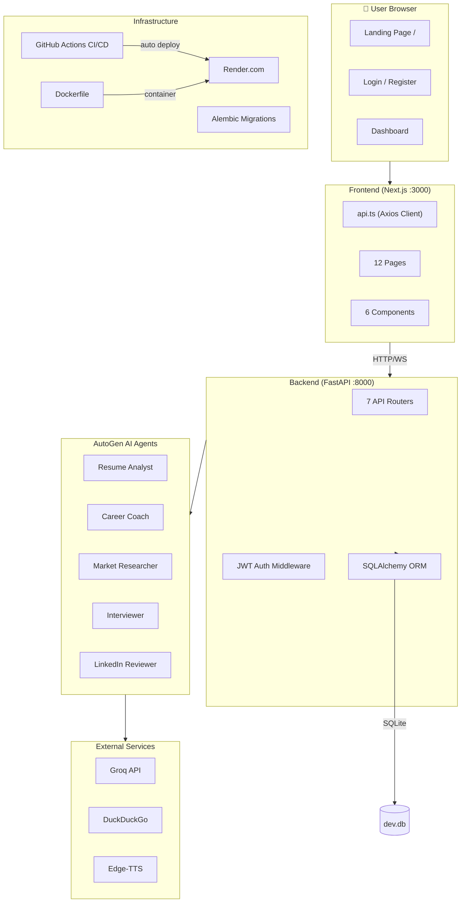

# 🧠 AI Career Mentor — Complete Project Walkthrough

---

## 1. Tech Stack

| Layer | Technology | Purpose |
|-------|-----------|---------|
| **Frontend** | Next.js 16 + React 19 + TypeScript | UI pages, dashboard, forms |
| **Styling** | Vanilla CSS (globals.css) + design tokens | Dark theme, glassmorphism, animations |
| **Backend** | FastAPI (Python 3.11) | REST API + WebSocket server |
| **AI Engine** | Microsoft AutoGen (`ag2` v0.7.5) | Multi-agent orchestration |
| **LLM** | Groq API → Llama 3.3 70B | Free AI model (GPT-4 level) |
| **Database** | SQLite (dev) + SQLAlchemy ORM | Data persistence |
| **Migrations** | Alembic | Database schema versioning |
| **Auth** | JWT (python-jose) + bcrypt | Token-based authentication |
| **Resume Parser** | pdfplumber | PDF text extraction |
| **Voice Engine** | edge-tts | Text-to-speech for interviews |
| **Web Search** | DuckDuckGo Search | Live market trends data |
| **Rate Limiting** | SlowAPI | API abuse protection |
| **Logging** | Loguru | Structured logging |
| **Testing** | Pytest + pytest-asyncio | Backend unit tests |
| **CI/CD** | GitHub Actions | Auto-deploy on push to main |
| **Hosting** | Render (backend) + Vercel (frontend) | Cloud deployment |
| **Containerization** | Docker | Backend containerized |
| **Monorepo** | npm workspaces | Root `package.json` manages frontend |

---

## 2. Architecture — Kya Kahan Connect Hua Hai



---

## 3. All 13 API Endpoints

| Method | Endpoint | Auth? | Kya Karta Hai |
|--------|----------|-------|---------------|
| `GET` | `/` | ❌ | Welcome message |
| `GET` | `/health` | ❌ | Backend + LLM status check |
| `POST` | `/auth/register` | ❌ | New user create karta hai |
| `POST` | `/auth/login` | ❌ | JWT token return karta hai |
| `POST` | `/resume/upload` | ✅ | PDF upload + text extract |
| `POST` | `/resume/analyze` | ✅ | AI resume analysis |
| `POST` | `/roadmap/generate` | ✅ | 8-week roadmap generate |
| `GET` | `/market/trends` | ✅ | Live market data (DuckDuckGo) |
| `POST` | `/career/full-analysis` | ✅ | 3-agent GroupChat pipeline |
| `WS` | `/interview/ws/{id}` | ✅ | Real-time mock interview |
| `POST` | `/linkedin/review` | ❌ | LinkedIn profile review |
| `POST` | `/resume/upload-only` | ✅ | Just extract text, no AI |

---

## 4. The 5 AI Agents

| Agent | Input | Output | Special Tool |
|-------|-------|--------|-------------|
| **Resume Analyst** | Resume text | `technical_skills`, `soft_skills`, `years_of_experience`, `top_strengths`, `skill_gaps`, `ats_score` | — |
| **Career Coach** | Role + skill gaps | 8-week roadmap (JSON array with `topic`, `resource_url`, `mini_project`) | — |
| **Market Researcher** | Role + location | `top_skills`, `salary_range`, `top_companies`, `market_trend` | DuckDuckGo search |
| **Interviewer** | Role + company | 7 questions → final score `/70` | edge-tts voice |
| **LinkedIn Reviewer** | Profile text | `headline_suggestions`, `about_section_feedback`, `profile_score`, `key_keywords` | — |

---

## 5. DevOps & Tooling — Sab Extra Chizein

### 🐳 Docker (`backend/Dockerfile`)
```dockerfile
FROM python:3.11-slim
WORKDIR /app
COPY requirements.txt .
RUN pip install --no-cache-dir -r requirements.txt
COPY . .
CMD ["sh", "-c", "alembic upgrade head && uvicorn app.main:app --host 0.0.0.0 --port 8000"]
```
- Python 3.11 slim image use karta hai
- Pehle `alembic upgrade head` run karta hai (DB migrations)
- Phir uvicorn start karta hai

### 🔄 Alembic (Database Migrations)
```
backend/
├── alembic.ini          ← Config file
├── alembic/
│   ├── env.py           ← Reads DB URL from .env
│   ├── script.py.mako   ← Migration template
│   └── versions/
│       └── 7bb65ff3_initial_tables.py  ← First migration
```
- **1 migration exists:** Creates `users`, `resumes`, `career_roadmaps`, `interview_sessions` tables
- `env.py` automatically reads `DATABASE_URL` from settings (no hardcoding!)
- Run migrations: `alembic upgrade head`
- Create new: `alembic revision --autogenerate -m "description"`

### 🚀 GitHub Actions CI/CD (`.github/workflows/backend-deploy.yml`)
```yaml
name: Deploy Backend to Render
on:
  push:
    branches: [main]
    paths: ['backend/**']
jobs:
  deploy:
    runs-on: ubuntu-latest
    steps:
      - name: POST Deploy Hook
        run: curl -X POST "${{ secrets.RENDER_DEPLOY_HOOK_URL }}"
```
- Jab bhi `main` branch pe `backend/` mein push hota hai → **auto-deploy** to Render
- `RENDER_DEPLOY_HOOK_URL` secret GitHub repo settings mein set karna padta hai

### ☁️ Render Deployment (`render.yaml`)
```yaml
services:
  - type: web
    name: ai-career-mentor-backend
    env: docker
    rootDir: backend
    plan: free
```
- Backend Docker container Render free tier pe deploy hota hai
- Frontend Vercel pe deploy hota hai (Next.js default)

### 🧪 Pytest Testing (`backend/tests/test_main.py`)
4 test cases:

| Test | Kya Check Karta Hai |
|------|-------------------|
| `test_read_root` | `/` returns welcome message |
| `test_read_health` | `/health` returns `status: ok` with provider info |
| `test_auth_protected_routes_without_token` | `/roadmap/generate` returns 401 without JWT |
| `test_market_trends_without_auth` | `/market/trends` returns 401 without JWT |

Run: `venv\Scripts\python.exe -m pytest tests/ -v`

### ⚡ Start Script (`start.bat`)
- Windows batch file — double-click se **dono servers** start ho jaate hain
- Backend → new CMD window with uvicorn
- Frontend → new CMD window with npm run dev
- Automatically prints URLs

### 📋 .env.example (`backend/.env.example`)
- New developer ke liye template — copy karke `.env` bana lo
- Azure OpenAI, Bing Search, DB URL, JWT secret sab placeholder hain

### 🔧 VSCode Settings (`.vscode/settings.json`)
- `git.ignoreLimitWarning: true` — large repo ke liye git warning disable

### 📦 Monorepo (`package.json` root)
```json
{ "workspaces": ["frontend"] }
```
- npm workspaces se root se `npm install` ek baar mein frontend dependencies bhi install ho jaati hain

---

## 6. Frontend → Backend Page Mapping

| Frontend Page | Backend API Called |
|--------------|-------------------|
| `/login` | `POST /auth/login` |
| `/register` | `POST /auth/register` |
| `/dashboard` | `GET /health` |
| `/dashboard/resume` | `POST /resume/analyze` |
| `/dashboard/roadmap` | `POST /roadmap/generate` |
| `/dashboard/market` | `GET /market/trends` |
| `/dashboard/interview` | `WS /interview/ws/{id}` |
| `/dashboard/linkedin` | `POST /linkedin/review` |
| `/dashboard/full-analysis` | `POST /resume/upload` → `POST /career/full-analysis` |
| `/dashboard/settings` | Local only (localStorage) |

---

## 7. Config System — 3 LLM Providers

`backend/app/core/config.py` supports:

| Provider | Model | How |
|----------|-------|-----|
| **Groq** (default) | Llama 3.3 70B | Free, OpenAI-compatible API |
| **OpenAI** | GPT-4o | Direct OpenAI key |
| **Azure** | GPT-4o | Azure OpenAI endpoint |

Switch provider by changing `LLM_PROVIDER` in `.env`.

---

## 8. Database Schema

| Table | Key Columns |
|-------|-------------|
| `users` | id (UUID), email, name, hashed_password, created_at |
| `resumes` | id, user_id (FK), filename, raw_text, parsed_content (JSON) |
| `career_roadmaps` | id, user_id (FK), target_role, steps (JSON) |
| `interview_sessions` | id, user_id (FK), target_role, chat_history (JSON), score, status |

---

## 9. Quick Summary

> **Tera project = Next.js UI + FastAPI Backend + 5 AutoGen AI Agents + Groq LLM + SQLite DB + Docker + GitHub CI/CD + Render Deploy + Pytest + Alembic Migrations + Edge-TTS Voice + DuckDuckGo Search**

Literally ek production-grade AI SaaS platform hai! 🚀
