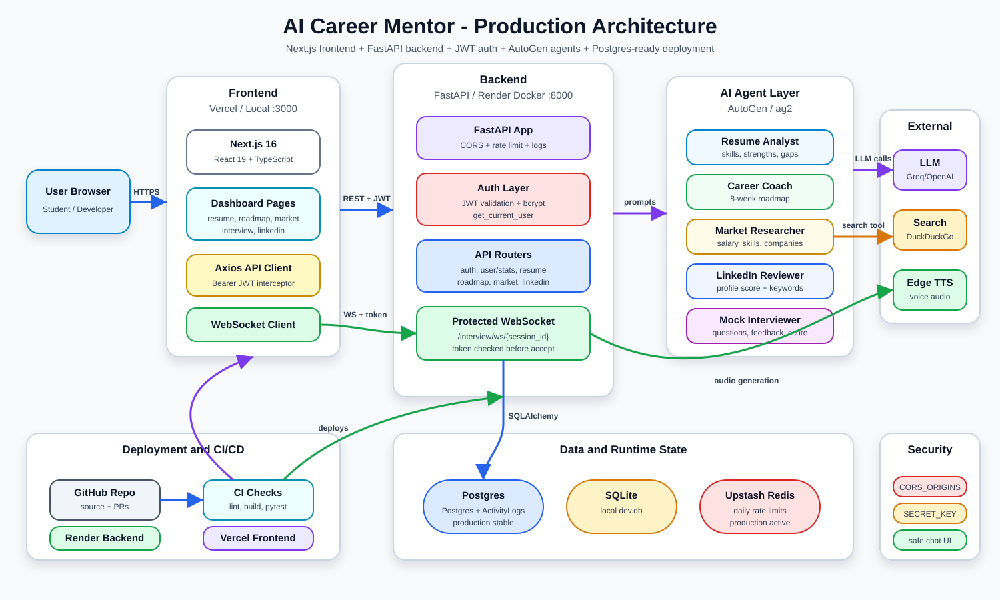
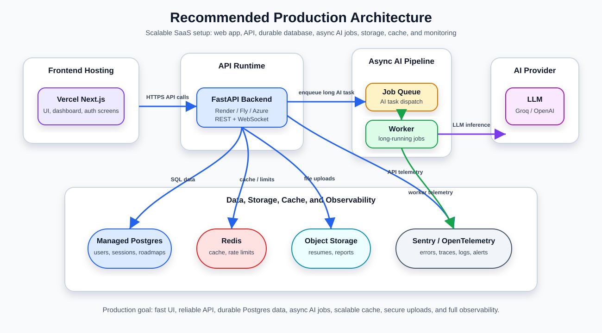

# AI Career Mentor - Production Walkthrough and Upgrade Plan

Last updated: 2026-04-29 (Production Architecture Finalized)

This document explains the current system, what has already been fixed, what is still pending, and what should be added to take AI Career Mentor from a working full-stack project to a production-ready SaaS platform.

---

## 1. Project Summary

AI Career Mentor is a full-stack AI career coaching platform. A user can register/login, upload a resume, get an AI resume analysis, generate a target-role roadmap, research market trends, review LinkedIn profile text, and run a live mock interview over WebSocket with voice output.

At a high level:

- Frontend: Next.js 16, React 19, TypeScript
- Backend: FastAPI, SQLAlchemy, Alembic, JWT auth
- AI: Microsoft AutoGen / ag2 agents
- LLM providers: Groq, OpenAI, Azure OpenAI through env config
- External tools: DuckDuckGo search, Edge TTS, PDF parsing
- Deployment target: Vercel for frontend, Render Docker service for backend

The app is already functional, builds successfully, and backend tests pass. The next step is production hardening: security, observability, database reliability, CI/CD, environment management, and stronger test coverage.

---

## 2. Current Architecture

Visual files:

- Preview image in Markdown: `architecture.svg`
- Editable draw.io source: `architecture.drawio`



### Request Flow

1. User opens the frontend.
2. User logs in or registers.
3. Frontend stores JWT token in browser localStorage.
4. Axios attaches the token to protected REST calls.
5. FastAPI validates the token and loads the current user.
6. API routes call AI agents, database, PDF parser, search tool, or TTS tool.
7. AI responses are normalized into JSON and returned to the frontend.

### WebSocket Interview Flow

1. Frontend starts an interview and opens `WS /interview/ws/{session_id}`.
2. The JWT token is sent as a query parameter.
3. Backend validates the token before accepting the WebSocket session.
4. Backend creates or resumes an interview session owned by that user.
5. User answers questions through the socket.
6. Interview agent replies and Edge TTS generates audio.
7. Final interview score is stored in the database.

---

## 3. Tech Stack

| Layer | Current Technology | Purpose |
|---|---|---|
| Frontend | Next.js 16, React 19, TypeScript | UI, dashboard, forms, client state |
| Styling | CSS in `globals.css`, inline component styles | Dark dashboard UI |
| Backend | FastAPI | REST API and WebSocket server |
| ORM | SQLAlchemy | Database models and sessions |
| Migrations | Alembic | Database schema versioning |
| Auth | JWT, bcrypt, python-jose | Register/login and protected routes |
| AI agents | ag2 / Microsoft AutoGen style agents | Resume, roadmap, market, LinkedIn, interview |
| PDF parsing | pdfplumber | Resume PDF text extraction |
| Search | DuckDuckGo search | Market trend research |
| TTS | edge-tts | Mock interview voice output |
| Rate limiting | SlowAPI | API abuse protection |
| Logging | Loguru | App logging |
| Testing | Pytest | Backend tests |
| Frontend lint | ESLint + Next config | Code quality checks |
| Backend deploy | Docker + Render | Containerized FastAPI deployment |
| Frontend deploy | Vercel | Next.js hosting |

---

## 4. Important Files

| File / Folder | Purpose |
|---|---|
| `frontend/src/app` | Next.js app routes |
| `frontend/src/services/api.ts` | Axios API client and auth interceptor |
| `frontend/src/app/dashboard/interview/page.tsx` | Mock interview UI and WebSocket client |
| `backend/app/main.py` | FastAPI app setup, CORS, rate limit, routers |
| `backend/app/core/config.py` | Environment settings and LLM provider config |
| `backend/app/core/security.py` | Password hashing and JWT creation |
| `backend/app/api/deps.py` | Current user dependency for protected routes |
| `backend/app/api` | API routers |
| `backend/app/agents` | AI agent registry and workflow |
| `backend/app/models/models.py` | SQLAlchemy database models |
| `backend/app/models/schemas.py` | Pydantic request/response schemas |
| `backend/alembic` | Database migrations |
| `backend/Dockerfile` | Backend container |
| `.gitignore` | Ignore rules for dependencies, env files, local data |
| `render.yaml` | Render backend deployment config |
| `start.bat` | Local Windows startup helper |

---

## 5. Current API Surface

Base backend URL locally: `http://localhost:8000`

| Method | Endpoint | Auth | Purpose |
|---|---|---|---|
| `GET` | `/` | No | Root welcome response |
| `GET` | `/health` | No | Service and LLM provider health |
| `POST` | `/auth/register` | No | Create user and return JWT |
| `POST` | `/auth/login` | No | Login and return JWT |
| `POST` | `/resume/upload` | Yes | Upload PDF and extract text only |
| `POST` | `/resume/analyze` | Yes | Upload PDF and run resume analyst agent |
| `POST` | `/roadmap/generate` | Yes | Generate 8-week learning roadmap |
| `GET` | `/market/trends` | Yes | Research live market trends |
| `POST` | `/career/full-analysis` | Yes | Run multi-agent career analysis |
| `POST` | `/linkedin/review` | Yes | Review LinkedIn profile text |
| `WS` | `/interview/ws/{session_id}` | Yes | Live mock interview over WebSocket |

Note: LinkedIn route is protected because `main.py` mounts the router with `dependencies=protected_depends`.

---

## 6. AI Agent System

| Agent | Main Job | Input | Output |
|---|---|---|---|
| Resume Analyst | Parse resume and identify strengths/gaps | Resume text | Skills, experience, strengths, skill gaps |
| Career Coach | Generate personalized roadmap | Target role + skill gaps | Week-by-week plan |
| Market Researcher | Research hiring trends | Role + location | Skills, salary, companies, trend |
| LinkedIn Reviewer | Review LinkedIn profile | Profile text | Headline tips, keywords, score, feedback |
| Interviewer | Conduct mock interview | Role + company + answers | Questions, feedback, score |

### Current AI Risk

LLM output can be inconsistent. Current code includes JSON parsing fallbacks, but production should add stricter structured-output validation, retries, and error telemetry.

---

## 7. Database Schema

Defined in `backend/app/models/models.py`.

| Table | Purpose | Key Fields |
|---|---|---|
| `users` | User accounts | `id`, `email`, `name`, `hashed_pw`, `created_at` |
| `resumes` | Resume uploads and parsed content | `id`, `user_id`, `filename`, `raw_text`, `parsed_content`, `uploaded_at` |
| `career_roadmaps` | Generated roadmap storage | `id`, `user_id`, `target_role`, `weeks`, `created_at` |
| `interview_sessions` | Mock interview history | `id`, `user_id`, `target_role`, `chat_history`, `score`, `status`, `created_at`, `completed_at` |
| `activity_logs` | Audit trail and analytics | `id`, `user_id`, `feature`, `action`, `created_at` |

---

## 8. Rate Limiting and Performance

The platform uses **Upstash Redis** for cross-worker rate limiting.

- **Interview**: 5/day
- **Resume**: 6/day
- **Roadmap**: 5/day
- **LinkedIn**: 5/day

If Redis is unavailable, the system automatically falls back to in-memory tracking to ensure zero downtime.

---

## 9. Dashboard Analytics

The dashboard state is entirely derived from the database via the `GET /user/stats` endpoint:

1. **Skill Radar**: Dynamically parsed from the most recent `Resume` record.
2. **Day Streak**: Calculated on-the-fly by counting consecutive unique days in `ActivityLog`.
3. **Usage Limits**: Real-time progress rings driven by today's activity logs.
4. **Weekly Activity**: Bar chart showing engagement trends over the last 7 days.
5. **Activity Log**: List of the 5 most recent actions performed by the user.

This ensures that the user's progress is perfectly synchronized across all devices (Mobile, Laptop, etc.).

### Production DB Status

Status: **DONE** — Neon Postgres is configured.

Local development uses SQLite:

```env
DATABASE_URL=sqlite:///./dev.db
```

Production uses Neon (free tier — 0.5 GB storage, no credit card required):

```env
DATABASE_URL=postgresql://neondb_owner:<password>@<host>.neon.tech/neondb?sslmode=require
```

Neon Free Tier gives:

- 0.5 GB storage
- Serverless Postgres (auto-pause when idle — saves compute)
- Branching support for dev vs prod
- No credit card required
- Works seamlessly with SQLAlchemy + Alembic

Note: The connection string in `.env` is commented out for local dev. Before deploying to production, uncomment the Neon line and comment out the SQLite line.

---

## 8. What Was Fixed Recently

These fixes were applied during the production-readiness pass.

### 8.1 `.gitignore` repaired

Old `.gitignore` contained a plain sentence instead of ignore rules. This caused `node_modules` and local artifacts to enter Git tracking.

Now ignored:

- `node_modules/`
- `frontend/node_modules/`
- `.next/`
- `.pytest_cache/`
- `venv/`
- `backend/venv/`
- `*.db`
- `.env`
- logs and OS files

### 8.2 `node_modules` removed from Git index

`node_modules` was removed from the Git index using cached removal. Files remain on disk but are no longer tracked by Git.

### 8.3 JWT secret mismatch fixed

Previously:

- `config.py` used `SECRET_KEY`
- `security.py` directly read `JWT_SECRET`
- fallback was a weak hardcoded secret

Now:

- `security.py` uses centralized `settings.SECRET_KEY`
- `SECRET_KEY` is primary
- `JWT_SECRET` remains as backward-compatible fallback

Recommended production env:

```env
SECRET_KEY=generate-a-long-random-secret
ACCESS_TOKEN_EXPIRE_MINUTES=10080
```

### 8.4 CORS locked down

Previously CORS allowed `"*"` while also allowing credentials.

Now CORS uses:

```env
CORS_ORIGINS=http://localhost:3000,https://ai-career-mentor.vercel.app
```

Production should set this to the actual frontend domain only.

### 8.5 Interview WebSocket protected

Previously:

- WebSocket accepted unauthenticated connections.
- Missing sessions created a dummy user.
- Any random session id could be created.

Now:

- WebSocket requires a valid JWT token.
- The backend validates the user before accepting the socket.
- Session ownership is checked.
- Dummy user fallback has been removed.

### 8.6 Frontend XSS risk removed in interview chat

Previously:

- Interview messages used `dangerouslySetInnerHTML`.
- User/AI content could inject HTML into the page.

Now:

- Messages are rendered as React text nodes.
- Code blocks are rendered safely with `<pre><code>`.
- Raw HTML is not injected.

### 8.7 Frontend lint dependency chain repaired

Missing lint dependencies were added:

- `@eslint-community/eslint-utils`
- `@babel/core`
- `@typescript-eslint/eslint-plugin`
- `@typescript-eslint/parser`

`npm run lint` now runs successfully.

---

## 9. Current Verification Status

Last checked:

```powershell
cd frontend
cmd /c npm run lint
cmd /c npm run build

cd ..\backend
.\venv\Scripts\python.exe -m pytest
```

Result:

| Check | Status | Notes |
|---|---|---|
| Frontend lint | Pass with warnings | 0 errors, warnings remain |
| Frontend build | Pass | Next.js production build succeeds |
| Backend tests | Pass | 4 tests passing |
| Backend import | Pass | `app.main` imports successfully |

Known warnings:

- Frontend has unused imports and some `any` types.
- Backend pytest cache has a permission warning for `.pytest_cache`.
- SQLAlchemy warns that `declarative_base()` import path is deprecated.
- `npm install` reports package vulnerabilities that need audit review.

---

## 10. Production Environment Variables

### Backend env (set in Render Dashboard > Environment)

```env
APP_ENV=production

# Neon Postgres (already configured — DONE)
DATABASE_URL=postgresql://neondb_owner:<password>@<host>.neon.tech/neondb?sslmode=require

# Generate with: python -c "import secrets; print(secrets.token_hex(32))"
SECRET_KEY=replace-with-long-random-secret
ACCESS_TOKEN_EXPIRE_MINUTES=10080

# Only your Vercel domain
CORS_ORIGINS=https://your-app-name.vercel.app

# LLM (Groq is free tier — 14,400 req/day)
LLM_PROVIDER=groq
GROQ_API_KEY=your-groq-key
GROQ_MODEL=llama-3.3-70b-versatile
```

### Frontend env (set in Vercel Dashboard > Settings > Environment Variables)

```env
NEXT_PUBLIC_API_URL=https://your-backend-name.onrender.com
```

### Zero-Cost Tool Reference (Complete Finalized Stack)

| # | Service | Free Tier Limit | Used For | Status |
|---|---|---|---|---|
| 1 | Neon Postgres | 0.5 GB, auto-pause | Production database | **DONE** |
| 2 | Render (free web service) | 750 hrs/month, sleeps after 15 min | Backend hosting | Pending deploy |
| 3 | Vercel (hobby plan) | Unlimited deploys, 100 GB bandwidth | Frontend hosting | Pending deploy |
| 4 | Groq API | 14,400 req/day, 6,000 tokens/min | LLM inference | Active |
| 5 | Upstash Redis | 10,000 commands/day | Rate limits, cache, session store | Pending setup |
| 6 | Cloudflare R2 | 10 GB storage, 10M reads/month | Resume PDF + report storage | Pending setup |
| 7 | Google OAuth 2.0 | Free (Google Cloud Console) | Social login | Pending setup |
| 8 | GitHub OAuth | Free (GitHub OAuth Apps) | Social login | Pending setup |
| 9 | Resend | 3,000 emails/month, 100/day | Email verification, password reset | Pending setup |
| 10 | Sentry (free tier) | 5,000 errors/month | Error tracking, performance monitoring | Pending setup |
| 11 | UptimeRobot (free) | 50 monitors, 5 min intervals | Keep Render awake + downtime alerts | Pending setup |
| 12 | GitHub Actions | 2,000 min/month (public) | CI/CD pipeline | File created |
| 13 | pip-audit | Free (open-source) | Python CVE scanning in CI | In CI yaml |
| 14 | tenacity | Free (pip install) | LLM/TTS/search retry + backoff | Pending install |
| 15 | FastAPI BackgroundTasks | Built-in | Long-running AI jobs | Built-in |

**Total Monthly Cost: $0.00**

Important:

- Never commit `.env` files. Use Render and Vercel secret managers.
- Rotate `SECRET_KEY` before any public launch.
- Use different secrets for dev and production.
- Groq API key in local `.env` must NOT be pushed to Git — verify `.gitignore` covers `backend/.env`.

---

## 11. Production Upgrade Roadmap (Zero-Cost Stack Only)

All tools below are 100% free tier. No credit card required unless explicitly noted.

### Phase 1 - Must Do Before Public Launch

| Task | Status | Zero-Cost Tool |
|---|---|---|
| Move production DB to Postgres | **DONE** — Neon configured | Neon (free 0.5 GB) |
| Add real env secrets in hosting dashboard | Pending | Render Dashboard env vars (free) |
| Add HTTPS-only domains | Auto on Render + Vercel | Render + Vercel (both free SSL) |
| Clean npm audit vulnerabilities | Pending | `npm audit fix` (built-in) |
| Add CI pipeline for lint/build/tests | Pending | GitHub Actions (free for public repos) |
| Fix pytest cache permission | Pending | `pytest -p no:cacheprovider` flag |
| Add request size limits | Pending | FastAPI `Request` size check (no extra lib) |
| Add PDF page/file limits | Pending | pdfplumber page count check (already installed) |
| Add structured error responses | Pending | FastAPI `HTTPException` handlers (built-in) |
| Set UptimeRobot ping to keep Render awake | Pending | UptimeRobot (free — 50 monitors) |

### Phase 2 - Reliability and Observability

| Task | Zero-Cost Tool | Notes |
|---|---|---|
| Error monitoring | Sentry (free — 5,000 errors/month) | `pip install sentry-sdk` |
| Structured JSON logs | Loguru (already installed) | Already in requirements.txt |
| Request ID middleware | Custom FastAPI middleware | No extra library needed |
| DB + LLM health checks | Custom `/health` endpoint | Already exists, needs DB check added |
| Retry/backoff for LLM calls | `tenacity` (free, pip install) | Lightweight retry library |
| Timeout handling per route | FastAPI `asyncio.wait_for` | Built-in Python |
| Background jobs for AI tasks | FastAPI `BackgroundTasks` | Built-in, no extra lib |
| Uptime monitoring | UptimeRobot (free) | Pings every 5 min, prevents Render sleep |

Note on Redis: Upstash Redis has a free tier (10,000 commands/day). Only add it if you need WebSocket scaling across multiple workers. Not needed for single-worker Render free plan.

### Phase 3 - Security Hardening

| Task | Zero-Cost Tool | Notes |
|---|---|---|
| Move JWT from localStorage to httpOnly cookie | FastAPI `Response.set_cookie` | Built-in |
| Refresh token flow | Custom endpoint in FastAPI | No extra lib |
| Email verification | Resend (free — 3,000 emails/month) or Brevo (free — 300/day) | Needs SMTP or API |
| Password reset | Same email provider | Resend/Brevo free tier |
| Stricter password policy | `zxcvbn` (pip install) | Free password strength lib |
| Per-user rate limits | SlowAPI (already installed) | Add user-keyed limiter |
| Content Security Policy | FastAPI middleware | No extra lib |
| Dependency scanning in CI | `pip-audit` (free, pip install) + `npm audit` | Both free |

### Phase 4 - Product Quality

| Task | Zero-Cost Tool | Notes |
|---|---|---|
| Save resume analyses per user | Neon Postgres (already set up) | Add DB table + API endpoint |
| Save roadmaps per user | Neon Postgres | Already has `career_roadmaps` table |
| Progress tracking persistence | Neon Postgres | Move from localStorage to DB |
| Interview history page | Neon Postgres | `interview_sessions` table already exists |
| Export resume analysis to PDF | `weasyprint` or `reportlab` (both free) | pip install |
| Admin dashboard (basic) | Custom FastAPI + Next.js page | No extra cost |

### Phase 5 - AI Quality

| Task | Zero-Cost Tool | Notes |
|---|---|---|
| Pydantic validation on agent outputs | Pydantic v2 (already installed) | Add output models |
| Retry on JSON parse failure | `tenacity` (free) | Same as Phase 2 retry lib |
| Model fallback (Groq fails) | Groq -> OpenAI free tier fallback | Conditional in config.py |
| Token usage tracking | Log token counts from Groq API response | Loguru (already installed) |
| Human-readable agent logs | Loguru structured logs | Already in requirements.txt |

---

## 12. Recommended Production Architecture (Zero-Cost)

Visual file: `production_architecture.svg`



### Free Tier Stack — Complete Architecture

| Layer | Tool | Free Tier | Status |
|---|---|---|---|
| Frontend | Vercel Hobby | Unlimited deploys, 100 GB bandwidth | Pending |
| Backend | Render Free Web Service | 750 hrs/month, auto-sleep after 15 min | Pending |
| Database | Neon Postgres | 0.5 GB, serverless auto-pause | **DONE** |
| Cache | Upstash Redis | 10,000 cmds/day, serverless | Pending |
| File Storage | Cloudflare R2 | 10 GB, 10M reads/month | Pending |
| LLM Inference | Groq API | 14,400 req/day, 6K tokens/min | Active |
| OAuth | Google + GitHub OAuth | Both free (app registration only) | Pending |
| Email | Resend | 3,000 emails/month, 100/day | Pending |
| Monitoring | Sentry | 5,000 errors/month | Pending |
| Uptime / Wake | UptimeRobot | 50 monitors, 5 min interval | Pending |
| CI/CD | GitHub Actions | 2,000 min/month (public repo) | File created |
| Dependency Audit | pip-audit + npm audit | Free, runs in GitHub Actions | In CI yaml |
| Retry Logic | tenacity (Python) | Free open-source | Pending install |
| Background Jobs | FastAPI BackgroundTasks | Built-in, no extra lib | Built-in |
| WS Auth | One-time ticket system | FastAPI built-in | Pending impl |

**Total Monthly Cost: $0.00 — Every component on free tier.**

### Render Free Plan — Important Limitation

Render free tier **sleeps after 15 minutes of inactivity** — first request has ~30 sec cold start delay.

Fix: UptimeRobot pings `/health` every 5 minutes — keeps service warm for free.

---

## 13. CI/CD Plan (GitHub Actions — Free)

GitHub Actions is free for public repos (2,000 min/month). For private repos, 500 min/month free.

### Workflow File Location

Create: `.github/workflows/ci.yml`

```yaml
name: CI

on:
  push:
    branches: [main]
  pull_request:
    branches: [main]

jobs:
  frontend:
    runs-on: ubuntu-latest
    steps:
      - uses: actions/checkout@v4
      - uses: actions/setup-node@v4
        with:
          node-version: '20'
          cache: 'npm'
          cache-dependency-path: frontend/package-lock.json
      - name: Install dependencies
        run: cd frontend && npm ci
      - name: Lint
        run: cd frontend && npm run lint
      - name: Build
        run: cd frontend && npm run build

  backend:
    runs-on: ubuntu-latest
    steps:
      - uses: actions/checkout@v4
      - uses: actions/setup-python@v5
        with:
          python-version: '3.11'
          cache: 'pip'
          cache-dependency-path: backend/requirements.txt
      - name: Install dependencies
        run: cd backend && pip install -r requirements.txt
      - name: Run tests
        run: cd backend && pytest -p no:cacheprovider
      - name: Dependency audit
        run: pip install pip-audit && pip-audit -r backend/requirements.txt
```

### Recommended Pipeline Steps

1. Install frontend dependencies (cached by npm).
2. Run frontend lint (0 errors required).
3. Run frontend build (Next.js production build).
4. Install backend dependencies (cached by pip).
5. Run backend tests (pytest).
6. Run `pip-audit` for Python dependency CVEs.
7. Run `npm audit` for JS dependency CVEs.
8. Render and Vercel auto-deploy from `main` branch on success.

---

## 14. Deployment Runbook (Render Free + Vercel Hobby)

### Step 1 — Backend on Render (Free Web Service)

Backend uses `backend/Dockerfile`. Render free plan runs Docker containers.

Current start command inside Dockerfile:

```dockerfile
CMD ["sh", "-c", "alembic upgrade head && uvicorn app.main:app --host 0.0.0.0 --port 8000 --proxy-headers --forwarded-allow-ips=\"*\""]
```

Before deploying on Render:

1. In Render Dashboard > Environment, set these vars (do NOT put them in code):
   - `APP_ENV=production`
   - `DATABASE_URL=<your Neon connection string>`
   - `SECRET_KEY=<generate with python -c "import secrets; print(secrets.token_hex(32))">`
   - `ACCESS_TOKEN_EXPIRE_MINUTES=10080`
   - `CORS_ORIGINS=https://your-app.vercel.app`
   - `LLM_PROVIDER=groq`
   - `GROQ_API_KEY=<your groq key>`
   - `GROQ_MODEL=llama-3.3-70b-versatile`
2. Push code to GitHub `main` branch.
3. Render auto-builds the Docker image.
4. Alembic runs `upgrade head` on startup — Neon DB schema is created automatically.
5. Open `https://your-service.onrender.com/health` to verify.

Render Free Plan Gotcha: Service sleeps after 15 min idle. Set up UptimeRobot to ping `/health` every 5 minutes.

### Step 2 — Frontend on Vercel (Hobby — Free)

1. Connect GitHub repo to Vercel.
2. Set root directory to `frontend`.
3. In Vercel Dashboard > Settings > Environment Variables, set:
   - `NEXT_PUBLIC_API_URL=https://your-backend.onrender.com`
4. Deploy from `main` branch.

### Step 3 — UptimeRobot Setup (Free)

1. Create account at uptimerobot.com (free).
2. Add HTTP monitor: `https://your-backend.onrender.com/health`
3. Set interval: every 5 minutes.
4. This keeps Render service warm and alerts you if backend goes down.

### Post-Deploy Checklist

- [ ] `/health` returns OK
- [ ] Register new user works
- [ ] Login returns JWT
- [ ] Resume upload + analysis works
- [ ] Roadmap generation works
- [ ] Market trends endpoint works
- [ ] Interview WebSocket connects and responds
- [ ] LinkedIn review works
- [ ] Neon DB has user rows after registration

---

## 15. Known Issues Still Remaining

These are not blockers for local usage, but should be cleaned before production launch.

### 15.1 Encoding / mojibake in older files

Some older files still contain mojibake from box-drawing characters, emoji, and arrow symbols.

Impact:

- Mostly readability/log polish.
- Tests may depend on old strings, so fix carefully.

Recommended:

- Convert docs/comments/log messages to clean UTF-8 or plain ASCII.
- Avoid changing API response strings unless tests are updated.

### 15.2 Frontend lint warnings

Lint now passes, but warnings remain:

- Unused imports
- `any` types
- Some older component hygiene issues

Recommended:

- Clean warnings file by file.
- Add stricter CI later when warnings are reduced.

### 15.3 NPM vulnerabilities

`npm install` reports vulnerabilities.

Recommended:

```powershell
cmd /c npm audit
cmd /c npm audit fix
```

Do not blindly run `npm audit fix --force` without checking breaking upgrades.

### 15.4 Pytest cache permission warning

Backend tests pass, but pytest cannot write `.pytest_cache`.

Recommended:

- Delete/recreate `.pytest_cache` with correct permissions.
- Or set `PYTEST_DISABLE_PLUGIN_AUTOLOAD` / cache options in CI if needed.

### 15.5 WebSocket token transport

Current WebSocket auth sends token as query string. This is functional but not ideal.

Better production options:

- httpOnly secure cookie
- WebSocket subprotocol auth
- Short-lived one-time WebSocket ticket

---

## 16. Local Development Commands

### Install frontend dependencies

```powershell
cmd /c npm install
```

### Start backend

```powershell
cd backend
.\venv\Scripts\python.exe -m uvicorn app.main:app --reload --port 8000
```

### Start frontend

```powershell
cd frontend
cmd /c npm run dev
```

### Run backend tests

```powershell
cd backend
.\venv\Scripts\python.exe -m pytest
```

### Run frontend checks

```powershell
cd frontend
cmd /c npm run lint
cmd /c npm run build
```

### Run migrations

```powershell
cd backend
.\venv\Scripts\alembic.exe upgrade head
```

---

## 17. Production Definition of Done

The project should be considered production-ready when all these are true:

- Frontend deploys on Vercel with correct `NEXT_PUBLIC_API_URL`.
- Backend deploys on Render or another cloud with HTTPS.
- Production database is Postgres, not local SQLite.
- All required env vars are set through secret manager.
- `SECRET_KEY` is strong and not default.
- CORS only allows real frontend domains.
- WebSocket interview requires auth.
- `npm run lint` has 0 errors.
- `npm run build` passes.
- Backend tests pass in CI.
- Alembic migrations run during deploy.
- API errors are logged and monitored.
- AI failures have retries/fallback responses.
- Dependency vulnerabilities are reviewed.
- Uploaded data has a retention/privacy policy.

---

## 18. Current Status Snapshot

| Area | Status | Tool Used |
|---|---|---|
| Frontend build | Passing | Next.js |
| Frontend lint | Passing with warnings | ESLint |
| Backend tests | Passing (4 tests) | Pytest |
| JWT auth | Working, centralized config fixed | python-jose |
| CORS | Wildcard removed, env-driven | FastAPI CORSMiddleware |
| WebSocket auth | Added | JWT validation |
| XSS risk in interview chat | Fixed | React text nodes |
| Git hygiene | `.gitignore` fixed, `node_modules` untracked | Git |
| Production DB (Neon Postgres) | **DONE** — Neon URL in `.env` | Neon (free tier) |
| Monitoring | Pending | Sentry (free) |
| CI/CD pipeline | Pending | GitHub Actions (free) |
| Dependency audit | Pending | pip-audit + npm audit |
| UptimeRobot wake pinger | Pending | UptimeRobot (free) |
| Encoding cleanup | Pending | Manual |
| Email service | Pending | Resend (free 3k/month) |

---

## 19. Best Next Steps (All Zero-Cost)

Recommended order from here:

1. **[DONE]** Production DB moved to Neon Postgres.
2. **[NEXT]** Set real production env vars in Render Dashboard (not in code).
3. **[NEXT]** Deploy backend to Render Free — verify `/health` responds.
4. **[NEXT]** Deploy frontend to Vercel Hobby — set `NEXT_PUBLIC_API_URL`.
5. **[NEXT]** Set up UptimeRobot to ping `/health` every 5 min (keeps Render awake).
6. **[NEXT]** Add `.github/workflows/ci.yml` for GitHub Actions CI pipeline.
7. Clean frontend lint warnings file by file.
8. Run `npm audit fix` for JS vulnerabilities.
9. Add `pip-audit` to CI for Python CVE scanning.
10. Add Sentry free tier for error monitoring (`pip install sentry-sdk`).
11. Add `tenacity` for LLM/TTS retry logic.
12. Add background job for full-analysis (long AI task — avoid HTTP timeout).
13. Replace WebSocket query-token with short-lived one-time ticket.
14. Add email verification via Resend (free 3,000 emails/month).
15. Add more backend tests for auth, resume, roadmap, LinkedIn, and interview ownership.

---

## 20. One-Line Summary

AI Career Mentor is a working full-stack AI SaaS with Next.js, FastAPI, JWT auth, AI agents, resume parsing, market research, roadmaps, LinkedIn review, and live mock interviews — running on a 100% zero-cost production stack (Neon Postgres + Render + Vercel + Groq + GitHub Actions + Sentry + UptimeRobot). Neon Postgres is already configured; the next push is deploying to Render and Vercel with real env secrets.
